# docling-graph — Combined Documentation

> Auto-generated single-file bundle of every Markdown file under `docs/`. Intended for loading as context into LLMs (Claude, Codex, etc.). Each section is delimited by a header indicating its source path.

## Table of Contents

- `docs/index.md`
- `docs/introduction/index.md`
- `docs/introduction/architecture.md`
- `docs/introduction/key-concepts.md`
- `docs/introduction/quickstart.md`
- `docs/introduction/use-cases.md`
- `docs/fundamentals/index.md`
- `docs/fundamentals/extraction-process/batch-processing.md`
- `docs/fundamentals/extraction-process/chunking-strategies.md`
- `docs/fundamentals/extraction-process/delta-extraction.md`
- `docs/fundamentals/extraction-process/document-conversion.md`
- `docs/fundamentals/extraction-process/extraction-backends.md`
- `docs/fundamentals/extraction-process/index.md`
- `docs/fundamentals/extraction-process/model-merging.md`
- `docs/fundamentals/extraction-process/staged-extraction.md`
- `docs/fundamentals/graph-management/export-formats.md`
- `docs/fundamentals/graph-management/graph-analysis.md`
- `docs/fundamentals/graph-management/graph-conversion.md`
- `docs/fundamentals/graph-management/index.md`
- `docs/fundamentals/graph-management/neo4j-integration.md`
- `docs/fundamentals/graph-management/visualization.md`
- `docs/fundamentals/installation/api-keys.md`
- `docs/fundamentals/installation/basic-setup.md`
- `docs/fundamentals/installation/gpu-setup.md`
- `docs/fundamentals/installation/index.md`
- `docs/fundamentals/installation/requirements.md`
- `docs/fundamentals/pipeline-configuration/backend-selection.md`
- `docs/fundamentals/pipeline-configuration/configuration-basics.md`
- `docs/fundamentals/pipeline-configuration/configuration-examples.md`
- `docs/fundamentals/pipeline-configuration/docling-settings.md`
- `docs/fundamentals/pipeline-configuration/export-configuration.md`
- `docs/fundamentals/pipeline-configuration/index.md`
- `docs/fundamentals/pipeline-configuration/input-formats.md`
- `docs/fundamentals/pipeline-configuration/model-configuration.md`
- `docs/fundamentals/pipeline-configuration/processing-modes.md`
- `docs/fundamentals/schema-definition/advanced-patterns.md`
- `docs/fundamentals/schema-definition/best-practices.md`
- `docs/fundamentals/schema-definition/entities-vs-components.md`
- `docs/fundamentals/schema-definition/field-definitions.md`
- `docs/fundamentals/schema-definition/index.md`
- `docs/fundamentals/schema-definition/relationships.md`
- `docs/fundamentals/schema-definition/staged-extraction-schema.md`
- `docs/fundamentals/schema-definition/template-basics.md`
- `docs/fundamentals/schema-definition/validation.md`
- `docs/usage/index.md`
- `docs/usage/advanced/custom-backends.md`
- `docs/usage/advanced/custom-exporters.md`
- `docs/usage/advanced/custom-stages.md`
- `docs/usage/advanced/error-handling.md`
- `docs/usage/advanced/index.md`
- `docs/usage/advanced/performance-tuning.md`
- `docs/usage/advanced/testing.md`
- `docs/usage/advanced/trace-data-debugging.md`
- `docs/usage/api/batch-processing.md`
- `docs/usage/api/index.md`
- `docs/usage/api/llm-model-config.md`
- `docs/usage/api/pipeline-config.md`
- `docs/usage/api/programmatic-examples.md`
- `docs/usage/api/run-pipeline.md`
- `docs/usage/cli/cli-recipes.md`
- `docs/usage/cli/convert-command.md`
- `docs/usage/cli/index.md`
- `docs/usage/cli/init-command.md`
- `docs/usage/cli/inspect-command.md`
- `docs/usage/examples/billing-document.md`
- `docs/usage/examples/docling-document-input.md`
- `docs/usage/examples/id-card.md`
- `docs/usage/examples/index.md`
- `docs/usage/examples/insurance-policy.md`
- `docs/usage/examples/markdown-input.md`
- `docs/usage/examples/rheology_research.md`
- `docs/usage/examples/url-input.md`
- `docs/reference/index.md`
- `docs/reference/config.md`
- `docs/reference/converters.md`
- `docs/reference/exceptions.md`
- `docs/reference/exporters.md`
- `docs/reference/extractors.md`
- `docs/reference/llm-clients.md`
- `docs/reference/pipeline.md`
- `docs/reference/protocols.md`
- `docs/community/index.md`
- `docs/community/github-workflow.md`
- `docs/community/release-process.md`
- `docs/examples/README.md`
- `docs/assets/flowcharts/architecture.md`
- `docs/assets/flowcharts/chunk_batcher.md`
- `docs/assets/flowcharts/config_flow.md`
- `docs/assets/flowcharts/conversion_process.md`
- `docs/assets/flowcharts/delta_extraction.md`
- `docs/assets/flowcharts/doc_chunker.md`
- `docs/assets/flowcharts/exporters.md`
- `docs/assets/flowcharts/extension_points.md`
- `docs/assets/flowcharts/extraction_flow.md`
- `docs/assets/flowcharts/four_stage_pipeline.md`
- `docs/assets/flowcharts/graph_converter.md`
- `docs/assets/flowcharts/graph_pipeline.md`
- `docs/assets/flowcharts/input_normalization.md`
- `docs/assets/flowcharts/llm_backend.md`
- `docs/assets/flowcharts/llm_clients.md`
- `docs/assets/flowcharts/llm_consolidation.md`
- `docs/assets/flowcharts/many_to_one_mode.md`
- `docs/assets/flowcharts/model_decision_tree.md`
- `docs/assets/flowcharts/ocr_pipeline.md`
- `docs/assets/flowcharts/one_to_one_mode.md`
- `docs/assets/flowcharts/pipeline_flow.md`
- `docs/assets/flowcharts/pipeline_stages.md`
- `docs/assets/flowcharts/processing_mode_tree.md`
- `docs/assets/flowcharts/programmatic_merge.md`
- `docs/assets/flowcharts/staged_extraction.md`
- `docs/assets/flowcharts/vision_pipeline.md`
- `docs/assets/flowcharts/vlm_backend.md`

---


<!-- ===== FILE: docs/index.md ===== -->
# `docs/index.md`

# Docling Graph Documentation

<p align="center">
  
</p>

## What is Docling Graph?

Docling-Graph turns documents into validated **Pydantic** objects, then builds a **directed knowledge graph** with explicit semantic relationships.

This transformation enables high-precision use cases in **chemistry, finance, and legal** domains, where AI must capture exact entity connections (compounds and reactions, instruments and dependencies, properties and measurements) **rather than rely on approximate text embeddings**.

This toolkit supports two extraction paths: **local VLM extraction** via Docling, and **LLM-based extraction** using either local runtimes (vLLM, Ollama, LM Studio) or API providers (Mistral, OpenAI, Gemini, IBM WatsonX), all orchestrated through a flexible, config-driven pipeline.

---

### Key Features

- **✍🏻 Multi-Format Input**: Ingest PDFs, images, URLs, raw text, Markdown and more.
- **🧠 Flexible Extraction:** VLM or LLM-based (vLLM, Ollama, Mistral, Gemini, WatsonX, etc.)
- **🔨 Smart Graphs:** Convert Pydantic models to NetworkX graphs with stable node IDs
- **📦 Multiple Export:** CSV (Neo4j-compatible), Cypher scripts, JSON, Markdown
- **📊 Rich Visualizations:** Interactive HTML and detailed Markdown reports
- **⚙️ Type-Safe Configuration:** Pydantic-based validation

---

## Quick Navigation

### Getting Started

<div class="grid cards" markdown>

- **[Installation →](fundamentals/installation/index.md)**

    Set up your environment with uv package manager

- **[Quick Start →](introduction/quickstart.md)**

    Run your first extraction in 5 minutes

- **[Architecture →](introduction/architecture.md)**

    Understand the pipeline stages and components

- **[Key Concepts →](introduction/key-concepts.md)**

    Learn how documents flow through the system

</div>

### Core Documentation

<div class="grid cards" markdown>

- **[Introduction](introduction/index.md)**

    Overview, architecture, and core concepts

- **[Fundamentals](fundamentals/index.md)**

    Installation, schema definition, pipeline configuration, extraction, and more

- **[Usage](usage/index.md)**

    CLI reference, Python API, examples, and advanced topics

- **[Reference](reference/index.md)**

    Detailed API documentation

- **[Community](community/index.md)**

    Contributing and development guide

</div>

---

## Resources

### Documentation
- **[GitHub Repository](https://github.com/docling-project/docling-graph)** - Source code and issues
- **[PyPI Package](https://pypi.org/project/docling-graph/)** - Install via pip/uv
- **[Contributing Guidelines](https://github.com/docling-project/docling-graph/blob/main/.github/CONTRIBUTING.md)** - How to contribute

### Community
- **[GitHub Issues](https://github.com/docling-project/docling-graph/issues)** - Report bugs and request features
- **[GitHub Discussions](https://github.com/docling-project/docling-graph/discussions)** - Ask questions and share ideas

### Related Projects
- **[Docling](https://github.com/docling-project/docling)** - Document processing engine
- **[Pydantic](https://pydantic.dev)** - Data validation library
- **[NetworkX](https://networkx.org/)** - Graph library

---

## Next Steps

1. **[Install Docling Graph →](fundamentals/installation/index.md)**
2. **[Follow the Quick Start →](introduction/quickstart.md)**
3. **[Create Your First Template →](fundamentals/schema-definition/index.md)**
4. **[Explore Examples →](usage/examples/index.md)**

---

## Need Help?

- **Installation Issues**: See [Installation Guide](fundamentals/installation/index.md)
- **Template Questions**: See [Schema Definition](fundamentals/schema-definition/index.md)
- **Configuration Help**: See [Pipeline Configuration](fundamentals/pipeline-configuration/index.md)
- **Error Messages**: See [Error Handling](usage/advanced/error-handling.md)

---


<!-- ===== FILE: docs/introduction/index.md ===== -->
# `docs/introduction/index.md`

# Introduction to Docling Graph

Welcome to Docling Graph! This section introduces the core concepts of knowledge graph extraction from documents.

## What is Docling Graph?

Docling Graph transforms unstructured documents into validated **knowledge graphs** with precise semantic relationships. Unlike traditional approaches that convert text to embeddings (losing exact relationships), Docling Graph preserves explicit entity connections.

**Key Advantage**: Answer questions like "who issued what to whom" with exact relationships, not approximate embeddings.

## Why Knowledge Graphs?

Knowledge graphs are essential for domains requiring exact entity connections:

- **Chemistry**: Track compounds, reactions, and measurements
- **Finance/Legal**: Map instruments, obligations, and dependencies
- **Research**: Connect authors, methodologies, and results
- **Healthcare**: Relate patients, treatments, and outcomes

## How It Works

Docling Graph follows a clear pipeline:

1. **[Installation](../fundamentals/installation/index.md)** - Set up environment
2. **[Schema Definition](../fundamentals/schema-definition/index.md)** - Create Pydantic templates
3. **[Pipeline Configuration](../fundamentals/pipeline-configuration/index.md)** - Configure backend and mode
4. **[Extraction Process](../fundamentals/extraction-process/index.md)** - Run extraction
5. **[Graph Management](../fundamentals/graph-management/index.md)** - Export and visualize

## Quick Example

```python
from docling_graph import run_pipeline, PipelineConfig
from pydantic import BaseModel, Field

class Person(BaseModel):
    model_config = {'is_entity': True, 'graph_id_fields': ['name']}
    name: str = Field(description="Person's full name")
    email: str = Field(description="Email address")

config = PipelineConfig(
    source="document.pdf",
    template=Person,
    backend="llm",
    inference="remote"
)

context = run_pipeline(config)
print(f"Extracted {context.knowledge_graph.number_of_nodes()} nodes")
```

## Learn More

- **[Key Concepts](key-concepts.md)** - Entities, components, nodes, edges
- **[Use Cases](use-cases.md)** - Domain-specific examples
- **[Architecture](architecture.md)** - System design
- **[Quick Start](quickstart.md)** - 5-minute tutorial

---

**Ready to start?** Begin with [installation](../fundamentals/installation/index.md) or try the [quick start](quickstart.md).

---


<!-- ===== FILE: docs/introduction/architecture.md ===== -->
# `docs/introduction/architecture.md`

# Architecture

## System Architecture

Docling Graph follows a modular, pipeline-based architecture with clear separation of concerns:


## Core Components

### Document Processor

Converts documents to structured format using Docling with OCR or Vision pipelines.

**Location:** `docling_graph/core/extractors/document_processor.py`

### Extraction Backends

**VLM Backend:** Direct extraction from images using vision-language models (local only)
**LLM Backend:** Text-based extraction supporting local (vLLM, Ollama) and remote APIs

**Location:** `docling_graph/core/extractors/backends/`

### Processing Strategies

**One-to-One:** Each page produces a separate model (invoice batches, ID cards)
**Many-to-One:** Multiple pages merged into single model (rheology researchs, reports)

**Location:** `docling_graph/core/extractors/strategies/`

### Document Chunker

Splits large documents while preserving semantic coherence and respecting structure.

**Location:** `docling_graph/core/extractors/document_chunker.py`

### Graph Converter

Transforms Pydantic models to NetworkX graphs with stable node IDs and automatic deduplication.

**Location:** `docling_graph/core/converters/graph_converter.py`

### Exporters & Visualizers

Export graphs in CSV, Cypher, JSON formats and generate interactive HTML visualizations.

**Location:** `docling_graph/core/exporters/`, `docling_graph/core/visualizers/`


### Complete Pipeline Flow

--8<-- "docs/assets/flowcharts/pipeline_flow.md"


### Stage-by-Stage Breakdown

#### Stage 1: Template Loading
```python
# Load Pydantic template
template = import_template("module.Template")
# Validate structure
validate_template(template)
```

#### Stage 2: Document Conversion
```python
# Convert using Docling
doc = processor.convert_to_docling_doc(source)
# Extract markdown
markdown = processor.extract_full_markdown(doc)
```

#### Stage 3: Extraction
```python
# Choose backend
if backend == "vlm":
    models = vlm_backend.extract_from_document(source, template)
else:
    models = llm_backend.extract_from_markdown(markdown, template)
```

#### Stage 4: Consolidation (if needed)
```python
if len(models) > 1:
    final_model = programmatic_merge(models)
```

#### Stage 5: Graph Conversion
```python
# Convert to graph
graph, metadata = converter.pydantic_list_to_graph([final_model])
```

#### Stage 6: Export
```python
# Export in multiple formats
csv_exporter.export(graph, output_dir)
cypher_exporter.export(graph, output_dir)
json_exporter.export(graph, output_dir)
```


## Protocol-Based Design

Docling Graph uses Python Protocols for type-safe, flexible interfaces:

```python
class ExtractionBackendProtocol(Protocol):
    """Protocol for extraction backends"""
    def extract_from_document(self, source: str, template: Type[BaseModel]) -> List[BaseModel]: ...
```

**Benefits:** Type safety, easy mocking, clear contracts, flexible implementations


**Location**: `docling_graph/config.py`

**Purpose**: Type-safe configuration using Pydantic

```python
class PipelineConfig(BaseModel):
    """Single source of truth for all defaults"""
    source: str
    template: Union[str, Type[BaseModel]]
    backend: Literal["llm", "vlm"] = "llm"
    inference: Literal["local", "remote"] = "local"
    processing_mode: Literal["one-to-one", "many-to-one"] = "many-to-one"
    use_chunking: bool = True
    export_format: Literal["csv", "cypher"] = "csv"
    output_dir: str = "outputs"
    # ... additional settings
```

## Error Handling

**Location**: `docling_graph/exceptions.py`

**Hierarchy**:
```
DoclingGraphError (base)
├── ConfigurationError
├── ClientError
├── ExtractionError
├── ValidationError
├── GraphError
└── PipelineError
```

**Structured Errors**:
```python
try:
    run_pipeline(config)
except ClientError as e:
    print(f"Error: {e.message}")
    print(f"Details: {e.details}")
    print(f"Cause: {e.cause}")
```


## Extensibility

Docling Graph is designed for extension:

- **LLM Providers:** Implement `LLMClientProtocol`
- **Pipeline Stages:** Implement `PipelineStage`
- **Export Formats:** Extend `BaseExporter`

See [Custom Backends](../usage/advanced/custom-backends.md) for details.


Now that you understand the architecture:

1. **[Installation](../fundamentals/installation/index.md)** - Set up your environment
2. **[Schema Definition](../fundamentals/schema-definition/index.md)** - Create Pydantic templates
3. **[Pipeline Configuration](../fundamentals/pipeline-configuration/index.md)** - Configure the pipeline

---


<!-- ===== FILE: docs/introduction/key-concepts.md ===== -->
# `docs/introduction/key-concepts.md`

# Key Concepts

## Core Terminology

### Entity

An **entity** is a unique, identifiable object that you want to track individually in your knowledge graph.

**Characteristics**:
- Has a stable identity (defined by `graph_id_fields`)
- Represents real-world objects (people, organizations, documents)
- Tracked individually even if properties are similar

**Example**:
```python
class Person(BaseModel):
    model_config = {
        'is_entity': True,
        'graph_id_fields': ['name', 'date_of_birth']
    }
    name: str
    date_of_birth: str
    email: str
```

Two persons with the same name but different birth dates are **different entities**.

### Component

A **component** is a value object that is deduplicated by its content.

**Characteristics**:
- No unique identity (set `is_entity=False`)
- Represents shared values (addresses, amounts, measurements)
- Identical components share the same graph node

**Example**:
```python
class Address(BaseModel):
    model_config = {'is_entity': False'}
    street: str
    city: str
    postal_code: str
```

Two people at "123 Main St, Boston, 02101" share the **same Address node**.

### Node

A **node** is a vertex in the knowledge graph. Every Pydantic model instance becomes a node.

**Node Properties**:
- **ID**: Unique identifier (generated from `graph_id_fields` or content hash)
- **Type**: The Pydantic class name (e.g., "Person", "Organization")
- **Attributes**: All field values from the Pydantic model

**Example Node**:
```
ID: Person_JohnDoe_1990-01-15
Type: Person
Attributes:
  - name: "John Doe"
  - date_of_birth: "1990-01-15"
  - email: "john@example.com"
```

### Edge

An **edge** is a directed relationship between two nodes in the graph.

**Edge Properties**:
- **Source**: The node where the relationship starts
- **Target**: The node where the relationship ends
- **Label**: The relationship type (e.g., "ISSUED_BY", "SENT_TO")
- **Direction**: Edges are directional (A → B is different from B → A)

**Example Edge**:
```
Source: Document_INV001
Label: ISSUED_BY
Target: Organization_AcmeCorp
```

This represents: "Document INV001 was issued by Acme Corp"

### Graph

A **graph** is the complete network of nodes and edges representing your extracted knowledge.

**Graph Structure**:
```
Document_INV001
  ├─ ISSUED_BY → Organization_AcmeCorp
  ├─ SENT_TO → Person_JohnDoe
  └─ CONTAINS_LINE → LineItem_001
      └─ HAS_PRODUCT → Product_Widget
```

## Pydantic Templates

### What is a Template?

A **Pydantic template** is a Python class that serves three purposes:

1. **Extraction Schema**: Tells the LLM/VLM what data to extract
2. **Validation Rules**: Ensures data quality and consistency
3. **Graph Structure**: Defines how entities and relationships map to nodes and edges

### Template Example

```python
from pydantic import BaseModel, Field
from typing import List

def edge(label: str, **kwargs):
    """Helper to define graph relationships"""
    return Field(..., json_schema_extra={"edge_label": label}, **kwargs)

class Organization(BaseModel):
    """An organization entity"""
    model_config = {
        'is_entity': True,
        'graph_id_fields': ['name']
    }
    
    name: str = Field(
        description="Legal name of the organization",
        examples=["Acme Corp", "Tech Solutions Ltd"]
    )
    
    tax_id: str = Field(
        description="Tax identification number",
        examples=["123456789", "FR12345678901"]
    )

class Invoice(BaseModel):
    """An invoice document"""
    model_config = {
        'is_entity': True,
        'graph_id_fields': ['invoice_number']
    }
    
    invoice_number: str = Field(
        description="Unique invoice identifier",
        examples=["INV-2024-001", "INV-123456"]
    )
    
    # This creates an edge in the graph
    issuer: Organization = edge(
        label="ISSUED_BY",
        description="Organization that issued this invoice"
    )
```

**Result**: When extracted, this creates:
- An `Invoice` node
- An `Organization` node
- An `ISSUED_BY` edge connecting them

## Extraction Backends

### VLM (Vision-Language Model)

**What**: Uses Docling's NuExtract models to extract data directly from document images.

**Best For**:
- Structured forms (invoices, ID cards, receipts)
- Documents with clear key-value pairs
- Small documents (1-3 pages)

**Characteristics**:
- Processes documents directly (no markdown conversion)
- Local inference only
- Fast for small documents
- Excellent for forms

### LLM (Large Language Model)

**What**: Uses language models to extract data from markdown/text representations.

**Best For**:
- Complex narratives (rheology researchs, reports)
- Large documents (5+ pages)
- Documents requiring deep understanding

**Characteristics**:
- Requires markdown conversion first
- Local (vLLM, Ollama) or remote (OpenAI, Mistral, Gemini, WatsonX)
- Supports chunking for large documents
- Better for complex extraction

## Processing Modes

### One-to-One

**What**: Process each page independently, producing one Pydantic model per page.

**When to Use**:
- Each page contains independent information
- Document is a batch of separate items (e.g., multiple invoices in one PDF)
- You need page-level granularity

**Example**:
```
3-page PDF with 3 invoices
→ 3 separate Invoice models
→ 3 separate subgraphs
```

### Many-to-One

**What**: Process all pages together, producing one merged Pydantic model for the entire document.

**When to Use**:
- Document spans multiple pages with related content
- Information flows across pages
- You want a document-level view

**Example**:
```
10-page rheology research
→ 1 merged ResearchPaper model
→ 1 unified graph
```

## Chunking

### Why Chunking?

Large documents may exceed LLM context limits. **Chunking** splits the document into manageable pieces while preserving semantic coherence.

### Hybrid Chunking Strategy

Docling Graph uses a sophisticated approach:

1. **Docling Segmentation**: Respects document structure (sections, tables, lists)
2. **Semantic Boundaries**: Groups related content together
3. **Token-Aware**: Respects LLM context limits
4. **Context Preservation**: Maintains coherence across chunks

### Consolidation

After extracting from multiple chunks, results must be merged:

**Programmatic Merge** (Fast):
- Lists: Concatenate and deduplicate
- Scalars: First non-null value wins
- Objects: Recursive merge

**LLM Consolidation** (Intelligent):
- Uses LLM to intelligently merge results
- Better handles semantic duplicates
- Slower but more accurate

## Graph Construction

### Node ID Generation

**For Entities** (with `graph_id_fields`):
```python
# Person with graph_id_fields=['name', 'dob']
Person(name="John Doe", dob="1990-01-15")
→ Node ID: "Person_JohnDoe_1990-01-15"
```

**For Components** (content-based):
```python
# Address with is_entity=False
Address(street="123 Main St", city="Boston")
→ Node ID: "Address_{content_hash}"
```

### Deduplication

**Entities**: Deduplicated by `graph_id_fields`
- Same ID fields → Same node

**Components**: Deduplicated by content
- Same field values → Same node

### Example Graph

Given these models:

```python
author1 = Author(name="Dr. Smith")
author2 = Author(name="Dr. Jones")
paper = Paper(
    title="Advanced AI",
    authors=[author1, author2]
)
```

Resulting graph:

```
Paper_AdvancedAI
  ├─ HAS_AUTHOR → Author_DrSmith
  └─ HAS_AUTHOR → Author_DrJones
```

## Export Formats

### CSV
- **Purpose**: Neo4j bulk import
- **Files**: `nodes.csv`, `edges.csv`
- **Best For**: Production database loading

### Cypher
- **Purpose**: Neo4j script execution
- **Files**: `document_graph.cypher`
- **Best For**: Development and incremental updates

### JSON
- **Purpose**: General-purpose data exchange
- **Files**: `graph.json`
- **Best For**: API integration, archival

### HTML
- **Purpose**: Interactive visualization
- **Files**: `graph.html`
- **Best For**: Exploration and presentation

## Next Steps

Now that you understand the core concepts:

1. **[Use Cases](use-cases.md)** - See domain-specific examples
2. **[Architecture](architecture.md)** - Understand system design
3. **[Installation](../fundamentals/installation/index.md)** - Set up your environment

---


<!-- ===== FILE: docs/introduction/quickstart.md ===== -->
# `docs/introduction/quickstart.md`

# Quickstart


## Overview

Get started with docling-graph in **5 minutes** by extracting structured data from a simple billing document.

**What You'll Learn:**
- Basic template creation
- Running your first extraction
- Viewing results

**Prerequisites:**
- Python 3.10+
- A sample billing document (PDF or image)

---

## Step 1: Installation

```bash
pip install docling-graph

# Verify installation
docling-graph --version
```

---

## Step 2: Create a Template

Create a file `simple_billing_doc.py`:

```python
"""Simple billing document template for quickstart."""

from pydantic import BaseModel, Field

class SimpleBillingDoc(BaseModel):
    """A simple billing document model."""
    
    document_no: str = Field(
        description="The unique document identifier",
        examples=["INV-001", "2024-001"]
    )
    
    date: str = Field(
        description="Document date in any format",
        examples=["2024-01-15", "January 15, 2024"]
    )
    
    total: float = Field(
        description="Total amount to be paid",
        examples=[1234.56, 999.99]
    )
    
    currency: str = Field(
        description="Currency code",
        examples=["USD", "EUR", "GBP"]
    )
```

---

## Step 3: Run Extraction

### Option A: Using CLI

```bash
# Process billing document
docling-graph convert billing_doc.pdf \
    --template "simple_billing_doc.SimpleBillingDoc" \
    --output-dir "quickstart_output"
```

### Option B: Using Python API

Create `run_quickstart.py`:

```python
"""Quickstart extraction script."""

from docling_graph import run_pipeline, PipelineConfig

# Configure pipeline
config = PipelineConfig(
    source="billing_doc.pdf",
    template="simple_billing_doc.SimpleBillingDoc"
)

# Run extraction
print("Processing billing document...")
context = run_pipeline(config)
graph = context.knowledge_graph
print(f"✅ Complete! Extracted {graph.number_of_nodes()} nodes")
```

Run it:

```bash
python run_quickstart.py
```

---

## Troubleshooting

**Template Not Found:**
```bash
# Ensure template is in current directory or use absolute path
docling-graph convert billing_doc.pdf --template "$(pwd)/simple_billing_doc.SimpleBillingDoc"
```

**No Data Extracted:**
```bash
# Use verbose logging to debug
docling-graph --verbose convert billing_doc.pdf --template simple_billing_doc.SimpleBillingDoc
```

**API Key Error:**
```bash
# Use local inference (default) or set API key
export MISTRAL_API_KEY='your-key'
```


### Improve Your Template

Add more fields:

```python
class ImprovedBillingDoc(BaseModel):
    """Improved billing document with more fields."""

    document_no: str = Field(description="Document number")
    date: str = Field(description="Document date")
    total: float = Field(description="Total amount")
    currency: str = Field(description="Currency")
    
    # New fields
    issuer_name: str = Field(
        description="Company that issued the document",
        examples=["Acme Corp", "ABC Company"]
    )
    
    client_name: str = Field(
        description="Client receiving the document",
        examples=["John Doe", "XYZ Inc"]
    )
    
    subtotal: float = Field(
        description="Amount before tax",
        examples=[1000.00]
    )
    
    tax_amount: float = Field(
        description="Tax amount",
        examples=[234.56]
    )
```

### Add Relationships

Create nested entities:

```python
class Address(BaseModel):
    """Address component."""
    street: str
    city: str
    postal_code: str

class Organization(BaseModel):
    """Organization entity."""
    name: str
    address: Address

def edge(label: str, **kwargs):
    """Helper for graph edges."""
    from pydantic import Field
    return Field(..., json_schema_extra={"edge_label": label}, **kwargs)

class BillingDoc(BaseModel):
    """Billing document with relationships."""
    document_no: str
    total: float
    issued_by: Organization = edge(label="ISSUED_BY")
```

### Try Different Backends

```bash
# VLM for images (faster)
docling-graph convert billing_doc.jpg \
    --template "simple_billing_doc.SimpleBillingDoc" \
    --backend vlm

# LLM for complex documents
docling-graph convert billing_doc.pdf \
    --template "simple_billing_doc.SimpleBillingDoc" \
    --backend llm \
    --inference remote
```

---

## Learn More

- **[Billing Document Extraction](../usage/examples/billing-document.md)** - Full billing document with relationships
- **[Schema Definition](../fundamentals/schema-definition/index.md)** - Template creation guide
- **[CLI Reference](../usage/cli/index.md)** - All CLI commands

---


<!-- ===== FILE: docs/introduction/use-cases.md ===== -->
# `docs/introduction/use-cases.md`

# Use Cases

## Why Domain-Specific Knowledge Graphs?

Different domains have unique requirements for knowledge representation:

- **Chemistry**: Track exact molecular structures and reaction conditions
- **Finance**: Map complex instrument dependencies and risk relationships
- **Legal**: Maintain precise contractual obligations and party relationships
- **Research**: Connect methodologies, results, and citations with full context

Traditional text embeddings lose these precise relationships. Knowledge graphs preserve them.


## Chemistry & Materials Science

Extract materials, measurements, and experimental relationships from rheology researchs.

**Key Entities:** Material, Measurement, Experiment
**Relationships:** USES_MATERIAL, HAS_MEASUREMENT
**Use Case:** Track exact material-property relationships and experimental conditions

## Finance & Legal

Extract parties, obligations, and contractual relationships from legal documents.

**Key Entities:** Party, Obligation, Contract
**Relationships:** OBLIGATED_BY, OBLIGATED_TO, HAS_PARTY
**Use Case:** Track party-obligation relationships and contractual dependencies

## Research & Academia

Extract authors, methodologies, and findings from academic papers.

**Key Entities:** Author, Methodology, Result, ResearchPaper
**Relationships:** HAS_AUTHOR, USES_METHODOLOGY, HAS_RESULT
**Use Case:** Track author collaboration networks and research methodologies

## Healthcare & Medical

Extract patient information, diagnoses, and treatments from medical records.

**Key Entities:** Patient, Diagnosis, Treatment, MedicalRecord
**Relationships:** FOR_PATIENT, HAS_DIAGNOSIS, HAS_TREATMENT
**Use Case:** Track patient-diagnosis-treatment relationships

## Insurance & Risk

Extract coverage details, exclusions, and policy relationships.

**Key Entities:** Coverage, Exclusion, InsurancePolicy
**Relationships:** HELD_BY, PROVIDES_COVERAGE, HAS_EXCLUSION
**Use Case:** Track policy-coverage relationships and risk exposure

## Common Patterns

### 📍 Document → Entities → Properties

```
Document
  ├─ HAS_ENTITY → Entity1
  │   ├─ HAS_PROPERTY → Property1
  │   └─ HAS_PROPERTY → Property2
  └─ HAS_ENTITY → Entity2
      └─ HAS_PROPERTY → Property3
```

**Used in**: Rheology researchs, technical reports, specifications

### 📍 Party → Relationship → Party

```
Party1 ─[RELATIONSHIP]→ Party2
```

**Used in**: Contracts, agreements, organizational charts

### 📍 Process → Steps → Outcomes

```
Process
  ├─ HAS_STEP → Step1
  ├─ HAS_STEP → Step2
  └─ HAS_OUTCOME → Outcome
```

**Used in**: Procedures, experiments, workflows

### Pattern 4: Hierarchical Structures

```
Parent
  ├─ HAS_CHILD → Child1
  │   └─ HAS_CHILD → Grandchild1
  └─ HAS_CHILD → Child2
```

**Used in**: Organizational structures, document sections, taxonomies


## Choosing Your Use Case

**Questions to Ask:**

1. What entities do I need to track?
2. What relationships matter?
3. What queries will I run?
4. What level of detail do I need?


Ready to implement your use case?

1. **[Schema Definition](../fundamentals/schema-definition/index.md)** - Create your Pydantic templates
2. **[Examples](../usage/examples/index.md)** - See complete working examples
3. **[Architecture](architecture.md)** - Understand the system design

---


<!-- ===== FILE: docs/fundamentals/index.md ===== -->
# `docs/fundamentals/index.md`

# Fundamentals

Master the core concepts and essential setup for Docling Graph.

## Topics

1. **[Installation](installation/index.md)** - Environment setup and dependencies
2. **[Schema Definition](schema-definition/index.md)** - Create Pydantic templates
3. **[Pipeline Configuration](pipeline-configuration/index.md)** - Configure backends and modes
4. **[Extraction Process](extraction-process/index.md)** - Document conversion and extraction
5. **[Graph Management](graph-management/index.md)** - Export and visualize graphs

---

**Start here:** [Installation Guide](installation/index.md)

---


<!-- ===== FILE: docs/fundamentals/extraction-process/batch-processing.md ===== -->
# `docs/fundamentals/extraction-process/batch-processing.md`

# Batch Processing


## Overview

**Batch processing** optimizes extraction by grouping multiple chunks into single LLM calls, reducing API overhead while maximizing context window utilization.

**In this guide:**
- Why batching matters
- Adaptive batching algorithm
- Context window optimization
- Performance tuning
- Best practices

---

## Why Batching Matters

### The API Call Problem

Without batching:

```python
# 10 chunks = 10 API calls
for chunk in chunks:  # 10 iterations
    model = llm.extract(chunk)  # 10 API calls
    models.append(model)

# Cost: 10 × API_COST
# Time: 10 × LATENCY
```

With batching:

```python
# 10 chunks = 3 batches = 3 API calls
batches = batcher.batch_chunks(chunks)  # Group into 3 batches
for batch in batches:  # 3 iterations
    model = llm.extract(batch.combined_text)  # 3 API calls
    models.append(model)

# Cost: 3 × API_COST (70% savings)
# Time: 3 × LATENCY (70% faster)
```

---

## ChunkBatcher

### What is ChunkBatcher?

**ChunkBatcher** intelligently groups chunks to fit within context windows, minimizing API calls while preserving semantic boundaries.

### Architecture

--8<-- "docs/assets/flowcharts/chunk_batcher.md"

---

## Basic Usage

### Initialize Batcher

```python
from docling_graph.core.extractors import ChunkBatcher

# Create batcher with context constraints
batcher = ChunkBatcher(
    context_limit=8000,          # Total context window
    system_prompt_tokens=500,    # System prompt overhead
    response_buffer_tokens=500,  # Response space
    merge_threshold=0.95         # Merge if <95% utilized (default)
)

# Available for content: 8000 - 500 - 500 = 7000 tokens
```

### Batch Chunks

```python
# Batch your chunks
batches = batcher.batch_chunks(chunks)

print(f"Reduced {len(chunks)} chunks to {len(batches)} batches")

# Process batches
for batch in batches:
    print(f"Batch {batch.batch_id}: {batch.chunk_count} chunks")
    print(f"  Tokens: {batch.total_tokens}")
    print(f"  Utilization: {batch.total_tokens / 7000 * 100:.1f}%")
```

---

## Batching Algorithm

### Phase 1: Greedy Packing

**Strategy:** Pack chunks sequentially until context limit reached

```python
current_batch = []
current_tokens = 0

for chunk in chunks:
    chunk_tokens = estimate_tokens(chunk) + OVERHEAD
    
    if current_tokens + chunk_tokens > available_tokens:
        # Start new batch
        batches.append(current_batch)
        current_batch = [chunk]
        current_tokens = chunk_tokens
    else:
        # Add to current batch
        current_batch.append(chunk)
        current_tokens += chunk_tokens
```

**Result:** Candidate batches that fit context window

---

### Phase 2: Merge Undersized

**Strategy:** Combine small batches to improve utilization

```python
threshold = available_tokens * merge_threshold  # e.g., 95% (default)

for batch in batches:
    if batch.total_tokens < threshold:
        # Try to merge with next batch
        if can_merge_with_next(batch):
            merge_batches(batch, next_batch)
```

**Result:** Optimized batches with high utilization

---

## ChunkBatch Object

### Structure

```python
@dataclass
class ChunkBatch:
    batch_id: int              # Batch sequence number
    chunks: List[str]          # Chunk texts
    total_tokens: int          # Estimated tokens
    chunk_indices: List[int]   # Original indices
    
    @property
    def chunk_count(self) -> int:
        return len(self.chunks)
    
    @property
    def combined_text(self) -> str:
        # Chunks with separators
        return "\n\n---CHUNK BOUNDARY---\n\n".join(chunks)
```

### Usage

```python
batch = batches[0]

print(f"Batch ID: {batch.batch_id}")
print(f"Chunks: {batch.chunk_count}")
print(f"Tokens: {batch.total_tokens}")
print(f"Indices: {batch.chunk_indices}")

# Get combined text for LLM
combined = batch.combined_text
```

---

## Token Estimation

### Estimation Methods

#### 1. Heuristic (Default)

```python
# Fast but approximate
tokens = len(text) // 4  # ~4 chars per token
```

**Pros:** Fast, no dependencies  
**Cons:** Approximate (±20% error)

#### 2. Custom Tokenizer

```python
from transformers import AutoTokenizer

# Accurate token counting
tokenizer = AutoTokenizer.from_pretrained("mistralai/Mistral-7B-v0.1")

def count_tokens(text: str) -> int:
    return len(tokenizer.encode(text))

# Use with batcher
batches = batcher.batch_chunks(chunks, tokenizer_fn=count_tokens)
```

**Pros:** Accurate  
**Cons:** Slower, requires tokenizer

---

## Configuration Parameters

### Context Limit

**Definition:** Total context window size

```python
batcher = ChunkBatcher(
    context_limit=8000  # Mistral: 32K, GPT-4: 128K, Llama: 8K
)
```

**How to choose:**
- Use model's actual context limit
- Be conservative (leave buffer)
- Account for prompt overhead

---

### System Prompt Tokens

**Definition:** Tokens used by system prompt

```python
batcher = ChunkBatcher(
    context_limit=8000,
    system_prompt_tokens=500  # Typical: 300-700
)
```

**Includes:**
- Extraction instructions
- Schema definition
- Example format

---

### Response Buffer Tokens

**Definition:** Space reserved for LLM response

```python
batcher = ChunkBatcher(
    context_limit=8000,
    response_buffer_tokens=500  # Typical: 500-1000
)
```

**Depends on:**
- Schema complexity
- Expected output size
- Safety margin

---

### Merge Threshold

**Definition:** Minimum utilization before merging (default: **95%**)

```python
batcher = ChunkBatcher(
    context_limit=8000,
    merge_threshold=0.95  # Merge if <95% utilized (default)
)
```

**Effects:**
- **Higher (0.95-0.98):** More batches, better fit, less merging
- **Lower (0.80-0.90):** Fewer batches, more aggressive merging

**Default:** 95% for all providers. This ensures efficient batching while maintaining good chunk boundaries.

---

## Complete Examples

### 📍 Basic Batching

```python
from docling_graph.core.extractors import ChunkBatcher, DocumentChunker, DocumentProcessor

# Convert and chunk document
processor = DocumentProcessor(docling_config="ocr")
document = processor.convert_to_docling_doc("large_document.pdf")

chunker = DocumentChunker(provider="mistral")
chunks = chunker.chunk_document(document)

print(f"Created {len(chunks)} chunks")

# Batch chunks
batcher = ChunkBatcher(
    context_limit=32000,  # Mistral Large
    system_prompt_tokens=500,
    response_buffer_tokens=500,
    merge_threshold=0.95  # Default: 95%
)

batches = batcher.batch_chunks(chunks)

print(f"Reduced to {len(batches)} batches")
print(f"API call reduction: {(1 - len(batches)/len(chunks)) * 100:.0f}%")
```

### 📍 With Custom Tokenizer

```python
from docling_graph.core.extractors import ChunkBatcher
from transformers import AutoTokenizer

# Load tokenizer
tokenizer = AutoTokenizer.from_pretrained("mistralai/Mistral-7B-Instruct-v0.2")

def count_tokens(text: str) -> int:
    return len(tokenizer.encode(text))

# Batch with accurate token counting
batcher = ChunkBatcher(context_limit=8000)
batches = batcher.batch_chunks(chunks, tokenizer_fn=count_tokens)

print(f"Accurate batching: {len(batches)} batches")
```

### 📍 Integration with Extraction

```python
from docling_graph.core.extractors.backends import LlmBackend
from docling_graph.llm_clients import get_client
from docling_graph.llm_clients.config import resolve_effective_model_config

# Initialize backend
effective = resolve_effective_model_config("mistral", "mistral-large-latest")
client = get_client("mistral")(model_config=effective)
backend = LlmBackend(llm_client=client)

# Batch chunks
batcher = ChunkBatcher(context_limit=32000)
batches = batcher.batch_chunks(chunks)

# Extract from batches
models = []
for batch in batches:
    print(f"Processing batch {batch.batch_id} ({batch.chunk_count} chunks)")
    
    model = backend.extract_from_markdown(
        markdown=batch.combined_text,
        template=InvoiceTemplate,
        context=f"batch {batch.batch_id}",
        is_partial=True
    )
    
    if model:
        models.append(model)

print(f"Extracted {len(models)} models from {len(batches)} batches")
```

### 📍 Automatic Batching in Pipeline

```python
from docling_graph import run_pipeline, PipelineConfig

# Batching happens automatically
config = PipelineConfig(
    source="large_document.pdf",
    template="templates.BillingDocument",
    backend="llm",
    inference="remote",
    use_chunking=True  # Enables automatic batching
)

run_pipeline(config)

# ChunkBatcher is used internally to optimize API calls
```

---

## Performance Optimization

### Batch Size vs API Calls

| Chunks | No Batching | With Batching | Reduction |
|:-------|:------------|:--------------|:----------|
| 10 | 10 calls | 3 calls | 70% |
| 20 | 20 calls | 5 calls | 75% |
| 50 | 50 calls | 12 calls | 76% |
| 100 | 100 calls | 23 calls | 77% |

### Cost Savings

```python
# Example: Mistral Large API
API_COST_PER_CALL = $0.002  # Input tokens

# Without batching: 50 chunks
cost_without = 50 * API_COST_PER_CALL = $0.10

# With batching: 12 batches
cost_with = 12 * API_COST_PER_CALL = $0.024

# Savings: 76%
```

---

## Context Utilization

### Measuring Utilization

```python
batches = batcher.batch_chunks(chunks)

for batch in batches:
    utilization = batch.total_tokens / batcher.available_tokens * 100
    print(f"Batch {batch.batch_id}: {utilization:.1f}% utilized")

# Average utilization
avg_util = sum(b.total_tokens for b in batches) / (len(batches) * batcher.available_tokens) * 100
print(f"Average utilization: {avg_util:.1f}%")
```

### Optimization Tips

```python
# ✅ Good - High utilization (90-95%)
batcher = ChunkBatcher(
    context_limit=8000,
    merge_threshold=0.95  # Default: merge if <95% utilized
)

# ❌ Bad - Low utilization (<70%)
batcher = ChunkBatcher(
    context_limit=8000,
    merge_threshold=0.5  # Too aggressive merging
)
```

---

## Best Practices

### 👍 Match Context Limit to Model

```python
# ✅ Good - Use actual model limits
if model == "mistral-large":
    context_limit = 32000
elif model == "gpt-4-turbo":
    context_limit = 128000
elif model == "llama3.1:8b":
    context_limit = 8000

batcher = ChunkBatcher(context_limit=context_limit)
```

### 👍 Leave Adequate Buffer

```python
# ✅ Good - Conservative buffers
batcher = ChunkBatcher(
    context_limit=8000,
    system_prompt_tokens=500,  # Adequate
    response_buffer_tokens=500  # Safe margin
)

# ❌ Bad - Insufficient buffer
batcher = ChunkBatcher(
    context_limit=8000,
    system_prompt_tokens=100,  # Too small
    response_buffer_tokens=100  # Risky
)
```

### 👍 Use Merge Threshold Wisely

```python
# ✅ Good - Default balance (recommended)
batcher = ChunkBatcher(
    merge_threshold=0.95  # Default: 95% - good balance
)

# For many small chunks (more aggressive merging)
batcher = ChunkBatcher(
    merge_threshold=0.85  # More aggressive merging
)

# For few large chunks (less merging)
batcher = ChunkBatcher(
    merge_threshold=0.98  # Minimal merging, better fit
)
```

### 👍 Monitor Batch Statistics

```python
# ✅ Good - Check batching effectiveness
batches = batcher.batch_chunks(chunks)

reduction = (1 - len(batches) / len(chunks)) * 100
print(f"API call reduction: {reduction:.0f}%")

if reduction < 50:
    print("Warning: Low batching efficiency")
```

---

## Troubleshooting

### 🐛 Too Many Batches

Batching not reducing API calls enough

**Solution:**
```python
# Lower merge threshold for more aggressive merging
batcher = ChunkBatcher(
    context_limit=8000,
    merge_threshold=0.85  # More aggressive (default is 0.95)
)

# Or increase context limit if model supports it
batcher = ChunkBatcher(
    context_limit=16000  # Use larger context
)
```

### 🐛 Batches Too Large

Batches exceeding context limit

**Solution:**
```python
# Increase buffer sizes
batcher = ChunkBatcher(
    context_limit=8000,
    system_prompt_tokens=700,  # More buffer (was 500)
    response_buffer_tokens=700  # More buffer (was 500)
)
```

### 🐛 Low Utilization

Batches not filling context window

**Solution:**
```python
# Increase merge threshold (closer to default 0.95)
batcher = ChunkBatcher(
    context_limit=8000,
    merge_threshold=0.98  # Less merging, better fit (default is 0.95)
)

# Or use smaller chunks
chunker = DocumentChunker(
    provider="mistral",
    max_tokens=3000  # Smaller chunks
)
```

---

## Advanced Techniques

### Custom Batch Processing

```python
from docling_graph.core.extractors import ChunkBatcher

def process_with_retry(batches, backend, template):
    """Process batches with retry logic."""
    models = []
    
    for batch in batches:
        max_retries = 3
        for attempt in range(max_retries):
            try:
                model = backend.extract_from_markdown(
                    markdown=batch.combined_text,
                    template=template,
                    context=f"batch {batch.batch_id}",
                    is_partial=True
                )
                
                if model:
                    models.append(model)
                    break
                    
            except Exception as e:
                if attempt == max_retries - 1:
                    print(f"Failed batch {batch.batch_id} after {max_retries} attempts")
                else:
                    print(f"Retry {attempt + 1} for batch {batch.batch_id}")
    
    return models
```

---

## Next Steps

Now that you understand batch processing:

1. **[Graph Management →](../graph-management/index.md)** - Work with knowledge graphs
2. **[Export Formats →](../graph-management/export-formats.md)** - Export graphs
3. **[Visualization →](../graph-management/visualization.md)** - Visualize graphs

---


<!-- ===== FILE: docs/fundamentals/extraction-process/chunking-strategies.md ===== -->
# `docs/fundamentals/extraction-process/chunking-strategies.md`

# Chunking Strategies


## Overview

**Chunking** is the process of intelligently splitting documents into optimal pieces for LLM processing. Docling Graph uses **structure-aware chunking** that preserves document semantics, tables, and hierarchies.

**In this guide:**
- Why chunking matters
- Structure-aware vs naive chunking
- Real tokenizer integration
- Token management with safety margins
- Schema-aware chunking
- Provider-specific optimization
- Performance tuning

!!! tip "New: Real Tokenizer Integration"
    Docling Graph now uses real tokenizers for accurate token counting instead of character-based heuristics. This prevents context window overflows and enables more efficient chunk packing with a 20% safety margin.

---

## Why Chunking Matters

### The Context Window Problem

LLMs have limited context windows:

| Provider | Model | Context Limit |
|:---------|:------|:--------------|
| **OpenAI** | GPT-4 Turbo | 128K tokens |
| **Mistral** | Mistral Large | 32K tokens |
| **Ollama** | Llama 3.1 8B | 8K tokens |
| **IBM** | Granite 4.0 | 8K tokens |

**Problem:** Most documents exceed these limits.

**Solution:** Intelligent chunking.

---

## Chunking Approaches

### ❌ Naive Chunking

```python
# ❌ Bad - Breaks tables and structure
def naive_chunk(text, max_chars=1000):
    return [text[i:i+max_chars] for i in range(0, len(text), max_chars)]
```

**Problems:**
- Breaks tables mid-row
- Splits lists
- Ignores semantic boundaries
- Loses context

---

### ✅ Structure-Aware Chunking

```python
# ✅ Good - Preserves structure
from docling_graph.core.extractors import DocumentChunker

chunker = DocumentChunker(
    provider="mistral",
    max_tokens=4096
)

chunks = chunker.chunk_document(document)
```

**Benefits:**
- Preserves tables
- Keeps lists intact
- Respects sections
- Maintains context

---

## DocumentChunker

### Basic Usage

```python
import json

from docling_graph.core.extractors import DocumentChunker, DocumentProcessor
from my_templates import ContractTemplate

# Initialize processor
processor = DocumentProcessor(docling_config="ocr")
document = processor.convert_to_docling_doc("document.pdf")

# Initialize chunker
chunker = DocumentChunker(
    provider="mistral",
    max_tokens=4096
)

# Chunk document
chunks = chunker.chunk_document(document)

print(f"Created {len(chunks)} chunks")
```

---

## Configuration Options

### By Provider

```python
# Automatic configuration for provider
chunker = DocumentChunker(
    provider="mistral",  # Auto-configures for Mistral
    merge_peers=True
)
```

**Supported providers:**
- `mistral` - Mistral AI models
- `openai` - OpenAI models
- `ollama` - Ollama local models
- `watsonx` - IBM watsonx models
- `google` - Google Gemini models

---

### Custom Tokenizer

```python
# Use specific tokenizer
chunker = DocumentChunker(
    tokenizer_name="mistralai/Mistral-7B-Instruct-v0.2",
    max_tokens=4096,
    merge_peers=True
)
```

---

### Custom Max Tokens

```python
# Override max tokens
chunker = DocumentChunker(
    provider="mistral",
    max_tokens=8000,  # Custom limit
    merge_peers=True
)
```

---

## Structure Preservation

### What Gets Preserved?

The HybridChunker preserves:

1. **Tables** - Never split across chunks
2. **Lists** - Kept intact
3. **Sections** - With headers
4. **Hierarchies** - Parent-child relationships
5. **Semantic boundaries** - Natural breaks

### Example: Table Preservation

**Input document:**
```markdown
# Sales Report

| Product | Q1 | Q2 | Q3 | Q4 |
|---------|----|----|----|----|
| A       | 10 | 15 | 20 | 25 |
| B       | 5  | 10 | 15 | 20 |
```

**Chunking result:**
```python
# ✅ Table stays together in one chunk
chunks = [
    "# Sales Report\n\n| Product | Q1 | Q2 | Q3 | Q4 |\n..."
]
```

---

## Context Enrichment

### What is Context Enrichment?

Chunks are **contextualized** with metadata:
- Section headers
- Parent sections
- Document structure
- Page numbers

### Example

**Original text:**
```
Product A costs $50.
```

**Contextualized chunk:**
```
# BillingDocument INV-001
## Line Items
### Product Details

Product A costs $50.
```

**Why it matters:** LLM understands context better.

---

## Real Tokenizer Integration

### Accurate Token Counting

Docling Graph uses **real tokenizers** instead of character-based heuristics:

```python
from docling_graph.core.extractors import DocumentChunker

# ✅ Good - Real tokenizer (accurate)
chunker = DocumentChunker(
    provider="mistral",
    max_tokens=4096
)
# Uses Mistral's actual tokenizer for precise counting

# ❌ Old approach - Character heuristic (inaccurate)
# estimated_tokens = len(text) / 4  # Rough approximation
```

**Benefits:**

| Feature | Character Heuristic | Real Tokenizer |
|:--------|:-------------------|:---------------|
| **Accuracy** | ~70% | 95%+ |
| **Context Overflows** | Occasional | Rare |
| **Chunk Efficiency** | 60-70% | 80-90% |
| **Provider-Specific** | No | Yes |

### How It Works

```python
# Behind the scenes:
# 1. Load provider-specific tokenizer
tokenizer = AutoTokenizer.from_pretrained("mistralai/Mistral-7B-Instruct-v0.2")

# 2. Count tokens accurately
tokens = tokenizer.encode(text)
token_count = len(tokens)

# 3. Apply safety margin (20%)
safe_limit = int(max_tokens * 0.8)

# 4. Chunk based on actual token count
if token_count > safe_limit:
    # Split into multiple chunks
```

---

## Safety Margins

### Why Safety Margins?

Even with real tokenizers, we apply a **20% safety margin**:

```python
# Example: Model with 8192 token context
max_tokens = 8192

# Effective limit with 20% safety margin
safe_limit = int(max_tokens * 0.8)  # 6553 tokens

# Why?
# - Schema takes tokens (~500-2000)
# - System prompts take tokens (~200-500)
# - Response buffer needed (~500-1000)
# - Edge cases and variations
```

**Safety Margin Breakdown:**

| Component | Token Usage | Example (8K context) |
|:----------|:------------|:---------------------|
| **Document chunk** | 80% | 6553 tokens |
| **Schema** | 10-15% | 819-1228 tokens |
| **System prompt** | 3-5% | 245-409 tokens |
| **Response buffer** | 5-10% | 409-819 tokens |

### Configuring Safety Margins

```python
# Default: 20% safety margin (recommended)
chunker = DocumentChunker(
    provider="mistral",
    max_tokens=4096  # Effective: ~3276 tokens per chunk
)

# For aggressive batching (not recommended):
# Modify ChunkBatcher.batch_chunks merge_threshold
# But this increases risk of context overflows
```

---

## Token Management

### Token Counting with Statistics

```python
# Get detailed token statistics
chunks, stats = chunker.chunk_document_with_stats(document)

print(f"Total chunks: {stats['total_chunks']}")
print(f"Average tokens: {stats['avg_tokens']:.0f}")
print(f"Max tokens: {stats['max_tokens_in_chunk']}")
print(f"Total tokens: {stats['total_tokens']}")
print(f"Safety margin: {(1 - stats['max_tokens_in_chunk']/max_tokens)*100:.1f}%")
```

**Output:**
```
Total chunks: 5
Average tokens: 3200
Max tokens: 3950
Total tokens: 16000
Safety margin: 3.5%
```

!!! warning "Monitor Safety Margins"
    If `max_tokens_in_chunk` is > 95% of `max_tokens`, consider:
    
    - Reducing `max_tokens` parameter
    - Increasing schema efficiency
    - Splitting large tables

---

## Schema-Aware Chunking

### Dynamic Adjustment Based on Schema

Chunk size automatically adjusts based on schema complexity:

```python
import json

from my_templates import ComplexTemplate

# Schema-aware chunking
chunker = DocumentChunker(
    provider="mistral",
    schema_json=json.dumps(ComplexTemplate.model_json_schema())
)

# Behind the scenes:
# 1. Build prompt skeleton with schema JSON and empty content
# 2. Count exact tokens for system + user prompt
# 3. max_tokens = context_limit - static_overhead - reserved_output - safety_margin
# 4. Chunk with the adjusted limit
chunks = chunker.chunk_document(document)
```

**Schema Size Impact:**

Chunk size is computed from exact prompt token counts, so larger schemas
reduce available content tokens deterministically without heuristic ratios.

### Update Schema Configuration

```python
# Update schema JSON after initialization
chunker = DocumentChunker(provider="mistral")

# Later, update for different template
from my_templates import LargeTemplate

import json

chunker.update_schema_config(
    schema_json=json.dumps(LargeTemplate.model_json_schema())
)

# Chunker now uses adjusted limits
chunks = chunker.chunk_document(document)
```

!!! tip "Schema Optimization"
    To maximize chunk size:
    
    - Keep schemas focused and minimal
    - Use field descriptions sparingly
    - Avoid deeply nested structures
    - Consider splitting large schemas

---

## Merge Peers Option

### What is Merge Peers?

**Merge peers** combines sibling sections when they fit together:

```python
# Enable merge peers (default)
chunker = DocumentChunker(
    provider="mistral",
    merge_peers=True  # Combine related sections
)
```

### Example

**Without merge_peers:**
```python
chunks = [
    "## Section 1\nContent 1",
    "## Section 2\nContent 2",
    "## Section 3\nContent 3"
]
```

**With merge_peers:**
```python
chunks = [
    "## Section 1\nContent 1\n\n## Section 2\nContent 2",
    "## Section 3\nContent 3"
]
```

**Benefit:** Fewer chunks, better context.

---

## Integration with Pipeline

### Automatic Chunking

```python
from docling_graph import run_pipeline, PipelineConfig

config = PipelineConfig(
    source="document.pdf",
    template="templates.BillingDocument",
    use_chunking=True  # Automatic chunking (default)
)

run_pipeline(config)
```

### Disable Chunking

```python
config = PipelineConfig(
    source="small_document.pdf",
    template="templates.BillingDocument",
    use_chunking=False  # Process full document
)
```

---

## Complete Examples

### 📍 Basic Chunking

```python
from docling_graph.core.extractors import DocumentChunker, DocumentProcessor

# Convert document
processor = DocumentProcessor(docling_config="ocr")
document = processor.convert_to_docling_doc("document.pdf")

# Chunk with Mistral settings
chunker = DocumentChunker(provider="mistral")
chunks = chunker.chunk_document(document)

print(f"Created {len(chunks)} chunks")
for i, chunk in enumerate(chunks, 1):
    print(f"Chunk {i}: {len(chunk)} characters")
```

### 📍 With Statistics

```python
from docling_graph.core.extractors import DocumentChunker, DocumentProcessor

# Convert and chunk
processor = DocumentProcessor(docling_config="ocr")
document = processor.convert_to_docling_doc("large_document.pdf")

# Get detailed statistics
chunker = DocumentChunker(provider="openai", max_tokens=8000)
chunks, stats = chunker.chunk_document_with_stats(document)

print(f"Chunking Statistics:")
print(f"  Total chunks: {stats['total_chunks']}")
print(f"  Average tokens: {stats['avg_tokens']:.0f}")
print(f"  Max tokens: {stats['max_tokens_in_chunk']}")
print(f"  Total tokens: {stats['total_tokens']}")

# Check if any chunk exceeds limit
if stats['max_tokens_in_chunk'] > 8000:
    print("Warning: Some chunks exceed token limit!")
```

### 📍 Custom Configuration

```python
from docling_graph.core.extractors import DocumentChunker, DocumentProcessor

# Custom chunker for specific use case
chunker = DocumentChunker(
    tokenizer_name="mistralai/Mistral-7B-Instruct-v0.2",
    max_tokens=6000,  # Conservative limit
    merge_peers=True,
    schema_json=json.dumps(ContractTemplate.model_json_schema()),
)

processor = DocumentProcessor(docling_config="ocr")
document = processor.convert_to_docling_doc("contract.pdf")

chunks = chunker.chunk_document(document)
print(f"Created {len(chunks)} optimized chunks")
```

### 📍 Fallback Text Chunking

```python
from docling_graph.core.extractors import DocumentChunker

# For raw text (when DoclingDocument unavailable)
chunker = DocumentChunker(provider="mistral")

raw_text = """
Long text content that needs to be chunked...
"""

chunks = chunker.chunk_text_fallback(raw_text)
print(f"Created {len(chunks)} text chunks")
```

---

## Provider-Specific Optimization

### Mistral AI

```python
chunker = DocumentChunker(
    provider="mistral",
    max_tokens=4096  # Optimized for Mistral Large
)
```

**Context limit:** 32K tokens
**Recommended chunk size:** 4096 tokens (with 20% safety margin)
**Effective chunk size:** ~3276 tokens
**Tokenizer:** Mistral-7B-Instruct-v0.2 (real tokenizer)

---

### OpenAI

```python
chunker = DocumentChunker(
    provider="openai",
    max_tokens=8000  # Optimized for GPT-4
)
```

**Context limit:** 128K tokens
**Recommended chunk size:** 8000 tokens (with 20% safety margin)
**Effective chunk size:** ~6400 tokens
**Tokenizer:** tiktoken (GPT-4) (real tokenizer)

---

### Ollama (Local)

```python
chunker = DocumentChunker(
    provider="ollama",
    max_tokens=3500  # Conservative for 8K context
)
```

**Context limit:** 8K tokens (typical)
**Recommended chunk size:** 3500 tokens (with 20% safety margin)
**Effective chunk size:** ~2800 tokens
**Tokenizer:** Model-specific (real tokenizer when available)

!!! note "Ollama Tokenizer Fallback"
    If model-specific tokenizer is unavailable, falls back to character heuristic with extra safety margin (75% instead of 80%).

---

### IBM watsonx

```python
chunker = DocumentChunker(
    provider="watsonx",
    max_tokens=3500  # Optimized for Granite
)
```

**Context limit:** 8K tokens
**Recommended chunk size:** 3500 tokens (with 20% safety margin)
**Effective chunk size:** ~2800 tokens
**Tokenizer:** Granite-specific (real tokenizer)

---

### Google Gemini

```python
chunker = DocumentChunker(
    provider="google",
    max_tokens=6000  # Optimized for Gemini
)
```

**Context limit:** 32K-128K tokens (model-dependent)
**Recommended chunk size:** 6000 tokens (with 20% safety margin)
**Effective chunk size:** ~4800 tokens
**Tokenizer:** Gemini-specific (real tokenizer)

---

## Performance Tuning

### Chunk Size vs Accuracy

| Chunk Size | Accuracy | Speed | Memory |
|:-----------|:---------|:------|:-------|
| **Small (2K)** | Lower | Fast | Low |
| **Medium (4K)** | Good | Medium | Medium |
| **Large (8K)** | Best | Slow | High |

### Recommendations

```python
# ✅ Good - Balance accuracy and speed
chunker = DocumentChunker(
    provider="mistral",
    max_tokens=4096  # Sweet spot
)
```

---

## Troubleshooting

### 🐛 Chunks Too Large

**Solution:**
```python
# Reduce max_tokens
chunker = DocumentChunker(
    provider="mistral",
    max_tokens=3000  # Smaller chunks
)
```

### 🐛 Too Many Chunks

**Solution:**
```python
# Increase max_tokens and enable merge_peers
chunker = DocumentChunker(
    provider="openai",
    max_tokens=8000,  # Larger chunks
    merge_peers=True  # Combine sections
)
```

### 🐛 Tables Split Across Chunks

**Solution:**
```python
# This shouldn't happen with HybridChunker
# If it does, increase max_tokens
chunker = DocumentChunker(
    provider="mistral",
    max_tokens=6000  # Larger to fit tables
)
```

### 🐛 Out of Memory

**Solution:**
```python
# Use smaller chunks
chunker = DocumentChunker(
    provider="mistral",
    max_tokens=2000,  # Smaller chunks
    merge_peers=False  # Don't combine
)
```

---

## Best Practices

### 👍 Match Provider

```python
# ✅ Good - Match chunker to LLM provider
if using_mistral:
    chunker = DocumentChunker(provider="mistral")
elif using_openai:
    chunker = DocumentChunker(provider="openai")
```

### 👍 Enable Merge Peers

```python
# ✅ Good - Better context
chunker = DocumentChunker(
    provider="mistral",
    merge_peers=True  # Recommended
)
```

### 👍 Monitor Statistics

```python
# ✅ Good - Check chunk distribution
chunks, stats = chunker.chunk_document_with_stats(document)

if stats['max_tokens_in_chunk'] > max_tokens * 0.95:
    print("Warning: Chunks near limit")
```

### 👍 Adjust for Schema Complexity

```python
# ✅ Good - Account for schema JSON
import json

schema_json = json.dumps(template.model_json_schema())

chunker = DocumentChunker(
    provider="mistral",
    schema_json=schema_json  # Dynamic adjustment
)
```

---

## Advanced Features

### Custom Tokenizer

```python
from transformers import AutoTokenizer
from docling_core.transforms.chunker.tokenizer.huggingface import HuggingFaceTokenizer

# Load custom tokenizer
hf_tokenizer = AutoTokenizer.from_pretrained("custom/model")
custom_tokenizer = HuggingFaceTokenizer(
    tokenizer=hf_tokenizer,
    max_tokens=4096
)

# Use with HybridChunker
from docling.chunking import HybridChunker

chunker = HybridChunker(
    tokenizer=custom_tokenizer,
    merge_peers=True
)
```

### Recommended Chunk Size Calculation

```python
from docling_graph.core.extractors import DocumentChunker

# Calculate recommended size
recommended = DocumentChunker.calculate_recommended_max_tokens(
    context_limit=32000,  # Mistral Large
    system_prompt_tokens=500,
    response_buffer_tokens=500
)

print(f"Recommended max_tokens: {recommended}")
# Output: Recommended max_tokens: 24800
```

---

## Performance Impact

### Real Tokenizer vs Heuristic

**Benchmark Results** (100-page document):

| Method | Chunks Created | Context Overflows | Processing Time | API Calls |
|:-------|:---------------|:------------------|:----------------|:----------|
| **Character Heuristic** | 45 | 3 (6.7%) | 180s | 48 (3 retries) |
| **Real Tokenizer** | 38 | 0 (0%) | 152s | 38 (no retries) |

**Improvements:**

- ✅ 15% fewer chunks (better packing)
- ✅ Zero context overflows (vs 6.7%)
- ✅ 15% faster processing (no retries)
- ✅ 21% fewer API calls (no retries)

### Safety Margin Impact

| Safety Margin | Chunk Efficiency | Context Overflows | Recommended For |
|:--------------|:-----------------|:------------------|:----------------|
| **10%** | 90% | Occasional | Aggressive batching |
| **20%** (default) | 80% | Rare | General use |
| **30%** | 70% | Very rare | Complex schemas |

---

## Next Steps

Now that you understand chunking:

1. **[Staged Extraction →](staged-extraction.md)** - Multi-pass extraction for complex templates
2. **[Extraction Backends →](extraction-backends.md)** - Learn about LLM and VLM backends
3. **[Batch Processing →](batch-processing.md)** - Optimize chunk processing
4. **[Model Merging →](model-merging.md)** - Consolidate chunk extractions
5. **[Performance Tuning →](../../usage/advanced/performance-tuning.md)** - Advanced optimization

---


<!-- ===== FILE: docs/fundamentals/extraction-process/delta-extraction.md ===== -->
# `docs/fundamentals/extraction-process/delta-extraction.md`

# Delta Extraction

## Overview

**Delta extraction** is an LLM extraction contract for **many-to-one** processing that turns document chunks into a **flat graph IR** (nodes and relationships), then normalizes, merges, and projects the result into your Pydantic template. It is designed for long documents and chunk-based workflows.

Set `extraction_contract="delta"` in your config or use `--extraction-contract delta` on the CLI. Chunking must be enabled (`use_chunking=True`, which is the default for many-to-one).

**When to use:**

- Long documents where you want **token-bounded batching** (multiple chunks per LLM call, then merge by identity).
- You prefer a **graph-first** representation: entities as nodes with `path`, `ids`, and `parent`, then projected to the template.
- You want optional **post-merge resolvers** (fuzzy/semantic) to merge near-duplicate entities.

**When to use direct (default) or staged:**

- **Direct**: Flat or simple templates; single-pass extraction and programmatic merge.
- **Staged**: Complex nested templates; ID pass → fill pass → merge (no chunk batching).

---

## How It Works

Delta extraction runs these steps:

--8<-- "docs/assets/flowcharts/delta_extraction.md"

1. **Chunking** — Done outside delta (document processor or strategy). Produces chunks and optional chunk metadata (e.g. token counts, page numbers).

2. **Batch planning** — Chunks are packed into token-bounded batches (`llm_batch_token_size`). Each batch is sent in one LLM call.

3. **Per-batch LLM** — For each batch, the LLM receives the batch document plus a **path catalog** and **semantic guide** from your template. It returns a **DeltaGraph**: `nodes` (path, ids, parent, properties) and optional `relationships`. Output is validated with retries on failure.

4. **IR normalization** — Batch results are normalized: paths canonicalized to catalog paths, IDs normalized and optionally inferred from path indices, parent references repaired, nested properties stripped, provenance attached. Unknown paths can be dropped if `delta_normalizer_validate_paths` is true.

5. **Graph merge** — Normalized graphs are merged with deduplication by (path, identity). Node properties are merged (e.g. prefer longer string on conflict). Relationships are deduplicated by edge and endpoints.

6. **Resolvers** (optional) — If `delta_resolvers_enabled` is true, a post-merge pass can merge near-duplicate nodes by fuzzy or semantic similarity (`delta_resolvers_mode`: `fuzzy`, `semantic`, or `chain`).

7. **Identity filter** (optional) — If `delta_identity_filter_enabled` is true, entity nodes whose identity looks like a section/chapter title are dropped. With `delta_identity_filter_strict` true, only identities in the schema allowlist are kept.

8. **Projection** — The merged graph is projected into a template-shaped root dict: nodes are attached to parents via (path, ids). When a parent is missing (e.g. dropped by the identity filter), a **best-effort** attachment to the first available parent of the same path is attempted so more nodes stay in the tree.

9. **Quality gate** — The gate uses **attached node count** (nodes that made it into the root tree), not raw graph size. If `attached_node_count` is below `delta_quality_min_instances` (default 20) or parent lookup misses exceed the allowed tolerance, the gate fails. On fail, delta returns `None` and the many-to-one strategy **falls back to direct extraction** (full-document, single LLM call), which usually yields a richer graph for sparse delta runs.

---

## Schema Requirements

Delta uses a **catalog** derived from your Pydantic template (same idea as staged):

- **Paths** — Root `""`, then nested paths like `line_items[]`, `line_items[].item`. The LLM must use only these catalog paths.
- **Identity** — Entities with `graph_id_fields` get stable keys for dedup and parent linkage; list items often use a field like `line_number` or `index`.
- **Flat properties** — Node and relationship properties must be flat (scalars or lists of scalars). Nested objects are stripped by the normalizer.
- **Root required fields** — Required root-level fields (e.g. `reference_document`, `title`) should be documented in the template so the LLM can fill them; the catalog hints the root path to include required root-level fields when present in the document.

For identity and linkage best practices, see [Schema design for staged extraction](../schema-definition/staged-extraction-schema.md) (same concepts apply to delta).

---

## Configuration and options

All options can be set in Python via `PipelineConfig` or a config dict passed to `run_pipeline()`. CLI flags (when available) override config-file defaults.

### Batching and parallelism

| Python (`PipelineConfig` / config dict) | CLI flag | Default | Description |
|----------------------------------------|----------|---------|-------------|
| `extraction_contract` | `--extraction-contract` | `"direct"` | Set to `"delta"` to enable delta extraction. |
| `use_chunking` | `--use-chunking` / `--no-use-chunking` | `True` | Must be enabled for delta (chunk → batch flow). |
| `llm_batch_token_size` | `--llm-batch-token-size` | `1024` | Max input tokens per LLM batch; a new call is started when a batch would exceed this. |
| `parallel_workers` | `--parallel-workers` | `1` (or preset) | Number of parallel workers for delta batch LLM calls. |
| `staged_pass_retries` | `--staged-retries` | `1` | Retries per batch when the LLM returns invalid JSON (used as `max_pass_retries` for delta). |

### Quality gate

The gate uses **attached node count** (nodes successfully attached into the root tree during projection). If the gate fails, delta returns `None` and the strategy **falls back to direct extraction**.

| Python (config dict) | Default | Description |
|----------------------|---------|-------------|
| `delta_quality_require_root` | `True` | Require at least one root instance (`path=""`). |
| `delta_quality_min_instances` | `20` | Minimum attached nodes; below this, gate fails and direct extraction is used. |
| `delta_quality_max_parent_lookup_miss` | `4` | Max allowed parent lookup misses before fail. Use `-1` to disable this check (e.g. for deep or id-sparse schemas). |
| `delta_quality_adaptive_parent_lookup` | `True` | When root exists, allow higher effective miss tolerance (e.g. up to half of instances, cap 300). |
| `delta_quality_require_relationships` | `False` | Require at least one relationship in the graph. |

### Identity filter

| Python (config dict) | Default | Description |
|----------------------|---------|-------------|
| `delta_identity_filter_enabled` | `True` | Drop entity nodes whose identity looks like a section/chapter title. |
| `delta_identity_filter_strict` | `False` | If true, drop any entity whose identity is not in the schema allowlist (for paths with `identity_example_values`). If false, only section-title heuristic is applied. |

Other gate options (e.g. `delta_quality_require_structural_attachments`, `quality_max_unknown_path_drops`, `quality_max_id_mismatch`, `quality_max_nested_property_drops`) are documented in the config reference. Quality gate and identity filter options are not CLI flags; set them in a config file or config dict.

### IR normalizer

| Python (config dict) | CLI flag | Default | Description |
|----------------------|----------|---------|-------------|
| `delta_normalizer_validate_paths` | `--delta-normalizer-validate-paths` / `--no-delta-normalizer-validate-paths` | `True` | Drop or repair nodes with unknown catalog paths. |
| `delta_normalizer_canonicalize_ids` | `--delta-normalizer-canonicalize-ids` / `--no-delta-normalizer-canonicalize-ids` | `True` | Canonicalize ID values before merge. |
| `delta_normalizer_strip_nested_properties` | `--delta-normalizer-strip-nested-properties` / `--no-delta-normalizer-strip-nested-properties` | `True` | Drop nested dict/list-of-dict properties from nodes and relationships. |
| `delta_normalizer_attach_provenance` | *(config only)* | `True` | Attach batch/chunk provenance to normalized nodes and relationships. |

### Resolvers (post-merge dedup)

Optional pass to merge near-duplicate entities after the graph merge.

| Python (config dict) | CLI flag | Default | Description |
|----------------------|----------|---------|-------------|
| `delta_resolvers_enabled` | `--delta-resolvers-enabled` / `--no-delta-resolvers-enabled` | `True` | Enable the resolver pass. |
| `delta_resolvers_mode` | `--delta-resolvers-mode` | `"semantic"` | One of `off`, `fuzzy`, `semantic`, `chain`. |
| `delta_resolver_fuzzy_threshold` | `--delta-resolver-fuzzy-threshold` | `0.9` | Similarity threshold for fuzzy matching. |
| `delta_resolver_semantic_threshold` | `--delta-resolver-semantic-threshold` | `0.92` | Similarity threshold for semantic matching. |
| `delta_resolver_properties` | *(config only)* | `None` | List of property names used for matching; default uses catalog fallback fields. |
| `delta_resolver_paths` | *(config only)* | `None` | Restrict resolver to these catalog paths; empty means all. |

### Gleaning (direct and delta)

Optional second-pass extraction ("what did you miss?") to improve recall. Applies to **direct** and **delta** contracts only (not staged). Enabled by default.

| Python (`PipelineConfig` / config dict) | CLI flag | Default | Description |
|----------------------------------------|----------|---------|-------------|
| `gleaning_enabled` | `--gleaning-enabled` / `--no-gleaning-enabled` | `True` | Run one extra extraction pass and merge additional entities/relations. |
| `gleaning_max_passes` | `--gleaning-max-passes` | `1` | Max number of gleaning passes when gleaning is enabled. |

---

## Usage

### Python API

Pass options via `PipelineConfig` or a dict to `run_pipeline()`:

```python
from docling_graph import PipelineConfig, run_pipeline

config = PipelineConfig(
    source="document.pdf",
    template="templates.BillingDocument",
    backend="llm",
    processing_mode="many-to-one",
    extraction_contract="delta",
    use_chunking=True,
    # Batching and parallelism
    llm_batch_token_size=2048,
    parallel_workers=2,
    staged_pass_retries=1,
    # Quality gate (optional overrides)
    delta_quality_require_root=True,
    delta_quality_min_instances=1,
    delta_quality_max_parent_lookup_miss=4,
    delta_quality_adaptive_parent_lookup=True,
    # IR normalizer
    delta_normalizer_validate_paths=True,
    delta_normalizer_canonicalize_ids=True,
    delta_normalizer_strip_nested_properties=True,
    delta_normalizer_attach_provenance=True,
    # Resolvers (optional)
    delta_resolvers_enabled=True,
    delta_resolvers_mode="semantic",
    delta_resolver_fuzzy_threshold=0.9,
    delta_resolver_semantic_threshold=0.92,
    # Gleaning (optional second-pass recall; also applies to direct)
    gleaning_enabled=True,
    gleaning_max_passes=1,
)
context = run_pipeline(config)
```

The options `delta_quality_require_relationships` and `delta_quality_require_structural_attachments` are not fields on `PipelineConfig`; set them in a config file (e.g. `defaults` in your YAML) or in a config dict: `run_pipeline({..., "delta_quality_require_relationships": False})`.

### CLI

All delta-related flags (when using `--extraction-contract delta`):

```bash
# Required for delta
uv run docling-graph convert document.pdf \
  --template "templates.BillingDocument" \
  --extraction-contract delta

# Batching and parallelism
uv run docling-graph convert document.pdf \
  --template "templates.BillingDocument" \
  --extraction-contract delta \
  --use-chunking \
  --llm-batch-token-size 2048 \
  --parallel-workers 2 \
  --staged-retries 1

# IR normalizer (toggles)
uv run docling-graph convert document.pdf \
  --extraction-contract delta \
  --template "templates.BillingDocument" \
  --delta-normalizer-validate-paths \
  --delta-normalizer-canonicalize-ids \
  --no-delta-normalizer-strip-nested-properties

# Resolvers
uv run docling-graph convert document.pdf \
  --extraction-contract delta \
  --template "templates.BillingDocument" \
  --delta-resolvers-enabled \
  --delta-resolvers-mode fuzzy \
  --delta-resolver-fuzzy-threshold 0.9 \
  --delta-resolver-semantic-threshold 0.92
```

Quality gate and resolver list options (`delta_resolver_properties`, `delta_resolver_paths`, `delta_quality_*`, `quality_max_*`) are not CLI flags; use a config file (e.g. `defaults` in `config_template.yaml` or your project config) to set them.

---

## Trace and debugging

When delta runs, the pipeline emits a **trace** (e.g. via `trace_data` or debug artifacts) containing:

- `contract: "delta"`
- `chunk_count`, `batch_count`, `batch_timings`, `batch_errors`
- `path_counts`, `normalizer_stats`, `merge_stats`, `resolver` (if enabled)
- `quality_gate`: `{ ok, reasons }`
- `diagnostics`: e.g. top missing-id paths, unknown path examples, parent lookup miss examples

With `debug=True`, artifacts like `delta_trace.json`, `delta_merged_graph.json`, and `delta_merged_output.json` can be written to the debug directory.

---

## Related

- [Staged Extraction](staged-extraction.md) — Multi-pass ID → fill → merge (no chunk batching)
- [Extraction Backends](extraction-backends.md) — LLM vs VLM and extraction contracts
- [Configuration reference](../../reference/config.md) — Full config API
- [convert command](../../usage/cli/convert-command.md) — CLI flags for delta

---


<!-- ===== FILE: docs/fundamentals/extraction-process/document-conversion.md ===== -->
# `docs/fundamentals/extraction-process/document-conversion.md`

# Document Conversion


## Overview

**Document Conversion** is the first stage of the extraction pipeline, transforming raw PDFs and images into structured DoclingDocument format. This stage uses the Docling library to perform OCR, layout analysis, and content extraction.

**In this guide:**
- OCR vs Vision pipelines
- Layout analysis
- Table extraction
- Multi-language support
- Performance optimization

---

## Docling Pipelines

### Quick Comparison

| Pipeline | Best For | Speed | Accuracy | GPU Required |
|:---------|:---------|:------|:---------|:-------------|
| **OCR** | Standard documents | Fast | High | No |
| **Vision** | Complex layouts | Slower | Very High | Recommended |

---

## OCR Pipeline (Default)

### What is OCR Pipeline?

The **OCR (Optical Character Recognition) pipeline** is the default and most accurate for standard documents. It uses traditional OCR engines combined with layout analysis.

### Configuration

```python
from docling_graph import run_pipeline, PipelineConfig

config = PipelineConfig(
    source="document.pdf",
    template="templates.BillingDocument",
    docling_config="ocr"  # Default
)
```

### Features

✅ **Strengths:**
- Fast processing
- High accuracy for text
- Excellent table extraction
- Multi-language support
- No GPU required

❌ **Limitations:**
- May struggle with complex layouts
- Less effective for handwriting
- Requires clear text

### When to Use OCR

Use OCR pipeline for:
- Standard business documents
- Invoices and forms
- Reports and contracts
- Documents with clear text
- Batch processing (faster)

---

## Vision Pipeline

### What is Vision Pipeline?

The **Vision pipeline** uses Vision-Language Models (VLMs) to understand document layout and content visually, similar to how humans read documents.

### Configuration

```python
from docling_graph import run_pipeline, PipelineConfig

config = PipelineConfig(
    source="document.pdf",
    template="templates.BillingDocument",
    docling_config="vision"  # Vision pipeline
)
```

### Features

✅ **Strengths:**
- Excellent for complex layouts
- Handles handwriting better
- Understands visual context
- Better for images
- Robust to noise

❌ **Limitations:**
- Slower processing
- Requires more memory
- GPU recommended
- Higher resource usage

### When to Use Vision

Use Vision pipeline for:
- Complex layouts (magazines, brochures)
- Handwritten documents
- Low-quality scans
- Documents with images
- Visual-heavy content

---

## Document Processor

### Basic Usage

```python
from docling_graph.core.extractors import DocumentProcessor

# Initialize with OCR pipeline
processor = DocumentProcessor(docling_config="ocr")

# Convert document
document = processor.convert_to_docling_doc("document.pdf")

print(f"Converted {document.num_pages()} pages")
```

### With Vision Pipeline

```python
# Initialize with Vision pipeline
processor = DocumentProcessor(docling_config="vision")

# Convert document
document = processor.convert_to_docling_doc("complex_document.pdf")
```

---

## DoclingDocument Structure

### What is DoclingDocument?

A **DoclingDocument** is a structured representation of your document containing:
- Page information
- Layout elements
- Text content
- Tables
- Images
- Metadata

### Accessing Document Data

```python
# Get number of pages
num_pages = document.num_pages()

# Get page keys
page_keys = sorted(document.pages.keys())

# Access specific page
page = document.pages[page_keys[0]]

# Get document metadata
metadata = document.metadata
```

---

## Markdown Extraction

### Full Document Markdown

```python
# Extract complete document as markdown
full_markdown = processor.extract_full_markdown(document)

print(f"Document length: {len(full_markdown)} characters")
```

**Output example:**
```markdown
# Invoice

**Invoice Number:** INV-001
**Date:** 2024-01-15

## Items

| Description | Quantity | Price |
|-------------|----------|-------|
| Product A   | 2        | $50   |
| Product B   | 1        | $100  |

**Total:** $200
```

### Per-Page Markdown

```python
# Extract markdown for each page
page_markdowns = processor.extract_page_markdowns(document)

for i, page_md in enumerate(page_markdowns, 1):
    print(f"Page {i}: {len(page_md)} characters")
```

---

## Layout Analysis

### What is Layout Analysis?

Layout analysis identifies document structure:
- Headers and footers
- Sections and paragraphs
- Tables and lists
- Images and figures
- Captions and footnotes

### Accessing Layout Information

```python
# Get document structure
for page_no, page in document.pages.items():
    print(f"Page {page_no}:")
    
    # Access layout elements
    for element in page.elements:
        print(f"  - {element.type}: {element.text[:50]}")
```

---

## Table Extraction

### Automatic Table Detection

The OCR pipeline automatically detects and extracts tables:

```python
# Tables are preserved in markdown
markdown = processor.extract_full_markdown(document)

# Tables appear as markdown tables
# | Column 1 | Column 2 |
# |----------|----------|
# | Value 1  | Value 2  |
```

### Table Structure

Tables are extracted with:
- Column headers
- Row data
- Cell alignment
- Merged cells (when possible)

---

## Multi-Language Support

### Supported Languages

The OCR pipeline supports multiple languages:

```python
from docling_graph.core.extractors import DocumentProcessor

# Default: English and French
processor = DocumentProcessor(docling_config="ocr")

# Document will be processed with both languages
document = processor.convert_to_docling_doc("multilingual.pdf")
```

### Language Configuration

Currently configured for:
- English (en)
- French (fr)

!!! note "Language configuration"
    Language configuration is set in the DocumentProcessor initialization and can be extended by modifying the source code.

---

## Performance Optimization

### OCR Pipeline Optimization

```python
from docling.datamodel.accelerator_options import AcceleratorDevice

# The OCR pipeline is pre-configured with:
# - 4 threads for parallel processing
# - Auto device selection (GPU if available)
# - Optimized table structure matching
```

### Vision Pipeline Optimization

```python
# Vision pipeline automatically uses:
# - GPU acceleration (if available)
# - Optimized batch processing
# - Memory-efficient processing
```

---

## Complete Examples

### 📍 Basic OCR Conversion

```python
from docling_graph.core.extractors import DocumentProcessor

# Initialize processor
processor = DocumentProcessor(docling_config="ocr")

# Convert document
document = processor.convert_to_docling_doc("invoice.pdf")

# Extract markdown
markdown = processor.extract_full_markdown(document)

print(f"Converted {document.num_pages()} pages")
print(f"Markdown length: {len(markdown)} characters")
```

### 📍 Vision Pipeline for Complex Layout

```python
from docling_graph.core.extractors import DocumentProcessor

# Initialize with vision pipeline
processor = DocumentProcessor(docling_config="vision")

# Convert complex document
document = processor.convert_to_docling_doc("magazine.pdf")

# Extract per-page markdown
pages = processor.extract_page_markdowns(document)

for i, page in enumerate(pages, 1):
    print(f"Page {i}: {len(page)} characters")
```

### 📍 Batch Processing

```python
from docling_graph.core.extractors import DocumentProcessor
from pathlib import Path

# Initialize processor once
processor = DocumentProcessor(docling_config="ocr")

# Process multiple documents
for pdf_file in Path("documents").glob("*.pdf"):
    print(f"Processing {pdf_file.name}")
    
    document = processor.convert_to_docling_doc(str(pdf_file))
    markdown = processor.extract_full_markdown(document)
    
    # Save markdown
    output_file = pdf_file.with_suffix(".md")
    output_file.write_text(markdown)

# Cleanup resources
processor.cleanup()
```

---

## Integration with Pipeline

### Automatic Conversion

When using PipelineConfig, conversion happens automatically:

```python
from docling_graph import run_pipeline, PipelineConfig

config = PipelineConfig(
    source="document.pdf",
    template="templates.BillingDocument",
    docling_config="ocr"  # Conversion happens automatically
)

run_pipeline(config)
```

### Manual Conversion

For more control, use DocumentProcessor directly:

```python
from docling_graph.core.extractors import DocumentProcessor

# Manual conversion
processor = DocumentProcessor(docling_config="ocr")
document = processor.convert_to_docling_doc("document.pdf")

# Now use document for extraction
# ... extraction code ...

# Cleanup
processor.cleanup()
```

---

## Export Options

### Export Docling JSON

```python
config = PipelineConfig(
    source="document.pdf",
    template="templates.BillingDocument",
    export_docling_json=True  # Export DoclingDocument as JSON
)
```

**Output:** `outputs/document.json`

### Export Markdown

```python
config = PipelineConfig(
    source="document.pdf",
    template="templates.BillingDocument",
    export_markdown=True  # Export as markdown
)
```

**Output:** `outputs/document.md`

### Export Per-Page Markdown

```python
config = PipelineConfig(
    source="document.pdf",
    template="templates.BillingDocument",
    export_per_page_markdown=True  # Export each page
)
```

**Output:** `outputs/pages/page_001.md`, `page_002.md`, etc.

---

## Advanced Features

### Custom Pipeline Options

For advanced use cases, you can customize the pipeline:

```python
from docling.datamodel.pipeline_options import PdfPipelineOptions
from docling.datamodel.accelerator_options import AcceleratorOptions, AcceleratorDevice

# Create custom options
pipeline_options = PdfPipelineOptions()
pipeline_options.do_ocr = True
pipeline_options.do_table_structure = True
pipeline_options.ocr_options.lang = ["en", "de", "fr"]  # Multiple languages

# Set accelerator options
pipeline_options.accelerator_options = AcceleratorOptions(
    num_threads=8,  # More threads
    device=AcceleratorDevice.CUDA  # Force GPU
)

# Note: This requires modifying DocumentProcessor source code
```

---

## Troubleshooting

### 🐛 Conversion Fails

**Solution:**
```python
try:
    document = processor.convert_to_docling_doc("document.pdf")
except Exception as e:
    print(f"Conversion failed: {e}")
    # Check if file exists
    # Check if file is valid PDF
    # Try with different pipeline
```

### 🐛 Poor OCR Quality

**Solution:**
```python
# Try Vision pipeline instead
processor = DocumentProcessor(docling_config="vision")
document = processor.convert_to_docling_doc("document.pdf")
```

### 🐛 Slow Conversion

**Solution:**
```python
# Use OCR pipeline (faster)
processor = DocumentProcessor(docling_config="ocr")

# Or process in batches
# ... batch processing code ...
```

### 🐛 Out of Memory

**Solution:**
```python
# Process pages individually
processor = DocumentProcessor(docling_config="ocr")
document = processor.convert_to_docling_doc("large_doc.pdf")

# Extract per-page to reduce memory
pages = processor.extract_page_markdowns(document)

# Process each page separately
for page in pages:
    # ... process page ...
    pass

# Cleanup
processor.cleanup()
```

---

## Best Practices

### 👍 Choose the Right Pipeline

```python
# ✅ Good - Match pipeline to document type
if document_is_standard:
    docling_config = "ocr"  # Faster
else:
    docling_config = "vision"  # More accurate
```

### 👍 Cleanup Resources

```python
# ✅ Good - Always cleanup
processor = DocumentProcessor(docling_config="ocr")
try:
    document = processor.convert_to_docling_doc("document.pdf")
    # ... process document ...
finally:
    processor.cleanup()
```

### 👍 Reuse Processor for Batch Processing

```python
# ✅ Good - Reuse processor
processor = DocumentProcessor(docling_config="ocr")

for pdf_file in pdf_files:
    document = processor.convert_to_docling_doc(pdf_file)
    # ... process ...

processor.cleanup()
```

### 👍 Export for Debugging

```python
# ✅ Good - Export markdown for inspection
config = PipelineConfig(
    source="document.pdf",
    template="templates.BillingDocument",
    export_markdown=True,  # Check conversion quality
    export_per_page_markdown=True  # Debug per page
)
```

---

## Next Steps

Now that you understand document conversion:

1. **[Chunking Strategies →](chunking-strategies.md)** - Learn intelligent document splitting
2. **[Extraction Backends →](extraction-backends.md)** - Choose LLM or VLM backend
3. **[Model Merging →](model-merging.md)** - Consolidate extractions

---


<!-- ===== FILE: docs/fundamentals/extraction-process/extraction-backends.md ===== -->
# `docs/fundamentals/extraction-process/extraction-backends.md`

# Extraction Backends


## Overview

**Extraction backends** are the engines that extract structured data from documents. Docling Graph supports two types: **LLM backends** (text-based) and **VLM backends** (vision-based).

**In this guide:**
- LLM vs VLM comparison
- Backend selection criteria
- Configuration and usage
- Extraction contracts (direct, staged, delta)
- Performance optimization
- Error handling

---

## Backend Types

### Quick Comparison

| Feature | LLM Backend | VLM Backend |
|:--------|:------------|:------------|
| **Input** | Markdown text | Images/PDFs directly |
| **Processing** | Text-based | Vision-based |
| **Accuracy** | High for text | High for visuals |
| **Speed** | Fast | Slower |
| **Cost** | Low (local) / Medium (API) | Medium |
| **GPU** | Optional | Recommended |
| **Best For** | Standard documents | Complex layouts |

---

## LLM Backend

### What is LLM Backend?

The **LLM (Language Model) backend** processes documents as text, using markdown extracted from PDFs. It supports both local and remote models.

### Architecture

--8<-- "docs/assets/flowcharts/llm_backend.md"

### Configuration

```python
from docling_graph import run_pipeline, PipelineConfig

config = PipelineConfig(
    source="document.pdf",
    template="templates.BillingDocument",
    backend="llm",           # LLM backend
    inference="local",       # or "remote"
    provider_override="ollama",
    model_override="llama3.1:8b"
)
```

---

### Extraction contracts (LLM backend)

For many-to-one extraction with the LLM backend you can choose:

- **direct** (default): Single-pass extraction; chunks are extracted and merged programmatically.
- **staged**: Multi-pass extraction (catalog → ID pass → fill pass → merge), better for complex nested templates and weaker models. See [Staged Extraction](staged-extraction.md).
- **delta**: Chunk → token-bounded batches → flat graph IR (nodes/relationships) → normalize → merge → projection; for long documents and graph-first extraction. Requires chunking. See [Delta Extraction](delta-extraction.md).

---

### LLM Backend Features

#### ✅ Strengths

1. **Fast Processing**
   - Quick text extraction
   - Efficient chunking
   - Parallel processing

2. **Cost Effective**
   - Local models are free
   - Remote APIs are affordable
   - No GPU required (local)

3. **Flexible**
   - Multiple providers
   - Easy to switch models
   - API or local

4. **Accurate for Text**
   - Excellent for standard documents
   - Good table understanding
   - Strong reasoning

#### ❌ Limitations

1. **Text-Only**
   - No visual understanding
   - Relies on OCR quality
   - May miss layout cues

2. **Context Limits**
   - Requires chunking for large docs
   - May lose cross-page context
   - Needs merging

---

### Supported Providers

#### Local Providers

**Ollama:**
```python
config = PipelineConfig(
    backend="llm",
    inference="local",
    provider_override="ollama",
    model_override="llama3.1:8b"
)
```

**vLLM:**
```python
config = PipelineConfig(
    backend="llm",
    inference="local",
    provider_override="vllm",
    model_override="ibm-granite/granite-4.0-1b"
)
```

#### Remote Providers

**Mistral AI:**
```python
config = PipelineConfig(
    backend="llm",
    inference="remote",
    provider_override="mistral",
    model_override="mistral-large-latest"
)
```

**OpenAI:**
```python
config = PipelineConfig(
    backend="llm",
    inference="remote",
    provider_override="openai",
    model_override="gpt-4-turbo"
)
```

**Google Gemini:**
```python
config = PipelineConfig(
    backend="llm",
    inference="remote",
    provider_override="gemini",
    model_override="gemini-2.5-flash"
)
```

**IBM watsonx:**
```python
config = PipelineConfig(
    backend="llm",
    inference="remote",
    provider_override="watsonx",
    model_override="ibm/granite-13b-chat-v2"
)
```

---

### LLM Backend Usage

#### Basic Extraction

```python
from docling_graph.core.extractors.backends import LlmBackend
from docling_graph.llm_clients import get_client
from docling_graph.llm_clients.config import resolve_effective_model_config

# Initialize client
effective = resolve_effective_model_config("ollama", "llama3.1:8b")
client = get_client("ollama")(model_config=effective)

# Create backend
backend = LlmBackend(llm_client=client)

# Extract from markdown
model = backend.extract_from_markdown(
    markdown="# BillingDocument\n\nInvoice Number: INV-001\nTotal: $1000",
    template=InvoiceTemplate,
    context="full document",
    is_partial=False
)

print(model)
```

#### With Consolidation

```python
# Extract from multiple chunks
models = []
for chunk in chunks:
    model = backend.extract_from_markdown(
        markdown=chunk,
        template=InvoiceTemplate,
        context=f"chunk {i}",
        is_partial=True
    )
    if model:
        models.append(model)

# Consolidate with LLM
from docling_graph.core.utils import merge_pydantic_models

programmatic_merge = merge_pydantic_models(models, InvoiceTemplate)

final_model = backend.consolidate_from_pydantic_models(
    raw_models=models,
    programmatic_model=programmatic_merge,
    template=InvoiceTemplate
)
```

---

## VLM Backend

### What is VLM Backend?

The **VLM (Vision-Language Model) backend** processes documents visually, understanding layout, images, and text together like a human would.

### Architecture

--8<-- "docs/assets/flowcharts/vlm_backend.md"

### Configuration

```python
from docling_graph import run_pipeline, PipelineConfig

config = PipelineConfig(
    source="document.pdf",
    template="templates.BillingDocument",
    backend="vlm",                      # VLM backend
    inference="local",                  # Only local supported
    model_override="numind/NuExtract-2.0-8B"
)
```

---

### VLM Backend Features

#### ✅ Strengths

1. **Visual Understanding**
   - Sees layout and structure
   - Understands images
   - Handles complex formats

2. **No Chunking Needed**
   - Processes pages directly
   - No context window limits
   - Simpler pipeline

3. **Robust to OCR Issues**
   - Doesn't rely on OCR
   - Handles poor quality
   - Better for handwriting

4. **Layout Aware**
   - Understands visual hierarchy
   - Recognizes forms
   - Detects tables visually

#### ❌ Limitations

1. **Slower**
   - More computation
   - GPU recommended
   - Longer processing time

2. **Local Only**
   - No remote API support
   - Requires local GPU
   - Higher resource usage

3. **Model Size**
   - Large models (2B-8B params)
   - More memory needed
   - Longer startup time

---

### Supported Models

**NuExtract 2.0 (Recommended):**
```python
# 2B model (faster, less accurate)
model_override="numind/NuExtract-2.0-2B"

# 8B model (slower, more accurate)
model_override="numind/NuExtract-2.0-8B"
```

---

### VLM Backend Usage

#### Basic Extraction

```python
from docling_graph.core.extractors.backends import VlmBackend

# Initialize backend
backend = VlmBackend(model_name="numind/NuExtract-2.0-8B")

# Extract from document
models = backend.extract_from_document(
    source="document.pdf",
    template=InvoiceTemplate
)

print(f"Extracted {len(models)} models")
```

#### With Pipeline

```python
from docling_graph import run_pipeline, PipelineConfig

config = PipelineConfig(
    source="complex_form.pdf",
    template="templates.ApplicationForm",
    backend="vlm",
    inference="local",
    processing_mode="one-to-one"  # One model per page
)

run_pipeline(config)
```

---

## Backend Selection

### LLM Backend Criteria

- Document is text-heavy  
- Need fast processing  
- Want to use remote APIs  
- Processing many documents  
- Standard layout  
- Good OCR quality  

### VLM Backend Criteria

- Complex visual layout  
- Poor OCR quality  
- Handwritten content  
- Image-heavy documents  
- Form-based extraction  
- Have GPU available  

---

## Complete Examples

### 📍 LLM Backend (Local)

```python
from docling_graph import run_pipeline, PipelineConfig

config = PipelineConfig(
    source="invoice.pdf",
    template="templates.BillingDocument",
    
    # LLM backend with Ollama
    backend="llm",
    inference="local",
    provider_override="ollama",
    model_override="llama3.1:8b",
    
    # Optimized settings
    use_chunking=True,
    processing_mode="many-to-one",
    
    output_dir="outputs/llm_local"
)

run_pipeline(config)
```

### 📍 LLM Backend (Remote)

```python
from docling_graph import run_pipeline, PipelineConfig
import os

# Set API key
os.environ["MISTRAL_API_KEY"] = "your_api_key"

config = PipelineConfig(
    source="contract.pdf",
    template="templates.Contract",
    
    # LLM backend with Mistral API
    backend="llm",
    inference="remote",
    provider_override="mistral",
    model_override="mistral-large-latest",
    
    # High accuracy settings
    use_chunking=True,
    processing_mode="many-to-one",
    
    output_dir="outputs/llm_remote"
)

run_pipeline(config)
```

### 📍 VLM Backend

```python
from docling_graph import run_pipeline, PipelineConfig

config = PipelineConfig(
    source="complex_form.pdf",
    template="templates.ApplicationForm",
    
    # VLM backend
    backend="vlm",
    inference="local",
    model_override="numind/NuExtract-2.0-8B",
    
    # VLM settings
    processing_mode="one-to-one",  # One model per page
    docling_config="vision",       # Vision pipeline
    use_chunking=False,            # VLM doesn't need chunking
    
    output_dir="outputs/vlm"
)

run_pipeline(config)
```

### 📍 Hybrid Approach

```python
from docling_graph import run_pipeline, PipelineConfig

def process_document(doc_path: str, doc_type: str):
    """Process document with appropriate backend."""
    
    if doc_type == "form":
        # Use VLM for forms
        backend = "vlm"
        inference = "local"
        processing_mode = "one-to-one"
    else:
        # Use LLM for standard docs
        backend = "llm"
        inference = "remote"
        processing_mode = "many-to-one"
    
    config = PipelineConfig(
        source=doc_path,
        template=f"templates.{doc_type.capitalize()}",
        backend=backend,
        inference=inference,
        processing_mode=processing_mode
    )
    
    run_pipeline(config)

# Process different document types
process_document("invoice.pdf", "invoice")  # LLM
process_document("form.pdf", "form")        # VLM
```

---

## Error Handling

### LLM Backend Errors

```python
from docling_graph.exceptions import ExtractionError

try:
    config = PipelineConfig(
        source="document.pdf",
        template="templates.BillingDocument",
        backend="llm",
        inference="remote"
    )
    run_pipeline(config)
    
except ExtractionError as e:
    print(f"Extraction failed: {e.message}")
    print(f"Details: {e.details}")
    
    # Fallback to local
    config = PipelineConfig(
        source="document.pdf",
        template="templates.BillingDocument",
        backend="llm",
        inference="local"
    )
    run_pipeline(config)
```

### VLM Backend Errors

```python
from docling_graph.exceptions import ExtractionError

try:
    config = PipelineConfig(
        source="document.pdf",
        template="templates.BillingDocument",
        backend="vlm"
    )
    run_pipeline(config)
    
except ExtractionError as e:
    print(f"VLM extraction failed: {e.message}")
    
    # Fallback to LLM
    config = PipelineConfig(
        source="document.pdf",
        template="templates.BillingDocument",
        backend="llm",
        inference="local"
    )
    run_pipeline(config)
```

---

## Best Practices

### 👍 Match Backend to Document Type

```python
# ✅ Good - Choose based on document
if document_is_form:
    backend = "vlm"
elif document_is_standard:
    backend = "llm"
```

### 👍 Use Local for Development

```python
# ✅ Good - Fast iteration
config = PipelineConfig(
    source="test.pdf",
    template="templates.BillingDocument",
    backend="llm",
    inference="local"  # Fast for testing
)
```

### 👍 Use Remote for Production

```python
# ✅ Good - Reliable and scalable
config = PipelineConfig(
    source="production.pdf",
    template="templates.BillingDocument",
    backend="llm",
    inference="remote"  # Reliable
)
```

### 👍 Cleanup Resources

```python
# ✅ Good - Always cleanup
from docling_graph.core.extractors.backends import VlmBackend

backend = VlmBackend(model_name="numind/NuExtract-2.0-8B")
try:
    models = backend.extract_from_document(source, template)
finally:
    backend.cleanup()  # Free GPU memory
```

!!! tip "Enhanced GPU Cleanup"
    VLM backend now includes enhanced GPU memory management:
    
    - **Model-to-CPU Transfer**: Moves model to CPU before deletion
    - **CUDA Cache Clearing**: Explicitly clears GPU cache
    - **Memory Tracking**: Logs memory usage before/after cleanup
    - **Multi-GPU Support**: Handles multiple GPU devices
    
    This ensures GPU memory is properly released, especially important for long-running processes.

### 👍 Use Real Tokenizers

```python
# ✅ Good - Accurate token counting
from docling_graph import run_pipeline, PipelineConfig

config = PipelineConfig(
    backend="llm",
    inference="local",
    provider_override="ollama",
    model_override="llama3.1:8b",
    use_chunking=True  # Uses real tokenizer with 20% safety margin
)
```

**Benefits:**
- Prevents context window overflows
- More efficient chunk packing
- Better resource utilization

---

## Troubleshooting

### 🐛 LLM Returns Empty Results

**Solution:**
```python
# Check markdown extraction
from docling_graph.core.extractors import DocumentProcessor

processor = DocumentProcessor()
document = processor.convert_to_docling_doc("document.pdf")
markdown = processor.extract_full_markdown(document)

if not markdown.strip():
    print("Markdown extraction failed")
```

### 🐛 VLM Out of Memory

**Solution:**
```python
# Use smaller model
config = PipelineConfig(
    source="document.pdf",
    template="templates.BillingDocument",
    backend="vlm",
    model_override="numind/NuExtract-2.0-2B"  # Smaller model
)
```

### 🐛 Slow VLM Processing

**Solution:**
```python
# Switch to LLM for speed
config = PipelineConfig(
    source="document.pdf",
    template="templates.BillingDocument",
    backend="llm",  # Faster
    inference="local"
)
```

---

## Advanced Features

### Provider-Specific Batching

Different LLM providers have different optimal batching strategies:

```python
from docling_graph import run_pipeline, PipelineConfig

# OpenAI - Uses default 95% threshold
config = PipelineConfig(
    backend="llm",
    inference="remote",
    provider_override="openai",
    model_override="gpt-4-turbo",
    use_chunking=True  # Automatically uses 95% threshold (default)
)

# Anthropic - Uses default 95% threshold
config = PipelineConfig(
    backend="llm",
    inference="remote",
    provider_override="anthropic",
    model_override="claude-3-opus",
    use_chunking=True  # Automatically uses 95% threshold (default)
)

# Ollama - Uses default 95% threshold
config = PipelineConfig(
    backend="llm",
    inference="local",
    provider_override="ollama",
    model_override="llama3.1:8b",
    use_chunking=True  # Automatically uses 95% threshold (default)
)
```

**Why Different Thresholds?**
- **OpenAI/Google**: Robust to near-limit contexts → aggressive batching
- **Anthropic**: More conservative → moderate batching
- **Ollama/Local**: Variable performance → conservative batching

---

## Next Steps

Now that you understand extraction backends:

1. **[Staged Extraction →](staged-extraction.md)** - Multi-pass extraction for complex templates
2. **[Delta Extraction →](delta-extraction.md)** - Chunk-based graph extraction for long documents
3. **[Model Merging →](model-merging.md)** - Learn how to consolidate extractions
4. **[Batch Processing →](batch-processing.md)** - Optimize chunk processing
5. **[Performance Tuning →](../../usage/advanced/performance-tuning.md)** - Advanced optimization

---


<!-- ===== FILE: docs/fundamentals/extraction-process/index.md ===== -->
# `docs/fundamentals/extraction-process/index.md`

# The Extraction Process


## Overview

The **Extraction Process** is the core of Docling Graph, transforming raw documents into structured knowledge graphs through a multi-stage pipeline. This section explains each stage in detail.

**What you'll learn:**
- How documents are converted to structured format
- Intelligent chunking strategies
- Extraction backends (LLM vs VLM)
- Model merging and consolidation
- Pipeline orchestration

---

## The Four-Stage Pipeline

--8<-- "docs/assets/flowcharts/four_stage_pipeline.md"

### Stage 1: Document Conversion

**Purpose:** Convert PDF/images to structured Docling format

**Process:**
- OCR or Vision pipeline
- Layout analysis
- Table extraction
- Text extraction

**Output:** DoclingDocument with structure

**Learn more:** [Document Conversion →](document-conversion.md)

---

### Stage 2: Chunking

**Purpose:** Split document into optimal chunks for LLM processing

**Process:**
- Structure-aware splitting
- Token counting
- Semantic boundaries
- Context preservation

**Output:** List of contextualized chunks

**Learn more:** [Chunking Strategies →](chunking-strategies.md)

---

### Stage 3: Extraction

**Purpose:** Extract structured data using LLM/VLM

**Process:**
- Backend selection (LLM/VLM)
- Batch processing
- Schema validation
- Error handling

**Output:** List of Pydantic models

**Learn more:** [Extraction Backends →](extraction-backends.md)

---

### Stage 4: Merging

**Purpose:** Consolidate multiple extractions into single model

**Process:**
- Programmatic merging
- LLM consolidation (optional)
- Conflict resolution
- Validation

**Output:** Single consolidated model

**Learn more:** [Model Merging →](model-merging.md)

---

## Processing Modes

### Many-to-One (Default)

**Best for:** Most documents

```python
config = PipelineConfig(
    source="document.pdf",
    template="templates.BillingDocument",
    processing_mode="many-to-one"  # Default
)
```

**Process:**
1. Convert entire document
2. Chunk intelligently
3. Extract from each chunk
4. Merge into single model

**Output:** 1 consolidated model

---

### One-to-One

**Best for:** Multi-page forms, page-specific data

```python
config = PipelineConfig(
    source="document.pdf",
    template="templates.BillingDocument",
    processing_mode="one-to-one"
)
```

**Process:**
1. Convert entire document
2. Extract from each page
3. Return separate models

**Output:** N models (one per page)

---

## Backend Comparison

| Feature | LLM Backend | VLM Backend |
|:--------|:------------|:------------|
| **Input** | Markdown text | Images/PDFs |
| **Accuracy** | High for text | High for visuals |
| **Speed** | Fast | Slower |
| **Cost** | Low (local) | Medium |
| **Best For** | Text documents | Complex layouts |

### Extraction contracts (LLM + many-to-one)

For LLM many-to-one extraction you can choose:

- **direct** (default): Single-pass extraction then programmatic merge.
- **staged**: Catalog → ID pass → fill pass → merge; better for complex nested templates. See [Staged Extraction](staged-extraction.md).
- **delta**: Chunk → token-bounded batches → flat graph IR → normalize → merge → projection; for long documents and graph-first extraction. Supports optional resolvers and configurable quality gates. Use `docling-graph init` and select **delta** to configure resolvers and quality interactively. See [Delta Extraction](delta-extraction.md).

---

## Pipeline Stages in Code

### Stage Overview

```python
from docling_graph.pipeline.stages import (
    TemplateLoadingStage,    # Load Pydantic template
    ExtractionStage,         # Extract data
    DoclingExportStage,      # Export Docling outputs
    GraphConversionStage,    # Convert to graph
    ExportStage,             # Export graph
    VisualizationStage       # Generate visualizations
)
```

### Orchestration

```python
from docling_graph.pipeline.orchestrator import PipelineOrchestrator

orchestrator = PipelineOrchestrator(config)
context = orchestrator.run()

# Access results
print(f"Extracted {len(context.extracted_models)} models")
print(f"Graph has {context.graph_metadata.node_count} nodes")
```

---

## Extraction Flow

### Complete Flow Diagram

--8<-- "docs/assets/flowcharts/extraction_flow.md"

---

## Key Concepts

### 1. Document Conversion

Transform raw documents into structured format:

```python
from docling_graph.core.extractors import DocumentProcessor

processor = DocumentProcessor(docling_config="ocr")
document = processor.convert_to_docling_doc("document.pdf")
```

**Learn more:** [Document Conversion →](document-conversion.md)

---

### 2. Chunking

Split documents intelligently:

```python
from docling_graph.core.extractors import DocumentChunker

chunker = DocumentChunker(
    tokenizer_name="sentence-transformers/all-MiniLM-L6-v2",
    chunk_max_tokens=512
)
chunks = chunker.chunk_document(document)
```

**Learn more:** [Chunking Strategies →](chunking-strategies.md)

---

### 3. Extraction

Extract structured data:

```python
from docling_graph.core.extractors import ExtractorFactory

extractor = ExtractorFactory.create_extractor(
    processing_mode="many-to-one",
    backend_name="llm",
    extraction_contract="direct",  # or "staged" / "delta" for complex or chunk-based extraction
    llm_client=client,
)
models, doc = extractor.extract(source, template)
```

**Learn more:** [Extraction Backends →](extraction-backends.md)

---

### 4. Merging

Consolidate multiple models:

```python
from docling_graph.core.utils import merge_pydantic_models

merged = merge_pydantic_models(models, template)
```

**Learn more:** [Model Merging →](model-merging.md)

---

## Performance Optimization

### Chunking vs No Chunking

| Approach | Speed | Accuracy | Memory | Best For |
|:---------|:------|:---------|:-------|:---------|
| **Chunking** | Fast | High | Low | Large docs |
| **No Chunking** | Slow | Medium | High | Small docs |

### Batch Processing

```python
config = PipelineConfig(
    source="document.pdf",
    template="templates.BillingDocument",
    use_chunking=True,
)
```

---

## Error Handling

### Extraction Errors

```python
from docling_graph.exceptions import ExtractionError

try:
    run_pipeline(config)
except ExtractionError as e:
    print(f"Extraction failed: {e.message}")
    print(f"Details: {e.details}")
```

### Pipeline Errors

```python
from docling_graph.exceptions import PipelineError

try:
    run_pipeline(config)
except PipelineError as e:
    print(f"Pipeline failed at stage: {e.details['stage']}")
```

---

## Section Contents

### 1. [Document Conversion](document-conversion.md)
Learn how documents are converted to structured format using Docling pipelines.

**Topics:**
- OCR vs Vision pipelines
- Layout analysis
- Table extraction
- Multi-language support

---

### 2. [Chunking Strategies](chunking-strategies.md)
Understand intelligent document chunking for optimal LLM processing.

**Topics:**
- Structure-aware chunking
- Token management
- Semantic boundaries
- Provider-specific optimization

---

### 3. [Extraction Backends](extraction-backends.md)
Deep dive into LLM and VLM extraction backends.

**Topics:**
- LLM backend (text-based)
- VLM backend (vision-based)
- Backend selection
- Extraction contracts (direct, staged, delta)

---

### 4. [Staged Extraction](staged-extraction.md)
Multi-pass extraction for complex nested templates (ID pass → fill pass → merge).

**Topics:**
- When to use staged
- Tuning (presets, parallel_workers, fill cap, id shard size)

---

### 5. [Delta Extraction](delta-extraction.md)
Chunk-based graph extraction: token-bounded batches → flat graph IR → normalize → merge → projection.

**Topics:**
- When to use delta
- Batch planning, IR normalizer, resolvers, quality gate
- Configuration (llm_batch_token_size, parallel_workers, delta_* options)

---

### 6. [Model Merging](model-merging.md)
Learn how multiple extractions are consolidated into single models.

**Topics:**
- Programmatic merging
- LLM consolidation
- Conflict resolution
- Validation strategies

---

### 7. [Batch Processing](batch-processing.md)
Optimize extraction with intelligent batching.

**Topics:**
- Chunk batching
- Context window management
- Adaptive batch sizing
- Performance tuning

---

### 8. Pipeline Orchestration
Understand how pipeline stages are coordinated through the extraction process.

**Topics:**
- Stage execution
- Context management
- Error handling
- Resource cleanup

---

## Quick Examples

### 📍 Basic Extraction

```python
from docling_graph import run_pipeline, PipelineConfig

config = PipelineConfig(
    source="document.pdf",
    template="templates.BillingDocument",
    backend="llm",
    inference="local"
)

run_pipeline(config)
```

### 📍 High-Accuracy Extraction

```python
config = PipelineConfig(
    source="complex_document.pdf",
    template="templates.ScholarlyRheologyPaper",
    backend="vlm",              # Vision backend
    processing_mode="one-to-one",
    docling_config="vision"     # Vision pipeline
)

run_pipeline(config)
```

### 📍 Optimized for Large Documents

```python
config = PipelineConfig(
    source="large_document.pdf",
    template="templates.Contract",
    backend="llm",
    use_chunking=True,
)

run_pipeline(config)
```

---

## Best Practices

### 👍 Choose the Right Backend

```python
# ✅ Good - Match backend to document type
if document_has_complex_layout:
    backend = "vlm"
else:
    backend = "llm"
```

### 👍 Enable Chunking for Large Documents

```python
# ✅ Good - Use chunking for efficiency
config = PipelineConfig(
    source="large_doc.pdf",
    template="templates.BillingDocument",
    use_chunking=True  # Recommended
)
```

---

## Troubleshooting

### 🐛 Extraction Returns Empty Results

**Solution:**
```python
# Check document conversion
processor = DocumentProcessor()
document = processor.convert_to_docling_doc("document.pdf")
markdown = processor.extract_full_markdown(document)

if not markdown.strip():
    print("Document conversion failed")
```

### 🐛 Out of Memory

**Solution:**
```python
# Enable chunking and reduce batch size
config = PipelineConfig(
    source="document.pdf",
    template="templates.BillingDocument",
    use_chunking=True,
)
```

### 🐛 Slow Extraction

**Solution:**
```python
# Use local backend for faster inference
config = PipelineConfig(
    source="document.pdf",
    template="templates.BillingDocument",
    backend="llm",
    inference="local"
)
```

---

## Next Steps

Ready to dive deeper? Start with:

1. **[Document Conversion →](document-conversion.md)** - Learn about Docling pipelines
2. **[Chunking Strategies →](chunking-strategies.md)** - Optimize document splitting
3. **[Extraction Backends →](extraction-backends.md)** - Choose the right backend

---


<!-- ===== FILE: docs/fundamentals/extraction-process/model-merging.md ===== -->
# `docs/fundamentals/extraction-process/model-merging.md`

# Model Merging


## Overview

**Model merging** is the process of consolidating multiple Pydantic model instances into a single unified model. This is essential when extracting from multiple chunks or pages.

**In this guide:**
- Why merging is needed
- Programmatic vs LLM merging
- Optional LLM consolidation
- Zero data loss strategies
- Deduplication strategies
- Conflict resolution
- Best practices

---

## Why Merging Matters

### The Multi-Extraction Problem

When processing large documents:

```python
# Document split into 3 chunks
chunk_1 = "Invoice INV-001, Issued by: Acme Corp"
chunk_2 = "Line items: Product A ($50), Product B ($100)"
chunk_3 = "Total: $150, Due date: 2024-01-31"

# Each chunk produces a partial model
model_1 = BillingDocument(document_no="INV-001", issued_by=Organization(name="Acme Corp"))
model_2 = BillingDocument(line_items=[LineItem(...), LineItem(...)])
model_3 = BillingDocument(total=150, due_date="2024-01-31")

# Need to merge into one complete model
final_model = merge(model_1, model_2, model_3)
```

**Without merging:** Incomplete, fragmented data  
**With merging:** Complete, unified model

---

## Merging Strategies

### Quick Comparison

| Strategy | Speed | Accuracy | Cost | Use Case |
|:---------|:------|:---------|:-----|:---------|
| **Programmatic** | ⚡ Fast | 🟡 Good | Free | Default, simple merging |
| **LLM consolidation** | 🐢 Slower | 🟢 Better | $ API cost | High accuracy needs |

!!! info "Zero Data Loss"
    All merging strategies now implement zero data loss - if merging fails, the system returns partial models instead of empty results.

---

## Programmatic Merging

### What is Programmatic Merging?

**Programmatic merging** uses rule-based algorithms to combine models without LLM calls. It's fast, free, and works well for most cases.

### How It Works

--8<-- "docs/assets/flowcharts/programmatic_merge.md"

### Basic Usage

```python
from docling_graph.core.utils import merge_pydantic_models

# Multiple partial models
models = [
    BillingDocument(document_no="INV-001", issued_by=Organization(name="Acme")),
    BillingDocument(line_items=[LineItem(description="Product A", total=50)]),
    BillingDocument(total=150, due_date="2024-01-31")
]

# Merge programmatically
merged = merge_pydantic_models(models, Invoice)

print(merged)
# BillingDocument(
#     document_no="INV-001",
#     issued_by=Organization(name="Acme"),
#     line_items=[LineItem(description="Product A", total=50)],
#     total=150,
#     due_date="2024-01-31"
# )
```

---

### Merge Rules

#### 1. Field Overwriting

**Rule:** Non-empty values overwrite empty ones

```python
# Model 1
BillingDocument(document_no="INV-001", total=None)

# Model 2
BillingDocument(document_no=None, total=150)

# Merged
BillingDocument(document_no="INV-001", total=150)
```

#### 2. List Concatenation

**Rule:** Lists are concatenated and deduplicated

```python
# Model 1
BillingDocument(line_items=[LineItem(description="Product A")])

# Model 2
BillingDocument(line_items=[LineItem(description="Product B")])

# Merged
BillingDocument(line_items=[
    LineItem(description="Product A"),
    LineItem(description="Product B")
])
```

#### 3. Nested Object Merging

**Rule:** Nested objects are recursively merged

```python
# Model 1
BillingDocument(issued_by=Organization(name="Acme"))

# Model 2
BillingDocument(issued_by=Organization(address=Address(city="Paris")))

# Merged
BillingDocument(issued_by=Organization(
    name="Acme",
    address=Address(city="Paris")
))
```

#### 4. Entity Deduplication

**Rule:** Duplicate entities are detected and removed

```python
# Model 1
BillingDocument(line_items=[LineItem(description="Product A", total=50)])

# Model 2 (duplicate)
BillingDocument(line_items=[LineItem(description="Product A", total=50)])

# Merged (deduplicated)
BillingDocument(line_items=[LineItem(description="Product A", total=50)])
```

---

### Deduplication Algorithm

#### Content-Based Hashing

Entities are deduplicated using content hashing:

```python
def entity_hash(entity: dict) -> str:
    """Compute content hash for entity."""
    # Use stable fields (exclude id, __class__)
    stable_fields = {
        k: v for k, v in entity.items() 
        if k not in {"id", "__class__"} and v is not None
    }
    
    # Create stable JSON representation
    content = json.dumps(stable_fields, sort_keys=True)
    
    # Hash content
    return hashlib.blake2b(content.encode()).hexdigest()[:16]
```

**Example:**
```python
# These are considered duplicates
entity_1 = {"name": "Acme Corp", "city": "Paris"}
entity_2 = {"name": "Acme Corp", "city": "Paris"}

# These are different
entity_3 = {"name": "Acme Corp", "city": "London"}
```

---

## LLM Consolidation

### What is LLM Consolidation?

**LLM consolidation** uses an LLM to intelligently merge models, resolving conflicts and improving accuracy. The backend merges chunk results programmatically first, then optionally runs an LLM consolidation step.

### When to Use

✅ **Use LLM consolidation when:**
- High accuracy is needed
- Complex conflict resolution required
- Budget allows extra API calls

❌ **Don't use LLM consolidation when:**
- Speed is priority
- Cost is primary concern
- Simple merging sufficient
- Processing high volume (>1000 docs)

---

### How It Works

--8<-- "docs/assets/flowcharts/llm_backend.md"

### Configuration

```python
from docling_graph import run_pipeline, PipelineConfig

config = PipelineConfig(
    source="document.pdf",
    template="templates.BillingDocument",
    backend="llm",
    inference="remote",
)

run_pipeline(config)
```

---

### LLM Consolidation Process

#### Step 1: Programmatic Merge

```python
# First, merge programmatically
programmatic_model = merge_pydantic_models(raw_models, template)
```

#### Step 2: LLM Review

```python
# Then, LLM reviews and improves
final_model = backend.consolidate_from_pydantic_models(
    raw_models=raw_models,
    programmatic_model=programmatic_model,
    template=template
)
```

#### Step 3: Validation

```python
# LLM output is validated against schema
validated_model = template.model_validate(llm_output)
```

---

### LLM Consolidation Prompt

The LLM receives:

1. **Schema:** Pydantic model structure
2. **Raw models:** All partial extractions
3. **Draft model:** Programmatic merge result

**Task:** Create the best possible consolidated model

---

## Complete Examples

### 📍 Basic Programmatic Merge

```python
from docling_graph.core.utils import merge_pydantic_models
from templates.billing_document import BillingDocument, Organization, LineItem

# Partial models from chunks
models = [
    BillingDocument(
        document_no="INV-001",
        issued_by=Organization(name="Acme Corp")
    ),
    BillingDocument(
        line_items=[
            LineItem(description="Product A", quantity=2, unit_price=50, total=100),
            LineItem(description="Product B", quantity=1, unit_price=150, total=150)
        ]
    ),
    BillingDocument(
        subtotal=250,
        tax=25,
        total=275,
        due_date="2024-01-31"
    )
]

# Merge
merged = merge_pydantic_models(models, Invoice)

print(f"Invoice: {merged.document_no}")
print(f"Issued by: {merged.issued_by.name}")
print(f"Line items: {len(merged.line_items)}")
print(f"Total: ${merged.total}")
```

### 📍 With LLM Consolidation

```python
from docling_graph import run_pipeline, PipelineConfig

config = PipelineConfig(
    source="contract.pdf",
    template="templates.Contract",
    
    # Enable LLM consolidation
    backend="llm",
    inference="remote",
    provider_override="mistral",
    
    # Chunking settings
    use_chunking=True,
    processing_mode="many-to-one",
    
    output_dir="outputs/consolidated"
)

run_pipeline(config)
```

### 📍 Manual Consolidation

```python
from docling_graph.core.extractors.backends import LlmBackend
from docling_graph.core.utils import merge_pydantic_models
from docling_graph.llm_clients import get_client
from docling_graph.llm_clients.config import resolve_effective_model_config

# Extract from chunks
models = []
for chunk in chunks:
    model = backend.extract_from_markdown(chunk, template, is_partial=True)
    if model:
        models.append(model)

# Programmatic merge
programmatic = merge_pydantic_models(models, template)

# LLM consolidation
effective = resolve_effective_model_config("mistral", "mistral-large-latest")
client = get_client("mistral")(model_config=effective)
backend = LlmBackend(llm_client=client)

final = backend.consolidate_from_pydantic_models(
    raw_models=models,
    programmatic_model=programmatic,
    template=template
)

print(f"Consolidated {len(models)} models into 1")
```

### 📍 Handling Merge Failures

```python
from docling_graph.core.utils import merge_pydantic_models

try:
    merged = merge_pydantic_models(models, template)
    print("✅ Merge successful")
    
except Exception as e:
    print(f"❌ Merge failed: {e}")
    
    # Fallback: use first model
    merged = models[0] if models else template()
    print("Using first model as fallback")
```

---

## Zero Data Loss

### What is Zero Data Loss?

**Zero data loss** ensures that extraction failures never result in completely empty results. Instead, the system returns partial models with whatever data was successfully extracted.

### How It Works

#### Before (Old Behavior)

```python
# If merging failed
try:
    merged = merge_pydantic_models(models, template)
except Exception:
    return []  # ❌ All data lost!
```

#### After (Zero Data Loss)

```python
# If merging fails, return partial models
try:
    merged = merge_pydantic_models(models, template)
    return [merged]
except Exception:
    # ✅ Return partial models instead of empty list
    return models if models else [template()]
```

### Benefits

**Data Preservation:**
```python
# Even if consolidation fails, you get partial data
models = [
    BillingDocument(document_no="INV-001"),  # From chunk 1
    BillingDocument(line_items=[...]),          # From chunk 2
    BillingDocument(total=150)                  # From chunk 3
]

# If merge fails, you still have all 3 partial models
# Better than nothing!
```

**Graceful Degradation:**
```python
# System continues processing even with errors
for document in documents:
    try:
        result = process_document(document)
        # May return merged model or partial models
        print(f"Extracted {len(result)} model(s)")
    except Exception as e:
        print(f"Error: {e}")
        # But still got partial data
```

### Configuration

Zero data loss is automatic - no configuration needed:

```python
config = PipelineConfig(
    source="document.pdf",
    template="templates.BillingDocument",
    processing_mode="many-to-one"
    # Zero data loss is always enabled
)
```

### 📍 Handling Partial Results

```python
from docling_graph import run_pipeline, PipelineConfig

config = PipelineConfig(
    source="document.pdf",
    template="templates.BillingDocument",
    processing_mode="many-to-one"
)

results = run_pipeline(config)

# Check if we got merged or partial models
if len(results) == 1:
    print("✅ Successfully merged into single model")
    merged = results[0]
else:
    print(f"⚠ Got {len(results)} partial models")
    # Still useful! Can manually merge or use as-is
    for i, model in enumerate(results, 1):
        print(f"  Model {i}: {model.document_no or 'N/A'}")
```

---

## Conflict Resolution

### Common Conflicts

#### 1. Duplicate Entities

**Problem:** Same entity appears multiple times

```python
# Chunk 1
Organization(name="Acme Corp", city="Paris")

# Chunk 2
Organization(name="Acme Corp", city="Paris")

# Solution: Deduplicated automatically
Organization(name="Acme Corp", city="Paris")  # Only one
```

#### 2. Conflicting Values

**Problem:** Different values for same field

```python
# Chunk 1
BillingDocument(total=150)

# Chunk 2
BillingDocument(total=275)

# Programmatic: Last value wins
BillingDocument(total=275)

# LLM: Intelligent resolution
BillingDocument(total=275)  # LLM chooses correct value
```

#### 3. Partial Information

**Problem:** Information spread across chunks

```python
# Chunk 1
Organization(name="Acme Corp")

# Chunk 2
Organization(address=Address(city="Paris"))

# Solution: Merged recursively
Organization(
    name="Acme Corp",
    address=Address(city="Paris")
)
```

---

## Performance Comparison

### Speed Benchmark

| Strategy | Models | Time | Throughput |
|:---------|:-------|:-----|:-----------|
| **Programmatic** | 5 | 0.01s | 500 merges/s |
| **LLM Consolidation** | 5 | 3s | 0.3 merges/s |
| **Programmatic** | 20 | 0.05s | 400 merges/s |
| **LLM Consolidation** | 20 | 8s | 0.1 merges/s |

### Accuracy Comparison

| Document Type | Programmatic | LLM Consolidation | Improvement |
|:--------------|:-------------|:------------------|:------------|
| **Simple invoice** | 95% | 96% | +1% |
| **Complex contract** | 88% | 94% | +6% |
| **Multi-page form** | 90% | 95% | +5% |
| **Rheology research** | 85% | 92% | +7% |

---

## Best Practices

### 👍 Use Programmatic by Default

```python
# ✅ Good - Fast and free
config = PipelineConfig(
    source="document.pdf",
    template="templates.BillingDocument",
)
```

### 👍 Enable Standard LLM for High Accuracy

```python
# ✅ Good - Better accuracy for important documents
config = PipelineConfig(
    source="contract.pdf",
    template="templates.Contract",
    backend="llm",
    inference="local",
    model_override="llama3.1:8b",  # STANDARD tier
)
```

### 👍 Use LLM Consolidation for Critical Documents

```python
# ✅ Good - Higher accuracy for critical data (uses extra LLM call)
config = PipelineConfig(
    source="legal_contract.pdf",
    template="templates.LegalContract",
    backend="llm",
    inference="remote",
)
```

### 👍 Validate Merged Results

```python
# ✅ Good - Always validate
merged = merge_pydantic_models(models, template)

# Check completeness
if not merged.document_no:
    print("Warning: Missing invoice number")

if not merged.line_items:
    print("Warning: No line items")
```

### 👍 Handle Empty Model Lists

```python
# ✅ Good - Handle edge cases
if not models:
    print("No models to merge")
    merged = template()  # Empty model
else:
    merged = merge_pydantic_models(models, template)
```

---

## Troubleshooting

### 🐛 Duplicate Entities

**Solution:**
```python
# Deduplication is automatic
# If duplicates persist, check entity fields

# Ensure entities have stable identifiers
class Organization(BaseModel):
    name: str  # Used for deduplication
    address: Address | None = None
```

### 🐛 Lost Information

**Solution:**
```python
# Check if fields are being overwritten
# Use LLM consolidation for better merging

config = PipelineConfig(
    source="document.pdf",
    template="templates.BillingDocument",
)
```

### 🐛 Merge Validation Fails

**Solution:**
```python
# Check merged data structure
try:
    merged = merge_pydantic_models(models, template)
except ValidationError as e:
    print(f"Validation errors: {e.errors()}")
    
    # Inspect raw merged data
    dicts = [m.model_dump() for m in models]
    print(f"Raw data: {dicts}")
```

### 🐛 Slow Consolidation

**Solution:**
```python
# Disable LLM consolidation for speed
config = PipelineConfig(
    source="document.pdf",
    template="templates.BillingDocument",
)
```

---

## Advanced Techniques

### Custom Merge Logic

For special cases, implement custom merging:

```python
from docling_graph.core.utils import merge_pydantic_models

def custom_merge(models, template):
    """Custom merge with special rules."""
    
    # Start with programmatic merge
    base = merge_pydantic_models(models, template)
    
    # Apply custom logic
    if base.total is None and base.line_items:
        # Calculate total from line items
        base.total = sum(item.total for item in base.line_items)
    
    return base

# Use custom merge
merged = custom_merge(models, Invoice)
```

---

## Performance Comparison

### Consolidation Strategy Comparison

| Strategy | Time | Tokens | Accuracy | Cost (100 docs) | Best For |
|:---------|:-----|:-------|:---------|:----------------|:---------|
| **Programmatic** | 0.01s | 0 | 90% | $0 | Default, high volume |
| **LLM consolidation** | 3s | 1500 | 95% | $15 | Important documents |

---

## Next Steps

Now that you understand model merging:

1. **[Staged Extraction →](staged-extraction.md)** - Multi-pass extraction for complex templates
2. **[Batch Processing →](batch-processing.md)** - Optimize chunk processing
3. **[Extraction Backends →](extraction-backends.md)** - Understand backends
4. **[Performance Tuning →](../../usage/advanced/performance-tuning.md)** - Optimize consolidation
5. **[Graph Management →](../graph-management/index.md)** - Work with knowledge graphs

---


<!-- ===== FILE: docs/fundamentals/extraction-process/staged-extraction.md ===== -->
# `docs/fundamentals/extraction-process/staged-extraction.md`

# Staged Extraction - EXPERIMENTAL

## Overview

**Staged extraction** is a multi-pass extraction mode for the LLM backend when using **many-to-one** processing. It is useful for complex nested templates and for models that benefit from smaller, focused tasks.

Set `extraction_contract="staged"` in your config or use `--extraction-contract staged` on the CLI. Staged currently uses **legacy prompt-schema mode** only (no API-level structured output) to avoid provider-specific failures; the global `structured_output` setting does not apply to staged.

!!! warning "Experimental feature - Not production-ready"
    **Staged extraction** is still in an **experimental** phase.
    
    Expect ongoing quality improvements, but also be aware that **clean breaks** may happen and **backward compatibility is not guaranteed** yet.


**When to use:**

- Nested Pydantic templates with lists and sub-objects (e.g. offers with included guarantees)
- You want stable identity-first extraction (IDs from the document, then fill)
- Direct single-pass extraction struggles with consistency

**When to use direct (default):**

- Flat or simple templates
- You prefer a single extraction pass and programmatic merge

---

## How It Works

Staged extraction runs three conceptual phases:

1. **Catalog** — Built from your Pydantic template. Derives all extractable node types and paths (e.g. root, `offres[]`, `offres[].garanties_incluses[]`) and their `graph_id_fields` and parent rules.

2. **ID pass** — The LLM discovers **node instances** per path with only the identifiers (from `graph_id_fields`) and parent linkage. Output is a **skeleton**: path, ids, parent. No full content yet. By default only paths that have identity fields are sent (reducing prompt size and truncation). ID pass can be auto-sharded when the catalog is large (root and top-level paths first); shards run in parallel when `parallel_workers` > 1.

3. **Fill pass** — For each path, the LLM fills full schema content for the skeleton instances. Paths are processed in **bottom-up** order (leaf paths first). Fill calls can run in parallel. Each path gets a **projected** schema (no nested child paths in the same call), so root and children stay consistent. Results are merged into the root model by parent linkage.

4. **Quality gate** — After merge, a quick check runs (e.g. root instance present, minimum instances). If it fails, the pipeline can **fall back to direct extraction** so you still get a result; the trace will indicate why (e.g. `fallback_reason: "quality_gate_failed"`).

**List paths and many-to-many** — For paths that are lists under another list (e.g. `offres[].garanties_incluses[]`), the same child entity can belong to multiple parents. The pipeline keeps **one descriptor per (parent, child) pair** in the ID pass and merge, and fills each **unique child once** in the fill pass, then reuses that filled object for every parent. That preserves many-to-many relationships in the graph (e.g. one guarantee linked to several offers) without duplicate fill calls.


---

## Schema requirements

Staged extraction succeeds when the **ID pass** can discover node instances (root and nested entities) and the **quality gate** passes. Your Pydantic template should be designed with that in mind:

- **Root model** must have `graph_id_fields` so at least one root instance can be discovered.
- **Entities** that should appear in the ID pass must have `graph_id_fields`; use required, short, extractable fields and add schema examples.
- **Components** (`is_entity=False`) are not identity paths by default; use `edge()` with `edge_label` when they must appear in the catalog.
- Keep **nesting depth** and catalog size reasonable to avoid truncation and excessive sharding.

For a domain-agnostic checklist, identity best practices, and troubleshooting (e.g. mapping `missing_root_instance` or `insufficient_id_instances` to schema fixes), see [Schema design for staged extraction](../schema-definition/staged-extraction-schema.md).

### Staged-friendly template guidelines

Templates with **many nested entities** (e.g. `list[Exclusion]` with `Exclusion` containing `list[Bien]`) produce a large catalog and more ID-pass shards. That can lead to slower runs, more truncation, and retries. To keep the ID pass fast and reliable:

- Prefer **`list[str]`** (or other shallow types) for high-cardinality nested concepts when you only need labels or short values (e.g. exclusion titles, bien names). The catalog does not create node paths for `list[str]`, so you get fewer paths and smaller ID responses.
- Reserve **nested Pydantic entities** (`list[SomeModel]`) for when you need full structure and identity in the graph (e.g. deduplication by id, edges to other entities).

Example: the MRH insurance template has a full variant ([`docs/examples/templates/cgv_mrh.py`](../../examples/templates/cgv_mrh.py)) with `Garantie.exclusions_specifiques: list[Exclusion]` and `Exclusion.biens_exclus: list[Bien]`, which yields many catalog paths. The staged-optimized variant ([`docs/examples/templates/cgv_mrh_staged.py`](../../examples/templates/cgv_mrh_staged.py)) uses `exclusions_specifiques: list[str]` and `biens_couverts: list[str]` on `Garantie`/`Option`, reducing catalog size and ID pass time while still filling the root structure. Use the staged variant when you want faster extraction and do not need full entity nodes for every exclusion or bien.

---

## Configuration and options

All options can be set in Python via `PipelineConfig` or a config dict passed to `run_pipeline()`. CLI flags (when available) override config-file defaults.

### Preset and overrides

The **preset** (`standard` or `advanced`) sets default values for retries, workers, fill cap, and ID shard size. Overrides apply when provided.

| Python (`PipelineConfig` / config dict) | CLI flag | Default | Description |
|----------------------------------------|----------|---------|-------------|
| `extraction_contract` | `--extraction-contract` | `"direct"` | Set to `"staged"` to enable staged extraction. |
| `staged_tuning_preset` | `--staged-tuning` | `"standard"` | Preset: `"standard"` or `"advanced"` (advanced = larger ID shards, larger fill batches). |
| `staged_pass_retries` | `--staged-retries` | preset (`standard`: 2) | Retries per staged pass when the LLM returns invalid JSON. |
| `parallel_workers` | `--parallel-workers` | preset (`standard`: 1) | Parallel workers for the fill pass and for the ID pass shards; also used for delta. |
| `staged_nodes_fill_cap` | `--staged-nodes-fill-cap` | preset (`standard`: 5) | Max node instances per LLM call in the fill pass. |
| `staged_id_shard_size` | `--staged-id-shard-size` | preset (`standard`: 0) | Paths per ID-pass call; `0` = no sharding or auto-shard when catalog is large. |

### ID pass

| Python (config dict) | CLI flag | Default | Description |
|----------------------|----------|---------|-------------|
| `staged_id_identity_only` | *(config only)* | `True` | Use only paths with identity fields in the ID pass (smaller prompts). |
| `staged_id_compact_prompt` | *(config only)* | `True` | Use compact ID prompt and omit full schema in user message. |
| `staged_id_auto_shard_threshold` | *(config only)* | `10` | If catalog paths exceed this and shard size is 0, auto-enable sharding. |
| `staged_id_shard_min_size` | *(config only)* | `2` | Minimum paths per shard when auto-sharding. |
| `staged_id_max_tokens` | `--staged-id-max-tokens` | `16384` | Max tokens for ID pass responses; avoids truncation on large catalogs. Set to `None` to use client default. |
| `staged_fill_max_tokens` | `--staged-fill-max-tokens` | `None` | Max tokens for fill pass responses; `None` = client default. |

### Quality gate

When the **quality gate** fails (e.g. no root instance, too few instances), the pipeline returns **direct extraction** instead of the staged result. Check the trace for `quality_gate` and `fallback_reason`.

| Python (config dict) | Default | Description |
|----------------------|---------|-------------|
| `staged_quality_require_root` | `True` | Require at least one root instance; if not met, gate fails. |
| `staged_quality_min_instances` | `1` | Minimum total skeleton instances for gate. |
| `staged_quality_max_parent_lookup_miss` | `0` | Max allowed parent lookup misses before gate fails. |

Quality gate options are not CLI flags; set them in a config file or config dict.

---

## Usage

### Python API

Pass options via `PipelineConfig` or a dict to `run_pipeline()`:

```python
from docling_graph import PipelineConfig, run_pipeline

config = PipelineConfig(
    source="document.pdf",
    template="templates.MyNestedTemplate",
    backend="llm",
    processing_mode="many-to-one",
    extraction_contract="staged",
    staged_tuning_preset="standard",  # or "advanced"
    # Optional overrides (preset defaults applied when not set):
    # staged_pass_retries=2,
    # parallel_workers=2,
    # staged_nodes_fill_cap=5,
    # staged_id_shard_size=0,
    # staged_id_max_tokens=16384,  # default; set None for client default
    # staged_fill_max_tokens=None,
    # staged_quality_require_root=True,
    # staged_quality_min_instances=1,
    # staged_quality_max_parent_lookup_miss=0,
)
context = run_pipeline(config)
```

### CLI

Staged-related flags (when using `--extraction-contract staged`):

```bash
# Enable staged
uv run docling-graph convert document.pdf \
  --template "templates.MyNestedTemplate" \
  --processing-mode many-to-one \
  --extraction-contract staged

# Preset and overrides
uv run docling-graph convert document.pdf \
  --template "templates.MyNestedTemplate" \
  --extraction-contract staged \
  --staged-tuning standard \
  --staged-retries 2 \
  --parallel-workers 2 \
  --staged-nodes-fill-cap 5 \
  --staged-id-shard-size 0

# Token limits (e.g. to avoid truncation)
uv run docling-graph convert document.pdf \
  --template "templates.MyNestedTemplate" \
  --extraction-contract staged \
  --staged-id-max-tokens 8192 \
  --staged-fill-max-tokens 8192
```

Options such as `staged_id_identity_only`, `staged_id_compact_prompt`, `staged_id_auto_shard_threshold`, and `staged_quality_*` have no CLI flags; set them in a config file or in a config dict when using the Python API.

See [Configuration reference](../../reference/config.md) and [convert command](../../usage/cli/convert-command.md#staged-extraction-tuning) for the full list.

**When to adjust:**

- **Structured output**: Staged uses legacy prompt-schema mode only (no API structured output); the global `structured_output` setting does not apply to staged.
- **Truncation or invalid ID output**: Default `staged_id_max_tokens=16384` reduces ID-pass truncation; increase or set `staged_fill_max_tokens` if fill responses are cut off.
- **Slow ID pass or “Response Truncated”**: For large catalogs or long documents, the ID pass can hit the response token limit, causing truncation, validation errors, retries, and shard splits—and much longer runtimes. Set `staged_id_max_tokens` explicitly (e.g. `16384` or `32768`) via CLI `--staged-id-max-tokens` or config so ID responses are less likely to truncate; this reduces retries and speeds up the ID pass.
- **Staged fallback to direct**: If the trace shows `fallback_reason: "quality_gate_failed"`, check `quality_gate.reasons` (e.g. missing root instance). Relax `staged_quality_require_root` or `staged_quality_min_instances` only if your template legitimately has no root or very few instances.
- **Large catalogs**: Defaults use identity-only paths and auto-sharding; tune `staged_id_auto_shard_threshold` or `staged_id_shard_size` via config if the ID pass is still too heavy. For very large catalogs, also increase `staged_id_max_tokens` to avoid truncation and extra retries.

---

## Next Steps

- [Schema design for staged extraction](../schema-definition/staged-extraction-schema.md) — Identity fields, linkage, and schema checklist for staged mode
- [Extraction Backends](extraction-backends.md) — LLM vs VLM and extraction contracts
- [Model Merging](model-merging.md) — How chunk results are merged
- [Configuration reference](../../reference/config.md) — Full config and staged fields

---


<!-- ===== FILE: docs/fundamentals/graph-management/export-formats.md ===== -->
# `docs/fundamentals/graph-management/export-formats.md`

# Export Formats


## Overview

**Export formats** determine how your knowledge graph is saved and shared. Docling Graph supports CSV, Cypher, and JSON formats, each optimized for different use cases.

**In this guide:**
- CSV format (spreadsheets, analysis)
- Cypher format (Neo4j import)
- JSON format (programmatic access)
- Format selection criteria
- Integration examples

---

## Format Comparison

| Format | Best For | Output | Use Case |
|:-------|:---------|:-------|:---------|
| **CSV** | Analysis, spreadsheets | `nodes.csv`, `edges.csv` | Excel, Pandas, SQL |
| **Cypher** | Graph databases | `graph.cypher` | Neo4j import |
| **JSON** | APIs, processing | `graph.json` | Python, JavaScript |

---

## CSV Export

### What is CSV Export?

**CSV export** creates separate files for nodes and edges in comma-separated format, perfect for spreadsheet analysis and SQL databases.

### Configuration

```python
from docling_graph import run_pipeline, PipelineConfig

config = PipelineConfig(
    source="document.pdf",
    template="templates.BillingDocument",
    export_format="csv",  # CSV export (default)
    output_dir="outputs"
)

run_pipeline(config)
```

### Output Files

```
outputs/
├── nodes.csv          # All nodes with properties
├── edges.csv          # All edges with relationships
├── graph_stats.json   # Graph statistics
└── visualization.html # Interactive visualization
```

---

### nodes.csv Format

```csv
id,label,type,__class__,invoice_number,total,name,street,city
invoice_001,Invoice,entity,Invoice,INV-001,1000,,,
org_acme,Organization,entity,Organization,,,Acme Corp,,
addr_123,Address,entity,Address,,,,123 Main St,Paris
```

**Columns:**
- `id`: Unique node identifier
- `label`: Node type/class
- `type`: Always "entity"
- `__class__`: Python class name
- Additional columns for each property

---

### edges.csv Format

```csv
source,target,label
invoice_001,org_acme,issued_by
org_acme,addr_123,located_at
invoice_001,item_001,contains_item
```

**Columns:**
- `source`: Source node ID
- `target`: Target node ID
- `label`: Relationship type

---

### Manual CSV Export

```python
from docling_graph.core.exporters import CSVExporter
from docling_graph.core.converters import GraphConverter

# Convert models to graph
converter = GraphConverter()
graph, metadata = converter.pydantic_list_to_graph(models)

# Export to CSV
exporter = CSVExporter()
exporter.export(graph, output_dir="csv_output")

print("Exported to csv_output/nodes.csv and csv_output/edges.csv")
```

---

### Using CSV with Pandas

```python
import pandas as pd

# Load CSV files
nodes = pd.read_csv("outputs/nodes.csv")
edges = pd.read_csv("outputs/edges.csv")

# Analyze nodes
print(f"Total nodes: {len(nodes)}")
print(f"Node types:\n{nodes['label'].value_counts()}")

# Analyze edges
print(f"Total edges: {len(edges)}")
print(f"Edge types:\n{edges['label'].value_counts()}")

# Filter specific node type
invoices = nodes[nodes['label'] == 'Invoice']
print(f"Found {len(invoices)} invoices")
```

---

### Using CSV with SQL

```python
import sqlite3
import pandas as pd

# Load CSV
nodes = pd.read_csv("outputs/nodes.csv")
edges = pd.read_csv("outputs/edges.csv")

# Create database
conn = sqlite3.connect("graph.db")

# Import to SQL
nodes.to_sql("nodes", conn, if_exists="replace", index=False)
edges.to_sql("edges", conn, if_exists="replace", index=False)

# Query
result = pd.read_sql("""
    SELECT n.label, COUNT(*) as count
    FROM nodes n
    GROUP BY n.label
""", conn)

print(result)
```

---

## Cypher Export

### What is Cypher Export?

**Cypher export** generates Cypher statements for direct import into Neo4j graph databases.

### Configuration

```python
from docling_graph import run_pipeline, PipelineConfig

config = PipelineConfig(
    source="document.pdf",
    template="templates.BillingDocument",
    export_format="cypher",  # Cypher export
    output_dir="outputs"
)

run_pipeline(config)
```

### Output Files

```
outputs/
├── graph.cypher       # Cypher statements
├── graph_stats.json   # Graph statistics
└── visualization.html # Interactive visualization
```

---

### graph.cypher Format

```cypher
// Cypher script generated by docling-graph
// Import this into Neo4j

// --- Create Nodes ---
CREATE (invoice_001:Invoice {invoice_number: "INV-001", total: 1000, node_id: "invoice_001"})
CREATE (org_acme:Organization {name: "Acme Corp", node_id: "org_acme"})
CREATE (addr_123:Address {street: "123 Main St", city: "Paris", node_id: "addr_123"})

// --- Create Relationships ---
MATCH (invoice_001), (org_acme)
CREATE (invoice_001)-[:ISSUED_BY]->(org_acme)

MATCH (org_acme), (addr_123)
CREATE (org_acme)-[:LOCATED_AT]->(addr_123)
```

---

### Manual Cypher Export

```python
from docling_graph.core.exporters import CypherExporter
from docling_graph.core.converters import GraphConverter
from pathlib import Path

# Convert models to graph
converter = GraphConverter()
graph, metadata = converter.pydantic_list_to_graph(models)

# Export to Cypher
exporter = CypherExporter()
exporter.export(graph, Path("outputs/graph.cypher"))

print("Exported to outputs/graph.cypher")
```

---

### Importing to Neo4j

#### Method 1: cypher-shell

```bash
# Import using cypher-shell
cat outputs/graph.cypher | cypher-shell -u neo4j -p password

# Or with file
cypher-shell -u neo4j -p password -f outputs/graph.cypher
```

#### Method 2: Neo4j Browser

1. Open Neo4j Browser (http://localhost:7474)
2. Copy contents of `graph.cypher`
3. Paste into query editor
4. Execute

#### Method 3: Python Driver

```python
from neo4j import GraphDatabase

# Connect to Neo4j
driver = GraphDatabase.driver(
    "bolt://localhost:7687",
    auth=("neo4j", "password")
)

# Read Cypher file
with open("outputs/graph.cypher") as f:
    cypher_script = f.read()

# Execute
with driver.session() as session:
    session.run(cypher_script)

driver.close()
print("Imported to Neo4j")
```

---

## JSON Export

### What is JSON Export?

**JSON export** is automatically generated alongside CSV or Cypher, providing structured data for programmatic access.

### Output Files

```
outputs/
├── extracted_data.json  # Pydantic models
├── graph_data.json      # Graph structure
├── graph_stats.json     # Statistics
└── ...
```

---

### extracted_data.json Format

```json
{
  "models": [
    {
      "invoice_number": "INV-001",
      "total": 1000,
      "issued_by": {
        "name": "Acme Corp",
        "located_at": {
          "street": "123 Main St",
          "city": "Paris"
        }
      }
    }
  ]
}
```

---

### graph_data.json Format

```json
{
  "nodes": [
    {
      "id": "invoice_001",
      "label": "Invoice",
      "type": "entity",
      "properties": {
        "invoice_number": "INV-001",
        "total": 1000
      }
    },
    {
      "id": "org_acme",
      "label": "Organization",
      "type": "entity",
      "properties": {
        "name": "Acme Corp"
      }
    }
  ],
  "edges": [
    {
      "source": "invoice_001",
      "target": "org_acme",
      "label": "issued_by"
    }
  ]
}
```

---

### Manual JSON Export

```python
from docling_graph.core.exporters import JSONExporter
from docling_graph.core.converters import GraphConverter
from pathlib import Path

# Convert models to graph
converter = GraphConverter()
graph, metadata = converter.pydantic_list_to_graph(models)

# Export to JSON
exporter = JSONExporter()
exporter.export(graph, Path("outputs/graph.json"))

print("Exported to outputs/graph.json")
```

---

### Using JSON in Python

```python
import json

# Load graph data
with open("outputs/graph_data.json") as f:
    graph_data = json.load(f)

# Access nodes
for node in graph_data["nodes"]:
    print(f"{node['label']}: {node['id']}")

# Access edges
for edge in graph_data["edges"]:
    print(f"{edge['source']} --[{edge['label']}]--> {edge['target']}")

# Filter by type
invoices = [n for n in graph_data["nodes"] if n["label"] == "Invoice"]
print(f"Found {len(invoices)} invoices")
```

---

## Format Selection

### Decision Matrix

| Use Case | Recommended Format | Reason |
|:---------|:------------------|:-------|
| **Excel analysis** | CSV | Direct import to Excel |
| **Neo4j database** | Cypher | Direct import |
| **Python processing** | JSON | Easy to parse |
| **SQL database** | CSV | Standard import |
| **Data science** | CSV | Pandas compatible |
| **API integration** | JSON | Standard format |
| **Graph queries** | Cypher | Neo4j native |

---

### By Tool

| Tool | Format | Import Method |
|:-----|:-------|:--------------|
| **Excel** | CSV | File → Open |
| **Neo4j** | Cypher | cypher-shell |
| **Python** | JSON | json.load() |
| **Pandas** | CSV | pd.read_csv() |
| **SQL** | CSV | COPY/LOAD DATA |
| **Power BI** | CSV | Get Data |
| **Tableau** | CSV | Connect to File |

---

## Complete Examples

### 📍 CSV for Analysis

```python
from docling_graph import run_pipeline, PipelineConfig
import pandas as pd

# Extract and export to CSV
config = PipelineConfig(
    source="invoices.pdf",
    template="templates.BillingDocument",
    export_format="csv",
    output_dir="analysis"
)

run_pipeline(config)

# Analyze with Pandas
nodes = pd.read_csv("analysis/nodes.csv")
edges = pd.read_csv("analysis/edges.csv")

# Calculate statistics
print(f"Total invoices: {len(nodes[nodes['label'] == 'Invoice'])}")
print(f"Total organizations: {len(nodes[nodes['label'] == 'Organization'])}")
print(f"Total relationships: {len(edges)}")

# Export summary
summary = nodes.groupby('label').size()
summary.to_csv("analysis/summary.csv")
```

### 📍 Cypher for Neo4j

```python
from docling_graph import run_pipeline, PipelineConfig
import subprocess

# Extract and export to Cypher
config = PipelineConfig(
    source="contracts.pdf",
    template="templates.Contract",
    export_format="cypher",
    output_dir="neo4j_import"
)

run_pipeline(config)

# Import to Neo4j
result = subprocess.run([
    "cypher-shell",
    "-u", "neo4j",
    "-p", "password",
    "-f", "neo4j_import/graph.cypher"
], capture_output=True, text=True)

if result.returncode == 0:
    print("✅ Successfully imported to Neo4j")
else:
    print(f"❌ Import failed: {result.stderr}")
```

### 📍 JSON for API

```python
from docling_graph import run_pipeline, PipelineConfig
import json
import requests

# Extract and export
config = PipelineConfig(
    source="document.pdf",
    template="templates.BillingDocument",
    export_format="csv",  # JSON always generated
    output_dir="api_data"
)

run_pipeline(config)

# Load JSON
with open("api_data/extracted_data.json") as f:
    data = json.load(f)

# Send to API
response = requests.post(
    "https://api.example.com/invoices",
    json=data,
    headers={"Content-Type": "application/json"}
)

print(f"API response: {response.status_code}")
```

---

## Best Practices

### 👍 Choose Format by Use Case

```python
# ✅ Good - Match format to use case
if use_case == "neo4j":
    export_format = "cypher"
elif use_case == "analysis":
    export_format = "csv"
else:
    export_format = "csv"  # Default
```

### 👍 Organize Output Directories

```python
# ✅ Good - Structured outputs
from datetime import datetime

timestamp = datetime.now().strftime("%Y%m%d_%H%M%S")
output_dir = f"exports/{export_format}/{timestamp}"

config = PipelineConfig(
    source="document.pdf",
    template="templates.BillingDocument",
    export_format=export_format,
    output_dir=output_dir
)
```

### 👍 Validate Exports

```python
# ✅ Good - Check exports exist
import os

run_pipeline(config)

if export_format == "csv":
    assert os.path.exists(f"{output_dir}/nodes.csv")
    assert os.path.exists(f"{output_dir}/edges.csv")
elif export_format == "cypher":
    assert os.path.exists(f"{output_dir}/graph.cypher")

print("✅ Exports validated")
```

---

## Troubleshooting

### 🐛 Empty CSV Files

**Solution:**
```python
# Check if graph has nodes
import json

with open("outputs/graph_stats.json") as f:
    stats = json.load(f)

if stats["node_count"] == 0:
    print("No nodes in graph - check extraction")
```

### 🐛 Cypher Import Fails

**Solution:**
```bash
# Check Cypher syntax
head -20 outputs/graph.cypher

# Test connection
cypher-shell -u neo4j -p password "RETURN 1"

# Import with error logging
cat outputs/graph.cypher | cypher-shell -u neo4j -p password 2>&1 | tee import.log
```

### 🐛 JSON Parsing Error

**Solution:**
```python
# Validate JSON
import json

try:
    with open("outputs/graph_data.json") as f:
        data = json.load(f)
    print("✅ Valid JSON")
except json.JSONDecodeError as e:
    print(f"❌ Invalid JSON: {e}")
```

---

## Next Steps

Now that you understand export formats:

1. **[Visualization →](visualization.md)** - Visualize your graphs
2. **[Neo4j Integration →](neo4j-integration.md)** - Deep dive into Neo4j
3. **[Graph Analysis →](graph-analysis.md)** - Analyze graph structure

---


<!-- ===== FILE: docs/fundamentals/graph-management/graph-analysis.md ===== -->
# `docs/fundamentals/graph-management/graph-analysis.md`

# Graph Analysis


## Overview

**Graph analysis** helps you understand the structure, quality, and characteristics of your knowledge graphs through metrics, statistics, and validation.

**In this guide:**
- Graph metrics
- Quality checks
- Connectivity analysis
- Performance optimization
- Validation techniques

---

## Graph Metrics

### Basic Metrics

```python
from docling_graph.core.converters import GraphConverter

# Create graph
converter = GraphConverter()
graph, metadata = converter.pydantic_list_to_graph(models)

# Basic metrics
print(f"Nodes: {metadata.node_count}")
print(f"Edges: {metadata.edge_count}")
print(f"Density: {metadata.density:.3f}")
print(f"Avg degree: {metadata.avg_degree:.2f}")
```

---

### Node Metrics

#### Node Count by Type

```python
# Node type distribution
for node_type, count in metadata.node_types.items():
    percentage = (count / metadata.node_count) * 100
    print(f"{node_type}: {count} ({percentage:.1f}%)")
```

#### Node Degree

```python
import networkx as nx

# Calculate node degrees
degrees = dict(graph.degree())

# Statistics
avg_degree = sum(degrees.values()) / len(degrees)
max_degree = max(degrees.values())
min_degree = min(degrees.values())

print(f"Average degree: {avg_degree:.2f}")
print(f"Max degree: {max_degree}")
print(f"Min degree: {min_degree}")

# Find high-degree nodes (hubs)
hubs = [(node, deg) for node, deg in degrees.items() if deg > avg_degree * 2]
print(f"Hub nodes: {len(hubs)}")
```

---

### Edge Metrics

#### Edge Count by Type

```python
# Edge type distribution
for edge_type, count in metadata.edge_types.items():
    percentage = (count / metadata.edge_count) * 100
    print(f"{edge_type}: {count} ({percentage:.1f}%)")
```

#### Edge Density

```python
# Graph density (actual edges / possible edges)
density = metadata.density

if density < 0.1:
    print("Sparse graph")
elif density < 0.5:
    print("Medium density graph")
else:
    print("Dense graph")
```

---

## Connectivity Analysis

### Connected Components

```python
import networkx as nx

# Find connected components
components = list(nx.weakly_connected_components(graph))

print(f"Connected components: {len(components)}")
print(f"Largest component: {len(max(components, key=len))} nodes")

# Check if graph is connected
is_connected = nx.is_weakly_connected(graph)
print(f"Graph is connected: {is_connected}")
```

### Isolated Nodes

```python
# Find isolated nodes (no connections)
isolated = [node for node, degree in graph.degree() if degree == 0]

print(f"Isolated nodes: {len(isolated)}")
if isolated:
    print("Warning: Graph has isolated nodes")
    for node in isolated[:5]:
        print(f"  - {node}")
```

---

## Quality Checks

### Validation

```python
from docling_graph.core.utils import validate_graph_structure

try:
    validate_graph_structure(graph, raise_on_error=True)
    print("✅ Graph structure valid")
except ValueError as e:
    print(f"❌ Validation failed: {e}")
```

### Completeness Check

```python
def check_completeness(graph, metadata):
    """Check graph completeness."""
    issues = []
    
    # Check for nodes
    if metadata.node_count == 0:
        issues.append("No nodes in graph")
    
    # Check for edges
    if metadata.edge_count == 0:
        issues.append("No edges in graph")
    
    # Check for isolated nodes
    isolated = [n for n, d in graph.degree() if d == 0]
    if isolated:
        issues.append(f"{len(isolated)} isolated nodes")
    
    # Check node attributes
    nodes_without_label = [
        n for n, data in graph.nodes(data=True)
        if 'label' not in data
    ]
    if nodes_without_label:
        issues.append(f"{len(nodes_without_label)} nodes without labels")
    
    return issues

# Run check
issues = check_completeness(graph, metadata)
if issues:
    print("Graph issues found:")
    for issue in issues:
        print(f"  - {issue}")
else:
    print("✅ Graph is complete")
```

---

## Complete Examples

### 📍 Comprehensive Analysis

```python
from docling_graph.core.converters import GraphConverter
import networkx as nx

# Create graph
converter = GraphConverter()
graph, metadata = converter.pydantic_list_to_graph(models)

print("=== Graph Analysis ===\n")

# Basic metrics
print("Basic Metrics:")
print(f"  Nodes: {metadata.node_count}")
print(f"  Edges: {metadata.edge_count}")
print(f"  Density: {metadata.density:.3f}")
print(f"  Avg degree: {metadata.avg_degree:.2f}\n")

# Node types
print("Node Types:")
for node_type, count in sorted(metadata.node_types.items(), key=lambda x: x[1], reverse=True):
    percentage = (count / metadata.node_count) * 100
    print(f"  {node_type}: {count} ({percentage:.1f}%)")

# Edge types
print("\nEdge Types:")
for edge_type, count in sorted(metadata.edge_types.items(), key=lambda x: x[1], reverse=True):
    percentage = (count / metadata.edge_count) * 100
    print(f"  {edge_type}: {count} ({percentage:.1f}%)")

# Connectivity
print("\nConnectivity:")
components = list(nx.weakly_connected_components(graph))
print(f"  Connected components: {len(components)}")
print(f"  Largest component: {len(max(components, key=len))} nodes")

# Quality
print("\nQuality:")
isolated = [n for n, d in graph.degree() if d == 0]
print(f"  Isolated nodes: {len(isolated)}")
print(f"  Graph is connected: {nx.is_weakly_connected(graph)}")
```

### 📍 Batch Analysis

```python
from docling_graph import run_pipeline, PipelineConfig
from pathlib import Path
import json
import pandas as pd

# Analyze multiple documents
results = []

for pdf_file in Path("documents").glob("*.pdf"):
    # Process document
    output_dir = f"analysis/{pdf_file.stem}"
    
    config = PipelineConfig(
        source=str(pdf_file),
        template="templates.BillingDocument",
        output_dir=output_dir
    )
    
    run_pipeline(config)
    
    # Load statistics
    with open(f"{output_dir}/graph_stats.json") as f:
        stats = json.load(f)
    
    results.append({
        "document": pdf_file.name,
        "nodes": stats["node_count"],
        "edges": stats["edge_count"],
        "density": stats["density"],
        "avg_degree": stats["avg_degree"]
    })

# Create summary
df = pd.DataFrame(results)
print("\n=== Batch Analysis Summary ===")
print(df.describe())

# Export
df.to_csv("batch_analysis.csv", index=False)
```

### 📍 Quality Report

```python
from docling_graph.core.converters import GraphConverter
import networkx as nx

def generate_quality_report(graph, metadata):
    """Generate comprehensive quality report."""
    
    report = {
        "basic_metrics": {
            "nodes": metadata.node_count,
            "edges": metadata.edge_count,
            "density": metadata.density,
            "avg_degree": metadata.avg_degree
        },
        "quality_checks": {},
        "warnings": []
    }
    
    # Check 1: Empty graph
    if metadata.node_count == 0:
        report["warnings"].append("Graph is empty")
        return report
    
    # Check 2: Isolated nodes
    isolated = [n for n, d in graph.degree() if d == 0]
    report["quality_checks"]["isolated_nodes"] = len(isolated)
    if isolated:
        report["warnings"].append(f"{len(isolated)} isolated nodes found")
    
    # Check 3: Connectivity
    is_connected = nx.is_weakly_connected(graph)
    report["quality_checks"]["is_connected"] = is_connected
    if not is_connected:
        components = list(nx.weakly_connected_components(graph))
        report["warnings"].append(f"Graph has {len(components)} disconnected components")
    
    # Check 4: Node attributes
    nodes_without_label = sum(1 for _, data in graph.nodes(data=True) if 'label' not in data)
    report["quality_checks"]["nodes_without_label"] = nodes_without_label
    if nodes_without_label > 0:
        report["warnings"].append(f"{nodes_without_label} nodes missing labels")
    
    # Check 5: Self-loops
    self_loops = list(nx.selfloop_edges(graph))
    report["quality_checks"]["self_loops"] = len(self_loops)
    if self_loops:
        report["warnings"].append(f"{len(self_loops)} self-loops found")
    
    return report

# Generate report
converter = GraphConverter()
graph, metadata = converter.pydantic_list_to_graph(models)

report = generate_quality_report(graph, metadata)

# Print report
print("=== Quality Report ===\n")
print("Basic Metrics:")
for key, value in report["basic_metrics"].items():
    print(f"  {key}: {value}")

print("\nQuality Checks:")
for key, value in report["quality_checks"].items():
    print(f"  {key}: {value}")

if report["warnings"]:
    print("\nWarnings:")
    for warning in report["warnings"]:
        print(f"  ⚠ {warning}")
else:
    print("\n✅ No quality issues found")
```

---

## Advanced Analysis

### Centrality Measures

```python
import networkx as nx

# Degree centrality
degree_centrality = nx.degree_centrality(graph)
top_nodes = sorted(degree_centrality.items(), key=lambda x: x[1], reverse=True)[:5]

print("Top 5 nodes by degree centrality:")
for node, centrality in top_nodes:
    print(f"  {node}: {centrality:.3f}")

# Betweenness centrality (for undirected view)
undirected = graph.to_undirected()
betweenness = nx.betweenness_centrality(undirected)
top_between = sorted(betweenness.items(), key=lambda x: x[1], reverse=True)[:5]

print("\nTop 5 nodes by betweenness centrality:")
for node, centrality in top_between:
    print(f"  {node}: {centrality:.3f}")
```

### Path Analysis

```python
import networkx as nx

# Average shortest path length (for connected graphs)
if nx.is_weakly_connected(graph):
    avg_path_length = nx.average_shortest_path_length(graph.to_undirected())
    print(f"Average shortest path length: {avg_path_length:.2f}")

# Diameter (longest shortest path)
if nx.is_weakly_connected(graph):
    diameter = nx.diameter(graph.to_undirected())
    print(f"Graph diameter: {diameter}")
```

---

## Performance Optimization

### Graph Size Optimization

```python
# Check graph size
import sys

graph_size = sys.getsizeof(graph)
print(f"Graph size: {graph_size / 1024:.2f} KB")

# Optimize by removing unnecessary attributes
def optimize_graph(graph):
    """Remove unnecessary node attributes."""
    for node, data in graph.nodes(data=True):
        # Keep only essential attributes
        essential = ['id', 'label', 'type']
        to_remove = [k for k in data.keys() if k not in essential and data[k] is None]
        for key in to_remove:
            del data[key]
    
    return graph

optimized = optimize_graph(graph.copy())
optimized_size = sys.getsizeof(optimized)
print(f"Optimized size: {optimized_size / 1024:.2f} KB")
print(f"Reduction: {(1 - optimized_size/graph_size) * 100:.1f}%")
```

---

## Best Practices

### 👍 Always Validate

```python
# ✅ Good - Validate after creation
from docling_graph.core.utils import validate_graph_structure

try:
    validate_graph_structure(graph, raise_on_error=True)
except ValueError as e:
    print(f"Validation failed: {e}")
```

### 👍 Check Statistics

```python
# ✅ Good - Review statistics
if metadata.node_count == 0:
    print("Warning: Empty graph")

if metadata.edge_count == 0:
    print("Warning: No relationships")

if metadata.density < 0.01:
    print("Warning: Very sparse graph")
```

### 👍 Monitor Quality

```python
# ✅ Good - Regular quality checks
isolated = [n for n, d in graph.degree() if d == 0]
if len(isolated) > metadata.node_count * 0.1:
    print(f"Warning: {len(isolated)} isolated nodes (>10%)")
```

---

## Troubleshooting

### 🐛 Low Density

**Solution:**
```python
# Check if entities are properly connected
# Ensure relationships are defined in Pydantic models

class BillingDocument(BaseModel):
    issued_by: Organization  # Creates edge
    line_items: List[LineItem]  # Creates edges
```

### 🐛 Many Isolated Nodes

**Solution:**
```python
# Enable auto cleanup
converter = GraphConverter(auto_cleanup=True)
graph, metadata = converter.pydantic_list_to_graph(models)

# Or manually remove isolated nodes
isolated = [n for n, d in graph.degree() if d == 0]
graph.remove_nodes_from(isolated)
```

### 🐛 Disconnected Components

**Solution:**
```python
# Find largest component
import networkx as nx

components = list(nx.weakly_connected_components(graph))
largest = max(components, key=len)

# Extract largest component
subgraph = graph.subgraph(largest).copy()
print(f"Largest component: {len(subgraph.nodes())} nodes")
```

---

## Next Steps

Now that you understand graph analysis:

1. **[CLI Guide →](../../usage/cli/index.md)** - Use command-line tools
2. **[API Reference →](../../usage/api/index.md)** - Programmatic access
3. **[Examples →](../../usage/examples/index.md)** - Real-world examples

---


<!-- ===== FILE: docs/fundamentals/graph-management/graph-conversion.md ===== -->
# `docs/fundamentals/graph-management/graph-conversion.md`

# Graph Conversion


## Overview

**Graph conversion** transforms Pydantic models into NetworkX directed graphs, creating nodes for entities and edges for relationships. This is the foundation of knowledge graph creation.

**In this guide:**
- Conversion process
- Node and edge creation
- Node ID registry
- Graph validation
- Automatic cleanup

---

## Conversion Process

### High-Level Flow

--8<-- "docs/assets/flowcharts/conversion_process.md"

---

## GraphConverter

### Basic Usage

```python
from docling_graph.core.converters import GraphConverter

# Create converter
converter = GraphConverter()

# Convert models to graph
graph, metadata = converter.pydantic_list_to_graph(models)

print(f"Created graph with {metadata.node_count} nodes and {metadata.edge_count} edges")
```

### With Configuration

```python
from docling_graph.core.converters import GraphConverter

converter = GraphConverter(
    add_reverse_edges=False,  # Don't create bidirectional edges
    validate_graph=True,      # Validate structure
    auto_cleanup=True         # Remove phantom nodes
)

graph, metadata = converter.pydantic_list_to_graph(models)
```

---

## Node Creation

### What Becomes a Node?

**Entities** (models with `is_entity=True`) become nodes:

```python
from pydantic import BaseModel

# ✅ Becomes a node
class Organization(BaseModel):
    name: str
    model_config = {"is_entity": True}  # Default

# ❌ Does NOT become a node
class Address(BaseModel):
    street: str
    city: str
    model_config = {"is_entity": False}  # Component
```

### Node Structure

```python
# Node in graph
{
    "id": "organization_acme_corp",
    "label": "Organization",
    "type": "entity",
    "__class__": "Organization",
    "name": "Acme Corp",
    "address": None  # Reference to nested entity
}
```

---

## Edge Creation

### Automatic Edge Generation

Edges are created automatically from model relationships:

```python
class BillingDocument(BaseModel):
    document_no: str
    issued_by: Organization  # Creates edge: BillingDocument -> Organization
    line_items: List[LineItem]  # Creates edges: BillingDocument -> LineItem (multiple)
```

### Edge Structure

```python
# Edge in graph
{
    "source": "invoice_001",
    "target": "organization_acme_corp",
    "label": "issued_by",
    "properties": {}
}
```

### Custom Edge Labels

```python
from pydantic import BaseModel, Field

class BillingDocument(BaseModel):
    issued_by: Organization = Field(
        json_schema_extra={"edge_label": "ISSUED_BY"}
    )
```

**Result:** Edge label becomes `ISSUED_BY` instead of `issued_by`

---

## Node ID Registry

### What is Node ID Registry?

The **NodeIDRegistry** ensures consistent, deterministic node IDs across multiple extractions.

### How It Works

```python
# Same entity always gets same ID
org1 = Organization(name="Acme Corp")
org2 = Organization(name="Acme Corp")

# Both get ID: "organization_acme_corp"
id1 = registry.get_node_id(org1)
id2 = registry.get_node_id(org2)

assert id1 == id2  # True
```

### ID Generation

```python
def generate_node_id(model: BaseModel) -> str:
    """Generate deterministic node ID."""
    class_name = model.__class__.__name__.lower()
    
    # Use stable fields for identity
    stable_fields = {
        k: v for k, v in model.model_dump().items()
        if k not in {"id", "__class__"} and v is not None
    }
    
    # Create content hash
    content = json.dumps(stable_fields, sort_keys=True)
    hash_suffix = hashlib.blake2b(content.encode()).hexdigest()[:8]
    
    return f"{class_name}_{hash_suffix}"
```

---

## Graph Validation

### Automatic Validation

Validation checks graph structure:

```python
converter = GraphConverter(validate_graph=True)
graph, metadata = converter.pydantic_list_to_graph(models)

# Validates:
# - No isolated nodes
# - Valid node IDs
# - Valid edge connections
# - No self-loops (optional)
```

### Manual Validation

```python
from docling_graph.core.utils import validate_graph_structure

try:
    validate_graph_structure(graph, raise_on_error=True)
    print("✅ Graph structure valid")
except ValueError as e:
    print(f"❌ Validation failed: {e}")
```

---

## Automatic Cleanup

### What Gets Cleaned?

Automatic cleanup removes:

1. **Phantom nodes** - Nodes with no data
2. **Duplicate nodes** - Same entity multiple times
3. **Orphaned edges** - Edges to non-existent nodes
4. **Empty attributes** - Null or empty values

### Configuration

```python
converter = GraphConverter(
    auto_cleanup=True  # Enable cleanup (default)
)

graph, metadata = converter.pydantic_list_to_graph(models)
```

### Manual Cleanup

```python
from docling_graph.core.utils import GraphCleaner

cleaner = GraphCleaner(verbose=True)
cleaned_graph = cleaner.clean_graph(graph)

print(f"Removed {graph.number_of_nodes() - cleaned_graph.number_of_nodes()} phantom nodes")
```

---

## Complete Examples

### 📍 Basic Conversion

```python
from docling_graph.core.converters import GraphConverter
from my_templates import BillingDocument, Organization, LineItem

# Create sample models
models = [
    BillingDocument(
        document_no="INV-001",
        issued_by=Organization(name="Acme Corp"),
        line_items=[
            LineItem(description="Product A", total=100),
            LineItem(description="Product B", total=200)
        ],
        total=300
    )
]

# Convert to graph
converter = GraphConverter()
graph, metadata = converter.pydantic_list_to_graph(models)

print(f"Nodes: {metadata.node_count}")
print(f"Edges: {metadata.edge_count}")
print(f"Node types: {metadata.node_types}")
```

### 📍 With Reverse Edges

```python
from docling_graph.core.converters import GraphConverter

# Create bidirectional edges
converter = GraphConverter(add_reverse_edges=True)
graph, metadata = converter.pydantic_list_to_graph(models)

# Original edge: BillingDocument -> Organization (ISSUED_BY)
# Reverse edge: Organization -> Invoice (reverse_ISSUED_BY)

print(f"Total edges (with reverse): {metadata.edge_count}")
```

### 📍 Shared Registry for Batches

```python
from docling_graph.core.converters import GraphConverter, NodeIDRegistry

# Create shared registry
registry = NodeIDRegistry()

# Convert first batch
converter1 = GraphConverter(registry=registry)
graph1, _ = converter1.pydantic_list_to_graph(batch1_models)

# Convert second batch (same registry)
converter2 = GraphConverter(registry=registry)
graph2, _ = converter2.pydantic_list_to_graph(batch2_models)

# Same entities get same IDs across batches
print(f"Registry has {registry.get_stats()['total_entities']} unique entities")
```

### 📍 Custom Configuration

```python
from docling_graph.core.converters import GraphConverter, GraphConfig

# Create custom config
config = GraphConfig(
    add_reverse_edges=True,
    validate_graph=True,
    node_id_prefix="doc_"
)

converter = GraphConverter(config=config)
graph, metadata = converter.pydantic_list_to_graph(models)
```

---

## Graph Metadata

### Metadata Structure

```python
@dataclass
class GraphMetadata:
    node_count: int
    edge_count: int
    node_types: Dict[str, int]
    edge_types: Dict[str, int]
    avg_degree: float
    density: float
    source_model_count: int
```

### Using Metadata

```python
graph, metadata = converter.pydantic_list_to_graph(models)

print(f"Graph Statistics:")
print(f"  Nodes: {metadata.node_count}")
print(f"  Edges: {metadata.edge_count}")
print(f"  Density: {metadata.density:.2f}")
print(f"  Avg degree: {metadata.avg_degree:.2f}")

print(f"\nNode Types:")
for node_type, count in metadata.node_types.items():
    print(f"  {node_type}: {count}")

print(f"\nEdge Types:")
for edge_type, count in metadata.edge_types.items():
    print(f"  {edge_type}: {count}")
```

---

## Advanced Features

### Reverse Edges

Create bidirectional relationships:

```python
converter = GraphConverter(add_reverse_edges=True)
graph, metadata = converter.pydantic_list_to_graph(models)

# For each edge A -> B, creates B -> A
# Useful for graph traversal in both directions
```

### Custom Node IDs

Provide custom node ID logic:

```python
from docling_graph.core.converters import NodeIDRegistry

class CustomRegistry(NodeIDRegistry):
    def generate_node_id(self, model: BaseModel) -> str:
        # Custom ID generation
        return f"custom_{model.__class__.__name__}_{hash(model)}"

registry = CustomRegistry()
converter = GraphConverter(registry=registry)
```

---

## Performance Optimization

### Batch Processing

```python
# Process large model lists efficiently
converter = GraphConverter(auto_cleanup=True)

# Convert in single call (efficient)
graph, metadata = converter.pydantic_list_to_graph(all_models)

# Don't convert one by one (inefficient)
# for model in models:
#     graph, _ = converter.pydantic_list_to_graph([model])
```

### Memory Management

```python
# For very large graphs
converter = GraphConverter(
    auto_cleanup=True,  # Remove unnecessary nodes
    validate_graph=False  # Skip validation for speed
)

graph, metadata = converter.pydantic_list_to_graph(models)

# Clear registry after conversion
converter.registry.clear()
```

---

## Troubleshooting

### 🐛 Empty Graph

**Solution:**
```python
# Check if models have entities
for model in models:
    if hasattr(model, 'model_config'):
        is_entity = model.model_config.get('is_entity', True)
        print(f"{model.__class__.__name__}: is_entity={is_entity}")
```

### 🐛 Missing Edges

**Solution:**
```python
# Ensure relationships are defined
class BillingDocument(BaseModel):
    issued_by: Organization  # Must be typed as entity
    # Not: issued_by: dict  # Won't create edge
```

### 🐛 Duplicate Nodes

**Solution:**
```python
# Enable auto cleanup
converter = GraphConverter(auto_cleanup=True)
graph, metadata = converter.pydantic_list_to_graph(models)
```

### 🐛 Validation Fails

**Solution:**
```python
# Check graph structure
print(f"Nodes: {graph.number_of_nodes()}")
print(f"Edges: {graph.number_of_edges()}")

# Inspect nodes
for node_id, data in list(graph.nodes(data=True))[:5]:
    print(f"Node: {node_id}, Data: {data}")
```

---

## Best Practices

### 👍 Use Shared Registry for Batches

```python
# ✅ Good - Consistent IDs across batches
registry = NodeIDRegistry()

for batch in batches:
    converter = GraphConverter(registry=registry)
    graph, _ = converter.pydantic_list_to_graph(batch)
```

### 👍 Enable Auto Cleanup

```python
# ✅ Good - Clean graphs
converter = GraphConverter(auto_cleanup=True)
```

### 👍 Validate in Development

```python
# ✅ Good - Catch issues early
converter = GraphConverter(validate_graph=True)
```

### 👍 Disable Validation in Production

```python
# ✅ Good - Faster in production
converter = GraphConverter(validate_graph=False)
```

---

## Next Steps

Now that you understand graph conversion:

1. **[Export Formats →](export-formats.md)** - Export graphs to CSV, Cypher, JSON
2. **[Visualization →](visualization.md)** - Visualize your graphs
3. **[Neo4j Integration →](neo4j-integration.md)** - Import into Neo4j

---


<!-- ===== FILE: docs/fundamentals/graph-management/index.md ===== -->
# `docs/fundamentals/graph-management/index.md`

# Knowledge Graph Management


## Overview

**Knowledge Graph Management** covers converting extracted Pydantic models into graph structures, exporting to various formats, and visualizing the results.

**What you'll learn:**
- Graph conversion from Pydantic models
- Export formats (CSV, Cypher, JSON)
- Visualization techniques
- Graph analysis and statistics
- Neo4j integration

---

## The Graph Pipeline

--8<-- "docs/assets/flowcharts/graph_pipeline.md"

---

## Key Concepts

### 1. Graph Conversion

Transform Pydantic models into graph structure:

```python
from docling_graph.core.converters import GraphConverter

converter = GraphConverter()
graph, metadata = converter.pydantic_list_to_graph(models)

print(f"Nodes: {metadata.node_count}")
print(f"Edges: {metadata.edge_count}")
```

**Learn more:** [Graph Conversion →](graph-conversion.md)

---

### 2. Export Formats

Export graphs in multiple formats:

```python
from docling_graph.core.exporters import CSVExporter, CypherExporter

# CSV export
CSVExporter().export(graph, output_dir)

# Cypher export
CypherExporter().export(graph, output_file)
```

**Learn more:** [Export Formats →](export-formats.md)

---

### 3. Visualization

Generate interactive visualizations:

```python
from docling_graph.core.visualizers import InteractiveVisualizer

visualizer = InteractiveVisualizer()
visualizer.save_cytoscape_graph(graph, "graph.html")
```

**Learn more:** [Visualization →](visualization.md)

---

### 4. Neo4j Integration

Import graphs into Neo4j:

```bash
# Import Cypher script
cat graph.cypher | cypher-shell -u neo4j -p password
```

**Learn more:** [Neo4j Integration →](neo4j-integration.md)

---

## Quick Start

### Complete Pipeline

```python
from docling_graph import run_pipeline, PipelineConfig

# Run complete pipeline
config = PipelineConfig(
    source="document.pdf",
    template="templates.BillingDocument",
    backend="llm",
    inference="local",
    export_format="csv",  # or "cypher"
    output_dir="outputs"
)

run_pipeline(config)

# Outputs:
# - outputs/nodes.csv
# - outputs/edges.csv
# - outputs/graph_stats.json
# - outputs/visualization.html
```

---

## Graph Structure

### Nodes

**Nodes** represent entities from your Pydantic models:

```python
# Node structure
{
    "id": "invoice_001",
    "label": "BillingDocument",
    "type": "entity",
    "document_no": "INV-001",
    "total": 1000
}
```

### Edges

**Edges** represent relationships between entities:

```python
# Edge structure
{
    "source": "invoice_001",
    "target": "org_acme",
    "label": "ISSUED_BY"
}
```

---

## Export Formats Comparison

| Format | Best For | File Type | Use Case |
|:-------|:---------|:----------|:---------|
| **CSV** | Analysis, spreadsheets | `.csv` | Data analysis, Excel |
| **Cypher** | Neo4j import | `.cypher` | Graph database |
| **JSON** | APIs, processing | `.json` | Programmatic access |

---

## Section Contents

### 1. [Graph Conversion](graph-conversion.md)
Learn how Pydantic models are converted to NetworkX graphs.

**Topics:**
- Node creation
- Edge generation
- Node ID registry
- Graph validation
- Automatic cleanup

---

### 2. [Export Formats](export-formats.md)
Understand different export formats and when to use them.

**Topics:**
- CSV export (nodes and edges)
- Cypher export (Neo4j)
- JSON export (programmatic)
- Format selection

---

### 3. [Visualization](visualization.md)
Generate interactive visualizations of your knowledge graphs.

**Topics:**
- Interactive HTML graphs
- Markdown reports
- Graph statistics
- Customization options

---

### 4. [Neo4j Integration](neo4j-integration.md)
Import and query graphs in Neo4j database.

**Topics:**
- Cypher import
- Neo4j setup
- Query examples
- Best practices

---

### 5. [Graph Analysis](graph-analysis.md)
Analyze graph structure and statistics.

**Topics:**
- Node and edge counts
- Graph metrics
- Connectivity analysis
- Quality checks

---

### 6. Advanced Topics
Advanced graph management techniques covered in other sections.

**See also:**
- [Custom Exporters](../../usage/advanced/custom-exporters.md)
- [Performance Tuning](../../usage/advanced/performance-tuning.md)
- [Graph Analysis](graph-analysis.md)

---

## Common Workflows

### Workflow 1: CSV Analysis

```python
from docling_graph import run_pipeline, PipelineConfig

# Extract and export to CSV
config = PipelineConfig(
    source="invoices.pdf",
    template="templates.BillingDocument",
    export_format="csv",
    output_dir="analysis"
)

run_pipeline(config)

# Analyze in Python
import pandas as pd

nodes = pd.read_csv("analysis/nodes.csv")
edges = pd.read_csv("analysis/edges.csv")

print(f"Total invoices: {len(nodes[nodes['label'] == 'BillingDocument'])}")
```

---

### Workflow 2: Neo4j Import

```python
from docling_graph import run_pipeline, PipelineConfig

# Extract and export to Cypher
config = PipelineConfig(
    source="contracts.pdf",
    template="templates.Contract",
    export_format="cypher",
    output_dir="neo4j_import"
)

run_pipeline(config)

# Import to Neo4j
# cat neo4j_import/graph.cypher | cypher-shell
```

---

### Workflow 3: Programmatic Access

```python
from docling_graph import run_pipeline, PipelineConfig
import json

# Extract and access programmatically
config = PipelineConfig(
    source="document.pdf",
    template="templates.BillingDocument",
    output_dir="data"
)

run_pipeline(config)

# Load graph data
with open("data/graph_data.json") as f:
    graph_data = json.load(f)

# Process nodes
for node in graph_data["nodes"]:
    print(f"{node['type']}: {node['id']}")
```

---

## Graph Statistics

### Automatic Statistics

Every pipeline run generates statistics:

```json
{
  "node_count": 15,
  "edge_count": 18,
  "node_types": {
    "BillingDocument": 1,
    "Organization": 2,
    "Address": 3,
    "LineItem": 9
  },
  "edge_types": {
    "ISSUED_BY": 1,
    "SENT_TO": 1,
    "LOCATED_AT": 5,
    "CONTAINS_LINE": 9
  },
  "avg_degree": 2.4,
  "density": 0.17
}
```

### Using Statistics

```python
import json

# Load statistics
with open("outputs/graph_stats.json") as f:
    stats = json.load(f)

print(f"Graph has {stats['node_count']} nodes")
print(f"Most common node type: {max(stats['node_types'], key=stats['node_types'].get)}")
```

---

## Visualization Preview

### Interactive HTML

Every pipeline run generates an interactive visualization:

```
outputs/
└── visualization.html  # Open in browser
```

**Features:**
- Zoom and pan
- Node inspection
- Search functionality
- Export to image

---

## Best Practices

### 👍 Choose the Right Format

```python
# ✅ Good - Match format to use case
if use_case == "neo4j":
    export_format = "cypher"
elif use_case == "analysis":
    export_format = "csv"
else:
    export_format = "csv"  # Default
```

### 👍 Validate Graph Structure

```python
# ✅ Good - Enable validation
converter = GraphConverter(validate_graph=True)
graph, metadata = converter.pydantic_list_to_graph(models)
```

### 👍 Use Automatic Cleanup

```python
# ✅ Good - Enable cleanup
converter = GraphConverter(auto_cleanup=True)
graph, metadata = converter.pydantic_list_to_graph(models)
```

### 👍 Check Statistics

```python
# ✅ Good - Verify graph quality
if metadata.node_count == 0:
    print("Warning: Empty graph")

if metadata.edge_count == 0:
    print("Warning: No relationships")
```

---

## Troubleshooting

### 🐛 Empty Graph

**Solution:**
```python
# Check if models were extracted
if not models:
    print("No models extracted")

# Check if models have relationships
for model in models:
    print(f"Model: {model}")
```

### 🐛 Missing Relationships

**Solution:**
```python
# Ensure entities are properly defined
class Organization(BaseModel):
    name: str
    # Must be entity to create nodes
    model_config = {"is_entity": True}
```

### 🐛 Export Fails

**Solution:**
```python
# Check output directory exists
import os
os.makedirs("outputs", exist_ok=True)

# Check graph is not empty
if graph.number_of_nodes() == 0:
    print("Cannot export empty graph")
```

---

## Next Steps

Ready to dive deeper? Start with:

1. **[Graph Conversion →](graph-conversion.md)** - Learn graph conversion
2. **[Export Formats →](export-formats.md)** - Choose export format
3. **[Visualization →](visualization.md)** - Visualize your graphs

---


<!-- ===== FILE: docs/fundamentals/graph-management/neo4j-integration.md ===== -->
# `docs/fundamentals/graph-management/neo4j-integration.md`

# Neo4j Integration


## Overview

**Neo4j integration** enables you to import knowledge graphs into Neo4j graph database for powerful querying, analysis, and visualization using Cypher query language.

**In this guide:**
- Neo4j setup
- Cypher import
- Query examples
- Best practices
- Troubleshooting

---

## Why Neo4j?

### Benefits

✅ **Graph-native database**
- Optimized for graph queries
- Fast relationship traversal
- ACID transactions

✅ **Cypher query language**
- Intuitive pattern matching
- Powerful aggregations
- Path finding algorithms

✅ **Visualization**
- Built-in graph browser
- Interactive exploration
- Custom styling

✅ **Scalability**
- Handles millions of nodes
- Distributed architecture
- High performance

---

## Neo4j Setup

### Installation

#### Option 1: Neo4j Desktop (Recommended)

```bash
# Download from https://neo4j.com/download/
# Install and create a new database
# Default credentials: neo4j/neo4j (change on first login)
```

#### Option 2: Docker

```bash
# Run Neo4j in Docker
docker run \
    --name neo4j \
    -p 7474:7474 -p 7687:7687 \
    -e NEO4J_AUTH=neo4j/password \
    neo4j:latest

# Access at http://localhost:7474
```

#### Option 3: Cloud (Neo4j Aura)

```bash
# Sign up at https://neo4j.com/cloud/aura/
# Create free instance
# Note connection URI and credentials
```

---

### Verify Installation

```bash
# Check Neo4j is running
curl http://localhost:7474

# Test cypher-shell
cypher-shell -u neo4j -p password "RETURN 1"
```

---

## Exporting for Neo4j

### Generate Cypher Script

```python
from docling_graph import run_pipeline, PipelineConfig

config = PipelineConfig(
    source="document.pdf",
    template="templates.BillingDocument",
    export_format="cypher",  # Generate Cypher script
    output_dir="neo4j_import"
)

run_pipeline(config)

# Generates: neo4j_import/graph.cypher
```

---

## Importing to Neo4j

### Method 1: cypher-shell (Recommended)

```bash
# Import Cypher script
cat neo4j_import/graph.cypher | cypher-shell -u neo4j -p password

# Or with file
cypher-shell -u neo4j -p password -f neo4j_import/graph.cypher

# With error logging
cat neo4j_import/graph.cypher | cypher-shell -u neo4j -p password 2>&1 | tee import.log
```

---

### Method 2: Neo4j Browser

1. Open Neo4j Browser (http://localhost:7474)
2. Login with credentials
3. Open `graph.cypher` file
4. Copy contents
5. Paste into query editor
6. Click "Run" or press Ctrl+Enter

---

### Method 3: Python Driver

```python
from neo4j import GraphDatabase

# Connect to Neo4j
driver = GraphDatabase.driver(
    "bolt://localhost:7687",
    auth=("neo4j", "password")
)

# Read Cypher file
with open("neo4j_import/graph.cypher") as f:
    cypher_script = f.read()

# Execute
with driver.session() as session:
    session.run(cypher_script)

driver.close()
print("✅ Imported to Neo4j")
```

---

### Method 4: Automated Import

```python
from docling_graph import run_pipeline, PipelineConfig
import subprocess

# Extract and export
config = PipelineConfig(
    source="document.pdf",
    template="templates.BillingDocument",
    export_format="cypher",
    output_dir="neo4j_import"
)

run_pipeline(config)

# Import to Neo4j
result = subprocess.run([
    "cypher-shell",
    "-u", "neo4j",
    "-p", "password",
    "-f", "neo4j_import/graph.cypher"
], capture_output=True, text=True)

if result.returncode == 0:
    print("✅ Successfully imported to Neo4j")
else:
    print(f"❌ Import failed: {result.stderr}")
```

---

## Querying Neo4j

### Basic Queries

#### Count Nodes

```cypher
// Count all nodes
MATCH (n)
RETURN count(n) as total_nodes

// Count by type
MATCH (n)
RETURN labels(n) as type, count(n) as count
ORDER BY count DESC
```

#### Count Relationships

```cypher
// Count all relationships
MATCH ()-[r]->()
RETURN count(r) as total_relationships

// Count by type
MATCH ()-[r]->()
RETURN type(r) as relationship_type, count(r) as count
ORDER BY count DESC
```

---

### Finding Nodes

#### Find Specific Node

```cypher
// Find invoice by number
MATCH (i:BillingDocument {document_no: "INV-001"})
RETURN i

// Find organization by name
MATCH (o:Organization {name: "Acme Corp"})
RETURN o
```

#### Find All of Type

```cypher
// Find all invoices
MATCH (i:BillingDocument)
RETURN i
LIMIT 10

// Find all organizations
MATCH (o:Organization)
RETURN o.name, o.address
```

---

### Relationship Queries

#### Direct Relationships

```cypher
// Find who issued an invoice
MATCH (i:BillingDocument {document_no: "INV-001"})-[:ISSUED_BY]->(o:Organization)
RETURN i.document_no, o.name

// Find all line items in an invoice
MATCH (i:BillingDocument)-[:CONTAINS_LINE]->(item:LineItem)
WHERE i.document_no = "INV-001"
RETURN item.description, item.total
```

#### Multi-Hop Relationships

```cypher
// Find invoice -> organization -> address
MATCH (i:BillingDocument)-[:ISSUED_BY]->(o:Organization)-[:LOCATED_AT]->(a:Address)
RETURN i.document_no, o.name, a.city

// Find all paths between two nodes
MATCH path = (start:BillingDocument)-[*..3]-(end:Address)
WHERE start.document_no = "INV-001"
RETURN path
```

---

### Aggregation Queries

#### Sum and Average

```cypher
// Total invoice amount
MATCH (i:BillingDocument)
RETURN sum(i.total) as total_amount

// Average invoice amount
MATCH (i:BillingDocument)
RETURN avg(i.total) as average_amount

// Count invoices per organization
MATCH (o:Organization)<-[:ISSUED_BY]-(i:BillingDocument)
RETURN o.name, count(i) as invoice_count
ORDER BY invoice_count DESC
```

---

### Pattern Matching

#### Complex Patterns

```cypher
// Find invoices with specific pattern
MATCH (i:BillingDocument)-[:ISSUED_BY]->(o:Organization),
      (i)-[:SENT_TO]->(c:Organization),
      (i)-[:CONTAINS_LINE]->(item:LineItem)
WHERE i.total > 1000
RETURN i, o, c, collect(item) as items

// Find organizations that both issue and receive invoices
MATCH (o:Organization)<-[:ISSUED_BY]-(i1:BillingDocument),
      (o)<-[:SENT_TO]-(i2:BillingDocument)
RETURN o.name, count(DISTINCT i1) as issued, count(DISTINCT i2) as received
```

---

## Complete Examples

### 📍 Import and Query

```python
from docling_graph import run_pipeline, PipelineConfig
from neo4j import GraphDatabase

# 1. Extract and export
config = PipelineConfig(
    source="invoices.pdf",
    template="templates.BillingDocument",
    export_format="cypher",
    output_dir="neo4j_data"
)

run_pipeline(config)

# 2. Import to Neo4j
driver = GraphDatabase.driver(
    "bolt://localhost:7687",
    auth=("neo4j", "password")
)

with open("neo4j_data/graph.cypher") as f:
    cypher_script = f.read()

with driver.session() as session:
    session.run(cypher_script)

# 3. Query
with driver.session() as session:
    result = session.run("""
        MATCH (i:BillingDocument)
        RETURN i.document_no, i.total
        ORDER BY i.total DESC
        LIMIT 5
    """)
    
    for record in result:
        print(f"{record['i.document_no']}: ${record['i.total']}")

driver.close()
```

### 📍 Batch Import

```python
from docling_graph import run_pipeline, PipelineConfig
from pathlib import Path
import subprocess

# Process multiple documents
for pdf_file in Path("documents").glob("*.pdf"):
    print(f"Processing {pdf_file.name}")
    
    # Extract
    config = PipelineConfig(
        source=str(pdf_file),
        template="templates.BillingDocument",
        export_format="cypher",
        output_dir=f"neo4j_batch/{pdf_file.stem}"
    )
    
    run_pipeline(config)
    
    # Import
    cypher_file = f"neo4j_batch/{pdf_file.stem}/graph.cypher"
    subprocess.run([
        "cypher-shell",
        "-u", "neo4j",
        "-p", "password",
        "-f", cypher_file
    ])

print("✅ Batch import complete")
```

### 📍 Query and Export

```python
from neo4j import GraphDatabase
import pandas as pd

# Connect
driver = GraphDatabase.driver(
    "bolt://localhost:7687",
    auth=("neo4j", "password")
)

# Query
with driver.session() as session:
    result = session.run("""
        MATCH (i:BillingDocument)-[:ISSUED_BY]->(o:Organization)
        RETURN i.document_no as invoice,
               o.name as organization,
               i.total as amount
        ORDER BY i.total DESC
    """)
    
    # Convert to DataFrame
    df = pd.DataFrame([dict(record) for record in result])
    
    # Export
    df.to_csv("invoice_summary.csv", index=False)
    print(f"Exported {len(df)} records")

driver.close()
```

---

## Best Practices

### 👍 Clear Database Before Import

```cypher
// Delete all nodes and relationships
MATCH (n)
DETACH DELETE n

// Verify empty
MATCH (n)
RETURN count(n)
```

### 👍 Create Indexes

```cypher
// Create index on invoice number
CREATE INDEX document_no_idx FOR (i:BillingDocument) ON (i.document_no)

// Create index on organization name
CREATE INDEX org_name_idx FOR (o:Organization) ON (o.name)

// List indexes
SHOW INDEXES
```

### 👍 Use Constraints

```cypher
// Unique constraint on invoice number
CREATE CONSTRAINT invoice_unique FOR (i:BillingDocument) REQUIRE i.document_no IS UNIQUE

// Existence constraint
CREATE CONSTRAINT document_no_exists FOR (i:BillingDocument) REQUIRE i.document_no IS NOT NULL
```

### 👍 Batch Imports

```python
# ✅ Good - Import in batches
from neo4j import GraphDatabase

driver = GraphDatabase.driver("bolt://localhost:7687", auth=("neo4j", "password"))

# Process in batches
batch_size = 1000
for i in range(0, len(statements), batch_size):
    batch = statements[i:i+batch_size]
    
    with driver.session() as session:
        for statement in batch:
            session.run(statement)
    
    print(f"Imported batch {i//batch_size + 1}")

driver.close()
```

---

## Troubleshooting

### 🐛 Connection Refused

**Solution:**
```bash
# Check Neo4j is running
docker ps | grep neo4j

# Or check service
systemctl status neo4j

# Restart if needed
docker restart neo4j
```

### 🐛 Authentication Failed

**Solution:**
```bash
# Reset password
cypher-shell -u neo4j -p neo4j
# Then change password when prompted

# Or set in Docker
docker run -e NEO4J_AUTH=neo4j/newpassword neo4j
```

### 🐛 Import Fails

**Solution:**
```bash
# Check Cypher syntax
head -20 neo4j_import/graph.cypher

# Test small portion
head -100 neo4j_import/graph.cypher | cypher-shell -u neo4j -p password

# Check logs
docker logs neo4j
```

### 🐛 Slow Queries

**Solution:**
```cypher
// Create indexes
CREATE INDEX FOR (i:BillingDocument) ON (i.document_no)

// Use EXPLAIN to analyze
EXPLAIN MATCH (i:BillingDocument) WHERE i.total > 1000 RETURN i

// Use PROFILE for detailed analysis
PROFILE MATCH (i:BillingDocument) WHERE i.total > 1000 RETURN i
```

---

## Advanced Topics

### Graph Algorithms

```cypher
// Find shortest path
MATCH path = shortestPath(
    (start:BillingDocument {document_no: "INV-001"})-[*]-(end:Address)
)
RETURN path

// PageRank (requires APOC or GDS)
CALL gds.pageRank.stream('myGraph')
YIELD nodeId, score
RETURN gds.util.asNode(nodeId).name AS name, score
ORDER BY score DESC
```

### Full-Text Search

```cypher
// Create full-text index
CREATE FULLTEXT INDEX organization_search FOR (o:Organization) ON EACH [o.name, o.description]

// Search
CALL db.index.fulltext.queryNodes('organization_search', 'Acme')
YIELD node, score
RETURN node.name, score
```

---

## Next Steps

Now that you understand Neo4j integration:

1. **[Graph Analysis →](graph-analysis.md)** - Analyze graph structure
2. **[CLI Guide →](../../usage/cli/index.md)** - Use command-line tools
3. **[API Reference →](../../usage/api/index.md)** - Programmatic access

---


<!-- ===== FILE: docs/fundamentals/graph-management/visualization.md ===== -->
# `docs/fundamentals/graph-management/visualization.md`

# Visualization


## Overview

**Visualization** transforms your knowledge graphs into interactive, explorable visualizations. Docling Graph automatically generates HTML visualizations and markdown reports for every pipeline run.

**In this guide:**
- Interactive HTML graphs
- Markdown reports
- Graph statistics
- Customization options
- Integration examples

---

## Automatic Visualization

### What Gets Generated?

Every pipeline run automatically creates:

```
outputs/
├── visualization.html  # Interactive graph
├── report.md          # Markdown report
└── graph_stats.json   # Statistics
```

### Configuration

```python
from docling_graph import run_pipeline, PipelineConfig

config = PipelineConfig(
    source="document.pdf",
    template="templates.BillingDocument",
    output_dir="outputs"
)

run_pipeline(config)

# Automatically generates:
# - outputs/visualization.html
# - outputs/report.md
# - outputs/graph_stats.json
```

---

## Interactive HTML Visualization

### Features

✅ **Interactive exploration**
- Zoom and pan
- Node selection
- Search functionality
- Layout algorithms

✅ **Visual styling**
- Color-coded node types
- Edge labels
- Hover tooltips
- Responsive design

✅ **Export options**
- Save as image
- Share via URL
- Embed in websites

---

### Opening Visualization

```bash
# Open in browser
open outputs/visualization.html  # macOS
xdg-open outputs/visualization.html  # Linux
start outputs/visualization.html  # Windows

# Or double-click the file
```

### Manual Generation

```python
from docling_graph.core.visualizers import InteractiveVisualizer
from docling_graph.core.converters import GraphConverter

# Convert models to graph
converter = GraphConverter()
graph, metadata = converter.pydantic_list_to_graph(models)

# Generate visualization
visualizer = InteractiveVisualizer()
visualizer.save_cytoscape_graph(
    graph=graph,
    output_path="my_graph.html",
    open_browser=True  # Automatically open
)
```

---

## Markdown Reports

### What's in the Report?

Markdown reports contain:

1. **Overview** - Node/edge counts, timestamps
2. **Node Distribution** - Types and percentages
3. **Edge Distribution** - Relationship types
4. **Sample Nodes** - Example entities
5. **Sample Edges** - Example relationships

### Example Report

```markdown
# Knowledge Graph Report

Automatically generated by docling-graph.

## Overview

- **Total Nodes**: 15
- **Total Edges**: 18
- **Source Models**: 1
- **Generated**: 2024-01-15 14:30:00

## Node Type Distribution

| Node Type | Count | Percentage |
|-----------|-------|------------|
| LineItem | 9 | 60.0% |
| Address | 3 | 20.0% |
| Organization | 2 | 13.3% |
| Invoice | 1 | 6.7% |

## Edge Type Distribution

| Edge Type | Count | Percentage |
|-----------|-------|------------|
| contains_item | 9 | 50.0% |
| located_at | 5 | 27.8% |
| has_total | 2 | 11.1% |
| issued_by | 1 | 5.6% |
| sent_to | 1 | 5.6% |
```

---

### Manual Report Generation

```python
from docling_graph.core.visualizers import ReportGenerator
from docling_graph.core.converters import GraphConverter

# Convert models to graph
converter = GraphConverter()
graph, metadata = converter.pydantic_list_to_graph(models)

# Generate report
generator = ReportGenerator()
generator.visualize(
    graph=graph,
    output_path="my_report.md",
    source_model_count=len(models),
    include_samples=True
)
```

---

## Graph Statistics

### graph_stats.json Format

```json
{
  "node_count": 15,
  "edge_count": 18,
  "node_types": {
    "BillingDocument": 1,
    "Organization": 2,
    "Address": 3,
    "LineItem": 9
  },
  "edge_types": {
    "issued_by": 1,
    "sent_to": 1,
    "located_at": 5,
    "contains_item": 9,
    "has_total": 2
  },
  "avg_degree": 2.4,
  "density": 0.17,
  "source_models": 1,
  "created_at": "2024-01-15T14:30:00"
}
```

### Using Statistics

```python
import json

# Load statistics
with open("outputs/graph_stats.json") as f:
    stats = json.load(f)

# Analyze
print(f"Graph has {stats['node_count']} nodes")
print(f"Average degree: {stats['avg_degree']:.2f}")
print(f"Density: {stats['density']:.2f}")

# Most common node type
most_common = max(stats['node_types'], key=stats['node_types'].get)
print(f"Most common node type: {most_common}")
```

---

## Complete Examples

### 📍 Basic Visualization

```python
from docling_graph import run_pipeline, PipelineConfig

# Run pipeline (automatic visualization)
config = PipelineConfig(
    source="invoice.pdf",
    template="templates.BillingDocument",
    output_dir="outputs"
)

run_pipeline(config)

# Open visualization
import webbrowser
webbrowser.open("file://outputs/visualization.html")
```

### 📍 Custom Visualization

```python
from docling_graph.core.visualizers import InteractiveVisualizer
from docling_graph.core.converters import GraphConverter

# Create graph
converter = GraphConverter()
graph, metadata = converter.pydantic_list_to_graph(models)

# Generate custom visualization
visualizer = InteractiveVisualizer()
html_path = visualizer.save_cytoscape_graph(
    graph=graph,
    output_path="custom_graph.html",
    open_browser=False
)

print(f"Visualization saved to {html_path}")
```

### 📍 Batch Visualization

```python
from docling_graph import run_pipeline, PipelineConfig
from pathlib import Path

# Process multiple documents
for pdf_file in Path("documents").glob("*.pdf"):
    output_dir = f"visualizations/{pdf_file.stem}"
    
    config = PipelineConfig(
        source=str(pdf_file),
        template="templates.BillingDocument",
        output_dir=output_dir
    )
    
    run_pipeline(config)
    
    print(f"Visualization: {output_dir}/visualization.html")
```

### 📍 Report Analysis

```python
import json
from pathlib import Path

# Analyze multiple reports
reports = []

for stats_file in Path("outputs").rglob("graph_stats.json"):
    with open(stats_file) as f:
        stats = json.load(f)
        reports.append({
            "file": stats_file.parent.name,
            "nodes": stats["node_count"],
            "edges": stats["edge_count"],
            "density": stats["density"]
        })

# Summary
import pandas as pd
df = pd.DataFrame(reports)
print(df.describe())
```

---

## Visualization from CSV

### Load and Visualize CSV

```python
from docling_graph.core.visualizers import InteractiveVisualizer
from pathlib import Path

# Load CSV and create visualization
visualizer = InteractiveVisualizer()
html_path = visualizer.display_cytoscape_graph(
    path=Path("outputs"),  # Directory with nodes.csv and edges.csv
    input_format="csv",
    output_path="from_csv.html",
    open_browser=True
)
```

---

## Visualization from JSON

### Load and Visualize JSON

```python
from docling_graph.core.visualizers import InteractiveVisualizer
from pathlib import Path

# Load JSON and create visualization
visualizer = InteractiveVisualizer()
html_path = visualizer.display_cytoscape_graph(
    path=Path("outputs/graph_data.json"),
    input_format="json",
    output_path="from_json.html",
    open_browser=True
)
```

---

## Customization

### Custom Report

```python
from docling_graph.core.visualizers import ReportGenerator

generator = ReportGenerator()
generator.visualize(
    graph=graph,
    output_path="custom_report.md",
    source_model_count=len(models),
    include_samples=False  # Exclude sample nodes/edges
)
```

### Custom Statistics

```python
from docling_graph.core.utils import calculate_graph_stats

# Calculate custom statistics
metadata = calculate_graph_stats(graph, source_model_count=len(models))

print(f"Nodes: {metadata.node_count}")
print(f"Edges: {metadata.edge_count}")
print(f"Density: {metadata.density:.3f}")
print(f"Avg degree: {metadata.avg_degree:.2f}")

# Node type distribution
for node_type, count in metadata.node_types.items():
    percentage = (count / metadata.node_count) * 100
    print(f"{node_type}: {count} ({percentage:.1f}%)")
```

---

## Integration Examples

### 📍 Web Dashboard

```python
from flask import Flask, render_template
from docling_graph import run_pipeline, PipelineConfig
import json

app = Flask(__name__)

@app.route('/visualize/<doc_id>')
def visualize(doc_id):
    # Load graph data
    with open(f"outputs/{doc_id}/graph_stats.json") as f:
        stats = json.load(f)
    
    return render_template('dashboard.html', 
                         stats=stats,
                         viz_url=f"/static/{doc_id}/visualization.html")

if __name__ == '__main__':
    app.run(debug=True)
```

### 📍 Automated Reports

```python
from docling_graph import run_pipeline, PipelineConfig
from pathlib import Path
import smtplib
from email.mime.text import MIMEText

def process_and_email(pdf_path, recipient):
    """Process document and email report."""
    
    # Process document
    config = PipelineConfig(
        source=pdf_path,
        template="templates.BillingDocument",
        output_dir="temp_output"
    )
    run_pipeline(config)
    
    # Read report
    with open("temp_output/report.md") as f:
        report = f.read()
    
    # Email report
    msg = MIMEText(report)
    msg['Subject'] = f'Graph Report: {Path(pdf_path).name}'
    msg['To'] = recipient
    
    # Send email (configure SMTP)
    # smtp.send_message(msg)
    
    print(f"Report sent to {recipient}")
```

---

## Best Practices

### 👍 Always Generate Visualizations

```python
# ✅ Good - Keep visualizations enabled
config = PipelineConfig(
    source="document.pdf",
    template="templates.BillingDocument",
    # Visualizations generated automatically
)
```

### 👍 Check Statistics

```python
# ✅ Good - Verify graph quality
import json

with open("outputs/graph_stats.json") as f:
    stats = json.load(f)

if stats["node_count"] == 0:
    print("Warning: Empty graph")

if stats["edge_count"] == 0:
    print("Warning: No relationships")
```

### 👍 Organize Visualizations

```python
# ✅ Good - Structured output
from datetime import datetime

timestamp = datetime.now().strftime("%Y%m%d_%H%M%S")
output_dir = f"visualizations/{timestamp}"

config = PipelineConfig(
    source="document.pdf",
    template="templates.BillingDocument",
    output_dir=output_dir
)
```

---

## Troubleshooting

### 🐛 Visualization Not Opening

**Solution:**
```python
# Check file exists
import os

viz_path = "outputs/visualization.html"
if os.path.exists(viz_path):
    print(f"✅ File exists: {viz_path}")
    
    # Open manually
    import webbrowser
    webbrowser.open(f"file://{os.path.abspath(viz_path)}")
else:
    print(f"❌ File not found: {viz_path}")
```

### 🐛 Empty Visualization

**Solution:**
```python
# Check graph has nodes
import json

with open("outputs/graph_stats.json") as f:
    stats = json.load(f)

if stats["node_count"] == 0:
    print("Graph is empty - check extraction")
```

### 🐛 Report Generation Fails

**Solution:**
```python
# Check graph validity
from docling_graph.core.visualizers import ReportGenerator

generator = ReportGenerator()

if generator.validate_graph(graph):
    print("✅ Graph is valid")
else:
    print("❌ Graph is empty")
```

---

## Next Steps

Now that you understand visualization:

1. **[Neo4j Integration →](neo4j-integration.md)** - Import into Neo4j
2. **[Graph Analysis →](graph-analysis.md)** - Analyze graph structure
3. **[CLI Guide →](../../usage/cli/index.md)** - Use command-line tools

---


<!-- ===== FILE: docs/fundamentals/installation/api-keys.md ===== -->
# `docs/fundamentals/installation/api-keys.md`

# API Keys Setup

## Overview

Remote LLM providers require API keys for authentication. This guide covers:

- **OpenAI** (GPT-4, GPT-3.5-turbo)
- **Mistral AI** (Mistral Small, Medium, Large)
- **Google Gemini** (Gemini Pro, Gemini Flash)
- **IBM WatsonX** (Granite, Llama, Mixtral)

!!! info "API Keys Not Required"
    API keys are **not required** for:
    
    - Local VLM (NuExtract)
    - Local LLM (vLLM, Ollama, LM Studio)

## Quick Setup

### Linux/macOS

Add to your shell configuration file (`~/.bashrc`, `~/.zshrc`, or `~/.bash_profile`):

```bash
# OpenAI
export OPENAI_API_KEY="sk-..."

# Mistral AI
export MISTRAL_API_KEY="..."

# Google Gemini
export GEMINI_API_KEY="..."

# IBM WatsonX
export WATSONX_API_KEY="..."
export WATSONX_PROJECT_ID="..."
export WATSONX_URL="https://us-south.ml.cloud.ibm.com"  # Optional
```

Then reload:
```bash
source ~/.bashrc  # or ~/.zshrc
```

### Windows (PowerShell)

```powershell
# OpenAI
$env:OPENAI_API_KEY="sk-..."

# Mistral AI
$env:MISTRAL_API_KEY="..."

# Google Gemini
$env:GEMINI_API_KEY="..."

# IBM WatsonX
$env:WATSONX_API_KEY="..."
$env:WATSONX_PROJECT_ID="..."
$env:WATSONX_URL="https://us-south.ml.cloud.ibm.com"
```

### Windows (Command Prompt)

```cmd
set OPENAI_API_KEY=sk-...
set MISTRAL_API_KEY=...
set GEMINI_API_KEY=...
set WATSONX_API_KEY=...
set WATSONX_PROJECT_ID=...
```

### Using .env File (Recommended)

Create a `.env` file in your project root:

```env
# .env file
OPENAI_API_KEY=sk-...
MISTRAL_API_KEY=...
GEMINI_API_KEY=...
WATSONX_API_KEY=...
WATSONX_PROJECT_ID=...
WATSONX_URL=https://us-south.ml.cloud.ibm.com
```

**Security**: Add `.env` to `.gitignore`:
```bash
echo ".env" >> .gitignore
```

### Config-based API key and custom endpoints

You can set the API key or endpoint URL in `config.yaml` under `llm_overrides.connection`:

- `api_key`: API key value (prefer env or `.env` for secrets)
- `base_url`: Custom base URL (e.g. for on-prem OpenAI-compatible servers)

For on-prem or custom OpenAI-compatible endpoints, use the fixed env vars:

```bash
export CUSTOM_LLM_BASE_URL="https://your-llm.example.com/v1"
export CUSTOM_LLM_API_KEY="your-api-key"
```

Run `docling-graph init` and choose "Use custom endpoint" for guided setup.

### LM Studio (optional API key)

The LM Studio local server usually does **not** require an API key when running on localhost. When an API key is needed (e.g. remote LM Studio or a secured server), set it in the environment or in config:

- **Environment:** `export LM_STUDIO_API_KEY="your-key"`
- **Config:** Set `llm_overrides.connection.api_key` in your `config.yaml` (prefer env for secrets)

To use a non-default server URL (e.g. a different port or host), set:

```bash
export LM_STUDIO_API_BASE="http://localhost:1234/v1"
```

See [Model Configuration](../pipeline-configuration/model-configuration.md) for full LM Studio setup with `provider=lmstudio`.

## Provider-Specific Setup

### OpenAI

#### 1. Get API Key

1. Visit [OpenAI Platform](https://platform.openai.com/)
2. Sign up or log in
3. Navigate to [API Keys](https://platform.openai.com/api-keys)
4. Click "Create new secret key"
5. Copy the key (starts with `sk-`)

#### 2. Set Environment Variable

```bash
export OPENAI_API_KEY="sk-..."
```

#### 3. Verify

```bash
uv run python -c "import os; print('OpenAI key set:', bool(os.getenv('OPENAI_API_KEY')))"
```

#### 4. Test

```bash
uv run docling-graph convert document.pdf \
    --template "templates.BillingDocument" \
    --backend llm \
    --inference remote \
    --provider openai \
    --model gpt-4-turbo
```

#### Available Models

| Model | Context | Cost (per 1M tokens) | Best For |
|-------|---------|---------------------|----------|
| gpt-4-turbo | 128K | $10 / $30 | Complex extraction |
| gpt-4 | 8K | $30 / $60 | High quality |
| gpt-3.5-turbo | 16K | $0.50 / $1.50 | Fast, cost-effective |

### Mistral AI

#### 1. Get API Key

1. Visit [Mistral AI Console](https://console.mistral.ai/)
2. Sign up or log in
3. Navigate to API Keys
4. Create new API key
5. Copy the key

#### 2. Set Environment Variable

```bash
export MISTRAL_API_KEY="..."
```

#### 3. Verify

```bash
uv run python -c "import os; print('Mistral key set:', bool(os.getenv('MISTRAL_API_KEY')))"
```

#### 4. Test

```bash
uv run docling-graph convert document.pdf \
    --template "templates.BillingDocument" \
    --backend llm \
    --inference remote \
    --provider mistral \
    --model mistral-medium-latest
```

#### Available Models

| Model | Context | Cost (per 1M tokens) | Best For |
|-------|---------|---------------------|----------|
| mistral-large-latest | 32K | $4 / $12 | Complex tasks |
| mistral-medium-latest | 32K | $2.7 / $8.1 | Balanced |
| mistral-small-latest | 32K | $1 / $3 | Fast, affordable |

### Google Gemini

#### 1. Get API Key

1. Visit [Google AI Studio](https://makersuite.google.com/app/apikey)
2. Sign in with Google account
3. Click "Create API Key"
4. Copy the key

#### 2. Set Environment Variable

```bash
export GEMINI_API_KEY="..."
```

#### 3. Verify

```bash
uv run python -c "import os; print('Gemini key set:', bool(os.getenv('GEMINI_API_KEY')))"
```

#### 4. Test

```bash
uv run docling-graph convert document.pdf \
    --template "templates.BillingDocument" \
    --backend llm \
    --inference remote \
    --provider gemini \
    --model gemini-2.5-flash
```

#### Available Models

| Model | Context | Cost (per 1M tokens) | Best For |
|-------|---------|---------------------|----------|
| gemini-2.5-flash | 1M | $0.075 / $0.30 | Very fast, cheap |
| gemini-pro | 32K | $0.50 / $1.50 | Balanced |

### IBM WatsonX

#### 1. Get Credentials

1. Visit [IBM Cloud](https://cloud.ibm.com/)
2. Create or log into account
3. Navigate to [WatsonX](https://www.ibm.com/watsonx)
4. Create a project
5. Get API key and project ID from project settings

#### 2. Set Environment Variables

```bash
export WATSONX_API_KEY="..."
export WATSONX_PROJECT_ID="..."
export WATSONX_URL="https://us-south.ml.cloud.ibm.com"  # Optional, defaults to US South
```

#### 3. Verify

```bash
uv run python -c "import os; print('WatsonX key set:', bool(os.getenv('WATSONX_API_KEY'))); print('WatsonX project set:', bool(os.getenv('WATSONX_PROJECT_ID')))"
```

#### 4. Test

```bash
uv run docling-graph convert document.pdf \
    --template "templates.BillingDocument" \
    --backend llm \
    --inference remote \
    --provider watsonx \
    --model ibm/granite-13b-chat-v2
```

#### Available Models

| Model | Context | Best For |
|-------|---------|----------|
| ibm/granite-13b-chat-v2 | 8K | General purpose |
| meta-llama/llama-3-70b-instruct | 8K | High quality |
| mistralai/mixtral-8x7b-instruct-v01 | 32K | Complex tasks |

!!! tip "WatsonX Configuration"
    For detailed WatsonX configuration, refer to the [Model Configuration](../pipeline-configuration/model-configuration.md) guide.

## Verification

### Check All Keys

```bash
uv run python << EOF
import os

providers = {
    'OpenAI': 'OPENAI_API_KEY',
    'Mistral': 'MISTRAL_API_KEY',
    'Gemini': 'GEMINI_API_KEY',
    'WatsonX API': 'WATSONX_API_KEY',
    'WatsonX Project': 'WATSONX_PROJECT_ID'
}

for name, var in providers.items():
    value = os.getenv(var)
    status = '✅ Set' if value else '❌ Not set'
    print(f'{name:20} {status}')
EOF
```

Expected output:
```
OpenAI               ✅ Set
Mistral              ✅ Set
Gemini               ✅ Set
WatsonX API          ✅ Set
WatsonX Project      ✅ Set
```

### Test Connection

```bash
# Test with a simple extraction
uv run docling-graph convert docs/examples/data/sample.pdf \
    --template "templates.BillingDocument" \
    --backend llm \
    --inference remote \
    --provider openai \
    --model gpt-3.5-turbo \
    --output-dir test_output
```

## Security Best Practices

### 1. Never Commit API Keys

```bash
# Add to .gitignore
echo ".env" >> .gitignore
echo "*.key" >> .gitignore
echo "secrets/" >> .gitignore
```

### 2. Use Environment Variables

**Don't**:
```python
# ❌ Hardcoded in code
api_key = "sk-..."
```

**Do**:
```python
# ✅ From environment
import os
api_key = os.getenv('OPENAI_API_KEY')
```

### 3. Rotate Keys Regularly

- Rotate API keys every 90 days
- Immediately rotate if compromised
- Use separate keys for dev/prod

### 4. Limit Key Permissions

- Use read-only keys when possible
- Set usage limits
- Monitor usage regularly

### 5. Use Secret Management

For production:
- AWS Secrets Manager
- Azure Key Vault
- Google Secret Manager
- HashiCorp Vault

## Cost Management

### Monitor Usage

**OpenAI**:
- Dashboard: https://platform.openai.com/usage

**Mistral**:
- Console: https://console.mistral.ai/usage

**Gemini**:
- Console: https://makersuite.google.com/

**WatsonX**:
- IBM Cloud Dashboard

### Set Usage Limits

**OpenAI**:
1. Go to [Usage Limits](https://platform.openai.com/account/limits)
2. Set monthly budget
3. Enable email alerts

**Mistral**:
1. Go to Console
2. Set budget alerts
3. Monitor usage

### Cost Optimization Tips

1. **Use appropriate models**:
   - GPT-3.5-turbo for simple tasks
   - GPT-4 only when needed

2. **Enable chunking**:
   - Reduces token usage
   - Processes only relevant parts

3. **Cache results**:
   - Avoid re-processing same documents

4. **Batch processing**:
   - Process multiple documents together

5. **Monitor costs**:
   - Check usage daily
   - Set alerts

## Troubleshooting

### 🐛 API key not recognized

**Check**:
```bash
echo $OPENAI_API_KEY  # Should show your key
```

**If empty**:
```bash
# Re-export
export OPENAI_API_KEY="sk-..."

# Or reload shell config
source ~/.bashrc
```

### 🐛 Authentication failed

**Symptoms**:
```
Error: Invalid API key
```

**Solutions**:

1. **Verify key is correct**:
   - Check for typos
   - Ensure no extra spaces
   - Verify key hasn't expired

2. **Check key format**:
   - OpenAI: starts with `sk-`
   - Mistral: alphanumeric string
   - Gemini: alphanumeric string

3. **Regenerate key**:
   - Go to provider dashboard
   - Create new key
   - Update environment variable

### 🐛 Rate limit exceeded

**Symptoms**:
```
Error: Rate limit exceeded
```

**Solutions**:

1. **Wait and retry**:
   - Most limits reset after 1 minute

2. **Upgrade plan**:
   - Increase rate limits

3. **Use different provider**:
   - Switch to provider with higher limits

### 🐛 Insufficient credits

**Symptoms**:
```
Error: Insufficient credits
```

**Solutions**:

1. **Add credits**:
   - Go to billing dashboard
   - Add payment method

2. **Use different provider**:
   - Switch to provider with credits

3. **Use local inference**:
   - No API costs

## Provider Comparison

| Provider | Pros | Cons | Best For |
|----------|------|------|----------|
| **OpenAI** | High quality, reliable | Expensive | Complex extraction |
| **Mistral** | Good balance, affordable | Smaller context | General purpose |
| **Gemini** | Very cheap, fast | Newer, less tested | High volume |
| **WatsonX** | Enterprise features | Setup complexity | Enterprise use |

## Next Steps

API keys configured! Now:

1. **[Schema Definition](../schema-definition/index.md)** - Create your first template
2. **[Pipeline Configuration](../pipeline-configuration/index.md)** - Configure extraction
3. **[Quick Start](../../introduction/quickstart.md)** - Run your first extraction

---


<!-- ===== FILE: docs/fundamentals/installation/basic-setup.md ===== -->
# `docs/fundamentals/installation/basic-setup.md`

# Basic Setup

## Installation Methods

### Method 1: From PyPI (Recommended)

Install the latest release from PyPI:

```bash
pip install docling-graph
```

This installs the core package with VLM support and LiteLLM (for LLM providers). No extra steps are required for remote or local LLM backends.

**Verify installation:**

```bash
docling-graph --version
docling-graph --help
python -c "import docling_graph; print(docling_graph.__version__)"
```

Expected output:
```
Docling Graph v1.2.0
Usage: docling-graph [OPTIONS] COMMAND [ARGS]...
v1.2.0
```

### Method 2: From Source (Development)

Use this method to contribute or run the latest development version.

#### Step 1: Install uv

Install the [uv](https://docs.astral.sh/uv/) package manager:

**Linux/macOS**:
```bash
curl -LsSf https://astral.sh/uv/install.sh | sh
```

**Windows (PowerShell)**:
```powershell
powershell -c "irm https://astral.sh/uv/install.ps1 | iex"
```

**Alternative (using pip)**:
```bash
pip install uv
```

#### Step 2: Clone Repository

```bash
git clone https://github.com/docling-project/docling-graph
cd docling-graph
```

#### Step 3: Install Dependencies

```bash
uv sync
```

This installs the same core package as PyPI (VLM + LiteLLM). Use `uv sync --extra dev` for development tools.

#### Step 4: Verify Installation

When installed from source, run the CLI with `uv run`:

```bash
uv run docling-graph --version
uv run docling-graph --help
uv run python -c "import docling_graph; print(docling_graph.__version__)"
```

## Installation Scenarios

### Scenario 1: Quick Start (Remote LLM)

For users who want to get started quickly without GPU:

```bash
# Install from PyPI
pip install docling-graph

# Set API key
export OPENAI_API_KEY="your-key-here"

# Test
docling-graph --version
```

**Time**: ~1-2 minutes  
**Requirements**: Internet connection, API key  
**GPU**: Not required

### Scenario 2: Local VLM (GPU Required)

For users with GPU who want local inference:

```bash
# Install from PyPI
pip install docling-graph

# Verify GPU
nvidia-smi

# Test
docling-graph --version
```

**Time**: ~2-5 minutes  
**Requirements**: NVIDIA GPU with 4+ GB VRAM  
**GPU**: Required

### Scenario 3: Full Local Setup (GPU Required)

For users who want all local capabilities:

```bash
# Install from PyPI
pip install docling-graph

# Verify GPU
nvidia-smi

# Test
docling-graph --version
```

**Time**: ~5-10 minutes  
**Requirements**: NVIDIA GPU with 8+ GB VRAM  
**GPU**: Required

### Scenario 4: Hybrid (Local + Remote)

For maximum flexibility:

```bash
# Install from PyPI
pip install docling-graph

# Set API keys (optional)
export OPENAI_API_KEY="your-key-here"
export MISTRAL_API_KEY="your-key-here"

# Test
docling-graph --version
```

**Time**: ~2-5 minutes  
**Requirements**: GPU recommended, API keys optional  
**GPU**: Optional

## Post-Installation Configuration

### Initialize Configuration

Run the interactive configuration wizard:

```bash
docling-graph init
```

(Use `uv run docling-graph init` if you installed from source.)

This creates a `config.yaml` file with your preferences.

**New in v1.2.0**: Init command is 75-85% faster with intelligent caching!

### Verify Installation

Run a simple test:

```bash
# Check all commands work (use uv run ... if from source)
docling-graph --help
docling-graph init --help
docling-graph convert --help
docling-graph inspect --help
```

### Test with Example

```bash
# Run a simple example (requires API key or GPU; from repo only)
python docs/examples/scripts/02_quickstart_llm_pdf.py
# Or from source: uv run python docs/examples/scripts/02_quickstart_llm_pdf.py
```

## Directory Structure (Source Install Only)

When you install from source, your directory should look like:

```
docling-graph/
├── .venv/                  # Virtual environment (created by uv)
├── docs/                   # Documentation
├── docling_graph/          # Source code
├── examples/               # Example scripts and templates
├── tests/                  # Test suite
├── pyproject.toml          # Project configuration
├── uv.lock                 # Dependency lock file
└── README.md               # Project readme
```

## Environment Variables

### Optional Configuration

Set these environment variables for customization:

```bash
# Logging level
export LOG_LEVEL="INFO"  # DEBUG, INFO, WARNING, ERROR

# Temporary directory
export TEMP_DIR="/tmp/docling"
```

### API Keys (if using remote providers)

See [API Keys Setup](api-keys.md) for detailed instructions.

## Updating

### Update to Latest Version

```bash
# Navigate to repository
cd docling-graph

# Pull latest changes
git pull origin main

# Update dependencies
uv sync
```

### Update Specific Components

```bash
# Update only remote providers
uv sync

# Update only local providers
uv sync
```

## Troubleshooting

### 🐛 `uv` command not found

**Cause**: uv not in PATH

**Solution**:
```bash
# Add to PATH (Linux/macOS)
export PATH="$HOME/.cargo/bin:$PATH"

# Or reinstall
curl -LsSf https://astral.sh/uv/install.sh | sh
```

### 🐛 Permission denied

**Cause**: Insufficient permissions

**Solution**:
```bash
# Don't use sudo with uv
# If you used sudo, remove and reinstall:
rm -rf .venv
uv sync
```

### 🐛 Import errors (source install)

**Cause**: When installed from source, scripts must be run with `uv run` so they use the project environment.

**Solution**:
```bash
# From source: use uv run
uv run python script.py
uv run docling-graph --help
```
If you installed with pip, use `python` and `docling-graph` directly.

### 🐛 Slow installation

**Cause**: Network or disk speed

**Solution**:
```bash
# Use verbose mode to see progress
uv sync --verbose

# Or install in stages
uv sync                    # Core first
uv sync     # Then remote
uv sync     # Then local
```

### 🐛 CUDA not found (for GPU users)

**Cause**: CUDA not installed or not in PATH

**Solution**: See [GPU Setup Guide](gpu-setup.md)

### 🐛 Out of disk space

**Cause**: Insufficient disk space

**Solution**:
```bash
# Check disk space
df -h

# Clean up if needed
uv cache clean

# Or install minimal version
uv sync  # No extras
```

## Verification Checklist

After installation, verify:

- [ ] `docling-graph --version` works (or `uv run docling-graph --version` if from source)
- [ ] `docling-graph --help` shows commands
- [ ] `python -c "import docling_graph"` succeeds
- [ ] GPU detected (if using local inference): `nvidia-smi`
- [ ] API keys set (if using remote): `echo $OPENAI_API_KEY`
- [ ] Config initialized: `docling-graph init`

## Performance Notes

### Installation Speed

**New in v1.2.0**:
- First install: ~2-5 minutes (depending on extras)
- Subsequent updates: ~30-60 seconds
- Dependency caching: 90-95% faster validation

### Disk Usage

```
Minimal install:     ~2.5 GB
Full install:        ~5 GB
With models:         ~20 GB (varies by model)
```

### Memory Usage

```
Installation:        ~1 GB RAM
Runtime (minimal):   ~2 GB RAM
Runtime (with GPU):  ~8-16 GB RAM
```

## Development Setup

For contributors:

```bash
# Clone repository
git clone https://github.com/docling-project/docling-graph
cd docling-graph

# Install with dev dependencies
uv sync --all-extras --dev

# Install pre-commit hooks
uv run pre-commit install

# Run tests
uv run pytest

# Run linting
uv run ruff check .

# Run type checking
uv run mypy docling_graph
```

## Uninstalling

**If you installed from PyPI:**
```bash
pip uninstall docling-graph
```

**If you installed from source:**
```bash
cd docling-graph
rm -rf .venv
cd ..
rm -rf docling-graph
# Optional: remove cache
rm -rf ~/.cache/docling-graph
```

## Next Steps

Installation complete! Now:

1. **[GPU Setup](gpu-setup.md)** (if using local inference) - Configure CUDA
2. **[API Keys](api-keys.md)** (if using remote) - Set up API keys
3. **[Schema Definition](../schema-definition/index.md)** - Create your first template
4. **[Quick Start](../../introduction/quickstart.md)** - Run your first extraction

---


<!-- ===== FILE: docs/fundamentals/installation/gpu-setup.md ===== -->
# `docs/fundamentals/installation/gpu-setup.md`

# GPU Setup

## Overview

GPU acceleration significantly improves performance for:

- **VLM Backend**: NuExtract models (4-8 GB VRAM)
- **Local LLM**: vLLM inference (8-24 GB VRAM)

!!! info "Remote Inference"
    Remote LLM providers (OpenAI, Mistral, Gemini, WatsonX) do not require a GPU, but using one could still improve Docling conversion performance.

## Important: Package Conflict Notice

!!! warning "Workaround for Dependency Conflicts"
    `uv` handles installing PyTorch with GPU support **automatically** in most cases. 
    
    **Only follow this guide as a workaround** if you are encountering a specific dependency conflict when using `docling[vlm]` alongside GPU-enabled torch.

**Workaround**: Manual installation using `pip` (see below).

## Prerequisites

### 1. NVIDIA GPU

Verify you have a compatible NVIDIA GPU:

```bash
nvidia-smi
```

Expected output:
```
+-----------------------------------------------------------------------------+
| NVIDIA-SMI 535.129.03   Driver Version: 535.129.03   CUDA Version: 12.2   |
|-------------------------------+----------------------+----------------------+
| GPU  Name        Persistence-M| Bus-Id        Disp.A | Volatile Uncorr. ECC |
| Fan  Temp  Perf  Pwr:Usage/Cap|         Memory-Usage | GPU-Util  Compute M. |
|===============================+======================+======================|
|   0  NVIDIA GeForce ...  Off  | 00000000:01:00.0  On |                  N/A |
| 30%   45C    P8    15W / 250W |    500MiB /  8192MiB |      2%      Default |
+-------------------------------+----------------------+----------------------+
```

### 2. CUDA Toolkit

Check your CUDA version from `nvidia-smi` output above.

**Supported CUDA Versions**:
- CUDA 11.8 (recommended)
- CUDA 12.1 (recommended)
- CUDA 12.2+

### 3. CUDA Toolkit Installation

If CUDA is not installed:

**Linux (Ubuntu/Debian)**:
```bash
# CUDA 12.1
wget https://developer.download.nvidia.com/compute/cuda/repos/ubuntu2204/x86_64/cuda-keyring_1.0-1_all.deb
sudo dpkg -i cuda-keyring_1.0-1_all.deb
sudo apt-get update
sudo apt-get -y install cuda-12-1

# Add to PATH
echo 'export PATH=/usr/local/cuda-12.1/bin:$PATH' >> ~/.bashrc
echo 'export LD_LIBRARY_PATH=/usr/local/cuda-12.1/lib64:$LD_LIBRARY_PATH' >> ~/.bashrc
source ~/.bashrc
```

**Windows**:
1. Download CUDA Toolkit from [NVIDIA website](https://developer.nvidia.com/cuda-downloads)
2. Run installer
3. Verify installation: `nvcc --version`

## Manual GPU Setup (Workaround)

Due to the package conflict, follow these steps for GPU support:

### Step 1: Create Virtual Environment

```bash
# Navigate to docling-graph directory
cd docling-graph

# Create virtual environment
python -m venv .venv

# Activate virtual environment
# Linux/macOS:
source .venv/bin/activate

# Windows PowerShell:
.\.venv\Scripts\Activate

# Windows CMD:
.venv\Scripts\activate.bat
```

### Step 2: Install Docling Graph

Choose the installation that matches your needs:

**Minimal (VLM only)**:
```bash
pip install -e .
```

**Full (all features)**:
```bash
pip install -e .[all]
```

**Local LLM only**:
```bash
pip install -e .[local]
```

**Remote API only**:
```bash
pip install -e .[remote]
```

### Step 3: Uninstall CPU-only PyTorch

```bash
pip uninstall torch torchvision torchaudio -y
```

### Step 4: Install GPU-enabled PyTorch

Visit [PyTorch installation page](https://pytorch.org/get-started/locally/) for the exact command matching your CUDA version.

**CUDA 11.8**:
```bash
pip3 install torch torchvision torchaudio --index-url https://download.pytorch.org/whl/cu118
```

**CUDA 12.1**:
```bash
pip3 install torch torchvision torchaudio --index-url https://download.pytorch.org/whl/cu121
```

**CUDA 12.2+**:
```bash
pip3 install torch torchvision torchaudio
```

### Step 5: Verify GPU Installation

```bash
python -c "import torch; print(f'PyTorch version: {torch.__version__}'); print(f'CUDA available: {torch.cuda.is_available()}'); print(f'CUDA version: {torch.version.cuda}'); print(f'GPU count: {torch.cuda.device_count()}'); print(f'GPU name: {torch.cuda.get_device_name(0) if torch.cuda.is_available() else \"N/A\"}')"
```

Expected output:
```
PyTorch version: 2.2.0+cu121
CUDA available: True
CUDA version: 12.1
GPU count: 1
GPU name: NVIDIA GeForce RTX 3060
```

## CLI Usage with GPU Setup

!!! warning "Important: Manual GPU Setup"
    When using the manual GPU setup (pip-based virtual environment), **do not use `uv run`**. Instead, call commands directly:

### Correct Usage (with GPU setup)

```bash
# Activate virtual environment first
source .venv/bin/activate  # Linux/macOS
# or
.\venv\Scripts\Activate  # Windows

# Then use direct commands
docling-graph --version
docling-graph init
docling-graph convert document.pdf --template "templates.BillingDocument"
docling-graph inspect outputs
```

### Incorrect Usage (will not work)

```bash
# Don't use uv run with manual GPU setup
uv run docling-graph convert document.pdf  # ❌ Wrong
```

## Testing GPU Performance

### Test VLM with GPU

```bash
# Activate virtual environment
source .venv/bin/activate

# Run VLM example
python docs/examples/scripts/01_quickstart_vlm_image.py
```

Monitor GPU usage:
```bash
# In another terminal
watch -n 1 nvidia-smi
```

### Test Local LLM with GPU

```bash
# Activate virtual environment
source .venv/bin/activate

# Start vLLM server (if using vLLM)
python -m vllm.entrypoints.openai.api_server \
    --model ibm-granite/granite-4.0-1b \
    --port 8000

# In another terminal, run extraction
docling-graph convert document.pdf \
    --template "templates.BillingDocument" \
    --backend llm \
    --inference local \
    --provider vllm
```

## Performance Expectations

### VLM Performance

| Model | GPU | Processing Speed (per page) |
|-------|-----|----------------------------|
| NuExtract-2B | RTX 3060 (8GB) | 2-3 seconds |
| NuExtract-2B | RTX 4090 (24GB) | 1-2 seconds |
| NuExtract-8B | RTX 3060 (8GB) | 5-7 seconds |
| NuExtract-8B | RTX 4090 (24GB) | 2-3 seconds |

### Local LLM Performance

| Model Size | GPU | Processing Speed (per chunk) |
|------------|-----|------------------------------|
| 1B-4B | RTX 3060 (8GB) | 5-10 seconds |
| 1B-4B | RTX 4090 (24GB) | 2-5 seconds |
| 7B-8B | RTX 3080 (16GB) | 10-20 seconds |
| 7B-8B | RTX 4090 (24GB) | 5-10 seconds |

## Troubleshooting

### 🐛 CUDA not available

**Check**:
```bash
python -c "import torch; print(torch.cuda.is_available())"
```

**If False**:

1. **Verify NVIDIA driver**:
   ```bash
   nvidia-smi
   ```

2. **Check CUDA installation**:
   ```bash
   nvcc --version
   ```

3. **Reinstall PyTorch with correct CUDA version**:
   ```bash
   pip uninstall torch torchvision torchaudio -y
   pip3 install torch torchvision torchaudio --index-url https://download.pytorch.org/whl/cu121
   ```

### 🐛 Out of memory

**Symptoms**:
```
RuntimeError: CUDA out of memory
```

**Solutions**:

1. **Use smaller model**:
   ```bash
   # Use NuExtract-2B instead of 8B
   # Or use smaller LLM
   ```

2. **Enable chunking**:
   ```bash
   docling-graph convert document.pdf \
       --template "templates.BillingDocument" \
       --use-chunking
   ```

3. **Reduce batch size**:
   ```python
   config = PipelineConfig(
       max_batch_size=1,  # Process one chunk at a time
       use_chunking=True
   )
   ```

4. **Clear GPU memory**:
   ```bash
   # Kill other GPU processes
   nvidia-smi
   # Note PIDs and kill if needed
   kill -9 <PID>
   ```

### 🐛 Slow performance

**Check GPU utilization**:
```bash
nvidia-smi
```

**If GPU utilization is low**:

1. **Verify GPU is being used**:
   ```python
   import torch
   print(torch.cuda.is_available())
   print(torch.cuda.current_device())
   ```

2. **Check for CPU fallback**:
   - Look for warnings in output
   - Verify PyTorch CUDA version matches system CUDA

3. **Optimize batch size**:
   - Increase batch size if memory allows
   - Monitor with `nvidia-smi`

### 🐛 Driver version mismatch

**Symptoms**:
```
CUDA driver version is insufficient for CUDA runtime version
```

**Solution**:
```bash
# Update NVIDIA driver
# Ubuntu/Debian:
sudo apt update
sudo apt install nvidia-driver-535

# Or download from NVIDIA website
```

## GPU Memory Management

### Monitor Memory Usage

```bash
# Real-time monitoring
watch -n 1 nvidia-smi

# Or use Python
python -c "import torch; print(f'Allocated: {torch.cuda.memory_allocated()/1024**3:.2f} GB'); print(f'Reserved: {torch.cuda.memory_reserved()/1024**3:.2f} GB')"
```

### Clear GPU Cache

```python
import torch
torch.cuda.empty_cache()
```

### Best Practices

1. **Process documents sequentially** for large batches
2. **Use chunking** for large documents
3. **Monitor memory** with `nvidia-smi`
4. **Close unused processes** to free VRAM
5. **Use appropriate model size** for your GPU

## Alternative: Cloud GPU

If you don't have a local GPU, consider cloud options:

### Google Colab

```python
# In Colab notebook
!git clone https://github.com/docling-project/docling-graph
%cd docling-graph
!pip install -e .[all]

# GPU is automatically available
import torch
print(torch.cuda.is_available())  # Should be True
```

### AWS/Azure/GCP

- Launch GPU instance (e.g., g4dn.xlarge on AWS)
- Follow Linux installation instructions
- GPU drivers usually pre-installed

## Next Steps

GPU setup complete! Now:

1. **[API Keys](api-keys.md)** (optional) - Set up remote providers
2. **[Schema Definition](../schema-definition/index.md)** - Create your first template
3. **[Quick Start](../../introduction/quickstart.md)** - Run your first extraction

---


<!-- ===== FILE: docs/fundamentals/installation/index.md ===== -->
# `docs/fundamentals/installation/index.md`

# Installation

## Overview

Docling Graph is available on **PyPI**. Install with pip for the recommended experience, or clone the repository and use **uv** for development.

### What You'll Install

1. **Core Package**: Docling Graph with VLM support
2. **Optional Features**: LLM providers (local and/or remote) via LiteLLM (included by default)
3. **GPU Support** (optional): PyTorch with CUDA for local inference
4. **API Keys** (optional): For remote LLM providers

## Quick Start

### Install from PyPI (Recommended)

```bash
pip install docling-graph
```

This installs:

- ✅ Docling (document conversion)
- ✅ VLM backend (NuExtract models)
- ✅ Core graph functionality
- ✅ LiteLLM (for LLM providers; no extra install needed)

Run the CLI with:

```bash
docling-graph --version
docling-graph --help
```

### Install from Source (Development)

To contribute or use the latest development version:

```bash
git clone https://github.com/docling-project/docling-graph
cd docling-graph
uv sync
```

Use `uv run docling-graph` when running the CLI from a source checkout.

## System Requirements

### Minimum Requirements

- **Python**: 3.10, 3.11, or 3.12
- **RAM**: 8 GB minimum
- **Disk**: 5 GB free space
- **OS**: Linux, macOS, or Windows (with WSL recommended)

### Recommended for Local Inference

- **GPU**: NVIDIA GPU with 8+ GB VRAM
- **CUDA**: 11.8 or 12.1
- **RAM**: 16 GB or more
- **Disk**: 20 GB free space (for models)

### For VLM Only

- **GPU**: NVIDIA GPU with 4+ GB VRAM (for NuExtract-2B)
- **GPU**: NVIDIA GPU with 8+ GB VRAM (for NuExtract-8B)

### For Remote API Only

- **No GPU required**
- **Internet connection** required
- **API keys** required

## Verification

### Check Installation

```bash
# Check version (use docling-graph if installed via pip; uv run docling-graph if from source)
docling-graph --version

# Test CLI
docling-graph --help
```

Expected output:
```
Docling Graph v1.2.0
Usage: docling-graph [OPTIONS] COMMAND [ARGS]...
```

### Test Import

```bash
python -c "import docling_graph; print(docling_graph.__version__)"
```

Expected output:
```
v1.2.0
```

## Next Steps

After installation, you need to:

1. **[Set Up Requirements](requirements.md)** - Verify system requirements
2. **[Configure GPU](gpu-setup.md)** (optional) - Set up CUDA for local inference
3. **[Set Up API Keys](api-keys.md)** (optional) - Configure remote providers
4. **[Define Schema](../schema-definition/index.md)** - Create your first Pydantic template

## Common Issues

### 🐛 `uv` not found (source install only)

If you install from source, you need [uv](https://docs.astral.sh/uv/). Install it with:

```bash
# Linux/macOS
curl -LsSf https://astral.sh/uv/install.sh | sh

# Windows (PowerShell)
powershell -c "irm https://astral.sh/uv/install.ps1 | iex"

# Or with pip
pip install uv
```

### 🐛 Python version mismatch (source install)

When using uv from source, specify Python version if needed:

```bash
uv python install 3.10
uv sync
```

### 🐛 Import errors after installation

**Solution**: If you installed from source with uv, run scripts and the CLI via `uv run`:

```bash
uv run python script.py
uv run docling-graph --help
```

If you installed with pip, use `python` and `docling-graph` directly.

### 🐛 GPU not detected

**Solution**: See [GPU Setup Guide](gpu-setup.md)

## Performance Notes

**New in v1.2.0**: Significant CLI performance improvements:

- **Init command**: 75-85% faster with intelligent dependency caching
  - First run: ~1-1.5s (checks dependencies)
  - Subsequent runs: ~0.5-1s (uses cache)
- **Dependency validation**: 90-95% faster (2-3s → 0.1-0.2s)
- **Lazy loading**: Configuration constants loaded on-demand

## Development Installation

For contributing to the project:

```bash
# Clone repository
git clone https://github.com/docling-project/docling-graph
cd docling-graph

# Install with development dependencies
uv sync --all-extras --dev

# Install pre-commit hooks
uv run pre-commit install

# Run tests
uv run pytest
```

## Updating

**If you installed from PyPI:**

```bash
pip install -U docling-graph
```

**If you installed from source:**

```bash
git pull origin main
uv sync
```

## Uninstalling

**If you installed from PyPI:**

```bash
pip uninstall docling-graph
```

**If you installed from source:**

```bash
rm -rf .venv
cd ..
rm -rf docling-graph
```

---


<!-- ===== FILE: docs/fundamentals/installation/requirements.md ===== -->
# `docs/fundamentals/installation/requirements.md`

# System Requirements

## Python Requirements

### Supported Versions

- **Python 3.10** ✅
- **Python 3.11** ✅
- **Python 3.12** ✅

### Check Your Python Version

```bash
python --version
# or
python3 --version
```

### Installing Python

If you need to install or upgrade Python:

**Linux (Ubuntu/Debian)**:
```bash
sudo apt update
sudo apt install python3.10 python3.10-venv python3.10-dev
```

**macOS**:
```bash
brew install python@3.10
```

**Windows**:
Download from [python.org](https://www.python.org/downloads/)

## Hardware Requirements

### Minimum Configuration

For basic usage (VLM with small documents or remote LLM):

| Component | Requirement |
|-----------|-------------|
| **CPU** | 4 cores, 2.0 GHz+ |
| **RAM** | 8 GB |
| **Disk** | 5 GB free space |
| **GPU** | Not required (for remote LLM only) |
| **Network** | Required for remote LLM |

### Recommended Configuration

For optimal performance with local inference:

| Component | Requirement |
|-----------|-------------|
| **CPU** | 8+ cores, 3.0 GHz+ |
| **RAM** | 16 GB or more |
| **Disk** | 20 GB free space (for models) |
| **GPU** | NVIDIA GPU with 8+ GB VRAM |
| **CUDA** | 11.8 or 12.1 |
| **Network** | Optional (for remote LLM) |

### GPU Requirements by Use Case

#### VLM Only (NuExtract)

| Model | VRAM Required | Recommended GPU |
|-------|---------------|-----------------|
| NuExtract-2B | 4 GB | GTX 1650, RTX 3050 |
| NuExtract-8B | 8 GB | RTX 3060, RTX 4060 |

#### Local LLM (vLLM)

| Model Size | VRAM Required | Recommended GPU |
|------------|---------------|-----------------|
| 1B-4B params | 8 GB | RTX 3060, RTX 4060 |
| 7B-8B params | 16 GB | RTX 3080, RTX 4070 Ti |
| 13B+ params | 24 GB+ | RTX 3090, RTX 4090, A100 |

#### Remote LLM Only

| Requirement | Value |
|-------------|-------|
| GPU | Not required |
| Network | Stable internet connection |
| API Keys | Required for chosen provider |

## Operating System Requirements

### Linux

**Supported Distributions**:
- Ubuntu 20.04, 22.04, 24.04
- Debian 11, 12
- CentOS 8+
- Fedora 35+
- Arch Linux (latest)

**Required Packages**:
```bash
# Ubuntu/Debian
sudo apt install build-essential python3-dev git

# CentOS/Fedora
sudo dnf install gcc gcc-c++ python3-devel git

# Arch
sudo pacman -S base-devel python git
```

### macOS

**Supported Versions**:
- macOS 11 (Big Sur) or later
- macOS 12 (Monterey)
- macOS 13 (Ventura)
- macOS 14 (Sonoma)

**Required Tools**:
```bash
# Install Xcode Command Line Tools
xcode-select --install

# Install Homebrew (if not installed)
/bin/bash -c "$(curl -fsSL https://raw.githubusercontent.com/Homebrew/install/HEAD/install.sh)"
```

!!! warning "macOS GPU Limitation"
    GPU acceleration not available on macOS (Apple Silicon or Intel). Use remote LLM for best performance.

### Windows

**Supported Versions**:
- Windows 10 (version 1903 or later)
- Windows 11

**Recommended Setup**:
- **WSL2** (Windows Subsystem for Linux) for best compatibility
- **Native Windows** supported but WSL2 recommended

**WSL2 Setup**:
```powershell
# Enable WSL2
wsl --install

# Install Ubuntu
wsl --install -d Ubuntu-22.04

# Inside WSL2, follow Linux instructions
```

**Native Windows Requirements**:
- Visual Studio Build Tools or Visual Studio 2019+
- Git for Windows
- CUDA Toolkit (for GPU support)

## GPU and CUDA Requirements

### NVIDIA GPU

**Supported GPUs**:
- GeForce RTX 20/30/40 series
- GeForce GTX 16 series (limited)
- Quadro RTX series
- Tesla/A100/H100 series

**Check GPU**:
```bash
# Linux
nvidia-smi

# Windows
nvidia-smi.exe
```

### CUDA Toolkit

**Supported Versions**:
- CUDA 11.8 (recommended)
- CUDA 12.1 (recommended)
- CUDA 12.2+

**Check CUDA Version**:
```bash
nvcc --version
# or
nvidia-smi
```

**Installation**: See [GPU Setup Guide](gpu-setup.md)

### AMD GPU

**Status**: Not currently supported
- AMD ROCm support planned for future release
- Use remote LLM as alternative

### Apple Silicon (M1/M2/M3)

**Status**: Limited support
- VLM works via CPU (slower)
- Local LLM not optimized
- **Recommended**: Use remote LLM providers

## Network Requirements

### For Remote LLM

| Requirement | Specification |
|-------------|---------------|
| **Bandwidth** | 1 Mbps minimum, 10+ Mbps recommended |
| **Latency** | < 200ms to provider |
| **Stability** | Consistent connection required |
| **Firewall** | Allow HTTPS (port 443) |

### For Local Inference

| Requirement | Specification |
|-------------|---------------|
| **Network** | Optional (for downloading models) |
| **Bandwidth** | Only needed for initial model download |

## Disk Space Requirements

### Base Installation

```
Core Package:           ~500 MB
Python Dependencies:    ~2 GB
Total:                  ~2.5 GB
```

### With Models

```
VLM Models:
  - NuExtract-2B:       ~4 GB
  - NuExtract-8B:       ~16 GB

LLM Models (examples):
  - Granite-1B:         ~2 GB
  - Llama-7B:           ~14 GB
  - Llama-13B:          ~26 GB

Recommended Free Space: 20 GB
```

### For Processing

```
Temporary Files:        ~1 GB per document
Output Files:           ~100 MB per document
Cache:                  ~500 MB

Recommended Free Space: 5 GB for active processing
```

## Memory (RAM) Requirements

### By Use Case

| Use Case | Minimum RAM | Recommended RAM |
|----------|-------------|-----------------|
| Remote LLM only | 4 GB | 8 GB |
| VLM (NuExtract-2B) | 8 GB | 16 GB |
| VLM (NuExtract-8B) | 12 GB | 24 GB |
| Local LLM (1B-4B) | 16 GB | 32 GB |
| Local LLM (7B-8B) | 24 GB | 48 GB |
| Local LLM (13B+) | 32 GB | 64 GB+ |

### Memory Usage Patterns

```
Base Process:           ~500 MB
Document Processing:    ~1-2 GB per document
Model Loading:          Varies by model size
Graph Construction:     ~100 MB per 1000 nodes
```

## Software Dependencies

### Required

- **Python**: 3.10, 3.11, or 3.12
- **uv**: Package manager (installed automatically)
- **Git**: For cloning repository

### Optional (Installed by uv)

- **PyTorch**: For GPU acceleration
- **CUDA Toolkit**: For NVIDIA GPU support
- **Docling**: Document conversion
- **NetworkX**: Graph operations
- **Pydantic**: Data validation

## Compatibility Matrix

### Backend Compatibility

| Backend | Linux | macOS | Windows | GPU Required |
|---------|-------|-------|---------|--------------|
| VLM (NuExtract) | ✅ | ✅ | ✅ | Recommended |
| LLM (vLLM) | ✅ | ❌ | ⚠️ | Yes |
| LLM (Ollama) | ✅ | ✅ | ✅ | Optional |
| LLM (Remote APIs) | ✅ | ✅ | ✅ | No |

Legend:

- ✅ Fully supported
- ⚠️ Supported with limitations
- ❌ Not supported

### Provider Compatibility

| Provider | Local | Remote | GPU Required | API Key Required |
|----------|-------|--------|--------------|------------------|
| NuExtract (VLM) | ✅ | ❌ | Recommended | No |
| vLLM | ✅ | ❌ | Yes | No |
| Ollama | ✅ | ❌ | Optional | No |
| OpenAI | ❌ | ✅ | No | Yes |
| Mistral | ❌ | ✅ | No | Yes |
| Gemini | ❌ | ✅ | No | Yes |
| WatsonX | ❌ | ✅ | No | Yes |

## Verification Checklist

Before proceeding with installation, verify:

- [ ] Python 3.10+ installed
- [ ] Sufficient disk space (5 GB minimum, 20 GB recommended)
- [ ] Sufficient RAM (8 GB minimum, 16 GB recommended)
- [ ] GPU available (if using local inference)
- [ ] CUDA installed (if using NVIDIA GPU)
- [ ] Network connection (if using remote LLM)
- [ ] API keys ready (if using remote LLM)

## Expected Memory Usage

| Configuration | Peak Memory | Sustained Memory |
|---------------|-------------|------------------|
| Remote LLM | 2-4 GB | 1-2 GB |
| VLM (2B) | 6-8 GB | 4-6 GB |
| VLM (8B) | 12-16 GB | 10-12 GB |
| Local LLM (7B) | 20-24 GB | 16-20 GB |

## Troubleshooting

### Check System Resources

```bash
# Check RAM
free -h  # Linux
vm_stat  # macOS

# Check disk space
df -h

# Check GPU
nvidia-smi  # NVIDIA
```

### Insufficient Resources

**Problem**: Not enough RAM/VRAM

**Solutions**:
1. Use remote LLM instead of local
2. Use smaller models (NuExtract-2B instead of 8B)
3. Enable chunking to reduce memory usage
4. Close other applications

**Problem**: No GPU available

**Solutions**:
1. Use remote LLM providers (no GPU needed)
2. Use Ollama with CPU (slower but works)
3. Consider cloud GPU instances

## Next Steps

Requirements verified? Continue with:

1. **[Basic Setup](basic-setup.md)** - Install Docling Graph
2. **[GPU Setup](gpu-setup.md)** - Configure CUDA (if using GPU)
3. **[API Keys](api-keys.md)** - Set up remote providers (if using APIs)

---


<!-- ===== FILE: docs/fundamentals/pipeline-configuration/backend-selection.md ===== -->
# `docs/fundamentals/pipeline-configuration/backend-selection.md`

# Backend Selection: LLM vs VLM


## Overview

Docling Graph supports two extraction backends: **LLM (Language Model)** for text-based extraction and **VLM (Vision-Language Model)** for vision-based extraction. Choosing the right backend is crucial for extraction quality and performance.

**In this guide:**
- LLM vs VLM comparison
- When to use each backend
- Performance characteristics
- Cost considerations
- Switching between backends

---

## Backend Comparison

### Quick Comparison Table

| Aspect | LLM Backend | VLM Backend |
|:-------|:------------|:------------|
| **Input** | Markdown text | Document images |
| **Best For** | Text-heavy documents | Complex layouts, images |
| **Inference** | Local or Remote | Local only |
| **Speed** | Fast | Slower |
| **Accuracy** | High for text | Highest for complex layouts |
| **GPU Required** | Optional (remote) | Yes (local only) |
| **Cost** | Low (local) to Medium (remote) | Medium (GPU required) |
| **Setup** | Easy | Moderate |

---

## LLM Backend

### What is LLM Backend?

The LLM backend uses **language models** to extract structured data from **markdown text**. Documents are first converted to markdown using Docling, then processed by the LLM.

### Architecture

--8<-- "docs/assets/flowcharts/llm_backend.md"

### Configuration

```python
from docling_graph import run_pipeline, PipelineConfig

config = PipelineConfig(
    source="document.pdf",
    template="templates.BillingDocument",
    backend="llm",  # LLM backend
    inference="local"  # or "remote"
)
```

### When to Use LLM

✅ **Use LLM when:**
- Documents are primarily text-based
- Layout is standard (invoices, contracts, reports)
- You need remote API support
- Cost efficiency is important
- You want fast processing
- You don't have GPU available (use remote)

❌ **Don't use LLM when:**
- Documents have complex visual layouts
- Images contain critical information
- Tables have complex structures
- Handwriting needs to be processed

### LLM Advantages

1. **Flexible Inference**
   - Local: Use your own GPU/CPU
   - Remote: Use cloud APIs (OpenAI, Mistral, Gemini)

2. **Fast Processing**
   - Quick markdown conversion
   - Efficient text processing
   - Parallel chunking support

3. **Cost Effective**
   - Local inference: Free (after GPU cost)
   - Remote inference: Pay per token
   - Generally cheaper than VLM

4. **Easy Setup**
   - No GPU required for remote
   - Simple API key configuration
   - Wide model selection

### LLM Limitations

1. **Text-Only Processing**
   - Loses visual information
   - May miss layout cues
   - Can't process images directly

2. **OCR Dependency**
   - Relies on Docling OCR quality
   - May struggle with poor scans
   - Handwriting not well supported

3. **Context Limits**
   - Large documents need chunking
   - May lose cross-page context
   - Requires consolidation for coherence

---

## VLM Backend

### What is VLM Backend?

The VLM backend uses **vision-language models** to extract structured data directly from **document images**. It processes visual information alongside text, understanding layout and structure.

### Architecture

--8<-- "docs/assets/flowcharts/vlm_backend.md"

### Configuration

```python
from docling_graph import run_pipeline, PipelineConfig

config = PipelineConfig(
    source="document.pdf",
    template="templates.BillingDocument",
    backend="vlm",  # VLM backend
    inference="local",  # VLM only supports local
    docling_config="vision"  # Optional: use vision pipeline
)
```

### When to Use VLM

✅ **Use VLM when:**
- Documents have complex visual layouts
- Images contain critical information
- Tables have intricate structures
- Forms have specific visual patterns
- Highest accuracy is required
- You have GPU available

❌ **Don't use VLM when:**
- Documents are simple text
- You need remote API support
- GPU is not available
- Processing speed is critical
- Cost is a major concern

### VLM Advantages

1. **Visual Understanding**
   - Processes layout and structure
   - Understands visual relationships
   - Handles complex tables
   - Processes embedded images

2. **Higher Accuracy**
   - Best for complex documents
   - Understands visual context
   - Fewer extraction errors
   - Better table handling

3. **No OCR Dependency**
   - Direct image processing
   - Better with poor scans
   - Handles handwriting better
   - Preserves visual information

### VLM Limitations

1. **Local Only**
   - Requires local GPU
   - No remote API support
   - Higher setup complexity
   - GPU memory requirements

2. **Slower Processing**
   - Image processing overhead
   - Larger model size
   - More GPU memory needed
   - Longer inference time

3. **Higher Cost**
   - GPU required
   - More expensive hardware
   - Higher power consumption
   - Larger storage needs

---

## Decision Matrix

### By Document Type

| Document Type | Recommended Backend | Reason |
|:--------------|:-------------------|:-------|
| **Invoices** | LLM | Standard layout, text-heavy |
| **Contracts** | LLM | Text-heavy, standard format |
| **Rheology Researchs** | LLM | Text-heavy, standard layout |
| **Forms** | VLM | Visual structure important |
| **ID Cards** | VLM | Visual layout critical |
| **Complex Tables** | VLM | Visual structure needed |
| **Handwritten** | VLM | Visual processing required |
| **Mixed Content** | VLM | Images and text combined |

### By Infrastructure

| Infrastructure | Recommended Backend | Configuration |
|:---------------|:-------------------|:--------------|
| **No GPU** | LLM Remote | `backend="llm", inference="remote"` |
| **CPU Only** | LLM Remote | `backend="llm", inference="remote"` |
| **GPU Available** | LLM or VLM Local | `backend="llm/vlm", inference="local"` |
| **Cloud/API** | LLM Remote | `backend="llm", inference="remote"` |

### By Priority

| Priority | Recommended Backend | Reason |
|:---------|:-------------------|:-------|
| **Speed** | LLM | Faster processing |
| **Accuracy** | VLM | Better visual understanding |
| **Cost** | LLM Local | No API costs |
| **Simplicity** | LLM Remote | Easy setup |
| **Offline** | LLM or VLM Local | No internet needed |

---

## Performance Comparison

### Processing Speed

```
Document: 10-page invoice PDF

LLM Local (GPU):     ~30 seconds
LLM Remote (API):    ~45 seconds
VLM Local (GPU):     ~90 seconds
```

### Accuracy Comparison

```
Document Type: Complex invoice with tables

LLM Accuracy:  92% field extraction
VLM Accuracy:  97% field extraction

Document Type: Simple text contract

LLM Accuracy:  98% field extraction
VLM Accuracy:  96% field extraction
```

### Cost Comparison

```
Processing 1000 documents:

LLM Local:     $0 (GPU amortized)
LLM Remote:    $50-200 (API costs)
VLM Local:     $0 (GPU amortized)
VLM Remote:    Not available
```

---

## Switching Between Backends

### From LLM to VLM

```python
# Original LLM config
config_llm = PipelineConfig(
    source="document.pdf",
    template="templates.BillingDocument",
    backend="llm",
    inference="remote"
)

# Switch to VLM
config_vlm = PipelineConfig(
    source="document.pdf",
    template="templates.BillingDocument",
    backend="vlm",  # Change backend
    inference="local",  # Must be local for VLM
    docling_config="vision"  # Optional: use vision pipeline
)
```

### From VLM to LLM

```python
# Original VLM config
config_vlm = PipelineConfig(
    source="document.pdf",
    template="templates.BillingDocument",
    backend="vlm",
    inference="local"
)

# Switch to LLM
config_llm = PipelineConfig(
    source="document.pdf",
    template="templates.BillingDocument",
    backend="llm",  # Change backend
    inference="remote",  # Can now use remote
    model_override="gpt-4-turbo"  # Specify model
)
```

---

## Hybrid Approach

### Strategy 1: Document Type Based

```python
def get_config(document_path: str, document_type: str):
    """Choose backend based on document type."""
    if document_type in ["invoice", "contract", "report"]:
        # Use LLM for text-heavy documents
        return PipelineConfig(
            source=document_path,
            template="templates.BillingDocument",
            backend="llm",
            inference="remote"
        )
    else:
        # Use VLM for complex layouts
        return PipelineConfig(
            source=document_path,
            template="templates.Form",
            backend="vlm",
            inference="local"
        )
```

### Strategy 2: Fallback Pattern

```python
def extract_with_fallback(document_path: str):
    """Try LLM first, fallback to VLM if needed."""
    try:
        # Try LLM first (faster)
        config = PipelineConfig(
            source=document_path,
            template="templates.BillingDocument",
            backend="llm",
            inference="remote"
        )
        run_pipeline(config)
    except ExtractionError:
        # Fallback to VLM for better accuracy
        config = PipelineConfig(
            source=document_path,
            template="templates.BillingDocument",
            backend="vlm",
            inference="local"
        )
        run_pipeline(config)
```

---

## Backend-Specific Settings

### LLM-Specific Settings

```python
config = PipelineConfig(
    source="document.pdf",
    template="templates.BillingDocument",
    backend="llm",
    
    # LLM-specific
    use_chunking=True,  # Split large documents
    max_batch_size=5  # Process multiple chunks
)
```

### VLM-Specific Settings

```python
config = PipelineConfig(
    source="document.pdf",
    template="templates.BillingDocument",
    backend="vlm",
    
    # VLM-specific
    docling_config="vision",  # Use vision pipeline
    processing_mode="one-to-one"  # Process pages individually
)
```

---

## Common Questions

**Q: Can I use VLM with remote inference?**

**A:** No, VLM currently only supports local inference. Use LLM backend for remote API support.

**Q: Which backend is more accurate?**

**A:** VLM is generally more accurate for complex layouts and visual documents. LLM is more accurate for simple text documents.

**Q: Which backend is faster?**

**A:** LLM is faster, especially with remote APIs. VLM requires more processing time due to image analysis.

**Q: Can I switch backends mid-project?**

**A:** Yes, backends are interchangeable. Just change the `backend` parameter in your config.

**Q: Do I need different templates for different backends?**

**A:** No, the same Pydantic template works with both backends.

---

## Next Steps

Now that you understand backend selection:

1. **[Model Configuration →](model-configuration.md)** - Configure models for your chosen backend
2. **[Processing Modes](processing-modes.md)** - Choose processing strategy
3. **[Configuration Examples](configuration-examples.md)** - See complete scenarios

---


<!-- ===== FILE: docs/fundamentals/pipeline-configuration/configuration-basics.md ===== -->
# `docs/fundamentals/pipeline-configuration/configuration-basics.md`

# Configuration Basics


## Overview

The `PipelineConfig` class is the foundation of Docling Graph configuration. It provides type-safe, validated configuration for all pipeline operations. This guide covers the fundamentals of creating and using pipeline configurations.

**In this guide:**
- PipelineConfig structure
- Required vs optional settings
- Creating configurations
- Configuration validation
- Common patterns

---

## PipelineConfig Structure

### Core Components

```python
from docling_graph import run_pipeline, PipelineConfig

config = PipelineConfig(
    # Required (at runtime)
    source="document.pdf",
    template="templates.MyTemplate",
    
    # Backend settings
    backend="llm",              # "llm" or "vlm"
    inference="local",          # "local" or "remote"
    
    # Processing settings
    processing_mode="many-to-one",  # "one-to-one" or "many-to-one"
    docling_config="ocr",           # "ocr" or "vision"
    use_chunking=True,
    
    # Export settings
    export_format="csv",        # "csv" or "cypher"
    output_dir="outputs"
)
```

### Configuration Categories

| Category | Settings | Purpose |
|:---------|:---------|:--------|
| **Source** | `source`, `template` | What to extract |
| **Backend** | `backend`, `inference`, `models` | How to extract |
| **Processing** | `processing_mode`, `extraction_contract`, `docling_config`, `use_chunking` | How to process |
| **Export** | `export_format`, `output_dir`, `export_*` | What to output |
| **Advanced** | `staged_*` (staged extraction), `reverse_edges`, `chunker_config` | Optimization |

---

## Required Settings

### 1. Source Document

```python
# File path (string or Path)
config = PipelineConfig(
    source="document.pdf",
    template="templates.BillingDocument"
)

# Also accepts Path objects
from pathlib import Path
config = PipelineConfig(
    source=Path("documents/invoice.pdf"),
    template="templates.BillingDocument"
)
```

**Supported formats:**
- PDF documents
- Images (PNG, JPG, JPEG)
- DOCX files

### 2. Pydantic Template

```python
# Dotted path string (recommended)
config = PipelineConfig(
    source="document.pdf",
    template="templates.BillingDocument"
)

# Direct class reference (alternative)
from templates.billing_document import BillingDocument
config = PipelineConfig(
    source="document.pdf",
    template=Invoice
)
```

**Template must:**
- Be a valid Pydantic BaseModel
- Have proper `model_config` (graph_id_fields or is_entity)
- Include the `edge()` helper function
- Follow template best practices

---

## Backend Settings

### Backend Type

```python
# LLM backend (default) - for text extraction
config = PipelineConfig(
    source="document.pdf",
    template="templates.BillingDocument",
    backend="llm"
)

# VLM backend - for vision-based extraction
config = PipelineConfig(
    source="document.pdf",
    template="templates.BillingDocument",
    backend="vlm"
)
```

**See:** [Backend Selection](backend-selection.md) for detailed comparison.

### Inference Location

```python
# Local inference (default) - uses local GPU/CPU
config = PipelineConfig(
    source="document.pdf",
    template="templates.BillingDocument",
    inference="local"
)

# Remote inference - uses API providers
config = PipelineConfig(
    source="document.pdf",
    template="templates.BillingDocument",
    inference="remote"
)
```

**See:** [Model Configuration](model-configuration.md) for setup details.

### Model Overrides

```python
# Override default model
config = PipelineConfig(
    source="document.pdf",
    template="templates.BillingDocument",
    inference="remote",
    model_override="gpt-4-turbo",
    provider_override="openai"
)
```

---

## Processing Settings

### Processing Mode

```python
# Many-to-one (default) - whole document as single entity
config = PipelineConfig(
    source="document.pdf",
    template="templates.BillingDocument",
    processing_mode="many-to-one"
)

# One-to-one - process each page separately
config = PipelineConfig(
    source="document.pdf",
    template="templates.BillingDocument",
    processing_mode="one-to-one"
)
```

**See:** [Processing Modes](processing-modes.md) for when to use each.

### Docling Configuration

```python
# OCR pipeline (default) - traditional OCR
config = PipelineConfig(
    source="document.pdf",
    template="templates.BillingDocument",
    docling_config="ocr"
)

# Vision pipeline - VLM-based conversion
config = PipelineConfig(
    source="document.pdf",
    template="templates.BillingDocument",
    docling_config="vision"
)
```

**See:** [Docling Settings](docling-settings.md) for details.

### Chunking

```python
# With chunking (default) - splits large documents
config = PipelineConfig(
    source="document.pdf",
    template="templates.BillingDocument",
    use_chunking=True
)

# Without chunking - processes entire document
config = PipelineConfig(
    source="document.pdf",
    template="templates.BillingDocument",
    use_chunking=False
)
```

### LLM Consolidation

```python
# Without consolidation (default)
config = PipelineConfig(
    source="document.pdf",
    template="templates.BillingDocument",
)

# With consolidation - merges results using LLM
config = PipelineConfig(
    source="document.pdf",
    template="templates.BillingDocument",
)
```

---

## Export Settings

### Export Format

```python
# CSV format (default)
config = PipelineConfig(
    source="document.pdf",
    template="templates.BillingDocument",
    export_format="csv"
)

# Cypher format - for Neo4j import
config = PipelineConfig(
    source="document.pdf",
    template="templates.BillingDocument",
    export_format="cypher"
)
```

**See:** [Export Configuration](export-configuration.md) for format details.

### Output Directory

```python
# Default output directory
config = PipelineConfig(
    source="document.pdf",
    template="templates.BillingDocument",
    output_dir="outputs"
)

# Custom output directory
config = PipelineConfig(
    source="document.pdf",
    template="templates.BillingDocument",
    output_dir="my_results/invoice_001"
)
```

### Docling Exports

```python
# Control Docling document exports
config = PipelineConfig(
    source="document.pdf",
    template="templates.BillingDocument",
    export_docling=True,           # Export Docling document
    export_docling_json=True,      # Export as JSON
    export_markdown=True,          # Export as markdown
    export_per_page_markdown=False # Export per-page markdown
)
```

---

## Creating Configurations

### Method 1: Direct Instantiation

```python
from docling_graph import run_pipeline, PipelineConfig

config = PipelineConfig(
    source="document.pdf",
    template="templates.BillingDocument",
    backend="llm",
    inference="remote"
)

# Run the pipeline
run_pipeline(config)
```

### Method 2: Programmatic Building

```python
from docling_graph import run_pipeline, PipelineConfig

# Start with defaults
config = PipelineConfig(
    source="document.pdf",
    template="templates.BillingDocument"
)

# Modify as needed
if use_gpu:
    config.inference = "local"
    config.model_override = "ibm-granite/granite-4.0-1b"
else:
    config.inference = "remote"
    config.model_override = "gpt-4-turbo"

# Run
run_pipeline(config)
```

### Method 3: From Dictionary

```python
from docling_graph import run_pipeline, PipelineConfig

config_dict = {
    "source": "document.pdf",
    "template": "templates.BillingDocument",
    "backend": "llm",
    "inference": "remote"
}

config = PipelineConfig(**config_dict)
run_pipeline(config)
```

### Method 4: Using run_pipeline

```python
from docling_graph import run_pipeline

# Pass config dict directly
run_pipeline({
    "source": "document.pdf",
    "template": "templates.BillingDocument",
    "backend": "llm",
    "inference": "remote"
})
```

---

## Configuration Validation

### Automatic Validation

PipelineConfig validates settings automatically:

```python
from docling_graph import run_pipeline, PipelineConfig

# This raises ValueError
try:
    config = PipelineConfig(
        source="document.pdf",
        template="templates.BillingDocument",
        backend="vlm",
        inference="remote"  # ❌ VLM doesn't support remote
    )
except ValueError as e:
    print(f"Error: {e}")
    # Output: VLM backend currently only supports local inference
```

### Common Validation Errors

#### Error 1: VLM Remote Inference

```python
# ❌ Wrong
config = PipelineConfig(
    backend="vlm",
    inference="remote"
)

# ✅ Correct
config = PipelineConfig(
    backend="vlm",
    inference="local"
)
```

#### Error 2: Invalid Backend

```python
# ❌ Wrong
config = PipelineConfig(
    backend="gpt"  # Not a valid backend
)

# ✅ Correct
config = PipelineConfig(
    backend="llm"  # or "vlm"
)
```

#### Error 3: Invalid Processing Mode

```python
# ❌ Wrong
config = PipelineConfig(
    processing_mode="batch"  # Not valid
)

# ✅ Correct
config = PipelineConfig(
    processing_mode="many-to-one"  # or "one-to-one"
)
```

---

## Default Values Reference

### All Defaults

```python
PipelineConfig(
    # Required (no defaults)
    source="",
    template="",
    
    # Backend defaults
    backend="llm",
    inference="local",
    model_override=None,
    provider_override=None,
    
    # Processing defaults
    processing_mode="many-to-one",
    docling_config="ocr",
    use_chunking=True,
    max_batch_size=1,
    
    # Export defaults
    export_format="csv",
    export_docling=True,
    export_docling_json=True,
    export_markdown=True,
    export_per_page_markdown=False,
    
    # Graph defaults
    reverse_edges=False,
    
    # Output defaults
    output_dir="outputs"
)
```

### Model Defaults

```python
# LLM Local
model="ibm-granite/granite-4.0-1b"
provider="vllm"

# LLM Remote
model="mistral-small-latest"
provider="mistral"

# VLM Local
model="numind/NuExtract-2.0-8B"
provider="docling"
```

---

## Common Configuration Patterns

### Pattern 1: Quick Local Test

```python
# Minimal config for quick testing
config = PipelineConfig(
    source="test.pdf",
    template="templates.BillingDocument"
)
run_pipeline(config)
```

### Pattern 2: Production Remote

```python
# Production config with remote API
config = PipelineConfig(
    source="document.pdf",
    template="templates.BillingDocument",
    inference="remote",
    model_override="gpt-4-turbo",
    provider_override="openai",
    output_dir="production_outputs"
)
run_pipeline(config)
```

### Pattern 3: GPU-Accelerated Local

```python
# Local GPU extraction
config = PipelineConfig(
    source="document.pdf",
    template="templates.BillingDocument",
    inference="local",
    model_override="ibm-granite/granite-4.0-1b",
    provider_override="vllm"
)
run_pipeline(config)
```

### Pattern 4: Vision-Based Extraction

```python
# VLM extraction for complex layouts
config = PipelineConfig(
    source="complex_layout.pdf",
    template="templates.BillingDocument",
    backend="vlm",
    inference="local",
    docling_config="vision"
)
run_pipeline(config)
```

### Pattern 5: Page-by-Page Processing

```python
# Process each page separately
config = PipelineConfig(
    source="multi_page.pdf",
    template="templates.BillingDocument",
    processing_mode="one-to-one",
    export_per_page_markdown=True
)
run_pipeline(config)
```

---

## Configuration Inspection

### View Configuration

```python
config = PipelineConfig(
    source="document.pdf",
    template="templates.BillingDocument",
    inference="remote"
)

# Print configuration
print(f"Backend: {config.backend}")
print(f"Inference: {config.inference}")
print(f"Processing mode: {config.processing_mode}")
print(f"Output dir: {config.output_dir}")
```

### Convert to Dictionary

```python
config = PipelineConfig(
    source="document.pdf",
    template="templates.BillingDocument"
)

# Get as dictionary
config_dict = config.to_dict()
print(config_dict)
```

### Serialize to JSON

```python
import json

config = PipelineConfig(
    source="document.pdf",
    template="templates.BillingDocument"
)

# Serialize
json_str = config.model_dump_json(indent=2)
print(json_str)
```

---

## Best Practices

### 👍 Use Type Hints

```python
from docling_graph import run_pipeline, PipelineConfig

# ✅ Good - Type hints help catch errors
config: PipelineConfig = PipelineConfig(
    source="document.pdf",
    template="templates.BillingDocument"
)
```

### 👍 Validate Early

```python
# ✅ Good - Create and validate before processing
config = PipelineConfig(
    source="document.pdf",
    template="templates.BillingDocument",
    backend="vlm",
    inference="local"
)

# Verify settings
assert config.backend == "vlm"
assert config.inference == "local"

# Then run
run_pipeline(config)
```

### 👍 Use Defaults

```python
# ✅ Good - Rely on sensible defaults
config = PipelineConfig(
    source="document.pdf",
    template="templates.BillingDocument"
)

# ❌ Bad - Over-specify defaults
config = PipelineConfig(
    source="document.pdf",
    template="templates.BillingDocument",
    backend="llm",  # Already default
    inference="local",  # Already default
    processing_mode="many-to-one",  # Already default
    use_chunking=True,  # Already default
    # ... etc
)
```

### 👍 Document Custom Configs

```python
# ✅ Good - Document why you override defaults
config = PipelineConfig(
    source="document.pdf",
    template="templates.BillingDocument",
    # Use remote API for better accuracy on complex documents
    inference="remote",
    model_override="gpt-4-turbo",
    # Disable chunking for short documents
    use_chunking=False
)
```

---

## Next Steps

Now that you understand configuration basics:

1. **[Backend Selection →](backend-selection.md)** - Choose between LLM and VLM
2. **[Model Configuration](model-configuration.md)** - Configure models
3. **[Configuration Examples](configuration-examples.md)** - See complete scenarios

---


<!-- ===== FILE: docs/fundamentals/pipeline-configuration/configuration-examples.md ===== -->
# `docs/fundamentals/pipeline-configuration/configuration-examples.md`

# Complete Configuration Examples


## Overview

This guide provides **complete, real-world configuration examples** for common use cases. Each example includes full configuration, expected outputs, and integration patterns.

**In this guide:**
- Production-ready configurations
- Common use case patterns
- Integration examples
- Troubleshooting scenarios
- Best practices

---

## Quick Navigation

| Use Case | Backend | Inference | Processing |
|:---------|:--------|:----------|:-----------|
| [Local Development](#example-1-local-development) | LLM | Local | Many-to-one |
| [Production API](#example-2-production-api) | LLM | Remote | Many-to-one |
| [High Accuracy](#example-3-high-accuracy-extraction) | VLM | Local | One-to-one |
| [Batch Processing](#example-4-batch-processing) | LLM | Remote | Many-to-one |
| [Rheology Researchs](#example-5-rheology-researchs) | LLM | Remote | Many-to-one |
| [Invoices](#example-6-billing-document-processing) | LLM | Local | Many-to-one |
| [Forms](#example-7-form-extraction) | VLM | Local | One-to-one |
| [Multi-language](#example-8-multi-language-documents) | LLM | Remote | Many-to-one |

---

## Example 1: Local Development

### Use Case
Fast iteration during template development using local models.

### Configuration

```python
from docling_graph import run_pipeline, PipelineConfig

config = PipelineConfig(
    # Source and template
    source="test_document.pdf",
    template="templates.BillingDocument",
    
    # Local LLM for fast iteration
    backend="llm",
    inference="local",
    provider_override="ollama",
    model_override="llama3.1:8b",
    
    # Fast processing
    processing_mode="many-to-one",
    docling_config="ocr",
    use_chunking=True,
    
    # CSV for easy inspection
    export_format="csv",
    export_markdown=True,
    
    # Development output
    output_dir="dev_outputs"
)

run_pipeline(config)
```

### Prerequisites

```bash
# Install Ollama
curl -fsSL https://ollama.com/install.sh | sh

# Pull model
ollama pull llama3.1:8b

# Verify
ollama list
```

### Expected Output

```
dev_outputs/
├── nodes.csv              # Easy to inspect in Excel
├── edges.csv
├── document.md            # Check markdown conversion
├── graph_stats.json       # Quick metrics
└── visualization.html     # Visual inspection
```

### When to Use

✅ **Use for:**
- Template development
- Quick testing
- Debugging extraction
- Offline development

---

## Example 2: Production API

### Use Case
Production deployment using remote API for reliability and scale.

### Configuration

```python
from docling_graph import run_pipeline, PipelineConfig
import os

config = PipelineConfig(
    # Source and template
    source="production_document.pdf",
    template="templates.BillingDocument",
    
    # Remote API for reliability
    backend="llm",
    inference="remote",
    provider_override="mistral",
    model_override="mistral-large-latest",
    
    # Robust processing
    processing_mode="many-to-one",
    docling_config="ocr",
    use_chunking=True,
    
    # Cypher for Neo4j
    export_format="cypher",
    export_docling=False,  # Minimal exports
    export_markdown=False,
    
    # Production output
    output_dir=f"production/{os.getenv('DOCUMENT_ID')}"
)

# Set API key
os.environ["MISTRAL_API_KEY"] = "your_api_key"

run_pipeline(config)
```

### Environment Setup

```bash
# .env file
MISTRAL_API_KEY=your_api_key_here
DOCUMENT_ID=doc_12345

# Load environment
uv run python -c "from dotenv import load_dotenv; load_dotenv()"
```

### Expected Output

```
production/doc_12345/
├── graph.cypher           # Ready for Neo4j import
├── graph_data.json        # Backup
├── graph_stats.json       # Metrics
└── visualization.html     # QA check
```

### Integration

```python
# Import to Neo4j
import subprocess

cypher_file = f"production/{os.getenv('DOCUMENT_ID')}/graph.cypher"
subprocess.run([
    "cypher-shell",
    "-u", "neo4j",
    "-p", os.getenv("NEO4J_PASSWORD"),
    "-f", cypher_file
])
```

### When to Use

✅ **Use for:**
- Production deployments
- High reliability needs
- Scalable processing
- API-based workflows

---

## Example 3: High Accuracy Extraction

### Use Case
Maximum accuracy for complex documents using VLM.

### Configuration

```python
from docling_graph import run_pipeline, PipelineConfig

config = PipelineConfig(
    # Source and template
    source="complex_document.pdf",
    template="templates.ScholarlyRheologyPaper",
    
    # VLM for visual understanding
    backend="vlm",
    inference="local",
    model_override="numind/NuExtract-2.0-8B",
    
    # Page-by-page for accuracy
    processing_mode="one-to-one",
    docling_config="vision",  # Vision pipeline
    
    # No chunking for VLM
    use_chunking=False,
    
    # CSV for analysis
    export_format="csv",
    export_per_page_markdown=True,  # Debug per page
    
    output_dir="high_accuracy_outputs"
)

run_pipeline(config)
```

### Prerequisites

```bash
# GPU required
nvidia-smi

# Install with GPU support
uv pip install "docling-graph[gpu]"
```

### Expected Output

```
high_accuracy_outputs/
├── nodes.csv
├── edges.csv
├── pages/
│   ├── page_001.md       # Per-page markdown
│   ├── page_002.md
│   └── ...
└── visualization.html
```

### When to Use

✅ **Use for:**
- Complex layouts
- Visual elements
- High accuracy needs
- Rheology researchs

---

## Example 4: Batch Processing

### Use Case
Process multiple documents efficiently.

### Configuration

```python
from docling_graph import run_pipeline, PipelineConfig
from pathlib import Path
import logging

# Setup logging
logging.basicConfig(level=logging.INFO)
logger = logging.getLogger(__name__)

def process_batch(input_dir: str, template: str):
    """Process all PDFs in a directory."""
    
    input_path = Path(input_dir)
    results = []
    
    for pdf_file in input_path.glob("*.pdf"):
        logger.info(f"Processing {pdf_file.name}")
        
        try:
            config = PipelineConfig(
                source=str(pdf_file),
                template=template,
                
                # Remote for reliability
                backend="llm",
                inference="remote",
                provider_override="mistral",
                
                # Efficient processing
                processing_mode="many-to-one",
                use_chunking=True,
                
                # Organized outputs
                output_dir=f"batch_outputs/{pdf_file.stem}",
                export_format="csv"
            )
            
            run_pipeline(config)
            results.append({"file": pdf_file.name, "status": "success"})
            
        except Exception as e:
            logger.error(f"Failed to process {pdf_file.name}: {e}")
            results.append({"file": pdf_file.name, "status": "failed", "error": str(e)})
    
    return results

# Process batch
results = process_batch("documents/invoices", "templates.BillingDocument")

# Summary
success_count = sum(1 for r in results if r["status"] == "success")
print(f"Processed {success_count}/{len(results)} documents successfully")
```

### Expected Output

```
batch_outputs/
├── invoice_001/
│   ├── nodes.csv
│   └── edges.csv
├── invoice_002/
│   ├── nodes.csv
│   └── edges.csv
└── ...
```

### When to Use

✅ **Use for:**
- Multiple documents
- Automated workflows
- Scheduled processing
- Data pipelines

---

## Example 5: Rheology Researchs

### Use Case
Extract structured data from academic papers.

### Configuration

```python
from docling_graph import run_pipeline, PipelineConfig

config = PipelineConfig(
    # Rheology research
    source="research_paper.pdf",
    template="templates.ScholarlyRheologyPaper",
    
    # Remote LLM for understanding
    backend="llm",
    inference="remote",
    provider_override="openai",
    model_override="gpt-4-turbo",
    
    # Full document context
    processing_mode="many-to-one",
    docling_config="ocr",
    use_chunking=True,
    
    # CSV for analysis
    export_format="csv",
    export_markdown=True,
    
    output_dir="research_outputs"
)

run_pipeline(config)
```

### Template Example

```python
from pydantic import BaseModel, Field
from typing import List

class Author(BaseModel):
    """Rheology research author."""
    name: str
    affiliation: str | None = None
    email: str | None = None

class Citation(BaseModel):
    """Paper citation."""
    title: str
    authors: str
    year: int | None = None

class ResearchPaper(BaseModel):
    """Rheology research extraction template."""
    
    title: str = Field(description="Paper title")
    authors: List[Author] = Field(description="Paper authors")
    abstract: str = Field(description="Paper abstract")
    
    keywords: List[str] = Field(description="Paper keywords")
    methodology: str = Field(description="Research methodology")
    findings: List[str] = Field(description="Key findings")
    
    citations: List[Citation] = Field(description="Referenced papers")
```

### When to Use

✅ **Use for:**
- Academic papers
- Literature reviews
- Citation extraction
- Research analysis

---

## Example 6: Billing Document Processing

### Use Case
Extract invoice data for accounting systems.

### Configuration

```python
from docling_graph import run_pipeline, PipelineConfig

config = PipelineConfig(
    # BillingDocument document
    source="invoice.pdf",
    template="templates.BillingDocument",
    
    # Local for cost efficiency
    backend="llm",
    inference="local",
    provider_override="ollama",
    model_override="llama3.1:8b",
    
    # Fast processing
    processing_mode="many-to-one",
    docling_config="ocr",
    use_chunking=True,
    
    # CSV for accounting software
    export_format="csv",
    
    output_dir="invoices/processed"
)

run_pipeline(config)
```

### Template Example

```python
from pydantic import BaseModel, Field
from typing import List
from datetime import date

class LineItem(BaseModel):
    """Invoice line item."""
    description: str
    quantity: float
    unit_price: float
    total: float

class Address(BaseModel):
    """Address information."""
    street: str
    city: str
    postal_code: str
    country: str

class Organization(BaseModel):
    """Organization details."""
    name: str
    address: Address
    tax_id: str | None = None

class BillingDocument(BaseModel):
    """BillingDocument extraction template."""
    
    document_no: str = Field(description="Invoice number")
    invoice_date: date = Field(description="Invoice date")
    due_date: date | None = Field(description="Payment due date")
    
    issued_by: Organization = Field(description="Issuing organization")
    sent_to: Organization = Field(description="Recipient organization")
    
    line_items: List[LineItem] = Field(description="Invoice line items")
    
    subtotal: float = Field(description="Subtotal amount")
    tax: float = Field(description="Tax amount")
    total: float = Field(description="Total amount")
```

### Integration with Accounting

```python
import pandas as pd

# Load extracted data
nodes = pd.read_csv("invoices/processed/nodes.csv")

# Filter invoices
invoices = nodes[nodes['node_type'] == 'BillingDocument']

# Export to accounting system
invoices.to_csv("accounting_import.csv", index=False)
```

### When to Use

✅ **Use for:**
- Invoice processing
- Accounting automation
- Financial data extraction
- ERP integration

---

## Example 7: Form Extraction

### Use Case
Extract data from structured forms using VLM.

### Configuration

```python
from docling_graph import run_pipeline, PipelineConfig

config = PipelineConfig(
    # Form document
    source="application_form.pdf",
    template="templates.ApplicationForm",
    
    # VLM for form structure
    backend="vlm",
    inference="local",
    
    # Page-by-page for forms
    processing_mode="one-to-one",
    docling_config="vision",
    use_chunking=False,
    
    # CSV for database import
    export_format="csv",
    
    output_dir="forms/processed"
)

run_pipeline(config)
```

### Template Example

```python
from pydantic import BaseModel, Field, EmailStr
from datetime import date

class Applicant(BaseModel):
    """Applicant information."""
    first_name: str
    last_name: str
    email: EmailStr
    phone: str
    date_of_birth: date

class Address(BaseModel):
    """Address information."""
    street: str
    city: str
    state: str
    zip_code: str

class ApplicationForm(BaseModel):
    """Application form template."""
    
    application_id: str = Field(description="Application ID")
    submission_date: date = Field(description="Submission date")
    
    applicant: Applicant = Field(description="Applicant details")
    address: Address = Field(description="Applicant address")
    
    employment_status: str = Field(description="Employment status")
    annual_income: float | None = Field(description="Annual income")
```

### When to Use

✅ **Use for:**
- Application forms
- Registration forms
- Survey responses
- Structured documents

---

## Example 8: Multi-language Documents

### Use Case
Process documents in multiple languages.

### Configuration

```python
from docling_graph import run_pipeline, PipelineConfig

config = PipelineConfig(
    # Multi-language document
    source="multilingual_document.pdf",
    template="templates.Contract",
    
    # Remote LLM with multi-language support
    backend="llm",
    inference="remote",
    provider_override="openai",
    model_override="gpt-4-turbo",  # Good multi-language support
    
    # Full document context
    processing_mode="many-to-one",
    docling_config="ocr",
    use_chunking=True,
    
    # CSV export
    export_format="csv",
    
    output_dir="multilingual_outputs"
)

run_pipeline(config)
```

### When to Use

✅ **Use for:**
- International documents
- Multi-language contracts
- Global operations
- Translation workflows

---

## Advanced Patterns

### Pattern 1: Error Handling

```python
from docling_graph import run_pipeline, PipelineConfig
from docling_graph.exceptions import PipelineError, ExtractionError
import logging

logger = logging.getLogger(__name__)

def safe_process(source: str, template: str) -> bool:
    """Process document with error handling."""
    
    try:
        config = PipelineConfig(
            source=source,
            template=template,
            backend="llm",
            inference="remote"
        )
        
        run_pipeline(config)
        logger.info(f"Successfully processed {source}")
        return True
        
    except ExtractionError as e:
        logger.error(f"Extraction failed for {source}: {e}")
        return False
        
    except PipelineError as e:
        logger.error(f"Pipeline error for {source}: {e}")
        return False
        
    except Exception as e:
        logger.error(f"Unexpected error for {source}: {e}")
        return False
```

### Pattern 2: Configuration Validation

```python
from docling_graph import run_pipeline, PipelineConfig
from pydantic import ValidationError

def validate_config(config_dict: dict) -> bool:
    """Validate configuration before running."""
    
    try:
        config = PipelineConfig(**config_dict)
        print("✅ Configuration valid")
        return True
        
    except ValidationError as e:
        print(f"❌ Configuration invalid:")
        for error in e.errors():
            print(f"  - {error['loc']}: {error['msg']}")
        return False

# Test configuration
config_dict = {
    "source": "document.pdf",
    "template": "templates.BillingDocument",
    "backend": "llm",
    "inference": "remote"
}

if validate_config(config_dict):
    config = PipelineConfig(**config_dict)
    run_pipeline(config)
```

### Pattern 3: Dynamic Configuration

```python
from docling_graph import run_pipeline, PipelineConfig
import os

def get_config_for_document(doc_path: str) -> PipelineConfig:
    """Generate configuration based on document type."""
    
    # Determine document type
    if "invoice" in doc_path.lower():
        template = "templates.BillingDocument"
        processing_mode = "many-to-one"
        
    elif "form" in doc_path.lower():
        template = "templates.Form"
        processing_mode = "one-to-one"
        
    else:
        template = "templates.Generic"
        processing_mode = "many-to-one"
    
    # Choose backend based on environment
    if os.getenv("USE_GPU") == "true":
        backend = "vlm"
        inference = "local"
    else:
        backend = "llm"
        inference = "remote"
    
    return PipelineConfig(
        source=doc_path,
        template=template,
        backend=backend,
        inference=inference,
        processing_mode=processing_mode
    )

# Use dynamic configuration
config = get_config_for_document("documents/invoice_001.pdf")
run_pipeline(config)
```

---

## Best Practices Summary

### 👍 Choose the Right Backend

```python
# ✅ Good - Match backend to use case
if document_has_complex_layout:
    backend = "vlm"
elif need_fast_iteration:
    backend = "llm"
    inference = "local"
else:
    backend = "llm"
    inference = "remote"
```

### 👍 Organize Outputs

```python
# ✅ Good - Structured output directories
from datetime import datetime

timestamp = datetime.now().strftime("%Y%m%d_%H%M%S")
output_dir = f"outputs/{document_type}/{timestamp}"
```

### 👍 Handle Errors Gracefully

```python
# ✅ Good - Comprehensive error handling
try:
    run_pipeline(config)
except ExtractionError:
    # Handle extraction failures
    pass
except PipelineError:
    # Handle pipeline failures
    pass
```

### 👍 Validate Before Running

```python
# ✅ Good - Validate configuration
try:
    config = PipelineConfig(**config_dict)
except ValidationError as e:
    print(f"Invalid configuration: {e}")
    exit(1)
```

---

## Troubleshooting

### 🐛 Configuration Validation Fails

**Solution:**
```python
from pydantic import ValidationError

try:
    config = PipelineConfig(**config_dict)
except ValidationError as e:
    print("Configuration errors:")
    for error in e.errors():
        print(f"  {error['loc']}: {error['msg']}")
```

### 🐛 Extraction Produces No Results

**Solution:**
```python
# Check extraction output
import json

with open("outputs/graph_stats.json") as f:
    stats = json.load(f)
    
if stats["node_count"] == 0:
    print("No nodes extracted - check template and document")
```

### 🐛 Out of Memory

**Solution:**
```python
# Use chunking and smaller batch sizes
config = PipelineConfig(
    source="large_document.pdf",
    template="templates.BillingDocument",
    use_chunking=True,  # Enable chunking
    max_batch_size=1,   # Smaller batches
    backend="llm",
    inference="remote"  # Use remote to save memory
)
```

---

## Next Steps

Now that you understand complete configurations:

1. **[Extraction Process →](../extraction-process/index.md)** - Learn how extraction works
2. **[Graph Management](../graph-management/index.md)** - Work with extracted graphs
3. **[CLI Guide](../../usage/cli/index.md)** - Use command-line interface

---


<!-- ===== FILE: docs/fundamentals/pipeline-configuration/docling-settings.md ===== -->
# `docs/fundamentals/pipeline-configuration/docling-settings.md`

# Docling Settings


## Overview

Docling settings control how documents are converted before extraction. Docling Graph uses the Docling library to convert PDFs and images into structured formats (markdown or JSON) that can be processed by LLMs or VLMs.

**In this guide:**
- OCR vs Vision pipeline
- Export options
- Pipeline selection
- Performance considerations
- Troubleshooting

---

## Docling Pipeline Types

### Quick Comparison

| Aspect | OCR Pipeline | Vision Pipeline |
|:-------|:------------|:----------------|
| **Method** | Traditional OCR | Vision-Language Model |
| **Speed** | Fast | Slower |
| **Accuracy** | Good for standard docs | Best for complex layouts |
| **GPU Required** | No | Yes |
| **Best For** | Text-heavy documents | Complex visual layouts |
| **Default** | Yes | No |

---

## OCR Pipeline

### What is OCR Pipeline?

The OCR pipeline uses **traditional Optical Character Recognition** to extract text from documents. It's fast, accurate for standard documents, and doesn't require a GPU.

### Configuration

```python
from docling_graph import PipelineConfig

config = PipelineConfig(
    source="document.pdf",
    template="templates.BillingDocument",
    docling_config="ocr"  # OCR pipeline (default)
)
```

### How It Works

--8<-- "docs/assets/flowcharts/ocr_pipeline.md"

### When to Use OCR

✅ **Use OCR when:**
- Documents are text-heavy
- Layout is standard (invoices, contracts, reports)
- Speed is important
- GPU is not available
- Documents are high-quality scans
- Cost efficiency is a priority

❌ **Don't use OCR when:**
- Documents have complex visual layouts
- Tables have intricate structures
- Handwriting needs processing
- Images contain critical information
- Document quality is poor

### OCR Advantages

1. **Fast Processing**
   - Quick text extraction
   - No GPU required
   - Efficient for batch processing

2. **Good Accuracy**
   - Excellent for standard documents
   - Reliable text extraction
   - Handles most layouts well

3. **Low Resource Usage**
   - CPU-only processing
   - Lower memory requirements
   - No special hardware needed

### OCR Limitations

1. **Layout Challenges**
   - May struggle with complex tables
   - Can miss visual relationships
   - Limited understanding of structure

2. **Quality Dependent**
   - Poor scans reduce accuracy
   - Handwriting not well supported
   - Image quality matters

---

## Vision Pipeline

### What is Vision Pipeline?

The Vision pipeline uses **Vision-Language Models** (VLMs) to understand documents visually. It processes layout, structure, and visual relationships alongside text.

### Configuration

```python
from docling_graph import PipelineConfig

config = PipelineConfig(
    source="document.pdf",
    template="templates.BillingDocument",
    docling_config="vision"  # Vision pipeline
)
```

### How It Works

--8<-- "docs/assets/flowcharts/vision_pipeline.md"

### When to Use Vision

✅ **Use Vision when:**
- Documents have complex layouts
- Tables have intricate structures
- Visual relationships are important
- Forms have specific patterns
- Highest accuracy is required
- GPU is available

❌ **Don't use Vision when:**
- Documents are simple text
- Speed is critical
- GPU is not available
- Cost is a major concern
- Processing large batches

### Vision Advantages

1. **Visual Understanding**
   - Processes layout and structure
   - Understands visual relationships
   - Handles complex tables
   - Better with forms

2. **Higher Accuracy**
   - Best for complex documents
   - Understands context visually
   - Fewer extraction errors
   - Better table handling

3. **Robust to Quality**
   - Handles poor scans better
   - Works with handwriting
   - Processes images directly

### Vision Limitations

1. **Resource Intensive**
   - Requires GPU
   - Higher memory usage
   - Slower processing
   - More expensive hardware

2. **Setup Complexity**
   - GPU drivers required
   - Model downloads needed
   - More configuration

---

## Export Options

### Docling Document Export

```python
config = PipelineConfig(
    source="document.pdf",
    template="templates.BillingDocument",
    
    # Docling export settings
    export_docling=True,  # Export Docling document (default)
    export_docling_json=True,  # Export as JSON (default)
    export_markdown=True,  # Export as markdown (default)
    export_per_page_markdown=False  # Export per-page markdown
)
```

### Export Options Explained

#### 1. export_docling

Controls whether to export the Docling document object.

```python
export_docling=True  # Default
```

**Output:** `outputs/docling_document.pkl` (Python pickle)

#### 2. export_docling_json

Exports the full Docling document structure as JSON.

```python
export_docling_json=True  # Default
```

**Output:** `outputs/docling_document.json`

**Contains:**
- Document metadata
- Layout information
- Tables and figures
- Text content
- Page structure

#### 3. export_markdown

Exports the document as markdown (full document).

```python
export_markdown=True  # Default
```

**Output:** `outputs/document.md`

**Best for:**
- Human-readable output
- Documentation
- Text analysis
- Debugging

#### 4. export_per_page_markdown

Exports markdown for each page separately.

```python
export_per_page_markdown=False  # Default
```

**Output:** `outputs/pages/page_001.md`, `page_002.md`, etc.

**Best for:**
- Page-by-page analysis
- One-to-one processing
- Page-level debugging

---

## Complete Configuration Examples

### 📍 OCR with Full Exports

```python
config = PipelineConfig(
    source="invoice.pdf",
    template="templates.BillingDocument",
    
    # OCR pipeline
    docling_config="ocr",
    
    # Export everything
    export_docling=True,
    export_docling_json=True,
    export_markdown=True,
    export_per_page_markdown=True
)
```

### 📍 Vision with Minimal Exports

```python
config = PipelineConfig(
    source="complex_form.pdf",
    template="templates.Form",
    
    # Vision pipeline
    docling_config="vision",
    
    # Minimal exports (save space)
    export_docling=False,
    export_docling_json=False,
    export_markdown=False,
    export_per_page_markdown=False
)
```

### 📍 OCR with Page-Level Exports

```python
config = PipelineConfig(
    source="batch_invoices.pdf",
    template="templates.BillingDocument",
    
    # OCR pipeline
    docling_config="ocr",
    
    # Page-level exports for one-to-one processing
    processing_mode="one-to-one",
    export_per_page_markdown=True,
    export_markdown=False  # Don't need full document
)
```

---

## Pipeline Selection Strategy

### By Document Type

| Document Type | Recommended Pipeline | Reason |
|:--------------|:--------------------|:-------|
| **Invoices** | OCR | Standard layout, text-heavy |
| **Contracts** | OCR | Text-heavy, standard format |
| **Rheology Researchs** | OCR | Text-heavy, standard layout |
| **Forms** | Vision | Visual structure important |
| **ID Cards** | Vision | Visual layout critical |
| **Complex Tables** | Vision | Visual structure needed |
| **Handwritten** | Vision | Visual processing required |
| **Mixed Content** | Vision | Images and text combined |

### By Quality

```python
def get_docling_config(scan_quality: str):
    """Choose pipeline based on scan quality."""
    if scan_quality == "high":
        return "ocr"  # OCR works well
    elif scan_quality == "medium":
        return "ocr"  # OCR still acceptable
    else:
        return "vision"  # Vision better for poor quality
```

### By Infrastructure

```python
def get_docling_config(has_gpu: bool):
    """Choose pipeline based on available hardware."""
    if has_gpu:
        return "vision"  # Can use vision
    else:
        return "ocr"  # Must use OCR
```

---

## Performance Comparison

### Processing Speed

```
Document: 10-page invoice PDF

OCR Pipeline:         ~10 seconds
Vision Pipeline:      ~60 seconds
```

### Accuracy Comparison

```
Document Type: Complex invoice with tables

OCR Accuracy:   92% field extraction
Vision Accuracy: 97% field extraction

Document Type: Simple text contract

OCR Accuracy:   98% field extraction
Vision Accuracy: 96% field extraction
```

### Resource Usage

```
OCR Pipeline:
- CPU: 50-70%
- Memory: 2-4GB
- GPU: Not required

Vision Pipeline:
- CPU: 30-40%
- Memory: 6-8GB
- GPU: Required (4-8GB VRAM)
```

---

## Combining with Backend Settings

### OCR + LLM Backend

```python
# Most common combination
config = PipelineConfig(
    source="document.pdf",
    template="templates.BillingDocument",
    
    # OCR for conversion
    docling_config="ocr",
    
    # LLM for extraction
    backend="llm",
    inference="remote"
)
```

### Vision + VLM Backend

```python
# Highest accuracy combination
config = PipelineConfig(
    source="complex_document.pdf",
    template="templates.Form",
    
    # Vision for conversion
    docling_config="vision",
    
    # VLM for extraction
    backend="vlm",
    inference="local"
)
```

### OCR + VLM Backend

```python
# Mixed approach (less common)
config = PipelineConfig(
    source="document.pdf",
    template="templates.BillingDocument",
    
    # OCR for conversion (faster)
    docling_config="ocr",
    
    # VLM for extraction (higher accuracy)
    backend="vlm",
    inference="local"
)
```

---

## Troubleshooting

### 🐛 Poor OCR Quality

**Symptoms:** Missing text, garbled characters

**Solutions:**
```python
# 1. Try vision pipeline
config = PipelineConfig(
    source="poor_scan.pdf",
    template="templates.BillingDocument",
    docling_config="vision"  # Better for poor quality
)

# 2. Pre-process document (external tool)
# - Increase resolution
# - Enhance contrast
# - Deskew pages
```

### 🐛 Vision Pipeline Too Slow

**Symptoms:** Long processing times

**Solutions:**
```python
# 1. Use OCR if acceptable
config = PipelineConfig(
    source="document.pdf",
    template="templates.BillingDocument",
    docling_config="ocr"  # Faster
)

# 2. Process fewer pages
# 3. Use more powerful GPU
```

### 🐛 Missing Tables

**Symptoms:** Table data not extracted

**Solutions:**
```python
# Use vision pipeline for better table handling
config = PipelineConfig(
    source="document_with_tables.pdf",
    template="templates.BillingDocument",
    docling_config="vision"  # Better table extraction
)
```

---

## Best Practices

### 👍 Start with OCR

```python
# ✅ Good - Start with faster option
config = PipelineConfig(
    source="document.pdf",
    template="templates.BillingDocument",
    docling_config="ocr"  # Try OCR first
)

# If accuracy insufficient, switch to vision
```

### 👍 Match Pipeline to Document

```python
# ✅ Good - Choose based on document type
if document_has_complex_layout:
    docling_config = "vision"
else:
    docling_config = "ocr"

config = PipelineConfig(
    source="document.pdf",
    template="templates.BillingDocument",
    docling_config=docling_config
)
```

### 👍 Enable Appropriate Exports

```python
# ✅ Good - Export what you need
config = PipelineConfig(
    source="document.pdf",
    template="templates.BillingDocument",
    docling_config="ocr",
    
    # Enable useful exports
    export_markdown=True,  # For debugging
    export_docling_json=False,  # Don't need full structure
    export_per_page_markdown=False  # Not doing page-level
)
```

---

## Next Steps

Now that you understand Docling settings:

1. **[Export Configuration →](export-configuration.md)** - Configure output formats
2. **[Configuration Examples](configuration-examples.md)** - Complete scenarios
3. **[Model Configuration](model-configuration.md)** - Model settings

---


<!-- ===== FILE: docs/fundamentals/pipeline-configuration/export-configuration.md ===== -->
# `docs/fundamentals/pipeline-configuration/export-configuration.md`

# Export Configuration


## Overview

Export configuration controls how Docling Graph outputs extracted data and knowledge graphs. Multiple export formats are supported, allowing you to integrate with various downstream tools and databases.

**In this guide:**
- Export formats (CSV, Cypher, JSON)
- Output directory structure
- Format-specific options
- Export best practices
- Integration scenarios

---

## Export Formats

### Quick Comparison

| Format | Best For | File Type | Use Case |
|:-------|:---------|:----------|:---------|
| **CSV** | Analysis, spreadsheets | `.csv` | Data analysis, Excel |
| **Cypher** | Neo4j import | `.cypher` | Graph database import |
| **JSON** | APIs, processing | `.json` | Programmatic access |

---

## CSV Export

### What is CSV Export?

CSV export creates **separate CSV files** for nodes and edges, making it easy to analyze data in spreadsheets or import into databases.

### Configuration

```python
from docling_graph import run_pipeline, PipelineConfig

config = PipelineConfig(
    source="document.pdf",
    template="templates.BillingDocument",
    export_format="csv"  # CSV export (default)
)
```

### Output Structure

```
outputs/
├── nodes.csv          # All nodes
├── edges.csv          # All edges
├── graph_stats.json   # Graph statistics
└── visualization.html # Interactive visualization
```

### CSV Files Format

#### nodes.csv

```csv
node_id,node_type,properties
invoice_001,Invoice,"{""document_no"": ""INV-001"", ""total"": 1000}"
org_acme,Organization,"{""name"": ""Acme Corp""}"
addr_123,Address,"{""street"": ""123 Main St"", ""city"": ""Paris""}"
```

#### edges.csv

```csv
source_id,edge_type,target_id
invoice_001,ISSUED_BY,org_acme
org_acme,LOCATED_AT,addr_123
```

### When to Use CSV

✅ **Use CSV when:**
- Analyzing data in Excel/spreadsheets
- Importing into SQL databases
- Need human-readable format
- Performing data analysis
- Creating reports

❌ **Don't use CSV when:**
- Need direct Neo4j import
- Want programmatic access
- Require nested structures
- Need type preservation

---

## Cypher Export

### What is Cypher Export?

Cypher export creates **Cypher statements** for direct import into Neo4j graph databases.

### Configuration

```python
from docling_graph import run_pipeline, PipelineConfig

config = PipelineConfig(
    source="document.pdf",
    template="templates.BillingDocument",
    export_format="cypher"  # Cypher export
)
```

### Output Structure

```
outputs/
├── graph.cypher       # Cypher statements
├── graph_stats.json   # Graph statistics
└── visualization.html # Interactive visualization
```

### Cypher File Format

```cypher
// Create nodes
CREATE (:BillingDocument {document_no: "INV-001", total: 1000, node_id: "invoice_001"})
CREATE (:Organization {name: "Acme Corp", node_id: "org_acme"})
CREATE (:Address {street: "123 Main St", city: "Paris", node_id: "addr_123"})

// Create relationships
MATCH (a {node_id: "invoice_001"}), (b {node_id: "org_acme"})
CREATE (a)-[:ISSUED_BY]->(b)

MATCH (a {node_id: "org_acme"}), (b {node_id: "addr_123"})
CREATE (a)-[:LOCATED_AT]->(b)
```

### When to Use Cypher

✅ **Use Cypher when:**
- Importing into Neo4j
- Building graph databases
- Need graph queries
- Want graph visualization
- Performing graph analytics

❌ **Don't use Cypher when:**
- Not using Neo4j
- Need tabular format
- Want simple data analysis
- Require Excel compatibility

### Neo4j Import

```bash
# Import into Neo4j
cat outputs/graph.cypher | cypher-shell -u neo4j -p password

# Or use Neo4j Browser
# 1. Open Neo4j Browser
# 2. Copy contents of graph.cypher
# 3. Paste and execute
```

---

## JSON Export

### What is JSON Export?

JSON export is **always generated** alongside CSV or Cypher, providing structured data for programmatic access.

### Output Structure

```
outputs/
├── extracted_data.json  # Extracted Pydantic models
├── graph_data.json      # Graph structure
├── graph_stats.json     # Graph statistics
└── ...
```

### JSON Files Format

#### extracted_data.json

```json
{
  "models": [
    {
      "document_no": "INV-001",
      "total": 1000,
      "issued_by": {
        "name": "Acme Corp",
        "located_at": {
          "street": "123 Main St",
          "city": "Paris"
        }
      }
    }
  ]
}
```

#### graph_data.json

```json
{
  "nodes": [
    {
      "id": "invoice_001",
      "type": "BillingDocument",
      "properties": {
        "document_no": "INV-001",
        "total": 1000
      }
    }
  ],
  "edges": [
    {
      "source": "invoice_001",
      "type": "ISSUED_BY",
      "target": "org_acme"
    }
  ]
}
```

### When to Use JSON

✅ **Use JSON when:**
- Building APIs
- Programmatic processing
- Need nested structures
- Want type preservation
- Integrating with applications

---

## Output Directory Structure

### Default Structure

```
outputs/
├── extracted_data.json      # Pydantic models
├── graph_data.json          # Graph structure
├── graph_stats.json         # Statistics
├── nodes.csv                # Nodes (CSV format)
├── edges.csv                # Edges (CSV format)
├── graph.cypher             # Cypher (Cypher format)
├── visualization.html       # Interactive viz
├── report.md                # Markdown report
├── docling_document.json    # Docling output
├── document.md              # Markdown export
└── pages/                   # Per-page exports
    ├── page_001.md
    ├── page_002.md
    └── ...
```

### Custom Output Directory

```python
config = PipelineConfig(
    source="document.pdf",
    template="templates.BillingDocument",
    output_dir="my_results/invoice_001"  # Custom directory
)
```

**Output:** `my_results/invoice_001/nodes.csv`, etc.

---

## Complete Configuration Examples

### 📍 CSV Export with Full Outputs

```python
config = PipelineConfig(
    source="invoice.pdf",
    template="templates.BillingDocument",
    
    # CSV export
    export_format="csv",
    
    # Enable all exports
    export_docling=True,
    export_docling_json=True,
    export_markdown=True,
    
    # Custom output directory
    output_dir="results/invoice_001"
)
```

### 📍 Cypher Export for Neo4j

```python
config = PipelineConfig(
    source="document.pdf",
    template="templates.BillingDocument",
    
    # Cypher export for Neo4j
    export_format="cypher",
    
    # Minimal other exports
    export_docling=False,
    export_markdown=False,
    
    output_dir="neo4j_import"
)
```

### 📍 Batch Processing with Organized Outputs

```python
import os
from pathlib import Path

for doc_path in Path("documents").glob("*.pdf"):
    # Create output directory per document
    output_dir = f"results/{doc_path.stem}"
    
    config = PipelineConfig(
        source=str(doc_path),
        template="templates.BillingDocument",
        export_format="csv",
        output_dir=output_dir
    )
    
    run_pipeline(config)
```

---

## Graph Statistics

### graph_stats.json

Always generated, contains graph metrics:

```json
{
  "node_count": 15,
  "edge_count": 18,
  "node_types": {
    "BillingDocument": 1,
    "Organization": 2,
    "Address": 3,
    "LineItem": 9
  },
  "edge_types": {
    "ISSUED_BY": 1,
    "SENT_TO": 1,
    "LOCATED_AT": 5,
    "CONTAINS_LINE": 9,
    "HAS_TOTAL": 2
  },
  "avg_degree": 2.4,
  "density": 0.17
}
```

### Using Statistics

```python
import json

# Load statistics
with open("outputs/graph_stats.json") as f:
    stats = json.load(f)

print(f"Nodes: {stats['node_count']}")
print(f"Edges: {stats['edge_count']}")
print(f"Node types: {stats['node_types']}")
```

---

## Visualization

### Interactive HTML Visualization

Always generated: `outputs/visualization.html`

**Features:**
- Interactive graph visualization
- Node and edge inspection
- Zoom and pan
- Search functionality
- Export to image

**Open in browser:**
```bash
# Open visualization
open outputs/visualization.html  # macOS
xdg-open outputs/visualization.html  # Linux
start outputs/visualization.html  # Windows
```

### Markdown Report

Always generated: `outputs/report.md`

**Contains:**
- Extraction summary
- Graph statistics
- Node and edge counts
- Processing time
- Configuration used

---

## Export Format Selection

### By Use Case

| Use Case | Recommended Format | Reason |
|:---------|:------------------|:-------|
| **Data Analysis** | CSV | Excel/spreadsheet compatible |
| **Graph Database** | Cypher | Direct Neo4j import |
| **API Integration** | JSON | Programmatic access |
| **Reporting** | CSV + Markdown | Human-readable |
| **Machine Learning** | JSON | Structured data |
| **Visualization** | Any | HTML viz always generated |

### By Tool

| Tool | Format | Import Method |
|:-----|:-------|:--------------|
| **Excel** | CSV | Open directly |
| **Neo4j** | Cypher | cypher-shell or Browser |
| **Python** | JSON | json.load() |
| **Pandas** | CSV | pd.read_csv() |
| **SQL Database** | CSV | COPY or LOAD DATA |
| **Power BI** | CSV | Import data |

---

## Advanced Export Options

### Reverse Edges

Create bidirectional relationships:

```python
config = PipelineConfig(
    source="document.pdf",
    template="templates.BillingDocument",
    export_format="cypher",
    reverse_edges=True  # Create reverse relationships
)
```

**Effect:**
```cypher
// Original
CREATE (a)-[:ISSUED_BY]->(b)

// With reverse_edges=True
CREATE (a)-[:ISSUED_BY]->(b)
CREATE (b)-[:ISSUES]->(a)  # Reverse edge added
```

---

## Integration Scenarios

### Scenario 1: Excel Analysis

```python
# Export for Excel analysis
config = PipelineConfig(
    source="invoices.pdf",
    template="templates.BillingDocument",
    export_format="csv",
    output_dir="excel_analysis"
)

run_pipeline(config)

# Open in Excel
# File -> Open -> excel_analysis/nodes.csv
```

### Scenario 2: Neo4j Graph Database

```python
# Export for Neo4j
config = PipelineConfig(
    source="documents.pdf",
    template="templates.BillingDocument",
    export_format="cypher",
    output_dir="neo4j_import"
)

run_pipeline(config)

# Import to Neo4j
# cat neo4j_import/graph.cypher | cypher-shell
```

### Scenario 3: Python Data Processing

```python
# Export and process in Python
config = PipelineConfig(
    source="document.pdf",
    template="templates.BillingDocument",
    export_format="csv",
    output_dir="python_processing"
)

run_pipeline(config)

# Load and process
import pandas as pd

nodes = pd.read_csv("python_processing/nodes.csv")
edges = pd.read_csv("python_processing/edges.csv")

print(f"Total nodes: {len(nodes)}")
print(f"Total edges: {len(edges)}")
```

### Scenario 4: API Integration

```python
# Export for API
config = PipelineConfig(
    source="document.pdf",
    template="templates.BillingDocument",
    export_format="csv",  # Format doesn't matter, JSON always generated
    output_dir="api_data"
)

run_pipeline(config)

# Load JSON for API
import json

with open("api_data/extracted_data.json") as f:
    data = json.load(f)

# Send to API
# requests.post("https://api.example.com/invoices", json=data)
```

---

## Best Practices

### 👍 Choose Format by Use Case

```python
# ✅ Good - Match format to use case
if use_case == "neo4j":
    export_format = "cypher"
elif use_case == "excel":
    export_format = "csv"
else:
    export_format = "csv"  # Default

config = PipelineConfig(
    source="document.pdf",
    template="templates.BillingDocument",
    export_format=export_format
)
```

### 👍 Organize Output Directories

```python
# ✅ Good - Organized structure
from datetime import datetime

timestamp = datetime.now().strftime("%Y%m%d_%H%M%S")
output_dir = f"results/{document_type}/{timestamp}"

config = PipelineConfig(
    source="document.pdf",
    template="templates.BillingDocument",
    output_dir=output_dir
)
```

### 👍 Enable Useful Exports

```python
# ✅ Good - Enable what you need
config = PipelineConfig(
    source="document.pdf",
    template="templates.BillingDocument",
    export_format="csv",
    
    # Enable for debugging
    export_markdown=True,
    
    # Disable if not needed
    export_docling=False,
    export_docling_json=False
)
```

### 👍 Check Output Files

```python
# ✅ Good - Verify outputs
run_pipeline(config)

import os
output_dir = config.output_dir

# Check files exist
assert os.path.exists(f"{output_dir}/nodes.csv")
assert os.path.exists(f"{output_dir}/edges.csv")
assert os.path.exists(f"{output_dir}/graph_stats.json")

print("✅ All outputs generated successfully")
```

---

## Troubleshooting

### 🐛 Output Directory Not Created

**Solution:**
```python
# Ensure parent directory exists
import os
os.makedirs("results/invoices", exist_ok=True)

config = PipelineConfig(
    source="document.pdf",
    template="templates.BillingDocument",
    output_dir="results/invoices/invoice_001"
)
```

### 🐛 CSV Files Empty

**Solution:**
```python
# Check extraction succeeded
run_pipeline(config)

# Verify graph has nodes
import json
with open("outputs/graph_stats.json") as f:
    stats = json.load(f)
    
if stats["node_count"] == 0:
    print("Warning: No nodes extracted")
```

### 🐛 Cypher Import Fails

**Solution:**
```bash
# Check Cypher syntax
cat outputs/graph.cypher | head -20

# Import with error handling
cat outputs/graph.cypher | cypher-shell -u neo4j -p password 2>&1 | tee import.log
```

---

## Next Steps

Now that you understand export configuration:

1. **[Configuration Examples →](configuration-examples.md)** - Complete scenarios
2. **[Model Configuration](model-configuration.md)** - Model settings
3. **[Graph Management](../graph-management/index.md)** - Working with graphs

---


<!-- ===== FILE: docs/fundamentals/pipeline-configuration/index.md ===== -->
# `docs/fundamentals/pipeline-configuration/index.md`

# Pipeline Configuration


## Overview

Pipeline configuration controls how Docling Graph processes documents and extracts knowledge graphs. The `PipelineConfig` class provides a type-safe, programmatic way to configure all aspects of the extraction pipeline.

**In this section:**
- Understanding PipelineConfig
- Backend selection (LLM vs VLM)
- Model configuration
- Processing modes
- Export settings
- Advanced configuration

---

## What is Pipeline Configuration?

Pipeline configuration defines:

1. **What to extract** - Source document and template
2. **How to extract** - Backend, model, and processing mode
3. **How to process** - Chunking, consolidation, and validation
4. **What to export** - Output formats and locations

### Configuration Methods

You can configure the pipeline in three ways:

#### 1. Python API (Recommended)

```python
from docling_graph import run_pipeline, PipelineConfig

config = PipelineConfig(
    source="document.pdf",
    template="templates.BillingDocument",
    backend="llm",
    inference="remote",
    output_dir="outputs"
)

run_pipeline(config)
```

#### 2. CLI with Flags

```bash
uv run docling-graph convert document.pdf \
    --template "templates.BillingDocument" \
    --backend llm \
    --inference remote \
    --output-dir outputs
```

#### 3. YAML Configuration File

```yaml
# config.yaml
defaults:
  backend: llm
  inference: remote
  processing_mode: many-to-one
  export_format: csv

models:
  llm:
    remote:
      model: "mistral-small-latest"
      provider: "mistral"
```

---


## Quick Start

### Minimal Configuration

```python
from docling_graph import run_pipeline, PipelineConfig

# Minimal config - uses all defaults
config = PipelineConfig(
    source="document.pdf",
    template="templates.MyTemplate"
)

run_pipeline(config)
```

**Defaults:**
- Backend: `llm`
- Inference: `local`
- Processing mode: `many-to-one`
- Export format: `csv`
- Output directory: `outputs`

### Common Configurations

#### Remote API Extraction

```python
config = PipelineConfig(
    source="document.pdf",
    template="templates.BillingDocument",
    backend="llm",
    inference="remote",
    model_override="gpt-4-turbo",
    provider_override="openai"
)
```

#### Local GPU Extraction

```python
config = PipelineConfig(
    source="document.pdf",
    template="templates.BillingDocument",
    backend="llm",
    inference="local",
    model_override="ibm-granite/granite-4.0-1b",
    provider_override="vllm"
)
```

#### VLM (Vision) Extraction

```python
config = PipelineConfig(
    source="document.pdf",
    template="templates.BillingDocument",
    backend="vlm",
    inference="local",  # VLM only supports local
    docling_config="vision"
)
```

---

## Configuration Architecture

### Configuration Flow

--8<-- "docs/assets/flowcharts/config_flow.md"

### Configuration Hierarchy

```
PipelineConfig
├── Source & Template (required)
│   ├── source: Path to document
│   └── template: Pydantic template
│
├── Backend Configuration
│   ├── backend: llm | vlm
│   ├── inference: local | remote
│   └── models: Model configurations
│
├── Processing Configuration
│   ├── processing_mode: one-to-one | many-to-one
│   ├── docling_config: ocr | vision
│   └── use_chunking: bool
│
├── Export Configuration
│   ├── export_format: csv | cypher
│   ├── export_docling: bool
│   └── output_dir: Path
│
└── Advanced Settings
    ├── max_batch_size: int
    ├── reverse_edges: bool
    └── chunker_config: dict
```

---

## Key Configuration Decisions

### 1. Backend: LLM vs VLM

**Choose LLM when:**
- Processing text-heavy documents
- Need remote API support
- Want flexible model selection
- Cost is a concern (remote APIs)

**Choose VLM when:**
- Processing image-heavy documents
- Need vision understanding
- Have local GPU available
- Want highest accuracy for complex layouts

**See:** [Backend Selection](backend-selection.md)

### 2. Inference: Local vs Remote

**Choose Local when:**
- Have GPU available
- Processing sensitive data
- Need offline capability
- Want to avoid API costs

**Choose Remote when:**
- No GPU available
- Need quick setup
- Want latest models
- Processing non-sensitive data

**See:** [Model Configuration](model-configuration.md)

### 3. Processing Mode: One-to-One vs Many-to-One

**Choose One-to-One when:**
- Documents have distinct pages
- Need page-level granularity
- Pages are independent

**Choose Many-to-One when:**
- Document is a single entity
- Need document-level view
- Want consolidated output

**See:** [Processing Modes](processing-modes.md)

---

## Configuration Validation

PipelineConfig validates your configuration:

```python
from docling_graph import run_pipeline, PipelineConfig

# This will raise ValidationError
try:
    config = PipelineConfig(
        source="document.pdf",
        template="templates.BillingDocument",
        backend="vlm",
        inference="remote"  # ❌ VLM doesn't support remote
    )
except ValueError as e:
    print(f"Configuration error: {e}")
    # Output: VLM backend currently only supports local inference
```

### Common Validation Errors

| Error | Cause | Solution |
|:------|:------|:---------|
| VLM remote inference | VLM + remote | Use `inference="local"` or `backend="llm"` |
| Missing source | No source specified | Provide `source="path/to/doc"` |
| Missing template | No template specified | Provide `template="module.Class"` |
| Invalid backend | Wrong backend value | Use `"llm"` or `"vlm"` |
| Invalid inference | Wrong inference value | Use `"local"` or `"remote"` |

---

## Default Values

PipelineConfig provides sensible defaults:

```python
# All defaults
PipelineConfig(
    source="",  # Required at runtime
    template="",  # Required at runtime
    backend="llm",
    inference="local",
    processing_mode="many-to-one",
    docling_config="ocr",
    use_chunking=True,
    export_format="csv",
    export_docling=True,
    export_docling_json=True,
    export_markdown=True,
    export_per_page_markdown=False,
    reverse_edges=False,
    output_dir="outputs",
    max_batch_size=1
)
```

**See:** [Configuration Basics](configuration-basics.md) for details on each setting.

---

## Environment Variables

Some settings can be configured via environment variables:

```bash
# API Keys
export OPENAI_API_KEY="your-key"
export MISTRAL_API_KEY="your-key"
export GEMINI_API_KEY="your-key"
export WATSONX_API_KEY="your-key"

# Model Configuration
export VLLM_BASE_URL="http://localhost:8000/v1"
export OLLAMA_BASE_URL="http://localhost:11434"
```

**See:** [Installation: API Keys](../installation/api-keys.md)

---

## Configuration Best Practices

### 1. Start Simple

```python
# ✅ Good - Start with defaults
config = PipelineConfig(
    source="document.pdf",
    template="templates.BillingDocument"
)

# ❌ Bad - Over-configure initially
config = PipelineConfig(
    source="document.pdf",
    template="templates.BillingDocument",
    backend="llm",
    inference="local",
    processing_mode="many-to-one",
    use_chunking=True,
    # ... many more settings
)
```

### 2. Override Only What's Needed

```python
# ✅ Good - Override specific settings
config = PipelineConfig(
    source="document.pdf",
    template="templates.BillingDocument",
    inference="remote",  # Only change this
    model_override="gpt-4-turbo"  # And this
)
```

### 3. Use Type Hints

```python
from docling_graph import run_pipeline, PipelineConfig

# ✅ Good - Type hints help catch errors
config: PipelineConfig = PipelineConfig(
    source="document.pdf",
    template="templates.BillingDocument"
)
```

### 4. Validate Early

```python
# ✅ Good - Validate config before running
config = PipelineConfig(
    source="document.pdf",
    template="templates.BillingDocument",
    backend="vlm",
    inference="local"
)

# Check config is valid
print(f"Backend: {config.backend}")
print(f"Inference: {config.inference}")

# Then run
run_pipeline(config)
```

---

## Next Steps

Ready to configure your pipeline?

1. **[Configuration Basics →](configuration-basics.md)** - Learn PipelineConfig fundamentals
2. **[Backend Selection](backend-selection.md)** - Choose the right backend
3. **[Configuration Examples](configuration-examples.md)** - See complete scenarios

---


<!-- ===== FILE: docs/fundamentals/pipeline-configuration/input-formats.md ===== -->
# `docs/fundamentals/pipeline-configuration/input-formats.md`

# Input Formats

Docling Graph uses a unified ingestion path: all inputs go through Docling except DoclingDocument JSON (which skips conversion), using a unified path: all inputs are converted through Docling; only DoclingDocument JSON skips conversion. See [Docling supported formats](https://docling-project.github.io/docling/usage/supported_formats/) for what Docling accepts.

## Input Normalization Process

The pipeline automatically detects and validates input types, routing them through the appropriate processing stages:

--8<-- "docs/assets/flowcharts/input_normalization.md"

**Key behavior**:
- **DoclingDocument JSON**: Loaded directly; conversion is skipped.
- **All other inputs**: Normalized (e.g. URL download, text to temp .md), then sent to Docling. Docling validates format; unsupported types raise Docling errors.
- **URLs**: Downloaded to a temp file; path is passed to Docling.

## Supported Input Formats

Docling Graph does not whitelist extensions. Any file or URL is sent to Docling; [Docling supported formats](https://docling-project.github.io/docling/usage/supported_formats/) include PDF, Office (DOCX, XLSX, PPTX), images, HTML, Markdown, LaTeX, AsciiDoc, CSV. Unsupported formats produce a Docling conversion error (e.g. `ExtractionError: Conversion failed in Docling: ...`).

---

### Document inputs (files, raw text)

Any Docling-supported file, or raw text (API only). Text and .txt are normalized to markdown, then sent to Docling.

**CLI**: `docling-graph convert document.pdf -t templates.billing_document.BillingDocument`  
**API**: Same; for raw text use `source="text content"` and `run_pipeline(config, mode="api")`.

---

### URLs

**Description**: Download and process documents from HTTP/HTTPS URLs.

**Processing**: Content is downloaded to a temporary file; the path is passed to Docling. Supported formats are those Docling supports.

**Requirements**: Valid http/https URL; file size under limit (default: 100MB).

**CLI Example**:
```bash
# PDF from URL
docling-graph convert https://example.com/invoice.pdf -t templates.billing_document.BillingDocument

# Image from URL
docling-graph convert https://example.com/scan.jpg -t templates.form.Form

# Text from URL
docling-graph convert https://example.com/notes.txt -t templates.report.Report --backend llm
```

**Python API Example**:
```python
config = PipelineConfig(
    source="https://example.com/document.pdf",
    template="templates.billing_document.BillingDocument",
    backend="llm",
    inference="remote",
    processing_mode="many-to-one",
    output_dir="outputs",
    export_format="csv"
)

run_pipeline(config)
```

**URL Configuration**:
```python
from docling_graph.core.input.handlers import URLInputHandler

# Custom timeout and size limit
handler = URLInputHandler(
    timeout=30,      # seconds
    max_size_mb=50   # megabytes
)
```

---

### Plain text strings (Python API only)

Raw text: pass a string as `source` and call `run_pipeline(config, mode="api")`. It is normalized to a temporary markdown file and sent to Docling. CLI does not accept plain text (file path or URL only).

---

### DoclingDocument JSON (skip conversion)

**Description**: Pre-processed DoclingDocument JSON files.

**File Extensions**: `.json` (with DoclingDocument schema)

**Processing**: Skips document conversion. Uses pre-existing structure.

**Use Cases**:
- Reprocessing previously converted documents
- Custom document preprocessing pipelines
- Integration with external Docling workflows

**Requirements**:
- Valid DoclingDocument JSON schema
- Must include `schema_name: "DoclingDocument"`
- Must include `version` field

**CLI Example**:
```bash
docling-graph convert processed_document.json -t templates.custom.Custom
```

**Python API Example**:
```python
config = PipelineConfig(
    source="preprocessed.json",
    template="templates.custom.Custom",
    backend="llm",
    inference="local",
    processing_mode="many-to-one",
    output_dir="outputs",
    export_format="csv"
)

run_pipeline(config)
```

**DoclingDocument JSON Structure**:
```json
{
  "schema_name": "DoclingDocument",
  "version": "1.0.0",
  "name": "document_name",
  "pages": {
    "0": {
      "page_no": 0,
      "size": {"width": 612, "height": 792}
    }
  },
  "body": {
    "self_ref": "#/body",
    "children": []
  },
  "furniture": {}
}
```

---

## Input Format Detection

- **URL**: String starting with `http://` or `https://`.
- **DoclingDocument**: `.json` file with DoclingDocument schema (e.g. `schema_name`, `version`, `pages`).
- **Document**: Everything else (any file path or, in API mode, raw text). Passed to Docling; no extension whitelist in docling-graph.

---

## Processing Pipeline by Input Type

### All inputs except DoclingDocument
```
Input → Normalize (e.g. URL download, text → .md) → Docling conversion →
DoclingDocument → Chunking → Extraction → Graph → Export
```

### DoclingDocument JSON
```
Input → Load DoclingDocument → Chunking / Extraction → Graph → Export
(Conversion skipped)
```

---

## Backend Compatibility

| Input type | LLM Backend | VLM Backend |
|------------|-------------|-------------|
| Documents (files, URLs) | Yes | Yes (PDF/images at Docling level) |
| DoclingDocument JSON | Yes | Yes |
| Plain text (API) | Yes | Converted via Docling |

VLM backend only supports certain inputs at the Docling level (e.g. PDF, images). Other formats may raise Docling or backend errors.

---

## Error Handling

### Unsupported format (from Docling)
When the file type is not supported by Docling:
```
ExtractionError: Conversion failed in Docling: ...
Details: source=/path/to/file.xyz
```
Use a [Docling-supported format](https://docling-project.github.io/docling/usage/supported_formats/) or convert the file first.

### Empty text
`ValidationError: Text input is empty` — ensure content is non-empty.

### File not found (CLI)
`ConfigurationError: File not found` — use a valid file path or URL.

### Invalid URL
`ValidationError: URL must use http or https scheme`

---

## Best Practices

### 👍 Choose the Right Backend

- **PDFs and Images**: Use VLM for complex layouts, LLM for text-heavy documents
- **Text Files**: Always use LLM backend
- **Mixed Workflows**: Use LLM backend for maximum compatibility

### 👍 Validate Input Files

```python
from pathlib import Path

source_path = Path("document.txt")
if not source_path.exists():
    raise FileNotFoundError(f"Input file not found: {source_path}")

if source_path.stat().st_size == 0:
    raise ValueError("Input file is empty")
```

### 👍 Handle URLs Safely

```python
from docling_graph.core.input.validators import URLValidator

validator = URLValidator()
try:
    validator.validate(url)
except ValidationError as e:
    print(f"Invalid URL: {e.message}")
```

### 👍 Use Appropriate Processing Modes

- **one-to-one**: Best for multi-page PDFs where each page is independent
- **many-to-one**: Best for text files and single-entity documents

---

## Troubleshooting

### 🐛 Plain text input is only supported via Python API

**Cause**: Trying to pass plain text string via CLI

**Solution**: Use Python API or save text to a `.txt` file first

```python
# Option 1: Use Python API
run_pipeline(config, mode="api")

# Option 2: Save to file
Path("temp.txt").write_text(text_content)
config.source = "temp.txt"
run_pipeline(config, mode="cli")
```

### 🐛 VLM backend does not support text-only inputs

**Cause**: Using VLM backend with text files

**Solution**: Switch to LLM backend

```bash
docling-graph convert notes.txt -t templates.Report --backend llm
```

### 🐛 URL download timeout

**Cause**: Slow network or large file

**Solution**: Increase timeout or download manually

```python
from docling_graph.core.input.handlers import URLInputHandler

handler = URLInputHandler(timeout=60)  # 60 seconds
temp_path = handler.load(url)
```

---

## Next Steps

- [Backend Selection](backend-selection.md) - Choose the right backend for your input
- [Processing Modes](processing-modes.md) - Understand one-to-one vs many-to-one
- [Configuration Examples](configuration-examples.md) - See complete configuration examples

---


<!-- ===== FILE: docs/fundamentals/pipeline-configuration/model-configuration.md ===== -->
# `docs/fundamentals/pipeline-configuration/model-configuration.md`

# Model Configuration


## Overview

Model configuration determines which AI model processes your documents. Docling Graph supports multiple providers for both local and remote inference, giving you flexibility in choosing the right model for your needs.

**In this guide:**
- Local vs remote inference
- Supported providers and models
- Model selection strategies
- Provider-specific configuration
- Performance and cost considerations

---

## Local vs Remote Inference

### Quick Comparison

| Aspect | Local Inference | Remote Inference |
|:-------|:---------------|:-----------------|
| **Location** | Your GPU/CPU | Cloud API |
| **Setup** | Complex (GPU drivers, models) | Simple (API key) |
| **Cost** | Hardware + electricity | Pay per token |
| **Speed** | Fast (with GPU) | Variable (network dependent) |
| **Privacy** | Complete | Data sent to provider |
| **Offline** | Yes | No |
| **Models** | Limited by hardware | Latest models available |

---

## Local Inference

### Overview

Local inference runs models on your own hardware (GPU or CPU). Best for privacy, offline use, and high-volume processing.

### Configuration

```python
from docling_graph import run_pipeline, PipelineConfig

config = PipelineConfig(
    source="document.pdf",
    template="templates.BillingDocument",
    backend="llm",
    inference="local",  # Local inference
    model_override="ibm-granite/granite-4.0-1b",
    provider_override="vllm"
)
```

### Supported Local Providers

#### 1. vLLM (Recommended for LLM)

**Best for:** Fast local LLM inference with GPU

```python
config = PipelineConfig(
    source="document.pdf",
    template="templates.BillingDocument",
    inference="local",
    model_override="ibm-granite/granite-4.0-1b",
    provider_override="vllm"
)
```

**Setup:**
```bash
# Install vLLM
uv add vllm

# Start vLLM server
uv run python -m vllm.entrypoints.openai.api_server \
    --model ibm-granite/granite-4.0-1b \
    --port 8000
```

**Supported Models:**
- `ibm-granite/granite-4.0-1b` (default, fast)
- `ibm-granite/granite-4.0-3b` (balanced)
- `meta-llama/Llama-3.1-8B` (high quality)
- Any HuggingFace model compatible with vLLM

#### 2. Ollama

**Best for:** Easy local setup, multiple models

```python
config = PipelineConfig(
    source="document.pdf",
    template="templates.BillingDocument",
    inference="local",
    model_override="llama-3.1-8b",
    provider_override="ollama"
)
```

**Setup:**
```bash
# Install Ollama (see ollama.ai)
# Pull model
ollama pull llama3.1:8b

# Ollama runs automatically on localhost:11434
```

**Supported Models:**
- `llama3.1:8b` (recommended)
- `mistral:7b`
- `mixtral:8x7b`
- Any model in Ollama library

#### 3. LM Studio

**Best for:** Local inference via the LM Studio app (OpenAI-compatible server)

```python
config = PipelineConfig(
    source="document.pdf",
    template="templates.BillingDocument",
    inference="local",
    model_override="llama-3.2-3b-instruct",  # Must match model name in LM Studio
    provider_override="lmstudio"
)
```

**Setup:**

1. Install [LM Studio](https://lmstudio.ai/) and load a model
2. Enable **Local Server** (OpenAI-compatible API)
3. Default URL: `http://localhost:1234/v1`

**Environment variables:**

- `LM_STUDIO_API_BASE` (optional): Override base URL (e.g. `http://localhost:1234/v1`)
- `LM_STUDIO_API_KEY` (optional): Only if the server requires authentication

**Model name:** Must match the model identifier shown in LM Studio's server/API (user-defined when you load the model).

#### 4. Docling VLM (For VLM Backend)

**Best for:** Vision-based extraction

```python
config = PipelineConfig(
    source="document.pdf",
    template="templates.BillingDocument",
    backend="vlm",
    inference="local",
    model_override="numind/NuExtract-2.0-8B",
    provider_override="docling"
)
```

**Supported Models:**
- `numind/NuExtract-2.0-8B` (default, recommended)
- `numind/NuExtract-2.0-2B` (faster, less accurate)

### Local Inference Requirements

#### Hardware Requirements

**Minimum (CPU only):**
- 16GB RAM
- 50GB disk space
- Slow processing

**Recommended (GPU):**
- NVIDIA GPU with 8GB+ VRAM
- 32GB RAM
- 100GB disk space
- CUDA 12.1+

**Optimal (GPU):**
- NVIDIA GPU with 24GB+ VRAM (RTX 4090, A100)
- 64GB RAM
- 200GB SSD
- CUDA 12.1+

#### Software Requirements

```bash
# CUDA drivers (for GPU)
nvidia-smi  # Verify CUDA installation

# Python packages
uv add vllm  # For vLLM
# or
# Install Ollama from ollama.ai
# or
# Install LM Studio from lmstudio.ai and start Local Server
```

**See:** [Installation: GPU Setup](../installation/gpu-setup.md)

---

## Remote Inference

### Overview

Remote inference uses cloud API providers. Best for quick setup, latest models, and no hardware requirements.

### Configuration

```python
from docling_graph import run_pipeline, PipelineConfig

config = PipelineConfig(
    source="document.pdf",
    template="templates.BillingDocument",
    backend="llm",
    inference="remote",  # Remote inference
    model_override="gpt-4-turbo",
    provider_override="openai"
)
```

### Supported Remote Providers

#### 1. OpenAI

**Best for:** Highest quality, latest models

```python
config = PipelineConfig(
    source="document.pdf",
    template="templates.BillingDocument",
    inference="remote",
    model_override="gpt-4-turbo",
    provider_override="openai"
)
```

**Setup:**
```bash
# Set API key
export OPENAI_API_KEY="your-api-key"
```

**Supported Models:**
- `gpt-4-turbo` (recommended, best quality)
- `gpt-4` (high quality)
- `gpt-3.5-turbo` (fast, economical)

**Pricing (approximate):**
- GPT-4 Turbo: $0.01/1K input tokens, $0.03/1K output tokens
- GPT-3.5 Turbo: $0.0005/1K input tokens, $0.0015/1K output tokens

#### 2. Mistral AI

**Best for:** European provider, good balance

```python
config = PipelineConfig(
    source="document.pdf",
    template="templates.BillingDocument",
    inference="remote",
    model_override="mistral-small-latest",
    provider_override="mistral"
)
```

**Setup:**
```bash
# Set API key
export MISTRAL_API_KEY="your-api-key"
```

**Supported Models:**
- `mistral-small-latest` (default, economical)
- `mistral-medium-latest` (balanced)
- `mistral-large-latest` (highest quality)

**Pricing (approximate):**
- Small: $0.001/1K tokens
- Medium: $0.0027/1K tokens
- Large: $0.008/1K tokens

#### 3. Google Gemini

**Best for:** Multimodal capabilities, competitive pricing

```python
config = PipelineConfig(
    source="document.pdf",
    template="templates.BillingDocument",
    inference="remote",
    model_override="gemini-2.5-flash",
    provider_override="gemini"
)
```

**Setup:**
```bash
# Set API key
export GEMINI_API_KEY="your-api-key"
```

**Supported Models:**
- `gemini-2.5-flash` (default, fast)
- `gemini-2.0-pro` (high quality)

**Pricing (approximate):**
- Flash: $0.00025/1K input tokens, $0.00075/1K output tokens
- Pro: $0.00125/1K input tokens, $0.005/1K output tokens

#### 4. IBM WatsonX

**Best for:** Enterprise deployments, IBM ecosystem

```python
config = PipelineConfig(
    source="document.pdf",
    template="templates.BillingDocument",
    inference="remote",
    model_override="ibm/granite-13b-chat-v2",
    provider_override="watsonx"
)
```

**Setup:**
```bash
# Set API key and project ID
export WATSONX_API_KEY="your-api-key"
export WATSONX_PROJECT_ID="your-project-id"
```

**See:** [API Keys Setup](../installation/api-keys.md) for WatsonX configuration details.

---

## Model Selection Strategies

### By Document Complexity

```python
def get_model_config(document_complexity: str):
    """Choose model based on document complexity."""
    if document_complexity == "simple":
        return {
            "inference": "local",
            "model_override": "ibm-granite/granite-4.0-1b",
            "provider_override": "vllm"
        }
    elif document_complexity == "medium":
        return {
            "inference": "local",
            "model_override": "llama3.1:8b",
            "provider_override": "ollama"
        }
    else:
        return {
            "inference": "remote",
            "model_override": "gpt-4-turbo",
            "provider_override": "openai"
        }
```

### By Volume

```python
def get_model_config(document_count: int):
    """Choose model based on processing volume."""
    if document_count < 100:
        # Low volume: use best quality
        return {
            "inference": "remote",
            "model_override": "gpt-4-turbo",
            "provider_override": "openai"
        }
    elif document_count < 1000:
        # Medium volume: balanced
        return {
            "inference": "remote",
            "model_override": "mistral-small-latest",
            "provider_override": "mistral"
        }
    else:
        # High volume: use local to avoid costs
        return {
            "inference": "local",
            "model_override": "ibm-granite/granite-4.0-1b",
            "provider_override": "vllm"
        }
```

### By Budget

```python
def get_model_config(budget: str):
    """Choose model based on budget."""
    if budget == "minimal":
        # Minimal cost: local inference
        return {
            "inference": "local",
            "model_override": "ibm-granite/granite-4.0-1b",
            "provider_override": "vllm"
        }
    elif budget == "moderate":
        # Moderate cost: economical API
        return {
            "inference": "remote",
            "model_override": "mistral-small-latest",
            "provider_override": "mistral"
        }
    else:
        # No budget constraint: best quality
        return {
            "inference": "remote",
            "model_override": "gpt-4-turbo",
            "provider_override": "openai"
        }
```


### By Quality Requirements

```python
def get_model_by_quality(quality_requirement: str):
    """Choose model based on quality requirements."""
    if quality_requirement == "acceptable":
        return {
            "inference": "local",
            "model_override": "ibm-granite/granite-4.0-1b",
            "provider_override": "vllm"
        }
    elif quality_requirement == "high":
        return {
            "inference": "local",
            "model_override": "llama3.1:8b",
            "provider_override": "ollama"
        }
    else:  # critical
        return {
            "inference": "remote",
            "model_override": "gpt-4-turbo",
            "provider_override": "openai",
        }
```

---

## Provider-Specific Configuration

### vLLM Configuration

```python
# Custom vLLM base URL
import os
os.environ["VLLM_BASE_URL"] = "http://localhost:8000/v1"

config = PipelineConfig(
    source="document.pdf",
    template="templates.BillingDocument",
    inference="local",
    provider_override="vllm"
)
```

### Ollama Configuration

```python
# Custom Ollama base URL
import os
os.environ["OLLAMA_BASE_URL"] = "http://localhost:11434"

config = PipelineConfig(
    source="document.pdf",
    template="templates.BillingDocument",
    inference="local",
    provider_override="ollama"
)
```

### API Key Configuration

```bash
# Set via environment variables (recommended)
export OPENAI_API_KEY="your-key"
export MISTRAL_API_KEY="your-key"
export GEMINI_API_KEY="your-key"
export WATSONX_API_KEY="your-key"
export WATSONX_PROJECT_ID="your-project-id"
```

Or via `.env` file:
```bash
# .env file
OPENAI_API_KEY=your-key
MISTRAL_API_KEY=your-key
GEMINI_API_KEY=your-key
```

**See:** [Installation: API Keys](../installation/api-keys.md)

---

## Performance Comparison

### Speed Comparison

```
Document: 10-page invoice PDF

Local (vLLM, GPU):        ~30 seconds
Local (Ollama, GPU):      ~45 seconds
Remote (GPT-3.5):         ~40 seconds
Remote (GPT-4):           ~60 seconds
Remote (Mistral Small):   ~35 seconds
```

### Quality Comparison

```
Extraction Accuracy (Complex Documents):

GPT-4 Turbo:              97%
GPT-3.5 Turbo:            92%
Mistral Large:            95%
Mistral Small:            90%
Granite 4.0-1B (local):   88%
Llama 3.1-8B (local):     93%
```

### Cost Comparison

```
Processing 1000 documents (10 pages each):

Local (vLLM):             $0 (GPU amortized)
Local (Ollama):           $0 (GPU amortized)
Remote (GPT-4):           $150-300
Remote (GPT-3.5):         $10-20
Remote (Mistral Small):   $5-15
Remote (Gemini Flash):    $3-10
```

---

## Troubleshooting

### Local Inference Issues

#### 🐛 CUDA Out of Memory

```python
# Solution: Use smaller model
config = PipelineConfig(
    source="document.pdf",
    template="templates.BillingDocument",
    inference="local",
    model_override="ibm-granite/granite-4.0-1b",  # Smaller model
    provider_override="vllm"
)
```

#### 🐛 vLLM Server Not Running

```bash
# Check if server is running
curl http://localhost:8000/v1/models

# Start server if needed
uv run python -m vllm.entrypoints.openai.api_server \
    --model ibm-granite/granite-4.0-1b \
    --port 8000
```

### Remote Inference Issues

#### 🐛 API Key Not Found

```bash
# Verify API key is set
echo $OPENAI_API_KEY

# Set if missing
export OPENAI_API_KEY="your-key"
```

#### 🐛 Rate Limit Exceeded

```python
# Solution: Add retry logic or switch provider
config = PipelineConfig(
    source="document.pdf",
    template="templates.BillingDocument",
    inference="remote",
    model_override="mistral-small-latest",  # Different provider
    provider_override="mistral"
)
```

---

## Best Practices

### 👍 Start with Remote for Testing

```python
# ✅ Good - Quick setup for testing
config = PipelineConfig(
    source="test.pdf",
    template="templates.BillingDocument",
    inference="remote",
    model_override="gpt-3.5-turbo"
)
```

### 👍 Use Local for Production Volume

```python
# ✅ Good - Cost-effective for high volume
config = PipelineConfig(
    source="document.pdf",
    template="templates.BillingDocument",
    inference="local",
    model_override="ibm-granite/granite-4.0-1b"
)
```

### 👍 Match Model to Document Complexity

```python
# ✅ Good - Use appropriate model
if document_is_complex:
    model = "gpt-4-turbo"
else:
    model = "gpt-3.5-turbo"

config = PipelineConfig(
    source="document.pdf",
    template="templates.BillingDocument",
    inference="remote",
    model_override=model
)
```

### 👍 Monitor Costs

```python
# ✅ Good - Track API usage
import logging

logging.info(f"Processing {document_count} documents")
logging.info(f"Estimated cost: ${estimated_cost}")

run_pipeline(config)
```

---

## Model Recommendations by Use Case

### High-Volume Processing

```python
# Use SIMPLE tier for speed and cost efficiency
config = PipelineConfig(
    source="document.pdf",
    template="templates.BillingDocument",
    inference="local",
    model_override="ibm-granite/granite-4.0-1b",  # SIMPLE tier
    provider_override="vllm",
    use_chunking=True,
)
```

**Benefits:**

- 🔵 Good Accuracy
- ⚡ Fast Processing

### Critical Documents

```python
# Use ADVANCED tier for maximum accuracy
config = PipelineConfig(
    source="contract.pdf",
    template="templates.Contract",
    inference="remote",
    model_override="gpt-4-turbo",  # ADVANCED tier
    provider_override="openai",
    use_chunking=True,
)
```

**Benefits:**

- 🟢 High Accuracy
- 🌀 Multi-turn consolidation

### Balanced Approach

```python
# Use STANDARD tier for general documents
config = PipelineConfig(
    source="document.pdf",
    template="templates.Report",
    inference="local",
    model_override="llama3.1:8b",  # STANDARD tier
    provider_override="ollama",
    use_chunking=True,
)
```

**Benefits:**

- 🔵 Good Accuracy
- ⚖️ Good Balance of Speed and Quality

---

## Next Steps

Now that you understand model configuration:

1. **[Staged Extraction →](../extraction-process/staged-extraction.md)** - Multi-pass extraction
2. **[Processing Modes →](processing-modes.md)** - Choose processing strategy
3. **[Configuration Examples](configuration-examples.md)** - See complete scenarios
4. **[Extraction Process](../extraction-process/index.md)** - Understand extraction
5. **[Performance Tuning →](../../usage/advanced/performance-tuning.md)** - Optimize performance

---


<!-- ===== FILE: docs/fundamentals/pipeline-configuration/processing-modes.md ===== -->
# `docs/fundamentals/pipeline-configuration/processing-modes.md`

# Processing Modes


## Overview

Processing modes determine how Docling Graph handles multi-page documents. The choice between **one-to-one** and **many-to-one** modes significantly affects extraction results and graph structure.

**In this guide:**
- One-to-one vs many-to-one comparison
- When to use each mode
- Graph structure differences
- Performance implications
- Mode-specific configuration

---

## Processing Mode Comparison

### Quick Comparison

| Aspect | One-to-One | Many-to-One |
|:-------|:-----------|:------------|
| **Processing** | Each page separately | Whole document together |
| **Output** | N models (one per page) | 1 merged model |
| **Best For** | Independent pages | Single document entity |
| **Graph Nodes** | More nodes | Fewer nodes |
| **Context** | Page-level | Document-level |
| **Speed** | Slower (N extractions) | Faster (1 extraction) |
| **Accuracy** | Page-specific | Document-wide |

---

## One-to-One Mode

### What is One-to-One?

One-to-one mode processes **each page independently**, creating separate extraction results for each page. Best for documents where pages are independent entities.

### Configuration

```python
from docling_graph import PipelineConfig

config = PipelineConfig(
    source="document.pdf",
    template="templates.BillingDocument",
    processing_mode="one-to-one"  # Process each page separately
)
```

### How It Works

--8<-- "docs/assets/flowcharts/one_to_one_mode.md"

### When to Use One-to-One

✅ **Use one-to-one when:**
- Each page is an independent document (e.g., batch of invoices)
- Pages have different structures
- You need page-level granularity
- Pages represent separate entities
- You want to track which page data came from

❌ **Don't use one-to-one when:**
- Document is a single entity spanning multiple pages
- Pages are continuation of same content
- You need document-wide context
- You want a single consolidated result

### Example Use Cases

#### Use Case 1: Batch Invoice Processing

```python
# Multiple invoices in one PDF
config = PipelineConfig(
    source="invoices_batch.pdf",  # 10 invoices, 1 page each
    template="templates.BillingDocument",
    processing_mode="one-to-one"  # Each page is separate invoice
)
```

**Result:** 10 BillingDocument models, one per page

#### Use Case 2: Form Collection

```python
# Multiple forms in one PDF
config = PipelineConfig(
    source="forms_collection.pdf",  # 20 forms
    template="templates.ApplicationForm",
    processing_mode="one-to-one"  # Each page is separate form
)
```

**Result:** 20 ApplicationForm models

#### Use Case 3: ID Card Batch

```python
# Multiple ID cards scanned together
config = PipelineConfig(
    source="id_cards_batch.pdf",  # 50 ID cards
    template="templates.IDCard",
    processing_mode="one-to-one"  # Each page is separate ID
)
```

**Result:** 50 IDCard models

### Graph Structure

One-to-one creates **multiple root nodes**:

```
Invoice-Page1 (node)
  ├─ ISSUED_BY → Organization-A
  └─ SENT_TO → Client-A

Invoice-Page2 (node)
  ├─ ISSUED_BY → Organization-B
  └─ SENT_TO → Client-B

Invoice-Page3 (node)
  ├─ ISSUED_BY → Organization-C
  └─ SENT_TO → Client-C
```

### Performance Characteristics

```
Document: 10-page PDF

One-to-One Processing:
- Extractions: 10 (one per page)
- Memory: Moderate (sequential processing)
- Output: 10 separate models
```

---

## Many-to-One Mode

### What is Many-to-One?

Many-to-one mode processes the **entire document as a single entity**, merging all pages into one extraction result. Best for documents that represent a single entity.

### Configuration

```python
from docling_graph import PipelineConfig

config = PipelineConfig(
    source="document.pdf",
    template="templates.BillingDocument",
    processing_mode="many-to-one"  # Process whole document (default)
)
```

### How It Works

--8<-- "docs/assets/flowcharts/many_to_one_mode.md"

### When to Use Many-to-One

✅ **Use many-to-one when:**
- Document is a single entity (e.g., one invoice spanning multiple pages)
- Pages are continuation of same content
- You need document-wide context
- You want a single consolidated result
- Document has cross-page relationships

❌ **Don't use many-to-one when:**
- Each page is independent
- Pages have different structures
- You need page-level tracking
- Pages represent separate entities

### Example Use Cases

#### Use Case 1: Multi-Page Invoice

```python
# Single invoice spanning 3 pages
config = PipelineConfig(
    source="invoice_multipage.pdf",  # 1 invoice, 3 pages
    template="templates.BillingDocument",
    processing_mode="many-to-one"  # Merge all pages
)
```

**Result:** 1 BillingDocument model with data from all pages

#### Use Case 2: Rheology Research

```python
# Rheology research with 15 pages
config = PipelineConfig(
    source="research_paper.pdf",  # 1 paper, 15 pages
    template="templates.ScholarlyRheologyPaper",
    processing_mode="many-to-one"  # Single paper entity
)
```

**Result:** 1 Research model

#### Use Case 3: Contract Document

```python
# Contract with 20 pages
config = PipelineConfig(
    source="contract.pdf",  # 1 contract, 20 pages
    template="templates.Contract",
    processing_mode="many-to-one"  # Single contract
)
```

**Result:** 1 Contract model

### Graph Structure

Many-to-one creates **single root node**:

```
BillingDocument-001 (node)
  ├─ ISSUED_BY → Organization-A
  ├─ SENT_TO → Client-A
  ├─ CONTAINS_LINE → LineItem-1
  ├─ CONTAINS_LINE → LineItem-2
  └─ CONTAINS_LINE → LineItem-3
```

### Performance Characteristics

```
Document: 10-page PDF

Many-to-One Processing:
- Extractions: 1 (whole document)
- Time: ~30 seconds (single extraction)
- Memory: Higher (all pages in context)
- Output: 1 merged model
```

---

## Detailed Comparison

### Processing Flow

#### One-to-One Flow

```
1. Convert PDF to pages
2. For each page:
   a. Convert to markdown
   b. Extract with LLM
   c. Create model instance
3. Return list of models
```

#### Many-to-One Flow

```
1. Convert PDF to markdown (all pages)
2. Chunk markdown if needed
3. Extract from chunks
4. Merge chunk results
5. Return single model
```

### Context Handling

#### One-to-One Context

```python
# Each page has isolated context
Page 1: "Invoice #001, Total: $100"
Page 2: "Invoice #002, Total: $200"
Page 3: "Invoice #003, Total: $300"

# Result: 3 separate invoices
```

#### Many-to-One Context

```python
# All pages share context
Page 1: "Invoice #001"
Page 2: "Line items continued..."
Page 3: "Total: $1000"

# Result: 1 invoice with all information
```

### Memory Usage

```
Document: 100-page PDF

One-to-One:
- Peak memory: ~2GB (one page at a time)
- Sustained: Low (sequential)

Many-to-One:
- Peak memory: ~8GB (all pages loaded)
- Sustained: High (full document)
```

---

## Choosing the Right Mode

### Decision Tree

--8<-- "docs/assets/flowcharts/processing_mode_tree.md"

### By Document Type

| Document Type | Recommended Mode | Reason |
|:--------------|:----------------|:-------|
| **Single Invoice (multi-page)** | Many-to-One | Single entity |
| **Batch Invoices (1 per page)** | One-to-One | Independent pages |
| **Rheology Research** | Many-to-One | Single document |
| **Form Collection** | One-to-One | Independent forms |
| **Contract** | Many-to-One | Single contract |
| **ID Card Batch** | One-to-One | Independent IDs |
| **Report** | Many-to-One | Single report |
| **Receipt Stack** | One-to-One | Independent receipts |

---

## Mode-Specific Configuration

### One-to-One Configuration

```python
config = PipelineConfig(
    source="batch.pdf",
    template="templates.BillingDocument",
    processing_mode="one-to-one",
    
    # One-to-one specific settings
    export_per_page_markdown=True,  # Export markdown per page
    use_chunking=False  # No chunking needed (pages are small)
)
```

### Many-to-One Configuration

```python
config = PipelineConfig(
    source="document.pdf",
    template="templates.BillingDocument",
    processing_mode="many-to-one",
    
    # Many-to-one specific settings
    use_chunking=True,  # Enable chunking for large docs
    max_batch_size=5  # Process chunks in batches
)
```

---

## Switching Between Modes

### From Many-to-One to One-to-One

```python
# Original: many-to-one
config_many = PipelineConfig(
    source="document.pdf",
    template="templates.BillingDocument",
    processing_mode="many-to-one"
)

# Switch to one-to-one
config_one = PipelineConfig(
    source="document.pdf",
    template="templates.BillingDocument",
    processing_mode="one-to-one",  # Change mode
    export_per_page_markdown=True  # Add page-specific export
)
```

### From One-to-One to Many-to-One

```python
# Original: one-to-one
config_one = PipelineConfig(
    source="batch.pdf",
    template="templates.BillingDocument",
    processing_mode="one-to-one"
)

# Switch to many-to-one
config_many = PipelineConfig(
    source="batch.pdf",
    template="templates.BillingDocument",
    processing_mode="many-to-one",  # Change mode
    use_chunking=True,  # Enable chunking
)
```

---

## Common Patterns

### 📍 Batch Processing with One-to-One

```python
# Process batch of documents
config = PipelineConfig(
    source="invoices_batch.pdf",
    template="templates.BillingDocument",
    processing_mode="one-to-one",
    export_per_page_markdown=True
)

# Result: One invoice per page
```

### 📍 Single Document with Many-to-One

```python
# Process single multi-page document
config = PipelineConfig(
    source="contract.pdf",
    template="templates.Contract",
    processing_mode="many-to-one",
    use_chunking=True,
)

# Result: One contract with all pages
```

### 📍 Conditional Mode Selection

```python
def get_processing_mode(page_count: int, is_batch: bool):
    """Choose mode based on document characteristics."""
    if is_batch:
        return "one-to-one"
    elif page_count > 10:
        return "many-to-one"  # Use chunking for large docs
    else:
        return "many-to-one"  # Small doc, process as one

config = PipelineConfig(
    source="document.pdf",
    template="templates.BillingDocument",
    processing_mode=get_processing_mode(page_count=15, is_batch=False)
)
```

---

## Best Practices

### 👍 Match Mode to Document Structure

```python
# ✅ Good - Mode matches document structure
if document_is_batch:
    mode = "one-to-one"
else:
    mode = "many-to-one"

config = PipelineConfig(
    source="document.pdf",
    template="templates.BillingDocument",
    processing_mode=mode
)
```

### 👍 Enable Appropriate Settings

```python
# ✅ Good - Settings match mode
if mode == "one-to-one":
    config = PipelineConfig(
        source="document.pdf",
        template="templates.BillingDocument",
        processing_mode="one-to-one",
        export_per_page_markdown=True  # Page-specific
    )
else:
    config = PipelineConfig(
        source="document.pdf",
        template="templates.BillingDocument",
        processing_mode="many-to-one",
        use_chunking=True,  # Document-wide
    )
```

### 👍 Consider Performance

```python
# ✅ Good - Consider document size
if page_count > 50:
    # Large batch: one-to-one might be slow
    print("Warning: Processing 50+ pages individually")

config = PipelineConfig(
    source="large_batch.pdf",
    template="templates.BillingDocument",
    processing_mode="one-to-one"
)
```

---

## Next Steps

Now that you understand processing modes:

1. **[Docling Settings →](docling-settings.md)** - Configure document conversion
2. **[Export Configuration](export-configuration.md)** - Set output formats
3. **[Configuration Examples](configuration-examples.md)** - See complete scenarios

---


<!-- ===== FILE: docs/fundamentals/schema-definition/advanced-patterns.md ===== -->
# `docs/fundamentals/schema-definition/advanced-patterns.md`

# Advanced Patterns


## Overview

This guide covers advanced Pydantic patterns for complex document structures, reusable components, and sophisticated validation scenarios. These patterns are drawn from production templates across multiple domains.

**In this guide:**
- Flexible measurement models
- Nested list patterns with edges
- Multiple address support
- Optional edges and conditional fields
- Reusable component library

---

## Pattern 1: Flexible Measurement with Range Support

### The Challenge

Scientific and technical documents often contain measurements in various formats:
- Single values: "25°C", "1.6 mPa.s"
- Ranges: "80-90°C", "1.5-2.0 mm"
- Text values: "High", "Low", "Stable"

### The Solution

```python
from typing import Union, Optional, Self
from pydantic import BaseModel, ConfigDict, Field, model_validator

class Measurement(BaseModel):
    """
    Flexible measurement supporting single values, ranges, or text.
    Can represent '25°C', '1.6 mPa.s', '80-90°C', or 'High'.
    """
    model_config = ConfigDict(is_entity=False)
    
    name: str = Field(
        description="Name of the measured property",
        examples=["Temperature", "Viscosity", "pH", "Concentration"]
    )
    
    text_value: Optional[str] = Field(
        default=None,
        description="Textual value if not numerical",
        examples=["High", "Low", "Stable", "Increasing"]
    )
    
    numeric_value: Optional[Union[float, int]] = Field(
        default=None,
        description="Single numerical value",
        examples=[25.0, 1.6, 8.2]
    )
    
    numeric_value_min: Optional[Union[float, int]] = Field(
        default=None,
        description="Minimum value for range measurements",
        examples=[80.0, 1.5]
    )
    
    numeric_value_max: Optional[Union[float, int]] = Field(
        default=None,
        description="Maximum value for range measurements",
        examples=[90.0, 2.0]
    )
    
    unit: Optional[str] = Field(
        default=None,
        description="Unit of measurement",
        examples=["°C", "mPa.s", "wt%", "kg"]
    )
    
    condition: Optional[str] = Field(
        default=None,
        description="Measurement conditions or context",
        examples=["at 25°C", "after 24h", "under normal pressure"]
    )
    
    @model_validator(mode="after")
    def validate_value_consistency(self) -> Self:
        """Ensure value fields don't conflict."""
        has_single = self.numeric_value is not None
        has_min = self.numeric_value_min is not None
        has_max = self.numeric_value_max is not None
        
        # Reject ambiguous cases
        if has_single and has_min and has_max:
            raise ValueError(
                "Cannot specify all three: numeric_value, "
                "numeric_value_min, and numeric_value_max"
            )
        
        # Allow implicit range: if numeric_value + min/max, treat as range
        if has_single and (has_min or has_max):
            if has_max and not has_min:
                # Treat numeric_value as min
                self.numeric_value_min = self.numeric_value
                self.numeric_value = None
            elif has_min and not has_max:
                # Treat numeric_value as max
                self.numeric_value_max = self.numeric_value
                self.numeric_value = None
        
        return self
```

### Usage Examples

```python
# Single value
temp = Measurement(
    name="Temperature",
    numeric_value=25.0,
    unit="°C"
)

# Range
temp_range = Measurement(
    name="Temperature",
    numeric_value_min=80.0,
    numeric_value_max=90.0,
    unit="°C"
)

# Text value
quality = Measurement(
    name="Quality",
    text_value="High"
)

# With condition
viscosity = Measurement(
    name="Viscosity",
    numeric_value=1.6,
    unit="mPa.s",
    condition="at 25°C"
)
```

---

## Pattern 2: Nested List with Edges

### The Challenge

Complex documents have nested structures where list items themselves have relationships:

```
Assembly
  └─ Components (list)
      ├─ Material (edge)
      ├─ Role
      └─ Amount (edge)
```

### The Solution

```python
from typing import Any, List
from pydantic import BaseModel, ConfigDict, Field
from enum import Enum

def edge(label: str, **kwargs: Any) -> Any:
    return Field(..., json_schema_extra={"edge_label": label}, **kwargs)

class RoleEnum(str, Enum):
    PRIMARY = "Primary"
    SECONDARY = "Secondary"
    ADDITIVE = "Additive"

class Material(BaseModel):
    """Material entity."""
    model_config = ConfigDict(graph_id_fields=["name"])
    
    name: str = Field(
        description="Material name",
        examples=["Steel", "Aluminum", "Polymer"]
    )
    
    grade: Optional[str] = Field(
        None,
        description="Material grade or specification",
        examples=["304", "6061", "ABS"]
    )

class Component(BaseModel):
    """Component with material, role, and amount."""
    model_config = ConfigDict(graph_id_fields=["material", "role"])
    
    # Edge to Material entity
    material: Material = edge(
        label="USES_MATERIAL",
        description="The material used in this component"
    )
    
    role: RoleEnum = Field(
        description="Function of this component",
        examples=["Primary", "Secondary", "Additive"]
    )
    
    # Edge to Measurement component
    amount: Optional[Measurement] = edge(
        label="HAS_AMOUNT",
        description="Amount specification"
    )

class Assembly(BaseModel):
    """Root assembly containing components."""
    model_config = ConfigDict(graph_id_fields=["assembly_id"])
    
    assembly_id: str = Field(...)
    
    # List edge to Component entities
    components: List[Component] = edge(
        label="HAS_COMPONENT",
        default_factory=list,
        description="List of components in this assembly"
    )
```

### Graph Structure

```
Assembly-001
  ├─ HAS_COMPONENT → Component-1
  │                   ├─ USES_MATERIAL → Material(Steel)
  │                   └─ HAS_AMOUNT → Measurement(12.0 kg)
  └─ HAS_COMPONENT → Component-2
                      ├─ USES_MATERIAL → Material(Aluminum)
                      └─ HAS_AMOUNT → Measurement(5.0 kg)
```

---

## Pattern 3: Multiple Address Support

### The Challenge

Entities often have multiple addresses (home, work, billing, shipping):

```python
class Entity(BaseModel):
    """Entity that may have multiple addresses."""
    model_config = ConfigDict(graph_id_fields=["name"])
    
    name: str = Field(...)
    
    # Support multiple addresses
    addresses: List[Address] = edge(
        label="LOCATED_AT",
        default_factory=list,
        description="Physical addresses (headquarters, branches, etc.)"
    )
```

### Enhanced with Address Types

```python
from enum import Enum

class AddressType(str, Enum):
    HOME = "Home"
    WORK = "Work"
    BILLING = "Billing"
    SHIPPING = "Shipping"
    HEADQUARTERS = "Headquarters"
    BRANCH = "Branch"

class TypedAddress(BaseModel):
    """Address with type classification."""
    model_config = ConfigDict(is_entity=False)
    
    address_type: AddressType = Field(
        description="Type of address",
        examples=["Home", "Work", "Billing"]
    )
    
    street_address: Optional[str] = Field(None)
    city: Optional[str] = Field(None)
    postal_code: Optional[str] = Field(None)
    country: Optional[str] = Field(None)

class Organization(BaseModel):
    """Organization with typed addresses."""
    model_config = ConfigDict(graph_id_fields=["name"])
    
    name: str = Field(...)
    
    addresses: List[TypedAddress] = edge(
        label="LOCATED_AT",
        default_factory=list,
        description="Physical addresses with types"
    )
```

---

## Pattern 4: Optional Edges

### The Challenge

Some relationships are conditional - they may or may not exist:

```python
class Document(BaseModel):
    """Document that may or may not have a verifier."""
    model_config = ConfigDict(graph_id_fields=["document_id"])
    
    document_id: str = Field(...)
    
    # Required edge
    issued_by: Organization = edge(
        label="ISSUED_BY",
        description="Organization that issued this document"
    )
    
    # Optional edge - document may not be verified
    verified_by: Optional[Person] = edge(
        label="VERIFIED_BY",
        description="Person who verified this document, if verified"
    )
    
    # Optional edge - document may not be approved
    approved_by: Optional[Person] = edge(
        label="APPROVED_BY",
        description="Person who approved this document, if approved"
    )
```

### Graph Behavior

```
# Verified document
Document-001 --ISSUED_BY--> Org-A
Document-001 --VERIFIED_BY--> Person-A

# Unverified document
Document-002 --ISSUED_BY--> Org-B
# No VERIFIED_BY edge
```

---

## Pattern 5: Conditional Fields with Validators

### The Challenge

Some fields are only relevant for certain document types:

```python
class Document(BaseModel):
    """Document with type-specific fields."""
    
    document_type: str = Field(
        description="Type of document",
        examples=["Invoice", "Receipt", "Credit Note"]
    )
    
    # Field only relevant for invoices
    payment_terms: Optional[str] = Field(
        None,
        description="Payment terms (primarily for invoices)",
        examples=["Net 30", "Due on receipt", "Net 60"]
    )
    
    # Field only relevant for credit notes
    original_document_ref: Optional[str] = Field(
        None,
        description="Reference to original document (for credit notes)",
        examples=["INV-2024-001", "DOC-123456"]
    )
    
    @model_validator(mode="after")
    def validate_type_specific_fields(self) -> Self:
        """Validate fields based on document type."""
        if self.document_type == "Invoice":
            if not self.payment_terms:
                # Could warn or set default
                self.payment_terms = "Net 30"
        
        if self.document_type == "Credit Note":
            if not self.original_document_ref:
                raise ValueError(
                    "original_document_ref required for Credit Note"
                )
        
        return self
```

---

## Pattern 6: Polymorphic Fields

### The Challenge

A field might accept multiple types:

```python
class FlexibleValue(BaseModel):
    """Value that can be numeric or textual."""
    
    value: Union[str, int, float] = Field(
        ...,
        description=(
            "Value can be numeric (int/float) or textual. "
            "Extract as-is: '100', '25.5', or 'High'."
        ),
        examples=[100, 25.5, "High", "Medium"]
    )
    
    @field_validator("value", mode="before")
    @classmethod
    def coerce_value(cls, v: Any) -> Any:
        """Try to convert to number if possible."""
        if isinstance(v, str):
            # Try numeric conversion
            try:
                if "." in v:
                    return float(v)
                return int(v)
            except ValueError:
                # Keep as string
                return v
        return v
```

---

## Pattern 7: Hierarchical Structures

### The Challenge

Documents with nested sections or chapters:

```python
class Section(BaseModel):
    """Document section."""
    model_config = ConfigDict(graph_id_fields=["section_number"])
    
    section_number: str = Field(...)
    title: str = Field(...)
    content: str = Field(...)
    
    # Recursive: sections can contain subsections
    subsections: List["Section"] = edge(
        label="HAS_SUBSECTION",
        default_factory=list,
        description="Nested subsections"
    )

class Document(BaseModel):
    """Document with hierarchical structure."""
    model_config = ConfigDict(graph_id_fields=["document_id"])
    
    document_id: str = Field(...)
    
    sections: List[Section] = edge(
        label="HAS_SECTION",
        default_factory=list,
        description="Top-level sections"
    )
```

!!! note "Pydantic forward references"
    Pydantic requires forward references for recursive models. Use string quotes for the type hint.

---

## Pattern 8: Reusable Component Library

### Common Components

Build a library of reusable components:

```python
# --- Address Component ---
class Address(BaseModel):
    """Physical address component (deduplicated by content)."""
    model_config = ConfigDict(is_entity=False)
    
    street_address: Optional[str] = Field(None)
    city: Optional[str] = Field(None)
    state_or_province: Optional[str] = Field(None)
    postal_code: Optional[str] = Field(None)
    country: Optional[str] = Field(None)
    
    def __str__(self) -> str:
        parts = [
            self.street_address,
            self.city,
            self.state_or_province,
            self.postal_code,
            self.country
        ]
        return ", ".join(p for p in parts if p)

# --- Monetary Amount Component ---
class MonetaryAmount(BaseModel):
    """Monetary value with currency (deduplicated by content)."""
    model_config = ConfigDict(is_entity=False)
    
    value: float = Field(...)
    currency: Optional[str] = Field(None)
    
    @field_validator("value")
    @classmethod
    def validate_positive(cls, v: Any) -> Any:
        if v < 0:
            raise ValueError("Amount must be non-negative")
        return v
    
    @field_validator("currency")
    @classmethod
    def validate_currency_format(cls, v: Any) -> Any:
        if v and not (len(v) == 3 and v.isupper()):
            raise ValueError("Currency must be 3 uppercase letters (ISO 4217)")
        return v
    
    def __str__(self) -> str:
        return f"{self.value} {self.currency or ''}".strip()

# --- Contact Information Component ---
class ContactInfo(BaseModel):
    """Contact information component."""
    model_config = ConfigDict(is_entity=False)
    
    email: Optional[str] = Field(None)
    phone: Optional[str] = Field(None)
    website: Optional[str] = Field(None)
    
    @field_validator("email", mode="before")
    @classmethod
    def normalize_email(cls, v: Any) -> Any:
        if v:
            return v.lower().strip()
        return v

# --- Date Range Component ---
class DateRange(BaseModel):
    """Date range component."""
    model_config = ConfigDict(is_entity=False)
    
    start_date: Optional[date] = Field(None)
    end_date: Optional[date] = Field(None)
    
    @model_validator(mode="after")
    def validate_date_order(self) -> Self:
        if self.start_date and self.end_date:
            if self.end_date < self.start_date:
                raise ValueError("end_date must be after start_date")
        return self
```

### Common Entities

```python
# --- Person Entity ---
class Person(BaseModel):
    """Person entity (unique by name and date of birth)."""
    model_config = ConfigDict(
        graph_id_fields=["first_name", "last_name", "date_of_birth"]
    )
    
    first_name: Optional[str] = Field(None)
    last_name: Optional[str] = Field(None)
    date_of_birth: Optional[date] = Field(None)
    
    contact: Optional[ContactInfo] = Field(None)
    
    addresses: List[Address] = edge(
        label="LIVES_AT",
        default_factory=list,
        description="Residential addresses"
    )
    
    def __str__(self) -> str:
        parts = [self.first_name, self.last_name]
        return " ".join(p for p in parts if p) or "Unknown"

# --- Organization Entity ---
class Organization(BaseModel):
    """Organization entity (unique by name)."""
    model_config = ConfigDict(graph_id_fields=["name"])
    
    name: str = Field(...)
    tax_id: Optional[str] = Field(None)
    
    contact: Optional[ContactInfo] = Field(None)
    
    addresses: List[Address] = edge(
        label="LOCATED_AT",
        default_factory=list,
        description="Business addresses"
    )
    
    def __str__(self) -> str:
        return self.name
```

---

## Pattern 9: String Representations

### Purpose

Add `__str__` methods for debugging, logging, and visualization:

```python
# Simple concatenation
class Person(BaseModel):
    first_name: Optional[str] = Field(...)
    last_name: Optional[str] = Field(...)
    
    def __str__(self) -> str:
        parts = [self.first_name, self.last_name]
        return " ".join(p for p in parts if p) or "Unknown"

# With list handling
class Person(BaseModel):
    given_names: Optional[List[str]] = Field(...)
    last_name: Optional[str] = Field(...)
    
    def __str__(self) -> str:
        first_names = " ".join(self.given_names) if self.given_names else ""
        parts = [first_names, self.last_name]
        return " ".join(p for p in parts if p) or "Unknown"

# Address formatting
class Address(BaseModel):
    street_address: Optional[str] = Field(...)
    city: Optional[str] = Field(...)
    postal_code: Optional[str] = Field(...)
    country: Optional[str] = Field(...)
    
    def __str__(self) -> str:
        parts = [self.street_address, self.city, self.postal_code, self.country]
        return ", ".join(p for p in parts if p)

# Value with unit
class MonetaryAmount(BaseModel):
    value: float = Field(...)
    currency: Optional[str] = Field(None)
    
    def __str__(self) -> str:
        return f"{self.value} {self.currency or ''}".strip()

# With identifier
class Document(BaseModel):
    document_type: str = Field(...)
    document_number: str = Field(...)
    
    def __str__(self) -> str:
        return f"{self.document_type} {self.document_number}"
```

---

## Pattern 10: Template Composition

### The Challenge

Large templates can become unwieldy. Break them into modules:

```python
# common_components.py
"""Reusable components for all templates."""

class Address(BaseModel):
    """Physical address component."""
    model_config = ConfigDict(is_entity=False)
    # ... fields

class MonetaryAmount(BaseModel):
    """Monetary value component."""
    model_config = ConfigDict(is_entity=False)
    # ... fields

# common_entities.py
"""Reusable entities for all templates."""

from .common_components import Address

class Person(BaseModel):
    """Person entity."""
    model_config = ConfigDict(graph_id_fields=["first_name", "last_name"])
    # ... fields
    addresses: List[Address] = edge(label="LIVES_AT", default_factory=list)

class Organization(BaseModel):
    """Organization entity."""
    model_config = ConfigDict(graph_id_fields=["name"])
    # ... fields
    addresses: List[Address] = edge(label="LOCATED_AT", default_factory=list)

# invoice_template.py
"""Invoice-specific template."""

from .common_components import Address, MonetaryAmount
from .common_entities import Person, Organization

class LineItem(BaseModel):
    """Invoice line item."""
    # ... fields

class Invoice(BaseModel):
    """Invoice document."""
    model_config = ConfigDict(graph_id_fields=["invoice_number"])
    # ... fields
    issued_by: Organization = edge(label="ISSUED_BY")
    sent_to: Person = edge(label="SENT_TO")
```

---

## Next Steps

Now that you understand advanced patterns:

1. **[Best Practices →](best-practices.md)** - Complete template checklist
2. **[Examples](../../usage/examples/index.md)** - See patterns in production templates
3. **[Pipeline Configuration](../pipeline-configuration/index.md)** - Configure extraction

---


<!-- ===== FILE: docs/fundamentals/schema-definition/best-practices.md ===== -->
# `docs/fundamentals/schema-definition/best-practices.md`

# Best Practices

## Template checklist

- Define root identity with `graph_id_fields`.
- Keep entity IDs stable, short, and required.
- Use components for value objects (`is_entity=False`).
- Use explicit `edge(label=...)` where relationship materialization matters.
- Limit nesting depth (2-4 recommended).
- Use consistent naming and canonical examples.

## Deterministic extraction guidance

- Prefer schema fields that appear explicitly in source documents.
- Add canonicalization hints for dates, units, and codes.
- Avoid identity fields that require invention by the model.
- Use lenient validators that normalize values instead of rejecting entire output.

## Delta-specific quality guidance

- Keep node properties flat (primitives or list of primitives).
- Use path-consistent relationship structures.
- Design local entities with parent context available in schema.
- Avoid ambiguous fallback identities by exposing meaningful discriminator fields.

## Identity and descriptive IDs

- Prefer **descriptive, human-readable** identifiers (e.g. `STUDY-TEMPERATURE-DEPENDENCE`, `Phenomenological fitting`) over bare section labels.
- **Avoid** using only a section letter or Roman numeral (e.g. `C`, `V`, `VI`) as an identity field when the document uses them as headings; in the Field description, add: *“Avoid using only a section letter or Roman numeral; prefer a descriptive label or combine with topic.”*
- Give 2–5 **concrete examples** that show the desired style (e.g. `FIG-4`, `STUDY-BINDER-MW`); avoid examples that look like raw headings (e.g. `3.1`, `Section-3`) if you want the model to prefer descriptive IDs.

## Optionality for often-missing fields

- Keep **identity fields** required when possible; the pipeline uses them for merge and linkage.
- For **non-identity** fields that the LLM often omits (e.g. objective, protocol details, axis labels), consider making them `Optional` with default `None` so validation passes without salvage and the graph does not store synthetic placeholders.
- Use optionality when the value is genuinely sparse in the source (e.g. “if not in Methods, leave empty”) rather than making every field optional.

## Deduplicating root-level lists (chunked extraction)

In **delta** (and other chunked) extraction, root-level list fields without identity (e.g. `authors`) can receive the same item from multiple batches, so the merged list may contain duplicates.

- Add a **model_validator** (`mode="after"`) on the root model that deduplicates the list by a stable key (e.g. `full_name` for authors: keep first occurrence per normalized name).
- This keeps the pipeline domain-agnostic; dedup logic lives in the template and applies after validation.

## Common failure causes

- Optional identity fields.
- Over-nested schemas with weak parent identifiers.
- Vague descriptions with no extraction hints.
- Inconsistent examples across equivalent fields.
- Edge labels omitted on relationship-bearing fields.
- Identity field descriptions that encourage raw section/figure labels (e.g. “section number”) without discouraging single-letter or Roman-numeral-only IDs.

---


<!-- ===== FILE: docs/fundamentals/schema-definition/entities-vs-components.md ===== -->
# `docs/fundamentals/schema-definition/entities-vs-components.md`

# Entities vs Components


## Overview

The **most critical decision** when designing a Pydantic template is classifying each model as either an **Entity** or a **Component**. This distinction fundamentally affects how your knowledge graph is constructed and how nodes are deduplicated.

**In this guide:**
- Understanding the Entity vs Component distinction
- When to use each classification
- How to configure `graph_id_fields` and `is_entity`
- Real-world examples and decision trees

---

## The Critical Distinction

### Quick Comparison

| Aspect | Entity | Component |
|:-------|:-------|:----------|
| **Purpose** | Unique, identifiable objects | Value objects, content-based deduplication |
| **Configuration** | `graph_id_fields=[...]` | `is_entity=False` |
| **Deduplication** | By specified ID fields | By all field values |
| **When to Use** | Track individually (people, documents, organizations) | Shared values (addresses, amounts, measurements) |
| **Graph Behavior** | One node per unique ID combination | One node per unique content combination |

### Visual Example

```
# Entity: Person (unique by name + DOB)
Person(first_name="John", last_name="Doe", dob="1990-01-01")
Person(first_name="John", last_name="Doe", dob="1990-01-01")
→ Creates 1 node (same ID fields)

Person(first_name="John", last_name="Doe", dob="1991-01-01")
→ Creates 2nd node (different DOB)

# Component: Address (unique by content)
Address(street="123 Main St", city="Paris")
Address(street="123 Main St", city="Paris")
→ Creates 1 node (identical content)

Address(street="123 Main St", city="London")
→ Creates 2nd node (different city)
```

---

## Entities: Unique, Identifiable Objects

### What is an Entity?

An **Entity** is a model that represents a **unique, identifiable object** that should be tracked individually in your knowledge graph. Entities are deduplicated based on specific identifying fields.

### Configuration

```python
class Person(BaseModel):
    """
    A person entity.
    Uniquely identified by first name, last name, and date of birth.
    """
    model_config = ConfigDict(graph_id_fields=["first_name", "last_name", "date_of_birth"])
    
    first_name: Optional[str] = Field(...)
    last_name: Optional[str] = Field(...)
    date_of_birth: Optional[date] = Field(...)
    email: Optional[str] = Field(None)  # Not part of ID
    phone: Optional[str] = Field(None)  # Not part of ID
```

**Key Points:**
- Use `graph_id_fields` to specify which fields form the unique identifier
- Only fields in `graph_id_fields` are used for deduplication
- Other fields can vary without creating new nodes

### When to Use Entities

Use entities for models that represent:

✅ **People** - Individuals with unique identities
```python
model_config = ConfigDict(graph_id_fields=["first_name", "last_name", "date_of_birth"])
```

✅ **Organizations** - Companies, institutions
```python
model_config = ConfigDict(graph_id_fields=["name"])
```

✅ **Documents** - Invoices, contracts, reports
```python
model_config = ConfigDict(graph_id_fields=["document_number"])
```

✅ **Products** - Items with SKUs or unique identifiers
```python
model_config = ConfigDict(graph_id_fields=["sku"])
```

✅ **Experiments** - Research experiments with IDs
```python
model_config = ConfigDict(graph_id_fields=["experiment_id"])
```

### Choosing graph_id_fields

Select fields that:
1. **Together form a natural unique identifier**
2. **Are stable** (don't change frequently)
3. **Are likely to be present** in extracted data

**Staged and delta extraction:** When using `extraction_contract="staged"` or `"delta"`, the catalog collects **identity examples** from (1) the parent field's list-of-dict examples and (2) the child model's identity fields' scalar `examples`. Provide identity examples either on the parent field (e.g. `studies = Field(examples=[{"study_id": "3.1", ...}])`) or on the entity's ID fields (e.g. `study_id = Field(examples=["3.1", "STUDY-BINDER-MW"])`) so the LLM sees valid-ID formats. Prefer required, short, document-derived ID fields. See [Schema design for staged extraction](staged-extraction-schema.md).

#### Examples

```python
# Single field ID
class Organization(BaseModel):
    model_config = ConfigDict(graph_id_fields=["name"])
    name: str = Field(...)

# Multi-field ID
class Person(BaseModel):
    model_config = ConfigDict(
        graph_id_fields=["first_name", "last_name", "date_of_birth"]
    )
    first_name: Optional[str] = Field(...)
    last_name: Optional[str] = Field(...)
    date_of_birth: Optional[date] = Field(...)

# Complex ID
class Measurement(BaseModel):
    model_config = ConfigDict(
        graph_id_fields=["name", "text_value", "numeric_value", "unit"]
    )
    name: str = Field(...)
    text_value: Optional[str] = Field(None)
    numeric_value: Optional[float] = Field(None)
    unit: Optional[str] = Field(None)
```

### Entity Examples

#### 📍 Person Entity

```python
class Person(BaseModel):
    """
    Person entity.
    Uniquely identified by name and date of birth.
    """
    model_config = ConfigDict(
        graph_id_fields=["first_name", "last_name", "date_of_birth"]
    )
    
    first_name: Optional[str] = Field(
        None,
        description="Person's given name",
        examples=["Jean", "Maria", "John"]
    )
    
    last_name: Optional[str] = Field(
        None,
        description="Person's family name",
        examples=["Dupont", "Garcia", "Smith"]
    )
    
    date_of_birth: Optional[date] = Field(
        None,
        description="Date of birth in YYYY-MM-DD format",
        examples=["1985-03-12", "1990-06-20"]
    )
    
    # These fields don't affect identity
    email: Optional[str] = Field(None)
    phone: Optional[str] = Field(None)
    
    def __str__(self) -> str:
        parts = [self.first_name, self.last_name]
        return " ".join(p for p in parts if p) or "Unknown"
```

**Graph Behavior:**
```
Person(first_name="John", last_name="Doe", dob="1990-01-01", email="john@email.com")
Person(first_name="John", last_name="Doe", dob="1990-01-01", email="john@work.com")
→ Same node (same ID fields, email difference ignored)
```

#### 📍 Document Entity

```python
class BillingDocument(BaseModel):
    """
    BillingDocument document entity.
    Uniquely identified by invoice number.
    """
    model_config = ConfigDict(graph_id_fields=["document_no"])
    
    document_no: str = Field(
        ...,
        description="Unique invoice identifier",
        examples=["INV-2024-001", "12345"]
    )
    
    date: Optional[str] = Field(None)
    total: Optional[float] = Field(None)
    
    def __str__(self) -> str:
        return f"Invoice {self.document_no}"
```

---

## Components: Value Objects

### What is a Component?

A **Component** is a model that represents a **value object** - it's deduplicated by its entire content. If two components have identical field values, they share the same graph node.

### Configuration

```python
class Address(BaseModel):
    """
    Physical address component.
    Deduplicated by content - identical addresses share the same node.
    """
    model_config = ConfigDict(is_entity=False)
    
    street_address: Optional[str] = Field(...)
    city: Optional[str] = Field(...)
    postal_code: Optional[str] = Field(...)
    country: Optional[str] = Field(...)
```

**Key Points:**
- Use `is_entity=False` to mark as component
- **All fields** are used for deduplication
- Identical content = same node

### When to Use Components

Use components for models that represent:

✅ **Addresses** - Physical locations
```python
model_config = ConfigDict(is_entity=False)
```

✅ **Monetary Amounts** - Values with currency
```python
model_config = ConfigDict(is_entity=False)
```

✅ **Measurements** - Quantities with units
```python
model_config = ConfigDict(is_entity=False)
```

✅ **Dates/Times** - Temporal values
```python
model_config = ConfigDict(is_entity=False)
```

✅ **Coordinates** - Geographic points
```python
model_config = ConfigDict(is_entity=False)
```

### Component Examples

#### 📍 Address Component

```python
class Address(BaseModel):
    """
    Physical address component.
    Deduplicated by content - identical addresses share the same node.
    """
    model_config = ConfigDict(is_entity=False)
    
    street_address: Optional[str] = Field(
        None,
        description="Street name and number",
        examples=["123 Main Street", "45 Avenue des Champs-Élysées"]
    )
    
    city: Optional[str] = Field(
        None,
        description="City name",
        examples=["Paris", "London", "New York"]
    )
    
    postal_code: Optional[str] = Field(
        None,
        description="Postal or ZIP code",
        examples=["75001", "SW1A 1AA", "10001"]
    )
    
    country: Optional[str] = Field(
        None,
        description="Country name or code",
        examples=["France", "FR", "United Kingdom"]
    )
    
    def __str__(self) -> str:
        parts = [self.street_address, self.city, self.postal_code, self.country]
        return ", ".join(p for p in parts if p)
```

**Graph Behavior:**
```
Address(street="123 Main St", city="Paris", postal_code="75001")
Address(street="123 Main St", city="Paris", postal_code="75001")
→ Same node (identical content)

Address(street="123 Main St", city="Paris", postal_code="75002")
→ Different node (postal code differs)
```

#### 📍 Monetary Amount Component

```python
class MonetaryAmount(BaseModel):
    """
    Monetary value with currency.
    Deduplicated by content - same value and currency share a node.
    """
    model_config = ConfigDict(is_entity=False)
    
    value: float = Field(
        ...,
        description="Numeric amount",
        examples=[500.00, 1250.50, 89.99]
    )
    
    currency: Optional[str] = Field(
        None,
        description="ISO 4217 currency code",
        examples=["EUR", "USD", "GBP"]
    )
    
    @field_validator("value")
    @classmethod
    def validate_positive(cls, v: Any) -> Any:
        if v < 0:
            raise ValueError("Amount must be non-negative")
        return v
    
    def __str__(self) -> str:
        return f"{self.value} {self.currency or ''}".strip()
```

**Graph Behavior:**
```
MonetaryAmount(value=100.00, currency="EUR")
MonetaryAmount(value=100.00, currency="EUR")
→ Same node (identical value and currency)

MonetaryAmount(value=100.00, currency="USD")
→ Different node (different currency)
```

---

## Decision Tree

Use this decision tree to classify your models:

--8<-- "docs/assets/flowcharts/model_decision_tree.md"

### Questions to Ask

1. **"Should this be tracked individually?"**
   - Yes → Likely an Entity
   - No → Likely a Component

2. **"If I see this twice with identical values, should it be one thing or two?"**
   - One thing → Component
   - Two things → Entity

3. **"Does this represent a unique object or a shared value?"**
   - Unique object → Entity
   - Shared value → Component

4. **"Would I want to query for all instances of this specific thing?"**
   - Yes → Entity
   - No → Component

---

## Real-World Examples

### 📍 Invoice Processing

```python
# ENTITY: BillingDocument (unique document)
class BillingDocument(BaseModel):
    model_config = ConfigDict(graph_id_fields=["document_no"])
    document_no: str = Field(...)
    # Each invoice is unique

# ENTITY: Organization (unique company)
class Organization(BaseModel):
    model_config = ConfigDict(graph_id_fields=["name"])
    name: str = Field(...)
    # Each organization is unique

# COMPONENT: Address (shared value)
class Address(BaseModel):
    model_config = ConfigDict(is_entity=False)
    street: str = Field(...)
    city: str = Field(...)
    # Multiple organizations can share the same address

# COMPONENT: MonetaryAmount (shared value)
class MonetaryAmount(BaseModel):
    model_config = ConfigDict(is_entity=False)
    value: float = Field(...)
    currency: str = Field(...)
    # Multiple invoices can have the same amount
```

**Graph Structure:**
```
BillingDocument-001 --ISSUED_BY--> Acme Corp --LOCATED_AT--> Address(123 Main St, Paris)
BillingDocument-002 --ISSUED_BY--> Tech Ltd --LOCATED_AT--> Address(123 Main St, Paris)
                                                      ↑ Same address node shared
```

### 📍 Rheology Research

```python
# ENTITY: Research (unique paper)
class Research(BaseModel):
    model_config = ConfigDict(graph_id_fields=["title"])
    title: str = Field(...)

# ENTITY: Experiment (unique experiment)
class Experiment(BaseModel):
    model_config = ConfigDict(graph_id_fields=["experiment_id"])
    experiment_id: str = Field(...)

# ENTITY: Material (unique material type)
class Material(BaseModel):
    model_config = ConfigDict(graph_id_fields=["material_type"])
    material_type: str = Field(...)

# COMPONENT: Measurement (shared value)
class Measurement(BaseModel):
    model_config = ConfigDict(is_entity=False)
    name: str = Field(...)
    value: float = Field(...)
    unit: str = Field(...)
    # Multiple experiments can have the same measurement
```

### 📍 ID Card

```python
# ENTITY: IDCard (unique document)
class IDCard(BaseModel):
    model_config = ConfigDict(graph_id_fields=["document_number"])
    document_number: str = Field(...)

# ENTITY: Person (unique individual)
class Person(BaseModel):
    model_config = ConfigDict(
        graph_id_fields=["given_names", "last_name", "date_of_birth"]
    )
    given_names: List[str] = Field(...)
    last_name: str = Field(...)
    date_of_birth: date = Field(...)

# COMPONENT: Address (shared value)
class Address(BaseModel):
    model_config = ConfigDict(is_entity=False)
    street_address: str = Field(...)
    city: str = Field(...)
    # Multiple people can live at the same address
```

---

## Common Patterns

### Pattern 1: Shared Addresses

**Scenario:** Multiple people or organizations at the same address.

**Solution:** Make Address a component.

```python
class Address(BaseModel):
    """Component - shared by multiple entities."""
    model_config = ConfigDict(is_entity=False)
    # ...

class Person(BaseModel):
    """Entity - unique individual."""
    model_config = ConfigDict(graph_id_fields=["first_name", "last_name"])
    # ...
    addresses: List[Address] = edge(label="LIVES_AT", default_factory=list)

class Organization(BaseModel):
    """Entity - unique company."""
    model_config = ConfigDict(graph_id_fields=["name"])
    # ...
    addresses: List[Address] = edge(label="LOCATED_AT", default_factory=list)
```

**Result:** Same address node is shared across multiple people/organizations.

---

## Staged extraction considerations

When using **staged extraction** (`extraction_contract="staged"`):

- **Entities** that should participate in the ID pass must have `graph_id_fields`. Components (`is_entity=False`) do not appear as separate identity paths when `staged_id_identity_only=True`.
- **Components** are included in the staged catalog only when the relationship uses `edge()` with an `edge_label`. Components without an edge label are not separate catalog nodes.
- **Parent linkage** in the fill/merge phase uses `(path, id_tuple)` and parent `(parent_path, parent_id_tuple)`. Ensure parent entities have stable, extractable `graph_id_fields` so references resolve and the quality gate (e.g. `staged_quality_max_parent_lookup_miss`) can pass.

For full guidance (identity choices, depth, troubleshooting), see [Schema design for staged extraction](staged-extraction-schema.md).

### Pattern 2: Measurements in Research

**Scenario:** Multiple experiments report the same measurement value.

**Solution:** Make Measurement a component.

```python
class Measurement(BaseModel):
    """Component - shared measurement value."""
    model_config = ConfigDict(is_entity=False)
    name: str = Field(...)
    value: float = Field(...)
    unit: str = Field(...)

class Experiment(BaseModel):
    """Entity - unique experiment."""
    model_config = ConfigDict(graph_id_fields=["experiment_id"])
    # ...
    measurements: List[Measurement] = Field(default_factory=list)
```

### Pattern 3: Line Items

**Scenario:** Invoice line items - should each be unique or shared?

**Decision:** Usually **neither** - line items are typically embedded data, not separate nodes.

```python
class LineItem(BaseModel):
    """Line item - embedded in invoice, not a separate node."""
    # No model_config needed - this won't become a node
    description: str = Field(...)
    quantity: float = Field(...)
    unit_price: float = Field(...)

class BillingDocument(BaseModel):
    """Entity - unique invoice."""
    model_config = ConfigDict(graph_id_fields=["document_no"])
    # ...
    # Use regular Field, not edge() - these are embedded
    items: List[LineItem] = Field(default_factory=list)
```

!!! note "Line items as nodes"
    If you want line items as nodes, use edge() and decide if they're entities or components.

---

## Common Mistakes

### ❌ Making Everything an Entity

```python
# WRONG - Address as entity
class Address(BaseModel):
    model_config = ConfigDict(graph_id_fields=["street", "city"])
    # This creates separate nodes for identical addresses
```

**Problem:** Identical addresses create separate nodes, losing the benefit of shared locations.

**Fix:** Make Address a component.

### ❌ Making Everything a Component

```python
# WRONG - Person as component
class Person(BaseModel):
    model_config = ConfigDict(is_entity=False)
    # This merges people with identical names
```

**Problem:** Two people with the same name become one node.

**Fix:** Make Person an entity with appropriate `graph_id_fields`.

### ❌ Wrong ID Fields

```python
# WRONG - Using non-stable fields
class Person(BaseModel):
    model_config = ConfigDict(graph_id_fields=["email"])
    # Email can change, creating duplicate nodes
```

**Problem:** When email changes, a new node is created for the same person.

**Fix:** Use stable fields like name + date of birth.

---

## Testing Your Classification

### Test 1: Deduplication Behavior

```python
# Test entity deduplication
person1 = Person(first_name="John", last_name="Doe", email="john@email.com")
person2 = Person(first_name="John", last_name="Doe", email="john@work.com")
# Should create 1 node (same ID fields)

# Test component deduplication
addr1 = Address(street="123 Main St", city="Paris")
addr2 = Address(street="123 Main St", city="Paris")
# Should create 1 node (identical content)

addr3 = Address(street="123 Main St", city="London")
# Should create 2nd node (different city)
```

### Test 2: Graph Structure

Run extraction and check the graph:

```bash
uv run docling-graph convert document.pdf \
    --template "my_template.MyTemplate" \
    --export-format csv \
    --output-dir test_output
```

Check `test_output/nodes.csv`:
- Entities should have one row per unique ID combination
- Components should have one row per unique content combination

---

## Next Steps

Now that you understand entities vs components:

1. **[Field Definitions →](field-definitions.md)** - Learn to write effective field descriptions
2. **[Relationships](relationships.md)** - Connect entities and components with edges
3. **[Advanced Patterns](advanced-patterns.md)** - Complex entity/component patterns

---


<!-- ===== FILE: docs/fundamentals/schema-definition/field-definitions.md ===== -->
# `docs/fundamentals/schema-definition/field-definitions.md`

# Field Definitions

Field definitions are the main quality lever for extraction consistency.

## Required patterns

- Use `Field(..., description=..., examples=[...])` for core fields.
- Keep examples format-aligned with description rules.
- Normalize value formats in descriptions (dates, units, codes, casing).
- Use `default_factory=list` for list fields.
- Avoid nested object payloads for Delta-critical scalar properties.

## Identity fields

- Identity fields in `graph_id_fields` should be required and concise.
- Avoid long free text as identity (`description`, `resume`, paragraph fields).
- Include 2-5 examples for each identity field.
- For local identities (for example line indexes), add context fields in schema to disambiguate.

## Optionality guidance

- Required for identity and structural anchor fields.
- Optional for sparse enrichments that may not exist in source documents.
- Avoid optional identity fields in staged and delta extraction (both use catalog identity for merge and linkage).

## Description style

- Mention where the value appears in the document.
- Mention normalization/canonicalization rules.
- Mention ambiguity resolution when relevant.

Example:

```python
currency_code: str = Field(
    ...,
    description="ISO 4217 currency code from totals section. Normalize to uppercase 3-letter code.",
    examples=["EUR", "USD", "GBP"],
)
```

## Where-to-look hints

For fields that are often missed (e.g. protocol parameters, axis labels), add short “where to look” hints so the LLM searches the right part of the document:

- **Methods section:** e.g. *“Look in Methods for ‘pre-shear’, ‘equilibration’, ‘gap’; extract values even if they appear mid-paragraph.”*
- **Figure captions / axis labels:** e.g. *“Look in figure captions and axis labels for the quantity name.”*

These hints improve extraction of explicit numbers and reduce empty shells when the schema has many optional fields.

## Enum synonyms and mapping

When an enum is used (e.g. geometry type, test mode), document synonyms and discourage overuse of “Other”:

- In the **Field description**, list common document phrases that map to each value, e.g. *“Map ‘parallel plate’, ‘parallel disk’, or ‘plate-plate’ to ‘Plate-Plate’. Do not use Other when the text matches a known type.”*
- Optionally add a `mode="before"` field validator that maps frequent phrases (e.g. string containing “parallel” and “plate”) to the correct enum member before calling a generic enum normalizer.

This reduces “Other” when the document clearly states a known type in different wording.

---

**See also:** [Best practices](best-practices.md) (identity and descriptive IDs, optionality, deduplication), [Validation](validation.md) (semantic sanity validators, enum mapping, list deduplication).

---


<!-- ===== FILE: docs/fundamentals/schema-definition/index.md ===== -->
# `docs/fundamentals/schema-definition/index.md`

# Schema Definition

Pydantic templates are the schema contract for all extraction modes (`direct`, `staged`, `delta`).

## Core rules

- Use explicit entities (`graph_id_fields`) and components (`is_entity=False`).
- Keep identity fields short, stable, and required when possible; prefer descriptive IDs over raw section/figure labels.
- Prefer 2-4 nesting levels; flatten deeply recursive structures.
- Use `edge(label=...)` consistently for relationship-bearing fields.
- Write extraction-oriented descriptions and realistic examples for every important field.
- Use validators to correct semantic errors (e.g. wrong unit in amount) and to deduplicate root-level lists when using chunked extraction.

## Extraction-focused design

- **Direct:** optimize semantic clarity and validation tolerance.
- **Staged:** optimize ID discovery and parent linkage determinism.
- **Delta:** optimize path fidelity, flat properties, canonicalized values, and merge-safe identities.

## Recommended reading order

1. `template-basics.md`
2. `entities-vs-components.md`
3. `field-definitions.md`
4. `relationships.md`
5. `best-practices.md`
6. `staged-extraction-schema.md`
7. `validation.md`
8. `advanced-patterns.md`

---


<!-- ===== FILE: docs/fundamentals/schema-definition/relationships.md ===== -->
# `docs/fundamentals/schema-definition/relationships.md`

# Relationships: Edge Definitions


> **Note**: The examples in this document use simplified field names and structures for teaching purposes. 
> The actual `BillingDocument` schema at `docs/examples/templates/billing_document.py` is more comprehensive 
> with 30+ classes, EN 16931/Peppol BIS compliance, and uses `CONTAINS_LINE` for line items.


## Overview

Relationships (edges) connect nodes in your knowledge graph. The `edge()` helper function marks fields as graph relationships and defines their labels. Well-designed edges create meaningful, queryable graph structures.

**In this guide:**
- Using the `edge()` function
- Edge label conventions
- Single vs list relationships
- Common edge patterns
- Relationship best practices

---

## Using the edge() Function

### Basic Syntax

```python
field_name: TargetType = edge(
    label="EDGE_LABEL",
    description="Description of the relationship",
    # Additional Field parameters...
)
```

### Required vs Optional Edges

```python
# Required single relationship
issued_by: Organization = edge(
    label="ISSUED_BY",
    description="The organization that issued this document"
)

# Optional single relationship
verified_by: Optional[Person] = edge(
    label="VERIFIED_BY",
    description="Person who verified this document, if applicable"
)

# Required list relationship (one-to-many)
contains_items: List[LineItem] = edge(
    label="CONTAINS_LINE",
    default_factory=list,  # REQUIRED for lists
    description="Line items contained in this document"
)

# Optional list relationship
addresses: List[Address] = edge(
    label="LOCATED_AT",
    default_factory=list,
    description="Physical addresses for this entity"
)
```

**Critical Rule:** For list edges, you **must** provide `default_factory=list`.

---

## Edge Label Conventions

### Naming Standards

✅ **DO:**
- Use ALL_CAPS with underscores
- Use verb phrases that describe the relationship
- Choose descriptive, domain-appropriate verbs
- Be consistent across your template

❌ **DON'T:**
- Use camelCase, lowercase, or mixed case
- Use vague labels like "LINK" or "RELATED"
- Mix naming styles

### Good vs Bad Labels

```python
# ✅ Good - Clear, descriptive, consistent
issued_by: Organization = edge(label="ISSUED_BY")
sent_to: Client = edge(label="SENT_TO")
contains_items: List[Item] = edge(label="CONTAINS_LINE")
located_at: Address = edge(label="LOCATED_AT")

# ❌ Bad - Inconsistent, vague
issued_by: Organization = edge(label="issuedBy")  # Wrong case
sent_to: Client = edge(label="sent-to")  # Wrong separator
contains_items: List[Item] = edge(label="has")  # Too vague
located_at: Address = edge(label="LINK")  # Not descriptive
```

---

## Common Edge Labels by Category

### Authorship & Ownership

```python
# Document creation
issued_by: Organization = edge(label="ISSUED_BY")
created_by: Person = edge(label="CREATED_BY")
authored_by: Person = edge(label="AUTHORED_BY")
owned_by: Organization = edge(label="OWNED_BY")
published_by: Organization = edge(label="PUBLISHED_BY")

# Verification & approval
verified_by: Person = edge(label="VERIFIED_BY")
approved_by: Person = edge(label="APPROVED_BY")
signed_by: Person = edge(label="SIGNED_BY")
```

### Recipients & Targets

```python
# Document recipients
sent_to: Client = edge(label="SENT_TO")
addressed_to: Person = edge(label="ADDRESSED_TO")
delivered_to: Organization = edge(label="DELIVERED_TO")
billed_to: Client = edge(label="BILLED_TO")

# Beneficiaries
insured_by: Person = edge(label="INSURED_BY")
covered_by: InsurancePlan = edge(label="COVERED_BY")
```

### Location & Physical Presence

```python
# Physical locations
located_at: Address = edge(label="LOCATED_AT")
lives_at: Address = edge(label="LIVES_AT")
based_at: Address = edge(label="BASED_AT")
manufactured_at: Address = edge(label="MANUFACTURED_AT")

# Geographic relationships
operates_in: Region = edge(label="OPERATES_IN")
ships_to: Country = edge(label="SHIPS_TO")
```

### Composition & Containment

```python
# Document structure
contains_item: List[LineItem] = edge(label="CONTAINS_LINE")
has_component: List[Component] = edge(label="HAS_COMPONENT")
includes_part: List[Part] = edge(label="INCLUDES_PART")
composed_of: List[Material] = edge(label="COMPOSED_OF")

# Hierarchical relationships
has_section: List[Section] = edge(label="HAS_SECTION")
has_chapter: List[Chapter] = edge(label="HAS_CHAPTER")
```

### Membership & Association

```python
# Organizational relationships
belongs_to: Organization = edge(label="BELONGS_TO")
part_of: Group = edge(label="PART_OF")
member_of: Organization = edge(label="MEMBER_OF")
employed_by: Organization = edge(label="EMPLOYED_BY")

# Associations
affiliated_with: Organization = edge(label="AFFILIATED_WITH")
partnered_with: Organization = edge(label="PARTNERED_WITH")
```

### Services & Offerings

```python
# Insurance & coverage
has_guarantee: List[Guarantee] = edge(label="HAS_GUARANTEE")
offers_plan: List[Plan] = edge(label="OFFERS_PLAN")
provides_coverage: List[Coverage] = edge(label="PROVIDES_COVERAGE")

# Products & services
offers_product: List[Product] = edge(label="OFFERS_PRODUCT")
provides_service: List[Service] = edge(label="PROVIDES_SERVICE")
```

### Research & Scientific

```python
# Experiments & studies
has_experiment: List[Experiment] = edge(label="HAS_EXPERIMENT")
uses_material: Material = edge(label="USES_MATERIAL")
has_measurement: List[Measurement] = edge(label="HAS_MEASUREMENT")
has_result: List[Result] = edge(label="HAS_RESULT")

# Processes & methods
has_process_step: List[Step] = edge(label="HAS_PROCESS_STEP")
uses_method: Method = edge(label="USES_METHOD")
has_evaluation: Evaluation = edge(label="HAS_EVALUATION")
```

---

## Single vs List Relationships

### Single Relationships (One-to-One)

Use when an entity has **exactly one** or **at most one** related entity:

```python
class BillingDocument(BaseModel):
    """BillingDocument document."""
    model_config = ConfigDict(graph_id_fields=["document_no"])
    
    document_no: str = Field(...)
    
    # One invoice is issued by one organization
    issued_by: Organization = edge(
        label="ISSUED_BY",
        description="The organization that issued this invoice"
    )
    
    # One invoice is sent to one client
    sent_to: Client = edge(
        label="SENT_TO",
        description="The client receiving this invoice"
    )
```

**Graph Structure:**
```
BillingDocument-001 --ISSUED_BY--> Acme Corp
BillingDocument-001 --SENT_TO--> Client A
```

### List Relationships (One-to-Many)

Use when an entity can have **multiple** related entities:

```python
class BillingDocument(BaseModel):
    """BillingDocument document."""
    model_config = ConfigDict(graph_id_fields=["document_no"])
    
    document_no: str = Field(...)
    
    # One invoice contains many line items
    contains_items: List[LineItem] = edge(
        label="CONTAINS_LINE",
        default_factory=list,  # Required!
        description="Line items in this invoice"
    )
```

**Graph Structure:**
```
BillingDocument-001 --CONTAINS_LINE--> LineItem-1
BillingDocument-001 --CONTAINS_LINE--> LineItem-2
BillingDocument-001 --CONTAINS_LINE--> LineItem-3
```

### Optional Single Relationships

Use `Optional[Type]` for relationships that may not exist:

```python
class Document(BaseModel):
    """Document that may or may not have a verifier."""
    model_config = ConfigDict(graph_id_fields=["document_id"])
    
    document_id: str = Field(...)
    
    # Optional: document may not be verified
    verified_by: Optional[Person] = edge(
        label="VERIFIED_BY",
        description="Person who verified this document, if verified"
    )
```

---

## Edge Patterns and Examples

### Pattern 1: Bidirectional Relationships

Create meaningful relationships in both directions:

```python
class Organization(BaseModel):
    """Organization entity."""
    model_config = ConfigDict(graph_id_fields=["name"])
    
    name: str = Field(...)
    
    # Organization has employees
    employees: List[Person] = edge(
        label="EMPLOYS",
        default_factory=list,
        description="People employed by this organization"
    )

class Person(BaseModel):
    """Person entity."""
    model_config = ConfigDict(graph_id_fields=["first_name", "last_name"])
    
    first_name: str = Field(...)
    last_name: str = Field(...)
    
    # Person works for organization
    employer: Optional[Organization] = edge(
        label="EMPLOYED_BY",
        description="Organization employing this person"
    )
```

**Graph Structure:**
```
Organization --EMPLOYS--> Person
Person --EMPLOYED_BY--> Organization
```

### Pattern 2: Shared Components

Multiple entities can reference the same component:

```python
class Address(BaseModel):
    """Address component (shared)."""
    model_config = ConfigDict(is_entity=False)
    
    street: str = Field(...)
    city: str = Field(...)

class Person(BaseModel):
    """Person entity."""
    model_config = ConfigDict(graph_id_fields=["first_name", "last_name"])
    
    first_name: str = Field(...)
    last_name: str = Field(...)
    
    addresses: List[Address] = edge(
        label="LIVES_AT",
        default_factory=list,
        description="Residential addresses"
    )

class Organization(BaseModel):
    """Organization entity."""
    model_config = ConfigDict(graph_id_fields=["name"])
    
    name: str = Field(...)
    
    addresses: List[Address] = edge(
        label="LOCATED_AT",
        default_factory=list,
        description="Business addresses"
    )
```

**Graph Structure:**
```
Person-1 --LIVES_AT--> Address(123 Main St, Paris)
Person-2 --LIVES_AT--> Address(123 Main St, Paris)  # Same address node
Organization-1 --LOCATED_AT--> Address(123 Main St, Paris)  # Same address node
```

### Pattern 3: Nested Relationships

Edges can point to entities that have their own edges:

```python
class Material(BaseModel):
    """Material entity."""
    model_config = ConfigDict(graph_id_fields=["name"])
    
    name: str = Field(...)
    
    properties: List[MaterialProperty] = edge(
        label="HAS_PROPERTY",
        default_factory=list,
        description="Material properties"
    )

class Component(BaseModel):
    """Component entity."""
    model_config = ConfigDict(graph_id_fields=["component_id"])
    
    component_id: str = Field(...)
    
    material: Material = edge(
        label="USES_MATERIAL",
        description="Material used in this component"
    )

class Assembly(BaseModel):
    """Assembly entity."""
    model_config = ConfigDict(graph_id_fields=["assembly_id"])
    
    assembly_id: str = Field(...)
    
    components: List[Component] = edge(
        label="HAS_COMPONENT",
        default_factory=list,
        description="Components in this assembly"
    )
```

**Graph Structure:**
```
Assembly --HAS_COMPONENT--> Component --USES_MATERIAL--> Material --HAS_PROPERTY--> Property
```

### Pattern 4: Multiple Edge Types to Same Entity

An entity can have multiple types of relationships to the same target type:

```python
class Document(BaseModel):
    """Document entity."""
    model_config = ConfigDict(graph_id_fields=["document_id"])
    
    document_id: str = Field(...)
    
    # Different relationship types to Person
    created_by: Person = edge(
        label="CREATED_BY",
        description="Person who created this document"
    )
    
    reviewed_by: Optional[Person] = edge(
        label="REVIEWED_BY",
        description="Person who reviewed this document"
    )
    
    approved_by: Optional[Person] = edge(
        label="APPROVED_BY",
        description="Person who approved this document"
    )
```

**Graph Structure:**
```
Document --CREATED_BY--> Person-A
Document --REVIEWED_BY--> Person-B
Document --APPROVED_BY--> Person-C
```

---

## Complete Example: BillingDocument Template

Here's a complete example showing various edge patterns:

```python
"""BillingDocument extraction template with comprehensive edge definitions."""

from typing import Any, List, Optional
from pydantic import BaseModel, ConfigDict, Field

def edge(label: str, **kwargs: Any) -> Any:
    return Field(..., json_schema_extra={"edge_label": label}, **kwargs)

# --- Components ---

class Address(BaseModel):
    """Physical address component."""
    model_config = ConfigDict(is_entity=False)
    
    street: str = Field(...)
    city: str = Field(...)
    postal_code: str = Field(...)

class MonetaryAmount(BaseModel):
    """Monetary value component."""
    model_config = ConfigDict(is_entity=False)
    
    value: float = Field(...)
    currency: str = Field(...)

# --- Entities ---

class Organization(BaseModel):
    """Organization entity."""
    model_config = ConfigDict(graph_id_fields=["name"])
    
    name: str = Field(...)
    tax_id: Optional[str] = Field(None)
    
    # Edge to Address component
    addresses: List[Address] = edge(
        label="LOCATED_AT",
        default_factory=list,
        description="Business addresses"
    )

class Client(BaseModel):
    """Client entity."""
    model_config = ConfigDict(graph_id_fields=["name"])
    
    name: str = Field(...)
    email: Optional[str] = Field(None)
    
    # Edge to Address component
    addresses: List[Address] = edge(
        label="LIVES_AT",
        default_factory=list,
        description="Client addresses"
    )

class LineItem(BaseModel):
    """Line item entity."""
    model_config = ConfigDict(graph_id_fields=["description", "unit_price"])
    
    description: str = Field(...)
    quantity: float = Field(...)
    unit_price: float = Field(...)
    
    # Edge to MonetaryAmount component
    total: MonetaryAmount = edge(
        label="HAS_TOTAL",
        description="Total amount for this line item"
    )

# --- Root Document ---

class BillingDocument(BaseModel):
    """BillingDocument document (root)."""
    model_config = ConfigDict(graph_id_fields=["document_no"])
    
    document_no: str = Field(...)
    date: str = Field(...)
    
    # Single edges to entities
    issued_by: Organization = edge(
        label="ISSUED_BY",
        description="Organization that issued this invoice"
    )
    
    sent_to: Client = edge(
        label="SENT_TO",
        description="Client receiving this invoice"
    )
    
    # List edge to entities
    contains_items: List[LineItem] = edge(
        label="CONTAINS_LINE",
        default_factory=list,
        description="Line items in this invoice"
    )
    
    # Edge to component
    total_amount: MonetaryAmount = edge(
        label="HAS_TOTAL",
        description="Total invoice amount"
    )
```

**Resulting Graph:**
```
BillingDocument-001
  ├─ ISSUED_BY → Organization(Acme Corp)
  │               └─ LOCATED_AT → Address(123 Main St, Paris)
  ├─ SENT_TO → Client(John Doe)
  │             └─ LIVES_AT → Address(456 Oak Ave, London)
  ├─ CONTAINS_LINE → LineItem-1
  │                   └─ HAS_TOTAL → MonetaryAmount(100, EUR)
  ├─ CONTAINS_LINE → LineItem-2
  │                   └─ HAS_TOTAL → MonetaryAmount(200, EUR)
  └─ HAS_TOTAL → MonetaryAmount(300, EUR)
```

---

## Best Practices

### 👍 Use Descriptive Labels

```python
# ✅ Good - Clear and specific
issued_by: Organization = edge(label="ISSUED_BY")
contains_items: List[Item] = edge(label="CONTAINS_LINE")

# ❌ Bad - Vague
issued_by: Organization = edge(label="HAS")
contains_items: List[Item] = edge(label="RELATED_TO")
```

### 👍 Be Consistent

```python
# ✅ Good - Consistent pattern
lives_at: Address = edge(label="LIVES_AT")
works_at: Address = edge(label="WORKS_AT")
located_at: Address = edge(label="LOCATED_AT")

# ❌ Bad - Inconsistent
lives_at: Address = edge(label="LIVES_AT")
works_at: Address = edge(label="WORKS_IN")
located_at: Address = edge(label="HAS_LOCATION")
```

### 👍 Always Use default_factory for Lists

```python
# ✅ Good
items: List[Item] = edge(
    label="CONTAINS_LINE",
    default_factory=list
)

# ❌ Bad - Missing default_factory
items: List[Item] = edge(label="CONTAINS_LINE")
```

### 👍 Provide Clear Descriptions

```python
# ✅ Good - Explains the relationship
issued_by: Organization = edge(
    label="ISSUED_BY",
    description="The organization that created and issued this document"
)

# ❌ Bad - No description
issued_by: Organization = edge(label="ISSUED_BY")
```

---

## Common Mistakes

### ❌ Missing default_factory

```python
# Wrong
items: List[Item] = edge(label="CONTAINS_LINE")

# Correct
items: List[Item] = edge(
    label="CONTAINS_LINE",
    default_factory=list
)
```

### ❌ Inconsistent Label Format

```python
# Wrong - Mixed formats
issued_by: Org = edge(label="issuedBy")
sent_to: Client = edge(label="SENT_TO")
has_items: List[Item] = edge(label="contains-item")

# Correct - Consistent ALL_CAPS_WITH_UNDERSCORES
issued_by: Org = edge(label="ISSUED_BY")
sent_to: Client = edge(label="SENT_TO")
has_items: List[Item] = edge(label="CONTAINS_LINE")
```

### ❌ Vague Labels

```python
# Wrong - Too vague
org: Organization = edge(label="HAS")
items: List[Item] = edge(label="RELATED")

# Correct - Descriptive
org: Organization = edge(label="ISSUED_BY")
items: List[Item] = edge(label="CONTAINS_LINE")
```

---

## Next Steps

Now that you understand relationships:

1. **[Validation →](validation.md)** - Add validators for data quality
2. **[Advanced Patterns](advanced-patterns.md)** - Complex relationship patterns
3. **[Best Practices](best-practices.md)** - Complete template checklist

---


<!-- ===== FILE: docs/fundamentals/schema-definition/staged-extraction-schema.md ===== -->
# `docs/fundamentals/schema-definition/staged-extraction-schema.md`

# Schema Design for Staged and Delta Extraction

This guide defines schema constraints for multi-pass extraction (staged and delta contracts use the same catalog and identity concepts).

## Identity requirements

- Root must expose reliable `graph_id_fields`.
- Entity models should define required, extractable identity fields.
- Identity examples are mandatory for robust ID discovery prompts.
- Avoid long free-text identifiers.

**Identity examples** for list-entities can be provided in either (or both) of these ways; the catalog collects from both:
- **Parent field**: list-of-dict examples on the field that contains the list (e.g. `studies = Field(examples=[{"study_id": "3.1", "objective": "..."}])`).
- **Child model's identity fields**: scalar `examples` on the entity's `graph_id_fields` (e.g. `study_id = Field(examples=["3.1", "STUDY-BINDER-MW"])`). These are included in the catalog so the LLM sees concrete valid-ID examples.
Prefer short, **document-derived** ID examples (section numbers, figure/table labels, named items). Do **not** use section or chapter titles as entity identities.

## Parent linkage requirements

- Child paths must have resolvable parent paths.
- Parent identity must be discoverable before child attachment.
- Local child IDs should be disambiguated by parent context when needed.

## Components and edges

- Components use `is_entity=False`.
- Components participating in graph relationships should be attached via `edge(label=...)`.
- Keep component payloads concise and extraction-friendly.

## Complexity limits

- Prefer 2-4 depth levels.
- Reduce fan-out where possible.
- Split very broad domains into focused templates.

## Delta-specific additions

- Keep extracted properties flat.
- Enforce exact catalog path usage.
- Favor fields that stabilize cross-batch identity and reconciliation.
- Provide canonicalization instructions in field descriptions.

## Quality-readiness checklist

- Root identity present and stable.
- Entity IDs required and exemplified.
- Parent-child paths deterministic.
- No critical fields hidden only in deeply nested branches.
- Relationship-bearing fields have explicit edge labels.

---


<!-- ===== FILE: docs/fundamentals/schema-definition/template-basics.md ===== -->
# `docs/fundamentals/schema-definition/template-basics.md`

# Template Basics


## Overview

Every Pydantic template for Docling Graph follows a **standard structure** with required imports, helper functions, and organization patterns. This ensures consistency and compatibility with the extraction pipeline.

**In this guide:**
- Required imports and their purposes
- The mandatory `edge()` helper function
- Standard file organization
- Docstring conventions

---

## Required Imports

### Standard Import Block

Every template **must** include this import structure:

```python
"""
Brief description of what this template extracts.
Mention the document type and key domain features.
"""

from typing import Any, List, Optional, Union, Self, Type
from pydantic import BaseModel, ConfigDict, Field, field_validator, model_validator
from datetime import date, datetime  # Include based on domain needs
from enum import Enum  # Include if using enums
import re  # Include if using regex validators
```

### Import Breakdown

| Import | Purpose | When to Use |
|:-------|:--------|:------------|
| `Any, List, Optional, Union` | Type hints for fields | Always |
| `Self, Type` | Advanced type hints for validators | When using validators |
| `BaseModel` | Base class for all models | Always |
| `ConfigDict` | Model configuration (graph_id_fields, is_entity) | Always |
| `Field` | Field definitions with metadata | Always |
| `field_validator` | Single-field validation | When validating individual fields |
| `model_validator` | Cross-field validation | When validating multiple fields together |
| `date, datetime` | Date/time types | For temporal data |
| `Enum` | Enumerated types | For controlled vocabularies |
| `re` | Regular expressions | For pattern matching in validators |

### Example: Minimal Template

```python
"""
Invoice extraction template.
Extracts invoice data including issuer, client, and line items.
"""

from typing import Any, List, Optional
from pydantic import BaseModel, ConfigDict, Field

# This is the minimal import set for a basic template
```

### Example: Full-Featured Template

```python
"""
Rheology research extraction template.
Extracts scientific experiments, measurements, and materials.
"""

from typing import Any, List, Optional, Union, Self, Type
from pydantic import BaseModel, ConfigDict, Field, field_validator, model_validator
from datetime import date
from enum import Enum
import re

# This includes all common imports for complex templates
```

---

## The Edge Helper Function

### Required Definition

This function **must be defined identically** in every template:

```python
def edge(label: str, **kwargs: Any) -> Any:
    """
    Helper function to create a Pydantic Field with edge metadata.
    The 'edge_label' defines the type of relationship in the knowledge graph.
    """
    return Field(..., json_schema_extra={"edge_label": label}, **kwargs)
```

### Critical Rules

✅ **DO:**
- Use lowercase `edge` (not `Edge` or `EDGE`)
- Return `Field(...)` with `json_schema_extra={"edge_label": label}`
- Accept `**kwargs` to pass through additional Field parameters
- Include the docstring

❌ **DON'T:**
- Change the function signature
- Modify the `json_schema_extra` structure
- Remove `**kwargs` support

### Why This Function?

The `edge()` helper serves two purposes:

1. **Marks relationships** - Tells the graph converter this field is an edge
2. **Provides metadata** - The `edge_label` becomes the relationship type in the graph

### Usage Examples

```python
# Required single relationship
issued_by: Organization = edge(
    label="ISSUED_BY",
    description="The organization that issued this document"
)

# Optional single relationship
verified_by: Optional[Person] = edge(
    label="VERIFIED_BY",
    description="Person who verified this document, if applicable"
)

# Required list relationship (one-to-many)
contains_items: List[LineItem] = edge(
    label="CONTAINS_LINE",
    default_factory=list,  # REQUIRED for lists
    description="Line items contained in this document"
)

# Optional list relationship
addresses: List[Address] = edge(
    label="LOCATED_AT",
    default_factory=list,
    description="Physical addresses for this entity"
)
```

**Important:** For list edges, you **must** provide `default_factory=list` in the `edge()` call.

---

## Standard File Organization

### Recommended Structure

Organize your template in this exact order:

```python
"""
Template docstring describing purpose and domain
"""

# --- 1. Required Imports ---
from pydantic import BaseModel, ConfigDict, Field, field_validator
from typing import Any, List, Optional
# ... additional imports

# --- 2. Edge Helper Function ---
def edge(label: str, **kwargs: Any) -> Any:
    return Field(..., json_schema_extra={"edge_label": label}, **kwargs)

# --- 3. Helper Functions (if needed) ---
# Normalization, parsing, or utility functions

# --- 4. Reusable Components ---
# Value objects with is_entity=False

# --- 5. Reusable Entities ---
# Common entities like Person, Organization, Address

# --- 6. Domain-Specific Models ---
# Models unique to this document type

# --- 7. Root Document Model ---
# The main entry point (last in file)
```

### Example: Invoice Template Structure

```python
"""
Invoice extraction template.
Extracts structured data from invoice documents.
"""

# --- 1. Imports ---
from typing import Any, List, Optional
from pydantic import BaseModel, ConfigDict, Field

# --- 2. Edge Helper ---
def edge(label: str, **kwargs: Any) -> Any:
    return Field(..., json_schema_extra={"edge_label": label}, **kwargs)

# --- 3. Helper Functions ---
# (none needed for this simple template)

# --- 4. Components ---
class Address(BaseModel):
    """Physical address component."""
    model_config = ConfigDict(is_entity=False)
    # ... fields

class MonetaryAmount(BaseModel):
    """Monetary value component."""
    model_config = ConfigDict(is_entity=False)
    # ... fields

# --- 5. Reusable Entities ---
class Organization(BaseModel):
    """Organization entity."""
    model_config = ConfigDict(graph_id_fields=["name"])
    # ... fields

class Person(BaseModel):
    """Person entity."""
    model_config = ConfigDict(graph_id_fields=["first_name", "last_name"])
    # ... fields

# --- 6. Domain-Specific Models ---
class LineItem(BaseModel):
    """Invoice line item."""
    # ... fields

# --- 7. Root Document ---
class Invoice(BaseModel):
    """Invoice document (root model)."""
    model_config = ConfigDict(graph_id_fields=["invoice_number"])
    # ... fields
```

---

## Docstring Standards

### Module Docstring

Every template file should start with a clear module docstring:

```python
"""
Pydantic templates for [Document Type] extraction.

These models extract [key information] from [document type] documents.
The schema is designed for automatic conversion to knowledge graphs.

Key entities:
- [Entity1]: [Description]
- [Entity2]: [Description]

Key relationships:
- [Entity1] --[RELATIONSHIP]--> [Entity2]
"""
```

### Model Docstrings

Each model should have a clear docstring:

```python
class Person(BaseModel):
    """
    A person entity.
    
    Uniquely identified by first name, last name, and date of birth.
    Represents individuals mentioned in documents.
    """
```

### Good vs Bad Docstrings

✅ **Good:**
```python
class Address(BaseModel):
    """
    Physical address component.
    
    Deduplicated by content - identical addresses share the same node.
    Used for both residential and business addresses.
    """
```

❌ **Bad:**
```python
class Address(BaseModel):
    """Address."""  # Too vague
```

---

## Complete Minimal Template

Here's a complete, minimal template showing all required elements:

```python
"""
Simple document extraction template.
Extracts basic document information.
"""

from typing import Any, List, Optional
from pydantic import BaseModel, ConfigDict, Field

# --- Edge Helper Function (REQUIRED) ---
def edge(label: str, **kwargs: Any) -> Any:
    """Helper to create graph edges."""
    return Field(..., json_schema_extra={"edge_label": label}, **kwargs)

# --- Component ---
class Address(BaseModel):
    """Physical address (value object)."""
    model_config = ConfigDict(is_entity=False)
    
    street: str = Field(
        description="Street name and number",
        examples=["123 Main St", "45 Rue de la Paix"]
    )
    city: str = Field(
        description="City name",
        examples=["Paris", "London"]
    )

# --- Entity ---
class Organization(BaseModel):
    """Organization entity."""
    model_config = ConfigDict(graph_id_fields=["name"])
    
    name: str = Field(
        description="Legal organization name",
        examples=["Acme Corp", "Tech Solutions Ltd"]
    )
    
    # Edge to Address
    located_at: Address = edge(
        label="LOCATED_AT",
        description="Organization's physical address"
    )

# --- Root Document ---
class Document(BaseModel):
    """Document entity (root model)."""
    model_config = ConfigDict(graph_id_fields=["document_id"])
    
    document_id: str = Field(
        description="Unique document identifier",
        examples=["DOC-2024-001", "12345"]
    )
    
    # Edge to Organization
    issued_by: Organization = edge(
        label="ISSUED_BY",
        description="Organization that issued this document"
    )
```

**This template includes:**
<br>✅ Module docstring
<br>✅ Required imports
<br>✅ `edge()` helper function
<br>✅ Component with `is_entity=False`
<br>✅ Entity with `graph_id_fields`
<br>✅ Root document model
<br>✅ Clear field descriptions and examples
<br>✅ Graph relationships via `edge()`

---

## Testing Your Template Structure

### Quick Validation

Test that your template is properly structured:

```python
# test_template_structure.py
from my_template import Document, Organization, Address

# 1. Check imports work
print("✅ Imports successful")

# 2. Check edge function exists
from my_template import edge
print("✅ edge() function defined")

# 3. Create test instance
doc = Document(
    document_id="TEST-001",
    issued_by=Organization(
        name="Test Corp",
        located_at=Address(
            street="123 Test St",
            city="Paris"
        )
    )
)
print("✅ Model instantiation works")

# 4. Check serialization
json_data = doc.model_dump_json(indent=2)
print("✅ JSON serialization works")
print(json_data)
```

### Run with uv

```bash
# Save test to file
uv run python test_template_structure.py
```

---

## Common Mistakes

### ❌ Wrong edge() Definition

```python
# WRONG - Missing **kwargs
def edge(label: str) -> Any:
    return Field(..., json_schema_extra={"edge_label": label})

# WRONG - Wrong metadata key
def edge(label: str, **kwargs: Any) -> Any:
    return Field(..., json_schema_extra={"label": label}, **kwargs)

# CORRECT
def edge(label: str, **kwargs: Any) -> Any:
    return Field(..., json_schema_extra={"edge_label": label}, **kwargs)
```

### ❌ Missing default_factory for Lists

```python
# WRONG - List edge without default_factory
items: List[Item] = edge(
    label="CONTAINS_LINE",
    description="Items in document"
)

# CORRECT
items: List[Item] = edge(
    label="CONTAINS_LINE",
    default_factory=list,  # Required!
    description="Items in document"
)
```

### ❌ Inconsistent Organization

```python
# WRONG - Root model at the top
class Document(BaseModel):
    """Root document."""
    # ...

class Address(BaseModel):
    """Component used by Document."""
    # ...

# CORRECT - Components before entities, root at end
class Address(BaseModel):
    """Component."""
    # ...

class Document(BaseModel):
    """Root document."""
    # ...
```

---

## Next Steps

Now that you understand template basics:

1. **[Entities vs Components →](entities-vs-components.md)** - Learn the critical distinction
2. **[Field Definitions](field-definitions.md)** - Master field descriptions and examples
3. **[Example Templates](../../usage/examples/index.md)** - See complete working examples

---


<!-- ===== FILE: docs/fundamentals/schema-definition/validation.md ===== -->
# `docs/fundamentals/schema-definition/validation.md`

# Validation and Normalization


## Overview

Validators ensure data quality and consistency in your extracted data. Pydantic provides powerful validation mechanisms that can transform, normalize, and validate field values before they're stored in your knowledge graph.

**In this guide:**
- Field validators for single-field validation
- Model validators for cross-field validation
- Pre-validators for data transformation
- Common validation patterns
- Normalization helpers

---

## Field Validators

### Basic Field Validator

Use `@field_validator` to validate individual fields:

```python
from pydantic import BaseModel, Field, field_validator
from typing import Any

class MonetaryAmount(BaseModel):
    """Monetary value with validation."""
    model_config = ConfigDict(is_entity=False)
    
    value: float = Field(...)
    currency: Optional[str] = Field(None)
    
    @field_validator("value")
    @classmethod
    def validate_positive(cls, v: Any) -> Any:
        """Ensure value is non-negative."""
        if v < 0:
            raise ValueError("Monetary amount must be non-negative")
        return v
```

### Validator Anatomy

```python
@field_validator("field_name")  # Field to validate
@classmethod  # Must be classmethod
def validator_name(cls, v: Any) -> Any:  # Takes value, returns value
    """Docstring explaining validation."""
    # Validation logic
    if not valid:
        raise ValueError("Error message")
    return v  # Return (possibly modified) value
```

---

## Pre-Validators (mode='before')

### When to Use Pre-Validators

Use `mode='before'` to transform input **before** type coercion:

```python
@field_validator("email", mode="before")
@classmethod
def normalize_email(cls, v: Any) -> Any:
    """Convert email to lowercase and strip whitespace."""
    if v:
        return v.lower().strip()
    return v
```

**Use cases:**
- Normalizing strings (lowercase, strip whitespace)
- Converting types (string to list)
- Parsing complex formats
- Cleaning input data

### Pre-Validator Examples

#### 📍 Email Normalization

```python
class Person(BaseModel):
    """Person with normalized email."""
    
    email: Optional[str] = Field(None)
    
    @field_validator("email", mode="before")
    @classmethod
    def normalize_email(cls, v: Any) -> Any:
        """Convert email to lowercase and strip whitespace."""
        if v:
            return v.lower().strip()
        return v
```

**Input/Output:**
```python
Person(email="  John.Doe@EMAIL.COM  ")
# Result: email="john.doe@email.com"
```

#### 📍 String to List Conversion

```python
class Person(BaseModel):
    """Person with flexible name input."""
    
    given_names: List[str] = Field(default_factory=list)
    
    @field_validator("given_names", mode="before")
    @classmethod
    def ensure_list(cls, v: Any) -> Any:
        """Ensure given_names is always a list."""
        if isinstance(v, str):
            # Handle comma-separated names
            if "," in v:
                return [name.strip() for name in v.split(",")]
            return [v]
        return v
```

**Input/Output:**
```python
Person(given_names="John, Paul, George")
# Result: given_names=["John", "Paul", "George"]

Person(given_names="John")
# Result: given_names=["John"]

Person(given_names=["John", "Paul"])
# Result: given_names=["John", "Paul"]
```

#### 📍 Phone Number Cleaning

```python
class Contact(BaseModel):
    """Contact with cleaned phone number."""
    
    phone: Optional[str] = Field(None)
    
    @field_validator("phone", mode="before")
    @classmethod
    def clean_phone(cls, v: Any) -> Any:
        """Remove non-numeric characters except + and spaces."""
        if v:
            # Keep only digits, +, and spaces
            import re
            return re.sub(r'[^\d\s+]', '', v)
        return v
```

**Input/Output:**
```python
Contact(phone="+33 (0)1-23-45-67-89")
# Result: phone="+33 01 23 45 67 89"
```

---

## Post-Validators (Default Mode)

### When to Use Post-Validators

Use default mode (or `mode='after'`) to validate **after** type coercion:

```python
@field_validator("currency")
@classmethod
def validate_currency_format(cls, v: Any) -> Any:
    """Ensure currency is 3 uppercase letters (ISO 4217)."""
    if v and not (len(v) == 3 and v.isupper()):
        raise ValueError("Currency must be 3 uppercase letters (ISO 4217)")
    return v
```

**Use cases:**
- Validating format constraints
- Checking value ranges
- Enforcing business rules
- Verifying data integrity

### Post-Validator Examples

#### 📍 Currency Code Validation

```python
class MonetaryAmount(BaseModel):
    """Monetary amount with validated currency."""
    model_config = ConfigDict(is_entity=False)
    
    value: float = Field(...)
    currency: Optional[str] = Field(None)
    
    @field_validator("currency")
    @classmethod
    def validate_currency_format(cls, v: Any) -> Any:
        """Ensure currency is 3 uppercase letters."""
        if v and not (len(v) == 3 and v.isupper()):
            raise ValueError("Currency must be 3 uppercase letters (ISO 4217)")
        return v
```

#### 📍 Range Validation

```python
class Product(BaseModel):
    """Product with validated quantity."""
    
    quantity: int = Field(...)
    
    @field_validator("quantity")
    @classmethod
    def validate_quantity_range(cls, v: Any) -> Any:
        """Ensure quantity is between 1 and 10000."""
        if v < 1:
            raise ValueError("Quantity must be at least 1")
        if v > 10000:
            raise ValueError("Quantity cannot exceed 10000")
        return v
```

#### 📍 Email Format Validation

```python
class Contact(BaseModel):
    """Contact with validated email."""
    
    email: Optional[str] = Field(None)
    
    @field_validator("email")
    @classmethod
    def validate_email_format(cls, v: Any) -> Any:
        """Basic email format validation."""
        if v and "@" not in v:
            raise ValueError("Invalid email format")
        return v
```

---

## Model Validators

### When to Use Model Validators

Use `@model_validator` for **cross-field validation** - when validation depends on multiple fields:

```python
from pydantic import model_validator
from typing_extensions import Self

class Measurement(BaseModel):
    """Measurement with cross-field validation."""
    model_config = ConfigDict(is_entity=False)
    
    numeric_value: Optional[float] = Field(None)
    numeric_value_min: Optional[float] = Field(None)
    numeric_value_max: Optional[float] = Field(None)
    
    @model_validator(mode="after")
    def validate_value_consistency(self) -> Self:
        """Ensure value fields are used consistently."""
        has_single = self.numeric_value is not None
        has_min = self.numeric_value_min is not None
        has_max = self.numeric_value_max is not None
        
        if has_single and has_min and has_max:
            raise ValueError(
                "Cannot specify numeric_value, numeric_value_min, "
                "and numeric_value_max simultaneously"
            )
        
        return self
```

### Model Validator Examples

#### 📍 Date Range Validation

```python
from datetime import date

class Event(BaseModel):
    """Event with validated date range."""
    
    start_date: Optional[date] = Field(None)
    end_date: Optional[date] = Field(None)
    
    @model_validator(mode="after")
    def validate_date_range(self) -> Self:
        """Ensure end_date is after start_date."""
        if self.start_date and self.end_date:
            if self.end_date < self.start_date:
                raise ValueError("end_date must be after start_date")
        return self
```

#### 📍 Conditional Required Fields

```python
class Document(BaseModel):
    """Document with conditional validation."""
    
    document_type: str = Field(...)
    document_no: Optional[str] = Field(None)
    receipt_number: Optional[str] = Field(None)
    
    @model_validator(mode="after")
    def validate_document_numbers(self) -> Self:
        """Ensure appropriate number field is present."""
        if self.document_type == "invoice" and not self.document_no:
            raise ValueError("document_no required for invoice documents")
        if self.document_type == "receipt" and not self.receipt_number:
            raise ValueError("receipt_number required for receipt documents")
        return self
```

#### 📍 Mutual Exclusivity

```python
class Payment(BaseModel):
    """Payment with mutually exclusive fields."""
    
    cash_amount: Optional[float] = Field(None)
    card_amount: Optional[float] = Field(None)
    check_amount: Optional[float] = Field(None)
    
    @model_validator(mode="after")
    def validate_single_payment_method(self) -> Self:
        """Ensure only one payment method is used."""
        methods = [
            self.cash_amount is not None,
            self.card_amount is not None,
            self.check_amount is not None
        ]
        if sum(methods) > 1:
            raise ValueError("Only one payment method can be specified")
        if sum(methods) == 0:
            raise ValueError("At least one payment method must be specified")
        return self
```

#### 📍 Semantic sanity: clear wrong unit/amount

When a field pair has a clear semantic (e.g. amount + unit), use a **model_validator** to clear both if the unit indicates a different quantity type (e.g. temperature or viscosity mistaken for amount). Prefer **clearing** over raising so extraction still validates:

```python
import re
from typing_extensions import Self

class Component(BaseModel):
    """Component with amount; amount_unit must be a quantity unit, not a property unit."""
    amount_value: float | None = Field(None)
    amount_unit: str | None = Field(None)
    # ... other fields

    @model_validator(mode="after")
    def clear_amount_if_property_unit(self) -> Self:
        """Clear amount_value/amount_unit when unit indicates a property (temp, viscosity), not a quantity."""
        unit = self.amount_unit
        if not unit or not isinstance(unit, str):
            return self
        normalized = re.sub(r"[\s·]", "", unit.lower())
        # Forbidden: temperature, viscosity, pressure
        forbidden = ("°c", "k", "pa.s", "pas", "mpa.s", "mpas")
        if any(f in normalized for f in forbidden) or normalized == "pa":
            object.__setattr__(self, "amount_value", None)
            object.__setattr__(self, "amount_unit", None)
        return self
```

#### 📍 Deduplicate root-level list by key

For root-level list fields that have no identity (e.g. authors), chunked extraction can append the same item multiple times. Use a **model_validator** to keep first occurrence per key:

```python
from typing import List
from typing_extensions import Self

class PersonIdentity(BaseModel):
    full_name: str = Field(...)

class Document(BaseModel):
    """Root document."""
    authors: List[PersonIdentity] = Field(default_factory=list)
    # ... other fields

    @model_validator(mode="after")
    def deduplicate_authors_by_name(self) -> Self:
        """Keep first occurrence of each author per full_name (removes duplicates from chunked extraction)."""
        if not self.authors:
            return self
        seen: set[str] = set()
        unique: list[PersonIdentity] = []
        for a in self.authors:
            key = (getattr(a, "full_name", None) or "").strip().lower()
            if key not in seen:
                seen.add(key)
                unique.append(a)
        object.__setattr__(self, "authors", unique)
        return self
```

---

## Common Validation Patterns

### Pattern 1: Positive Number Validation

```python
@field_validator("amount", "quantity", "price")
@classmethod
def validate_positive(cls, v: Any) -> Any:
    """Ensure value is positive."""
    if v is not None and v < 0:
        raise ValueError(f"Value must be non-negative, got {v}")
    return v
```

### Pattern 2: String Length Validation

```python
@field_validator("postal_code")
@classmethod
def validate_postal_code_length(cls, v: Any) -> Any:
    """Ensure postal code is 5 digits."""
    if v and len(v) != 5:
        raise ValueError("Postal code must be 5 digits")
    return v
```

### Pattern 3: Enum-like Validation

```python
@field_validator("status")
@classmethod
def validate_status(cls, v: Any) -> Any:
    """Ensure status is one of allowed values."""
    allowed = ["pending", "approved", "rejected"]
    if v and v not in allowed:
        raise ValueError(f"Status must be one of {allowed}")
    return v
```

### Pattern 4: Pattern Matching

```python
import re

@field_validator("email")
@classmethod
def validate_email_pattern(cls, v: Any) -> Any:
    """Validate email format using regex."""
    if v:
        pattern = r'^[a-zA-Z0-9._%+-]+@[a-zA-Z0-9.-]+\.[a-zA-Z]{2,}$'
        if not re.match(pattern, v):
            raise ValueError("Invalid email format")
    return v
```

---

## Enum Normalization Helper

### The Problem

Enums can be tricky with LLM extraction - the model might return various formats:

```python
from enum import Enum

class Status(str, Enum):
    PENDING = "Pending"
    APPROVED = "Approved"
    REJECTED = "Rejected"

# LLM might return: "pending", "PENDING", "Pending", "approved", etc.
```

### The Solution

Use a normalization helper:

```python
import re
from enum import Enum
from typing import Type, Any

def _normalize_enum(enum_cls: Type[Enum], v: Any) -> Any:
    """
    Accept enum instances, value strings, or member names.
    Handles various formats: 'VALUE', 'value', 'Value', 'VALUE_NAME'.
    Falls back to 'OTHER' member if present.
    """
    if isinstance(v, enum_cls):
        return v
    
    if isinstance(v, str):
        # Normalize to alphanumeric lowercase
        key = re.sub(r"[^A-Za-z0-9]+", "", v).lower()
        
        # Build mapping of normalized names/values to enum members
        mapping = {}
        for member in enum_cls:
            normalized_name = re.sub(r"[^A-Za-z0-9]+", "", member.name).lower()
            normalized_value = re.sub(r"[^A-Za-z0-9]+", "", member.value).lower()
            mapping[normalized_name] = member
            mapping[normalized_value] = member
        
        if key in mapping:
            return mapping[key]
        
        # Last attempt: direct value match
        try:
            return enum_cls(v)
        except Exception:
            # Safe fallback to OTHER if present
            if "OTHER" in enum_cls.__members__:
                return enum_cls.OTHER
            raise
    
    raise ValueError(f"Cannot normalize {v} to {enum_cls}")
```

### Usage Example

```python
class DocumentType(str, Enum):
    INVOICE = "Invoice"
    RECEIPT = "Receipt"
    CREDIT_NOTE = "Credit Note"
    DEBIT_NOTE = "Debit Note"
    PRO_FORMA = "Pro Forma"
    OTHER = "Other"

class Document(BaseModel):
    """Document with normalized enum."""
    
    document_type: DocumentType = Field(...)
    
    @field_validator("document_type", mode="before")
    @classmethod
    def normalize_document_type(cls, v: Any) -> Any:
        return _normalize_enum(DocumentType, v)
```

**Handles all these inputs:**
```python
Document(document_type="invoice")  # → DocumentType.INVOICE
Document(document_type="INVOICE")  # → DocumentType.INVOICE
Document(document_type="Invoice")  # → DocumentType.INVOICE
Document(document_type="credit note")  # → DocumentType.CREDIT_NOTE
Document(document_type="unknown")  # → DocumentType.OTHER (fallback)
```

---

## Measurement Parsing Helper

### The Problem

LLMs might return measurements in various formats:

```
"1.6 mPa.s"
"2 mm"
"80-90 °C"
"High"
```

### The Solution

Use a parsing helper:

```python
import re
from typing import Any, Optional

def _parse_measurement_string(
    s: str,
    default_name: Optional[str] = None,
    strict: bool = False
) -> dict[str, Any]:
    """
    Parse measurement strings into structured dict.
    
    Examples:
        "1.6 mPa.s" → {numeric_value: 1.6, unit: "mPa.s"}
        "80-90 °C" → {numeric_value_min: 80, numeric_value_max: 90, unit: "°C"}
        "High" → {text_value: "High"}
    """
    if not isinstance(s, str):
        return s
    
    # Try to parse range (e.g., "80-90 °C")
    range_match = re.match(
        r"^\s*([+-]?\d+(?:\.\d+)?)\s*-\s*([+-]?\d+(?:\.\d+)?)\s*([^\d]+)?$",
        s
    )
    if range_match:
        min_val = float(range_match.group(1))
        max_val = float(range_match.group(2))
        unit = (range_match.group(3) or "").strip() or None
        return {
            "name": default_name or "Value",
            "numeric_value": None,
            "numeric_value_min": min_val,
            "numeric_value_max": max_val,
            "text_value": None,
            "unit": unit,
        }
    
    # Try to parse single value (e.g., "1.6 mPa.s")
    single_match = re.match(r"^\s*([+-]?\d+(?:\.\d+)?)\s*([^\d]+)?$", s)
    if single_match:
        num = float(single_match.group(1))
        unit = (single_match.group(2) or "").strip() or None
        return {
            "name": default_name or "Value",
            "numeric_value": num,
            "numeric_value_min": None,
            "numeric_value_max": None,
            "text_value": None,
            "unit": unit,
        }
    
    # No numeric part found
    if strict:
        raise ValueError(f"Cannot parse '{s}' as measurement")
    
    # Fallback: keep raw as text
    return {
        "name": default_name or "Value",
        "numeric_value": None,
        "numeric_value_min": None,
        "numeric_value_max": None,
        "text_value": s.strip(),
        "unit": None,
    }
```

### Usage Example

```python
class Measurement(BaseModel):
    """Flexible measurement model."""
    model_config = ConfigDict(is_entity=False)
    
    name: str = Field(...)
    numeric_value: Optional[float] = Field(None)
    numeric_value_min: Optional[float] = Field(None)
    numeric_value_max: Optional[float] = Field(None)
    text_value: Optional[str] = Field(None)
    unit: Optional[str] = Field(None)
    
    @field_validator("numeric_value", "numeric_value_min", "numeric_value_max", mode="before")
    @classmethod
    def parse_if_string(cls, v: Any, info: ValidationInfo) -> Any:
        """Parse measurement strings."""
        if isinstance(v, str):
            field_name = info.field_name
            parsed = _parse_measurement_string(v, default_name=field_name)
            return parsed.get(field_name)
        return v
```

---

## Best Practices

### 👍 Validate Early

Use `mode='before'` for normalization, default mode for validation:

```python
@field_validator("email", mode="before")
@classmethod
def normalize_email(cls, v: Any) -> Any:
    """Normalize before validation."""
    if v:
        return v.lower().strip()
    return v

@field_validator("email")
@classmethod
def validate_email(cls, v: Any) -> Any:
    """Validate after normalization."""
    if v and "@" not in v:
        raise ValueError("Invalid email")
    return v
```

### 👍 Provide Clear Error Messages

```python
# ✅ Good - Specific error message
@field_validator("quantity")
@classmethod
def validate_quantity(cls, v: Any) -> Any:
    if v < 1:
        raise ValueError(f"Quantity must be at least 1, got {v}")
    return v

# ❌ Bad - Vague error message
@field_validator("quantity")
@classmethod
def validate_quantity(cls, v: Any) -> Any:
    if v < 1:
        raise ValueError("Invalid quantity")
    return v
```

### 👍 Handle None Values

```python
@field_validator("email")
@classmethod
def validate_email(cls, v: Any) -> Any:
    """Validate email, allowing None."""
    if v is None:
        return v  # Allow None for optional fields
    if "@" not in v:
        raise ValueError("Invalid email")
    return v
```

### 👍 Use Type Guards

```python
@field_validator("value", mode="before")
@classmethod
def coerce_to_float(cls, v: Any) -> Any:
    """Convert string to float if needed."""
    if isinstance(v, str):
        try:
            return float(v.replace(",", ""))
        except ValueError:
            raise ValueError(f"Cannot convert '{v}' to float")
    return v
```

---

## Graceful Error Handling

### The Problem with Strict Validators

**Strict validators** that raise `ValueError` on invalid data can cause **complete extraction failure**:

```python
# ❌ Strict validator - causes extraction failure
@field_validator("value")
@classmethod
def validate_positive(cls, v: Any) -> Any:
    """Ensure amount is non-negative."""
    if v < 0:
        raise ValueError(f"Monetary amount must be non-negative, got {v}")
    return v
```

**What happens:**
- LLM extracts: `allowance_total: -258.12` (negative because it's a discount)
- Validator rejects: "Monetary amount must be non-negative"
- **Result:** Entire extraction fails, losing ALL extracted data

### The Solution: Lenient Validators

**Lenient validators** coerce invalid values instead of rejecting them:

```python
# ✅ Lenient validator - coerces instead of rejecting
import logging

logger = logging.getLogger(__name__)

@field_validator("value", mode="before")
@classmethod
def coerce_positive(cls, v: Any) -> Any:
    """
    Coerce negative values to positive (use absolute value).
    
    Allowances and discounts are often represented as negative in accounting,
    but should be stored as positive amounts. The charge_indicator field
    (in AllowanceCharge) indicates direction: false=allowance, true=charge.
    
    This validator is lenient - it coerces instead of rejecting to prevent
    extraction failures due to semantic differences in how amounts are represented.
    """
    if isinstance(v, (int, float)) and v < 0:
        logger.warning(
            f"Negative monetary value {v} coerced to positive {abs(v)}. "
            "Allowances/discounts should be positive amounts."
        )
        return abs(v)
    return v
```

**Benefits:**
- ✅ Extraction succeeds even with "invalid" data
- ✅ Data quality issues are logged for review
- ✅ 99% correct data is preserved instead of lost
- ✅ Semantic differences are handled gracefully

### When to Use Lenient Validators

Use lenient validators for:

1. **Semantic Variations**
   - Negative amounts for discounts/allowances
   - Lowercase currency codes (normalize to uppercase)
   - Different date formats (parse and normalize)

2. **Common LLM Mistakes**
   - Missing spaces in addresses
   - Wrong case in enums
   - Currency symbols instead of codes

3. **Non-Critical Validation**
   - Format preferences (3-letter currency codes)
   - Range constraints (quantity > 0)
   - Pattern matching (email format)

### When to Use Strict Validators

Use strict validators only for:

1. **Critical Data Integrity**
   - Required fields that must be present
   - Type safety (must be a number, not a string)
   - Business rules that cannot be violated

2. **Security Concerns**
   - SQL injection prevention
   - Path traversal prevention
   - XSS prevention

### Lenient Validator Patterns

#### Pattern 1: Coerce Negative to Positive

```python
@field_validator("value", mode="before")
@classmethod
def coerce_positive(cls, v: Any) -> Any:
    """Coerce negative values to positive."""
    if isinstance(v, (int, float)) and v < 0:
        logger.warning(f"Negative value {v} coerced to {abs(v)}")
        return abs(v)
    return v
```

#### Pattern 2: Normalize Case

```python
@field_validator("currency", mode="before")
@classmethod
def normalize_currency(cls, v: Any) -> Any:
    """Normalize currency to uppercase."""
    if v:
        v_upper = str(v).strip().upper()
        if len(v_upper) == 3 and v_upper.isalpha():
            return v_upper
        logger.warning(f"Currency '{v}' normalized to '{v_upper}'")
        return v_upper
    return v
```

#### Pattern 3: Handle Zero Values

```python
@field_validator("quantity", mode="before")
@classmethod
def handle_zero(cls, v: Any) -> Any:
    """Handle zero quantities by setting default."""
    if isinstance(v, (int, float)):
        if v == 0:
            logger.warning("Zero quantity detected, setting to 1 as default")
            return 1.0
        elif v < 0:
            logger.warning(f"Negative quantity {v} coerced to {abs(v)}")
            return abs(v)
    return v
```

#### Pattern 4: Symbol to Code Conversion

```python
@field_validator("currency", mode="before")
@classmethod
def convert_symbol(cls, v: Any) -> Any:
    """Convert currency symbols to ISO codes."""
    symbol_map = {
        "€": "EUR",
        "$": "USD",
        "£": "GBP",
        "¥": "JPY",
    }
    
    if v in symbol_map:
        logger.info(f"Currency symbol '{v}' converted to '{symbol_map[v]}'")
        return symbol_map[v]
    
    return v
```

### Logging Best Practices

Always log data quality issues:

```python
import logging

logger = logging.getLogger(__name__)

@field_validator("value", mode="before")
@classmethod
def coerce_positive(cls, v: Any) -> Any:
    """Coerce with logging."""
    if isinstance(v, (int, float)) and v < 0:
        # Log at WARNING level for data quality issues
        logger.warning(
            f"Data quality issue: Negative value {v} coerced to {abs(v)}. "
            f"Field: {cls.__name__}.value"
        )
        return abs(v)
    return v
```

**Log Levels:**
- `logger.info()` - Normal coercion (e.g., lowercase → uppercase)
- `logger.warning()` - Data quality issues (e.g., negative → positive)
- `logger.error()` - Serious issues that couldn't be fixed

### Complete Example: Lenient MonetaryAmount

```python
import logging
from typing import Any
from pydantic import BaseModel, ConfigDict, Field, field_validator

logger = logging.getLogger(__name__)

class MonetaryAmount(BaseModel):
    """Monetary amount with lenient validation."""
    model_config = ConfigDict(is_entity=False)
    
    value: float = Field(
        ...,
        description="Monetary amount (always positive)",
        examples=[100.00, 1250.50, 89.99]
    )
    
    currency: str | None = Field(
        None,
        description="ISO 4217 currency code (3 uppercase letters)",
        examples=["EUR", "USD", "GBP", "CHF"]
    )
    
    @field_validator("value", mode="before")
    @classmethod
    def coerce_positive(cls, v: Any) -> Any:
        """Coerce negative values to positive."""
        if isinstance(v, (int, float)) and v < 0:
            logger.warning(
                f"Negative monetary value {v} coerced to positive {abs(v)}. "
                "Allowances/discounts should be positive amounts."
            )
            return abs(v)
        return v
    
    @field_validator("currency", mode="before")
    @classmethod
    def normalize_currency(cls, v: Any) -> Any:
        """Normalize currency to ISO 4217 format."""
        if not v:
            return v
        
        # Symbol to code mapping
        symbol_map = {
            "€": "EUR", "$": "USD", "£": "GBP", "¥": "JPY",
            "₹": "INR", "₽": "RUB", "₩": "KRW", "₪": "ILS",
        }
        
        v_str = str(v).strip()
        
        # Convert symbol to code
        if v_str in symbol_map:
            return symbol_map[v_str]
        
        # Normalize to uppercase
        v_upper = v_str.upper()
        
        # Validate format
        if len(v_upper) == 3 and v_upper.isalpha():
            return v_upper
        
        # Log warning but don't fail
        logger.warning(
            f"Currency '{v}' does not match ISO 4217 format. "
            f"Normalized to '{v_upper}' but may be invalid."
        )
        return v_upper if len(v_upper) == 3 else v_str
```

### Migration Guide: Strict → Lenient

**Before (Strict):**
```python
@field_validator("value")
@classmethod
def validate_positive(cls, v: Any) -> Any:
    if v < 0:
        raise ValueError(f"Must be non-negative, got {v}")
    return v
```

**After (Lenient):**
```python
@field_validator("value", mode="before")
@classmethod
def coerce_positive(cls, v: Any) -> Any:
    if isinstance(v, (int, float)) and v < 0:
        logger.warning(f"Negative value {v} coerced to {abs(v)}")
        return abs(v)
    return v
```

**Changes:**
1. Add `mode="before"` to validator decorator
2. Replace `raise ValueError` with coercion logic
3. Add `logger.warning()` for data quality tracking
4. Add type guard (`isinstance`) for safety
5. Update docstring to explain lenient behavior

---

## Testing Validators

### Test Individual Validators

```python
# test_validators.py
from my_template import MonetaryAmount
import pytest

def test_positive_amount():
    """Test that negative amounts are rejected."""
    with pytest.raises(ValueError, match="non-negative"):
        MonetaryAmount(value=-100, currency="EUR")

def test_valid_amount():
    """Test that positive amounts are accepted."""
    amount = MonetaryAmount(value=100, currency="EUR")
    assert amount.value == 100
```

### Test with uv

```bash
uv run pytest test_validators.py -v
```

---

## Next Steps

Now that you understand validation:

1. **[Advanced Patterns →](advanced-patterns.md)** - Complex validation patterns
2. **[Best Practices](best-practices.md)** - Complete template checklist
3. **[Examples](../../usage/examples/index.md)** - See validators in action

---


<!-- ===== FILE: docs/usage/index.md ===== -->
# `docs/usage/index.md`

# Usage

Practical guides for using Docling Graph through CLI, Python API, and advanced techniques.

## Topics

1. **[CLI Reference](cli/index.md)** - Command-line interface
2. **[Python API](api/index.md)** - Programmatic usage
3. **[Examples](examples/index.md)** - Working code examples
4. **[Advanced Topics](advanced/index.md)** - Performance tuning and customization

---

**New users:** Start with [Examples](examples/index.md)  
**CLI users:** See [CLI Reference](cli/index.md)  
**Developers:** Check [Python API](api/index.md)

---


<!-- ===== FILE: docs/usage/advanced/custom-backends.md ===== -->
# `docs/usage/advanced/custom-backends.md`

# Custom Backends


## Overview

Create custom extraction backends to integrate specialized models, APIs, or processing logic into the docling-graph pipeline.

**Prerequisites:**
- Understanding of [Extraction Process](../../fundamentals/extraction-process/index.md)
- Familiarity with [Python API](../api/index.md)
- Knowledge of Pydantic models

---

## Backend Types

### VLM Backend (Vision-Language Model)

Processes documents directly without markdown conversion.

**Protocol:** `ExtractionBackendProtocol`

```python
from docling_graph.protocols import ExtractionBackendProtocol

class MyVLMBackend(ExtractionBackendProtocol):
    def extract_from_document(self, source: str, template: Type[BaseModel]) -> List[BaseModel]:
        """Extract from document directly."""
        pass
    
    def cleanup(self) -> None:
        """Clean up resources."""
        pass
```

### LLM Backend (Language Model)

Processes markdown/text content.

**Protocol:** `TextExtractionBackendProtocol`

```python
from docling_graph.protocols import TextExtractionBackendProtocol

class MyLLMBackend(TextExtractionBackendProtocol):
    client: Any  # LLM client instance
    
    def extract_from_markdown(
        self, 
        markdown: str, 
        template: Type[BaseModel],
        context: str = "document",
        is_partial: bool = False
    ) -> BaseModel | None:
        """Extract from markdown."""
        pass
    
    def consolidate_from_pydantic_models(
        self,
        raw_models: List[BaseModel],
        programmatic_model: BaseModel,
        template: Type[BaseModel]
    ) -> BaseModel | None:
        """Consolidate multiple models."""
        pass
    
    def cleanup(self) -> None:
        """Clean up resources."""
        pass
```

---

## Complete VLM Backend Example

### Implementation

```python
"""
Custom VLM backend using a hypothetical vision model.
"""

from typing import Any, List, Type
from pathlib import Path
from pydantic import BaseModel
from docling_graph.protocols import ExtractionBackendProtocol
from docling_graph.exceptions import ExtractionError, ClientError

class CustomVLMBackend(ExtractionBackendProtocol):
    """
    Custom VLM backend for specialized vision model.
    
    Args:
        model_name: Name of the vision model
        api_key: API key for the service
        base_url: Base URL for API (optional)
    """
    
    def __init__(
        self,
        model_name: str = "vision-model-v1",
        api_key: str | None = None,
        base_url: str | None = None
    ):
        self.model_name = model_name
        self.api_key = api_key or self._get_api_key()
        self.base_url = base_url or "https://api.example.com/v1"
        
        # Initialize client
        self.client = self._initialize_client()
    
    def _get_api_key(self) -> str:
        """Get API key from environment."""
        import os
        api_key = os.getenv("CUSTOM_VLM_API_KEY")
        if not api_key:
            raise ClientError(
                "API key not found",
                details={"env_var": "CUSTOM_VLM_API_KEY"}
            )
        return api_key
    
    def _initialize_client(self) -> Any:
        """Initialize the vision model client."""
        try:
            # Your client initialization here
            from my_vision_sdk import VisionClient
            return VisionClient(
                api_key=self.api_key,
                base_url=self.base_url,
                model=self.model_name
            )
        except Exception as e:
            raise ClientError(
                "Failed to initialize client",
                details={"model": self.model_name},
                cause=e
            )
    
    def extract_from_document(
        self, 
        source: str, 
        template: Type[BaseModel]
    ) -> List[BaseModel]:
        """
        Extract structured data from document.
        
        Args:
            source: Path to document (image or PDF)
            template: Pydantic model template
            
        Returns:
            List of extracted model instances
            
        Raises:
            ExtractionError: If extraction fails
        """
        try:
            # Validate source
            source_path = Path(source)
            if not source_path.exists():
                raise ExtractionError(
                    "Source file not found",
                    details={"source": source}
                )
            
            # Get schema
            schema = template.model_json_schema()
            
            # Call vision model
            response = self.client.extract(
                image_path=str(source_path),
                schema=schema
            )
            
            # Parse response
            extracted_data = response.get("data", {})
            
            # Validate with Pydantic
            model_instance = template.model_validate(extracted_data)
            
            return [model_instance]
            
        except Exception as e:
            raise ExtractionError(
                "Document extraction failed",
                details={
                    "source": source,
                    "template": template.__name__
                },
                cause=e
            )
    
    def cleanup(self) -> None:
        """Clean up resources."""
        if hasattr(self, 'client') and self.client:
            try:
                self.client.close()
            except Exception:
                pass  # Best effort cleanup
```

### Usage

```python
"""Use custom VLM backend."""

from docling_graph import PipelineConfig
from my_backends import CustomVLMBackend

# Create backend instance
backend = CustomVLMBackend(
    model_name="vision-model-v1",
    api_key="your_api_key"
)

# Note: Direct backend integration requires custom pipeline code
# For now, use with extraction strategies directly
from docling_graph.core.extractors.strategies import OneToOne

extractor = OneToOne(backend=backend)
results = extractor.extract(
    source="document.pdf",
    template=MyTemplate
)
```

---

## Complete LLM Backend Example

### Implementation

```python
"""
Custom LLM backend using a hypothetical language model.
"""

from typing import Any, Dict, List, Type
from pydantic import BaseModel
from docling_graph.protocols import TextExtractionBackendProtocol, LLMClientProtocol
from docling_graph.exceptions import ExtractionError, ClientError

class CustomLLMClient(LLMClientProtocol):
    """Custom LLM client implementation."""
    
    def __init__(self, model: str, api_key: str):
        self.model = model
        self.api_key = api_key
        self._context_limit = 8000  # Token limit
    
    @property
    def context_limit(self) -> int:
        """Return context limit in tokens."""
        return self._context_limit
    
    def get_json_response(
        self, 
        prompt: str | Dict[str, str], 
        schema_json: str
    ) -> Dict[str, Any]:
        """
        Execute LLM call and return parsed JSON.
        
        Args:
            prompt: System/user prompt or legacy string
            schema_json: Pydantic schema as JSON string
            
        Returns:
            Parsed JSON dictionary
        """
        try:
            # Handle both formats
            if isinstance(prompt, dict):
                system_prompt = prompt.get("system", "")
                user_prompt = prompt.get("user", "")
            else:
                system_prompt = ""
                user_prompt = prompt
            
            # Call your LLM API
            from my_llm_sdk import LLMClient
            client = LLMClient(api_key=self.api_key)
            
            response = client.chat(
                model=self.model,
                messages=[
                    {"role": "system", "content": system_prompt},
                    {"role": "user", "content": user_prompt}
                ],
                response_format={"type": "json_object"},
                schema=schema_json
            )
            
            # Parse JSON response
            import json
            return json.loads(response.content)
            
        except Exception as e:
            raise ClientError(
                "LLM call failed",
                details={"model": self.model},
                cause=e
            )


# Use a custom client in the pipeline
from docling_graph import run_pipeline

config = {
    "source": "doc.pdf",
    "template": "templates.BillingDocument",
    "backend": "llm",
    "inference": "remote",
    "llm_client": CustomLLMClient(model="custom-llm-v1", api_key="..."),
}
run_pipeline(config)


class CustomLLMBackend(TextExtractionBackendProtocol):
    """
    Custom LLM backend for text extraction.
    
    Args:
        model: Model name
        api_key: API key
    """
    
    def __init__(self, model: str = "custom-llm-v1", api_key: str | None = None):
        import os
        self.model = model
        self.api_key = api_key or os.getenv("CUSTOM_LLM_API_KEY")
        
        if not self.api_key:
            raise ClientError(
                "API key not found",
                details={"env_var": "CUSTOM_LLM_API_KEY"}
            )
        
        # Initialize client
        self.client = CustomLLMClient(
            model=self.model,
            api_key=self.api_key
        )
    
    def extract_from_markdown(
        self,
        markdown: str,
        template: Type[BaseModel],
        context: str = "document",
        is_partial: bool = False
    ) -> BaseModel | None:
        """
        Extract structured data from markdown.
        
        Args:
            markdown: Markdown content
            template: Pydantic model template
            context: Context description
            is_partial: Whether this is a partial extraction
            
        Returns:
            Extracted model instance or None
        """
        try:
            # Build prompt
            schema_json = template.model_json_schema()
            
            system_prompt = (
                "You are a data extraction expert. "
                "Extract structured information from the provided text "
                "according to the given schema."
            )
            
            user_prompt = f"""
Extract information from this {context}:

{markdown}

Return a JSON object matching this schema:
{schema_json}
"""
            
            # Call LLM
            response = self.client.get_json_response(
                prompt={"system": system_prompt, "user": user_prompt},
                schema_json=str(schema_json)
            )
            
            # Validate with Pydantic
            model_instance = template.model_validate(response)
            return model_instance
            
        except Exception as e:
            raise ExtractionError(
                "Markdown extraction failed",
                details={
                    "context": context,
                    "template": template.__name__
                },
                cause=e
            )
    
    def consolidate_from_pydantic_models(
        self,
        raw_models: List[BaseModel],
        programmatic_model: BaseModel,
        template: Type[BaseModel]
    ) -> BaseModel | None:
        """
        Consolidate multiple models using LLM.
        
        Args:
            raw_models: List of extracted models
            programmatic_model: Programmatically merged model
            template: Target template
            
        Returns:
            Consolidated model instance
        """
        try:
            # Convert models to JSON
            models_json = [m.model_dump() for m in raw_models]
            programmatic_json = programmatic_model.model_dump()
            
            system_prompt = (
                "You are a data consolidation expert. "
                "Merge multiple extractions into a single coherent result."
            )
            
            user_prompt = f"""
Consolidate these extractions:

Raw extractions:
{models_json}

Programmatic merge:
{programmatic_json}

Return the best consolidated result as JSON.
"""
            
            schema_json = template.model_json_schema()
            
            response = self.client.get_json_response(
                prompt={"system": system_prompt, "user": user_prompt},
                schema_json=str(schema_json)
            )
            
            return template.model_validate(response)
            
        except Exception as e:
            raise ExtractionError(
                "Consolidation failed",
                details={"num_models": len(raw_models)},
                cause=e
            )
    
    def cleanup(self) -> None:
        """Clean up resources."""
        # Close any open connections
        pass
```

### Usage

```python
"""Use custom LLM backend."""

from my_backends import CustomLLMBackend
from docling_graph.core.extractors.strategies import ManyToOne

# Create backend
backend = CustomLLMBackend(
    model="custom-llm-v1",
    api_key="your_api_key"
)

# Use with extractor
extractor = ManyToOne(backend=backend)
results = extractor.extract(
    source="document.pdf",
    template=MyTemplate
)

# Clean up
backend.cleanup()
```

---

## Testing Custom Backends

### Unit Tests

```python
"""Test custom backend."""

import pytest
from pydantic import BaseModel, Field
from my_backends import CustomLLMBackend

class TestTemplate(BaseModel):
    """Simple test template."""
    name: str = Field(..., description="Name")
    value: int = Field(..., description="Value")

def test_backend_initialization():
    """Test backend can be initialized."""
    backend = CustomLLMBackend(
        model="test-model",
        api_key="test-key"
    )
    assert backend.model == "test-model"
    assert backend.client is not None

def test_extract_from_markdown():
    """Test markdown extraction."""
    backend = CustomLLMBackend(
        model="test-model",
        api_key="test-key"
    )
    
    markdown = "Name: John, Value: 42"
    result = backend.extract_from_markdown(
        markdown=markdown,
        template=TestTemplate
    )
    
    assert result is not None
    assert isinstance(result, TestTemplate)
    assert result.name == "John"
    assert result.value == 42

def test_cleanup():
    """Test cleanup doesn't raise errors."""
    backend = CustomLLMBackend(
        model="test-model",
        api_key="test-key"
    )
    backend.cleanup()  # Should not raise
```

### Integration Tests

```python
"""Integration test with pipeline."""

from docling_graph.core.extractors.strategies import ManyToOne
from my_backends import CustomLLMBackend

def test_backend_with_extractor():
    """Test backend works with extractor."""
    backend = CustomLLMBackend(
        model="test-model",
        api_key="test-key"
    )
    
    extractor = ManyToOne(backend=backend)
    
    results = extractor.extract(
        source="test_document.pdf",
        template=TestTemplate
    )
    
    assert len(results) > 0
    assert all(isinstance(r, TestTemplate) for r in results)
    
    backend.cleanup()
```

---

## Best Practices

### 👍 Implement All Protocol Methods

```python
# ✅ Good - Complete implementation
class MyBackend(TextExtractionBackendProtocol):
    client: Any
    
    def extract_from_markdown(self, ...): ...
    def consolidate_from_pydantic_models(self, ...): ...
    def cleanup(self): ...

# ❌ Avoid - Missing methods
class MyBackend:
    def extract_from_markdown(self, ...): ...
    # Missing other methods!
```

### 👍 Use Structured Exceptions

```python
# ✅ Good - Structured errors
from docling_graph.exceptions import ExtractionError, ClientError

def extract(self, ...):
    try:
        result = self._process()
        return result
    except APIError as e:
        raise ClientError("API call failed", cause=e)
    except ValidationError as e:
        raise ExtractionError("Validation failed", cause=e)

# ❌ Avoid - Generic exceptions
def extract(self, ...):
    raise Exception("Something went wrong")
```

### 👍 Clean Up Resources

```python
# ✅ Good - Proper cleanup
class MyBackend:
    def __init__(self):
        self.client = initialize_client()
        self.model = load_model()
    
    def cleanup(self):
        if hasattr(self, 'client'):
            self.client.close()
        if hasattr(self, 'model'):
            del self.model
            import gc
            gc.collect()

# ❌ Avoid - No cleanup
class MyBackend:
    def cleanup(self):
        pass  # Resources leak!
```

### 👍 Validate Inputs

```python
# ✅ Good - Input validation
def extract_from_markdown(self, markdown: str, template, ...):
    if not markdown or not markdown.strip():
        raise ValueError("Markdown cannot be empty")
    if not template:
        raise ValueError("Template is required")
    # Process...

# ❌ Avoid - No validation
def extract_from_markdown(self, markdown, template, ...):
    # Process without checks
    pass
```

---

## Troubleshooting

### 🐛 Protocol Not Recognized

Backend not recognized by pipeline

**Solution:**
```python
# Ensure you implement the correct protocol
from docling_graph.protocols import TextExtractionBackendProtocol

class MyBackend(TextExtractionBackendProtocol):
    # Must have 'client' attribute for LLM backends
    client: Any
    
    # Must implement all required methods
    def extract_from_markdown(self, ...): ...
    def consolidate_from_pydantic_models(self, ...): ...
    def cleanup(self): ...
```

### 🐛 Memory Leaks

Memory usage grows over time

**Solution:**
```python
# Implement proper cleanup
def cleanup(self):
    # Close connections
    if hasattr(self, 'client'):
        self.client.close()
    
    # Delete large objects
    if hasattr(self, 'model'):
        del self.model
    
    # Force garbage collection
    import gc
    gc.collect()
```

### 🐛 API Rate Limits

API calls fail due to rate limits

**Solution:**
```python
import time
from docling_graph.exceptions import ClientError

def _call_api_with_retry(self, *args, **kwargs):
    """Call API with exponential backoff."""
    max_retries = 3
    base_delay = 1
    
    for attempt in range(max_retries):
        try:
            return self.client.call(*args, **kwargs)
        except RateLimitError as e:
            if attempt == max_retries - 1:
                raise ClientError("Rate limit exceeded", cause=e)
            
            delay = base_delay * (2 ** attempt)
            time.sleep(delay)
```

---

## Next Steps

1. **[Custom Exporters →](custom-exporters.md)** - Create custom output formats
2. **[Testing →](testing.md)** - Test your backend
3. **[Error Handling →](error-handling.md)** - Handle errors gracefully

---


<!-- ===== FILE: docs/usage/advanced/custom-exporters.md ===== -->
# `docs/usage/advanced/custom-exporters.md`

# Custom Exporters


## Overview

Create custom exporters to output knowledge graphs in specialized formats for your specific use case or database system.

**Prerequisites:**
- Understanding of [Graph Management](../../fundamentals/graph-management/index.md)
- Familiarity with NetworkX graphs
- Knowledge of target output format

---

## Exporter Protocol

All exporters must implement the `BaseExporter` protocol:

```python
from pathlib import Path
from typing import Any
import networkx as nx

class BaseExporter:
    """Base class for graph exporters."""
    
    def __init__(self, graph: nx.MultiDiGraph, output_dir: Path):
        """
        Initialize exporter.
        
        Args:
            graph: NetworkX graph to export
            output_dir: Directory for output files
        """
        self.graph = graph
        self.output_dir = output_dir
    
    def export(self) -> None:
        """Export the graph to the target format."""
        raise NotImplementedError
```

---

## Complete Exporter Example

### GraphML Exporter

```python
"""
Custom exporter for GraphML format.
GraphML is an XML-based format for graphs.
"""

from pathlib import Path
from typing import Any
import networkx as nx
from docling_graph.core.exporters.base import BaseExporter
from docling_graph.exceptions import GraphError

class GraphMLExporter(BaseExporter):
    """
    Export knowledge graph to GraphML format.
    
    GraphML is widely supported by graph visualization tools
    like Gephi, Cytoscape, and yEd.
    
    Args:
        graph: NetworkX graph to export
        output_dir: Directory for output files
        pretty_print: Whether to format XML with indentation
    """
    
    def __init__(
        self,
        graph: nx.MultiDiGraph,
        output_dir: Path,
        pretty_print: bool = True
    ):
        super().__init__(graph, output_dir)
        self.pretty_print = pretty_print
    
    def export(self) -> None:
        """
        Export graph to GraphML format.
        
        Creates a .graphml file in the output directory.
        
        Raises:
            GraphError: If export fails
        """
        try:
            # Ensure output directory exists
            self.output_dir.mkdir(parents=True, exist_ok=True)
            
            # Define output path
            output_path = self.output_dir / "graph.graphml"
            
            # Export using NetworkX
            nx.write_graphml(
                self.graph,
                str(output_path),
                prettyprint=self.pretty_print
            )
            
            print(f"✅ GraphML exported to {output_path}")
            
        except Exception as e:
            raise GraphError(
                "GraphML export failed",
                details={"output_dir": str(self.output_dir)},
                cause=e
            )
    
    def get_statistics(self) -> dict[str, Any]:
        """Get graph statistics for the export."""
        return {
            "num_nodes": self.graph.number_of_nodes(),
            "num_edges": self.graph.number_of_edges(),
            "node_types": self._count_node_types(),
            "edge_types": self._count_edge_types()
        }
    
    def _count_node_types(self) -> dict[str, int]:
        """Count nodes by type."""
        type_counts: dict[str, int] = {}
        for _, data in self.graph.nodes(data=True):
            node_type = data.get("type", "Unknown")
            type_counts[node_type] = type_counts.get(node_type, 0) + 1
        return type_counts
    
    def _count_edge_types(self) -> dict[str, int]:
        """Count edges by type."""
        type_counts: dict[str, int] = {}
        for _, _, data in self.graph.edges(data=True):
            edge_type = data.get("type", "Unknown")
            type_counts[edge_type] = type_counts.get(edge_type, 0) + 1
        return type_counts
```

### Usage

```python
"""Use custom GraphML exporter."""

from pathlib import Path
import networkx as nx
from my_exporters import GraphMLExporter

# Assume you have a graph from the pipeline
graph: nx.MultiDiGraph = ...  # From pipeline

# Create exporter
exporter = GraphMLExporter(
    graph=graph,
    output_dir=Path("outputs/graphml"),
    pretty_print=True
)

# Export
exporter.export()

# Get statistics
stats = exporter.get_statistics()
print(f"Exported {stats['num_nodes']} nodes and {stats['num_edges']} edges")
```

---

## Advanced Exporter Example

### RDF/Turtle Exporter

```python
"""
Export knowledge graph to RDF Turtle format.
Useful for semantic web applications and triple stores.
"""

from pathlib import Path
from typing import Any
import networkx as nx
from docling_graph.core.exporters.base import BaseExporter
from docling_graph.exceptions import GraphError

class TurtleExporter(BaseExporter):
    """
    Export knowledge graph to RDF Turtle format.
    
    Args:
        graph: NetworkX graph to export
        output_dir: Directory for output files
        namespace: Base namespace URI for entities
        prefixes: Additional namespace prefixes
    """
    
    def __init__(
        self,
        graph: nx.MultiDiGraph,
        output_dir: Path,
        namespace: str = "http://example.org/kg/",
        prefixes: dict[str, str] | None = None
    ):
        super().__init__(graph, output_dir)
        self.namespace = namespace
        self.prefixes = prefixes or {
            "rdf": "http://www.w3.org/1999/02/22-rdf-syntax-ns#",
            "rdfs": "http://www.w3.org/2000/01/rdf-schema#",
            "xsd": "http://www.w3.org/2001/XMLSchema#"
        }
    
    def export(self) -> None:
        """Export graph to Turtle format."""
        try:
            self.output_dir.mkdir(parents=True, exist_ok=True)
            output_path = self.output_dir / "graph.ttl"
            
            with open(output_path, 'w', encoding='utf-8') as f:
                # Write prefixes
                self._write_prefixes(f)
                f.write("\n")
                
                # Write nodes (entities)
                self._write_nodes(f)
                f.write("\n")
                
                # Write edges (relationships)
                self._write_edges(f)
            
            print(f"✅ Turtle RDF exported to {output_path}")
            
        except Exception as e:
            raise GraphError(
                "Turtle export failed",
                details={"output_dir": str(self.output_dir)},
                cause=e
            )
    
    def _write_prefixes(self, f: Any) -> None:
        """Write namespace prefixes."""
        f.write(f"@prefix : <{self.namespace}> .\n")
        for prefix, uri in self.prefixes.items():
            f.write(f"@prefix {prefix}: <{uri}> .\n")
    
    def _write_nodes(self, f: Any) -> None:
        """Write node definitions."""
        for node_id, data in self.graph.nodes(data=True):
            # Create URI for node
            node_uri = self._create_uri(node_id)
            
            # Write type
            node_type = data.get("type", "Entity")
            f.write(f"{node_uri} rdf:type :{node_type} ;\n")
            
            # Write properties
            properties = []
            for key, value in data.items():
                if key not in ["type", "id"]:
                    prop_line = self._format_property(key, value)
                    if prop_line:
                        properties.append(prop_line)
            
            # Write properties with proper punctuation
            for i, prop in enumerate(properties):
                if i < len(properties) - 1:
                    f.write(f"    {prop} ;\n")
                else:
                    f.write(f"    {prop} .\n")
            
            f.write("\n")
    
    def _write_edges(self, f: Any) -> None:
        """Write edge definitions."""
        for source, target, data in self.graph.edges(data=True):
            source_uri = self._create_uri(source)
            target_uri = self._create_uri(target)
            edge_type = data.get("type", "relatedTo")
            
            f.write(f"{source_uri} :{edge_type} {target_uri} .\n")
    
    def _create_uri(self, node_id: str) -> str:
        """Create URI for a node."""
        # Clean node ID for URI
        clean_id = node_id.replace(" ", "_").replace("/", "_")
        return f":{clean_id}"
    
    def _format_property(self, key: str, value: Any) -> str | None:
        """Format a property for Turtle output."""
        if value is None:
            return None
        
        # Handle different value types
        if isinstance(value, bool):
            return f':{key} "{str(value).lower()}"^^xsd:boolean'
        elif isinstance(value, int):
            return f':{key} "{value}"^^xsd:integer'
        elif isinstance(value, float):
            return f':{key} "{value}"^^xsd:decimal'
        elif isinstance(value, str):
            # Escape quotes in strings
            escaped = value.replace('"', '\\"')
            return f':{key} "{escaped}"'
        else:
            # Convert to string for other types
            return f':{key} "{str(value)}"'
```

---

## Integration with Pipeline

### Method 1: Post-Processing

```python
"""Export after pipeline completes."""

from pathlib import Path
from docling_graph import run_pipeline, PipelineConfig
from my_exporters import GraphMLExporter, TurtleExporter

# Run pipeline
config = PipelineConfig(
    source="document.pdf",
    template="templates.MyTemplate",
    output_dir="outputs"
)
run_pipeline(config)

# Load the generated graph
import json
graph_path = Path("outputs/graph.json")
with open(graph_path) as f:
    graph_data = json.load(f)

# Convert to NetworkX graph
import networkx as nx
graph = nx.node_link_graph(graph_data)

# Export to custom formats
GraphMLExporter(graph, Path("outputs/graphml")).export()
TurtleExporter(graph, Path("outputs/turtle")).export()
```

### Method 2: Custom Pipeline Stage

```python
"""Add custom export as pipeline stage."""

from docling_graph.pipeline.stages import PipelineStage
from docling_graph.pipeline.context import PipelineContext
from my_exporters import GraphMLExporter

class CustomExportStage(PipelineStage):
    """Custom export stage."""
    
    def execute(self, context: PipelineContext) -> None:
        """Execute custom export."""
        if context.graph is None:
            return
        
        # Export to GraphML
        exporter = GraphMLExporter(
            graph=context.graph,
            output_dir=context.output_dir / "graphml"
        )
        exporter.export()
        
        print("✅ Custom export complete")

# Use in custom pipeline orchestration
# (Requires modifying pipeline code)
```

---

## Testing Custom Exporters

### Unit Tests

```python
"""Test custom exporter."""

import pytest
from pathlib import Path
import networkx as nx
from my_exporters import GraphMLExporter

@pytest.fixture
def sample_graph():
    """Create a sample graph for testing."""
    G = nx.MultiDiGraph()
    
    # Add nodes
    G.add_node("person_1", type="Person", name="John", age=30)
    G.add_node("org_1", type="Organization", name="ACME Corp")
    
    # Add edge
    G.add_edge("person_1", "org_1", type="WORKS_AT")
    
    return G

def test_exporter_initialization(sample_graph, tmp_path):
    """Test exporter can be initialized."""
    exporter = GraphMLExporter(
        graph=sample_graph,
        output_dir=tmp_path
    )
    assert exporter.graph == sample_graph
    assert exporter.output_dir == tmp_path

def test_export_creates_file(sample_graph, tmp_path):
    """Test export creates output file."""
    exporter = GraphMLExporter(
        graph=sample_graph,
        output_dir=tmp_path
    )
    exporter.export()
    
    output_file = tmp_path / "graph.graphml"
    assert output_file.exists()
    assert output_file.stat().st_size > 0

def test_export_valid_format(sample_graph, tmp_path):
    """Test exported file is valid GraphML."""
    exporter = GraphMLExporter(
        graph=sample_graph,
        output_dir=tmp_path
    )
    exporter.export()
    
    # Try to read it back
    output_file = tmp_path / "graph.graphml"
    loaded_graph = nx.read_graphml(str(output_file))
    
    assert loaded_graph.number_of_nodes() == 2
    assert loaded_graph.number_of_edges() == 1

def test_statistics(sample_graph, tmp_path):
    """Test statistics generation."""
    exporter = GraphMLExporter(
        graph=sample_graph,
        output_dir=tmp_path
    )
    
    stats = exporter.get_statistics()
    
    assert stats["num_nodes"] == 2
    assert stats["num_edges"] == 1
    assert "Person" in stats["node_types"]
    assert "Organization" in stats["node_types"]
```

---

## Best Practices

### 👍 Handle Errors Gracefully

```python
# ✅ Good - Structured error handling
from docling_graph.exceptions import GraphError

def export(self):
    try:
        self.output_dir.mkdir(parents=True, exist_ok=True)
        # Export logic...
    except IOError as e:
        raise GraphError("File write failed", cause=e)
    except Exception as e:
        raise GraphError("Export failed", cause=e)

# ❌ Avoid - Silent failures
def export(self):
    try:
        # Export logic...
        pass
    except:
        pass  # Error ignored!
```

### 👍 Validate Graph Data

```python
# ✅ Good - Validate before export
def export(self):
    if self.graph.number_of_nodes() == 0:
        raise GraphError("Cannot export empty graph")
    
    # Check for required attributes
    for node_id, data in self.graph.nodes(data=True):
        if "type" not in data:
            raise GraphError(
                f"Node {node_id} missing 'type' attribute"
            )
    
    # Proceed with export...

# ❌ Avoid - No validation
def export(self):
    # Export without checks
    pass
```

### 👍 Provide Progress Feedback

```python
# ✅ Good - Progress updates
def export(self):
    total_nodes = self.graph.number_of_nodes()
    print(f"Exporting {total_nodes} nodes...")
    
    # Export nodes
    for i, (node_id, data) in enumerate(self.graph.nodes(data=True)):
        self._export_node(node_id, data)
        if (i + 1) % 100 == 0:
            print(f"  Processed {i + 1}/{total_nodes} nodes")
    
    print("✅ Export complete")

# ❌ Avoid - No feedback
def export(self):
    # Silent export
    pass
```

### 👍 Make Exporters Configurable

```python
# ✅ Good - Configurable options
class MyExporter(BaseExporter):
    def __init__(
        self,
        graph: nx.MultiDiGraph,
        output_dir: Path,
        include_metadata: bool = True,
        compress: bool = False,
        encoding: str = "utf-8"
    ):
        super().__init__(graph, output_dir)
        self.include_metadata = include_metadata
        self.compress = compress
        self.encoding = encoding

# ❌ Avoid - Hardcoded behavior
class MyExporter(BaseExporter):
    def __init__(self, graph, output_dir):
        super().__init__(graph, output_dir)
        # No configuration options
```

---

## Common Export Formats

### JSON-LD

```python
"""Export to JSON-LD for semantic web."""

def export_jsonld(self) -> None:
    """Export to JSON-LD format."""
    output = {
        "@context": {
            "@vocab": self.namespace,
            "rdf": "http://www.w3.org/1999/02/22-rdf-syntax-ns#"
        },
        "@graph": []
    }
    
    # Add nodes
    for node_id, data in self.graph.nodes(data=True):
        node_obj = {
            "@id": node_id,
            "@type": data.get("type", "Entity")
        }
        # Add properties
        for key, value in data.items():
            if key not in ["type", "id"]:
                node_obj[key] = value
        output["@graph"].append(node_obj)
    
    # Write to file
    import json
    output_path = self.output_dir / "graph.jsonld"
    with open(output_path, 'w') as f:
        json.dump(output, f, indent=2)
```

### DOT (Graphviz)

```python
"""Export to DOT format for Graphviz."""

def export_dot(self) -> None:
    """Export to DOT format."""
    from networkx.drawing.nx_pydot import write_dot
    
    output_path = self.output_dir / "graph.dot"
    write_dot(self.graph, str(output_path))
    
    print(f"✅ DOT exported to {output_path}")
    print("  Visualize with: dot -Tpng graph.dot -o graph.png")
```

---

## Next Steps

1. **[Custom Stages →](custom-stages.md)** - Add pipeline stages
2. **[Testing →](testing.md)** - Test your exporter
3. **[Graph Management →](../../fundamentals/graph-management/index.md)** - Learn about graphs

---


<!-- ===== FILE: docs/usage/advanced/custom-stages.md ===== -->
# `docs/usage/advanced/custom-stages.md`

# Custom Pipeline Stages


## Overview

Add custom stages to the docling-graph pipeline for specialized preprocessing, validation, or post-processing tasks.

**Prerequisites:**
- Understanding of [Pipeline Architecture](../../introduction/architecture.md)
- Familiarity with [Python API](../api/index.md)
- Knowledge of pipeline context

---

## Pipeline Stage Protocol

Custom stages should follow this pattern:

```python
from docling_graph.pipeline.context import PipelineContext

class CustomStage:
    """Custom pipeline stage."""
    
    def execute(self, context: PipelineContext) -> None:
        """
        Execute the stage.
        
        Args:
            context: Pipeline context with shared state
        """
        raise NotImplementedError
```

---

## Pipeline Context

The `PipelineContext` provides access to pipeline state:

```python
@dataclass
class PipelineContext:
    """Shared context for pipeline stages."""
    
    # Configuration
    config: Dict[str, Any]
    
    # Paths
    source: Path
    output_dir: Path
    
    # Pipeline state
    template: Type[BaseModel] | None = None
    docling_doc: Any = None
    extracted_models: List[BaseModel] | None = None
    graph: nx.MultiDiGraph | None = None
    
    # Metadata
    metadata: Dict[str, Any] = field(default_factory=dict)
```

---

## Complete Stage Examples

### 1. Preprocessing Stage

```python
"""
Preprocessing stage to validate and prepare documents.
"""

from pathlib import Path
from docling_graph.pipeline.context import PipelineContext
from docling_graph.exceptions import PipelineError

class DocumentValidationStage:
    """
    Validate document before processing.
    
    Checks:
    - File exists and is readable
    - File size is within limits
    - File format is supported
    """
    
    def __init__(
        self,
        max_size_mb: int = 50,
        allowed_formats: list[str] | None = None
    ):
        self.max_size_mb = max_size_mb
        self.allowed_formats = allowed_formats or ['.pdf', '.png', '.jpg', '.jpeg']
    
    def execute(self, context: PipelineContext) -> None:
        """Execute validation."""
        print("🔍 Validating document...")
        
        # Check file exists
        if not context.source.exists():
            raise PipelineError(
                "Source file not found",
                details={"source": str(context.source)}
            )
        
        # Check file size
        size_mb = context.source.stat().st_size / (1024 * 1024)
        if size_mb > self.max_size_mb:
            raise PipelineError(
                f"File too large: {size_mb:.1f}MB (max: {self.max_size_mb}MB)",
                details={"source": str(context.source), "size_mb": size_mb}
            )
        
        # Check format
        if context.source.suffix.lower() not in self.allowed_formats:
            raise PipelineError(
                f"Unsupported format: {context.source.suffix}",
                details={
                    "source": str(context.source),
                    "allowed": self.allowed_formats
                }
            )
        
        # Store metadata
        context.metadata["validation"] = {
            "size_mb": size_mb,
            "format": context.source.suffix,
            "validated": True
        }
        
        print(f"✅ Document validated ({size_mb:.1f}MB)")
```

### 2. Post-Processing Stage

```python
"""
Post-processing stage to enrich extracted data.
"""

from typing import List
from pydantic import BaseModel
from docling_graph.pipeline.context import PipelineContext
from docling_graph.exceptions import PipelineError

class DataEnrichmentStage:
    """
    Enrich extracted data with additional information.
    
    Examples:
    - Add timestamps
    - Normalize values
    - Add computed fields
    - Validate business rules
    """
    
    def __init__(self, add_timestamps: bool = True):
        self.add_timestamps = add_timestamps
    
    def execute(self, context: PipelineContext) -> None:
        """Execute enrichment."""
        if not context.extracted_models:
            print("⚠️  No models to enrich")
            return
        
        print("🔧 Enriching extracted data...")
        
        enriched_count = 0
        for model in context.extracted_models:
            if self._enrich_model(model):
                enriched_count += 1
        
        context.metadata["enrichment"] = {
            "models_processed": len(context.extracted_models),
            "models_enriched": enriched_count
        }
        
        print(f"✅ Enriched {enriched_count} models")
    
    def _enrich_model(self, model: BaseModel) -> bool:
        """Enrich a single model."""
        enriched = False
        
        # Add timestamp if enabled
        if self.add_timestamps:
            from datetime import datetime
            if hasattr(model, '__dict__'):
                # Add as metadata (not modifying Pydantic model)
                if not hasattr(model, '_metadata'):
                    model._metadata = {}
                model._metadata['processed_at'] = datetime.now().isoformat()
                enriched = True
        
        # Add more enrichment logic here
        
        return enriched
```

### 3. Validation Stage

```python
"""
Validation stage to check extracted data quality.
"""

from typing import List
from pydantic import BaseModel
from docling_graph.pipeline.context import PipelineContext
from docling_graph.exceptions import ValidationError

class QualityCheckStage:
    """
    Validate extracted data quality.
    
    Checks:
    - Required fields are populated
    - Data meets business rules
    - Relationships are valid
    """
    
    def __init__(
        self,
        min_confidence: float = 0.7,
        require_relationships: bool = True
    ):
        self.min_confidence = min_confidence
        self.require_relationships = require_relationships
    
    def execute(self, context: PipelineContext) -> None:
        """Execute quality checks."""
        if not context.extracted_models:
            raise ValidationError("No models to validate")
        
        print("✅ Running quality checks...")
        
        issues = []
        
        for i, model in enumerate(context.extracted_models):
            model_issues = self._check_model(model, i)
            issues.extend(model_issues)
        
        if issues:
            print(f"⚠️  Found {len(issues)} quality issues:")
            for issue in issues[:5]:  # Show first 5
                print(f"  - {issue}")
            if len(issues) > 5:
                print(f"  ... and {len(issues) - 5} more")
        
        context.metadata["quality_check"] = {
            "models_checked": len(context.extracted_models),
            "issues_found": len(issues),
            "passed": len(issues) == 0
        }
        
        if issues and self._is_critical():
            raise ValidationError(
                f"Quality check failed with {len(issues)} issues",
                details={"issues": issues[:10]}
            )
        
        print(f"✅ Quality check complete ({len(issues)} issues)")
    
    def _check_model(self, model: BaseModel, index: int) -> List[str]:
        """Check a single model."""
        issues = []
        
        # Check for empty required fields
        for field_name, field_info in model.model_fields.items():
            if field_info.is_required():
                value = getattr(model, field_name, None)
                if value is None or (isinstance(value, str) and not value.strip()):
                    issues.append(
                        f"Model {index}: Required field '{field_name}' is empty"
                    )
        
        # Check relationships if required
        if self.require_relationships:
            has_relationships = self._has_relationships(model)
            if not has_relationships:
                issues.append(
                    f"Model {index}: No relationships found"
                )
        
        return issues
    
    def _has_relationships(self, model: BaseModel) -> bool:
        """Check if model has any relationships."""
        for field_name, field_info in model.model_fields.items():
            json_schema_extra = field_info.json_schema_extra or {}
            if "edge_label" in json_schema_extra:
                value = getattr(model, field_name, None)
                if value is not None:
                    return True
        return False
    
    def _is_critical(self) -> bool:
        """Determine if issues are critical."""
        # Could be configurable
        return False
```

### 4. Logging Stage

```python
"""
Logging stage to track pipeline execution.
"""

import json
from datetime import datetime
from pathlib import Path
from docling_graph.pipeline.context import PipelineContext

class PipelineLoggingStage:
    """
    Log pipeline execution details.
    
    Creates a log file with:
    - Execution timestamp
    - Configuration used
    - Processing statistics
    - Any errors or warnings
    """
    
    def __init__(self, log_level: str = "INFO"):
        self.log_level = log_level
        self.start_time = None
    
    def execute(self, context: PipelineContext) -> None:
        """Execute logging."""
        if self.start_time is None:
            self.start_time = datetime.now()
        
        log_entry = {
            "timestamp": datetime.now().isoformat(),
            "source": str(context.source),
            "output_dir": str(context.output_dir),
            "config": self._sanitize_config(context.config),
            "metadata": context.metadata,
            "statistics": self._gather_statistics(context)
        }
        
        # Write log file
        log_path = context.output_dir / "pipeline.log.json"
        with open(log_path, 'w') as f:
            json.dump(log_entry, f, indent=2)
        
        print(f"📝 Log written to {log_path}")
    
    def _sanitize_config(self, config: dict) -> dict:
        """Remove sensitive data from config."""
        sanitized = config.copy()
        # Remove API keys
        for key in list(sanitized.keys()):
            if 'key' in key.lower() or 'token' in key.lower():
                sanitized[key] = "***REDACTED***"
        return sanitized
    
    def _gather_statistics(self, context: PipelineContext) -> dict:
        """Gather processing statistics."""
        stats = {}
        
        if context.extracted_models:
            stats["num_models"] = len(context.extracted_models)
        
        if context.graph:
            stats["num_nodes"] = context.graph.number_of_nodes()
            stats["num_edges"] = context.graph.number_of_edges()
        
        if self.start_time:
            duration = (datetime.now() - self.start_time).total_seconds()
            stats["duration_seconds"] = duration
        
        return stats
```

---

## Integration with Pipeline

### Method 1: Wrapper Function

```python
"""
Wrap pipeline execution with custom stages.
"""

from docling_graph import run_pipeline, PipelineConfig
from docling_graph.pipeline.context import PipelineContext
from my_stages import DocumentValidationStage, QualityCheckStage

def run_pipeline_with_stages(config: PipelineConfig):
    """Run pipeline with custom stages."""
    
    # Create context
    context = PipelineContext(
        config=config.to_dict(),
        source=Path(config.source),
        output_dir=Path(config.output_dir)
    )
    
    # Pre-processing stages
    validation_stage = DocumentValidationStage(max_size_mb=100)
    validation_stage.execute(context)
    
    # Run main pipeline
    run_pipeline(config)
    
    # Post-processing stages
    # (Would need to load results from output_dir)
    quality_stage = QualityCheckStage()
    # quality_stage.execute(context)
    
    print("✅ Pipeline with custom stages complete")

# Usage
config = PipelineConfig(
    source="document.pdf",
    template="templates.MyTemplate"
)
run_pipeline_with_stages(config)
```

### Method 2: Custom Orchestrator

```python
"""
Create custom pipeline orchestrator.
"""

from typing import List
from docling_graph.pipeline.context import PipelineContext
from docling_graph.pipeline.stages import (
    TemplateLoadingStage,
    ExtractionStage,
    GraphConversionStage,
    ExportStage
)
from my_stages import DocumentValidationStage, QualityCheckStage

class CustomPipelineOrchestrator:
    """Custom pipeline with additional stages."""
    
    def __init__(self, config: dict):
        self.config = config
        self.stages = self._build_stages()
    
    def _build_stages(self) -> List:
        """Build pipeline stages."""
        return [
            DocumentValidationStage(),      # Custom pre-processing
            TemplateLoadingStage(),         # Built-in
            ExtractionStage(),              # Built-in
            QualityCheckStage(),            # Custom validation
            GraphConversionStage(),         # Built-in
            ExportStage(),                  # Built-in
        ]
    
    def run(self) -> None:
        """Execute pipeline."""
        context = PipelineContext(
            config=self.config,
            source=Path(self.config["source"]),
            output_dir=Path(self.config["output_dir"])
        )
        
        for stage in self.stages:
            stage_name = stage.__class__.__name__
            print(f"\n{'='*60}")
            print(f"Stage: {stage_name}")
            print(f"{'='*60}")
            
            try:
                stage.execute(context)
            except Exception as e:
                print(f"❌ Stage {stage_name} failed: {e}")
                raise
        
        print("\n✅ All stages complete")
```

---

## Testing Custom Stages

```python
"""Test custom pipeline stage."""

import pytest
from pathlib import Path
from docling_graph.pipeline.context import PipelineContext
from my_stages import DocumentValidationStage

@pytest.fixture
def sample_context(tmp_path):
    """Create sample context."""
    # Create a test file
    test_file = tmp_path / "test.pdf"
    test_file.write_bytes(b"PDF content")
    
    return PipelineContext(
        config={},
        source=test_file,
        output_dir=tmp_path / "output"
    )

def test_stage_execution(sample_context):
    """Test stage executes successfully."""
    stage = DocumentValidationStage(max_size_mb=1)
    
    # Should not raise
    stage.execute(sample_context)
    
    # Check metadata was added
    assert "validation" in sample_context.metadata
    assert sample_context.metadata["validation"]["validated"]

def test_stage_file_not_found():
    """Test stage handles missing file."""
    context = PipelineContext(
        config={},
        source=Path("nonexistent.pdf"),
        output_dir=Path("output")
    )
    
    stage = DocumentValidationStage()
    
    with pytest.raises(Exception):
        stage.execute(context)

def test_stage_file_too_large(tmp_path):
    """Test stage rejects large files."""
    # Create large file
    large_file = tmp_path / "large.pdf"
    large_file.write_bytes(b"x" * (100 * 1024 * 1024))  # 100MB
    
    context = PipelineContext(
        config={},
        source=large_file,
        output_dir=tmp_path / "output"
    )
    
    stage = DocumentValidationStage(max_size_mb=50)
    
    with pytest.raises(Exception):
        stage.execute(context)
```

---

## Best Practices

### 👍 Keep Stages Focused

```python
# ✅ Good - Single responsibility
class ValidationStage:
    """Validate document format and size."""
    def execute(self, context): ...

class EnrichmentStage:
    """Enrich extracted data."""
    def execute(self, context): ...

# ❌ Avoid - Multiple responsibilities
class ProcessingStage:
    """Validate, enrich, and export."""
    def execute(self, context): ...
```

### 👍 Handle Errors Gracefully

```python
# ✅ Good - Structured error handling
from docling_graph.exceptions import PipelineError

def execute(self, context):
    try:
        self._process(context)
    except ValueError as e:
        raise PipelineError("Validation failed", cause=e)
    except Exception as e:
        raise PipelineError("Stage execution failed", cause=e)

# ❌ Avoid - Silent failures
def execute(self, context):
    try:
        self._process(context)
    except:
        pass  # Error ignored!
```

### 👍 Update Context Metadata

```python
# ✅ Good - Track stage execution
def execute(self, context):
    start_time = time.time()
    
    # Process...
    
    context.metadata[self.__class__.__name__] = {
        "executed": True,
        "duration": time.time() - start_time,
        "items_processed": count
    }

# ❌ Avoid - No tracking
def execute(self, context):
    # Process without tracking
    pass
```

### 👍 Make Stages Configurable

```python
# ✅ Good - Configurable behavior
class MyStage:
    def __init__(self, threshold: float = 0.8, strict: bool = False):
        self.threshold = threshold
        self.strict = strict

# ❌ Avoid - Hardcoded behavior
class MyStage:
    def __init__(self):
        self.threshold = 0.8  # Cannot be changed
```

---

## Next Steps

1. **[Performance Tuning →](performance-tuning.md)** - Optimize pipeline
2. **[Error Handling →](error-handling.md)** - Handle errors
3. **[Testing →](testing.md)** - Test your stages

---


<!-- ===== FILE: docs/usage/advanced/error-handling.md ===== -->
# `docs/usage/advanced/error-handling.md`

# Error Handling


## Overview

Handle errors gracefully in docling-graph pipelines with structured exception handling, retry logic, and debugging strategies.

**Prerequisites:**
- Understanding of [Pipeline Architecture](../../introduction/architecture.md)
- Familiarity with [Python API](../api/index.md)
- Basic Python exception handling

!!! tip "New: Zero Data Loss"
    Docling Graph now implements zero data loss - extraction failures return partial models instead of empty results, ensuring you never lose successfully extracted data.

---

## Exception Hierarchy

Docling-graph uses a structured exception hierarchy:

```python
DoclingGraphError (base)
├── ConfigurationError      # Invalid configuration
├── ClientError            # LLM/API client errors
├── ExtractionError        # Document extraction failures
├── ValidationError        # Data validation failures
├── GraphError            # Graph operation failures
└── PipelineError         # Pipeline execution failures
```

### Import Exceptions

```python
from docling_graph.exceptions import (
    DoclingGraphError,
    ConfigurationError,
    ClientError,
    ExtractionError,
    ValidationError,
    GraphError,
    PipelineError
)
```

---

## Common Error Scenarios

### 1. Configuration Errors

```python
"""Handle configuration errors."""

from docling_graph import run_pipeline, PipelineConfig
from docling_graph.exceptions import ConfigurationError

try:
    config = PipelineConfig(
        source="document.pdf",
        template="templates.MyTemplate",
        backend="vlm",
        inference="remote"  # VLM doesn't support remote!
    )
    run_pipeline(config)
    
except ConfigurationError as e:
    print(f"Configuration error: {e.message}")
    print(f"Details: {e.details}")
    # Fix: Use local inference with VLM
    config = PipelineConfig(
        source="document.pdf",
        template="templates.MyTemplate",
        backend="vlm",
        inference="local"  # Corrected
    )
    run_pipeline(config)
```

### 2. Client Errors (API)

```python
"""Handle API client errors."""

from docling_graph import run_pipeline, PipelineConfig
from docling_graph.exceptions import ClientError
import time

def process_with_retry(source: str, max_retries: int = 3):
    """Process with retry on client errors."""
    
    for attempt in range(max_retries):
        try:
            config = PipelineConfig(
                source=source,
                template="templates.MyTemplate",
                backend="llm",
                inference="remote"
            )
            run_pipeline(config)
            print("✅ Processing successful")
            return
            
        except ClientError as e:
            print(f"Attempt {attempt + 1} failed: {e.message}")
            
            if "rate limit" in str(e).lower():
                # Rate limit - wait and retry
                wait_time = 2 ** attempt  # Exponential backoff
                print(f"Rate limited. Waiting {wait_time}s...")
                time.sleep(wait_time)
                
            elif "authentication" in str(e).lower():
                # Auth error - don't retry
                print("Authentication failed. Check API key.")
                raise
                
            elif attempt == max_retries - 1:
                # Last attempt failed
                print("Max retries reached")
                raise
            else:
                # Other error - retry
                time.sleep(1)

# Usage
process_with_retry("document.pdf")
```

### 3. Extraction Errors

```python
"""Handle extraction errors."""

from docling_graph import run_pipeline, PipelineConfig
from docling_graph.exceptions import ExtractionError

def process_with_fallback(source: str):
    """Process with fallback strategy."""
    
    # Try VLM first (faster)
    try:
        print("Trying VLM extraction...")
        config = PipelineConfig(
            source=source,
            template="templates.MyTemplate",
            backend="vlm",
            inference="local"
        )
        run_pipeline(config)
        print("✅ VLM extraction successful")
        return
        
    except ExtractionError as e:
        print(f"VLM failed: {e.message}")
        print("Falling back to LLM...")
    
    # Fallback to LLM
    try:
        config = PipelineConfig(
            source=source,
            template="templates.MyTemplate",
            backend="llm",
            inference="local"
        )
        run_pipeline(config)
        print("✅ LLM extraction successful")
        
    except ExtractionError as e:
        print(f"Both methods failed: {e.message}")
        print(f"Details: {e.details}")
        raise

# Usage
process_with_fallback("document.pdf")
```

### 4. Validation Errors

```python
"""Handle validation errors."""

from pydantic import BaseModel, Field, ValidationError as PydanticValidationError
from docling_graph import run_pipeline, PipelineConfig
from docling_graph.exceptions import ValidationError

class StrictTemplate(BaseModel):
    """Template with strict validation."""
    name: str = Field(..., min_length=1)
    age: int = Field(..., ge=0, le=150)
    email: str = Field(..., pattern=r'^[\w\.-]+@[\w\.-]+\.\w+$')

def process_with_validation_handling(source: str):
    """Process with validation error handling."""
    
    try:
        config = PipelineConfig(
            source=source,
            template="templates.StrictTemplate"
        )
        run_pipeline(config)
        
    except ValidationError as e:
        print(f"Validation failed: {e.message}")
        
        # Check if it's a Pydantic validation error
        if e.cause and isinstance(e.cause, PydanticValidationError):
            print("\nValidation errors:")
            for error in e.cause.errors():
                field = error['loc'][0]
                msg = error['msg']
                print(f"  - {field}: {msg}")
        
        # Option 1: Use more lenient template
        print("\nRetrying with lenient template...")
        config = PipelineConfig(
            source=source,
            template="templates.LenientTemplate"
        )
        run_pipeline(config)

# Usage
process_with_validation_handling("document.pdf")
```

### 5. Graph Errors

```python
"""Handle graph construction errors."""

from docling_graph import run_pipeline, PipelineConfig
from docling_graph.exceptions import GraphError

def process_with_graph_validation(source: str):
    """Process with graph validation."""
    
    try:
        config = PipelineConfig(
            source=source,
            template="templates.MyTemplate",
            export_format="cypher"
        )
        run_pipeline(config)
        
    except GraphError as e:
        print(f"Graph error: {e.message}")
        print(f"Details: {e.details}")
        
        # Try alternative export format
        print("Trying CSV export instead...")
        config = PipelineConfig(
            source=source,
            template="templates.MyTemplate",
            export_format="csv"  # Fallback format
        )
        run_pipeline(config)

# Usage
process_with_graph_validation("document.pdf")
```

---

## Retry Strategies

### Exponential Backoff

```python
"""Implement exponential backoff for retries."""

import time
from typing import Callable, Any
from docling_graph.exceptions import ClientError

def retry_with_backoff(
    func: Callable,
    max_retries: int = 3,
    base_delay: float = 1.0,
    max_delay: float = 60.0,
    backoff_factor: float = 2.0
) -> Any:
    """
    Retry function with exponential backoff.
    
    Args:
        func: Function to retry
        max_retries: Maximum number of retries
        base_delay: Initial delay in seconds
        max_delay: Maximum delay in seconds
        backoff_factor: Multiplier for delay
        
    Returns:
        Function result
        
    Raises:
        Exception from last attempt
    """
    last_exception = None
    
    for attempt in range(max_retries):
        try:
            return func()
            
        except ClientError as e:
            last_exception = e
            
            if attempt == max_retries - 1:
                # Last attempt
                break
            
            # Calculate delay
            delay = min(base_delay * (backoff_factor ** attempt), max_delay)
            
            print(f"Attempt {attempt + 1} failed. Retrying in {delay:.1f}s...")
            time.sleep(delay)
    
    # All retries failed
    raise last_exception

# Usage
def process_document():
    config = PipelineConfig(
        source="document.pdf",
        template="templates.MyTemplate",
        backend="llm",
        inference="remote"
    )
    run_pipeline(config)

retry_with_backoff(process_document, max_retries=3)
```

### Conditional Retry

```python
"""Retry only for specific errors."""

from docling_graph.exceptions import ClientError, ConfigurationError

def should_retry(exception: Exception) -> bool:
    """Determine if error is retryable."""
    
    # Don't retry configuration errors
    if isinstance(exception, ConfigurationError):
        return False
    
    # Retry client errors
    if isinstance(exception, ClientError):
        error_msg = str(exception).lower()
        
        # Don't retry auth errors
        if "authentication" in error_msg or "unauthorized" in error_msg:
            return False
        
        # Retry rate limits and timeouts
        if "rate limit" in error_msg or "timeout" in error_msg:
            return True
    
    # Default: don't retry
    return False

def process_with_conditional_retry(source: str, max_retries: int = 3):
    """Process with conditional retry."""
    
    for attempt in range(max_retries):
        try:
            config = PipelineConfig(
                source=source,
                template="templates.MyTemplate"
            )
            run_pipeline(config)
            return
            
        except Exception as e:
            if not should_retry(e) or attempt == max_retries - 1:
                raise
            
            print(f"Retryable error. Attempt {attempt + 2}...")
            time.sleep(2 ** attempt)
```

---

## Logging and Debugging

### Enable Detailed Logging

```python
"""Configure logging for debugging."""

import logging
from docling_graph import run_pipeline, PipelineConfig

# Configure logging
logging.basicConfig(
    level=logging.DEBUG,
    format='%(asctime)s - %(name)s - %(levelname)s - %(message)s',
    handlers=[
        logging.FileHandler('pipeline.log'),
        logging.StreamHandler()
    ]
)

logger = logging.getLogger('docling_graph')

# Run pipeline with logging
try:
    config = PipelineConfig(
        source="document.pdf",
        template="templates.MyTemplate"
    )
    run_pipeline(config)
    
except Exception as e:
    logger.error(f"Pipeline failed: {e}", exc_info=True)
    raise
```

### Debug Mode

```python
"""Run pipeline in debug mode."""

from docling_graph import run_pipeline, PipelineConfig
from docling_graph.exceptions import DoclingGraphError

def debug_pipeline(source: str):
    """Run pipeline with detailed error information."""
    
    try:
        config = PipelineConfig(
            source=source,
            template="templates.MyTemplate"
        )
        run_pipeline(config)
        
    except DoclingGraphError as e:
        print("\n" + "="*60)
        print("ERROR DETAILS")
        print("="*60)
        print(f"Type: {type(e).__name__}")
        print(f"Message: {e.message}")
        
        if e.details:
            print("\nDetails:")
            for key, value in e.details.items():
                print(f"  {key}: {value}")
        
        if e.cause:
            print(f"\nCaused by: {type(e.cause).__name__}")
            print(f"  {e.cause}")
        
        print("="*60)
        raise

# Usage
debug_pipeline("document.pdf")

### Trace Data for Debugging

**Trace data** provides visibility into pipeline internals for debugging extraction issues:

```python
"""Use trace data to debug extraction failures."""

from docling_graph import run_pipeline, PipelineConfig

def debug_with_trace(source: str):
    """Debug extraction using trace data."""
    
    config = PipelineConfig(
        source=source,
        template="templates.ComplexTemplate",
        debug=True,  # Enable debug mode
        dump_to_disk=True,   # Export for analysis
        output_dir="debug_output"
    )
    
    context = run_pipeline(config)
    
    # Analyze debug artifacts
    from pathlib import Path
    import json
    
    debug_dir = Path(context.output_dir) / "debug"
    
    if debug_dir.exists():
        expected = [
            "node_catalog.json",
            "id_pass.json",
            "fill_pass.json",
            "edges_pass.json",
            "merged_output.json",
            "staged_trace.json",
            "trace_data.json",
        ]
        print("Debug artifacts:")
        for name in expected:
            p = debug_dir / name
            print(f"  - {name}: {'ok' if p.exists() else 'missing'}")

        staged_trace_path = debug_dir / "staged_trace.json"
        if staged_trace_path.exists():
            with open(staged_trace_path) as f:
                staged_trace = json.load(f)
            print("\nStaged timings:", staged_trace.get("timings_seconds", {}))
            print("Per-path counts:", staged_trace.get("per_path_counts", {}))
            print("Merge stats:", staged_trace.get("merge_stats", {}))
    
    return context

# Usage
context = debug_with_trace("problematic_document.pdf")
```

**See Also:** [Trace Data Debugging Guide](../advanced/trace-data-debugging.md) for comprehensive examples.

```

### Automatic Cleanup on Failure

When `dump_to_disk=True`, the pipeline automatically cleans up empty output directories if processing fails:

```python
"""Automatic cleanup of empty directories on failure."""

from docling_graph import run_pipeline, PipelineConfig
from docling_graph.exceptions import PipelineError

config = PipelineConfig(
    source="document.pdf",
    template="templates.MyTemplate",
    dump_to_disk=True,
    output_dir="outputs"
)

try:
    context = run_pipeline(config)
except PipelineError as e:
    # If the pipeline fails before writing any files,
    # the empty output directory is automatically removed
    print(f"Pipeline failed: {e.message}")
    # No empty artifact directories left in outputs/
```

**Cleanup Behavior:**

- **Empty directories are removed** - If the pipeline fails before writing any files, the output directory is automatically deleted
- **Partial results are preserved** - If any files were written before the failure, the directory is kept
- **Only when dump_to_disk=True** - Cleanup only runs when file exports are enabled
- **Logged for transparency** - Cleanup actions are logged for visibility

**Example Scenarios:**

```python
# Scenario 1: Failure during template loading (before any files)
# → Output directory is removed (empty)

# Scenario 2: Failure during extraction (after docling conversion)
# → Output directory is kept (contains docling/ files)

# Scenario 3: dump_to_disk=False
# → No cleanup needed (no directory created)
```

This ensures your `outputs/` folder stays clean without manual intervention.


---

## Error Recovery Patterns

### Zero Data Loss

**Zero data loss** ensures extraction failures never result in completely empty results:

```python
"""Handle extraction with zero data loss."""

from docling_graph import run_pipeline, PipelineConfig
from pathlib import Path
import json

def process_with_zero_data_loss(source: str):
    """Process document with zero data loss guarantee."""
    
    config = PipelineConfig(
        source=source,
        template="templates.BillingDocument",
        processing_mode="many-to-one",
        output_dir="outputs"
    )
    
    try:
        results = run_pipeline(config)
        
        # Check result type
        if len(results) == 1:
            print("✅ Successfully merged into single model")
            return {"status": "complete", "models": results}
        else:
            print(f"⚠ Got {len(results)} partial models (merge failed)")
            print("  But data is preserved!")
            return {"status": "partial", "models": results}
            
    except Exception as e:
        print(f"Pipeline failed: {e}")
        
        # Even on failure, check for partial results
        output_dir = Path("outputs")
        if output_dir.exists():
            # Look for partial model files
            model_files = list(output_dir.glob("*.json"))
            if model_files:
                print(f"✅ Found {len(model_files)} partial model files")
                
                # Load partial models
                partial_models = []
                for file in model_files:
                    with open(file) as f:
                        partial_models.append(json.load(f))
                
                return {"status": "recovered", "models": partial_models}
        
        return {"status": "failed", "models": []}

# Usage
result = process_with_zero_data_loss("invoice.pdf")

if result["status"] == "complete":
    # Use merged model
    model = result["models"][0]
    print(f"Invoice: {model.get('document_no')}")
    
elif result["status"] == "partial":
    # Use partial models
    print("Working with partial models:")
    for i, model in enumerate(result["models"], 1):
        print(f"  Model {i}: {model.get('document_no', 'N/A')}")
    
elif result["status"] == "recovered":
    # Recovered from files
    print("Recovered partial data from files")
    
else:
    print("No data available")
```

### Partial Model Handling

```python
"""Work with partial models when merging fails."""

from docling_graph import run_pipeline, PipelineConfig
from typing import List, Dict, Any

def extract_with_partial_handling(source: str) -> Dict[str, Any]:
    """Extract and handle partial models intelligently."""
    
    config = PipelineConfig(
        source=source,
        template="templates.BillingDocument",
        processing_mode="many-to-one",
    )
    
    results = run_pipeline(config)
    
    if len(results) == 1:
        # Success: single merged model
        return {
            "status": "merged",
            "document_no": results[0].document_no,
            "total": results[0].total,
            "line_items": len(results[0].line_items or []),
            "completeness": 100
        }
    else:
        # Partial: multiple models
        print(f"⚠ Merge failed, got {len(results)} partial models")
        
        # Combine data from partial models
        combined = {
            "status": "partial",
            "document_no": None,
            "total": None,
            "line_items": 0,
            "completeness": 0
        }
        
        # Extract what we can
        for model in results:
            if model.document_no and not combined["document_no"]:
                combined["document_no"] = model.document_no
            if model.total and not combined["total"]:
                combined["total"] = model.total
            if model.line_items:
                combined["line_items"] += len(model.line_items)
        
        # Calculate completeness
        fields_found = sum([
            bool(combined["document_no"]),
            bool(combined["total"]),
            bool(combined["line_items"] > 0)
        ])
        combined["completeness"] = int((fields_found / 3) * 100)
        
        return combined

# Usage
result = extract_with_partial_handling("invoice.pdf")

print(f"Status: {result['status']}")
print(f"Invoice: {result['document_no'] or 'N/A'}")
print(f"Total: ${result['total'] or 0}")
print(f"Line items: {result['line_items']}")
print(f"Completeness: {result['completeness']}%")

if result['completeness'] < 100:
    print("⚠ Incomplete extraction - consider manual review")
```

### Graceful Degradation

```python
"""Degrade gracefully on errors."""

from docling_graph import run_pipeline, PipelineConfig
from docling_graph.exceptions import ExtractionError

def process_with_degradation(source: str):
    """Process with graceful degradation."""
    
    results = {
        "success": False,
        "method": None,
        "output_dir": None,
        "models": []
    }
    
    # Try best method first
    methods = [
        ("VLM Local", {"backend": "vlm", "inference": "local"}),
        ("LLM Local", {"backend": "llm", "inference": "local"}),
        ("LLM Remote", {"backend": "llm", "inference": "remote"})
    ]
    
    for method_name, config_overrides in methods:
        try:
            print(f"Trying {method_name}...")
            
            config = PipelineConfig(
                source=source,
                template="templates.MyTemplate",
                **config_overrides
            )
            models = run_pipeline(config)
            
            results["success"] = True
            results["method"] = method_name
            results["output_dir"] = config.output_dir
            results["models"] = models
            
            print(f"✅ Success with {method_name}")
            print(f"  Extracted {len(models)} model(s)")
            break
            
        except ExtractionError as e:
            print(f"❌ {method_name} failed: {e.message}")
            continue
    
    if not results["success"]:
        print("❌ All methods failed")
    
    return results
```

### Partial Success Handling

```python
"""Handle partial extraction success."""

from pathlib import Path
import json
from docling_graph import run_pipeline, PipelineConfig

def process_with_partial_success(source: str):
    """Process and handle partial results."""
    
    try:
        config = PipelineConfig(
            source=source,
            template="templates.MyTemplate",
            output_dir="outputs"
        )
        models = run_pipeline(config)
        
        # Check completeness
        if len(models) == 1:
            return {
                "status": "complete",
                "models": models,
                "output_dir": config.output_dir
            }
        else:
            return {
                "status": "partial",
                "models": models,
                "output_dir": config.output_dir,
                "warning": f"Got {len(models)} partial models instead of 1"
            }
        
    except Exception as e:
        print(f"Pipeline failed: {e}")
        
        # Check if partial results exist
        output_dir = Path("outputs")
        if output_dir.exists():
            # Check for extracted data
            nodes_file = output_dir / "nodes.csv"
            if nodes_file.exists():
                print("✅ Partial results available in files")
                print(f"  Nodes: {nodes_file}")
                
                # Use partial results
                return {
                    "status": "recovered",
                    "models": [],
                    "output_dir": output_dir
                }
        
        return {"status": "failed", "models": [], "output_dir": None}
```

---

## Validation Strategies

### Pre-Validation

```python
"""Validate before processing."""

from pathlib import Path
from docling_graph import run_pipeline, PipelineConfig
from docling_graph.exceptions import ConfigurationError

def validate_and_process(source: str, template: str):
    """Validate configuration before processing."""
    
    # Validate source
    source_path = Path(source)
    if not source_path.exists():
        raise ConfigurationError(
            "Source file not found",
            details={"source": source}
        )
    
    # Validate template
    try:
        # Try to import template
        module_path, class_name = template.rsplit(".", 1)
        import importlib
        module = importlib.import_module(module_path)
        template_class = getattr(module, class_name)
    except Exception as e:
        raise ConfigurationError(
            "Invalid template",
            details={"template": template},
            cause=e
        )
    
    # Validate file size
    size_mb = source_path.stat().st_size / (1024 * 1024)
    if size_mb > 100:
        print(f"⚠️  Large file: {size_mb:.1f}MB")
    
    # Process
    config = PipelineConfig(
        source=source,
        template=template
    )
    run_pipeline(config)
```

---

## Best Practices

### 👍 Use Specific Exceptions

```python
# ✅ Good - Catch specific exceptions
try:
    run_pipeline(config)
except ClientError as e:
    # Handle API errors
    pass
except ExtractionError as e:
    # Handle extraction errors
    pass

# ❌ Avoid - Catch all exceptions
try:
    run_pipeline(config)
except Exception:
    pass  # What went wrong?
```

### 👍 Provide Context

```python
# ✅ Good - Detailed error context
from docling_graph.exceptions import ExtractionError

try:
    result = extract_data(source)
except Exception as e:
    raise ExtractionError(
        "Failed to extract data",
        details={
            "source": source,
            "template": template.__name__,
            "stage": "extraction"
        },
        cause=e
    )

# ❌ Avoid - Generic errors
try:
    result = extract_data(source)
except Exception as e:
    raise Exception("Extraction failed")
```

### 👍 Log Before Raising

```python
# ✅ Good - Log then raise
import logging
logger = logging.getLogger(__name__)

try:
    run_pipeline(config)
except ExtractionError as e:
    logger.error(f"Extraction failed: {e}", exc_info=True)
    raise

# ❌ Avoid - Silent failures
try:
    run_pipeline(config)
except ExtractionError:
    pass  # Error lost!
```

### 👍 Clean Up Resources

```python
# ✅ Good - Always clean up
try:
    run_pipeline(config)
finally:
    # Clean up even if error occurs
    cleanup_resources()

# ❌ Avoid - No cleanup on error
try:
    run_pipeline(config)
    cleanup_resources()  # Not called if error!
except:
    pass
```

---

## Troubleshooting Guide

### Common Errors

| Error | Cause | Solution |
|-------|-------|----------|
| `ConfigurationError: VLM backend only supports local inference` | VLM with remote | Use `inference="local"` |
| `ClientError: API key not found` | Missing API key | Set environment variable |
| `ExtractionError: Empty extraction result` | Poor template | Improve field descriptions |
| `ValidationError: Field required` | Missing data | Make field optional |
| `GraphError: Invalid graph structure` | Bad relationships | Check edge definitions |

---

## Zero Data Loss Best Practices

### 1. Always Check Result Count

```python
# ✅ Good - Check if merge succeeded
results = run_pipeline(config)

if len(results) == 1:
    # Merged successfully
    process_merged_model(results[0])
else:
    # Got partial models
    process_partial_models(results)
```

### 2. Handle Partial Models Gracefully

```python
# ✅ Good - Extract what you can from partial models
def get_document_no(models: List) -> str:
    """Get invoice number from any model that has it."""
    for model in models:
        if model.document_no:
            return model.document_no
    return "N/A"
```

### 3. Log Partial Results

```python
# ✅ Good - Log when you get partial results
import logging
logger = logging.getLogger(__name__)

results = run_pipeline(config)
if len(results) > 1:
    logger.warning(f"Got {len(results)} partial models instead of 1")
    logger.info("Data preserved despite merge failure")
```

### 4. Provide User Feedback

```python
# ✅ Good - Inform users about partial results
results = run_pipeline(config)

if len(results) == 1:
    print("✅ Extraction complete")
else:
    print(f"⚠ Extraction partially complete ({len(results)} fragments)")
    print("  All data preserved - manual review recommended")
```

---

## Next Steps

1. **[Model Merging →](../../fundamentals/extraction-process/model-merging.md)** - Learn about zero data loss
2. **[Testing →](testing.md)** - Test error handling
3. **[Exceptions Reference →](../../reference/exceptions.md)** - Full exception API
4. **[Extraction Process →](../../fundamentals/extraction-process/index.md)** - Extraction guide

---


<!-- ===== FILE: docs/usage/advanced/index.md ===== -->
# `docs/usage/advanced/index.md`

# Advanced Topics


## Overview

This section covers advanced topics for extending and optimizing docling-graph. These guides are for users who need to:

- Create custom extraction backends
- Build custom exporters
- Add pipeline stages
- Optimize performance
- Handle errors gracefully
- Test templates and pipelines

---

## Topics

### 🧩 Extensibility

**[Custom Backends](custom-backends.md)**  
Create custom extraction backends for specialized models or APIs.

- Implement backend protocols
- VLM backend example
- LLM backend example
- Integration with pipeline

**[Custom Exporters](custom-exporters.md)**  
Build custom exporters for specialized output formats.

- Implement exporter protocol
- Graph data access
- Custom format generation
- Registration and usage

**[Custom Stages](custom-stages.md)**  
Add custom stages to the pipeline for specialized processing.

- Pipeline stage protocol
- Stage implementation
- Context management
- Error handling

---

### 📐 Optimization

**[Performance Tuning](performance-tuning.md)**  
Optimize extraction speed and resource usage.

- Model selection strategies
- Batch size optimization
- Memory management
- GPU utilization
- Caching strategies

---

### 🛡️ Reliability

**[Error Handling](error-handling.md)**  
Handle errors gracefully and implement retry logic.

- Exception hierarchy
- Error recovery strategies
- Logging and debugging
- Retry mechanisms

**[Testing](testing.md)**  
Test templates, backends, and pipelines.

- Template validation
- Mock backends
- Integration testing
- CI/CD integration

---

## Prerequisites

Before diving into advanced topics, ensure you understand:

1. **[Schema Definition](../../fundamentals/schema-definition/index.md)** - Pydantic templates
2. **[Pipeline Configuration](../../fundamentals/pipeline-configuration/index.md)** - Configuration options
3. **[Extraction Process](../../fundamentals/extraction-process/index.md)** - How extraction works
4. **[Python API](../api/index.md)** - Programmatic usage

---

## When to Use Advanced Features

### Custom Backends

Use when:
<br>✅ You have a specialized model not supported by default
<br>✅ You need to integrate with a proprietary API
<br>✅ You want to implement custom preprocessing
<br>✅ You need fine-grained control over extraction

Don't use when:
<br>❌ Default backends meet your needs
<br>❌ You're just starting with docling-graph
<br>❌ You don't need custom logic

### Custom Exporters

Use when:
<br>✅ You need a specialized output format
<br>✅ You're integrating with a specific database
<br>✅ You need custom data transformations
<br>✅ Default formats don't meet requirements

Don't use when:
<br>❌ CSV, Cypher, or JSON formats work
<br>❌ You can post-process existing exports
<br>❌ You're prototyping

### Custom Stages

Use when:
<br>✅ You need custom preprocessing
<br>✅ You want to add validation steps
<br>✅ You need custom post-processing
<br>✅ You're building a specialized pipeline

Don't use when:
<br>❌ Default pipeline stages suffice
<br>❌ You can achieve goals with configuration
<br>❌ You're learning the system

---

## Architecture

### Extension Points

--8<-- "docs/assets/flowcharts/extension_points.md"

**Extension Points:**
- **Custom Backends** (blue): Replace extraction logic
- **Custom Exporters** (blue): Replace export logic
- **Custom Stages** (yellow): Add processing steps

---

## Code Organization

### Project Structure for Extensions

```
my_project/
├── templates/              # Pydantic templates
│   └── my_template.py
├── backends/               # Custom backends
│   ├── __init__.py
│   └── my_backend.py
├── exporters/              # Custom exporters
│   ├── __init__.py
│   └── my_exporter.py
├── stages/                 # Custom stages
│   ├── __init__.py
│   └── my_stage.py
├── tests/                  # Tests
│   ├── test_backend.py
│   ├── test_exporter.py
│   └── test_stage.py
└── main.py                 # Entry point
```

---

## Development Workflow

### 1. Design

```python
# Define interface
from docling_graph.protocols import TextExtractionBackendProtocol

class MyBackend(TextExtractionBackendProtocol):
    """Custom backend implementation."""
    pass
```

### 2. Implement

```python
# Implement methods
def extract_from_markdown(self, markdown: str, template, context="", is_partial=False):
    """Extract structured data."""
    # Your logic here
    pass
```

### 3. Test

```python
# Write tests
def test_my_backend():
    backend = MyBackend()
    result = backend.extract_from_markdown("test", MyTemplate)
    assert result is not None
```

### 4. Integrate

```python
# Use in pipeline
from docling_graph import PipelineConfig
from my_backends import MyBackend

config = PipelineConfig(
    source="document.pdf",
    template="templates.MyTemplate",
    # Custom backend integration
)
```

---

## Best Practices

### 👍 Follow Protocols

```python
# ✅ Good - Implement protocol
from docling_graph.protocols import TextExtractionBackendProtocol

class MyBackend(TextExtractionBackendProtocol):
    def extract_from_markdown(self, ...): ...
    def consolidate_from_pydantic_models(self, ...): ...
    def cleanup(self): ...

# ❌ Avoid - Custom interface
class MyBackend:
    def my_custom_method(self, ...): ...
```

### 👍 Handle Errors

```python
# ✅ Good - Use docling-graph exceptions
from docling_graph.exceptions import ExtractionError

def extract(self, ...):
    try:
        result = self._process()
        return result
    except Exception as e:
        raise ExtractionError(
            "Extraction failed",
            details={"source": source},
            cause=e
        )

# ❌ Avoid - Generic exceptions
def extract(self, ...):
    raise Exception("Something went wrong")
```

### 👍 Write Tests

```python
# ✅ Good - Comprehensive tests
def test_backend_success():
    """Test successful extraction."""
    pass

def test_backend_failure():
    """Test error handling."""
    pass

def test_backend_cleanup():
    """Test resource cleanup."""
    pass

# ❌ Avoid - No tests
# (No tests written)
```

### 👍 Document Code

```python
# ✅ Good - Clear documentation
class MyBackend:
    """
    Custom backend for specialized extraction.
    
    This backend uses a proprietary model to extract
    structured data from documents.
    
    Args:
        api_key: API key for the service
        model: Model name to use
        
    Example:
        >>> backend = MyBackend(api_key="key", model="model-v1")
        >>> result = backend.extract_from_markdown(text, Template)
    """
    pass

# ❌ Avoid - No documentation
class MyBackend:
    pass
```

---

## Performance Considerations

### Memory Management

```python
# ✅ Good - Clean up resources
class MyBackend:
    def cleanup(self):
        """Release resources."""
        if hasattr(self, 'model'):
            del self.model
        if hasattr(self, 'client'):
            self.client.close()

# ❌ Avoid - Memory leaks
class MyBackend:
    def cleanup(self):
        pass  # Resources not released
```

### Batch Processing

```python
# ✅ Good - Process in batches
def process_documents(docs):
    batch_size = 10
    for i in range(0, len(docs), batch_size):
        batch = docs[i:i+batch_size]
        process_batch(batch)

# ❌ Avoid - Process all at once
def process_documents(docs):
    process_all(docs)  # May run out of memory
```

---

## Security Considerations

### API Keys

```python
# ✅ Good - Use environment variables
import os

api_key = os.getenv("MY_API_KEY")
if not api_key:
    raise ValueError("MY_API_KEY not set")

# ❌ Avoid - Hardcoded keys
api_key = "sk-1234567890"  # Never do this!
```

### Input Validation

```python
# ✅ Good - Validate inputs
def extract(self, markdown: str, template):
    if not markdown:
        raise ValueError("Markdown cannot be empty")
    if not template:
        raise ValueError("Template is required")
    # Process...

# ❌ Avoid - No validation
def extract(self, markdown, template):
    # Process without checks
    pass
```

---

## Next Steps

Choose a topic based on your needs:

1. **[Custom Backends →](custom-backends.md)** - Extend extraction capabilities
2. **[Custom Exporters →](custom-exporters.md)** - Create custom output formats
3. **[Custom Stages →](custom-stages.md)** - Add pipeline stages
4. **[Performance Tuning →](performance-tuning.md)** - Optimize performance
5. **[Error Handling →](error-handling.md)** - Handle errors gracefully
6. **[Testing →](testing.md)** - Test your extensions

---


<!-- ===== FILE: docs/usage/advanced/performance-tuning.md ===== -->
# `docs/usage/advanced/performance-tuning.md`

# Performance Tuning


## Overview

Optimize docling-graph pipeline performance for speed, memory efficiency, and resource utilization.

**Prerequisites:**
- Understanding of [Pipeline Configuration](../../fundamentals/pipeline-configuration/index.md)
- Familiarity with [Extraction Process](../../fundamentals/extraction-process/index.md)
- Basic knowledge of system resources

!!! tip "New Performance Features"
    Recent improvements include:
    
    - **Provider-Specific Batching**: Optimized merge thresholds per provider
    - **Real Tokenizer Integration**: Accurate token counting with safety margins
    - **Enhanced GPU Cleanup**: Better memory management for VLM backends
    - **Model Capability Detection**: Automatic prompt adaptation based on model size

---

## Performance Factors

### Key Metrics

1. **Throughput**: Documents processed per hour
2. **Latency**: Time per document
3. **Memory Usage**: RAM and VRAM consumption
4. **Cost**: API costs for remote inference

---

## Staged Extraction Tuning

When using `extraction_contract=\"staged\"`, tune these parameters first:

- `staged_id_shard_size`: paths per ID-pass call (`0` = no sharding, single call).
- `staged_nodes_fill_cap`: instances per fill-pass call.
- `parallel_workers`: parallel workers for extraction (staged fill pass and delta batch calls).

```python
from docling_graph import PipelineConfig

config = PipelineConfig(
    source="document.pdf",
    template="templates.MyTemplate",
    processing_mode="many-to-one",
    extraction_contract="staged",
    staged_id_shard_size=2,      # reduce ID payload size
    staged_nodes_fill_cap=10,    # balance quality vs throughput
    parallel_workers=4,         # parallel fill/delta calls
)
```

Tuning guidance:
- If ID-pass responses truncate, reduce `staged_id_shard_size`.
- If fill calls are too slow, increase `parallel_workers` (within system limits).
- If fill quality drops, reduce `staged_nodes_fill_cap`.

---

## Delta Extraction Tuning

When using `extraction_contract="delta"`, tune these first:

- `llm_batch_token_size`: max input tokens per LLM batch (default 2048). Larger batches = fewer calls but higher token usage per call.
- `parallel_workers`: parallel workers for delta batch LLM calls.

Delta runs chunk → batch plan → per-batch LLM (DeltaGraph) → IR normalize → merge → optional resolvers → projection → quality gate. See [Delta Extraction](../../fundamentals/extraction-process/delta-extraction.md).

```python
config = PipelineConfig(
    source="document.pdf",
    template="templates.MyTemplate",
    processing_mode="many-to-one",
    extraction_contract="delta",
    use_chunking=True,
    llm_batch_token_size=2048,
    parallel_workers=2,
)
```

---

## Model Selection

### Local vs Remote

```python
# ✅ Fast - Local inference (no network latency)
config = PipelineConfig(
    source="document.pdf",
    template="templates.MyTemplate",
    backend="llm",
    inference="local",  # Faster for small documents
    model_override="ibm-granite/granite-4.0-1b"  # Smaller = faster
)

# ⚠️ Slower - Remote inference (network overhead)
config = PipelineConfig(
    source="document.pdf",
    template="templates.MyTemplate",
    backend="llm",
    inference="remote",  # Better for complex documents
    model_override="gpt-4-turbo"  # More accurate but slower
)
```

### Model Size Trade-offs

| Model Size | Speed | Accuracy | Memory | Use Case |
|------------|-------|----------|--------|----------|
| 1B params | ⚡ Very Fast | 🟡 Moderate Accuracy | 2-4 GB | Simple forms, fast processing |
| 7-8B params | ⚡ Fast | 🟢 Acceptable Accuracy | 8-16 GB | General documents |
| 13B+ params | 🐢 Slow | 💎 High Accuracy | 16-32 GB | Complex documents |

**Recommendation:**

```python
# Simple documents (forms, invoices)
model_override="ibm-granite/granite-4.0-1b"  # Fast

# General documents
model_override="llama-3.1-8b"  # Balanced

# Complex documents (rheology researchs, legal)
model_override="mistral-small-latest"  # Accurate (remote)
```

---

## Batch Processing

### Provider-Specific Batching

Different providers have different optimal batching strategies:

```python
from docling_graph import run_pipeline, PipelineConfig

# OpenAI - Aggressive batching (90% merge threshold)
# Best for: High-volume processing with reliable API
config = PipelineConfig(
    backend="llm",
    inference="remote",
    provider_override="openai",
    model_override="gpt-4-turbo",
    use_chunking=True  # Automatically uses threshold
)

# Ollama/Local - Conservative batching (75% threshold)
# Best for: Variable performance local models
config = PipelineConfig(
    backend="llm",
    inference="local",
    provider_override="ollama",
    model_override="llama3.1:8b",
    use_chunking=True  # Automatically uses threshold
)
```

**Default Threshold:**

All providers now use a **95% threshold** by default. This provides an optimal balance between:
- **Efficiency**: Fewer API calls, faster processing
- **Reliability**: Adequate safety margin for context limits
- **Consistency**: Same behavior across all providers

**Performance Impact:**
- Higher threshold (0.95-0.98) = Fewer API calls = Faster processing
- Lower threshold (0.80-0.90) = More aggressive merging = Fewer batches but less optimal fit

**Note**: You can override the threshold programmatically if needed (see [Batch Processing](../../fundamentals/extraction-process/batch-processing.md)).

### Batch size, staged and delta extraction

`max_batch_size` is available in the config for metadata and future use. For many-to-one LLM extraction, batching is controlled by:

- **Chunking** and **delta extraction** when `extraction_contract="delta"`: token-bounded batches (`llm_batch_token_size`), then merge. See [Delta Extraction](../../fundamentals/extraction-process/delta-extraction.md).
- **Staged extraction** when `extraction_contract="staged"`: `staged_nodes_fill_cap`, `parallel_workers`, etc. See [Staged Extraction](../../fundamentals/extraction-process/staged-extraction.md).

---

## Memory Management

### Monitor Memory Usage

```python
"""Monitor memory during processing."""

import psutil
import GPUtil

def log_memory_usage():
    """Log current memory usage."""
    # RAM
    ram = psutil.virtual_memory()
    print(f"RAM: {ram.percent}% ({ram.used / 1e9:.1f}GB / {ram.total / 1e9:.1f}GB)")
    
    # GPU
    try:
        gpus = GPUtil.getGPUs()
        for gpu in gpus:
            print(f"GPU {gpu.id}: {gpu.memoryUtil*100:.1f}% ({gpu.memoryUsed}MB / {gpu.memoryTotal}MB)")
    except:
        print("No GPU detected")

# Use during pipeline
from docling_graph import run_pipeline, PipelineConfig

log_memory_usage()  # Before
config = PipelineConfig(...)
run_pipeline(config)
log_memory_usage()  # After
```

### Reduce Memory Usage

```python
# ✅ Good - Process in smaller chunks
config = PipelineConfig(
    source="large_document.pdf",
    template="templates.MyTemplate",
    use_chunking=True,  # Enable chunking
    processing_mode="one-to-one"  # Process page by page
)

# ❌ Avoid - Load entire document
config = PipelineConfig(
    source="large_document.pdf",
    template="templates.MyTemplate",
    use_chunking=False,  # Load all at once
    processing_mode="many-to-one"
)
```

### Clean Up Resources

```python
"""Properly clean up after processing."""

from docling_graph import run_pipeline, PipelineConfig
import gc
import torch

def process_with_cleanup(source: str):
    """Process document with proper cleanup."""
    config = PipelineConfig(
        source=source,
        template="templates.MyTemplate"
    )
    
    try:
        run_pipeline(config)
    finally:
        # Force garbage collection
        gc.collect()
        
        # Clear GPU cache if using PyTorch
        if torch.cuda.is_available():
            torch.cuda.empty_cache()

# Process multiple documents
for doc in documents:
    process_with_cleanup(doc)
    # Memory is freed between documents
```

!!! tip "Enhanced GPU Cleanup for VLM"
    VLM backends now include enhanced GPU memory management:
    
    ```python
    from docling_graph.core.extractors.backends import VlmBackend
    
    backend = VlmBackend(model_name="numind/NuExtract-2.0-8B")
    try:
        models = backend.extract_from_document(source, template)
    finally:
        backend.cleanup()  # Enhanced cleanup:
        # 1. Moves model to CPU before deletion
        # 2. Explicitly clears CUDA cache
        # 3. Logs memory usage before/after
        # 4. Handles multiple GPU devices
    ```
    
    **Memory Savings**: Up to 8GB VRAM freed per cleanup cycle

---

## GPU Utilization

### Enable GPU Acceleration

```bash
# Install with GPU support
uv sync

# Verify GPU is available
uv run python -c "import torch; print(torch.cuda.is_available())"
```

### Optimize GPU Usage

```python
# ✅ Good - Use GPU for local inference
config = PipelineConfig(
    source="document.pdf",
    template="templates.MyTemplate",
    backend="llm",
    inference="local",  # Will use GPU if available
    provider_override="vllm"  # Optimized for GPU
)

# Monitor GPU utilization
import torch
if torch.cuda.is_available():
    print(f"GPU: {torch.cuda.get_device_name(0)}")
    print(f"Memory: {torch.cuda.get_device_properties(0).total_memory / 1e9:.1f}GB")
```

### Multi-GPU Support

```python
"""Use multiple GPUs for parallel processing."""

import os
from pathlib import Path
from docling_graph import run_pipeline, PipelineConfig

def process_on_gpu(source: str, gpu_id: int):
    """Process document on specific GPU."""
    # Set GPU device
    os.environ["CUDA_VISIBLE_DEVICES"] = str(gpu_id)
    
    config = PipelineConfig(
        source=source,
        template="templates.MyTemplate",
        output_dir=f"outputs/gpu_{gpu_id}"
    )
    run_pipeline(config)

# Process documents in parallel on different GPUs
from concurrent.futures import ThreadPoolExecutor

documents = ["doc1.pdf", "doc2.pdf", "doc3.pdf", "doc4.pdf"]
with ThreadPoolExecutor(max_workers=2) as executor:
    # GPU 0 processes doc1 and doc3
    # GPU 1 processes doc2 and doc4
    futures = [
        executor.submit(process_on_gpu, doc, i % 2)
        for i, doc in enumerate(documents)
    ]
    
    for future in futures:
        future.result()
```

---

## Real Tokenizer Integration

### Accurate Token Counting

Docling Graph now uses real tokenizers for accurate token counting:

```python
from docling_graph import run_pipeline, PipelineConfig

# ✅ Good - Real tokenizer with safety margin
config = PipelineConfig(
    source="document.pdf",
    template="templates.MyTemplate",
    backend="llm",
    inference="local",
    provider_override="ollama",
    model_override="llama3.1:8b",
    use_chunking=True  # Uses real tokenizer + 20% safety margin
)
```

**Benefits:**

1. **Prevents Context Overflows**: Accurate token counting prevents exceeding context limits
2. **Better Chunk Packing**: More efficient use of context window
3. **Reduced API Calls**: Optimal chunk sizes reduce number of requests
4. **Cost Savings**: Fewer API calls = lower costs

**Performance Comparison:**

| Method | Accuracy | Context Overflows | Chunk Efficiency |
|:-------|:---------|:------------------|:-----------------|
| **Character Heuristic** | ~70% | Occasional | 60-70% |
| **Real Tokenizer** | 95%+ | Rare | 80-90% |

### Safety Margins

```python
# Default: 20% safety margin
# If model has 8192 token context:
# - Effective limit: 6553 tokens (80% of 8192)
# - Prevents edge cases and ensures reliability

# For aggressive batching (not recommended):
# Modify ChunkBatcher.batch_chunks merge_threshold
# But this may cause context overflows
```

---

## Chunking Strategies

### Disable Chunking for Small Documents

```python
# ✅ Good - No chunking for small docs (< 5 pages)
config = PipelineConfig(
    source="short_document.pdf",
    template="templates.MyTemplate",
    use_chunking=False  # Faster for small docs
)

# ✅ Good - Enable chunking for large docs (> 5 pages)
config = PipelineConfig(
    source="long_document.pdf",
    template="templates.MyTemplate",
    use_chunking=True  # Necessary for large docs
)
```

### Optimize Chunk Size

```python
"""Configure chunking for optimal performance."""

from docling_graph import run_pipeline, PipelineConfig

# For fast processing (may sacrifice accuracy)
config = PipelineConfig(
    source="document.pdf",
    template="templates.MyTemplate",
    use_chunking=True,
    # Larger chunks = fewer API calls but more memory
)

# For accurate processing (slower)
config = PipelineConfig(
    source="document.pdf",
    template="templates.MyTemplate",
    use_chunking=True,
    # Smaller chunks = more API calls but better accuracy
)
```

---

## Consolidation Strategies

### Programmatic vs LLM Consolidation

```python
# ✅ Fast - Programmatic merge (no LLM call)
config = PipelineConfig(
    source="document.pdf",
    template="templates.MyTemplate",
    processing_mode="many-to-one",
)

# ⚠️ Slow - LLM consolidation (extra API call)
config = PipelineConfig(
    source="document.pdf",
    template="templates.MyTemplate",
    processing_mode="many-to-one",
)
```

**When to Use Each:**

| Strategy | Speed | Accuracy | Use Case |
|----------|-------|----------|----------|
| Programmatic | ⚡ Very Fast | 🟡 Moderate Accuracy | Simple merging, lists |
| LLM (Standard) | 🐢 Slow | 🟢 High Accuracy | Complex conflicts |
| LLM (Chain of Density) | 🐌 Very Slow | 💎 Highest Accuracy | Critical documents |

### Chain of Density Consolidation

For ADVANCED tier models (13B+), consolidation uses a multi-turn approach:

```python
# Automatically enabled for large models
config = PipelineConfig(
    source="complex_document.pdf",
    template="templates.Contract",
    backend="llm",
    inference="remote",
    provider_override="openai",
    model_override="gpt-4-turbo",  # ADVANCED tier
    processing_mode="many-to-one",
)
```

**Process:**
1. **Initial Merge** (Turn 1): Create first consolidated version
2. **Refinement** (Turn 2): Identify and resolve conflicts
3. **Final Polish** (Turn 3): Ensure completeness and accuracy

**Performance Impact:**
- **Token Usage**: 3x more tokens than standard consolidation
- **Time**: 3x longer processing time
- **Quality**: Significantly better for complex documents
- **Cost**: 3x API costs

**When to Use:**

- ✅ Critical documents requiring highest accuracy
- ✅ Complex contracts or legal documents
- ✅ Documents with many conflicts
- ❌ Simple forms or invoices (overkill)
- ❌ High-volume batch processing (too slow)


---

## Profiling

### Profile Pipeline Execution

```python
"""Profile pipeline to identify bottlenecks."""

import time
from docling_graph import run_pipeline, PipelineConfig

def profile_pipeline(source: str):
    """Profile pipeline execution."""
    stages = {}
    
    # Overall timing
    start = time.time()
    
    # Would need to instrument pipeline stages
    # This is a simplified example
    
    config = PipelineConfig(
        source=source,
        template="templates.MyTemplate"
    )
    
    run_pipeline(config)
    
    total_time = time.time() - start
    
    print(f"\nProfiling Results:")
    print(f"Total time: {total_time:.2f}s")
    print(f"Throughput: {1/total_time:.2f} docs/sec")

# Profile
profile_pipeline("document.pdf")
```

### Use Python Profiler

```bash
# Profile with cProfile
uv run python -m cProfile -o profile.stats my_script.py

# Analyze results
uv run python -m pstats profile.stats
# Then: sort cumtime, stats 20
```

---

## Optimization Checklist

### Before Processing

- [ ] Choose appropriate model size for task
- [ ] Enable GPU if available
- [ ] Set optimal batch size for hardware
- [ ] Disable chunking for small documents
- [ ] Use programmatic merge when possible

### During Processing

- [ ] Monitor memory usage
- [ ] Watch for GPU utilization
- [ ] Check for bottlenecks
- [ ] Log processing times

### After Processing

- [ ] Clean up GPU memory
- [ ] Force garbage collection
- [ ] Review performance metrics
- [ ] Identify optimization opportunities

---

## Performance Benchmarks

### Typical Processing Times

**Small Document (1-5 pages):**
- VLM Local: 5-15 seconds
- LLM Local: 10-30 seconds
- LLM Remote: 15-45 seconds

**Medium Document (10-20 pages):**
- VLM Local: 30-60 seconds
- LLM Local: 1-3 minutes
- LLM Remote: 2-5 minutes

**Large Document (50+ pages):**
- VLM Local: 2-5 minutes
- LLM Local: 5-15 minutes
- LLM Remote: 10-30 minutes

*Times vary based on hardware, model, and document complexity*

---

## Cost Optimization

### Reduce API Costs

```python
# ✅ Good - Use local inference when possible
config = PipelineConfig(
    source="document.pdf",
    template="templates.MyTemplate",
    backend="llm",
    inference="local"  # No API costs
)

# ✅ Good - Use smaller remote models
config = PipelineConfig(
    source="document.pdf",
    template="templates.MyTemplate",
    backend="llm",
    inference="remote",
    model_override="mistral-small-latest"  # Cheaper than large models
)

# ❌ Avoid - Unnecessary LLM consolidation
config = PipelineConfig(
    source="document.pdf",
    template="templates.MyTemplate",
)
```

### Estimate Costs

```python
"""Estimate API costs before processing."""

def estimate_cost(num_pages: int, model: str = "mistral-small-latest"):
    """Estimate processing cost."""
    # Rough estimates (check provider pricing)
    costs_per_page = {
        "mistral-small-latest": 0.01,
        "gpt-4-turbo": 0.05,
        "gemini-2.5-flash": 0.005
    }
    
    cost_per_page = costs_per_page.get(model, 0.02)
    total_cost = num_pages * cost_per_page
    
    print(f"Estimated cost: ${total_cost:.2f}")
    print(f"Model: {model}")
    print(f"Pages: {num_pages}")
    
    return total_cost

# Estimate before processing
estimate_cost(num_pages=100, model="mistral-small-latest")
```

---

## Troubleshooting

### 🐛 Slow Processing

**Solutions:**
1. Use smaller model
2. Enable GPU acceleration
3. Disable chunking for small docs
4. Use local inference
5. Increase batch size

### 🐛 Out of Memory

**Solutions:**
1. Reduce batch size
2. Enable chunking
3. Use smaller model
4. Process one-to-one instead of many-to-one
5. Clean up between documents

### 🐛 GPU Not Utilized

**Solutions:**
1. Verify GPU installation: `torch.cuda.is_available()`
2. Install GPU dependencies: `uv sync`
3. Check CUDA version compatibility
4. Use vLLM provider for GPU optimization

---

## Performance Optimization Summary

### Quick Wins

1. **Use Provider-Specific Batching**: Automatic optimization per provider
2. **Enable Real Tokenizers**: Accurate token counting prevents overflows
3. **Choose Right Model Tier**: Match model size to task complexity
4. **Clean Up GPU Memory**: Use enhanced cleanup for VLM backends
5. **Disable Chunking for Small Docs**: Faster processing for < 5 pages

### Advanced Optimizations

1. **Multi-GPU Processing**: Parallel document processing
2. **Staged Extraction**: Use `extraction_contract="staged"` for complex nested templates
3. **Delta Extraction**: Use `extraction_contract="delta"` for long documents (chunk-based graph extraction)
4. **Memory Profiling**: Monitor and optimize resource usage
5. **Chunking**: Tune `chunk_max_tokens` and `use_chunking` for your docs

---

## Next Steps

1. **[Staged Extraction →](../../fundamentals/extraction-process/staged-extraction.md)** - Multi-pass extraction tuning
2. **[Delta Extraction →](../../fundamentals/extraction-process/delta-extraction.md)** - Chunk-based graph extraction tuning
3. **[Error Handling →](error-handling.md)** - Handle errors gracefully
4. **[Testing →](testing.md)** - Test performance optimizations
5. **[GPU Setup →](../../fundamentals/installation/gpu-setup.md)** - Configure GPU

---


<!-- ===== FILE: docs/usage/advanced/testing.md ===== -->
# `docs/usage/advanced/testing.md`

# Testing


## Overview

Test Pydantic templates, custom backends, and pipeline configurations to ensure reliable extraction and graph generation.

**Prerequisites:**
- Understanding of [Schema Definition](../../fundamentals/schema-definition/index.md)
- Familiarity with [Python API](../api/index.md)
- Basic pytest knowledge

---

## Setup

### Install Test Dependencies

```bash
# Install with test dependencies
uv sync --extra dev

# Or install pytest separately
uv add --dev pytest pytest-cov pytest-mock
```

### Project Structure

```
my_project/
├── templates/
│   └── my_template.py
├── tests/
│   ├── __init__.py
│   ├── conftest.py              # Shared fixtures
│   ├── test_templates.py        # Template tests
│   ├── test_extraction.py       # Extraction tests
│   └── test_integration.py      # End-to-end tests
├── pyproject.toml
└── pytest.ini
```

---

## Template Testing

### Basic Template Validation

```python
"""Test Pydantic template validation."""

import pytest
from pydantic import ValidationError
from templates.my_template import Person, Organization

def test_person_valid():
    """Test valid person creation."""
    person = Person(
        name="John Doe",
        age=30,
        email="john@example.com"
    )
    
    assert person.name == "John Doe"
    assert person.age == 30
    assert person.email == "john@example.com"

def test_person_invalid_age():
    """Test person with invalid age."""
    with pytest.raises(ValidationError) as exc_info:
        Person(
            name="John Doe",
            age=-5,  # Invalid
            email="john@example.com"
        )
    
    errors = exc_info.value.errors()
    assert any(e['loc'] == ('age',) for e in errors)

def test_person_invalid_email():
    """Test person with invalid email."""
    with pytest.raises(ValidationError):
        Person(
            name="John Doe",
            age=30,
            email="not-an-email"  # Invalid
        )

def test_person_optional_fields():
    """Test person with optional fields."""
    person = Person(
        name="John Doe",
        age=30
        # email is optional
    )
    
    assert person.email is None
```

### Test Field Validators

```python
"""Test custom field validators."""

from pydantic import BaseModel, Field, field_validator

class EmailTemplate(BaseModel):
    """Template with email validation."""
    
    email: str = Field(..., description="Email address")
    
    @field_validator("email")
    @classmethod
    def validate_email(cls, v):
        """Validate email format."""
        if "@" not in v:
            raise ValueError("Invalid email format")
        return v.lower()

def test_email_validator_valid():
    """Test valid email."""
    template = EmailTemplate(email="John@Example.com")
    assert template.email == "john@example.com"  # Lowercased

def test_email_validator_invalid():
    """Test invalid email."""
    with pytest.raises(ValidationError) as exc_info:
        EmailTemplate(email="not-an-email")
    
    errors = exc_info.value.errors()
    assert "Invalid email format" in str(errors)
```

### Test Relationships

```python
"""Test entity relationships."""

from pydantic import BaseModel, Field, ConfigDict

def edge(label: str, **kwargs):
    return Field(..., json_schema_extra={"edge_label": label}, **kwargs)

class Address(BaseModel):
    model_config = ConfigDict(is_entity=False)
    street: str
    city: str

class Person(BaseModel):
    name: str
    address: Address = edge(label="LIVES_AT")

def test_relationship_structure():
    """Test relationship is properly defined."""
    person = Person(
        name="John",
        address=Address(street="123 Main St", city="NYC")
    )
    
    assert person.name == "John"
    assert person.address.street == "123 Main St"
    assert person.address.city == "NYC"

def test_relationship_metadata():
    """Test edge metadata is present."""
    field_info = Person.model_fields["address"]
    assert field_info.json_schema_extra is not None
    assert field_info.json_schema_extra.get("edge_label") == "LIVES_AT"
```

---

## Mock Backends

### Create Mock Backend

```python
"""Mock backend for testing."""

from typing import List, Type
from pydantic import BaseModel

class MockLLMBackend:
    """Mock LLM backend for testing."""
    
    def __init__(self, mock_response: dict | None = None):
        self.mock_response = mock_response or {}
        self.call_count = 0
        self.last_markdown = None
        self.last_template = None
    
    def extract_from_markdown(
        self,
        markdown: str,
        template: Type[BaseModel],
        context: str = "document",
        is_partial: bool = False
    ) -> BaseModel | None:
        """Mock extraction."""
        self.call_count += 1
        self.last_markdown = markdown
        self.last_template = template
        
        # Return mock response
        if self.mock_response:
            return template.model_validate(self.mock_response)
        
        return None
    
    def consolidate_from_pydantic_models(
        self,
        raw_models: List[BaseModel],
        programmatic_model: BaseModel,
        template: Type[BaseModel]
    ) -> BaseModel | None:
        """Mock consolidation."""
        return programmatic_model
    
    def cleanup(self) -> None:
        """Mock cleanup."""
        pass
```

### Use Mock Backend

```python
"""Test extraction with mock backend."""

import pytest
from templates.my_template import Person

def test_extraction_with_mock():
    """Test extraction using mock backend."""
    # Create mock backend
    mock_backend = MockLLMBackend(
        mock_response={
            "name": "John Doe",
            "age": 30,
            "email": "john@example.com"
        }
    )
    
    # Use mock backend
    result = mock_backend.extract_from_markdown(
        markdown="Name: John Doe, Age: 30",
        template=Person
    )
    
    # Verify
    assert result is not None
    assert result.name == "John Doe"
    assert result.age == 30
    assert mock_backend.call_count == 1

def test_extraction_tracks_calls():
    """Test mock tracks method calls."""
    mock_backend = MockLLMBackend()
    
    mock_backend.extract_from_markdown("test", Person)
    mock_backend.extract_from_markdown("test2", Person)
    
    assert mock_backend.call_count == 2
    assert mock_backend.last_markdown == "test2"
```

---

## Integration Testing

### Test Complete Pipeline

```python
"""Integration test for complete pipeline."""

import pytest
from pathlib import Path
from docling_graph import run_pipeline, PipelineConfig

@pytest.fixture
def sample_document(tmp_path):
    """Create sample document for testing."""
    doc_path = tmp_path / "test.pdf"
    # Create minimal PDF (or use existing test file)
    doc_path.write_bytes(b"%PDF-1.4\n%Test PDF")
    return doc_path

@pytest.fixture
def output_dir(tmp_path):
    """Create output directory."""
    output = tmp_path / "outputs"
    output.mkdir()
    return output

def test_pipeline_execution(sample_document, output_dir):
    """Test pipeline executes successfully."""
    config = PipelineConfig(
        source=str(sample_document),
        template="templates.my_template.Person",
        output_dir=str(output_dir)
    )
    
    # Should not raise
    run_pipeline(config)
    
    # Verify outputs exist
    assert (output_dir / "nodes.csv").exists()
    assert (output_dir / "edges.csv").exists()

def test_pipeline_with_invalid_source():
    """Test pipeline handles invalid source."""
    config = PipelineConfig(
        source="nonexistent.pdf",
        template="templates.my_template.Person"
    )
    
    with pytest.raises(Exception):
        run_pipeline(config)
```

### Test with Real Documents

```python
"""Test with real document samples."""

import pytest
from pathlib import Path
from docling_graph import run_pipeline, PipelineConfig

@pytest.fixture
def invoice_pdf():
    """Path to sample invoice."""
    return Path("tests/fixtures/sample_invoice.pdf")

@pytest.fixture
def research_paper_pdf():
    """Path to sample rheology research."""
    return Path("tests/fixtures/sample_paper.pdf")

def test_invoice_extraction(invoice_pdf, tmp_path):
    """Test invoice extraction."""
    if not invoice_pdf.exists():
        pytest.skip("Sample invoice not available")
    
    config = PipelineConfig(
        source=str(invoice_pdf),
        template="templates.billing_document.BillingDocument",
        output_dir=str(tmp_path)
    )
    
    run_pipeline(config)
    
    # Verify invoice-specific outputs
    nodes_file = tmp_path / "nodes.csv"
    assert nodes_file.exists()
    
    # Check for expected node types
    content = nodes_file.read_text()
    assert "Invoice" in content
    assert "LineItem" in content

def test_research_paper_extraction(research_paper_pdf, tmp_path):
    """Test rheology research extraction."""
    if not research_paper_pdf.exists():
        pytest.skip("Sample paper not available")
    
    config = PipelineConfig(
        source=str(research_paper_pdf),
        template="templates.rheology_research.ScholarlyRheologyPaperPaper",
        output_dir=str(tmp_path),
        use_chunking=True  # Large document
    )
    
    run_pipeline(config)
    
    # Verify outputs
    assert (tmp_path / "nodes.csv").exists()
    assert (tmp_path / "edges.csv").exists()
```

---

## Test Fixtures

### Shared Fixtures

```python
"""Shared test fixtures in conftest.py."""

import pytest
from pathlib import Path
from pydantic import BaseModel, Field

@pytest.fixture
def sample_template():
    """Sample template for testing."""
    class TestTemplate(BaseModel):
        name: str = Field(..., description="Name")
        value: int = Field(..., description="Value")
    
    return TestTemplate

@pytest.fixture
def sample_data():
    """Sample data for testing."""
    return {
        "name": "Test",
        "value": 42
    }

@pytest.fixture
def temp_output_dir(tmp_path):
    """Temporary output directory."""
    output_dir = tmp_path / "outputs"
    output_dir.mkdir()
    return output_dir

@pytest.fixture
def mock_backend():
    """Mock backend for testing."""
    from tests.mocks import MockLLMBackend
    return MockLLMBackend()
```

### Use Fixtures

```python
"""Use shared fixtures in tests."""

def test_with_fixtures(sample_template, sample_data):
    """Test using fixtures."""
    instance = sample_template.model_validate(sample_data)
    
    assert instance.name == "Test"
    assert instance.value == 42

def test_with_output_dir(temp_output_dir):
    """Test with temporary output directory."""
    test_file = temp_output_dir / "test.txt"
    test_file.write_text("test")
    
    assert test_file.exists()
```

---

## Parametrized Tests

### Test Multiple Inputs

```python
"""Test with multiple parameter sets."""

import pytest
from templates.my_template import Person

@pytest.mark.parametrize("name,age,valid", [
    ("John", 30, True),
    ("Jane", 25, True),
    ("Bob", -5, False),  # Invalid age
    ("", 30, False),     # Empty name
])
def test_person_validation(name, age, valid):
    """Test person validation with various inputs."""
    if valid:
        person = Person(name=name, age=age)
        assert person.name == name
        assert person.age == age
    else:
        with pytest.raises(Exception):
            Person(name=name, age=age)

@pytest.mark.parametrize("backend,inference", [
    ("llm", "local"),
    ("llm", "remote"),
    ("vlm", "local"),
])
def test_pipeline_configurations(backend, inference, tmp_path):
    """Test different pipeline configurations."""
    from docling_graph import run_pipeline, PipelineConfig
    
    config = PipelineConfig(
        source="test.pdf",
        template="templates.my_template.Person",
        backend=backend,
        inference=inference,
        output_dir=str(tmp_path)
    )
    
    # Verify configuration
    assert config.backend == backend
    assert config.inference == inference
```

---

## Coverage Testing

### Run with Coverage

```bash
# Run tests with coverage
uv run pytest --cov=templates --cov=my_module --cov-report=html

# View coverage report
open htmlcov/index.html
```

### Coverage Configuration

```ini
# pytest.ini
[pytest]
testpaths = tests
python_files = test_*.py
python_classes = Test*
python_functions = test_*

# Coverage settings
[coverage:run]
source = templates,my_module
omit = tests/*,*/__pycache__/*

[coverage:report]
exclude_lines =
    pragma: no cover
    def __repr__
    raise AssertionError
    raise NotImplementedError
    if __name__ == .__main__.:
```

---

## CI/CD Integration

### GitHub Actions

```yaml
# .github/workflows/test.yml
name: Tests

on: [push, pull_request]

jobs:
  test:
    runs-on: ubuntu-latest
    
    steps:
    - uses: actions/checkout@v3
    
    - name: Install uv
      run: curl -LsSf https://astral.sh/uv/install.sh | sh
    
    - name: Install dependencies
      run: uv sync --extra dev
    
    - name: Run tests
      run: uv run pytest --cov --cov-report=xml
    
    - name: Upload coverage
      uses: codecov/codecov-action@v3
      with:
        file: ./coverage.xml
```

---

## Best Practices

### 👍 Test Edge Cases

```python
# ✅ Good - Test edge cases
def test_empty_string():
    """Test with empty string."""
    with pytest.raises(ValidationError):
        Person(name="", age=30)

def test_boundary_values():
    """Test boundary values."""
    Person(name="A", age=0)    # Minimum
    Person(name="A"*100, age=150)  # Maximum

# ❌ Avoid - Only happy path
def test_person():
    """Test person."""
    person = Person(name="John", age=30)
    assert person.name == "John"
```

### 👍 Use Descriptive Names

```python
# ✅ Good - Descriptive test names
def test_person_validation_rejects_negative_age():
    """Test that negative ages are rejected."""
    pass

def test_invoice_extraction_handles_multiple_line_items():
    """Test extraction of invoices with multiple items."""
    pass

# ❌ Avoid - Vague names
def test_person():
    pass

def test_extraction():
    pass
```

### 👍 Keep Tests Independent

```python
# ✅ Good - Independent tests
def test_create_person():
    """Test person creation."""
    person = Person(name="John", age=30)
    assert person.name == "John"

def test_validate_person():
    """Test person validation."""
    with pytest.raises(ValidationError):
        Person(name="", age=30)

# ❌ Avoid - Dependent tests
person = None

def test_create():
    global person
    person = Person(name="John", age=30)

def test_validate():
    # Depends on test_create!
    assert person.name == "John"
```

### 👍 Mock External Dependencies

```python
# ✅ Good - Mock external APIs
@pytest.fixture
def mock_api(monkeypatch):
    """Mock external API."""
    def mock_call(*args, **kwargs):
        return {"result": "success"}
    
    monkeypatch.setattr("my_module.api.call", mock_call)

def test_with_mock_api(mock_api):
    """Test using mocked API."""
    result = my_function()
    assert result == "success"

# ❌ Avoid - Real API calls in tests
def test_with_real_api():
    """Test with real API."""
    result = api.call()  # Slow, unreliable, costs money
    assert result
```

---

## Troubleshooting Tests

### 🐛 Tests Fail Locally But Pass in CI

**Solution:**
```python
# Use tmp_path fixture for file operations
def test_file_operations(tmp_path):
    """Test file operations."""
    test_file = tmp_path / "test.txt"
    test_file.write_text("test")
    assert test_file.exists()

# Don't use hardcoded paths
# ❌ test_file = Path("/tmp/test.txt")
```

### 🐛 Slow Tests

**Solution:**
```python
# Mark slow tests
@pytest.mark.slow
def test_large_document():
    """Test with large document."""
    pass

# Run fast tests only
# pytest -m "not slow"
```

### 🐛 Flaky Tests

**Solution:**
```python
# Add retries for flaky tests
@pytest.mark.flaky(reruns=3)
def test_api_call():
    """Test API call (may be flaky)."""
    pass
```

---

## Next Steps

1. **[Advanced Topics Index](index.md)** - Back to overview
2. **[Custom Backends →](custom-backends.md)** - Test custom backends
3. **[Error Handling →](error-handling.md)** - Test error scenarios

---


<!-- ===== FILE: docs/usage/advanced/trace-data-debugging.md ===== -->
# `docs/usage/advanced/trace-data-debugging.md`

# Trace Data Debugging

When `debug=True`, Docling Graph writes `debug/trace_data.json` as a compact, step-oriented payload.

## Trace Shape

Top-level structure:

```json
{
  "summary": {
    "runtime_seconds": 1.237,
    "page_count": 1,
    "extraction_success": true,
    "fallback_used": false,
    "node_count": 7,
    "edge_count": 6
  },
  "steps": [
    {
      "name": "pipeline",
      "runtime_seconds": 1.237,
      "status": "success",
      "artifacts": { "...": "..." }
    },
    {
      "name": "docling_conversion",
      "runtime_seconds": 0.312,
      "status": "success",
      "artifacts": { "...": "..." }
    }
  ]
}
```

Each step object includes only:
- `name`
- `runtime_seconds` (duration in seconds, 4 decimal places)
- `status`
- `artifacts` (single canonical payload; no mirrored `events`)

## Typical Step Artifacts

- `docling_conversion.artifacts.pages`
- `data_extraction.artifacts.extractions`
- `data_extraction.artifacts.fallbacks`
- `data_extraction.artifacts.staged_traces` (when extraction_contract="staged")
- `data_extraction.artifacts.delta_trace` / delta debug artifacts (when extraction_contract="delta")
- `graph_mapping.artifacts.graph`
- `pipeline.artifacts.start|finish|failure`

## Structured Output Diagnostics

Look at `data_extraction` step artifacts for structured-output behavior.

Example payload keys:
- `structured_attempted`
- `structured_failed`
- `fallback_used`
- `fallback_error_class`
- `structured_primary_attempt_parsed_json`
- `structured_primary_attempt_raw`

## Quick Inspection

### jq

```bash
jq '.steps[] | {name, runtime_seconds, status}' debug/trace_data.json
```

```bash
jq '.steps[] | select(.name == "data_extraction") | .artifacts.fallbacks' debug/trace_data.json
```

### Python

```python
import json
from pathlib import Path

data = json.loads(Path("debug/trace_data.json").read_text())
print(data["summary"])
for step in data["steps"]:
    print(step["name"], step["runtime_seconds"], step["status"])
```

## Notes

- Large strings are truncated during JSON export to keep debug files manageable.
- `trace_data.json` intentionally exports compact step artifacts only (no mirrored raw events).
- `trace_data.json` no longer uses legacy buckets like `extractions`, `intermediate_graphs`, or `consolidation`.

---


<!-- ===== FILE: docs/usage/api/batch-processing.md ===== -->
# `docs/usage/api/batch-processing.md`

# Batch Processing


## Overview

**Batch processing** enables efficient processing of multiple documents with progress tracking, error handling, and result aggregation.

**Key Features:**
- Memory-efficient processing (no file exports by default)
- Parallel processing
- Progress tracking
- Error recovery
- Result aggregation
- Resource management

---

## Basic Batch Processing

### Simple Loop (Memory-Efficient)

```python
from pathlib import Path
from docling_graph import run_pipeline, PipelineConfig

documents = Path("documents").glob("*.pdf")
results = []

for doc in documents:
    config = PipelineConfig(
        source=str(doc),
        template="templates.BillingDocument"
    )
    
    try:
        # Process without file exports - memory efficient
        context = run_pipeline(config)
        results.append({
            "filename": doc.name,
            "nodes": context.knowledge_graph.number_of_nodes(),
            "edges": context.knowledge_graph.number_of_edges()
        })
        print(f"✅ {doc.name}: {results[-1]['nodes']} nodes")
    except Exception as e:
        print(f"❌ {doc.name}: {e}")

# Summary
print(f"\nTotal documents: {len(results)}")
print(f"Total nodes: {sum(r['nodes'] for r in results)}")
```
### With File Exports

```python
from pathlib import Path
from docling_graph import run_pipeline, PipelineConfig

documents = Path("documents").glob("*.pdf")

for doc in documents:
    config = PipelineConfig(
        source=str(doc),
        template="templates.BillingDocument",
        dump_to_disk=True,  # Enable file exports
        output_dir=f"outputs/{doc.stem}"
    )
    
    try:
        context = run_pipeline(config)
        print(f"✅ {doc.name}")
    except Exception as e:
        print(f"❌ {doc.name}: {e}")
```

---

## Progress Tracking

### Using tqdm

```python
from pathlib import Path
from docling_graph import PipelineConfig
from tqdm import tqdm

documents = list(Path("documents").glob("*.pdf"))

for doc in tqdm(documents, desc="Processing"):
    config = PipelineConfig(
        source=str(doc),
        template="templates.BillingDocument"
    )
    
    try:
        run_pipeline(config)
    except Exception as e:
        tqdm.write(f"❌ {doc.name}: {e}")
```

**Install tqdm:**
```bash
uv add tqdm
```

---

## Error Handling

### Comprehensive Error Tracking (Memory-Efficient)

```python
from pathlib import Path
from docling_graph import run_pipeline, PipelineConfig
from docling_graph.exceptions import DoclingGraphError
import logging

logging.basicConfig(level=logging.INFO)
logger = logging.getLogger(__name__)

def batch_process(input_dir: str, template: str):
    """Process documents with error tracking - no file exports."""
    documents = list(Path(input_dir).glob("*.pdf"))
    results = {
        "success": [],
        "failed": [],
        "graphs": []
    }
    
    for doc in documents:
        try:
            config = PipelineConfig(
                source=str(doc),
                template=template
            )
            
            # Process without file exports
            context = run_pipeline(config)
            
            # Store results in memory
            results["success"].append(doc.name)
            results["graphs"].append({
                "filename": doc.name,
                "graph": context.knowledge_graph,
                "model": context.pydantic_model
            })
            logger.info(f"✅ Success: {doc.name} ({context.knowledge_graph.number_of_nodes()} nodes)")
            
        except DoclingGraphError as e:
            results["failed"].append({
                "document": doc.name,
                "error": e.message,
                "details": e.details
            })
            logger.error(f"❌ Failed: {doc.name} - {e.message}")
            
        except Exception as e:
            results["failed"].append({
                "document": doc.name,
                "error": str(e),
                "details": None
            })
            logger.exception(f"❌ Unexpected error: {doc.name}")
    
    # Summary
    total = len(documents)
    logger.info(f"\n{'='*50}")
    logger.info(f"Total: {total}")
    logger.info(f"Success: {len(results['success'])}")
    logger.info(f"Failed: {len(results['failed'])}")
    logger.info(f"Total nodes: {sum(g['graph'].number_of_nodes() for g in results['graphs'])}")
    
    return results

# Run batch processing
results = batch_process(
    input_dir="documents/invoices",
    template="templates.billing_document.BillingDocument"
)
```

---

## Parallel Processing

### Using ThreadPoolExecutor (Memory-Efficient)

```python
from pathlib import Path
from concurrent.futures import ThreadPoolExecutor, as_completed
from docling_graph import run_pipeline, PipelineConfig
from tqdm import tqdm

def process_document(doc_path: Path, template: str):
    """Process single document without file exports."""
    try:
        config = PipelineConfig(
            source=str(doc_path),
            template=template
        )
        context = run_pipeline(config)
        return {
            "status": "success",
            "document": doc_path.name,
            "nodes": context.knowledge_graph.number_of_nodes(),
            "edges": context.knowledge_graph.number_of_edges(),
            "graph": context.knowledge_graph,
            "model": context.pydantic_model
        }
    except Exception as e:
        return {"status": "error", "document": doc_path.name, "error": str(e)}

def parallel_batch_process(
    input_dir: str,
    template: str,
    max_workers: int = 4
):
    """Process documents in parallel - memory efficient."""
    documents = list(Path(input_dir).glob("*.pdf"))
    results = {"success": [], "failed": [], "graphs": []}
    
    with ThreadPoolExecutor(max_workers=max_workers) as executor:
        # Submit all tasks
        futures = {
            executor.submit(process_document, doc, template): doc
            for doc in documents
        }
        
        # Process results as they complete
        for future in tqdm(as_completed(futures), total=len(documents), desc="Processing"):
            result = future.result()
            
            if result["status"] == "success":
                results["success"].append(result["document"])
                results["graphs"].append({
                    "filename": result["document"],
                    "graph": result["graph"],
                    "model": result["model"],
                    "nodes": result["nodes"],
                    "edges": result["edges"]
                })
            else:
                results["failed"].append({
                    "document": result["document"],
                    "error": result["error"]
                })
    
    # Summary
    total_nodes = sum(g["nodes"] for g in results["graphs"])
    total_edges = sum(g["edges"] for g in results["graphs"])
    print(f"\nCompleted: {len(results['success'])} succeeded, {len(results['failed'])} failed")
    print(f"Total entities: {total_nodes} nodes, {total_edges} edges")
    return results

# Run parallel processing
results = parallel_batch_process(
    input_dir="documents/invoices",
    template="templates.billing_document.BillingDocument",
    max_workers=4
)
```

---

## Result Aggregation

### Collecting Statistics

```python
from pathlib import Path
import json
import pandas as pd
from docling_graph import PipelineConfig

def batch_with_stats(input_dir: str, template: str):
    """Process documents and collect statistics."""
    documents = list(Path(input_dir).glob("*.pdf"))
    all_stats = []
    
    for doc in documents:
        try:
            # Process document
            config = PipelineConfig(
                source=str(doc),
                template=template
            )
            context = run_pipeline(config)
            graph = context.knowledge_graph
            stats = {
                "document": doc.name,
                "status": "success",
                "node_count": graph.number_of_nodes(),
                "edge_count": graph.number_of_edges(),
            }
            all_stats.append(stats)
                
        except Exception as e:
            all_stats.append({
                "document": doc.name,
                "status": "error",
                "error": str(e)
            })
    
    # Create summary DataFrame
    df = pd.DataFrame(all_stats)
    
    # Print statistics
    print("\n=== Batch Statistics ===")
    print(f"Total documents: {len(df)}")
    print(f"Successful: {(df['status'] == 'success').sum()}")
    print(f"Failed: {(df['status'] == 'error').sum()}")
    
    if 'node_count' in df.columns:
        successful = df[df['status'] == 'success']
        print(f"\nAverage nodes: {successful['node_count'].mean():.1f}")
        print(f"Average edges: {successful['edge_count'].mean():.1f}")
        print(f"Average density: {successful['density'].mean():.3f}")
    
    return df

# Run with statistics
df = batch_with_stats(
    input_dir="documents/invoices",
    template="templates.billing_document.BillingDocument"
)

# Analyze results
print("\nTop 5 documents by node count:")
print(df.nlargest(5, 'node_count')[['document', 'node_count', 'edge_count']])
```

---

## Advanced Patterns

### Pattern 1: Conditional Processing

```python
from pathlib import Path
from docling_graph import PipelineConfig

def smart_batch_process(input_dir: str):
    """Process documents with template selection."""
    documents = Path(input_dir).glob("*")
    
    for doc in documents:
        # Determine template based on filename
        if "invoice" in doc.name.lower():
            template = "templates.billing_document.BillingDocument"
            backend = "vlm"
        elif "research" in doc.name.lower():
            template = "templates.rheology_research.ScholarlyRheologyPaper"
            backend = "llm"
        else:
            print(f"⊘ Skipped (unknown type): {doc.name}")
            continue
        
        # Process with appropriate config
        config = PipelineConfig(
            source=str(doc),
            template=template,
            backend=backend
        )
        
        try:
            run_pipeline(config)
            print(f"✅ {doc.name}")
        except Exception as e:
            print(f"❌ {doc.name}: {e}")

smart_batch_process("documents/mixed")
```

---

### Pattern 2: Retry Logic

```python
from pathlib import Path
from docling_graph import PipelineConfig
import time

def process_with_retry(
    doc_path: Path,
    template: str,
    max_retries: int = 3,
    delay: int = 5
):
    """Process document with retry logic."""
    for attempt in range(1, max_retries + 1):
        try:
            config = PipelineConfig(
                source=str(doc_path),
                template=template
            )
            run_pipeline(config)
            return {"status": "success", "attempts": attempt}
            
        except Exception as e:
            if attempt < max_retries:
                print(f"Attempt {attempt} failed, retrying in {delay}s...")
                time.sleep(delay)
            else:
                return {
                    "status": "error",
                    "attempts": attempt,
                    "error": str(e)
                }

def batch_with_retry(input_dir: str, template: str):
    """Batch process with retry logic."""
    documents = list(Path(input_dir).glob("*.pdf"))
    results = []
    
    for doc in documents:
        result = process_with_retry(
            doc_path=doc,
            template=template,
            max_retries=3
        )
        result["document"] = doc.name
        results.append(result)
        
        status = "✅" if result["status"] == "success" else "❌"
        print(f"{status} {doc.name} (attempts: {result['attempts']})")
    
    return results

results = batch_with_retry(
    input_dir="documents/invoices",
    template="templates.billing_document.BillingDocument"
)
```

---

### Pattern 3: Checkpoint and Resume

```python
from pathlib import Path
import json
from docling_graph import PipelineConfig

def batch_with_checkpoint(
    input_dir: str,
    template: str,
    checkpoint_file: str = "checkpoint.json"
):
    """Batch process with checkpoint support."""
    documents = list(Path(input_dir).glob("*.pdf"))
    checkpoint_path = Path(checkpoint_file)
    
    # Load checkpoint
    if checkpoint_path.exists():
        with open(checkpoint_path) as f:
            checkpoint = json.load(f)
        processed = set(checkpoint.get("processed", []))
        print(f"Resuming from checkpoint: {len(processed)} already processed")
    else:
        processed = set()
        checkpoint = {"processed": [], "failed": []}
    
    # Process remaining documents
    for doc in documents:
        if doc.name in processed:
            print(f"⊘ Skipped (already processed): {doc.name}")
            continue
        
        try:
            config = PipelineConfig(
                source=str(doc),
                template=template
            )
            run_pipeline(config)
            
            # Update checkpoint
            checkpoint["processed"].append(doc.name)
            print(f"✅ {doc.name}")
            
        except Exception as e:
            checkpoint["failed"].append({
                "document": doc.name,
                "error": str(e)
            })
            print(f"❌ {doc.name}: {e}")
        
        # Save checkpoint after each document
        with open(checkpoint_path, 'w') as f:
            json.dump(checkpoint, f, indent=2)
    
    print(f"\nProcessed: {len(checkpoint['processed'])}")
    print(f"Failed: {len(checkpoint['failed'])}")
    
    return checkpoint

# Run with checkpoint
checkpoint = batch_with_checkpoint(
    input_dir="documents/invoices",
    template="templates.billing_document.BillingDocument"
)
```

---

## Resource Management

### Memory Management

```python
from pathlib import Path
from docling_graph import PipelineConfig
import gc

def batch_with_memory_management(
    input_dir: str,
    template: str,
    cleanup_interval: int = 10
):
    """Batch process with memory cleanup."""
    documents = list(Path(input_dir).glob("*.pdf"))
    
    for i, doc in enumerate(documents, 1):
        config = PipelineConfig(
            source=str(doc),
            template=template
        )
        
        try:
            run_pipeline(config)
            print(f"✅ {doc.name}")
        except Exception as e:
            print(f"❌ {doc.name}: {e}")
        
        # Periodic cleanup
        if i % cleanup_interval == 0:
            gc.collect()
            print(f"[Cleanup after {i} documents]")

batch_with_memory_management(
    input_dir="documents/large_batch",
    template="templates.billing_document.BillingDocument",
    cleanup_interval=10
)
```

---

## Complete Example

### Production-Ready Batch Processor

```python
"""
Production-ready batch processor with all features.
"""

from pathlib import Path
from concurrent.futures import ThreadPoolExecutor, as_completed
from docling_graph import PipelineConfig
from docling_graph.exceptions import DoclingGraphError
import json
import logging
from datetime import datetime
from tqdm import tqdm
import pandas as pd

logging.basicConfig(
    level=logging.INFO,
    format='%(asctime)s - %(levelname)s - %(message)s'
)
logger = logging.getLogger(__name__)

class BatchProcessor:
    """Production-ready batch document processor."""
    
    def __init__(
        self,
        input_dir: str,
        template: str,
        output_base: str,
        max_workers: int = 4,
        max_retries: int = 3
    ):
        self.input_dir = Path(input_dir)
        self.template = template
        self.output_base = Path(output_base)
        self.max_workers = max_workers
        self.max_retries = max_retries
        
        # Create output directory
        self.output_base.mkdir(parents=True, exist_ok=True)
        
        # Initialize checkpoint
        self.checkpoint_file = self.output_base / "checkpoint.json"
        self.load_checkpoint()
    
    def load_checkpoint(self):
        """Load processing checkpoint."""
        if self.checkpoint_file.exists():
            with open(self.checkpoint_file) as f:
                self.checkpoint = json.load(f)
            logger.info(f"Loaded checkpoint: {len(self.checkpoint['processed'])} processed")
        else:
            self.checkpoint = {
                "processed": [],
                "failed": [],
                "started_at": datetime.now().isoformat()
            }
    
    def save_checkpoint(self):
        """Save processing checkpoint."""
        with open(self.checkpoint_file, 'w') as f:
            json.dump(self.checkpoint, f, indent=2)
    
    def process_document(self, doc_path: Path):
        """Process single document with retry logic."""
        # Skip if already processed
        if doc_path.name in self.checkpoint["processed"]:
            return {"status": "skipped", "document": doc_path.name}
        
        # Retry loop
        for attempt in range(1, self.max_retries + 1):
            try:
                config = PipelineConfig(
                    source=str(doc_path),
                    template=self.template
                )

                context = run_pipeline(config)
                graph = context.knowledge_graph
                stats = {
                    "node_count": graph.number_of_nodes(),
                    "edge_count": graph.number_of_edges(),
                }
                
                return {
                    "status": "success",
                    "document": doc_path.name,
                    "attempts": attempt,
                    **stats
                }
                
            except DoclingGraphError as e:
                if attempt < self.max_retries:
                    logger.warning(f"Attempt {attempt} failed for {doc_path.name}, retrying...")
                    continue
                else:
                    return {
                        "status": "error",
                        "document": doc_path.name,
                        "attempts": attempt,
                        "error": e.message
                    }
            except Exception as e:
                return {
                    "status": "error",
                    "document": doc_path.name,
                    "attempts": attempt,
                    "error": str(e)
                }
    
    def process_batch(self):
        """Process all documents in batch."""
        documents = list(self.input_dir.glob("*.pdf"))
        logger.info(f"Found {len(documents)} documents to process")
        
        results = []
        
        with ThreadPoolExecutor(max_workers=self.max_workers) as executor:
            futures = {
                executor.submit(self.process_document, doc): doc
                for doc in documents
            }
            
            for future in tqdm(as_completed(futures), total=len(documents), desc="Processing"):
                result = future.result()
                results.append(result)
                
                # Update checkpoint
                if result["status"] == "success":
                    self.checkpoint["processed"].append(result["document"])
                elif result["status"] == "error":
                    self.checkpoint["failed"].append({
                        "document": result["document"],
                        "error": result["error"]
                    })
                
                self.save_checkpoint()
        
        # Generate summary
        self.generate_summary(results)
        
        return results
    
    def generate_summary(self, results):
        """Generate processing summary."""
        df = pd.DataFrame(results)
        
        # Save detailed results
        summary_file = self.output_base / "batch_results.csv"
        df.to_csv(summary_file, index=False)
        
        # Print summary
        logger.info("\n" + "="*50)
        logger.info("BATCH PROCESSING SUMMARY")
        logger.info("="*50)
        logger.info(f"Total documents: {len(df)}")
        logger.info(f"Successful: {(df['status'] == 'success').sum()}")
        logger.info(f"Failed: {(df['status'] == 'error').sum()}")
        logger.info(f"Skipped: {(df['status'] == 'skipped').sum()}")
        
        if 'node_count' in df.columns:
            successful = df[df['status'] == 'success']
            if len(successful) > 0:
                logger.info(f"\nAverage nodes: {successful['node_count'].mean():.1f}")
                logger.info(f"Average edges: {successful['edge_count'].mean():.1f}")
                logger.info(f"Average density: {successful['density'].mean():.3f}")
        
        logger.info(f"\nResults saved to: {summary_file}")

# Usage
if __name__ == "__main__":
    processor = BatchProcessor(
        input_dir="documents/invoices",
        template="templates.billing_document.BillingDocument",
        output_base="outputs/production_batch",
        max_workers=4,
        max_retries=3
    )
    
    results = processor.process_batch()
```

**Run:**
```bash
uv run python batch_processor.py
```

---

## Best Practices

### 👍 Use Progress Tracking

```python
# ✅ Good - Visual progress
from tqdm import tqdm

for doc in tqdm(documents, desc="Processing"):
    run_pipeline(config)

# ❌ Avoid - No feedback
for doc in documents:
    run_pipeline(config)
```

### 👍 Implement Error Recovery

```python
# ✅ Good - Checkpoint and resume
checkpoint = load_checkpoint()
for doc in documents:
    if doc.name not in checkpoint["processed"]:
        process(doc)
        checkpoint["processed"].append(doc.name)
        save_checkpoint(checkpoint)

# ❌ Avoid - Start from scratch on failure
for doc in documents:
    process(doc)
```

### 👍 Aggregate Results

```python
# ✅ Good - Collect statistics
results = []
for doc in documents:
    result = process(doc)
    results.append(result)

df = pd.DataFrame(results)
df.to_csv("summary.csv")

# ❌ Avoid - No summary
for doc in documents:
    process(doc)
```

---

## Next Steps

1. **[Examples →](../examples/index.md)** - Real-world examples
2. **[Advanced Topics →](../advanced/index.md)** - Custom backends
3. **[API Reference →](../../reference/index.md)** - Complete API docs

---


<!-- ===== FILE: docs/usage/api/index.md ===== -->
# `docs/usage/api/index.md`

# Python API


## Overview

The **docling-graph Python API** provides programmatic access to the document-to-graph pipeline, enabling integration into Python applications, notebooks, and workflows.

**Key Components:**
- `run_pipeline()` - Main pipeline function
- `PipelineConfig` - Type-safe configuration
- Direct module imports for advanced usage

---

## Quick Start

### Basic Usage (API Mode - No File Exports)

```python
from docling_graph import run_pipeline, PipelineConfig

# Configure pipeline
config = PipelineConfig(
    source="document.pdf",
    template="templates.BillingDocument",
    backend="llm",
    inference="remote"
)

# Run pipeline - returns data directly
context = run_pipeline(config)

# Access results in memory
graph = context.knowledge_graph
model = context.pydantic_model
print(f"Extracted {graph.number_of_nodes()} nodes")
```

---

## Installation

```bash
pip install docling-graph
```

The package includes LiteLLM and supports both remote and local inference out of the box.

---

## API Components

### 1. PipelineConfig

Type-safe configuration class with validation.

```python
from docling_graph import PipelineConfig

config = PipelineConfig(
    source="document.pdf",
    template="templates.BillingDocument",
    backend="llm",
    inference="remote"
)
```

**Learn more:** [PipelineConfig →](pipeline-config.md)

---

### 2. run_pipeline()

Main pipeline execution function.

```python
from docling_graph import run_pipeline

run_pipeline({
    "source": "document.pdf",
    "template": "templates.BillingDocument"
})
```

**Learn more:** [run_pipeline() →](run-pipeline.md)

---

### 3. Direct Module Access

For advanced usage, import modules directly.

```python
from docling_graph.core.converters import GraphConverter
from docling_graph.core.exporters import CSVExporter
from docling_graph.core.visualizers import InteractiveVisualizer
```

**Learn more:** [API Reference →](../../reference/index.md)

---

## Common Patterns

### Pattern 1: Simple Conversion (Memory-Efficient)

```python
from docling_graph import run_pipeline, PipelineConfig

config = PipelineConfig(
    source="invoice.pdf",
    template="templates.BillingDocument"
)

# Returns data directly - no file exports
context = run_pipeline(config)
graph = context.knowledge_graph
invoice = context.pydantic_model
```

---

### Pattern 2: Custom Configuration

```python
from docling_graph import run_pipeline, PipelineConfig

config = PipelineConfig(
    source="research.pdf",
    template="templates.ScholarlyRheologyPaper",
    backend="llm",
    inference="remote",
    provider_override="mistral",
    model_override="mistral-large-latest",
    processing_mode="many-to-one",
    use_chunking=True,
    # Use extraction_contract="delta" for chunk-based graph extraction on long docs
)

# Access results in memory
context = run_pipeline(config)
graph = context.knowledge_graph
print(f"Research: {graph.number_of_nodes()} nodes, {graph.number_of_edges()} edges")
```

---

### Pattern 3: Batch Processing (Memory-Efficient)

```python
from pathlib import Path
from docling_graph import run_pipeline, PipelineConfig

documents = Path("documents").glob("*.pdf")
all_graphs = []

for doc in documents:
    config = PipelineConfig(
        source=str(doc),
        template="templates.BillingDocument"
    )
    
    try:
        # Process without file exports
        context = run_pipeline(config)
        all_graphs.append({
            "filename": doc.name,
            "graph": context.knowledge_graph,
            "model": context.pydantic_model
        })
        print(f"✅ Processed: {doc.name}")
    except Exception as e:
        print(f"❌ Failed: {doc.name} - {e}")

# Aggregate results
total_nodes = sum(g["graph"].number_of_nodes() for g in all_graphs)
print(f"\nTotal entities: {total_nodes}")
```

---

### Pattern 4: Error Handling

```python
from docling_graph import PipelineConfig
from docling_graph.exceptions import (
    ConfigurationError,
    ExtractionError,
    PipelineError
)

config = PipelineConfig(
    source="document.pdf",
    template="templates.BillingDocument"
)

try:
    run_pipeline(config)
except ConfigurationError as e:
    print(f"Configuration error: {e.message}")
    print(f"Details: {e.details}")
except ExtractionError as e:
    print(f"Extraction failed: {e.message}")
except PipelineError as e:
    print(f"Pipeline error: {e.message}")
```

---

## Comparison: CLI vs Python API

| Feature | CLI | Python API |
|---------|-----|------------|
| **Ease of Use** | Simple commands | Requires Python code |
| **Flexibility** | Limited to options | Full programmatic control |
| **Integration** | Shell scripts | Python applications |
| **File Exports** | Always exports files | No exports by default (memory-efficient) |
| **Return Values** | N/A | Returns `PipelineContext` with graph and model |
| **Batch Processing** | Shell loops | Python loops with error handling |
| **Configuration** | YAML + flags | PipelineConfig objects |
| **Best For** | Quick tasks, scripts | Applications, notebooks, workflows |

!!! note "Python API export behavior"
    Python API defaults to dump_to_disk=False for memory efficiency. Set dump_to_disk=True to enable file exports.

---

## Environment Setup

### API Keys

```python
import os

# Set API keys programmatically
os.environ["MISTRAL_API_KEY"] = "your-key"
os.environ["OPENAI_API_KEY"] = "your-key"

# Or use python-dotenv
from dotenv import load_dotenv
load_dotenv()

from docling_graph import PipelineConfig

config = PipelineConfig(
    source="document.pdf",
    template="templates.BillingDocument",
    inference="remote"
)
run_pipeline(config)
```

### Python Path

```python
import sys
from pathlib import Path

# Add project root to path
project_root = Path(__file__).parent.parent
sys.path.append(str(project_root))

# Now you can import templates
from templates.billing_document import BillingDocument
from docling_graph import PipelineConfig

config = PipelineConfig(
    source="document.pdf",
    template=Invoice  # Pass class directly
)
run_pipeline(config)
```

---

## Integration Examples

### Flask Web Application

```python
from flask import Flask, request, jsonify
from docling_graph import PipelineConfig
from pathlib import Path
import uuid

app = Flask(__name__)

@app.route('/convert', methods=['POST'])
def convert_document():
    # Get uploaded file
    file = request.files['document']
    template = request.form.get('template', 'templates.BillingDocument')
    
    # Save temporarily
    temp_id = str(uuid.uuid4())
    temp_path = f"temp/{temp_id}_{file.filename}"
    file.save(temp_path)
    
    # Process
    try:
        config = PipelineConfig(
            source=temp_path,
            template=template,
        )
        context = run_pipeline(config)

        return jsonify({
            "status": "success",
            "model": context.pydantic_model.model_dump()
        })
    except Exception as e:
        return jsonify({
            "status": "error",
            "message": str(e)
        }), 500
    finally:
        # Cleanup
        Path(temp_path).unlink(missing_ok=True)

if __name__ == '__main__':
    app.run(debug=True)
```

### Jupyter Notebook

```python
# Cell 1: Setup
from docling_graph import PipelineConfig
import pandas as pd
import matplotlib.pyplot as plt

# Cell 2: Process document
config = PipelineConfig(
    source="research.pdf",
    template="templates.ScholarlyRheologyPaper"
)
context = run_pipeline(config)

# Cell 3: Analyze results
graph = context.knowledge_graph

print(f"Total nodes: {graph.number_of_nodes()}")
print(f"Total edges: {graph.number_of_edges()}")

# Cell 4: Visualize
node_types = nodes['type'].value_counts()
node_types.plot(kind='bar', title='Node Types')
plt.show()
```

### Airflow DAG

```python
from airflow import DAG
from airflow.operators.python import PythonOperator
from datetime import datetime
from docling_graph import PipelineConfig

def process_document(**context):
    config = PipelineConfig(
        source=context['params']['source'],
        template=context['params']['template']
    )
    run_pipeline(config)

with DAG(
    'document_processing',
    start_date=datetime(2024, 1, 1),
    schedule_interval='@daily'
) as dag:
    
    process_task = PythonOperator(
        task_id='process_document',
        python_callable=process_document,
        params={
            'source': 'documents/daily.pdf',
            'template': 'templates.BillingDocument'
        }
    )
```

---

## Best Practices

### 👍 Use Type-Safe Configuration

```python
# ✅ Good - Type-safe with validation
from docling_graph import PipelineConfig

config = PipelineConfig(
    source="document.pdf",
    template="templates.BillingDocument",
    backend="llm"  # Validated
)

# ❌ Avoid - Dictionary without validation
config = {
    "source": "document.pdf",
    "template": "templates.BillingDocument",
    "backend": "invalid"  # No validation
}
```

### 👍 Handle Errors Gracefully

```python
# ✅ Good - Specific error handling
from docling_graph import PipelineConfig
from docling_graph.exceptions import ExtractionError

try:
    run_pipeline(config)
except ExtractionError as e:
    logger.error(f"Extraction failed: {e.message}")
    # Implement retry logic or fallback

# ❌ Avoid - Catching all exceptions
try:
    run_pipeline(config)
except Exception:
    pass  # Silent failure
```

## Next Steps

Explore the Python API in detail:

1. **[run_pipeline() →](run-pipeline.md)** - Pipeline function
2. **[PipelineConfig →](pipeline-config.md)** - Configuration class
3. **[Programmatic Examples →](programmatic-examples.md)** - Code examples
4. **[Batch Processing →](batch-processing.md)** - Batch patterns

Or continue to:
- **[Examples →](../examples/index.md)** - Real-world examples
- **[API Reference →](../../reference/index.md)** - Complete API docs

---


<!-- ===== FILE: docs/usage/api/llm-model-config.md ===== -->
# `docs/usage/api/llm-model-config.md`

# LLM Model Configuration

This guide explains how to define models, override settings, and inspect the
resolved (effective) LLM configuration at runtime.

## Select a Model and Provider

Model context windows and output limits are resolved dynamically via LiteLLM.
To use a new model, simply specify the provider and model name in your config
or via CLI overrides.

## Override via Python (API)

You can override generation, reliability, connection settings, and model limits at runtime:

```python
from docling_graph import PipelineConfig

config = PipelineConfig(
    source="doc.pdf",
    template="templates.BillingDocument",
    backend="llm",
    inference="remote",
    model_override="gpt-4o",
    provider_override="openai",
    structured_output=True,  # default; set False for legacy prompt-schema mode
    structured_sparse_check=True,  # default; set False to disable sparse-result fallback guard
    llm_overrides={
        "generation": {"temperature": 0.2, "max_tokens": 2048},
        "reliability": {"timeout_s": 120, "max_retries": 1},
        "context_limit": 128000,           # Override context window size
        "max_output_tokens": 4096,        # Override max output tokens
    },
)
```

## Override via Config File

In `config.yaml`, use the same `llm_overrides` shape:

```yaml
models:
  llm:
    remote:
      provider: openai
      model: gpt-4o

llm_overrides:
  generation:
    temperature: 0.2
    max_tokens: 512
  reliability:
    timeout_s: 120
  context_limit: 128000        # Override context window size
  max_output_tokens: 4096      # Override max output tokens
```

## Override via CLI

Common overrides:

```bash
docling-graph convert doc.pdf --template templates.BillingDocument \
  --provider openai --model gpt-4o \
  --llm-temperature 0.2 \
  --llm-max-tokens 2048 \
  --llm-timeout 120 \
  --schema-enforced-llm \
  --llm-context-limit 128000 \
  --llm-max-output-tokens 4096
```

### Available CLI Overrides

- `--llm-temperature`: Generation temperature (0.0-2.0)
- `--llm-max-tokens`: Maximum tokens in response
- `--llm-top-p`: Top-p sampling parameter
- `--llm-timeout`: Request timeout in seconds
- `--llm-retries`: Maximum retry attempts
- `--llm-base-url`: Custom API base URL (e.g. for on-prem OpenAI-compatible servers)
- `--llm-context-limit`: Total context window size in tokens
- `--llm-max-output-tokens`: Maximum tokens the model can generate
- `--schema-enforced-llm/--no-schema-enforced-llm`: Enable/disable API-enforced JSON schema mode
- `--structured-sparse-check/--no-structured-sparse-check`: Enable/disable sparse structured-result fallback guard

Runtime behavior:
- With `structured_output=True`, Docling Graph attempts API-level `json_schema` first.
- If that request fails, it logs diagnostics and retries once with legacy prompt-schema mode.
- If schema mode succeeds but the returned JSON is clearly sparse for the schema, it performs
  the same one-time legacy retry to prevent silent quality regressions.

API keys are not passed via CLI; use environment variables or `llm_overrides.connection.api_key` in config. For on-prem OpenAI-compatible servers: use `provider=openai`, `--llm-base-url`, and set `CUSTOM_LLM_BASE_URL` / `CUSTOM_LLM_API_KEY`. For **LM Studio** (`provider=lmstudio`): use optional `LM_STUDIO_API_BASE` and `LM_STUDIO_API_KEY` (or `llm_overrides.connection`) when needed.

## Recommended Quality Metrics

When validating structured output rollouts, track:

- schema conformance rate before salvage/repair,
- salvage invocation rate (how often repair/coercion is needed),
- strict-mode failure rate by model/provider,
- latency and token deltas versus legacy prompt-schema mode.

This allows you to compare quality and cost impact between:
`structured_output=True` (default) and `structured_output=False` (fallback).

## Model Limits and Defaults

### Context Limit and Max Output Tokens

By default, these values are resolved from LiteLLM metadata. If LiteLLM doesn't have information about your model, the system falls back to defaults:

- **Default context limit**: 8,192 tokens
- **Default max output tokens**: 2,048 tokens

**Important**: If you see warnings about falling back to defaults, provide explicit values via CLI flags or `llm_overrides` to optimize extraction performance.

### Merge Threshold

The `merge_threshold` controls when chunks are merged into batches (default: **95%**). This is provider-specific and can be overridden programmatically:

```python
from docling_graph.core.extractors import ChunkBatcher

batcher = ChunkBatcher(
    context_limit=128000,
    schema_json='{"title": "Schema"}',
    tokenizer=tokenizer,
    merge_threshold=0.90,  # Override default 95%
    provider="openai",
)
```

**Note**: Merge threshold is not currently available as a CLI option. Use the Python API for advanced control.

## View the Resolved Config

CLI:

```bash
docling-graph convert doc.pdf --template templates.BillingDocument --show-llm-config
```

Python:

```python
from docling_graph.llm_clients.config import resolve_effective_model_config

effective = resolve_effective_model_config("openai", "gpt-4o")
print(effective.model_dump())
```

---


<!-- ===== FILE: docs/usage/api/pipeline-config.md ===== -->
# `docs/usage/api/pipeline-config.md`

# PipelineConfig


## Overview

`PipelineConfig` is a **type-safe configuration class** built with Pydantic that provides validation, defaults, and IDE autocomplete for pipeline configuration.

**Key Features:**
- Type validation
- Default values
- IDE autocomplete
- Validation errors
- Convenience methods

---

## Basic Usage

```python
from docling_graph import run_pipeline, PipelineConfig

# Create configuration
config = PipelineConfig(
    source="document.pdf",
    template="templates.BillingDocument",
    backend="llm",
    inference="remote"
)

# Run pipeline
run_pipeline(config)
```

---

## Constructor Parameters

### Required Parameters

| Parameter | Type | Description |
|-----------|------|-------------|
| `source` | `str | Path` | Path to source document |
| `template` | `str | Type[BaseModel]` | Pydantic template (dotted path or class) |

### Core Settings

| Parameter | Type | Default | Description |
|-----------|------|---------|-------------|
| `backend` | `Literal["llm", "vlm"]` | `"llm"` | Backend type |
| `inference` | `Literal["local", "remote"]` | `"local"` | Inference mode |
| `processing_mode` | `Literal["one-to-one", "many-to-one"]` | `"many-to-one"` | Processing strategy |
| `extraction_contract` | `Literal["direct", "staged", "delta"]` | `"direct"` | LLM extraction contract: `direct` (single-pass), `staged` (multi-pass ID→fill→merge), `delta` (chunk-based graph IR→merge→projection). See [Delta Extraction](../../fundamentals/extraction-process/delta-extraction.md). |

### Docling Settings

| Parameter | Type | Default | Description |
|-----------|------|---------|-------------|
| `docling_config` | `Literal["ocr", "vision"]` | `"ocr"` | Docling pipeline type |

### Model Overrides

| Parameter | Type | Default | Description |
|-----------|------|---------|-------------|
| `model_override` | `str | None` | `None` | Override model name |
| `provider_override` | `str | None` | `None` | Override provider name |

### Custom LLM Client

| Parameter | Type | Default | Description |
|-----------|------|---------|-------------|
| `llm_client` | `LLMClientProtocol \| None` | `None` | Custom LLM client instance. When set, the pipeline uses this client for all LLM calls and does not initialize a provider/model from config. Use this to target a custom inference URL, on-prem endpoint, or any client implementing `get_json_response(prompt, schema_json) -> dict | list`. |

**Usage:** Pass any object that implements `LLMClientProtocol` (e.g. a LiteLLM-backed client with a custom `base_url`). See [LLM Clients — Custom LLM Clients](../../reference/llm-clients.md#custom-llm-clients) for a full example.

```python
from docling_graph import PipelineConfig, run_pipeline

# Your custom client (must implement get_json_response(prompt, schema_json))
custom_client = MyLiteLLMEndpointClient(base_url="https://...", model="openai/...")

config = PipelineConfig(
    source="document.pdf",
    template="templates.BillingDocument",
    backend="llm",
    llm_client=custom_client,
)
run_pipeline(config)  # or config.run()
```

### Extraction Settings

| Parameter | Type | Default | Description |
|-----------|------|---------|-------------|
| `use_chunking` | `bool` | `True` | Enable document chunking |
| `max_batch_size` | `int` | `1` | Maximum batch size |
| `gleaning_enabled` | `bool` | `True` | Run optional second-pass extraction ("what did you miss?") to improve recall. Applies to **direct** and **delta** contracts only (not staged). See [Gleaning](../../fundamentals/extraction-process/delta-extraction.md#gleaning-direct-and-delta). |
| `gleaning_max_passes` | `int` | `1` | Max number of gleaning passes when `gleaning_enabled` is True (1 = one extra pass). |

For **delta** extraction, additional options (e.g. `llm_batch_token_size`, `parallel_workers`, `delta_resolvers_enabled`, `delta_resolvers_mode`, `delta_quality_max_parent_lookup_miss`) can be set via a config dict or YAML `defaults`; see [Delta Extraction](../../fundamentals/extraction-process/delta-extraction.md) and [Configuration reference](../../reference/config.md).

### Debug Settings

| Parameter | Type | Default | Description |
|-----------|------|---------|-------------|
| `debug` | `bool` | `False` | Enable debug mode to save all intermediate extraction artifacts |

### Export Settings

| Parameter | Type | Default | Description |
|-----------|------|---------|-------------|
| `dump_to_disk` | `bool | None` | `None` | Control file exports. `None`=auto (CLI=True, API=False), `True`=always, `False`=never |
| `export_format` | `Literal["csv", "cypher"]` | `"csv"` | Export format |
| `export_docling` | `bool` | `True` | Export Docling outputs |
| `export_docling_json` | `bool` | `True` | Export Docling JSON |
| `export_markdown` | `bool` | `True` | Export markdown |
| `export_per_page_markdown` | `bool` | `False` | Export per-page markdown |

### Graph Settings

| Parameter | Type | Default | Description |
|-----------|------|---------|-------------|
| `reverse_edges` | `bool` | `False` | Create bidirectional edges |

### Output Settings

| Parameter | Type | Default | Description |
|-----------|------|---------|-------------|
| `output_dir` | `str | Path` | `"outputs"` | Output directory path |

### Models Configuration

| Parameter | Type | Default | Description |
|-----------|------|---------|-------------|
| `models` | `ModelsConfig` | Default models | Models configuration |

---

## Methods

### run()

Execute the pipeline with this configuration.

```python
from docling_graph import run_pipeline

config = PipelineConfig(
    source="document.pdf",
    template="templates.BillingDocument"
)

# Returns PipelineContext with results
context = run_pipeline(config)
graph = context.knowledge_graph
```

**Returns:** `PipelineContext` - Contains knowledge graph, Pydantic model, and other results

**Raises:** `PipelineError`, `ConfigurationError`, `ExtractionError`

!!! note "Accessing pipeline return values"
    Use run_pipeline(config) instead of config.run() to access return values.

---

### to_dict()

Convert configuration to dictionary format.

```python
config = PipelineConfig(
    source="document.pdf",
    template="templates.BillingDocument"
)

config_dict = config.to_dict()
print(config_dict)
# {
#     "source": "document.pdf",
#     "template": "templates.BillingDocument",
#     "backend": "llm",
#     ...
# }
```

**Returns:** `Dict[str, Any]`

---

## Complete Examples

### 📍 Minimal Config (API Mode)

```python
from docling_graph import run_pipeline, PipelineConfig

# Only required parameters - no file exports by default
config = PipelineConfig(
    source="invoice.pdf",
    template="templates.BillingDocument"
)

# Returns data in memory
context = run_pipeline(config)
graph = context.knowledge_graph
invoice = context.pydantic_model
```

### 📍 Debug Mode Enabled

```python
from docling_graph import run_pipeline, PipelineConfig

# Enable debug mode for troubleshooting
config = PipelineConfig(
    source="document.pdf",
    template="templates.BillingDocument",
    debug=True,  # Save all intermediate artifacts
    dump_to_disk=True,  # Also save final outputs
    output_dir="outputs/debug_run"
)

context = run_pipeline(config)

# Debug artifacts available at:
# outputs/debug_run/document_pdf_20260206_094500/debug/
print(f"Debug artifacts saved to: {context.output_dir}/debug/")
```

### Output Settings

| Parameter | Type | Default | Description |
|-----------|------|---------|-------------|
| `output_dir` | `str | Path` | `"outputs"` | Output directory path |

### 📍 Minimal Config With File Exports

```python
from docling_graph import run_pipeline, PipelineConfig

# Enable file exports
config = PipelineConfig(
    source="invoice.pdf",
    template="templates.BillingDocument",
    dump_to_disk=True,
    output_dir="outputs/invoice"
)

# Returns data AND writes files
context = run_pipeline(config)
```

### 📍 Remote LLM

```python
import os
from docling_graph import run_pipeline, PipelineConfig

# Set API key
os.environ["MISTRAL_API_KEY"] = "your-key"

# Configure for remote inference
config = PipelineConfig(
    source="research.pdf",
    template="templates.ScholarlyRheologyPaper",
    backend="llm",
    inference="remote",
    provider_override="mistral",
    model_override="mistral-large-latest",
    processing_mode="many-to-one",
    use_chunking=True,
)

run_pipeline(config)
```

### 📍 Delta extraction (long documents)

```python
from docling_graph import run_pipeline, PipelineConfig

# Delta: chunk → batches → flat graph IR → merge → projection
config = PipelineConfig(
    source="long_document.pdf",
    template="templates.ScholarlyRheologyPaper",
    backend="llm",
    processing_mode="many-to-one",
    extraction_contract="delta",
    use_chunking=True,
    llm_batch_token_size=2048,
    parallel_workers=2,
    delta_resolvers_enabled=True,
    delta_resolvers_mode="semantic",
    gleaning_enabled=True,  # Set False to disable optional second-pass recall boost
    gleaning_max_passes=1,
)

run_pipeline(config)
```

See [Delta Extraction](../../fundamentals/extraction-process/delta-extraction.md) for all delta options, quality gates, and [Gleaning](../../fundamentals/extraction-process/delta-extraction.md#gleaning-direct-and-delta) (direct and delta).

### 📍 Local VLM

```python
from docling_graph import run_pipeline, PipelineConfig

# VLM for form extraction
config = PipelineConfig(
    source="form.jpg",
    template="templates.IDCard",
    backend="vlm",
    inference="local",  # VLM only supports local
    processing_mode="one-to-one",
    docling_config="vision"
)

run_pipeline(config)
```

### 📍 Template as Class

```python
from pydantic import BaseModel, Field
from docling_graph import run_pipeline, PipelineConfig

# Define template inline
class Invoice(BaseModel):
    """Invoice template."""
    invoice_number: str = Field(description="Invoice number")
    total: float = Field(description="Total amount")

# Pass class directly
config = PipelineConfig(
    source="invoice.pdf",
    template=Invoice  # Class instead of string
)

run_pipeline(config)
```

### 📍 Custom Models Configuration

```python
from docling_graph import LLMConfig, ModelConfig, ModelsConfig, PipelineConfig, run_pipeline

# Custom models configuration
models = ModelsConfig(
    llm=LLMConfig(
        remote=ModelConfig(
            model="gpt-4o",
            provider="openai"
        )
    )
)

config = PipelineConfig(
    source="document.pdf",
    template="templates.BillingDocument",
    backend="llm",
    inference="remote",
    models=models
)

run_pipeline(config)
```

For full registry and override details, see `docs/usage/api/llm-model-config.md`.

---

## Validation

### Automatic Validation

PipelineConfig validates parameters at creation:

```python
from docling_graph import run_pipeline, PipelineConfig

# This raises ValidationError
try:
    config = PipelineConfig(
        source="document.pdf",
        template="templates.BillingDocument",
        backend="invalid"  # Invalid value
    )
except ValueError as e:
    print(f"Validation error: {e}")
```

### VLM Constraints

VLM backend only supports local inference:

```python
from docling_graph import run_pipeline, PipelineConfig

# This raises ValidationError
try:
    config = PipelineConfig(
        source="document.pdf",
        template="templates.BillingDocument",
        backend="vlm",
        inference="remote"  # Not allowed for VLM
    )
except ValueError as e:
    print(f"VLM only supports local inference: {e}")
```

---

## Type Safety Benefits

### IDE Autocomplete

```python
from docling_graph import run_pipeline, PipelineConfig

config = PipelineConfig(
    source="document.pdf",
    template="templates.BillingDocument",
    backend="llm",  # IDE suggests: "llm" | "vlm"
    inference="remote",  # IDE suggests: "local" | "remote"
    processing_mode="many-to-one"  # IDE suggests valid options
)
```

### Type Checking

```python
from docling_graph import run_pipeline, PipelineConfig

# mypy will catch this error
config = PipelineConfig(
    source="document.pdf",
    template="templates.BillingDocument",
    use_chunking="yes"  # Error: expected bool, got str
)
```

---

## Advanced Usage

### Programmatic Configuration

```python
from docling_graph import run_pipeline, PipelineConfig
from pathlib import Path

def create_config(source: str, template: str, use_remote: bool = False):
    """Factory function for creating configurations."""
    return PipelineConfig(
        source=source,
        template=template,
        backend="llm",
        inference="remote" if use_remote else "local",
        provider_override="mistral" if use_remote else "ollama"
    )

# Use factory
config = create_config("document.pdf", "templates.BillingDocument", use_remote=True)
run_pipeline(config)
```

### Configuration Templates

```python
from docling_graph import run_pipeline, PipelineConfig

# Base configuration
BASE_CONFIG = {
    "backend": "llm",
    "inference": "remote",
    "provider_override": "mistral",
    "use_chunking": True,
}

# Create specific configurations
def process_invoice(source: str):
    config = PipelineConfig(
        source=source,
        template="templates.BillingDocument",
        **BASE_CONFIG
    )
    run_pipeline(config)

def process_research(source: str):
    config = PipelineConfig(
        source=source,
        template="templates.ScholarlyRheologyPaper",
        **BASE_CONFIG,
    )
    run_pipeline(config)
```

### Dynamic Configuration

```python
from docling_graph import run_pipeline, PipelineConfig
from pathlib import Path

def smart_config(source: str) -> PipelineConfig:
    """Create configuration based on document characteristics."""
    path = Path(source)
    file_size = path.stat().st_size
    
    # Choose settings based on file size
    if file_size < 1_000_000:  # < 1MB
        use_chunking = False
        processing = "one-to-one"
    else:
        use_chunking = True
        processing = "many-to-one"
    
    # Choose backend based on extension
    if path.suffix.lower() in ['.jpg', '.png']:
        backend = "vlm"
    else:
        backend = "llm"
    
    return PipelineConfig(
        source=source,
        template="templates.BillingDocument",
        backend=backend,
        processing_mode=processing,
        use_chunking=use_chunking
    )

# Use smart configuration
config = smart_config("document.pdf")
run_pipeline(config)
```

---

## Configuration Patterns

### Pattern 1: Environment-Based Configuration

```python
import os
from docling_graph import run_pipeline, PipelineConfig

def get_config(source: str, template: str) -> PipelineConfig:
    """Get configuration based on environment."""
    env = os.getenv("ENVIRONMENT", "development")
    
    if env == "production":
        return PipelineConfig(
            source=source,
            template=template,
            backend="llm",
            inference="remote",
            provider_override="mistral",
            model_override="mistral-large-latest",
        )
    else:
        return PipelineConfig(
            source=source,
            template=template,
            backend="llm",
            inference="local",
            provider_override="ollama",
        )

config = get_config("document.pdf", "templates.BillingDocument")
run_pipeline(config)
```

### Pattern 2: Configuration Builder

```python
from docling_graph import run_pipeline, PipelineConfig

class ConfigBuilder:
    """Builder pattern for PipelineConfig."""
    
    def __init__(self, source: str, template: str):
        self.config_dict = {
            "source": source,
            "template": template
        }
    
    def with_remote_llm(self, provider: str, model: str):
        self.config_dict.update({
            "backend": "llm",
            "inference": "remote",
            "provider_override": provider,
            "model_override": model
        })
        return self
    
    def with_chunking(self, enabled: bool = True):
        self.config_dict["use_chunking"] = enabled
        return self
    
    def build(self) -> PipelineConfig:
        return PipelineConfig(**self.config_dict)

# Use builder
config = (ConfigBuilder("document.pdf", "templates.BillingDocument")
    .with_remote_llm("mistral", "mistral-large-latest")
    .with_chunking(True)
    .build())

run_pipeline(config)
```

---

## Best Practices

### 👍 Use Type-Safe Configuration

```python
# ✅ Good - Type-safe with validation
from docling_graph import run_pipeline, PipelineConfig

config = PipelineConfig(
    source="document.pdf",
    template="templates.BillingDocument",
    backend="llm"  # Validated at creation
)

# ❌ Avoid - Dictionary without validation
config = {
    "source": "document.pdf",
    "template": "templates.BillingDocument",
    "backend": "invalid"  # No validation
}
```

### 👍 Use Defaults When Possible

```python
# ✅ Good - Rely on sensible defaults
config = PipelineConfig(
    source="document.pdf",
    template="templates.BillingDocument"
    # Uses default backend, inference, etc.
)

# ❌ Avoid - Specifying every parameter
config = PipelineConfig(
    source="document.pdf",
    template="templates.BillingDocument",
    backend="llm",
    inference="local",
    processing_mode="many-to-one",
    use_chunking=True,
    # ... all defaults
)
```

---

## Troubleshooting

### 🐛 Validation Error

**Error:**
```
ValidationError: 1 validation error for PipelineConfig
backend
  Input should be 'llm' or 'vlm'
```

**Solution:**
```python
# Use valid values
config = PipelineConfig(
    source="document.pdf",
    template="templates.BillingDocument",
    backend="llm"  # Valid: "llm" or "vlm"
)
```

### 🐛 VLM Remote Inference

**Error:**
```
ValueError: VLM backend currently only supports local inference
```

**Solution:**
```python
# VLM only supports local
config = PipelineConfig(
    source="form.jpg",
    template="templates.IDCard",
    backend="vlm",
    inference="local"  # Must be local for VLM
)
```

---

## Next Steps

1. **[Programmatic Examples →](programmatic-examples.md)** - More code examples
2. **[Batch Processing →](batch-processing.md)** - Batch patterns
3. **[API Reference →](../../reference/config.md)** - Complete API docs

---


<!-- ===== FILE: docs/usage/api/programmatic-examples.md ===== -->
# `docs/usage/api/programmatic-examples.md`

# Programmatic Examples


## Overview

This guide provides **complete, ready-to-run Python examples** for common document processing scenarios using the docling-graph API.

All examples use `uv run python` for execution.

---

## Quick Reference

| Example | Use Case | Backend |
|---------|----------|---------|
| [Simple Invoice](#example-1-simple-invoice-extraction) | Basic extraction | LLM (Remote) |
| [Local Processing](#example-2-local-processing-with-ollama) | Offline processing | LLM (Local) |
| [VLM Form Extraction](#example-3-vlm-form-extraction) | Image forms | VLM (Local) |
| [Rheology Research](#example-4-rheology-research-with-consolidation) | Complex documents | LLM (Remote) |
| [Batch Processing](#example-5-batch-processing) | Multiple documents | Any |
| [Error Handling](#example-6-robust-error-handling) | Production code | Any |
| [Flask Integration](#example-7-flask-api-integration) | Web application | Any |
| [Jupyter Notebook](#example-8-jupyter-notebook-analysis) | Interactive analysis | Any |

---

## Example 1: Simple Invoice Extraction

**Use Case:** Extract structured data from an invoice using remote LLM.

**File:** `examples/simple_billing_document.py`

```python
"""
Simple invoice extraction using remote LLM.
"""

import os
from pathlib import Path
from docling_graph import run_pipeline, PipelineConfig

# Set API key
os.environ["MISTRAL_API_KEY"] = "your-api-key"

# Configure pipeline
config = PipelineConfig(
    source="documents/invoice.pdf",
    template="templates.billing_document.BillingDocument",
    backend="llm",
    inference="remote",
    provider_override="mistral",
    model_override="mistral-small-latest"
)

# Run pipeline
print("Processing invoice...")
context = run_pipeline(config)
graph = context.knowledge_graph
print(f"✅ Complete! Extracted {graph.number_of_nodes()} nodes")
```

**Run:**
```bash
uv run python examples/simple_billing_document.py
```

---

## Example 2: Local Processing with Ollama

**Use Case:** Process documents locally without API costs.

**File:** `examples/local_ollama.py`

```python
"""
Local document processing using Ollama.
"""

from docling_graph import run_pipeline, PipelineConfig

# Ensure Ollama is running:
# ollama serve
# ollama pull llama3:8b

config = PipelineConfig(
    source="documents/research.pdf",
    template="docs.examples.templates.rheology_research.ScholarlyRheologyPaper",
    backend="llm",
    inference="local",
    provider_override="ollama",
    model_override="llama3:8b",
    processing_mode="many-to-one",
    use_chunking=True,
)

print("Processing with Ollama...")
try:
    run_pipeline(config)
    print("✅ Complete!")
except Exception as e:
    print(f"❌ Error: {e}")
    print("Hint: Is Ollama running? (ollama serve)")
```

**Run:**
```bash
# Start Ollama first
ollama serve

# In another terminal
uv run python examples/local_ollama.py
```

---

## Example 3: VLM Form Extraction

**Use Case:** Extract data from image forms using vision model.

**File:** `examples/vlm_form.py`

```python
"""
VLM extraction from image forms.
"""

from docling_graph import run_pipeline, PipelineConfig

config = PipelineConfig(
    source="documents/id_card.jpg",
    template="templates.id_card.IDCard",
    backend="vlm",
    inference="local",  # VLM only supports local
    processing_mode="one-to-one",
    docling_config="vision"
)

print("Extracting from image...")
context = run_pipeline(config)
print("✅ Complete!")

# Display results
graph = context.knowledge_graph
print(f"\nExtracted {graph.number_of_nodes()} nodes")
for node_id, node_data in list(graph.nodes(data=True))[:5]:
    print(f"  - {node_id}: {node_data}")
```

**Run:**
```bash
uv run python examples/vlm_form.py
```

---

## Example 4: Rheology Research with Consolidation

**Use Case:** High-accuracy extraction from complex documents.

**File:** `examples/research_consolidation.py`

```python
"""
Rheology research extraction with LLM consolidation.
"""

import os
from docling_graph import run_pipeline, PipelineConfig

os.environ["MISTRAL_API_KEY"] = "your-api-key"

config = PipelineConfig(
    source="documents/research_paper.pdf",
    template="docs.examples.templates.rheology_research.ScholarlyRheologyPaper",
    backend="llm",
    inference="remote",
    provider_override="mistral",
    model_override="mistral-large-latest",
    processing_mode="many-to-one",
    use_chunking=True,
    docling_config="vision"  # Better for complex layouts
)

print("Processing rheology research (this may take a few minutes)...")
context = run_pipeline(config)
print("✅ Complete!")

# Analyze results
graph = context.knowledge_graph
print(f"\nGraph Statistics:")
print(f"  Nodes: {graph.number_of_nodes()}")
print(f"  Edges: {graph.number_of_edges()}")
```

**Run:**
```bash
uv run python examples/research_consolidation.py
```

---

## Example 5: Batch Processing

**Use Case:** Process multiple documents with progress tracking.

**File:** `examples/batch_process.py`

```python
"""
Batch process multiple documents.
"""

from pathlib import Path
from docling_graph import run_pipeline, PipelineConfig
from tqdm import tqdm

def process_batch(input_dir: str, template: str):
    """Process all PDFs in a directory."""
    documents = list(Path(input_dir).glob("*.pdf"))
    results = {"success": [], "failed": []}
    
    print(f"Processing {len(documents)} documents...")
    
    for doc in tqdm(documents, desc="Processing"):
        try:
            config = PipelineConfig(
                source=str(doc),
                template=template
            )
            run_pipeline(config)
            results["success"].append(doc.name)
            
        except Exception as e:
            results["failed"].append((doc.name, str(e)))
            tqdm.write(f"❌ {doc.name}: {e}")
    
    # Summary
    print(f"\n{'='*50}")
    print(f"Completed: {len(results['success'])} succeeded")
    print(f"Failed: {len(results['failed'])}")
    
    if results["failed"]:
        print("\nFailed documents:")
        for name, error in results["failed"]:
            print(f"  - {name}: {error}")
    
    return results

if __name__ == "__main__":
    results = process_batch(
        input_dir="documents/invoices",
        template="templates.billing_document.BillingDocument"
    )
```

**Run:**
```bash
uv run python examples/batch_process.py
```

---

## Example 6: Robust Error Handling

**Use Case:** Production-ready code with comprehensive error handling.

**File:** `examples/robust_processing.py`

```python
"""
Production-ready document processing with error handling.
"""

import logging
from pathlib import Path
from typing import Optional
from docling_graph import run_pipeline, PipelineConfig
from docling_graph.exceptions import (
    ConfigurationError,
    ExtractionError,
    PipelineError,
    DoclingGraphError
)

# Setup logging
logging.basicConfig(
    level=logging.INFO,
    format='%(asctime)s - %(levelname)s - %(message)s'
)
logger = logging.getLogger(__name__)

def process_document(
    source: str,
    template: str,
    max_retries: int = 3
) -> bool:
    """
    Process document with retry logic and error handling.
    
    Args:
        source: Path to source document
        template: Pydantic template path
        max_retries: Maximum retry attempts
    
    Returns:
        True if successful, False otherwise
    """
    for attempt in range(1, max_retries + 1):
        try:
            logger.info(f"Processing {source} (attempt {attempt}/{max_retries})")
            
            config = PipelineConfig(
                source=source,
                template=template
            )
            
            run_pipeline(config)
            logger.info(f"✅ Successfully processed: {source}")
            return True
            
        except ConfigurationError as e:
            logger.error(f"Configuration error: {e.message}")
            if e.details:
                logger.error(f"Details: {e.details}")
            return False  # Don't retry configuration errors
            
        except ExtractionError as e:
            logger.error(f"Extraction failed: {e.message}")
            if attempt < max_retries:
                logger.info(f"Retrying... ({attempt}/{max_retries})")
                continue
            return False
            
        except PipelineError as e:
            logger.error(f"Pipeline error: {e.message}")
            if attempt < max_retries:
                logger.info(f"Retrying... ({attempt}/{max_retries})")
                continue
            return False
            
        except DoclingGraphError as e:
            logger.error(f"Docling-graph error: {e.message}")
            return False
            
        except Exception as e:
            logger.exception(f"Unexpected error: {e}")
            return False
    
    return False

if __name__ == "__main__":
    # Process single document
    success = process_document(
        source="documents/invoice.pdf",
        template="templates.billing_document.BillingDocument"
    )
    
    if success:
        print("Processing completed successfully")
    else:
        print("Processing failed")
        exit(1)
```

**Run:**
```bash
uv run python examples/robust_processing.py
```

---

## Example 7: Flask API Integration

**Use Case:** Web API for document processing.

**File:** `examples/flask_api.py`

```python
"""
Flask API for document processing.
"""

from flask import Flask, request, jsonify, send_file
from werkzeug.utils import secure_filename
from pathlib import Path
import uuid
import os

from docling_graph import run_pipeline, PipelineConfig
from docling_graph.exceptions import DoclingGraphError

app = Flask(__name__)
app.config['UPLOAD_FOLDER'] = 'temp'
app.config['OUTPUT_FOLDER'] = 'outputs'
app.config['MAX_CONTENT_LENGTH'] = 16 * 1024 * 1024  # 16MB max

# Ensure directories exist
Path(app.config['UPLOAD_FOLDER']).mkdir(exist_ok=True)
Path(app.config['OUTPUT_FOLDER']).mkdir(exist_ok=True)

@app.route('/health', methods=['GET'])
def health():
    """Health check endpoint."""
    return jsonify({"status": "healthy"})

@app.route('/process', methods=['POST'])
def process_document():
    """Process uploaded document."""
    # Validate request
    if 'document' not in request.files:
        return jsonify({"error": "No document provided"}), 400
    
    file = request.files['document']
    if file.filename == '':
        return jsonify({"error": "Empty filename"}), 400
    
    template = request.form.get('template', 'templates.billing_document.BillingDocument')
    
    # Save file
    job_id = str(uuid.uuid4())
    filename = secure_filename(file.filename)
    temp_path = Path(app.config['UPLOAD_FOLDER']) / f"{job_id}_{filename}"
    file.save(temp_path)
    
    try:
        # Process document
        config = PipelineConfig(
            source=str(temp_path),
            template=template
        )

        context = run_pipeline(config)

        return jsonify({
            "status": "success",
            "job_id": job_id,
            "model": context.pydantic_model.model_dump()
        })
        
    except DoclingGraphError as e:
        return jsonify({
            "status": "error",
            "message": e.message,
            "details": e.details
        }), 500
        
    except Exception as e:
        return jsonify({
            "status": "error",
            "message": str(e)
        }), 500
        
    finally:
        # Cleanup temp file
        temp_path.unlink(missing_ok=True)

if __name__ == '__main__':
    app.run(debug=True, port=5000)
```

**Run:**
```bash
uv run python examples/flask_api.py
```

**Test:**
```bash
# Upload and process document
curl -X POST http://localhost:5000/process \
    -F "document=@invoice.pdf" \
    -F "template=templates.billing_document.BillingDocument"

# Download results
curl -O http://localhost:5000/download/{job_id}/nodes.csv
```

---

## Example 8: Jupyter Notebook Analysis

**Use Case:** Interactive document analysis in Jupyter.

**File:** `examples/notebook_analysis.ipynb`

```python
# Cell 1: Setup
from docling_graph import run_pipeline, PipelineConfig
import pandas as pd
import matplotlib.pyplot as plt
import seaborn as sns

sns.set_style("whitegrid")

# Cell 2: Process Document
config = PipelineConfig(
    source="documents/research.pdf",
    template="docs.examples.templates.rheology_research.ScholarlyRheologyPaper"
)

print("Processing document...")
context = run_pipeline(config)
print("✅ Complete!")

# Cell 3: Load Results
graph = context.knowledge_graph
nodes = pd.DataFrame([{"id": node_id, **attrs} for node_id, attrs in graph.nodes(data=True)])
edges = pd.DataFrame(
    [{"source": u, "target": v, **attrs} for u, v, attrs in graph.edges(data=True)]
)

print(f"Nodes: {len(nodes)}")
print(f"Edges: {len(edges)}")

# Cell 4: Analyze Node Types
node_counts = nodes['type'].value_counts()
print("\nNode Type Distribution:")
print(node_counts)

# Visualize
plt.figure(figsize=(10, 6))
node_counts.plot(kind='bar')
plt.title('Node Types Distribution')
plt.xlabel('Node Type')
plt.ylabel('Count')
plt.xticks(rotation=45)
plt.tight_layout()
plt.show()

# Cell 5: Analyze Relationships
edge_counts = edges['type'].value_counts()
print("\nRelationship Distribution:")
print(edge_counts)

# Visualize
plt.figure(figsize=(10, 6))
edge_counts.plot(kind='bar', color='coral')
plt.title('Relationship Types Distribution')
plt.xlabel('Relationship Type')
plt.ylabel('Count')
plt.xticks(rotation=45)
plt.tight_layout()
plt.show()

# Cell 6: Network Analysis
import networkx as nx

# Create graph
G = nx.DiGraph()
for _, edge in edges.iterrows():
    G.add_edge(edge['source'], edge['target'], type=edge['type'])

print(f"\nNetwork Statistics:")
print(f"  Nodes: {G.number_of_nodes()}")
print(f"  Edges: {G.number_of_edges()}")
print(f"  Density: {nx.density(G):.3f}")
print(f"  Is connected: {nx.is_weakly_connected(G)}")

# Cell 7: Visualize Network
plt.figure(figsize=(12, 8))
pos = nx.spring_layout(G, k=0.5, iterations=50)
nx.draw(G, pos, 
        node_color='lightblue',
        node_size=500,
        with_labels=True,
        font_size=8,
        arrows=True,
        edge_color='gray',
        alpha=0.7)
plt.title('Knowledge Graph Visualization')
plt.tight_layout()
plt.show()
```

**Run:**
```bash
jupyter notebook examples/notebook_analysis.ipynb
```

---

## Best Practices

### 👍 Use Environment Variables for Secrets

```python
# ✅ Good - Environment variables
import os
os.environ["MISTRAL_API_KEY"] = os.getenv("MISTRAL_API_KEY")

# ❌ Avoid - Hardcoded secrets
os.environ["MISTRAL_API_KEY"] = "sk-1234..."  # Don't commit!
```

### 👍 Handle Errors Gracefully

```python
# ✅ Good - Specific error handling
from docling_graph.exceptions import ExtractionError

try:
    run_pipeline(config)
except ExtractionError as e:
    logger.error(f"Extraction failed: {e.message}")
    # Implement fallback

# ❌ Avoid - Silent failures
try:
    run_pipeline(config)
except:
    pass
```

---

## Next Steps

1. **[Batch Processing →](batch-processing.md)** - Advanced batch patterns
2. **[Examples →](../examples/index.md)** - Real-world examples
3. **[Advanced Topics →](../advanced/index.md)** - Custom backends

---


<!-- ===== FILE: docs/usage/api/run-pipeline.md ===== -->
# `docs/usage/api/run-pipeline.md`

# run_pipeline()


## Overview

The `run_pipeline()` function is the **main entry point** for executing the document-to-graph pipeline programmatically.

**Function Signature:**
```python
def run_pipeline(config: Union[PipelineConfig, Dict[str, Any]]) -> PipelineContext
```

**Returns:** `PipelineContext` object containing the knowledge graph, Pydantic model, and other pipeline results.

---

## Basic Usage

### Default Behavior (No File Exports)

```python
from docling_graph import run_pipeline

# Returns data directly - no file exports by default
context = run_pipeline({
    "source": "document.pdf",
    "template": "templates.BillingDocument",
    "backend": "llm",
    "inference": "remote"
})

# Access results
graph = context.knowledge_graph
models = context.extracted_models or []
print(f"Extracted {graph.number_of_nodes()} nodes, {len(models)} model(s)")
```

### With File Exports

```python
from docling_graph import run_pipeline

# Enable file exports with dump_to_disk
context = run_pipeline({
    "source": "document.pdf",
    "template": "templates.BillingDocument",
    "backend": "llm",
    "inference": "remote",
    "dump_to_disk": True,
    "output_dir": "outputs"
})

# Results available both in memory and on disk
graph = context.knowledge_graph
# Files also written to outputs/
```

### With PipelineConfig

```python
from docling_graph import PipelineConfig, run_pipeline

config = PipelineConfig(
    source="document.pdf",
    template="templates.BillingDocument",
    backend="llm",
    inference="remote"
)

# Returns PipelineContext
context = run_pipeline(config)
```

---

## Parameters

### config

**Type:** `PipelineConfig | Dict[str, Any]`

**Required:** Yes

**Description:** Pipeline configuration as either:
- `PipelineConfig` object (recommended)
- Dictionary with configuration keys

---

## Configuration Keys

### Required Keys

| Key | Type | Description |
|-----|------|-------------|
| `source` | `str` | Path to source document |
| `template` | `str | Type[BaseModel]` | Pydantic template (dotted path or class) |

### Optional Keys

| Key | Type | Default | Description |
|-----|------|---------|-------------|
| `backend` | `str` | `"llm"` | Backend type: `"llm"` or `"vlm"` |
| `inference` | `str` | `"local"` | Inference mode: `"local"` or `"remote"` |
| `processing_mode` | `str` | `"many-to-one"` | Processing strategy |
| `extraction_contract` | `str` | `"direct"` | Extraction contract: `"direct"`, `"staged"`, or `"delta"` (see [Delta Extraction](../../fundamentals/extraction-process/delta-extraction.md)) |
| `docling_config` | `str` | `"ocr"` | Docling pipeline: `"ocr"` or `"vision"` |
| `use_chunking` | `bool` | `True` | Enable document chunking |
| `gleaning_enabled` | `bool` | `True` | Run optional second-pass extraction to improve recall (direct and delta only). |
| `gleaning_max_passes` | `int` | `1` | Max gleaning passes when gleaning is enabled. |
| `dump_to_disk` | `bool` or `None` | `None` | Control file exports (None=auto: CLI=True, API=False) |
| `export_format` | `str` | `"csv"` | Export format: `"csv"` or `"cypher"` |
| `model_override` | `str` | `None` | Override model name |
| `provider_override` | `str` | `None` | Override provider name |

**See [PipelineConfig](pipeline-config.md) for complete list.**

---

## Return Value

**Type:** `PipelineContext`

Returns a `PipelineContext` object containing:

| Attribute | Type | Description |
|-----------|------|-------------|
| `knowledge_graph` | `nx.DiGraph` | NetworkX directed graph with extracted entities and relationships |
| `extracted_models` | `list[BaseModel]` | List of validated Pydantic model instances (one or more) |
| `graph_metadata` | `GraphMetadata` | Graph statistics (node/edge counts, etc.) |
| `docling_document` | `DoclingDocument` or `None` | Original Docling document (if available) |
| `config` | `PipelineConfig` | Pipeline configuration used |

**Example:**
```python
context = run_pipeline(config)

# Access the knowledge graph
graph = context.knowledge_graph
print(f"Nodes: {graph.number_of_nodes()}")
print(f"Edges: {graph.number_of_edges()}")

# Access extracted Pydantic models
for model in context.extracted_models or []:
    print(f"Model type: {type(model).__name__}")
```

---

## Exceptions

### ConfigurationError

Raised when configuration is invalid.

```python
from docling_graph import run_pipeline
from docling_graph.exceptions import ConfigurationError

try:
    run_pipeline({
        "source": "document.pdf",
        "template": "templates.BillingDocument",
        "backend": "invalid"  # Invalid backend
    })
except ConfigurationError as e:
    print(f"Configuration error: {e.message}")
    print(f"Details: {e.details}")
```

### ExtractionError

Raised when document extraction fails.

```python
from docling_graph.exceptions import ExtractionError

try:
    run_pipeline({
        "source": "document.pdf",
        "template": "templates.Missing"  # Template not found
    })
except ExtractionError as e:
    print(f"Extraction failed: {e.message}")
```

### PipelineError

Raised when pipeline execution fails.

```python
from docling_graph.exceptions import PipelineError

try:
    run_pipeline({
        "source": "document.pdf",
        "template": "templates.BillingDocument"
    })
except PipelineError as e:
    print(f"Pipeline error: {e.message}")
```

---

## Complete Examples

### 📍 Minimal Configuration (API Mode)

```python
from docling_graph import run_pipeline

# Minimal required configuration - returns data, no file exports
context = run_pipeline({
    "source": "invoice.pdf",
    "template": "templates.BillingDocument"
})

# Access results in memory
graph = context.knowledge_graph
invoice = (context.extracted_models or [None])[0]
print(f"Extracted invoice with {graph.number_of_nodes()} entities")
```

### 📍 Remote LLM

```python
import os
from docling_graph import run_pipeline

# Set API key
os.environ["MISTRAL_API_KEY"] = "your-key"

# Configure for remote inference
context = run_pipeline({
    "source": "research.pdf",
    "template": "templates.ScholarlyRheologyPaper",
    "backend": "llm",
    "inference": "remote",
    "provider_override": "mistral",
    "model_override": "mistral-large-latest",
    "processing_mode": "many-to-one",
    "use_chunking": True
})

# Access the knowledge graph
graph = context.knowledge_graph
print(f"Rheology research: {graph.number_of_nodes()} nodes, {graph.number_of_edges()} edges")
```

### 📍 Local VLM

```python
from docling_graph import run_pipeline

# VLM for form extraction
context = run_pipeline({
    "source": "form.jpg",
    "template": "templates.IDCard",
    "backend": "vlm",
    "inference": "local",
    "processing_mode": "one-to-one",
    "docling_config": "vision"
})

# Access extracted data (one-to-one returns one model per page; take first)
id_card = (context.extracted_models or [None])[0]
if id_card:
    print(f"Name: {id_card.first_name} {id_card.last_name}")
```

### 📍 With Error Handling

```python
from docling_graph import run_pipeline, PipelineContext
from docling_graph.exceptions import (
    ConfigurationError,
    ExtractionError,
    PipelineError
)
import logging
from pathlib import Path

logging.basicConfig(level=logging.INFO)
logger = logging.getLogger(__name__)

def process_document(source: str, template: str) -> PipelineContext | None:
    """Process document with comprehensive error handling."""
    try:
        context = run_pipeline({
            "source": source,
            "template": template,
            "backend": "llm",
            "inference": "remote"
        })
        logger.info(f"✅ Successfully processed: {source}")
        logger.info(f"  Nodes: {context.knowledge_graph.number_of_nodes()}")
        return context
        
    except ConfigurationError as e:
        logger.error(f"Configuration error for {source}: {e.message}")
        if e.details:
            logger.error(f"Details: {e.details}")
        return None
        
    except ExtractionError as e:
        logger.error(f"Extraction failed for {source}: {e.message}")
        return None
        
    except PipelineError as e:
        logger.error(f"Pipeline error for {source}: {e.message}")
        return None
        
    except Exception as e:
        logger.exception(f"Unexpected error for {source}: {e}")
        return None

# Use the function
context = process_document("invoice.pdf", "templates.BillingDocument")
if context:
    print(f"Graph has {context.knowledge_graph.number_of_nodes()} nodes")
```

### 📍 Batch Processing (Memory-Efficient)

```python
from pathlib import Path
from docling_graph import run_pipeline

def batch_process(input_dir: str, template: str):
    """Process all PDFs in a directory without disk writes."""
    documents = Path(input_dir).glob("*.pdf")
    results = {"success": [], "failed": []}
    all_graphs = []
    
    for doc in documents:
        try:
            # Process without file exports
            context = run_pipeline({
                "source": str(doc),
                "template": template
            })
            
            # Store graph in memory
            all_graphs.append({
                "filename": doc.name,
                "graph": context.knowledge_graph,
                "models": context.extracted_models
            })
            
            results["success"].append(doc.name)
            print(f"✅ {doc.name}: {context.knowledge_graph.number_of_nodes()} nodes")
            
        except Exception as e:
            results["failed"].append((doc.name, str(e)))
            print(f"❌ {doc.name}: {e}")
    
    # Summary
    print(f"\nProcessed: {len(results['success'])} succeeded, {len(results['failed'])} failed")
    return results, all_graphs

# Run batch processing
results, graphs = batch_process("documents/", "templates.BillingDocument")

# Optionally export combined results
if graphs:
    print(f"\nTotal entities across all documents: {sum(g['graph'].number_of_nodes() for g in graphs)}")
```

---

## Advanced Usage

### dump_to_disk Behavior

The `dump_to_disk` parameter controls file exports:

```python
from docling_graph import run_pipeline

# Default: No file exports (API mode)
context = run_pipeline({
    "source": "document.pdf",
    "template": "templates.BillingDocument"
})
# Returns data in memory only

# Explicit: Disable file exports
context = run_pipeline({
    "source": "document.pdf",
    "template": "templates.BillingDocument",
    "dump_to_disk": False
})
# Returns data only
```

!!! note "CLI vs API defaults"
    CLI mode defaults to dump_to_disk=True, API mode defaults to dump_to_disk=False.

### Custom Models Configuration

```python
from docling_graph import run_pipeline

# Override models from config
context = run_pipeline({
    "source": "document.pdf",
    "template": "templates.BillingDocument",
    "backend": "llm",
    "inference": "remote",
    "models": {
        "llm": {
            "remote": {
                "model": "gpt-4o",
                "provider": "openai"
            }
        }
    }
})

# Access results
graph = context.knowledge_graph
```

### Conditional Processing

```python
from pathlib import Path
from docling_graph import run_pipeline

def smart_process(source: str):
    """Choose configuration based on document type."""
    path = Path(source)
    
    # Determine template and config
    if "invoice" in path.name.lower():
        template = "templates.BillingDocument"
        backend = "vlm"
        processing = "one-to-one"
    elif "research" in path.name.lower():
        template = "templates.ScholarlyRheologyPaper"
        backend = "llm"
        processing = "many-to-one"
    else:
        raise ValueError(f"Unknown document type: {path.name}")
    
    # Process and return results
    context = run_pipeline({
        "source": source,
        "template": template,
        "backend": backend,
        "processing_mode": processing
    })
    
    return context

# Use smart processing
invoice_context = smart_process("invoice_001.pdf")
research_context = smart_process("research_paper.pdf")

print(f"Invoice nodes: {invoice_context.knowledge_graph.number_of_nodes()}")
print(f"Research nodes: {research_context.knowledge_graph.number_of_nodes()}")
```

---

## Integration Patterns

### Flask API (Memory-Efficient)

```python
from flask import Flask, request, jsonify
from docling_graph import run_pipeline
from pathlib import Path
import uuid

app = Flask(__name__)

@app.route('/process', methods=['POST'])
def process_endpoint():
    """API endpoint for document processing - returns data without disk writes."""
    file = request.files.get('document')
    template = request.form.get('template', 'templates.BillingDocument')
    
    if not file:
        return jsonify({"error": "No file provided"}), 400
    
    # Save temporarily
    temp_id = str(uuid.uuid4())
    temp_path = f"temp/{temp_id}_{file.filename}"
    Path("temp").mkdir(exist_ok=True)
    file.save(temp_path)
    
    try:
        # Process without file exports (memory-efficient)
        context = run_pipeline({
            "source": temp_path,
            "template": template
        })
        
        # Extract data from context
        graph = context.knowledge_graph
        models = context.extracted_models or []
        
        return jsonify({
            "status": "success",
            "id": temp_id,
            "nodes": graph.number_of_nodes(),
            "edges": graph.number_of_edges(),
            "data": models[0].model_dump() if models else None
        })
        
    except Exception as e:
        return jsonify({
            "status": "error",
            "message": str(e)
        }), 500
        
    finally:
        # Cleanup
        Path(temp_path).unlink(missing_ok=True)

if __name__ == '__main__':
    app.run(debug=True)
```

### Celery Task (With Return Data)

```python
from celery import Celery
from docling_graph import run_pipeline
from pathlib import Path

app = Celery('tasks', broker='redis://localhost:6379')

@app.task
def process_document_task(source: str, template: str):
    """Async document processing task - returns graph statistics."""
    try:
        context = run_pipeline({
            "source": source,
            "template": template
        })
        
        graph = context.knowledge_graph
        return {
            "status": "success",
            "nodes": graph.number_of_nodes(),
            "edges": graph.number_of_edges(),
            "node_types": list(set(data.get('type') for _, data in graph.nodes(data=True)))
        }
    except Exception as e:
        return {"status": "error", "message": str(e)}

# Usage
result = process_document_task.delay(
    "document.pdf",
    "templates.BillingDocument"
)
# Get result
data = result.get(timeout=300)
print(f"Processed: {data['nodes']} nodes, {data['edges']} edges")
```

### Airflow Operator (With XCom)

```python
from airflow.operators.python import PythonOperator
from docling_graph import run_pipeline

def process_document(**context):
    """Airflow task for document processing - pushes results to XCom."""
    params = context['params']
    
    # Process and get results
    pipeline_context = run_pipeline({
        "source": params['source'],
        "template": params['template']
    })
    
    # Push graph statistics to XCom
    graph = pipeline_context.knowledge_graph
    context['task_instance'].xcom_push(
        key='graph_stats',
        value={
            'nodes': graph.number_of_nodes(),
            'edges': graph.number_of_edges()
        }
    )
    
    return "Processing complete"

# In DAG definition
process_task = PythonOperator(
    task_id='process_document',
    python_callable=process_document,
    params={
        'source': 'documents/daily.pdf',
        'template': 'templates.BillingDocument'
    }
)
```

---

## Best Practices

### 👍 Use PipelineConfig for Type Safety

```python
# ✅ Good - Type-safe with validation
from docling_graph import PipelineConfig, run_pipeline

config = PipelineConfig(
    source="document.pdf",
    template="templates.BillingDocument",
    backend="llm"  # Validated at creation
)
run_pipeline(config)

# ❌ Avoid - No validation until runtime
run_pipeline({
    "source": "document.pdf",
    "template": "templates.BillingDocument",
    "backend": "invalid"  # Error at runtime
})
```

### 👍 Handle Errors Explicitly

```python
# ✅ Good - Specific error handling
from docling_graph.exceptions import ExtractionError

try:
    run_pipeline(config)
except ExtractionError as e:
    logger.error(f"Extraction failed: {e.message}")
    # Implement retry or fallback

# ❌ Avoid - Silent failures
try:
    run_pipeline(config)
except:
    pass
```

---

## Troubleshooting

### 🐛 Template Not Found

**Error:**
```
ModuleNotFoundError: No module named 'templates'
```

**Solution:**
```python
import sys
from pathlib import Path

# Add project root to path
sys.path.append(str(Path.cwd()))

# Now import works
from docling_graph import run_pipeline

run_pipeline({
    "source": "document.pdf",
    "template": "templates.BillingDocument"
})
```

### 🐛 API Key Not Found

**Error:**
```
ConfigurationError: API key not found for provider: mistral
```

**Solution:**
```python
import os

# Set API key before running
os.environ["MISTRAL_API_KEY"] = "your-key"

from docling_graph import run_pipeline

run_pipeline({
    "source": "document.pdf",
    "template": "templates.BillingDocument",
    "inference": "remote"
})
```

---

## Next Steps

1. **[PipelineConfig →](pipeline-config.md)** - Configuration class
2. **[Programmatic Examples →](programmatic-examples.md)** - More examples
3. **[Batch Processing →](batch-processing.md)** - Batch patterns

---


<!-- ===== FILE: docs/usage/cli/cli-recipes.md ===== -->
# `docs/usage/cli/cli-recipes.md`

# CLI Recipes

This guide provides **ready-to-use CLI commands** for all example scripts. Run these from your project root directory.

---

## Quick Reference

| Recipe | Script | Backend | Use Case |
|--------|--------|---------|----------|
| [01: VLM from Image](#vlm-from-image) | `01_quickstart_vlm_image.py` | VLM | Forms, invoices, ID cards |
| [02: LLM from PDF](#llm-from-pdf) | `02_quickstart_llm_pdf.py` | LLM (Remote) | Rheology researchs, reports |
| [03: URL Processing](#url-processing) | `03_url_processing.py` | LLM (Remote) | Remote documents |
| [04: Input Formats](#input-formats) | `04_input_formats.py` | LLM | Text, Markdown, JSON |
| [05: Processing Modes](#processing-modes) | `05_processing_modes.py` | LLM (Local) | Mode comparison |
| [06: Export Formats](#export-formats) | `06_export_formats.py` | VLM | CSV, Cypher, JSON |
| [07: Local Inference](#local-inference) | `07_local_inference.py` | LLM (Local) | Offline processing |
| [08: Chunking](#chunking-consolidation) | `08_chunking_consolidation.py` | LLM (Remote) | Large documents |
| [09: Batch Processing](#batch-processing) | `09_batch_processing.py` | VLM | Multiple documents |
| [10: Multi-Provider](#multi-provider) | `10_provider_configs.py` | LLM (Remote) | Provider comparison |

---

## 📍 VLM from Image

**Python Script:** `01_quickstart_vlm_image.py`

**Use Case:** Extract structured data from invoice images

**CLI Command:**
```bash
docling-graph convert "docs/examples/data/invoice/sample_invoice.jpg" \
    --template "docs.examples.templates.billing_document.BillingDocument" \
    --output-dir "outputs/cli_01" \
    --backend "vlm" \
    --processing-mode "one-to-one" \
    --docling-pipeline "vision"
```

**When to Use:**

- ✅ Single-page forms or invoices
- ✅ ID cards, badges, receipts
- ✅ Image files (JPG, PNG)
- ✅ Structured layouts

---

## 📍 LLM from PDF

**Python Script:** `02_quickstart_llm_pdf.py`

**Use Case:** Extract from multi-page rheology researchs

**Prerequisites:**
```bash
pip install docling-graph
export MISTRAL_API_KEY="your-api-key"
```

**CLI Command:**
```bash
docling-graph convert "docs/examples/data/research_paper/rheology.pdf" \
    --template "docs.examples.templates.rheology_research.ScholarlyRheologyPaper" \
    --output-dir "outputs/cli_02" \
    --backend "llm" \
    --inference "remote" \
    --provider "mistral" \
    --model "mistral-large-latest" \
    --processing-mode "many-to-one" \
    --use-chunking
```

**When to Use:**

- ✅ Multi-page documents
- ✅ Text-heavy content
- ✅ Rheology researchs, reports
- ✅ Complex narratives

---

## 📍 URL Processing

**Python Script:** `03_url_processing.py`

**Use Case:** Download and process documents from URLs

**Prerequisites:**
```bash
pip install docling-graph
export MISTRAL_API_KEY="your-api-key"
```

**CLI Command:**
```bash
docling-graph convert "https://arxiv.org/pdf/2207.02720" \
    --template "docs.examples.templates.rheology_research.ScholarlyRheologyPaper" \
    --output-dir "outputs/cli_03" \
    --backend "llm" \
    --inference "remote" \
    --provider "mistral" \
    --model "mistral-large-latest" \
    --processing-mode "many-to-one" \
    --use-chunking
```

**When to Use:**

- ✅ arXiv papers
- ✅ Web-hosted PDFs
- ✅ Automated ingestion
- ✅ Remote document processing

---

## 📍 Input Formats

**Python Script:** `04_input_formats.py`

**Use Case:** Process text, Markdown, and DoclingDocument formats

**Text File:**
```bash
# Create sample text file
echo "Title: Sample Document
Summary: This is a test document.
Key Points:
- Point 1
- Point 2" > sample.txt

# Process text file
docling-graph convert "sample.txt" \
    --template "docs.examples.templates.simple.SimpleDocument" \
    --output-dir "outputs/cli_04_text" \
    --backend "llm" \
    --inference "remote" \
    --provider "mistral"
```

**Markdown File:**
```bash
# Process markdown file
docling-graph convert "README.md" \
    --template "docs.examples.templates.simple.SimpleDocument" \
    --output-dir "outputs/cli_04_markdown" \
    --backend "llm"
```

**When to Use:**

- ✅ Documentation files
- ✅ Plain text content
- ✅ Reprocessing (DoclingDocument)
- ✅ Skip OCR for speed

---

## 📍 Processing Modes

**Python Script:** `05_processing_modes.py`

**Use Case:** Compare one-to-one vs many-to-one modes

**Prerequisites:**
```bash
ollama serve
ollama pull llama3:8b
pip install docling-graph
```

**One-to-One Mode:**
```bash
docling-graph convert "docs/examples/data/id_card/multi_french_id_cards.pdf" \
    --template "docs.examples.templates.id_card.IDCard" \
    --output-dir "outputs/cli_05_one_to_one" \
    --backend "llm" \
    --inference "local" \
    --provider "ollama" \
    --model "llama3:8b" \
    --processing-mode "one-to-one" \
    --no-use-chunking
```

**Many-to-One Mode:**
```bash
docling-graph convert "docs/examples/data/id_card/multi_french_id_cards.pdf" \
    --template "docs.examples.templates.id_card.IDCard" \
    --output-dir "outputs/cli_05_many_to_one" \
    --backend "llm" \
    --inference "local" \
    --provider "ollama" \
    --model "llama3:8b" \
    --processing-mode "many-to-one" \
    --use-chunking
```

---

## 📍 Export Formats

**Python Script:** `06_export_formats.py`

**Use Case:** Generate different export formats for Neo4j

**CSV Export (Bulk Import):**
```bash
docling-graph convert "docs/examples/data/invoice/sample_invoice.jpg" \
    --template "docs.examples.templates.billing_document.BillingDocument" \
    --output-dir "outputs/cli_06_csv" \
    --backend "vlm" \
    --export-format "csv"
```

**Cypher Export (Script):**
```bash
docling-graph convert "docs/examples/data/invoice/sample_invoice.jpg" \
    --template "docs.examples.templates.billing_document.BillingDocument" \
    --output-dir "outputs/cli_06_cypher" \
    --backend "vlm" \
    --export-format "cypher"
```

**Neo4j Import:**
```bash
# CSV bulk import
neo4j-admin database import full \
    --nodes=outputs/cli_06_csv/docling_graph/nodes.csv \
    --relationships=outputs/cli_06_csv/docling_graph/edges.csv

# Cypher script
cat outputs/cli_06_cypher/docling_graph/graph.cypher | \
    cypher-shell -u neo4j -p password
```

---

## 📍 Local Inference

**Python Script:** `07_local_inference.py`

**Use Case:** Privacy-focused offline processing

**Prerequisites:**
```bash
ollama serve
ollama pull llama3:8b
pip install docling-graph
```

**CLI Command:**
```bash
docling-graph convert "docs/examples/data/research_paper/rheology.pdf" \
    --template "docs.examples.templates.rheology_research.ScholarlyRheologyPaper" \
    --output-dir "outputs/cli_07" \
    --backend "llm" \
    --inference "local" \
    --provider "ollama" \
    --model "llama3:8b" \
    --processing-mode "many-to-one" \
    --use-chunking
```

**When to Use:**

- ✅ Privacy-sensitive documents
- ✅ Offline processing
- ✅ No API costs
- ✅ Development and testing

---

## 📍 Chunking & Consolidation

**Python Script:** `08_chunking_consolidation.py`

**Use Case:** Compare consolidation strategies

**Prerequisites:**
```bash
pip install docling-graph
export MISTRAL_API_KEY="your-api-key"
```

**Programmatic Merge (Fast):**
```bash
docling-graph convert "docs/examples/data/research_paper/rheology.pdf" \
    --template "docs.examples.templates.rheology_research.ScholarlyRheologyPaper" \
    --output-dir "outputs/cli_08_programmatic" \
    --backend "llm" \
    --inference "remote" \
    --provider "mistral" \
    --processing-mode "many-to-one" \
    --use-chunking
```

---

## 📍 Batch Processing

**Python Script:** `09_batch_processing.py`

**Use Case:** Process multiple documents efficiently

**Bash Script:**
```bash
#!/bin/bash
# Process all invoices in a directory

for file in docs/examples/data/invoice/*.jpg; do
    filename=$(basename "$file" .jpg)
    echo "Processing $filename..."
    
    docling-graph convert "$file" \
        --template "docs.examples.templates.billing_document.BillingDocument" \
        --output-dir "outputs/cli_09/$filename" \
        --backend "vlm" \
        --processing-mode "one-to-one"
done

echo "Batch processing complete!"
```

---

## 📍 Multi-Provider

**Python Script:** `10_provider_configs.py`

**Use Case:** Compare different LLM providers

**Prerequisites:**
```bash
# Set API keys for providers you want to test
export OPENAI_API_KEY="sk-..."
export MISTRAL_API_KEY="..."
export GEMINI_API_KEY="..."
export WATSONX_API_KEY="..."
export WATSONX_PROJECT_ID="..."

pip install docling-graph
```

**OpenAI:**
```bash
docling-graph convert "docs/examples/data/research_paper/rheology.pdf" \
    --template "docs.examples.templates.rheology_research.ScholarlyRheologyPaper" \
    --output-dir "outputs/cli_10_openai" \
    --backend "llm" \
    --inference "remote" \
    --provider "openai" \
    --model "gpt-4-turbo-preview"
```

**Mistral:**
```bash
docling-graph convert "docs/examples/data/research_paper/rheology.pdf" \
    --template "docs.examples.templates.rheology_research.ScholarlyRheologyPaper" \
    --output-dir "outputs/cli_10_mistral" \
    --backend "llm" \
    --inference "remote" \
    --provider "mistral" \
    --model "mistral-large-latest"
```

**Gemini:**
```bash
docling-graph convert "docs/examples/data/research_paper/rheology.pdf" \
    --template "docs.examples.templates.rheology_research.ScholarlyRheologyPaper" \
    --output-dir "outputs/cli_10_gemini" \
    --backend "llm" \
    --inference "remote" \
    --provider "gemini" \
    --model "gemini-1.5-pro"
```

**WatsonX:**
```bash
docling-graph convert "docs/examples/data/research_paper/rheology.pdf" \
    --template "docs.examples.templates.rheology_research.ScholarlyRheologyPaper" \
    --output-dir "outputs/cli_10_watsonx" \
    --backend "llm" \
    --inference "remote" \
    --provider "watsonx" \
    --model "ibm/granite-4-h-small"
```

---

## Common Options

### Visualization
```bash
# View interactive graph
docling-graph inspect outputs/cli_01

# Open specific HTML file
open outputs/cli_01/docling_graph/graph.html
```

### Debugging
```bash
# Verbose output
docling-graph --verbose convert ...

# Check version
docling-graph --version

# Get help
docling-graph convert --help
```

### Configuration
```bash
# Initialize config file
docling-graph init

# Use custom config
docling-graph convert --config custom_config.yaml ...
```

---

## Troubleshooting

### 🐛 API Key Issues
```bash
# Check if key is set
echo $MISTRAL_API_KEY

# Set key for current session
export MISTRAL_API_KEY="your-key"

# Set permanently (add to ~/.bashrc or ~/.zshrc)
echo 'export MISTRAL_API_KEY="your-key"' >> ~/.bashrc
```

### 🐛 Ollama Issues
```bash
# Check if Ollama is running
curl http://localhost:11434

# Start Ollama
ollama serve

# List available models
ollama list

# Pull a model
ollama pull llama3:8b
```

### 🐛 Installation Issues
```bash
# Reinstall
pip install --force-reinstall docling-graph

# Check Python version
python --version  # Should be 3.10+

# Verify installation
python -c "import docling_graph; print(docling_graph.__version__)"
```

---

## Next Steps

1. **[Python API →](../api/index.md)** - Programmatic usage
2. **[Examples →](../examples/index.md)** - Real-world examples
3. **[Advanced Topics →](../advanced/index.md)** - Custom backends

---


<!-- ===== FILE: docs/usage/cli/convert-command.md ===== -->
# `docs/usage/cli/convert-command.md`

# convert Command


## Overview

The `convert` command transforms documents into knowledge graphs using configurable extraction pipelines.

**Key Features:**

- Multiple backend support (LLM/VLM)
- Flexible processing modes
- Configurable chunking
- Multiple export formats
- Batch processing support

---

## Basic Usage

```bash
uv run docling-graph convert SOURCE --template TEMPLATE [OPTIONS]
```

### Required Arguments

| Argument | Description |
|----------|-------------|
| `SOURCE` | Path to document (PDF, JPG, PNG, TXT, MD), URL, or DoclingDocument JSON |
| `--template`, `-t` | Dotted path to Pydantic template |

### Examples

```bash
# PDF document
uv run docling-graph convert invoice.pdf \
    --template "templates.BillingDocument"

# Text file
uv run docling-graph convert notes.txt \
    --template "templates.Report" \
    --backend llm

# URL
uv run docling-graph convert https://example.com/doc.pdf \
    --template "templates.BillingDocument"

# Markdown file
uv run docling-graph convert README.md \
    --template "templates.Documentation" \
    --backend llm
```

---

## Core Options

### Debug Mode

```bash
--debug
```

Enable debug mode to save all intermediate extraction artifacts for debugging and analysis.

**When to use:**

- Debugging extraction issues
- Analyzing extraction quality
- Performance profiling
- Development and testing

**Output:** All debug artifacts saved to `outputs/{document}_{timestamp}/debug/`

**Example:**
```bash
# Enable debug mode
uv run docling-graph convert document.pdf \
    --template "templates.BillingDocument" \
    --debug

# Debug artifacts will be in:
# outputs/document_pdf_20260206_094500/debug/
```

See [Debug Mode Documentation](../advanced/trace-data-debugging.md) for details on debug artifacts.

---

### Backend Selection

```bash
--backend {llm|vlm}
```

**LLM (Language Model):**

- Best for text-heavy documents
- Supports chunking and consolidation
- Works with local and remote providers

**VLM (Vision-Language Model):**

- Best for forms and structured layouts
- Processes images directly
- Local inference only

**Example:**
```bash
# Use LLM backend
uv run docling-graph convert document.pdf \
    --template "templates.BillingDocument" \
    --backend llm

# Use VLM backend
uv run docling-graph convert form.jpg \
    --template "templates.IDCard" \
    --backend vlm
```

---

### Inference Mode

```bash
--inference {local|remote}
```

**Local:**

- Run models on your machine
- Requires GPU for best performance
- No API costs

**Remote:**

- Use cloud API providers
- Requires API key
- Pay per request

**Example:**
```bash
# Local inference
uv run docling-graph convert document.pdf \
    --template "templates.BillingDocument" \
    --inference local

# Remote inference
uv run docling-graph convert document.pdf \
    --template "templates.BillingDocument" \
    --inference remote
```

---

### Processing Mode

```bash
--processing-mode {one-to-one|many-to-one}
```

**many-to-one (recommended):**

- Merge all pages into single graph
- Better for multi-page documents
- Enables consolidation

**one-to-one:**

- Create separate graph per page
- Better for independent pages
- Faster processing

**Example:**
```bash
# Merge all pages
uv run docling-graph convert document.pdf \
    --template "templates.BillingDocument" \
    --processing-mode many-to-one

# Process pages separately
uv run docling-graph convert document.pdf \
    --template "templates.BillingDocument" \
    --processing-mode one-to-one
```

---

## Model Configuration

### Provider Override

```bash
--provider PROVIDER
```

**Available providers:**

- **Local:** `vllm`, `ollama`, `lmstudio`
- **Remote:** `mistral`, `openai`, `gemini`, `watsonx`

### Model Override

```bash
--model MODEL
```

**Example:**
```bash
# Use specific model
uv run docling-graph convert document.pdf \
    --template "templates.BillingDocument" \
    --provider mistral \
    --model mistral-large-latest
```

### LLM connection overrides

Use `--llm-base-url` to point to a custom endpoint (e.g. on-prem OpenAI-compatible server). API keys are set via environment variables or `config.yaml` (`llm_overrides.connection`), not CLI. See [LLM Model Configuration](../api/llm-model-config.md) for the full list of overrides and on-prem setup.

For **LM Studio** (`--provider lmstudio`): override the base URL with `LM_STUDIO_API_BASE` or `--llm-base-url`; when the server requires auth, set `LM_STUDIO_API_KEY` or `llm_overrides.connection.api_key` in config.

For the on-prem flow (openai-compatible), use fixed env vars:

```bash
export CUSTOM_LLM_BASE_URL="https://your-llm.example.com/v1"
export CUSTOM_LLM_API_KEY="your-api-key"
```

---

## Extraction Options

### Chunking

```bash
--use-chunking / --no-use-chunking
```

**Enable chunking for:**

- Large documents (>5 pages)
- Documents exceeding context limits
- Better extraction accuracy

**Disable chunking for:**

- Small documents
- When full context is needed
- Faster processing

**Example:**
```bash
# Enable chunking (default)
uv run docling-graph convert large_doc.pdf \
    --template "templates.ScholarlyRheologyPaper" \
    --use-chunking

# Disable chunking
uv run docling-graph convert small_doc.pdf \
    --template "templates.BillingDocument" \
    --no-use-chunking
```

---

### Staged Extraction Tuning

These flags apply when `--extraction-contract staged` is used in many-to-one mode.

```bash
--staged-tuning {standard|advanced}
--staged-retries INT
--parallel-workers INT
--staged-nodes-fill-cap INT
--staged-id-shard-size INT
```

- `--staged-tuning`: preset defaults (`standard` or `advanced`).
- `--staged-retries`: retries per staged pass for invalid JSON responses.
- `--parallel-workers`: parallel workers for extraction (staged fill pass and delta batch calls).
- `--staged-nodes-fill-cap`: max node instances per fill-pass call.
- `--staged-id-shard-size`: max catalog paths per ID-pass call (`0` disables sharding).

ID pass always runs sequentially across shards for stable skeleton assembly.

### Delta Extraction Tuning

These flags apply when `--extraction-contract delta` is used in many-to-one mode (chunking must be enabled). To configure delta resolvers and quality gates interactively, run `docling-graph init` and choose **delta** as the extraction contract; the wizard will prompt for resolver enable/mode and optional quality tweaks (see [init Command](init-command.md#step-3-delta-extraction-tuning-only-when-delta-is-selected)).

```bash
--llm-batch-token-size INT
--parallel-workers INT
--delta-normalizer-validate-paths / --no-delta-normalizer-validate-paths
--delta-normalizer-canonicalize-ids / --no-delta-normalizer-canonicalize-ids
--delta-normalizer-strip-nested-properties / --no-delta-normalizer-strip-nested-properties
--delta-resolvers-enabled / --no-delta-resolvers-enabled
--delta-resolvers-mode {off|fuzzy|semantic|chain}
--delta-resolver-fuzzy-threshold FLOAT
--delta-resolver-semantic-threshold FLOAT
```

- `--llm-batch-token-size`: max input tokens per delta batch (default: 1024).
- `--parallel-workers`: parallel workers for delta batch LLM calls.
- Delta normalizer flags control path validation, ID canonicalization, and nested property stripping.
- Resolvers optionally merge near-duplicate entities after merge (`fuzzy`, `semantic`, or `chain`).

Quality gate options (e.g. `delta_quality_max_parent_lookup_miss`, `delta_quality_require_relationships`) are not CLI flags; set them in `config.yaml` under `defaults` or use the init wizard when selecting delta.

See [Delta Extraction](../../fundamentals/extraction-process/delta-extraction.md) for full options and quality gate settings.

#### Gleaning (direct and delta)

Optional second-pass extraction ("what did you miss?") to improve recall. Applies to **direct** and **delta** contracts only (not staged). Enabled by default.

```bash
--gleaning-enabled / --no-gleaning-enabled
--gleaning-max-passes INT
```

- `--gleaning-enabled`: run one extra extraction pass and merge additional entities/relations (default: enabled).
- `--gleaning-max-passes`: max number of gleaning passes when enabled (default: 1).

**Example (delta with gleaning):**

```bash
uv run docling-graph convert document.pdf \
    --template "templates.ScholarlyRheologyPaper" \
    --processing-mode many-to-one \
    --extraction-contract delta \
    --gleaning-enabled \
    --gleaning-max-passes 1 \
    --parallel-workers 2
```

**Example (basic delta):**

```bash
uv run docling-graph convert document.pdf \
    --template "templates.BillingDocument" \
    --processing-mode many-to-one \
    --extraction-contract delta \
    --use-chunking \
    --llm-batch-token-size 2048 \
    --parallel-workers 2
```

**Example (delta with resolvers):**

```bash
uv run docling-graph convert document.pdf \
    --template "templates.BillingDocument" \
    --processing-mode many-to-one \
    --extraction-contract delta \
    --use-chunking \
    --delta-resolvers-enabled \
    --delta-resolvers-mode fuzzy \
    --delta-resolver-fuzzy-threshold 0.9 \
    --parallel-workers 2
```

### Structured Output Mode

Structured output is enabled by default for LLM extraction and enforces schema
through LiteLLM `response_format=json_schema`.

```bash
--schema-enforced-llm / --no-schema-enforced-llm
--structured-sparse-check / --no-structured-sparse-check
```

- Use `--schema-enforced-llm` (default) for strict schema-constrained output.
- Use `--no-schema-enforced-llm` to fall back to legacy prompt-embedded schema mode.
- Use `--no-structured-sparse-check` to disable the sparse structured-result quality guard.
- When schema mode fails at runtime (unsupported backend/model or malformed request),
  Docling Graph logs the error and automatically retries once using legacy prompt-schema mode.
- Even when schema mode succeeds technically, Docling Graph can trigger the same fallback once
  if the structured payload is detected as obviously sparse for the target schema.

**Example:**

```bash
uv run docling-graph convert document.pdf \
    --template "templates.BillingDocument" \
    --processing-mode many-to-one \
    --extraction-contract staged \
    --parallel-workers 4 \
    --staged-nodes-fill-cap 12 \
    --staged-id-shard-size 2
```

---

## Docling Configuration

### Pipeline Selection

```bash
--docling-pipeline {ocr|vision}
```

**OCR Pipeline:**

- Traditional OCR approach
- Most accurate for standard documents
- Faster processing

**Vision Pipeline:**

- Uses Granite-Docling VLM
- Better for complex layouts
- Handles tables and figures better

**Example:**
```bash
# Use OCR pipeline (default)
uv run docling-graph convert document.pdf \
    --template "templates.BillingDocument" \
    --docling-pipeline ocr

# Use vision pipeline
uv run docling-graph convert complex_doc.pdf \
    --template "templates.ScholarlyRheologyPaper" \
    --docling-pipeline vision
```

---

## Export Options

### Export Format

```bash
--export-format {csv|cypher}
```

**CSV:**

- For Neo4j import
- Separate nodes.csv and edges.csv
- Easy to analyze

**Cypher:**

- Direct Neo4j execution
- Single .cypher file
- Ready to import

**Example:**
```bash
# Export as CSV
uv run docling-graph convert document.pdf \
    --template "templates.BillingDocument" \
    --export-format csv

# Export as Cypher
uv run docling-graph convert document.pdf \
    --template "templates.BillingDocument" \
    --export-format cypher
```

---

### Docling Exports

```bash
--export-docling-json / --no-docling-json
--export-markdown / --no-markdown
--export-per-page / --no-per-page
```

**Example:**
```bash
# Export all Docling outputs
uv run docling-graph convert document.pdf \
    --template "templates.BillingDocument" \
    --export-docling-json \
    --export-markdown \
    --export-per-page

# Minimal exports
uv run docling-graph convert document.pdf \
    --template "templates.BillingDocument" \
    --no-docling-json \
    --no-markdown \
    --no-per-page
```

---

## Graph Options

### Reverse Edges

```bash
--reverse-edges
```

Creates bidirectional relationships in the graph.

**Example:**
```bash
uv run docling-graph convert document.pdf \
    --template "templates.BillingDocument" \
    --reverse-edges
```

---

## Output Options

### Output Directory

```bash
--output-dir PATH
```

**Default:** `outputs/`

**Example:**
```bash
# Custom output directory
uv run docling-graph convert document.pdf \
    --template "templates.BillingDocument" \
    --output-dir "results/invoice_001"

# Organize by date
uv run docling-graph convert document.pdf \
    --template "templates.BillingDocument" \
    --output-dir "outputs/$(date +%Y-%m-%d)"
```

---

## Complete Examples

### 📍 Simple Invoice (VLM)

```bash
uv run docling-graph convert invoice.jpg \
    --template "templates.BillingDocument" \
    --backend vlm \
    --processing-mode one-to-one \
    --output-dir "outputs/invoice"
```

### 📍 Rheology Research (Remote LLM)

```bash
export MISTRAL_API_KEY="your-key"

uv run docling-graph convert research.pdf \
    --template "templates.ScholarlyRheologyPaper" \
    --backend llm \
    --inference remote \
    --provider mistral \
    --model mistral-large-latest \
    --processing-mode many-to-one \
    --use-chunking \
    --output-dir "outputs/research"
```

### 📍 Debug Mode Enabled

```bash
# Enable debug mode for troubleshooting
uv run docling-graph convert document.pdf \
    --template "templates.BillingDocument" \
    --backend llm \
    --debug \
    --output-dir "outputs/debug_run"

# Debug artifacts will be saved to:
# outputs/debug_run/document_pdf_20260206_094500/debug/
```

### 📍 Local Processing (Ollama)

```bash
# Start Ollama server first
ollama serve

uv run docling-graph convert document.pdf \
    --template "templates.BillingDocument" \
    --backend llm \
    --inference local \
    --provider ollama \
    --model llama3:8b \
    --processing-mode many-to-one \
    --use-chunking \
    --output-dir "outputs/local"
```

### 📍 Cypher Export for Neo4j

```bash
uv run docling-graph convert document.pdf \
    --template "templates.BillingDocument" \
    --backend llm \
    --inference remote \
    --export-format cypher \
    --output-dir "outputs/neo4j"

# Import to Neo4j
cat outputs/neo4j/graph.cypher | cypher-shell
```

### 📍 Minimal Processing

```bash
uv run docling-graph convert small_doc.pdf \
    --template "templates.BillingDocument" \
    --backend llm \
    --inference local \
    --no-use-chunking \
    --no-docling-json \
    --no-markdown \
    --output-dir "outputs/minimal"
```

---

## Batch Processing

### Process Multiple Files

```bash
# Bash loop
for pdf in documents/*.pdf; do
    uv run docling-graph convert "$pdf" \
        --template "templates.BillingDocument" \
        --output-dir "outputs/$(basename $pdf .pdf)"
done
```

### Parallel Processing

```bash
# Using GNU parallel
ls documents/*.pdf | parallel -j 4 \
    uv run docling-graph convert {} \
        --template "templates.BillingDocument" \
        --output-dir "outputs/{/.}"
```

### Batch Script

```bash
#!/bin/bash
# batch_convert.sh

TEMPLATE="templates.BillingDocument"
INPUT_DIR="documents"
OUTPUT_BASE="outputs"

for file in "$INPUT_DIR"/*.pdf; do
    filename=$(basename "$file" .pdf)
    echo "Processing: $filename"
    
    uv run docling-graph convert "$file" \
        --template "$TEMPLATE" \
        --output-dir "$OUTPUT_BASE/$filename" \
        --backend llm \
        --inference remote
    
    echo "Completed: $filename"
done
```

---

## Configuration Priority

Options are resolved in this order (highest to lowest):

1. **Command-line arguments**
2. **config.yaml** (from `init`)
3. **Built-in defaults**

### Example

```yaml
# config.yaml
defaults:
  backend: llm
  inference: local
  processing_mode: many-to-one
```

```bash
# This uses remote inference (CLI overrides config)
uv run docling-graph convert document.pdf \
    --template "templates.BillingDocument" \
    --inference remote
```

---

## Output Structure

```
outputs/
├── metadata.json                # Pipeline metadata
├── docling/                     # Docling conversion output
│   ├── document.json            # Docling format
│   └── document.md              # Markdown export
└── docling_graph/               # Graph outputs
    ├── graph.json               # Complete graph
    ├── nodes.csv                # Node data
    ├── edges.csv                # Edge data
    ├── graph.html               # Interactive visualization
    └── report.md                # Summary report
    └── ...
```

---

## Error Handling

### Configuration Errors

```bash
[red]Configuration Error:[/red] Invalid backend type: 'invalid'
```

**Solution:** Use `llm` or `vlm`

### Extraction Errors

```bash
[red]Extraction Error:[/red] Template not found: 'templates.Missing'
```

**Solution:** Check template path and ensure it's importable

### API Errors

```bash
[red]Pipeline Error:[/red] API key not found for provider: mistral
```

**Solution:**
```bash
export MISTRAL_API_KEY="your-key"
```

---

## Troubleshooting

### 🐛 Template Not Found

**Error:**
```
ModuleNotFoundError: No module named 'templates'
```

**Solution:**
```bash
# Ensure template is in Python path
export PYTHONPATH="${PYTHONPATH}:$(pwd)"

# Or use absolute path
uv run docling-graph convert document.pdf \
    --template "my_project.templates.BillingDocument"
```

### 🐛 Out of Memory

**Error:**
```
CUDA out of memory
```

**Solution:**
```bash
# Enable chunking
uv run docling-graph convert document.pdf \
    --template "templates.BillingDocument" \
    --use-chunking

# Or use smaller model
uv run docling-graph convert document.pdf \
    --template "templates.BillingDocument" \
    --model "ibm-granite/granite-4.0-1b"
```

### 🐛 Slow Processing

**Solution:**
```bash
# Disable chunking for small documents to speed up
uv run docling-graph convert document.pdf \
    --template "templates.BillingDocument" \
    --no-use-chunking
```

---

## Best Practices

### 👍 Use Configuration Files

```bash
# ✅ Good - Reusable configuration
uv run docling-graph init
uv run docling-graph convert document.pdf -t "templates.BillingDocument"

# ❌ Avoid - Repeating options
uv run docling-graph convert document.pdf \
    --template "templates.BillingDocument" \
    --backend llm --inference remote --provider mistral
```

### 👍 Organize Outputs

```bash
# ✅ Good - Organized by document
uv run docling-graph convert invoice_001.pdf \
    --template "templates.BillingDocument" \
    --output-dir "outputs/invoice_001"

# ❌ Avoid - Overwriting outputs
uv run docling-graph convert invoice_001.pdf \
    --template "templates.BillingDocument"
```

### 👍 Use Appropriate Backend

```bash
# ✅ Good - VLM for forms
uv run docling-graph convert id_card.jpg \
    --template "templates.IDCard" \
    --backend vlm

# ✅ Good - LLM for documents
uv run docling-graph convert research.pdf \
    --template "templates.ScholarlyRheologyPaper" \
    --backend llm
```

---

## Next Steps

1. **[inspect Command →](inspect-command.md)** - Visualize results
2. **[CLI Recipes →](cli-recipes.md)** - Common patterns
3. **[Examples →](../examples/index.md)** - Real-world examples

---


<!-- ===== FILE: docs/usage/cli/index.md ===== -->
# `docs/usage/cli/index.md`

# CLI Reference


## Overview

The **docling-graph CLI** provides command-line tools for document-to-graph conversion, configuration management, and graph visualization.

**Available Commands:**
- `init` - Create configuration files
- `convert` - Convert documents to graphs
- `inspect` - Visualize graphs in browser

---

## Quick Start

### Installation

```bash
pip install docling-graph

# Verify installation
docling-graph --version
```

(If you installed from source with uv, use `uv run docling-graph` instead of `docling-graph`.)

### Basic Usage

```bash
# 1. Initialize configuration
docling-graph init

# 2. Convert a document
docling-graph convert document.pdf \
    --template "templates.BillingDocument"

# 3. Visualize the graph
docling-graph inspect outputs/
```

---

## Global Options

Available with all commands:

| Option | Short | Description |
|--------|-------|-------------|
| `--verbose` | `-v` | Enable detailed logging |
| `--version` | | Show version and exit |
| `--help` | `-h` | Show help message |

### Examples

```bash
# Show version
docling-graph --version

# Enable verbose logging
docling-graph --verbose convert document.pdf -t "templates.BillingDocument"

# Show help
docling-graph --help
docling-graph convert --help
```

---

## Command Overview

### init

Create a configuration file with interactive prompts.

```bash
docling-graph init
```

**Features:**
- Interactive configuration builder (processing mode, extraction contract, backend, inference, provider/model, export, output)
- When you select **delta** as extraction contract, prompts for delta resolvers and quality gate tuning
- Dependency validation
- Provider/model identifiers use LiteLLM routing
- API key guidance

**Learn more:** [init Command →](init-command.md)

---

### convert

Convert documents to knowledge graphs.

```bash
docling-graph convert SOURCE --template TEMPLATE [OPTIONS]
```

**Features:**
- Multiple backend support (LLM/VLM)
- Flexible processing modes
- Configurable chunking
- Multiple export formats

**Learn more:** [convert Command →](convert-command.md)

---

### inspect

Visualize graphs in your browser.

```bash
docling-graph inspect PATH [OPTIONS]
```

**Features:**
- Interactive HTML visualization
- CSV and JSON import
- Node/edge exploration
- Self-contained output

**Learn more:** [inspect Command →](inspect-command.md)

---

## Common Workflows

### Workflow 1: First-Time Setup

```bash
# 1. Initialize configuration
docling-graph init

# 2. Install dependencies (if prompted)
uv sync

# 3. Set API key (if using remote)
export MISTRAL_API_KEY="your-key"

# 4. Convert first document
docling-graph convert document.pdf \
    --template "templates.BillingDocument"
```

### Workflow 2: Batch Processing

```bash
# Process multiple documents
for pdf in documents/*.pdf; do
    docling-graph convert "$pdf" \
        --template "templates.BillingDocument" \
        --output-dir "outputs/$(basename $pdf .pdf)"
done

# Visualize results
for dir in outputs/*/; do
    docling-graph inspect "$dir" \
        --output "${dir}/visualization.html" \
        --no-open
done
```

### Workflow 3: Development Iteration

```bash
# 1. Convert with verbose logging
docling-graph --verbose convert document.pdf \
    --template "templates.BillingDocument" \
    --output-dir "test_output"

# 2. Inspect results
docling-graph inspect test_output/

# 3. Iterate on template
# Edit templates/billing_document.py

# 4. Re-run conversion
docling-graph convert document.pdf \
    --template "templates.BillingDocument" \
    --output-dir "test_output"
```

---

## Configuration Priority

The CLI uses the following priority order (highest to lowest):

1. **Command-line arguments** (e.g., `--backend llm`)
2. **config.yaml** (created by `init`)
3. **Built-in defaults** (from PipelineConfig)

### Example

```yaml
# config.yaml
defaults:
  backend: llm
  inference: local
```

```bash
# This uses remote inference (CLI overrides config)
docling-graph convert doc.pdf \
    --template "templates.BillingDocument" \
    --inference remote
```

---

## Environment Variables

### API Keys

```bash
# Remote providers
export MISTRAL_API_KEY="your-key"
export OPENAI_API_KEY="your-key"
export GEMINI_API_KEY="your-key"
export WATSONX_API_KEY="your-key"
```

### Local Providers

```bash
# vLLM base URL (default: http://localhost:8000/v1)
export VLLM_BASE_URL="http://custom-host:8000/v1"

# Ollama base URL (default: http://localhost:11434)
export OLLAMA_BASE_URL="http://custom-host:11434"
```

---

## Output Structure

Default output directory structure:

```
outputs/
├── metadata.json          # Pipeline metadata
├── docling/               # Docling conversion output
│   ├── document.json      # Docling format
│   └── document.md        # Markdown export
└── docling_graph/         # Graph outputs
    ├── graph.json         # Complete graph
    ├── nodes.csv          # Node data
    ├── edges.csv          # Edge data
    ├── graph.html         # Interactive visualization
    └── report.md          # Summary report
```

---

## Error Handling

### Common Errors

**Configuration Error:**
```bash
[red]Configuration Error:[/red] Invalid backend type: 'invalid'
```
**Solution:** Use `llm` or `vlm`

**Extraction Error:**
```bash
[red]Extraction Error:[/red] Template not found: 'templates.Missing'
```
**Solution:** Check template path and ensure it's importable

**Pipeline Error:**
```bash
[red]Pipeline Error:[/red] API key not found for provider: mistral
```
**Solution:** Set `MISTRAL_API_KEY` environment variable

### Verbose Mode

Enable verbose logging for debugging:

```bash
docling-graph --verbose convert document.pdf \
    --template "templates.BillingDocument"
```

---

## Best Practices

### 👍 Use Configuration Files

```bash
# ✅ Good - Reusable configuration
docling-graph init
docling-graph convert document.pdf -t "templates.BillingDocument"

# ❌ Avoid - Repeating options
docling-graph convert document.pdf \
    --template "templates.BillingDocument" \
    --backend llm \
    --inference remote \
    --provider mistral \
    --model mistral-large-latest
```

### 👍 Organize Output

```bash
# ✅ Good - Organized by document
docling-graph convert invoice_001.pdf \
    --template "templates.BillingDocument" \
    --output-dir "outputs/invoice_001"

# ❌ Avoid - Overwriting outputs
docling-graph convert invoice_001.pdf \
    --template "templates.BillingDocument"
```

### 👍 Use Verbose for Development

```bash
# ✅ Good - Debug during development
docling-graph --verbose convert document.pdf \
    --template "templates.BillingDocument"

# ✅ Good - Silent in production
docling-graph convert document.pdf \
    --template "templates.BillingDocument"
```

---

## Next Steps

Explore each command in detail:

1. **[init Command →](init-command.md)** - Configuration setup
2. **[convert Command →](convert-command.md)** - Document conversion
3. **[inspect Command →](inspect-command.md)** - Graph visualization
4. **[CLI Recipes →](cli-recipes.md)** - Common patterns

Or continue to:
- **[Python API →](../api/index.md)** - Programmatic usage
- **[Examples →](../examples/index.md)** - Real-world examples

---


<!-- ===== FILE: docs/usage/cli/init-command.md ===== -->
# `docs/usage/cli/init-command.md`

# init Command


## Overview

The `init` command creates a `config.yaml` file in your current directory through an **interactive setup process**.

**Purpose:**

- Generate configuration files
- Validate dependencies
- Guide API key setup
- Provide next steps

---

## Basic Usage

```bash
docling-graph init
```

This launches an interactive wizard that guides you through:

1. **Processing mode** (one-to-one / many-to-one)
2. **Extraction contract** (direct / staged / delta)
3. **Delta Extraction Tuning** (only when delta is selected): resolvers (enable + mode) and optional quality gate tweaks
4. **Backend type** (LLM / VLM)
5. **Inference location** (local / remote; skipped for VLM)
6. **Docling pipeline** and export options
7. **Provider and model** selection (by backend/inference)
8. **Export format**
9. **Output directory**
10. (If remote LLM with custom provider) Use custom endpoint (URL and API key via environment variables)

When custom endpoint is enabled, the wizard expects the fixed env var names `CUSTOM_LLM_BASE_URL` and `CUSTOM_LLM_API_KEY`.

---

## Interactive Setup

### Step 1: Processing Mode

```
1. Processing Mode
 How should documents be processed?
  • one-to-one: Creates a separate Pydantic instance for each page
  • many-to-one: Combines the entire document into a single Pydantic instance
Select processing mode (one-to-one, many-to-one) [many-to-one]:
```

### Step 2: Extraction Contract

```
2. Extraction Contract
 How should LLM extraction prompts/execution be orchestrated?
  • direct: Single-pass best-effort extraction (fastest)
  • staged: Multi-pass staged extraction for improved small-model quality
  • delta: Chunk-based graph extraction for long documents (batches → merge → projection)
Select extraction contract (direct, staged, delta) [direct]:
```

### Step 3: Delta Extraction Tuning (only when delta is selected)

If you selected **delta**, the wizard shows a **Delta Extraction Tuning** section:

- **Delta Resolvers** — Enable post-merge duplicate resolution and choose mode (`off`, `fuzzy`, `semantic`, `chain`). Resolvers merge near-duplicate entities after the graph merge.
- **Delta Quality Gates** — Optionally customize:
- Max parent lookup misses before failing the quality gate
- Adaptive parent lookup tolerance
- Require at least one relationship in the projected graph
- Require structural attachments (avoid root-only outputs)

These values are written into `defaults` in your `config.yaml`. You can override them later in the config file or via the [convert](convert-command.md) command (where applicable). See [Delta Extraction](../../fundamentals/extraction-process/delta-extraction.md) for full options.

### Step 4: Backend Type

```
Backend Type
 Which AI backend should be used?
  • llm: Language Model (text-based)
  • vlm: Vision-Language Model (image-based)
Select backend type [llm]:
```

### Step 5: Inference Location (LLM only)

```
Inference Location
 How should models be executed?
  • local: Run on your machine
  • remote: Use cloud APIs
Select inference location [remote]:
```

(VLM backend skips this step and uses local inference.)

### Step 6: Docling Pipeline and Export Options

You choose the Docling pipeline (ocr / vision) and whether to export Docling JSON, markdown, and per-page markdown.

### Step 7: Provider and Model Selection

**For Local LLM:**
```
Choose local LLM provider:
1. vLLM (recommended for GPU)
2. Ollama (recommended for CPU)
3. LM Studio (OpenAI-compatible local server)
4. Custom

Your choice [1-4]:
```

**For Remote LLM:**
```
Choose remote provider:
1. Mistral AI
2. OpenAI
3. Google Gemini
4. IBM watsonx

Your choice [1-4]:
```

### Step 8: Model Selection

```
Select model for <provider> [default]:
```

### Step 9: Export Format

```
Export Format
 Output format for results
  • csv: CSV files (nodes.csv, edges.csv)
  • cypher: Cypher script for Neo4j
Select export format [csv]:
```

### Step 10: Output Directory

The wizard then prompts for the output directory (default: `outputs`).

---

## Generated Configuration

### Example: Remote LLM (Mistral)

```yaml
# config.yaml
defaults:
  processing_mode: many-to-one
  backend: llm
  inference: remote
  export_format: csv

docling:
  pipeline: ocr
  export:
    docling_json: true
    markdown: true
    per_page_markdown: false

models:
  llm:
    local:
      model: ibm-granite/granite-4.0-1b
      provider: vllm
    remote:
      model: mistral-small-latest
      provider: mistral
  vlm:
    local:
      model: numind/NuExtract-2.0-8B
      provider: docling

output:
  directory: outputs
```

### Example: Local LLM (Ollama)

```yaml
defaults:
  processing_mode: many-to-one
  backend: llm
  inference: local
  export_format: csv

models:
  llm:
    local:
      model: llama3:8b
      provider: ollama
    remote:
      model: mistral-small-latest
      provider: mistral
  vlm:
    local:
      model: numind/NuExtract-2.0-8B
      provider: docling

output:
  directory: outputs
```

### Example: Local LLM (LM Studio)

```yaml
defaults:
  processing_mode: many-to-one
  backend: llm
  inference: local
  export_format: csv

models:
  llm:
    local:
      model: llama-3.2-3b-instruct   # Must match model name in LM Studio
      provider: lmstudio
    remote:
      model: mistral-small-latest
      provider: mistral
  vlm:
    local:
      model: numind/NuExtract-2.0-8B
      provider: docling

output:
  directory: outputs
```

### Example: VLM (Local)

```yaml
defaults:
  processing_mode: one-to-one
  backend: vlm
  inference: local
  export_format: csv

docling:
  pipeline: vision

models:
  llm:
    local:
      model: ibm-granite/granite-4.0-1b
      provider: vllm
    remote:
      model: mistral-small-latest
      provider: mistral
  vlm:
    local:
      model: numind/NuExtract-2.0-8B
      provider: docling

output:
  directory: outputs
```

### Example: Delta extraction with resolvers

When you select **delta** and enable resolvers (and optionally customize quality), your `defaults` will include delta options:

```yaml
defaults:
  processing_mode: many-to-one
  extraction_contract: delta
  delta_resolvers_enabled: true
  delta_resolvers_mode: semantic
  delta_quality_max_parent_lookup_miss: 4
  delta_quality_adaptive_parent_lookup: true
  delta_quality_require_relationships: false
  delta_quality_require_structural_attachments: false
  backend: llm
  inference: remote
  export_format: csv
# ... docling, models, output
```

You can then run `docling-graph convert ... --extraction-contract delta` and the config will be used. See [Delta Extraction](../../fundamentals/extraction-process/delta-extraction.md) and [convert Command — Delta Extraction Tuning](convert-command.md#delta-extraction-tuning) for details.

---

## Dependency Validation

After configuration, `init` validates required dependencies:

### All Dependencies Installed

```
✅ All required dependencies are installed
```

### Missing Dependencies

```
⚠ Missing dependencies for remote inference
Run: pip install docling-graph
```

**Dependencies:**
- `pip install docling-graph` installs the package with LiteLLM and all core runtime dependencies. If you installed from source, use `uv sync` instead.

---

## Next Steps Guidance

### Remote Provider Setup

```
Next steps:
1. Install (if not already): pip install docling-graph

2. Set your API key:
   export MISTRAL_API_KEY="your-api-key-here"

   (If you chose custom endpoint, set instead:)
   export CUSTOM_LLM_BASE_URL="https://your-llm.example.com/v1"
   export CUSTOM_LLM_API_KEY="your-key"

3. Run your first conversion:
   docling-graph convert document.pdf \
       --template "templates.BillingDocument"
```

### Local Provider Setup

If you selected **LM Studio**: start the Local Server in the LM Studio app; set `LM_STUDIO_API_KEY` only if your server requires authentication.

```
Next steps:
1. Install (if not already): pip install docling-graph

2. Start Ollama server (if using Ollama):
   ollama serve

3. Pull the model (if using Ollama):
   ollama pull llama3:8b

4. Run your first conversion:
   docling-graph convert document.pdf \
       --template "templates.BillingDocument"
```

---

## Overwriting Configuration

If `config.yaml` already exists:

```
A configuration file: 'config.yaml' already exists.
Overwrite it? [y/N]:
```

- **y** - Replace existing configuration
- **N** - Cancel and keep existing file

---

## Non-Interactive Mode

If interactive mode is unavailable (e.g., in CI/CD):

```bash
docling-graph init
# Falls back to default configuration
```

Default configuration uses:
- Processing: `many-to-one`
- Extraction contract: `direct`
- Backend: `llm`
- Inference: `local`
- Provider: `vllm`
- Export: `csv`

---

## Complete Examples

### 📍 First-Time Setup

```bash
# Install (if not already)
pip install docling-graph

# Initialize configuration
docling-graph init

# Follow prompts:
# 1. Processing mode (e.g. many-to-one)
# 2. Extraction contract (direct / staged / delta)
# 3. (If delta) Resolvers and quality tuning
# 4. Backend (e.g. LLM), inference (e.g. remote)
# 5. Docling pipeline and export options
# 6. Provider and model
# 7. Export format, output directory

# Set API key
export MISTRAL_API_KEY="your-key"

# Test conversion
docling-graph convert test.pdf \
    --template "templates.BillingDocument"
```

### 📍 Local Development Setup

```bash
# Install (if not already)
pip install docling-graph

# Initialize for local development
docling-graph init

# Follow prompts:
# 1. Processing mode (e.g. many-to-one)
# 2. Extraction contract (e.g. direct)
# 3. Backend (LLM), inference (local)
# 4. Docling pipeline and export options
# 5. Provider and model
# 6. Export format, output directory

# Start Ollama
ollama serve

# Pull model
ollama pull llama3:8b

# Test conversion
docling-graph convert test.pdf \
    --template "templates.BillingDocument"
```

### 📍 VLM Setup

```bash
# Install (if not already)
pip install docling-graph

# Initialize for VLM
docling-graph init

# Follow prompts:
# 1. Processing mode (e.g. one-to-one)
# 2. Extraction contract (e.g. direct)
# 3. Backend (VLM) — inference is local only
# 4. Docling pipeline and export options
# 5. Model, export format, output directory

# Test conversion
docling-graph convert form.jpg \
    --template "templates.IDCard"
```

---

## Configuration File Location

The `config.yaml` file is created in your **current working directory**:

```bash
# Create config in project root
cd /path/to/project
docling-graph init

# Creates: /path/to/project/config.yaml
```

**Best Practice:** Run `init` from your project root directory.

---

## Manual Configuration

You can also create `config.yaml` manually:

```yaml
# Minimal configuration
defaults:
  backend: llm
  inference: remote

models:
  llm:
    remote:
      model: mistral-small-latest
      provider: mistral
```

Or use the template:

```bash
# Copy template
cp docling_graph/config_template.yaml config.yaml

# Edit as needed
nano config.yaml
```

---

## Troubleshooting

### 🐛 Interactive Mode Not Available

**Error:**
```
Interactive mode not available. Using default configuration.
```

**Solution:**
- Running in non-interactive environment (CI/CD)
- Default configuration will be used
- Manually edit `config.yaml` if needed

### 🐛 Permission Denied

**Error:**
```
Error saving config: Permission denied
```

**Solution:**
```bash
# Check directory permissions
ls -la

# Run from writable directory
cd ~/projects/my-project
docling-graph init
```

### 🐛 Invalid Configuration

**Error:**
```
Error creating config: Invalid backend type
```

**Solution:**
- Restart `init` command
- Choose valid options (llm/vlm)
- Check for typos in manual edits

---

## Best Practices

### 👍 Initialize Per Project

```bash
# ✅ Good - One config per project
cd project1/
docling-graph init

cd project2/
docling-graph init

# ❌ Avoid - Shared config across projects
cd ~/
docling-graph init
```

### 👍 Version Control

```bash
# ✅ Good - Track configuration
git add config.yaml
git commit -m "Add docling-graph configuration"

# Add to .gitignore if it contains secrets
echo "config.yaml" >> .gitignore
```

### 👍 Environment-Specific Configs

```bash
# Development
cp config.yaml config.dev.yaml

# Production
cp config.yaml config.prod.yaml

# Use specific config
cp config.prod.yaml config.yaml
docling-graph convert document.pdf -t "templates.BillingDocument"
```

---

## Next Steps

Now that you have a configuration:

1. **[convert Command →](convert-command.md)** - Convert documents
2. **[CLI Recipes →](cli-recipes.md)** - Common patterns
3. **[Configuration Guide →](../../fundamentals/pipeline-configuration/index.md)** - Advanced config

---


<!-- ===== FILE: docs/usage/cli/inspect-command.md ===== -->
# `docs/usage/cli/inspect-command.md`

# inspect Command


## Overview

The `inspect` command creates **interactive HTML visualizations** of your knowledge graphs that open in your browser.

**Key Features:**
- Interactive node/edge exploration
- CSV and JSON import
- Self-contained HTML output
- Automatic browser opening
- Shareable visualizations

---

## Basic Usage

```bash
uv run docling-graph inspect PATH [OPTIONS]
```

### Required Arguments

| Argument | Description |
|----------|-------------|
| `PATH` | Path to graph data (directory for CSV, file for JSON) |

### Example

```bash
# Visualize CSV output
uv run docling-graph inspect outputs/

# Visualize JSON output
uv run docling-graph inspect outputs/graph.json --format json
```

---

## Input Formats

### CSV Format (Default)

For CSV format, provide a **directory** containing:
- `nodes.csv` - Node data
- `edges.csv` - Edge data

```bash
uv run docling-graph inspect outputs/
```

**Directory structure:**
```
outputs/
├── nodes.csv
├── edges.csv
└── ... (other files)
```

---

### JSON Format

For JSON format, provide a **file path** to the graph JSON:

```bash
uv run docling-graph inspect outputs/graph.json --format json
```

---

## Options

### Input Format

```bash
--format {csv|json}
```

**Default:** `csv`

**Example:**
```bash
# CSV format (default)
uv run docling-graph inspect outputs/

# JSON format
uv run docling-graph inspect outputs/graph.json --format json
```

---

### Output File

```bash
--output PATH
```

Specify where to save the HTML visualization.

**Default:** Temporary file

**Example:**
```bash
# Save to specific location
uv run docling-graph inspect outputs/ \
    --output visualization.html

# Save with timestamp
uv run docling-graph inspect outputs/ \
    --output "viz_$(date +%Y%m%d_%H%M%S).html"
```

---

### Browser Control

```bash
--open / --no-open
```

Control whether to automatically open the visualization in your browser.

**Default:** `--open` (opens automatically)

**Example:**
```bash
# Open automatically (default)
uv run docling-graph inspect outputs/

# Don't open browser
uv run docling-graph inspect outputs/ \
    --no-open \
    --output visualization.html
```

---

## Complete Examples

### 📍 Quick Visualization

```bash
# Convert document
uv run docling-graph convert invoice.pdf \
    --template "templates.BillingDocument" \
    --output-dir "outputs/invoice"

# Visualize immediately
uv run docling-graph inspect outputs/invoice/
```

### 📍 Save for Later

```bash
# Create visualization without opening
uv run docling-graph inspect outputs/ \
    --output graph_viz.html \
    --no-open

# Open later
open graph_viz.html  # macOS
xdg-open graph_viz.html  # Linux
start graph_viz.html  # Windows
```

### 📍 JSON Format

```bash
# Visualize JSON graph
uv run docling-graph inspect outputs/graph.json \
    --format json \
    --output interactive_graph.html
```

### 📍 Batch Visualization

```bash
# Create visualizations for multiple outputs
for dir in outputs/*/; do
    name=$(basename "$dir")
    uv run docling-graph inspect "$dir" \
        --output "visualizations/${name}.html" \
        --no-open
done

echo "Created visualizations in visualizations/"
```

### 📍 Share Visualization

```bash
# Create self-contained HTML
uv run docling-graph inspect outputs/ \
    --output shared_graph.html \
    --no-open

# Share the HTML file
# The file contains all data and can be opened anywhere
```

---

## Interactive Features

### Node Exploration

**Click on a node to:**
- View node properties
- Highlight connected edges
- See relationship details
- Filter by node type

### Edge Exploration

**Click on an edge to:**
- View relationship type
- See source and target nodes
- View edge properties

### Graph Navigation

**Controls:**
- **Zoom:** Mouse wheel or pinch
- **Pan:** Click and drag
- **Reset:** Double-click background
- **Search:** Use search box to find nodes

### Layout Options

**Available layouts:**
- **Force-directed:** Automatic positioning
- **Hierarchical:** Top-down structure
- **Circular:** Nodes in a circle
- **Grid:** Regular grid layout

---

## Output Structure

### HTML File Contents

The generated HTML file is **self-contained** and includes:
- Complete graph data
- Interactive visualization library
- Styling and controls
- No external dependencies

**File size:** Typically 100KB - 2MB depending on graph size

### Sharing

```bash
# Create visualization
uv run docling-graph inspect outputs/ \
    --output graph.html \
    --no-open

# Share via email, cloud storage, or web hosting
# Recipients can open directly in any modern browser
```

---

## Validation

### CSV Validation

The command validates that required files exist:

```bash
uv run docling-graph inspect outputs/
```

**Checks:**
- Directory exists
- `nodes.csv` exists
- `edges.csv` exists

**Error if missing:**
```
[bold red]Error:[/bold red] nodes.csv not found in outputs/
```

---

### JSON Validation

```bash
uv run docling-graph inspect graph.json --format json
```

**Checks:**
- File exists
- File has `.json` extension
- Valid JSON format

**Error if invalid:**
```
[bold red]Error:[/bold red] For JSON format, path must be a .json file
```

---

## Troubleshooting

### 🐛 Files Not Found

**Error:**
```
[bold red]Error:[/bold red] nodes.csv not found in outputs/
```

**Solution:**
```bash
# Check directory contents
ls outputs/

# Ensure convert completed successfully
uv run docling-graph convert document.pdf \
    --template "templates.BillingDocument" \
    --output-dir "outputs"

# Then inspect
uv run docling-graph inspect outputs/
```

---

### 🐛 Browser Doesn't Open

**Error:**
```
Browser failed to open
```

**Solution:**
```bash
# Save to file and open manually
uv run docling-graph inspect outputs/ \
    --output graph.html \
    --no-open

# Open manually
open graph.html  # macOS
xdg-open graph.html  # Linux
start graph.html  # Windows
```

---

### 🐛 Large Graph Performance

Visualization is slow with large graphs

**Solution:**
```bash
# Filter graph before visualization
# Use Python to create smaller subset

# Or use Neo4j for large graphs
uv run docling-graph convert document.pdf \
    --template "templates.BillingDocument" \
    --export-format cypher

# Import to Neo4j and use Neo4j Browser
```

---

## Integration Workflows

### Workflow 1: Development Cycle

```bash
# 1. Convert document
uv run docling-graph convert document.pdf \
    --template "templates.BillingDocument" \
    --output-dir "test_output"

# 2. Inspect results
uv run docling-graph inspect test_output/

# 3. Iterate on template
# Edit templates/billing_document.py

# 4. Re-convert and inspect
uv run docling-graph convert document.pdf \
    --template "templates.BillingDocument" \
    --output-dir "test_output"

uv run docling-graph inspect test_output/
```

---

### Workflow 2: Batch Processing with Visualization

```bash
#!/bin/bash
# process_and_visualize.sh

INPUT_DIR="documents"
OUTPUT_BASE="outputs"
VIZ_DIR="visualizations"

mkdir -p "$VIZ_DIR"

for pdf in "$INPUT_DIR"/*.pdf; do
    name=$(basename "$pdf" .pdf)
    output_dir="$OUTPUT_BASE/$name"
    
    echo "Processing: $name"
    
    # Convert
    uv run docling-graph convert "$pdf" \
        --template "templates.BillingDocument" \
        --output-dir "$output_dir"
    
    # Visualize
    uv run docling-graph inspect "$output_dir" \
        --output "$VIZ_DIR/${name}.html" \
        --no-open
    
    echo "Completed: $name"
done

echo "All visualizations saved to $VIZ_DIR/"
```

---

### Workflow 3: Quality Assurance

```bash
# Convert with verbose logging
uv run docling-graph --verbose convert document.pdf \
    --template "templates.BillingDocument" \
    --output-dir "qa_output"

# Inspect graph structure
uv run docling-graph inspect qa_output/

# Check statistics
cat qa_output/graph_stats.json

# Review markdown report
cat qa_output/markdown_report.md
```

---

## Comparison with Other Tools

### inspect vs Neo4j Browser

| Feature | inspect | Neo4j Browser |
|---------|---------|---------------|
| Setup | No setup required | Requires Neo4j installation |
| Sharing | Self-contained HTML | Requires Neo4j access |
| Performance | Good for small/medium graphs | Excellent for large graphs |
| Querying | Basic filtering | Full Cypher queries |
| Best for | Quick visualization, sharing | Production, complex queries |

### When to Use inspect

✅ **Use inspect for:**
- Quick visualization during development
- Sharing results with non-technical users
- Small to medium graphs (<1000 nodes)
- No database setup required

❌ **Use Neo4j for:**
- Large graphs (>1000 nodes)
- Complex queries
- Production deployments
- Team collaboration

---

## Best Practices

### 👍 Save Important Visualizations

```bash
# ✅ Good - Save with descriptive name
uv run docling-graph inspect outputs/ \
    --output "invoice_001_graph.html" \
    --no-open

# ❌ Avoid - Temporary files get lost
uv run docling-graph inspect outputs/
```

### 👍 Organize Visualizations

```bash
# ✅ Good - Organized structure
mkdir -p visualizations/invoices
uv run docling-graph inspect outputs/invoice_001/ \
    --output "visualizations/invoices/invoice_001.html" \
    --no-open

# ❌ Avoid - Cluttered directory
uv run docling-graph inspect outputs/ \
    --output "viz1.html" \
    --no-open
```

### 👍 Use for Development

```bash
# ✅ Good - Quick feedback loop
uv run docling-graph convert test.pdf -t "templates.BillingDocument" -o "test"
uv run docling-graph inspect test/

# ✅ Good - Iterate quickly
# Edit template, re-run, inspect
```

---

## Next Steps

1. **[CLI Recipes →](cli-recipes.md)** - Common CLI patterns
2. **[Visualization Guide →](../../fundamentals/graph-management/visualization.md)** - Advanced visualization
3. **[Neo4j Integration →](../../fundamentals/graph-management/neo4j-integration.md)** - Database visualization

---


<!-- ===== FILE: docs/usage/examples/billing-document.md ===== -->
# `docs/usage/examples/billing-document.md`

# Billing Document Extraction

## Overview

Extract complete structured data from billing documents (invoices, credit notes, receipts, etc.) including parties, line items, taxes, and payment information.

**Document Type:** Billing Documents (PDF/JPG)  
**Time:** 15 minutes  
**Backend:** VLM (recommended) or LLM

---

## Prerequisites

```bash
# Install
pip install docling-graph

# Verify installation
uv run docling-graph --version
```

---

## Template Reference

The `BillingDocument` template is a streamlined schema located at:
**`docs/examples/templates/billing_document.py`**

### Key Features

- **Multiple Document Types**: Invoice, Credit Note, Debit Note, Receipt
- **Simplified Structure**: 10 core classes (reduced from 40+)
- **Embedded Fields**: Contact info and totals directly in parent classes
- **Clear Extraction Prompts**: Each field has "LOOK FOR", "EXTRACT", and "EXAMPLES" sections
- **Essential Tax Handling**: VAT, GST, Sales Tax support
- **Payment Methods**: Bank transfer, card, cash, direct debit

### Root Model

```python
from examples.templates.billing_document import BillingDocument

# The root entity with document_number as unique identifier
class BillingDocument(BaseModel):
    """Root billing document entity."""
    model_config = ConfigDict(graph_id_fields=["document_number"])
    
    # Core fields
    document_number: str  # Primary identifier (e.g., "INV-2024-001")
    document_type: DocumentType  # INVOICE, CREDIT_NOTE, RECEIPT, etc.
    issue_date: date | None
    due_date: date | None
    currency: str | None  # ISO 4217 code (EUR, USD, GBP)
    
    # Financial totals (embedded)
    subtotal: float | None
    discount_total: float | None
    tax_total: float | None
    total_amount: float | None
    balance_due: float | None
    
    # Relationships (edges)
    seller: Party  # Who issued the document
    buyer: Party | None  # Who receives it
    line_items: List[LineItem]  # Line items
    taxes: List[Tax]  # Tax breakdown
    payment: Payment | None  # Payment info
    delivery: Delivery | None  # Delivery info
    references: List[DocumentReference]  # Related documents
```

### Simplified Party Model

```python
class Party(BaseModel):
    """Party with embedded contact and address information."""
    model_config = ConfigDict(graph_id_fields=["name", "tax_id"])
    
    name: str  # Company/person name
    tax_id: str | None  # VAT/Tax ID
    
    # Contact info (embedded)
    email: str | None
    phone: str | None
    website: str | None
    
    # Address (embedded)
    street: str | None
    city: str | None
    postal_code: str | None
    country: str | None
```

### Simplified LineItem Model

```python
class LineItem(BaseModel):
    """Line item with embedded price and quantity."""
    model_config = ConfigDict(graph_id_fields=["line_number", "item_code"])
    
    line_number: str  # Line position
    description: str | None
    
    # Quantity and price (embedded)
    quantity: float | None
    unit: str | None  # EA, KG, HUR, etc.
    unit_price: float | None
    discount_percent: float | None
    line_total: float | None
    
    # Relationships
    item: Item | None  # Product/service reference
    tax: Tax | None  # Tax for this line
```

---

## Usage Examples

### CLI - Process Image

```bash
# Process billing document image with VLM
uv run docling-graph convert "https://upload.wikimedia.org/wikipedia/commons/9/9f/Swiss_QR-Bill_example.jpg" \
    --template "docs.examples.templates.billing_document.BillingDocument" \
    --backend vlm \
    --processing-mode one-to-one \
    --output-dir "outputs/billing_doc"
```

### CLI - Process PDF

```bash
# Process PDF with LLM
uv run docling-graph convert billing_document.pdf \
    --template "docs.examples.templates.billing_document.BillingDocument" \
    --backend llm \
    --inference remote \
    --output-dir "outputs/billing_doc"
```

### Python API

**File:** `process_billing_doc.py`

```python
"""Process billing document using Python API."""

from docling_graph import PipelineConfig, run_pipeline

config = PipelineConfig(
    source="https://upload.wikimedia.org/wikipedia/commons/9/9f/Swiss_QR-Bill_example.jpg",
    template="docs.examples.templates.billing_document.BillingDocument",
    backend="vlm",
    inference="local",
    processing_mode="one-to-one"
)

# Run extraction
print("Processing billing document...")
context = run_pipeline(config)
graph = context.knowledge_graph
print(f"✅ Complete! Extracted {graph.number_of_nodes()} nodes")
```

**Run:**
```bash
uv run python process_billing_doc.py
```

---

## Expected Output

### Graph Structure

```
BillingDocument (root)
  ├─ ISSUED_BY → Party (Seller/Supplier)
  │   ├─ name: "Acme Corp"
  │   ├─ email: "contact@acme.com"
  │   ├─ street: "123 Main St"
  │   └─ city: "Paris"
  ├─ BILLED_TO → Party (Buyer/Customer)
  │   ├─ name: "Client Inc"
  │   └─ email: "billing@client.com"
  ├─ CONTAINS_LINE → LineItem (multiple)
  │   ├─ line_number: "1"
  │   ├─ quantity: 10.0
  │   ├─ unit_price: 50.00
  │   ├─ REFERENCES_ITEM → Item
  │   └─ HAS_TAX → Tax
  ├─ HAS_TAX → Tax (document-level)
  └─ HAS_PAYMENT_INFO → Payment
      ├─ method: "Bank Transfer"
      ├─ iban: "FR76..."
      └─ due_date: "2024-02-15"
```

### Files Generated

**outputs/billing_doc/docling_graph/**

- `nodes.csv` - All entities and components
- `edges.csv` - Relationships between nodes
- `graph.json` - Complete graph structure
- `graph.html` - Interactive visualization
- `report.md` - Extraction statistics

### Sample nodes.csv

```csv
id,label,type,document_number,document_type,issue_date,total_amount,name,email,city
doc_1,BillingDocument,entity,INV-2024-001,Invoice,2024-01-15,1075.00,,,
party_1,Party,entity,,,,,Acme Corp,contact@acme.com,Paris
party_2,Party,entity,,,,,Client Inc,billing@client.com,London
line_1,LineItem,entity,1,,,50.00,,,
item_1,Item,entity,,,,,Widget Pro,,
```

### Sample edges.csv

```csv
source,target,label
doc_1,party_1,ISSUED_BY
doc_1,party_2,BILLED_TO
doc_1,line_1,CONTAINS_LINE
line_1,item_1,REFERENCES_ITEM
line_1,tax_1,HAS_TAX
doc_1,payment_1,HAS_PAYMENT_INFO
```

---

## Visualization

```bash
# Open interactive visualization
uv run docling-graph inspect outputs/billing_doc/
```

**Features:**
- Interactive node exploration
- Relationship filtering
- Property inspection
- Export capabilities

---

## Advanced Usage

### Export as Cypher for Neo4j

```bash
# Export as Cypher script
uv run docling-graph convert billing_document.pdf \
    --template "docs.examples.templates.billing_document.BillingDocument" \
    --export-format cypher \
    --output-dir "outputs/neo4j"

# Import to Neo4j
cat outputs/neo4j/docling_graph/graph.cypher | cypher-shell -u neo4j -p password
```

### Batch Processing

```python
"""Process multiple billing documents."""

from pathlib import Path
from docling_graph import PipelineConfig, run_pipeline

documents = [
    "https://example.com/invoice1.pdf",
    "https://example.com/invoice2.pdf",
    "https://example.com/credit_note1.pdf",
]

for doc in documents:
    doc_name = Path(doc).stem
    config = PipelineConfig(
        source=doc,
        template="docs.examples.templates.billing_document.BillingDocument",
        backend="llm"
    )
    
    try:
        run_pipeline(config)
        print(f"✅ {doc_name}")
    except Exception as e:
        print(f"❌ {doc_name}: {e}")
```

---

## Document Types Supported

The `BillingDocument` template supports multiple document types:

| Type | Description | Use Case |
|------|-------------|----------|
| **INVOICE** | Standard invoice | Sales, services |
| **CREDIT_NOTE** | Credit memo | Returns, corrections |
| **DEBIT_NOTE** | Debit memo | Additional charges |
| **RECEIPT** | Payment receipt | Proof of payment |
| **OTHER** | Other billing docs | Custom types |

The `document_type` field automatically normalizes various input formats.

---

## Key Fields Reference

### Core Document Fields

```python
document_number: str          # "INV-2024-001" (required, unique ID)
document_type: DocumentType   # INVOICE, CREDIT_NOTE, RECEIPT, etc.
issue_date: date | None       # Document issue date
due_date: date | None         # Payment due date
currency: str | None          # "EUR", "USD", "GBP" (ISO 4217)
notes: str | None             # General notes or remarks
```

### Financial Totals (Embedded)

```python
subtotal: float | None        # Subtotal before tax and discounts
discount_total: float | None  # Total discount amount
tax_total: float | None       # Total tax amount
total_amount: float | None    # Final total (including tax)
amount_paid: float | None     # Amount already paid
balance_due: float | None     # Remaining balance
```

### Party Information

```python
seller: Party                 # Seller/supplier (required)
buyer: Party | None           # Customer/buyer
```

**Party fields:**
```python
name: str                     # Company/person name
tax_id: str | None            # VAT/Tax ID
email: str | None             # Email address
phone: str | None             # Phone number
website: str | None           # Website URL
street: str | None            # Street address
city: str | None              # City
postal_code: str | None       # Postal/ZIP code
country: str | None           # Country name or code
```

### Line Items

```python
line_items: List[LineItem]    # Line items with products/services
```

**LineItem fields:**
```python
line_number: str              # Line position (required)
description: str | None       # Item description
quantity: float | None        # Quantity
unit: str | None              # Unit of measure (EA, KG, etc.)
unit_price: float | None      # Price per unit
discount_percent: float | None # Discount percentage
line_total: float | None      # Total for this line
item: Item | None             # Product/service reference
tax: Tax | None               # Tax for this line
```

### Tax Information

```python
taxes: List[Tax]              # Tax breakdown
```

**Tax fields:**
```python
tax_type: TaxType             # VAT, GST, SALES_TAX, OTHER
rate_percent: float | None    # Tax rate (e.g., 20.0)
taxable_amount: float | None  # Amount on which tax is calculated
tax_amount: float | None      # Calculated tax amount
exemption_reason: str | None  # Exemption reason if applicable
```

### Payment Information

```python
payment: Payment | None       # Payment details
```

**Payment fields:**
```python
method: PaymentMethod         # BANK_TRANSFER, CARD, CASH, etc.
due_date: date | None         # Payment due date
terms: str | None             # Payment terms (e.g., "Net 30")
bank_name: str | None         # Bank name
iban: str | None              # IBAN
bic: str | None               # BIC/SWIFT code
reference: str | None         # Payment reference
```

---

## Best Practices

### Field Descriptions with Extraction Hints

The simplified template includes enhanced extraction prompts:

```python
# ✅ Good - Specific with visual cues
document_number: str = Field(
    ...,
    description=(
        "Invoice/document number (primary identifier). "
        "LOOK FOR: Large, bold text in header, 'Invoice No', 'Invoice Number', "
        "'Receipt No', 'Facture No' labels (usually top right). "
        "EXTRACT: Complete number including prefixes/suffixes. "
        "EXAMPLES: 'INV-2024-001', '2024-INV-12345', 'REC-001'"
    ),
    examples=["INV-2024-001", "2024-INV-12345", "REC-001"],
)

# ❌ Avoid - Vague
document_number: str = Field(description="Document number")
```

### Required vs Optional

```python
# Required fields
document_number: str          # Always needed for identification
seller: Party                 # Always present

# Optional fields
buyer: Party | None = None    # May not be present
due_date: date | None = None  # Not all documents have due dates
payment: Payment | None = None # Not all documents have payment info
```

### Validation

The template includes essential validators:

- Currency format validation (ISO 4217)
- Enum normalization (handles various input formats)
- Automatic currency symbol conversion (€ → EUR, $ → USD, £ → GBP)

---

## Troubleshooting

### Common Issues

**"Field document_number is required"**
→ Ensure the document has a visible document number

**"Currency must be 3 uppercase letters"**
→ Use ISO 4217 codes: EUR, USD, GBP (symbols are auto-converted)

**"Cannot normalize enum value"**
→ Check DocumentType values match: INVOICE, CREDIT_NOTE, RECEIPT, OTHER

### Improving Extraction Quality

1. **Use VLM for images** - Better layout understanding
2. **Provide clear examples** - Template includes diverse examples
3. **Use vision pipeline** - For complex layouts: `--docling-config vision`
4. **Enable chunking** - For large documents: `--use-chunking`

---

## Template Simplification (v2.0.0)

The template has been significantly simplified:

- **Reduced from 2230 lines to 717 lines** (68% reduction)
- **Reduced from 40+ classes to 10 core classes**
- **Embedded contact info** - Email, phone, address directly in Party
- **Embedded totals** - Financial totals directly in BillingDocument
- **Simplified line items** - Direct fields instead of nested objects
- **Better extraction prompts** - Clear "LOOK FOR", "EXTRACT", "EXAMPLES" sections

See `BILLING_DOCUMENT_CHANGELOG.md` for detailed migration guide.

---

## Related Examples

- **[ID Card Extraction](id-card.md)** - Identity documents
- **[Insurance Policy](insurance-policy.md)** - Legal documents
- **[Batch Processing](../api/batch-processing.md)** - Multiple documents

---

## Additional Resources

### Documentation

- **[Schema Definition](../../fundamentals/schema-definition/index.md)** - Template creation guide
- **[Graph Management](../../fundamentals/graph-management/index.md)** - Working with graphs
- **[Neo4j Integration](../../fundamentals/graph-management/neo4j-integration.md)** - Database import

### Template Source

- **Full Template**: `docs/examples/templates/billing_document.py`
- **717 lines** (simplified from 2230)
- **10 core classes** with clear extraction prompts
- **Changelog**: `docs/examples/templates/BILLING_DOCUMENT_CHANGELOG.md`

---

## Next Steps

1. **Try the example** - Process a sample billing document
2. **Customize template** - Adapt for your specific needs
3. **Integrate with Neo4j** - Build a document knowledge base
4. **Automate workflows** - Set up batch processing pipelines

---


<!-- ===== FILE: docs/usage/examples/docling-document-input.md ===== -->
# `docs/usage/examples/docling-document-input.md`

# DoclingDocument Input Example


## Overview

This example demonstrates how to process pre-converted DoclingDocument JSON files, enabling reprocessing of documents without re-running OCR or document conversion.

**Time:** 10 minutes

---

## Use Case: BillingDocument Reprocessing

Reprocess a previously converted invoice document with a different template or extraction strategy, without re-running expensive OCR operations.

### Document Source

**File:** `invoice_docling.json`

**Type:** DoclingDocument JSON

**Content:** Pre-processed invoice with structure, text, and layout information.

---

## Creating DoclingDocument Files

### Method 1: Export from Docling Graph

```bash
# First run: Convert PDF and export DoclingDocument
uv run docling-graph convert invoice.pdf \
    --template "templates.billing_document.BillingDocument" \
    --export-docling-json

# This creates: outputs/invoice_docling.json
```

### Method 2: Use Docling Directly

```python
from docling.document_converter import DocumentConverter

# Convert document with Docling
converter = DocumentConverter()
result = converter.convert("invoice.pdf")

# Export DoclingDocument
with open("invoice_docling.json", "w") as f:
    f.write(result.document.model_dump_json(indent=2))
```

### Method 3: Custom Pipeline

```python
from docling_core.types.doc import DoclingDocument
import json

# Create custom DoclingDocument
doc = DoclingDocument(
    schema_name="DoclingDocument",
    version="1.0.0",
    name="custom_invoice",
    # ... add pages, body, furniture
)

# Save to JSON
with open("custom_docling.json", "w") as f:
    json.dump(doc.model_dump(), f, indent=2)
```

---

## Template Definition

We'll use an invoice template for this example.

```python
from pydantic import BaseModel, Field
from docling_graph.utils import edge

class Address(BaseModel):
    """Address component."""
    model_config = {'is_entity': False}
    
    street: str = Field(description="Street address")
    city: str = Field(description="City")
    postal_code: str = Field(description="Postal code")
    country: str = Field(description="Country")

class Company(BaseModel):
    """Company entity."""
    model_config = {
        'is_entity': True,
        'graph_id_fields': ['name']
    }
    
    name: str = Field(description="Company name")
    address: Address = Field(description="Company address")
    tax_id: str | None = Field(default=None, description="Tax ID")

class LineItem(BaseModel):
    """Invoice line item."""
    model_config = {'is_entity': False}
    
    description: str = Field(description="Item description")
    quantity: float = Field(description="Quantity")
    unit_price: float = Field(description="Unit price")
    total: float = Field(description="Line total")

class BillingDocument(BaseModel):
    """Complete invoice structure."""
    model_config = {'is_entity': True}
    
    document_no: str = Field(description="Invoice number")
    date: str = Field(description="Invoice date")
    issuer: Company = edge("ISSUED_BY", description="Issuing company")
    client: Company = edge("BILLED_TO", description="Client company")
    line_items: list[LineItem] = Field(description="Invoice line items")
    subtotal: float = Field(description="Subtotal amount")
    tax: float = Field(description="Tax amount")
    total: float = Field(description="Total amount")
```

**Save as:** `templates/billing_document.py`

---

## Processing with CLI

### Basic DoclingDocument Processing

```bash
# Process DoclingDocument JSON
uv run docling-graph convert invoice_docling.json \
    --template "templates.billing_document.BillingDocument" \
    --backend llm \
    --inference remote
```

### Reprocess with Different Template

```bash
# First extraction
uv run docling-graph convert invoice.pdf \
    --template "templates.billing_document.BasicInvoice" \
    --export-docling-json

# Reprocess with detailed template (no OCR needed)
uv run docling-graph convert outputs/invoice_docling.json \
    --template "templates.billing_document.DetailedInvoice" \
    --output-dir "outputs/detailed"
```

### Batch Reprocessing

```bash
# Reprocess multiple DoclingDocument files
for file in outputs/*_docling.json; do
    uv run docling-graph convert "$file" \
        --template "templates.billing_document.BillingDocument" \
        --output-dir "outputs/reprocessed"
done
```

---

## Processing with Python API

### Basic Usage

```python
from docling_graph import run_pipeline, PipelineConfig
from templates.billing_document import BillingDocument

# Configure pipeline for DoclingDocument input
config = PipelineConfig(
    source="invoice_docling.json",
    template=Invoice,
    backend="llm",
    inference="remote",
    processing_mode="many-to-one"
)

# Run pipeline (skips document conversion)
context = run_pipeline(config)
```

### Two-Stage Processing

```python
import json
from docling_graph import run_pipeline, PipelineConfig
from templates.billing_document import BasicInvoice, DetailedInvoice

# Stage 1: Initial extraction with basic template
stage1_config = PipelineConfig(
    source="invoice.pdf",
    template=BasicInvoice,
    backend="llm",
    inference="remote",
    export_docling_json=True
)
stage1_context = run_pipeline(stage1_config)

# Stage 2: Detailed extraction from DoclingDocument
docling_json = json.dumps(stage1_context.docling_document.export_to_dict())
stage2_config = PipelineConfig(
    source=docling_json,
    template=DetailedInvoice,
    backend="llm",
    inference="remote"
)
run_pipeline(stage2_config)
```

### Batch Reprocessing

```python
import json
from docling_graph import run_pipeline, PipelineConfig
from templates.billing_document import BillingDocument

# Example: DoclingDocument JSON strings from a datastore
docling_documents = [
    "...docling_json_1...",
    "...docling_json_2...",
]

for doc_json in docling_documents:
    print("Reprocessing DoclingDocument...")
    
    config = PipelineConfig(
        source=doc_json,
        template=Invoice,
        backend="llm",
        inference="remote"
    )
    
    try:
        run_pipeline(config)
        print("✅ Completed")
    except Exception as e:
        print(f"❌ Failed: {e}")
```

---

## Expected Output

### Graph Structure

```
Invoice (root node)
├── ISSUED_BY → Company (Acme Corp)
│   └── address (embedded)
├── BILLED_TO → Company (Client Inc)
│   └── address (embedded)
└── line_items (list)
    ├── LineItem 1
    ├── LineItem 2
    └── LineItem 3
```

### Processing Benefits

**With DoclingDocument Input:**
- ⚡ **Faster**: Skips OCR and document conversion
- 💰 **Cheaper**: No OCR processing costs
- 🔄 **Reusable**: Process same document with different templates
- 🎯 **Consistent**: Same document structure every time

**Comparison:**

| Operation | PDF Input | DoclingDocument Input |
|-----------|-----------|----------------------|
| OCR | ✅ Required | ❌ Skipped |
| Conversion | ✅ Required | ❌ Skipped |
| Extraction | ✅ Yes | ✅ Yes |
| Graph Build | ✅ Yes | ✅ Yes |
| **Time** | ~30s | ~5s |

---

## DoclingDocument Structure

### Required Fields

```json
{
  "schema_name": "DoclingDocument",  // Required
  "version": "1.0.0",                // Required
  "name": "document_name",
  "pages": {
    "0": {
      "page_no": 0,
      "size": {"width": 612, "height": 792}
    }
  },
  "body": {
    "self_ref": "#/body",
    "children": []
  },
  "furniture": {}
}
```

### Validation

The pipeline validates:
<br>✅ `schema_name` must be "DoclingDocument"
<br>✅ `version` field must be present
<br>✅ Valid JSON structure
<br>✅ Required fields present

---

## Troubleshooting

### 🐛 Invalid Schema

**Error:**
```
ValidationError: schema_name must be 'DoclingDocument', got 'CustomDocument'
```

**Solution:**
```json
{
  "schema_name": "DoclingDocument",  // Must be exactly this
  "version": "1.0.0",
  ...
}
```

### 🐛 Missing Version

**Error:**
```
ValidationError: Missing required field: version
```

**Solution:**
```json
{
  "schema_name": "DoclingDocument",
  "version": "1.0.0",  // Add version field
  ...
}
```

### 🐛 Invalid JSON

**Error:**
```
ValidationError: Invalid JSON in DoclingDocument file
```

**Solution:**
```bash
# Validate JSON syntax
python -m json.tool invoice_docling.json

# Or use jq
jq . invoice_docling.json
```

### 🐛 File Not Found

**Error:**
```
ConfigurationError: File not found: invoice_docling.json
```

**Solution:**
```bash
# Check file exists
ls -la invoice_docling.json

# Check file path
pwd
# Use absolute path if needed
uv run docling-graph convert /full/path/to/invoice_docling.json ...
```

---

## Best Practices

### 👍 Version Your DoclingDocuments

```python
# Add version to filename
doc_file = f"invoice_v{version}_docling.json"

# Or in metadata
doc = DoclingDocument(
    schema_name="DoclingDocument",
    version="1.0.0",
    name=f"invoice_v{version}",
    ...
)
```

### 👍 Store Metadata

```json
{
  "schema_name": "DoclingDocument",
  "version": "1.0.0",
  "name": "invoice_001",
  "metadata": {
    "source_file": "invoice.pdf",
    "processed_date": "2024-01-15",
    "ocr_engine": "docling",
    "template_version": "2.0"
  },
  ...
}
```

### 👍 Validate Before Processing

```python
from docling_graph.core.input.validators import DoclingDocumentValidator
import json

# Validate DoclingDocument
validator = DoclingDocumentValidator()

with open("invoice_docling.json") as f:
    content = f.read()

try:
    validator.validate(content)
    print("✅ Valid DoclingDocument")
except ValidationError as e:
    print(f"❌ Invalid: {e.message}")
```

### 👍 Archive Original PDFs

```python
from pathlib import Path
import shutil

# Keep original PDF alongside DoclingDocument
pdf_file = Path("invoice.pdf")
docling_file = Path("invoice_docling.json")
archive_dir = Path("archive")

# Archive structure
archive_dir.mkdir(exist_ok=True)
shutil.copy(pdf_file, archive_dir / pdf_file.name)
shutil.copy(docling_file, archive_dir / docling_file.name)
```

---

## Advanced Usage

### Custom DoclingDocument Creation

```python
from docling_core.types.doc import DoclingDocument, Page, Size
import json

# Create custom DoclingDocument
doc = DoclingDocument(
    schema_name="DoclingDocument",
    version="1.0.0",
    name="custom_invoice",
    pages={
        "0": Page(
            page_no=0,
            size=Size(width=612, height=792)
        )
    },
    body={
        "self_ref": "#/body",
        "children": []
    },
    furniture={}
)

# Save
with open("custom_docling.json", "w") as f:
    json.dump(doc.model_dump(), f, indent=2)
```

### Merging Multiple DoclingDocuments

```python
from docling_core.types.doc import DoclingDocument
import json

# Load multiple documents
docs = []
for file in ["doc1_docling.json", "doc2_docling.json"]:
    with open(file) as f:
        docs.append(json.load(f))

# Merge (simplified example)
merged = docs[0].copy()
for doc in docs[1:]:
    # Merge pages, body, etc.
    merged["pages"].update(doc["pages"])

# Save merged document
with open("merged_docling.json", "w") as f:
    json.dump(merged, f, indent=2)
```

### Extracting Specific Pages

```python
import json

# Load DoclingDocument
with open("multi_page_docling.json") as f:
    doc = json.load(f)

# Extract specific pages
pages_to_keep = ["0", "2", "4"]  # Keep pages 0, 2, 4
doc["pages"] = {
    k: v for k, v in doc["pages"].items()
    if k in pages_to_keep
}

# Save filtered document
with open("filtered_docling.json", "w") as f:
    json.dump(doc, f, indent=2)
```

---

## Use Cases

### 1. Template Experimentation

Test different templates without re-running OCR:

```python
templates = [
    "templates.billing_document.BasicInvoice",
    "templates.billing_document.DetailedInvoice",
    "templates.billing_document.MinimalInvoice"
]

for template in templates:
    config = PipelineConfig(
        source="invoice_docling.json",
        template=template
    )
    run_pipeline(config)
```

### 2. A/B Testing Extraction Strategies

```python
# Test different backends
for backend in ["llm", "vlm"]:
    config = PipelineConfig(
        source="invoice_docling.json",
        template=Invoice,
        backend=backend
    )
    run_pipeline(config)
```

### 3. Incremental Processing

```python
# Process in stages
stages = [
    ("basic", BasicTemplate),
    ("detailed", DetailedTemplate),
    ("enriched", EnrichedTemplate)
]

source = "invoice_docling.json"
for stage_name, template in stages:
    config = PipelineConfig(
        source=source,
        template=template
    )
    run_pipeline(config)
```

---

## Next Steps

- **[Input Formats Guide](../../fundamentals/pipeline-configuration/input-formats.md)** - Complete input format reference
- **[Examples Index](index.md)** - Browse all examples

---


<!-- ===== FILE: docs/usage/examples/id-card.md ===== -->
# `docs/usage/examples/id-card.md`

# ID Card Extraction


## Overview

Extract personal information from ID cards and identity documents using vision-based extraction.

**Document Type:** ID Card (Image)  
**Time:** 15 minutes  
**Backend:** VLM (recommended)

---

## Prerequisites

```bash
# Install
pip install docling-graph
```

---

## Template Definition

### Complete Template

**File:** `id_card_template.py`

```python
"""
ID Card extraction template.
Demonstrates date parsing, validators, and graph IDs.
"""

import re
from datetime import date
from typing import List
from pydantic import BaseModel, ConfigDict, Field, field_validator

def edge(label: str, **kwargs):
    """Helper for graph edges."""
    return Field(..., json_schema_extra={"edge_label": label}, **kwargs)

# --- Address Component ---

class Address(BaseModel):
    """Physical address."""
    
    model_config = ConfigDict(is_entity=False)
    
    street_address: str | None = Field(
        None,
        description="Street name and number",
        examples=["123 Main Street", "456 Oak Avenue"]
    )
    
    city: str | None = Field(
        None,
        description="City name",
        examples=["New York", "Los Angeles"]
    )
    
    state_or_province: str | None = Field(
        None,
        description="State or province",
        examples=["NY", "California"]
    )
    
    postal_code: str | None = Field(
        None,
        description="Postal or ZIP code",
        examples=["10001", "90210"]
    )
    
    country: str | None = Field(
        None,
        description="Country name",
        examples=["USA", "United States"]
    )

# --- Person Entity ---

class Person(BaseModel):
    """Person entity with unique identification."""
    
    # Graph ID: Unique by name + date of birth
    model_config = ConfigDict(
        graph_id_fields=["given_names", "last_name", "date_of_birth"]
    )
    
    given_names: List[str] | None = Field(
        default=None,
        description="List of given names (first names)",
        examples=[["John"], ["Mary", "Jane"], ["Pierre", "Louis"]]
    )
    
    last_name: str | None = Field(
        None,
        description="Family name (surname)",
        examples=["Smith", "Johnson", "Doe"]
    )
    
    alternate_name: str | None = Field(
        None,
        description="Alternate or maiden name",
        examples=["Doe", "MJ"]
    )
    
    date_of_birth: date | None = Field(
        None,
        description="Date of birth in YYYY-MM-DD format",
        examples=["1990-05-15", "1985-12-01"]
    )
    
    place_of_birth: str | None = Field(
        None,
        description="City and/or country of birth",
        examples=["New York, USA", "Paris, France"]
    )
    
    gender: str | None = Field(
        None,
        description="Gender",
        examples=["M", "F", "Male", "Female"]
    )
    
    # Relationship
    lives_at: Address | None = edge(
        label="LIVES_AT",
        description="Home address"
    )
    
    # --- Validators ---
    
    @field_validator("given_names", mode="before")
    @classmethod
    def ensure_list(cls, v):
        """Ensure given_names is a list."""
        if isinstance(v, str):
            # Handle comma or space separated
            if "," in v:
                return [name.strip() for name in v.split(",")]
            return [v]
        return v
    
    @field_validator("lives_at", mode="before")
    @classmethod
    def parse_address(cls, v):
        """Parse address string into Address object."""
        if v is None or isinstance(v, dict):
            return v
        
        if isinstance(v, str):
            # Simple parsing
            parts = [p.strip() for p in v.split(",")]
            return {
                "street_address": parts[0] if len(parts) > 0 else None,
                "city": parts[1] if len(parts) > 1 else None,
                "country": parts[-1] if len(parts) > 2 else None
            }
        return v

# --- Root Entity: IDCard ---

class IDCard(BaseModel):
    """Identity document."""
    
    # Graph ID: Unique by document number
    model_config = ConfigDict(graph_id_fields=["document_number"])
    
    document_number: str = Field(
        ...,
        description="Unique document identifier",
        examples=["A12345678", "123456789", "AB1234567"]
    )
    
    issuing_country: str | None = Field(
        None,
        description="Country that issued the document",
        examples=["USA", "France", "United Kingdom"]
    )
    
    issue_date: date | None = Field(
        None,
        description="Date document was issued (YYYY-MM-DD)",
        examples=["2023-10-20", "2020-05-15"]
    )
    
    expiry_date: date | None = Field(
        None,
        description="Date document expires (YYYY-MM-DD)",
        examples=["2033-10-19", "2030-05-14"]
    )
    
    # Relationship
    holder: Person = edge(
        label="BELONGS_TO",
        description="Person this ID belongs to"
    )
```

---

## Processing

### Using CLI

```bash
# Process ID card image with VLM
uv run docling-graph convert id_card.jpg \
    --template "id_card_template.IDCard" \
    --backend vlm \
    --processing-mode one-to-one \
    --docling-pipeline vision \
    --output-dir "outputs/id_card"
```

### Using Python API

```python
"""Process ID card."""

from docling_graph import run_pipeline, PipelineConfig

config = PipelineConfig(
    source="id_card.jpg",
    template="id_card_template.IDCard",
    backend="vlm",
    inference="local",  # VLM only supports local
    processing_mode="one-to-one",
    docling_config="vision"
)

print("Processing ID card...")
run_pipeline(config)
print("✅ Complete!")
```

---

## Expected Results

### Graph Structure

```
IDCard (A12345678)
└── BELONGS_TO → Person (John Smith, 1990-05-15)
    └── LIVES_AT → Address (123 Main St, NYC)
```

### Nodes CSV

```csv
id,label,type,document_number,issuing_country,issue_date,expiry_date
id_1,A12345678,IDCard,A12345678,USA,2023-10-20,2033-10-19
person_1,John Smith,Person,,,,
addr_1,123 Main St,Address,,,,
```

### Edges CSV

```csv
source,target,type
id_1,person_1,BELONGS_TO
person_1,addr_1,LIVES_AT
```

---

## Key Features

### 1. Date Parsing

```python
# Pydantic automatically parses dates
date_of_birth: date | None = Field(
    None,
    description="Date in YYYY-MM-DD format"
)

# Accepts: "1990-05-15", "1990/05/15", "05-15-1990"
# Converts to: date(1990, 5, 15)
```

### 2. Graph ID Configuration

```python
# Person uniquely identified by name + DOB
model_config = ConfigDict(
    graph_id_fields=["given_names", "last_name", "date_of_birth"]
)

# Same person in multiple documents = same node
```

### 3. List Handling

```python
# Validator converts string to list
given_names: List[str] = Field(...)

@field_validator("given_names", mode="before")
@classmethod
def ensure_list(cls, v):
    if isinstance(v, str):
        return [v]  # "John" → ["John"]
    return v
```

### 4. Address Parsing

```python
# Validator parses address string
@field_validator("lives_at", mode="before")
@classmethod
def parse_address(cls, v):
    if isinstance(v, str):
        # "123 Main St, NYC, USA" → Address object
        parts = v.split(",")
        return {"street_address": parts[0], ...}
    return v
```

---

## Visualization

```bash
# Interactive visualization
uv run docling-graph inspect outputs/id_card/
```

**Features:**
- View extracted personal information
- See address relationships
- Verify dates are parsed correctly

---

## Customization

### Add More Fields

```python
class IDCard(BaseModel):
    document_number: str
    issuing_country: str | None
    issue_date: date | None
    expiry_date: date | None
    
    # Add document type
    document_type: str | None = Field(
        None,
        description="Type of ID document",
        examples=["Passport", "Driver License", "National ID"]
    )
    
    # Add nationality
    nationality: str | None = Field(
        None,
        description="Holder's nationality",
        examples=["American", "French", "British"]
    )
    
    holder: Person = edge(label="BELONGS_TO")
```

### Add Validation

```python
from pydantic import field_validator
from datetime import date

class IDCard(BaseModel):
    issue_date: date | None
    expiry_date: date | None
    
    @field_validator("expiry_date")
    @classmethod
    def validate_expiry(cls, v, info):
        """Ensure expiry date is after issue date."""
        issue = info.data.get("issue_date")
        if issue and v and v <= 🐛
            raise ValueError("Expiry date must be after issue date")
        return v
```

---

## Troubleshooting

### 🐛 Dates Not Parsed

Date fields are None or incorrect

**Solution:**
```python
# Make dates optional and add examples
date_of_birth: date | None = Field(
    None,
    description="Date of birth. Parse formats like DD/MM/YYYY, MM-DD-YYYY, YYYY-MM-DD",
    examples=["1990-05-15", "05/15/1990", "15-05-1990"]
)
```

### 🐛 Name Parsing

Full name extracted as single string

**Solution:**
```python
# Add validator to split names
@field_validator("given_names", mode="before")
@classmethod
def split_names(cls, v):
    if isinstance(v, str):
        # "John Paul" → ["John", "Paul"]
        return v.split()
    return v
```

### 🐛 Address Not Structured

Address extracted as single string

**Solution:**
```python
# Use validator to parse
@field_validator("lives_at", mode="before")
@classmethod
def parse_address(cls, v):
    if isinstance(v, str):
        # Extract postal code
        postal_match = re.search(r'\b(\d{5})\b', v)
        postal = postal_match.group(1) if postal_match else None
        
        return {
            "street_address": v.split(",")[0] if "," in v else v,
            "postal_code": postal
        }
    return v
```

---

## Best Practices

### 👍 Use VLM for Images

```bash
# ✅ Good - VLM for image documents
uv run docling-graph convert id_card.jpg \
    --backend vlm

# ❌ Avoid - LLM for images (slower, less accurate)
uv run docling-graph convert id_card.jpg \
    --backend llm
```

### 👍 Make Fields Optional

```python
# ✅ Good - Optional fields for incomplete data
class Person(BaseModel):
    given_names: List[str] | None = Field(default=None)
    last_name: str | None = Field(default=None)
    date_of_birth: date | None = Field(default=None)

# ❌ Avoid - Required fields that might be missing
class Person(BaseModel):
    given_names: List[str]  # Fails if not found
    last_name: str
```

### 👍 Provide Date Format Examples

```python
# ✅ Good - Multiple format examples
date_of_birth: date | None = Field(
    None,
    description="Date of birth in various formats",
    examples=["1990-05-15", "05/15/1990", "15-05-1990"]
)
```

---

## Next Steps

1. **[Insurance Policy →](insurance-policy.md)** - Financial documents
2. **[Validation Guide →](../../fundamentals/schema-definition/validation.md)** - Advanced validators
3. **[VLM Backend →](../../fundamentals/extraction-process/extraction-backends.md)** - Vision models

---


<!-- ===== FILE: docs/usage/examples/index.md ===== -->
# `docs/usage/examples/index.md`

# Examples


## Overview

This section provides **complete, end-to-end examples** organized by both **input format** and **domain/use case**. Each example demonstrates how to process different types of documents through the Docling Graph pipeline.

**What's Covered:**
- Complete Pydantic templates
- CLI and Python API usage
- Expected outputs and graph structures
- Troubleshooting tips
- Best practices

---


---

## Quick Navigation

### By Input Format

| Example | Input Type | Backend |
|---------|------------|---------|
| [Quickstart](../../introduction/quickstart.md) | PDF/Image | VLM/LLM |
| [URL Input](url-input.md) | URL | LLM |
| [Markdown Input](markdown-input.md) | Markdown | LLM |
| [DoclingDocument Input](docling-document-input.md) | JSON | LLM |

### By Domain

| Example | Domain | Input |
|---------|--------|-------|
| [Billing Document Extraction](billing-document.md) | Business | PDF/Image |
| [ID Card](id-card.md) | Identity | Image |
| [Insurance Policy](insurance-policy.md) | Legal | PDF |
| [Rheology Research](rheology_research.md) | Academic | PDF |


| Format | OCR Required | Processing Speed | Backend Support | Best For |
|--------|--------------|------------------|-----------------|----------|
| **PDF** | ✅ Yes | 🐢 Slow | LLM + VLM | Scanned documents, forms |
| **Image** | ✅ Yes | 🐢 Slow | LLM + VLM | Photos, scans |
| **URL** | Depends | ⚡ Variable | LLM + VLM | Remote documents |
| **Markdown** | ❌ No | ⚡ Fast | LLM only | Documentation, notes |
| **DoclingDocument** | ❌ No | ⚡ Very Fast | LLM only | Reprocessing, experimentation |

---

## Choosing the Right Example

**New to Docling Graph?** → [Quickstart](../../introduction/quickstart.md)

**By Input Format:**
- Web documents → [URL Input](url-input.md)
- Documentation → [Markdown Input](markdown-input.md)
- Reprocessing → [DoclingDocument Input](docling-document-input.md)

**By Domain:**
- Business → [Billing Document Extraction](billing-document.md)
- Identity → [ID Card](id-card.md)
- Legal → [Insurance Policy](insurance-policy.md)
- Academic → [Rheology Research](rheology_research.md)


### Workflow 1: URL → Extract → Visualize

```bash
# Download and process in one step
uv run docling-graph convert "https://arxiv.org/pdf/2207.02720" \
    --template "docs.examples.templates.rheology_research.ScholarlyRheologyPaper" \
    --processing-mode "many-to-one"

# Visualize results
uv run docling-graph inspect outputs
```

### Workflow 2: PDF → DoclingDocument → Reprocess

```bash
# Step 1: Initial processing with DoclingDocument export
uv run docling-graph convert billing_doc.pdf \
    --template "templates.billing_document.BasicBillingDocument" \
    --export-docling-json

# Step 2: Reprocess with different template (no OCR)
uv run docling-graph convert outputs/billing_doc_docling.json \
    --template "templates.billing_document.DetailedBillingDocument"
```

### Workflow 3: Batch Markdown Processing

```bash
# Process all markdown files
for file in docs/**/*.md; do
    uv run docling-graph convert "$file" \
        --template "templates.documentation.Documentation" \
        --backend llm \
        --output-dir "outputs/$(basename $file .md)"
done
```

---

## Template Examples

### Simple Entity

```python
from pydantic import BaseModel, Field

class Person(BaseModel):
    """Person entity."""
    model_config = {'is_entity': True, 'graph_id_fields': ['name']}
    name: str = Field(description="Person's name")
```

### With Relationships

```python
from docling_graph.utils import edge

class Organization(BaseModel):
    name: str
    employees: list[Person] = edge("EMPLOYS")
```

See individual example pages for complete templates.


## Additional Resources

### Documentation

- **[Input Formats Guide](../../fundamentals/pipeline-configuration/input-formats.md)** - Complete input format reference
- **[Backend Selection](../../fundamentals/pipeline-configuration/backend-selection.md)** - Choose LLM vs VLM
- **[Processing Modes](../../fundamentals/pipeline-configuration/processing-modes.md)** - One-to-one vs many-to-one

### API Reference

- **[PipelineConfig](../api/pipeline-config.md)** - Configuration options
- **[run_pipeline](../api/run-pipeline.md)** - Pipeline execution
- **[Batch Processing](../api/batch-processing.md)** - Process multiple documents

### Advanced Topics

- **[Performance Tuning](../advanced/performance-tuning.md)** - Optimize processing
- **[Error Handling](../advanced/error-handling.md)** - Handle failures gracefully
- **[Custom Backends](../advanced/custom-backends.md)** - Extend functionality

---

## Getting Help

### Common Issues

**"VLM backend does not support text-only inputs"**
→ Use `--backend llm` for Markdown and text files

**"URL download timeout"**
→ Increase timeout or download manually first

**"Text input is empty"**
→ Check file content and encoding

**"Invalid DoclingDocument schema"**
→ Verify `schema_name` and `version` fields

### Support

- **Documentation:** [https://ibm.github.io/docling-graph](https://ibm.github.io/docling-graph)
- **GitHub Issues:** [https://github.com/docling-project/docling-graph/issues](https://github.com/docling-project/docling-graph/issues)
- **Discussions:** [https://github.com/docling-project/docling-graph/discussions](https://github.com/docling-project/docling-graph/discussions)

---

## Next Steps

1. **Explore [Input Formats](../../fundamentals/pipeline-configuration/input-formats.md)** - Learn about all supported formats
2. **Read [Advanced Topics](../advanced/index.md)** - Optimize your workflows

---


<!-- ===== FILE: docs/usage/examples/insurance-policy.md ===== -->
# `docs/usage/examples/insurance-policy.md`

# Insurance Policy Extraction


## Overview

Extract structured information from insurance policy documents including coverage details, terms, and relationships.

**Document Type:** Insurance Policy (PDF)   
**Time:** 20 minutes  
**Backend:** LLM (recommended)

---

## Prerequisites

```bash
# Install
pip install docling-graph

# For remote API (recommended for complex documents)
export MISTRAL_API_KEY="your_key_here"
```

---

## Template Definition

### Complete Template

**File:** `insurance_template.py`

```python
"""
Insurance policy extraction template.
Demonstrates complex relationships and nested structures.
"""

from datetime import date
from decimal import Decimal
from typing import List
from pydantic import BaseModel, ConfigDict, Field

def edge(label: str, **kwargs):
    """Helper for graph edges."""
    return Field(..., json_schema_extra={"edge_label": label}, **kwargs)

# --- Components (is_entity=False) ---

class Address(BaseModel):
    """Physical address."""
    
    model_config = ConfigDict(is_entity=False)
    
    street: str | None = Field(None, description="Street address")
    city: str | None = Field(None, description="City")
    state: str | None = Field(None, description="State or province")
    postal_code: str | None = Field(None, description="Postal code")
    country: str | None = Field(None, description="Country")

class MonetaryAmount(BaseModel):
    """Money value with currency."""
    
    model_config = ConfigDict(is_entity=False)
    
    amount: Decimal = Field(..., description="Numeric amount")
    currency: str = Field(default="USD", description="Currency code")

class DateRange(BaseModel):
    """Date range for coverage periods."""
    
    model_config = ConfigDict(is_entity=False)
    
    start_date: date = Field(..., description="Start date")
    end_date: date = Field(..., description="End date")

# --- Entities ---

class Person(BaseModel):
    """Person entity."""
    
    model_config = ConfigDict(graph_id_fields=["full_name", "date_of_birth"])
    
    full_name: str = Field(..., description="Full legal name")
    date_of_birth: date | None = Field(None, description="Date of birth")
    email: str | None = Field(None, description="Email address")
    phone: str | None = Field(None, description="Phone number")
    
    # Relationship
    address: Address | None = edge(
        label="LIVES_AT",
        description="Residential address"
    )

class Organization(BaseModel):
    """Insurance company or provider."""
    
    model_config = ConfigDict(graph_id_fields=["name"])
    
    name: str = Field(..., description="Organization name")
    registration_number: str | None = Field(None, description="Business registration")
    phone: str | None = Field(None, description="Contact phone")
    email: str | None = Field(None, description="Contact email")
    website: str | None = Field(None, description="Website URL")
    
    # Relationship
    headquarters: Address | None = edge(
        label="LOCATED_AT",
        description="Main office address"
    )

class Coverage(BaseModel):
    """Insurance coverage details."""
    
    model_config = ConfigDict(graph_id_fields=["coverage_type", "policy_number"])
    
    coverage_type: str = Field(
        ...,
        description="Type of coverage",
        examples=["Liability", "Collision", "Comprehensive", "Medical"]
    )
    
    policy_number: str = Field(..., description="Associated policy number")
    
    coverage_limit: MonetaryAmount | None = Field(
        None,
        description="Maximum coverage amount"
    )
    
    deductible: MonetaryAmount | None = Field(
        None,
        description="Deductible amount"
    )
    
    premium: MonetaryAmount | None = Field(
        None,
        description="Premium cost"
    )
    
    description: str | None = Field(
        None,
        description="Coverage description"
    )

class PolicyTerm(BaseModel):
    """Policy term or condition."""
    
    model_config = ConfigDict(is_entity=True)
    
    term_type: str = Field(
        ...,
        description="Type of term",
        examples=["Exclusion", "Condition", "Limitation", "Requirement"]
    )
    
    description: str = Field(..., description="Term description")
    
    applies_to: str | None = Field(
        None,
        description="What this term applies to"
    )

# --- Root Entity: InsurancePolicy ---

class InsurancePolicy(BaseModel):
    """Complete insurance policy document."""
    
    model_config = ConfigDict(graph_id_fields=["policy_number"])
    
    policy_number: str = Field(
        ...,
        description="Unique policy identifier",
        examples=["POL-2024-001234", "AUTO-12345"]
    )
    
    policy_type: str = Field(
        ...,
        description="Type of insurance policy",
        examples=["Auto", "Home", "Life", "Health", "Business"]
    )
    
    status: str | None = Field(
        None,
        description="Policy status",
        examples=["Active", "Pending", "Expired", "Cancelled"]
    )
    
    effective_period: DateRange = Field(
        ...,
        description="Policy effective dates"
    )
    
    total_premium: MonetaryAmount | None = Field(
        None,
        description="Total policy premium"
    )
    
    payment_frequency: str | None = Field(
        None,
        description="Payment schedule",
        examples=["Monthly", "Quarterly", "Annually"]
    )
    
    # Relationships
    policyholder: Person = edge(
        label="HELD_BY",
        description="Primary policyholder"
    )
    
    insurer: Organization = edge(
        label="ISSUED_BY",
        description="Insurance company"
    )
    
    coverages: List[Coverage] = edge(
        label="INCLUDES_COVERAGE",
        description="Coverage items"
    )
    
    beneficiaries: List[Person] | None = edge(
        label="BENEFITS",
        description="Policy beneficiaries",
        default=None
    )
    
    terms: List[PolicyTerm] | None = edge(
        label="HAS_TERM",
        description="Policy terms and conditions",
        default=None
    )
```

---

## Processing

### Using CLI

```bash
# Process with remote LLM (best for complex documents)
uv run docling-graph convert insurance_policy.pdf \
    --template "insurance_template.InsurancePolicy" \
    --backend llm \
    --inference remote \
    --provider mistral \
    --model mistral-small-latest \
    --processing-mode many-to-one \
    --output-dir "outputs/insurance"
```

### Using Python API

```python
"""Process insurance policy."""

from docling_graph import run_pipeline, PipelineConfig

config = PipelineConfig(
    source="insurance_policy.pdf",
    template="insurance_template.InsurancePolicy",
    backend="llm",
    inference="remote",
    processing_mode="many-to-one",
    model_override="mistral-small-latest",
    provider_override="mistral"
)

print("Processing insurance policy...")
run_pipeline(config)
print("✅ Complete!")
```

---

## Expected Results

### Graph Structure

```
InsurancePolicy (POL-2024-001234)
├── HELD_BY → Person (John Smith)
│   └── LIVES_AT → Address (123 Main St)
├── ISSUED_BY → Organization (ABC Insurance)
│   └── LOCATED_AT → Address (456 Corp Plaza)
├── INCLUDES_COVERAGE → Coverage (Liability)
├── INCLUDES_COVERAGE → Coverage (Collision)
├── INCLUDES_COVERAGE → Coverage (Comprehensive)
├── BENEFITS → Person (Jane Smith)
└── HAS_TERM → PolicyTerm (Exclusion)
```

### Nodes CSV

```csv
id,label,type,policy_number,policy_type,status
policy_1,POL-2024-001234,InsurancePolicy,POL-2024-001234,Auto,Active
person_1,John Smith,Person,,,
person_2,Jane Smith,Person,,,
org_1,ABC Insurance,Organization,,,
cov_1,Liability,Coverage,,,
cov_2,Collision,Coverage,,,
term_1,Exclusion,PolicyTerm,,,
```

### Edges CSV

```csv
source,target,type
policy_1,person_1,HELD_BY
policy_1,org_1,ISSUED_BY
policy_1,cov_1,INCLUDES_COVERAGE
policy_1,cov_2,INCLUDES_COVERAGE
policy_1,person_2,BENEFITS
policy_1,term_1,HAS_TERM
person_1,addr_1,LIVES_AT
org_1,addr_2,LOCATED_AT
```

---

## Key Features

### 1. Complex Nested Structures

```python
# Policy contains multiple coverages
coverages: List[Coverage] = edge(
    label="INCLUDES_COVERAGE",
    description="Coverage items"
)

# Each coverage has its own details
class Coverage(BaseModel):
    coverage_type: str
    coverage_limit: MonetaryAmount
    deductible: MonetaryAmount
```

### 2. Financial Data Handling

```python
# Use Decimal for precise amounts
class MonetaryAmount(BaseModel):
    amount: Decimal  # Not float!
    currency: str = "USD"

# In policy
total_premium: MonetaryAmount = Field(
    ...,
    description="Total premium with currency"
)
```

### 3. Date Ranges

```python
# Structured date range
class DateRange(BaseModel):
    start_date: date
    end_date: date

# In policy
effective_period: DateRange = Field(
    ...,
    description="Coverage period"
)
```

### 4. Multiple Relationships

```python
# One-to-one
policyholder: Person = edge(label="HELD_BY")

# One-to-many
coverages: List[Coverage] = edge(label="INCLUDES_COVERAGE")
beneficiaries: List[Person] = edge(label="BENEFITS")
```

---

## Visualization

```bash
# Interactive visualization
uv run docling-graph inspect outputs/insurance/
```

**Features:**
- View policy structure
- Explore coverage relationships
- See beneficiary connections
- Review terms and conditions

---

## Customization

### Add Vehicle Information

```python
class Vehicle(BaseModel):
    """Vehicle covered by policy."""
    
    model_config = ConfigDict(graph_id_fields=["vin"])
    
    vin: str = Field(..., description="Vehicle identification number")
    make: str | None = Field(None, description="Manufacturer")
    model: str | None = Field(None, description="Model name")
    year: int | None = Field(None, description="Model year")
    
class InsurancePolicy(BaseModel):
    # ... existing fields ...
    
    # Add vehicle relationship
    insured_vehicles: List[Vehicle] | None = edge(
        label="COVERS_VEHICLE",
        description="Vehicles covered by this policy",
        default=None
    )
```

### Add Claim History

```python
class Claim(BaseModel):
    """Insurance claim."""
    
    model_config = ConfigDict(graph_id_fields=["claim_number"])
    
    claim_number: str = Field(..., description="Claim ID")
    claim_date: date = Field(..., description="Date filed")
    claim_amount: MonetaryAmount = Field(..., description="Claim amount")
    status: str = Field(..., description="Claim status")
    description: str | None = Field(None, description="Claim details")

class InsurancePolicy(BaseModel):
    # ... existing fields ...
    
    # Add claims relationship
    claims: List[Claim] | None = edge(
        label="HAS_CLAIM",
        description="Claims filed under this policy",
        default=None
    )
```

---

## Troubleshooting

### 🐛 Coverage Not Extracted

Coverage list is empty

**Solution:**
```python
# Make coverages optional and add clear examples
coverages: List[Coverage] | None = edge(
    label="INCLUDES_COVERAGE",
    description="List of coverage types. Extract ALL coverages mentioned: Liability, Collision, Comprehensive, Medical, etc.",
    examples=[
        [
            {"coverage_type": "Liability", "coverage_limit": {"amount": 100000, "currency": "USD"}},
            {"coverage_type": "Collision", "deductible": {"amount": 500, "currency": "USD"}}
        ]
    ],
    default=None
)
```

### 🐛 Amounts Not Parsed

MonetaryAmount fields are None

**Solution:**
```python
# Add validator to parse currency strings
from pydantic import field_validator
import re

class MonetaryAmount(BaseModel):
    amount: Decimal
    currency: str = "USD"
    
    @field_validator("amount", mode="before")
    @classmethod
    def parse_amount(cls, v):
        if isinstance(v, str):
            # Remove currency symbols and commas
            v = re.sub(r'[$,]', '', v)
            return Decimal(v)
        return v
```

### 🐛 Dates Not Recognized

Date fields are None

**Solution:**
```python
# Add multiple date format examples
effective_period: DateRange = Field(
    ...,
    description="Policy effective dates. Parse formats like MM/DD/YYYY, YYYY-MM-DD, Month DD, YYYY",
    examples=[
        {"start_date": "2024-01-01", "end_date": "2025-01-01"},
        {"start_date": "01/01/2024", "end_date": "01/01/2025"}
    ]
)
```

---

## Best Practices

### 👍 Use Remote API for Complex Documents

```bash
# ✅ Good - Remote API for multi-page policies
uv run docling-graph convert policy.pdf \
    --backend llm \
    --inference remote

# ⚠️ Caution - Local models may struggle with complexity
uv run docling-graph convert policy.pdf \
    --backend llm \
    --inference local
```

### 👍 Use Decimal for Money

```python
# ✅ Good - Decimal for financial precision
from decimal import Decimal

class MonetaryAmount(BaseModel):
    amount: Decimal  # Exact precision

# ❌ Avoid - Float for money (rounding errors)
class MonetaryAmount(BaseModel):
    amount: float  # 0.1 + 0.2 = 0.30000000000000004
```

### 👍 Make Lists Optional

```python
# ✅ Good - Optional lists with defaults
beneficiaries: List[Person] | None = edge(
    label="BENEFITS",
    default=None
)

# ❌ Avoid - Required lists (fails if empty)
beneficiaries: List[Person] = edge(label="BENEFITS")
```

### 👍 Provide Clear Examples

```python
# ✅ Good - Detailed examples
coverage_type: str = Field(
    ...,
    description="Type of coverage",
    examples=[
        "Bodily Injury Liability",
        "Property Damage Liability",
        "Collision",
        "Comprehensive",
        "Medical Payments",
        "Uninsured Motorist"
    ]
)
```

---

## Advanced: Multi-Document Processing

Process multiple policies:

```bash
# Process all policies in directory
for policy in policies/*.pdf; do
    uv run docling-graph convert "$policy" \
        -t "insurance_template.InsurancePolicy" \
        --backend llm \
        --inference remote \
        --output-dir "outputs/$(basename "$policy" .pdf)"
done
```

Or use Python:

```python
"""Process multiple policies."""

from pathlib import Path
from docling_graph import run_pipeline, PipelineConfig

policies_dir = Path("policies")

for policy_file in policies_dir.glob("*.pdf"):
    print(f"Processing {policy_file.name}...")
    
    config = PipelineConfig(
        source=str(policy_file),
        template="insurance_template.InsurancePolicy",
        backend="llm",
        inference="remote"
    )
    
    run_pipeline(config)
    print(f"✅ {policy_file.name} complete!")
```

---

## Next Steps

1. **[Examples Index](index.md)** - See all examples
2. **[Graph Analysis →](../../fundamentals/graph-management/graph-analysis.md)** - Analyze extracted data
3. **[Neo4j Integration →](../../fundamentals/graph-management/neo4j-integration.md)** - Load into database

---


<!-- ===== FILE: docs/usage/examples/markdown-input.md ===== -->
# `docs/usage/examples/markdown-input.md`

# Markdown Input Example


## Overview

This example demonstrates how to process Markdown documents directly, extracting structured data from formatted text without requiring OCR or visual processing.

**Time:** 10 minutes

---

## Use Case: Documentation Analysis

Extract structured information from project documentation, including sections, code examples, and metadata.

### Document Source

**File:** `README.md` or `DOCUMENTATION.md`

**Type:** Markdown

**Content:** Project documentation with sections, code blocks, and structured information.

---

## Template Definition

We'll create a template for documentation that captures sections, code examples, and metadata.

```python
from pydantic import BaseModel, Field
from docling_graph.utils import edge

class CodeExample(BaseModel):
    """Code example component."""
    model_config = {'is_entity': False}
    
    language: str = Field(description="Programming language")
    code: str = Field(description="Code snippet")
    description: str = Field(description="What the code does")

class Section(BaseModel):
    """Documentation section entity."""
    model_config = {
        'is_entity': True,
        'graph_id_fields': ['title']
    }
    
    title: str = Field(description="Section title")
    content: str = Field(description="Section content")
    subsections: list[str] = Field(
        default_factory=list,
        description="Subsection titles"
    )

class Documentation(BaseModel):
    """Complete documentation structure."""
    model_config = {'is_entity': True}
    
    title: str = Field(description="Document title")
    description: str = Field(description="Project description")
    version: str | None = Field(
        default=None,
        description="Documentation version"
    )
    sections: list[Section] = edge(
        "HAS_SECTION",
        description="Documentation sections"
    )
    code_examples: list[CodeExample] = Field(
        default_factory=list,
        description="Code examples"
    )
    requirements: list[str] = Field(
        default_factory=list,
        description="Project requirements"
    )
```

**Save as:** `templates/documentation.py`

---

## Processing with CLI

### Basic Markdown Processing

```bash
# Process README.md
uv run docling-graph convert README.md \
    --template "templates.documentation.Documentation" \
    --backend llm \
    --inference remote
```

**Important:** Markdown files require LLM backend (VLM doesn't support text-only inputs).

### With Local LLM

```bash
# Use local Ollama
uv run docling-graph convert DOCUMENTATION.md \
    --template "templates.documentation.Documentation" \
    --backend llm \
    --inference local \
    --provider ollama \
    --model llama3.1:8b
```

### With Chunking

```bash
# Process large markdown with chunking
uv run docling-graph convert LARGE_DOC.md \
    --template "templates.documentation.Documentation" \
    --backend llm \
    --inference remote \
    --use-chunking \
```

---

## Processing with Python API

### Basic Usage

```python
from docling_graph import run_pipeline, PipelineConfig
from templates.documentation import Documentation

# Configure pipeline for Markdown input
config = PipelineConfig(
    source="README.md",
    template=Documentation,
    backend="llm",  # Required for text inputs
    inference="remote",
    processing_mode="many-to-one"
)

# Run pipeline
run_pipeline(config)
```

### Processing Multiple Markdown Files

```python
from pathlib import Path
from docling_graph import run_pipeline, PipelineConfig
from templates.documentation import Documentation

# Process all markdown files in a directory
docs_dir = Path("docs")
markdown_files = docs_dir.glob("**/*.md")

for md_file in markdown_files:
    print(f"Processing: {md_file}")
    
    config = PipelineConfig(
        source=str(md_file),
        template=Documentation,
        backend="llm",
        inference="remote",
        processing_mode="many-to-one"
    )
    
    try:
        run_pipeline(config)
        print(f"✅ Completed: {md_file}")
    except Exception as e:
        print(f"❌ Failed: {md_file} - {e}")
```

### With Custom Provider

```python
from docling_graph import run_pipeline, PipelineConfig
from templates.documentation import Documentation

# Use specific LLM provider
config = PipelineConfig(
    source="API_DOCS.md",
    template=Documentation,
    backend="llm",
    inference="remote",
    provider_override="openai",
    model_override="gpt-4-turbo",
    use_chunking=True
)

run_pipeline(config)
```

---

## Expected Output

### Graph Structure

```
Documentation (root node)
├── HAS_SECTION → Section (Installation)
│   ├── title: "Installation"
│   ├── content: "..."
│   └── subsections: ["Requirements", "Setup"]
├── HAS_SECTION → Section (Usage)
│   ├── title: "Usage"
│   └── content: "..."
├── code_examples (list)
│   ├── CodeExample 1: Python
│   └── CodeExample 2: Bash
└── requirements: ["Python 3.10+", "uv"]
```

### CSV Export

**nodes.csv:**
```csv
node_id,node_type,title,description,version
doc_1,Documentation,"Project Name","Description...","1.0.0"

node_id,node_type,title,content
section_installation,Section,"Installation","Installation instructions..."
section_usage,Section,"Usage","Usage guide..."
```

**edges.csv:**
```csv
source_id,target_id,edge_type
doc_1,section_installation,HAS_SECTION
doc_1,section_usage,HAS_SECTION
```

---

## Markdown Processing Features

### What Gets Processed

The pipeline extracts:
- **Headers** → Section titles
- **Paragraphs** → Content
- **Code blocks** → Code examples
- **Lists** → Requirements, features
- **Links** → References
- **Tables** → Structured data

### Markdown Preservation

The original Markdown formatting is preserved in the extracted content, allowing you to:
- Maintain code block syntax
- Preserve link references
- Keep list structures
- Retain emphasis and formatting

### Text-Only Pipeline

Markdown files skip:
<br>❌ OCR (no visual processing needed)
<br>❌ Page segmentation (single text stream)
<br>✅ Direct LLM extraction
<br>✅ Semantic chunking (if enabled)

---

## Troubleshooting

### 🐛 VLM Backend Error

**Error:**
```
ExtractionError: VLM backend does not support text-only inputs
```

**Solution:**
```bash
# Always use LLM backend for Markdown
uv run docling-graph convert README.md \
    --template "templates.documentation.Documentation" \
    --backend llm  # Required
```

### 🐛 Empty File

**Error:**
```
ValidationError: Text input is empty
```

**Solution:**
```bash
# Ensure file has content
cat README.md  # Check file content
file README.md  # Verify file type

# If file is empty, add content first
echo "# Documentation" > README.md
```

### 🐛 Encoding Problems

**Error:**
```
ValidationError: Failed to read text file: encoding error
```

**Solution:**
```python
# Convert file to UTF-8 first
with open("README.md", "r", encoding="latin-1") as f:
    content = f.read()

with open("README_utf8.md", "w", encoding="utf-8") as f:
    f.write(content)

# Then process
config = PipelineConfig(source="README_utf8.md", ...)
```

---

## Best Practices

### 👍 Use Descriptive Section Headers

```markdown
✅ Good - Clear hierarchy
# Installation Guide
## Requirements
## Setup Steps

❌ Bad - Unclear structure
# Stuff
## Things
```

### 2. Include Code Language Tags

```markdown
✅ Good - Language specified
```python
def hello():
    print("Hello")
```

❌ Bad - No language
```
def hello():
    print("Hello")
```
```

### 3. Structure Content Logically

```markdown
✅ Good - Logical flow
# Overview
# Installation
# Usage
# Examples
# Troubleshooting

❌ Bad - Random order
# Examples
# Overview
# Troubleshooting
# Installation
```

### 4. Use Consistent Formatting

```markdown
✅ Good - Consistent style
- Item 1
- Item 2
- Item 3

❌ Bad - Mixed styles
- Item 1
* Item 2
+ Item 3
```

---

## Advanced Usage

### Processing Markdown from String

```python
from docling_graph import PipelineConfig, run_pipeline
from templates.documentation import Documentation

# Markdown content as string
markdown_content = """
# My Project

## Overview
This is a sample project.

## Features
- Feature 1
- Feature 2
"""

# Process directly (API mode only)
config = PipelineConfig(
    source=markdown_content,
    template=Documentation,
    backend="llm",
    inference="remote",
    processing_mode="many-to-one"
)

run_pipeline(config, mode="api")  # mode="api" required for string input
```

### Combining Multiple Markdown Files

```python
from pathlib import Path

# Combine multiple markdown files
md_files = ["intro.md", "guide.md", "reference.md"]
combined_content = "\n\n---\n\n".join(
    Path(f).read_text() for f in md_files
)

# Save combined file
Path("combined.md").write_text(combined_content)

# Process combined file
config = PipelineConfig(
    source="combined.md",
    template=Documentation,
    backend="llm",
    inference="remote"
)
run_pipeline(config)
```

### Extracting Specific Sections

```python
from pydantic import BaseModel, Field

class QuickStart(BaseModel):
    """Extract only quickstart section."""
    model_config = {'is_entity': True}
    
    installation: str = Field(description="Installation instructions")
    basic_usage: str = Field(description="Basic usage example")
    next_steps: list[str] = Field(description="Next steps")

# Process with focused template
config = PipelineConfig(
    source="README.md",
    template=QuickStart,
    backend="llm",
    inference="remote"
)
```

---

## Comparison: Markdown vs PDF

| Feature | Markdown | PDF |
|---------|----------|-----|
| **OCR Required** | ❌ No | ✅ Yes |
| **Processing Speed** | ⚡ Fast | 🐢 Slower |
| **Backend Support** | LLM only | LLM + VLM |
| **Structure Preservation** | ✅ Excellent | ⚠️ Variable |
| **Code Blocks** | ✅ Native | ⚠️ Extracted |
| **Best For** | Documentation, Notes | Scanned docs, Forms |

---

## Next Steps

- **[DoclingDocument Input →](docling-document-input.md)** - Use pre-processed documents
- **[Input Formats Guide](../../fundamentals/pipeline-configuration/input-formats.md)** - Complete input format reference
- **[LLM Backend Configuration](../../fundamentals/pipeline-configuration/backend-selection.md)** - Configure LLM settings

---


<!-- ===== FILE: docs/usage/examples/rheology_research.md ===== -->
# `docs/usage/examples/rheology_research.md`

# Rheology Research Extraction


## Overview

Extract complex research data from scientific papers including experiments, measurements, materials, and results.

**Document Type:** Rheology Research (PDF)  
**Time:** 30 minutes  
**Backend:** LLM with chunking

---

## Prerequisites

```bash
# Install with remote API support
pip install docling-graph

# Set API key
export MISTRAL_API_KEY="your-key"
```

---

## Template Overview

The rheology research template (`rheology_research.py`) includes:

- **Measurements** - Flexible value/unit pairs
- **Materials** - Granular material properties
- **Geometry** - Experimental setup
- **Vibration** - Vibration parameters
- **Simulation** - DEM simulation details
- **Results** - Rheological measurements
- **Experiments** - Complete experiment instances
- **Research** - Root document model

### Key Components

```python
# 1. Measurement Model
class Measurement(BaseModel):
    """Flexible measurement with value and unit."""
    name: str
    numeric_value: float | None = None
    text_value: str | None = None
    unit: str | None = None

# 2. Enum Types
class GeometryType(str, Enum):
    VANE_RHEOMETER = "Vane Rheometer"
    DOUBLE_PLATE = "Double Plate"
    CYLINDRICAL_CONTAINER = "Cylindrical Container"

# 3. Experiment Entity
class Experiment(BaseModel):
    experiment_id: str
    objective: str
    granular_material: GranularMaterial = edge("USES_MATERIAL")
    vibration_conditions: VibrationConditions = edge("HAS_VIBRATION")
    rheological_results: List[RheologicalResult] = edge("HAS_RESULT")

# 4. Root Model
class Research(BaseModel):
    title: str
    authors: List[str]
    experiments: List[Experiment] = edge("HAS_EXPERIMENT")
```

---

## Processing

### Using CLI

```bash
# Process rheology research with chunking
uv run docling-graph convert research.pdf \
    --template "docs.examples.templates.rheology_research.ScholarlyRheologyPaper" \
    --backend llm \
    --inference remote \
    --provider mistral \
    --model mistral-large-latest \
    --processing-mode many-to-one \
    --use-chunking \
    --docling-pipeline vision \
    --output-dir "outputs/research"
```

### Using Python API

```python
"""Process rheology research."""

import os
from docling_graph import run_pipeline, PipelineConfig

os.environ["MISTRAL_API_KEY"] = "your-key"

config = PipelineConfig(
    source="research.pdf",
    template="docs.examples.templates.rheology_research.ScholarlyRheologyPaper",
    backend="llm",
    inference="remote",
    provider_override="mistral",
    model_override="mistral-large-latest",
    processing_mode="many-to-one",
    use_chunking=True,
    docling_config="vision"  # Better for complex layouts
)

print("Processing rheology research (may take several minutes)...")
run_pipeline(config)
print("✅ Complete!")
```

---

## Expected Results

### Graph Structure

```
Research (Title)
├── HAS_EXPERIMENT → Experiment 1
│   ├── USES_MATERIAL → GranularMaterial
│   │   └── properties: [Measurement, Measurement]
│   ├── HAS_GEOMETRY → SystemGeometry
│   │   └── dimensions: [Measurement, Measurement]
│   ├── HAS_VIBRATION → VibrationConditions
│   │   ├── amplitude: Measurement
│   │   ├── frequency: Measurement
│   │   └── confining_pressure: Measurement
│   ├── HAS_SIMULATION → SimulationSetup
│   │   └── parameters: [Measurement, Measurement]
│   └── HAS_RESULT → RheologicalResult
│       └── measurement: Measurement
└── HAS_EXPERIMENT → Experiment 2
    └── ...
```

### Statistics

```json
{
  "node_count": 45,
  "edge_count": 38,
  "density": 0.019,
  "node_types": {
    "Research": 1,
    "Experiment": 3,
    "GranularMaterial": 3,
    "SystemGeometry": 3,
    "VibrationConditions": 3,
    "RheologicalResult": 12,
    "Measurement": 20
  }
}
```

---

## Key Features

### 1. Enum Normalization

```python
class GeometryType(str, Enum):
    VANE_RHEOMETER = "Vane Rheometer"
    CYLINDRICAL_CONTAINER = "Cylindrical Container"

# Validator accepts multiple formats
@field_validator("geometry_type", mode="before")
@classmethod
def normalize_enum(cls, v):
    # Accepts: "Vane Rheometer", "vane_rheometer", "VANE_RHEOMETER"
    return _normalize_enum(GeometryType, v)
```

### 2. Measurement Parsing

```python
# Parses strings like "1.6 mPa.s", "2 mm", "80-90 °C"
def _parse_measurement_string(s: str):
    # Single value: "1.6 mPa.s" → {numeric_value: 1.6, unit: "mPa.s"}
    # Range: "80-90 °C" → {numeric_value_min: 80, numeric_value_max: 90, unit: "°C"}
    ...
```

### 3. Flexible Measurements

```python
class Measurement(BaseModel):
    name: str
    numeric_value: float | None = None  # Single value
    numeric_value_min: float | None = None  # Range min
    numeric_value_max: float | None = None  # Range max
    text_value: str | None = None  # Qualitative
    unit: str | None = None
```

### 4. Nested Relationships

```python
class Experiment(BaseModel):
    # Direct edges
    granular_material: GranularMaterial = edge("USES_MATERIAL")
    
    # Nested properties (not separate nodes)
    key_findings: List[str] = Field(default_factory=list)
```

---

## Configuration Tips

### For Long Documents

```bash
# Enable chunking and consolidation
uv run docling-graph convert research.pdf \
    --template "templates.ScholarlyRheologyPaper" \
    --use-chunking \
    --processing-mode many-to-one
```

### For Complex Layouts

```bash
# Use vision pipeline for better table/figure handling
uv run docling-graph convert research.pdf \
    --template "templates.ScholarlyRheologyPaper" \
    --docling-pipeline vision
```

### For Cost Optimization

```bash
# Use smaller model without consolidation
uv run docling-graph convert research.pdf \
    --template "templates.ScholarlyRheologyPaper" \
    --model mistral-small-latest \
```

---

## Customization

### Simplify for Your Domain

```python
"""Simplified research template."""

from pydantic import BaseModel, Field
from typing import List

def edge(label: str, **kwargs):
    return Field(..., json_schema_extra={"edge_label": label}, **kwargs)

class Measurement(BaseModel):
    """Simple measurement."""
    name: str
    value: str  # Keep as string for simplicity
    unit: str | None = None

class Experiment(BaseModel):
    """Simplified experiment."""
    title: str
    objective: str
    methods: str
    results: str
    measurements: List[Measurement] = Field(default_factory=list)

class Research(BaseModel):
    """Simplified rheology research (for demonstration).
    
    Note: For production use, see the full ScholarlyRheologyPaper template at:
    docs/examples/templates/rheology_research.py
    
    The full template includes:
    - Comprehensive scholarly metadata (authors, affiliations, identifiers)
    - Detailed formulation specifications (materials, components, amounts)
    - Batch preparation history (mixing steps, equipment, conditions)
    - Complete rheometry setup (instruments, geometries, protocols)
    - Test runs and datasets (curves, measurements, model fits)
    """
    title: str
    authors: List[str]
    abstract: str
    experiments: List[Experiment] = edge("HAS_EXPERIMENT")
```

---

## Troubleshooting

### 🐛 Extraction Takes Too Long

**Solution:**
```bash
# Disable consolidation for faster processing
uv run docling-graph convert research.pdf \
    --template "templates.ScholarlyRheologyPaper" \

# Or use smaller model
--model mistral-small-latest
```

### 🐛 Missing Measurements

**Solution:**
```python
# Make measurements optional
measurements: List[Measurement] = Field(
    default_factory=list,
    description="List of measurements (optional)"
)
```

### 🐛 Enum Validation Errors

**Solution:**
```python
# Add OTHER option to enums
class GeometryType(str, Enum):
    VANE_RHEOMETER = "Vane Rheometer"
    OTHER = "Other"  # Fallback

# Or make enum optional
geometry_type: GeometryType | None = Field(default=None)
```

---

## Best Practices

### 👍 Start Simple, Add Complexity

```python
# Phase 1: Basic structure
class Research(BaseModel):
    title: str
    authors: List[str]
    abstract: str

# Phase 2: Add experiments
class Research(BaseModel):
    title: str
    authors: List[str]
    abstract: str
    experiments: List[Experiment]

# Phase 3: Add measurements, validations, etc.
```

### 👍 Use Appropriate Chunking

```python
# For papers > 10 pages
config = PipelineConfig(
    source="long_paper.pdf",
    template="templates.ScholarlyRheologyPaper",
    use_chunking=True,  # Essential
)
```

### 👍 Provide Clear Examples

```python
# ✅ Good - Domain-specific examples
viscosity: Measurement = Field(
    description="Effective viscosity measurement",
    examples=[
        {"name": "Effective Viscosity", "numeric_value": 1.6, "unit": "mPa.s"}
    ]
)
```

---

## Next Steps

1. **[ID Card →](id-card.md)** - Vision-based extraction
2. **[Advanced Patterns →](../../fundamentals/schema-definition/advanced-patterns.md)** - Complex templates
3. **[Performance Tuning →](../advanced/performance-tuning.md)** - Optimization

---


<!-- ===== FILE: docs/usage/examples/url-input.md ===== -->
# `docs/usage/examples/url-input.md`

# URL Input Example


## Overview

This example demonstrates how to process documents directly from URLs, showcasing Docling Graph's ability to download and extract data from remote documents without manual file management.

**Time:** 10 minutes

---

## Use Case: Rheology Research Analysis

Extract structured information from a scientific paper hosted on arXiv, including authors, abstract, methodology, and key findings.

### Document Source

**URL:** `https://arxiv.org/pdf/2207.02720`

**Type:** PDF (Rheology Research on Rheology)

**Content:** Scientific paper with complex structure including authors, abstract, methodology, results, and references.

---

## Template Definition

We'll use a rheology research template that captures the essential structure of scientific documents.

```python
from pydantic import BaseModel, Field
from docling_graph.utils import edge

class Author(BaseModel):
    """Author entity."""
    model_config = {
        'is_entity': True,
        'graph_id_fields': ['name']
    }
    
    name: str = Field(description="Author's full name")
    affiliation: str | None = Field(
        default=None,
        description="Author's institutional affiliation"
    )

class Methodology(BaseModel):
    """Research methodology component."""
    model_config = {'is_entity': False}
    
    approach: str = Field(description="Research approach or method used")
    materials: list[str] = Field(
        default_factory=list,
        description="Materials or tools used"
    )
    procedure: str = Field(description="Experimental or analytical procedure")

class Finding(BaseModel):
    """Key research finding."""
    model_config = {'is_entity': False}
    
    description: str = Field(description="Description of the finding")
    significance: str = Field(description="Significance or implication")

class Research(BaseModel):
    """Complete rheology research structure."""
    model_config = {'is_entity': True}
    
    title: str = Field(description="Paper title")
    abstract: str = Field(description="Paper abstract")
    authors: list[Author] = edge(
        "AUTHORED_BY",
        description="Paper authors"
    )
    methodology: Methodology = Field(description="Research methodology")
    key_findings: list[Finding] = Field(
        default_factory=list,
        description="Key research findings"
    )
    conclusion: str = Field(description="Paper conclusion")
```

**Save as:** `templates/research.py`

---

## Processing with CLI

### Basic URL Processing

```bash
# Process rheology research from URL
uv run docling-graph convert "https://arxiv.org/pdf/2207.02720" \
    --template "docs.examples.templates.rheology_research.ScholarlyRheologyPaper" \
    --processing-mode "many-to-one" \
    --backend llm \
    --inference remote
```

### With Custom Output

```bash
# Process with custom output directory
uv run docling-graph convert "https://arxiv.org/pdf/2207.02720" \
    --template "templates.rheology_research.ScholarlyRheologyPaper" \
    --processing-mode "many-to-one" \
    --output-dir "outputs/research_paper" \
    --export-format json
```

### With Specific Model

```bash
# Use specific LLM model
uv run docling-graph convert "https://arxiv.org/pdf/2207.02720" \
    --template "templates.rheology_research.ScholarlyRheologyPaper" \
    --processing-mode "many-to-one" \
    --backend llm \
    --inference remote \
    --provider openai \
    --model gpt-4-turbo
```

---

## Processing with Python API

### Basic Usage

```python
from docling_graph import run_pipeline, PipelineConfig
from templates.rheology_research import ScholarlyRheologyPaper

# Configure pipeline for URL input
config = PipelineConfig(
    source="https://arxiv.org/pdf/2207.02720",
    template=Research,
    backend="llm",
    inference="remote",
    processing_mode="many-to-one"
)

# Run pipeline
run_pipeline(config)
```

### With Custom Settings

```python
from docling_graph import run_pipeline, PipelineConfig
from templates.rheology_research import ScholarlyRheologyPaper

# Advanced configuration
config = PipelineConfig(
    source="https://arxiv.org/pdf/2207.02720",
    template=Research,
    backend="llm",
    inference="remote",
    processing_mode="many-to-one",
    provider_override="mistral",
    model_override="mistral-large-latest",
    use_chunking=True,
    export_format="json"
)

# Run pipeline
run_pipeline(config)
```

### Error Handling

```python
from docling_graph import run_pipeline, PipelineConfig
from docling_graph.exceptions import ValidationError, ExtractionError
from templates.rheology_research import ScholarlyRheologyPaper

try:
    config = PipelineConfig(
        source="https://arxiv.org/pdf/2207.02720",
        template=Research,
        backend="llm",
        inference="remote",
        processing_mode="many-to-one"
    )
    run_pipeline(config)
    
except ValidationError as e:
    print(f"URL validation failed: {e.message}")
    if e.details:
        print(f"Details: {e.details}")
        
except ExtractionError as e:
    print(f"Extraction failed: {e.message}")
    # Handle extraction errors (e.g., retry with different model)
```

---

## Expected Output

### Graph Structure

```
Research (root node)
├── AUTHORED_BY → Author (John Doe)
├── AUTHORED_BY → Author (Jane Smith)
├── methodology (embedded)
│   ├── approach: "Experimental rheology"
│   ├── materials: ["Polymer samples", "Rheometer"]
│   └── procedure: "..."
├── key_findings (list)
│   ├── Finding 1: "..."
│   └── Finding 2: "..."
└── conclusion: "..."
```

### CSV Export

**nodes.csv:**
```csv
node_id,node_type,title,abstract,conclusion
research_1,Research,"Paper Title","Abstract text...","Conclusion text..."

node_id,node_type,name,affiliation
author_john_doe,Author,"John Doe","University X"
author_jane_smith,Author,"Jane Smith","Institute Y"
```

**edges.csv:**
```csv
source_id,target_id,edge_type
research_1,author_john_doe,AUTHORED_BY
research_1,author_jane_smith,AUTHORED_BY
```

### JSON Export

```json
{
  "nodes": [
    {
      "id": "research_1",
      "type": "Research",
      "properties": {
        "title": "Paper Title",
        "abstract": "Abstract text...",
        "conclusion": "Conclusion text..."
      }
    },
    {
      "id": "author_john_doe",
      "type": "Author",
      "properties": {
        "name": "John Doe",
        "affiliation": "University X"
      }
    }
  ],
  "edges": [
    {
      "source": "research_1",
      "target": "author_john_doe",
      "type": "AUTHORED_BY"
    }
  ]
}
```

---

## URL Processing Features

### Automatic Download

The pipeline automatically:
1. Downloads the PDF from the URL
2. Saves to temporary location
3. Detects content type (PDF)
4. Routes to appropriate processing pipeline
5. Cleans up temporary files

### Content Type Detection

Supported URL content types:
- **PDF documents** → Full document pipeline
- **Images** (PNG, JPG) → Full document pipeline
- **Text files** → Text-only pipeline (LLM backend required)
- **Markdown files** → Text-only pipeline (LLM backend required)

### Configuration Options

```python
from docling_graph.core.input.handlers import URLInputHandler

# Custom URL handler settings
handler = URLInputHandler(
    timeout=60,      # Download timeout in seconds
    max_size_mb=100  # Maximum file size in MB
)
```

---

## Troubleshooting

### 🐛 URL Download Timeout

**Error:**
```
ValidationError: URL download timeout after 30 seconds
```

**Solution:**
```python
# Increase timeout for large files
from docling_graph.core.input.handlers import URLInputHandler

handler = URLInputHandler(timeout=120)  # 2 minutes
```

### 🐛 File Too Large

**Error:**
```
ValidationError: File size (150MB) exceeds maximum size (100MB)
```

**Solution:**
```python
# Increase size limit or download manually
handler = URLInputHandler(max_size_mb=200)

# Or download manually first
import requests
response = requests.get(url)
with open("document.pdf", "wb") as f:
    f.write(response.content)

# Then process local file
config = PipelineConfig(source="document.pdf", ...)
```

### 🐛 Unsupported URL Scheme

**Error:**
```
ValidationError: URL must use http or https scheme
```

**Solution:**
```bash
# Only HTTP/HTTPS URLs are supported
# For FTP or other protocols, download manually first
wget ftp://example.com/file.pdf
uv run docling-graph convert file.pdf --template "..."
```

---

## Best Practices

### 👍 Use HTTPS When Available

```python
# ✅ Good - Secure connection
source = "https://arxiv.org/pdf/2207.02720"

# ⚠️ Avoid - Insecure connection
source = "http://example.com/document.pdf"
```

### 👍 Handle Network Errors

```python
from docling_graph.exceptions import ValidationError

try:
    run_pipeline(config)
except ValidationError as e:
    if "timeout" in str(e).lower():
        print("Network timeout - retrying with longer timeout")
        # Retry logic
    elif "failed to download" in str(e).lower():
        print("Download failed - check URL and network connection")
```

### 👍 Verify URL Before Processing

```python
import requests

def verify_url(url: str) -> bool:
    """Verify URL is accessible before processing."""
    try:
        response = requests.head(url, timeout=10)
        return response.status_code == 200
    except:
        return False

if verify_url(url):
    config = PipelineConfig(source=url, ...)
    run_pipeline(config)
else:
    print(f"URL not accessible: {url}")
```

### 👍 Cache Downloaded Files

```python
from pathlib import Path
import hashlib

def get_cache_path(url: str) -> Path:
    """Generate cache path for URL."""
    url_hash = hashlib.md5(url.encode()).hexdigest()
    return Path(f"cache/{url_hash}.pdf")

cache_path = get_cache_path(url)
if cache_path.exists():
    # Use cached file
    config = PipelineConfig(source=str(cache_path), ...)
else:
    # Download from URL
    config = PipelineConfig(source=url, ...)
```

---

## Next Steps

- **[Markdown Input →](markdown-input.md)** - Process markdown documents
- **[DoclingDocument Input →](docling-document-input.md)** - Use pre-processed documents
- **[Input Formats Guide](../../fundamentals/pipeline-configuration/input-formats.md)** - Complete input format reference

---


<!-- ===== FILE: docs/reference/index.md ===== -->
# `docs/reference/index.md`

# API Reference


## Overview

Complete API reference for docling-graph modules, classes, and functions.

**What's Included:**
- Pipeline API
- Configuration classes
- Protocol definitions
- Exception hierarchy
- Converter classes
- Extractor classes
- Exporter classes
- LLM client interfaces

---

## Quick Links

### Core APIs

**[Pipeline API](pipeline.md)**  
Main entry point for document processing.

- `run_pipeline()` - Execute the pipeline
- Pipeline stages and orchestration

**[Configuration API](config.md)**  
Type-safe configuration classes.

- `PipelineConfig` - Main configuration class
- `ModelConfig` - Model configuration
- `LLMConfig` / `VLMConfig` - Backend configs

**[Protocols](protocols.md)**  
Protocol definitions for type-safe interfaces.

- `ExtractionBackendProtocol` - VLM backends
- `TextExtractionBackendProtocol` - LLM backends
- `LLMClientProtocol` - LLM clients
- `ExtractorProtocol` - Extraction strategies

**[Exceptions](exceptions.md)**  
Exception hierarchy and error handling.

- `DoclingGraphError` - Base exception
- `ConfigurationError` - Config errors
- `ClientError` - API errors
- `ExtractionError` - Extraction failures
- `ValidationError` - Data validation
- `GraphError` - Graph operations
- `PipelineError` - Pipeline execution

---

### Processing APIs

**[Converters](converters.md)**  
Graph conversion from Pydantic models.

- `GraphConverter` - Convert models to graphs
- `NodeIDRegistry` - Stable node IDs
- Graph construction utilities

**[Extractors](extractors.md)**  
Document extraction strategies.

- `OneToOne` - Per-page extraction
- `ManyToOne` - Consolidated extraction
- Backend implementations
- Chunking and batching

**[Exporters](exporters.md)**  
Graph export formats.

- `CSVExporter` - Neo4j-compatible CSV
- `CypherExporter` - Cypher scripts
- `JSONExporter` - JSON format
- `DoclingExporter` - Docling documents

**[LLM Clients](llm-clients.md)**  
LiteLLM-backed client for all LLM calls.

- `LiteLLMClient` - Provider-agnostic client

---

## Module Structure

```
docling_graph/
├── __init__.py              # Public API exports
├── pipeline.py              # run_pipeline()
├── config.py                # PipelineConfig
├── protocols.py             # Protocol definitions
├── exceptions.py            # Exception hierarchy
│
├── core/                    # Core processing
│   ├── converters/          # Graph conversion
│   ├── extractors/          # Extraction strategies
│   ├── exporters/           # Export formats
│   └── visualizers/         # Visualization
│
├── llm_clients/             # LLM integrations
│   ├── base.py
│   ├── ollama.py
│   ├── mistral.py
│   ├── openai.py
│   ├── gemini.py
│   └── vllm.py
│
└── pipeline/                # Pipeline orchestration
    ├── context.py
    ├── stages.py
    └── orchestrator.py
```

---

## Import Patterns

### Basic Imports

```python
# Main API
from docling_graph import run_pipeline, PipelineConfig

# Configuration classes
from docling_graph import (
    LLMConfig,
    VLMConfig,
    ModelConfig,
    ModelsConfig
)
```

### Advanced Imports

```python
# Protocols
from docling_graph.protocols import (
    ExtractionBackendProtocol,
    TextExtractionBackendProtocol,
    LLMClientProtocol
)

# Exceptions
from docling_graph.exceptions import (
    DoclingGraphError,
    ConfigurationError,
    ClientError,
    ExtractionError,
    ValidationError,
    GraphError,
    PipelineError
)

# Converters
from docling_graph.core.converters import GraphConverter

# Extractors
from docling_graph.core.extractors import OneToOne, ManyToOne

# Exporters
from docling_graph.core.exporters import (
    CSVExporter,
    CypherExporter,
    JSONExporter
)
```

---

## Type Hints

### Common Types

```python
from typing import Any, Dict, List, Type, Union
from pathlib import Path
from pydantic import BaseModel
import networkx as nx

# Configuration
config: PipelineConfig
config_dict: Dict[str, Any]

# Templates
template: Type[BaseModel]
model_instance: BaseModel
models: List[BaseModel]

# Graphs
graph: nx.MultiDiGraph

# Paths
source: Union[str, Path]
output_dir: Path
```

---

## Version Information

```python
import docling_graph

# Get version
print(docling_graph.__version__)  # e.g., "v1.2.0"

# Check available exports
print(docling_graph.__all__)
# ['run_pipeline', 'PipelineConfig', 'LLMConfig', ...]
```

---

## API Stability

### 🟢 Stable APIs

These APIs are stable and safe to use:

- `run_pipeline()`
- `PipelineConfig`
- All configuration classes
- Exception hierarchy
- Public protocols

### 🟣 Internal APIs

These are internal and may change:

- `pipeline.orchestrator` internals
- `core.extractors.backends` internals
- `core.utils` modules

### 🟡 Experimental

These are experimental:

- Custom stage APIs
- Advanced pipeline customization

---

## Deprecation Policy

Deprecated features will:

1. Be marked with `@deprecated` decorator
2. Emit `DeprecationWarning`
3. Be documented in CHANGELOG
4. Be removed after 2 minor versions

Example:

```python
import warnings

@deprecated("Use PipelineConfig instead")
def old_function():
    warnings.warn(
        "old_function is deprecated, use PipelineConfig",
        DeprecationWarning,
        stacklevel=2
    )
```

---

## API Design Principles

### 1. Type Safety

All public APIs use type hints:

```python
def run_pipeline(config: Union[PipelineConfig, Dict[str, Any]]) -> PipelineContext:
    """Type-safe function signature; returns pipeline context with graph and results."""
    pass
```

### 2. Pydantic Validation

Configuration uses Pydantic for validation:

```python
config = PipelineConfig(
    source="doc.pdf",
    template="templates.MyTemplate",
    backend="llm"  # Validated at runtime
)
```

### 3. Protocol-Based

Extensibility through protocols:

```python
class MyBackend(TextExtractionBackendProtocol):
    """Custom backend implementing protocol."""
    pass
```

### 4. Structured Exceptions

Clear error hierarchy:

```python
try:
    run_pipeline(config)
except ConfigurationError as e:
    print(f"Config error: {e.message}")
    print(f"Details: {e.details}")
```

---

## Usage Examples

### Basic Usage

```python
from docling_graph import PipelineConfig

config = PipelineConfig(
    source="document.pdf",
    template="templates.MyTemplate",
    backend="llm",
    inference="local"
)

run_pipeline(config)
```

### Advanced Usage

```python
from docling_graph import run_pipeline
from docling_graph.exceptions import ExtractionError

config = {
    "source": "document.pdf",
    "template": "templates.MyTemplate",
    "backend": "llm",
    "inference": "remote",
    "model_override": "mistral-small-latest",
    "use_chunking": True,
    "export_format": "cypher"
}

try:
    run_pipeline(config)
except ExtractionError as e:
    print(f"Extraction failed: {e}")
```

---

## API Documentation Sections

1. **[Pipeline API →](pipeline.md)** - Main entry point
2. **[Configuration API →](config.md)** - Configuration classes
3. **[Protocols →](protocols.md)** - Protocol definitions
4. **[Exceptions →](exceptions.md)** - Exception hierarchy
5. **[Converters →](converters.md)** - Graph conversion
6. **[Extractors →](extractors.md)** - Extraction strategies
7. **[Exporters →](exporters.md)** - Export formats
8. **[LLM Clients →](llm-clients.md)** - LLM integrations

---

## Contributing

See [Development Guide](../community/index.md) for:

- Adding new APIs
- API design guidelines
- Documentation standards
- Testing requirements

---


<!-- ===== FILE: docs/reference/config.md ===== -->
# `docs/reference/config.md`

# Configuration API


## Overview

Type-safe configuration classes for the docling-graph pipeline.

**Module:** `docling_graph.config`

---

## PipelineConfig

Main configuration class for pipeline execution.

```python
class PipelineConfig(BaseModel):
    """Type-safe configuration for the docling-graph pipeline."""
```

### Constructor

```python
config = PipelineConfig(
    source: Union[str, Path] = "",
    template: Union[str, Type[BaseModel]] = "",
    backend: Literal["llm", "vlm"] = "llm",
    inference: Literal["local", "remote"] = "local",
    processing_mode: Literal["one-to-one", "many-to-one"] = "many-to-one",
    extraction_contract: Literal["direct", "staged", "delta"] = "direct",
    docling_config: Literal["ocr", "vision"] = "ocr",
    model_override: str | None = None,
    provider_override: str | None = None,
    models: ModelsConfig = ModelsConfig(),
    use_chunking: bool = True,
    chunk_max_tokens: int | None = None,
    debug: bool = False,
    max_batch_size: int = 1,
    dump_to_disk: bool | None = None,
    export_format: Literal["csv", "cypher"] = "csv",
    export_docling: bool = True,
    export_docling_json: bool = True,
    export_markdown: bool = True,
    export_per_page_markdown: bool = False,
    reverse_edges: bool = False,
    output_dir: Union[str, Path] = "outputs"
)
```

### Fields

#### Required Fields

| Field | Type | Description |
|-------|------|-------------|
| `source` | `str` or `Path` | Path to source document |
| `template` | `str` or `Type[BaseModel]` | Pydantic template class or dotted path |

#### Backend Configuration

| Field | Type | Default | Description |
|-------|------|---------|-------------|
| `backend` | `"llm"` or `"vlm"` | `"llm"` | Extraction backend type |
| `inference` | `"local"` or `"remote"` | `"local"` | Inference location |
| `model_override` | `str` or `None` | `None` | Override default model |
| `provider_override` | `str` or `None` | `None` | Override default provider |
| `models` | `ModelsConfig` | `ModelsConfig()` | Model configurations |

#### Processing Configuration

| Field | Type | Default | Description |
|-------|------|---------|-------------|
| `processing_mode` | `"one-to-one"` or `"many-to-one"` | `"many-to-one"` | Processing strategy |
| `extraction_contract` | `"direct"`, `"staged"`, or `"delta"` | `"direct"` | LLM extraction contract (`staged` is optimized for weaker models in many-to-one mode) |
| `docling_config` | `"ocr"` or `"vision"` | `"ocr"` | Docling pipeline type |
| `use_chunking` | `bool` | `True` | Enable document chunking |
| `chunk_max_tokens` | `int` or `None` | `None` | Max tokens per chunk (default 512 when chunking) |
| `debug` | `bool` | `False` | Enable debug artifacts |
| `max_batch_size` | `int` | `1` | Maximum batch size |

#### Staged Tuning Configuration

| Field | Type | Default | Description |
|-------|------|---------|-------------|
| `staged_tuning_preset` | `"standard"` or `"advanced"` | `"standard"` | Preset for staged extraction defaults |
| `staged_pass_retries` | `int` or `None` | `None` | Retries per staged pass (`None` uses preset) |
| `parallel_workers` | `int` or `None` | `None` | Parallel workers for extraction (staged fill pass and delta batch calls; `None` uses preset for staged) |
| `staged_nodes_fill_cap` | `int` or `None` | `None` | Max node instances per fill-pass call (`None` uses preset) |
| `staged_id_shard_size` | `int` or `None` | `None` | Max paths per ID-pass call (`0` = no sharding, `None` uses preset) |

#### Delta Configuration

Delta extraction uses the same `parallel_workers` setting (see Staged Tuning above) for parallel batch calls.

| Field | Type | Default | Description |
|-------|------|---------|-------------|
| `llm_batch_token_size` | `int` | `1024` | Max input tokens per delta batch (new LLM call when exceeded) |
| `delta_quality_require_root` | `bool` | `True` | Require root instance in merged output |
| `delta_quality_min_instances` | `int` | `1` | Minimum node count threshold |
| `delta_quality_max_parent_lookup_miss` | `int` | `4` | Max parent-link misses before quality failure; `-1` disables this check |
| `delta_quality_adaptive_parent_lookup` | `bool` | `True` | Adaptive miss tolerance when root exists (e.g. up to half of instances, cap 300) |
| `delta_quality_require_relationships` | `bool` | `False` | Require at least one attached relationship/list linkage |
| `delta_quality_require_structural_attachments` | `bool` | `False` | Require structural attachments (avoid root-only outputs) |
| `delta_normalizer_validate_paths` | `bool` | `True` | Drop unknown/non-catalog paths |
| `delta_normalizer_canonicalize_ids` | `bool` | `True` | Normalize ID values for deterministic matching |
| `delta_normalizer_strip_nested_properties` | `bool` | `True` | Drop nested dict properties to keep flat graph payloads |
| `delta_normalizer_attach_provenance` | `bool` | `True` | Attach batch/chunk provenance to nodes/relationships |
| `delta_resolvers_enabled` | `bool` | `True` | Enable post-merge resolver pass |
| `delta_resolvers_mode` | `str` | `"semantic"` | Resolver mode: `off`, `fuzzy`, `semantic`, `chain` |
| `delta_resolver_fuzzy_threshold` | `float` | `0.9` | Fuzzy merge threshold |
| `delta_resolver_semantic_threshold` | `float` | `0.92` | Semantic merge threshold |
| `delta_resolver_properties` | `list[str]` | `[]` | Preferred properties used for resolver matching |
| `delta_resolver_paths` | `list[str]` | `[]` | Restrict resolver to selected catalog paths |

#### Gleaning (direct and delta)

Optional second-pass extraction to improve recall. Applies to **direct** and **delta** contracts only (not staged).

| Field | Type | Default | Description |
|-------|------|---------|-------------|
| `gleaning_enabled` | `bool` | `True` | Run one extra extraction pass ("what did you miss?") and merge additional entities/relations. |
| `gleaning_max_passes` | `int` | `1` | Max number of gleaning passes when `gleaning_enabled` is True. |

#### Export Configuration

| Field | Type | Default | Description |
|-------|------|---------|-------------|
| `dump_to_disk` | `bool` or `None` | `None` | Control file exports. `None`=auto-detect (CLI=True, API=False), `True`=always export, `False`=never export |
| `export_format` | `"csv"` or `"cypher"` | `"csv"` | Graph export format |
| `export_docling` | `bool` | `True` | Export Docling outputs |
| `export_docling_json` | `bool` | `True` | Export Docling JSON |
| `export_markdown` | `bool` | `True` | Export markdown |
| `export_per_page_markdown` | `bool` | `False` | Export per-page markdown |

#### Graph Configuration

| Field | Type | Default | Description |
|-------|------|---------|-------------|
| `reverse_edges` | `bool` | `False` | Create reverse edges |

#### Output Configuration

| Field | Type | Default | Description |
|-------|------|---------|-------------|
| `output_dir` | `str` or `Path` | `"outputs"` | Output directory path |

### Methods

#### run()

```python
def run(self) -> None
```

Execute the pipeline with this configuration.

**Example:**

```python
config = PipelineConfig(
    source="document.pdf",
    template="templates.MyTemplate"
)
run_pipeline(config)
```

#### to_dict()

```python
def to_dict(self) -> Dict[str, Any]
```

Convert configuration to dictionary format.

**Returns:** Dictionary with all configuration values

**Example:**

```python
config = PipelineConfig(source="doc.pdf", template="templates.MyTemplate")
config_dict = config.to_dict()
print(config_dict["backend"])  # "llm"
```

#### generate_yaml_dict()

```python
@classmethod
def generate_yaml_dict(cls) -> Dict[str, Any]
```

Generate YAML-compatible configuration dictionary with defaults.

**Returns:** Dictionary suitable for YAML serialization

---

## ModelsConfig

Configuration for all model types.

```python
class ModelsConfig(BaseModel):
    """Complete models configuration."""
    
    llm: LLMConfig = Field(default_factory=LLMConfig)
    vlm: VLMConfig = Field(default_factory=VLMConfig)
```

### Fields

| Field | Type | Description |
|-------|------|-------------|
| `llm` | `LLMConfig` | LLM model configuration |
| `vlm` | `VLMConfig` | VLM model configuration |

---

## LLMConfig

Configuration for LLM models.

```python
class LLMConfig(BaseModel):
    """LLM model configurations for local and remote inference."""
    
    local: ModelConfig = Field(default_factory=lambda: ModelConfig(
        model="ibm-granite/granite-4.0-1b",
        provider="vllm"
    ))
    remote: ModelConfig = Field(default_factory=lambda: ModelConfig(
        model="mistral-small-latest",
        provider="mistral"
    ))
```

### Fields

| Field | Type | Default Model | Default Provider |
|-------|------|---------------|------------------|
| `local` | `ModelConfig` | `ibm-granite/granite-4.0-1b` | `vllm` |
| `remote` | `ModelConfig` | `mistral-small-latest` | `mistral` |

---

## VLMConfig

Configuration for VLM models.

```python
class VLMConfig(BaseModel):
    """VLM model configuration."""
    
    local: ModelConfig = Field(default_factory=lambda: ModelConfig(
        model="numind/NuExtract-2.0-8B",
        provider="docling"
    ))
```

### Fields

| Field | Type | Default Model | Default Provider |
|-------|------|---------------|------------------|
| `local` | `ModelConfig` | `numind/NuExtract-2.0-8B` | `docling` |

!!! note "VLM inference"
    VLM only supports local inference.

---

## ModelConfig

Configuration for a specific model.

```python
class ModelConfig(BaseModel):
    """Configuration for a specific model."""

    model: str = Field(..., description="Model name/path")
    provider: str = Field(..., description="Provider name")
```

### Fields

| Field | Type | Description |
|-------|------|-------------|
| `model` | `str` | Model name or path |
| `provider` | `str` | Provider name (e.g., "vllm", "mistral") |

---

## BackendConfig

Configuration for extraction backend (internal use).

```python
class BackendConfig(BaseModel):
    """Configuration for an extraction backend."""
    
    provider: str = Field(..., description="Backend provider")
    model: str = Field(..., description="Model name or path")
    api_key: str | None = Field(None, description="API key")
    base_url: str | None = Field(None, description="Base URL")
```

---

## ExtractorConfig

Configuration for extraction strategy (internal use).

```python
class ExtractorConfig(BaseModel):
    """Configuration for the extraction strategy."""
    
    strategy: Literal["many-to-one", "one-to-one"] = Field(default="many-to-one")
    docling_config: Literal["ocr", "vision"] = Field(default="ocr")
    use_chunking: bool = Field(default=True)
    chunker_config: Dict[str, Any] | None = Field(default=None)
```

---

## Usage Examples

### Basic Configuration

```python
from docling_graph import run_pipeline, PipelineConfig

config = PipelineConfig(
    source="document.pdf",
    template="templates.MyTemplate"
)
run_pipeline(config)
```

### Custom Backend

```python
config = PipelineConfig(
    source="document.pdf",
    template="templates.MyTemplate",
    backend="llm",
    inference="remote",
    model_override="gpt-4-turbo",
    provider_override="openai"
)
run_pipeline(config)
```

### Custom Processing

```python
config = PipelineConfig(
    source="document.pdf",
    template="templates.MyTemplate",
    processing_mode="one-to-one",
    use_chunking=False
)
run_pipeline(config)
```

### Custom Export

```python
from docling_graph import run_pipeline

config = PipelineConfig(
    source="document.pdf",
    template="templates.MyTemplate",
    dump_to_disk=True,  # Enable file exports
    export_format="cypher",
    export_docling_json=True,
    export_markdown=True,
    export_per_page_markdown=True,
    output_dir="custom_outputs"
)

# Returns data AND writes files
context = run_pipeline(config)
```

### API Mode (No File Exports)

```python
from docling_graph import run_pipeline

config = PipelineConfig(
    source="document.pdf",
    template="templates.MyTemplate"
    # dump_to_disk defaults to None (auto-detects as False for API)
    # debug defaults to False (no debug artifacts)
)

# Returns data only, no file exports, no debug artifacts
context = run_pipeline(config)
graph = context.knowledge_graph
```

### Debug Mode

```python
from docling_graph import run_pipeline
from pathlib import Path

# Enable debug mode for troubleshooting
config = PipelineConfig(
    source="document.pdf",
    template="templates.MyTemplate",
    debug=True,  # Enable debug mode
    dump_to_disk=True  # Also save final outputs
)

context = run_pipeline(config)

# Debug artifacts saved to outputs/{document}_{timestamp}/debug/
debug_dir = Path(context.output_dir) / "debug"
print(f"Debug artifacts saved to: {debug_dir}")

# Analyze staged debug artifacts
import json

# Core staged artifacts
for name in [
    "node_catalog.json",
    "id_pass.json",
    "fill_pass.json",
    "edges_pass.json",
    "merged_output.json",
    "staged_trace.json",
]:
    p = debug_dir / name
    print(name, "exists" if p.exists() else "missing")

# Example: inspect staged trace timings
with open(debug_dir / "staged_trace.json") as f:
    trace = json.load(f)
    print(trace.get("timings_seconds", {}))

# When extraction_contract="delta", debug may include: delta_trace.json, delta_merged_graph.json, delta_merged_output.json
```

### Explicit Control

```python
from docling_graph import run_pipeline

# Force file exports in API mode
config = PipelineConfig(
    source="document.pdf",
    template="templates.MyTemplate",
    dump_to_disk=True,
    output_dir="outputs"
)
context = run_pipeline(config)

# Force no file exports (even if output_dir is set)
config = PipelineConfig(
    source="document.pdf",
    template="templates.MyTemplate",
    dump_to_disk=False,
    output_dir="outputs"  # Ignored
)
context = run_pipeline(config)
```

### Complete Configuration

```python
from docling_graph import run_pipeline, PipelineConfig, LLMConfig, ModelConfig

config = PipelineConfig(
    # Source
    source="document.pdf",
    template="templates.MyTemplate",
    
    # Backend
    backend="llm",
    inference="remote",
    model_override="mistral-small-latest",
    provider_override="mistral",
    
    # Processing
    processing_mode="many-to-one",
    docling_config="ocr",
    use_chunking=True,
    max_batch_size=5,
    
    # Export
    export_format="csv",
    export_docling=True,
    export_docling_json=True,
    export_markdown=True,
    export_per_page_markdown=False,
    
    # Graph
    reverse_edges=False,
    
    # Output
    output_dir="outputs/custom"
)

run_pipeline(config)
```

---

## Validation

### Automatic Validation

Pydantic validates all fields automatically:

```python
# ✅ Valid
config = PipelineConfig(
    source="doc.pdf",
    template="templates.MyTemplate",
    backend="llm"
)

# ❌ Invalid - raises ValidationError
config = PipelineConfig(
    source="doc.pdf",
    template="templates.MyTemplate",
    backend="invalid"  # Not "llm" or "vlm"
)
```

### Custom Validation

VLM backend validation:

```python
# ❌ Invalid - VLM doesn't support remote
config = PipelineConfig(
    source="doc.pdf",
    template="templates.MyTemplate",
    backend="vlm",
    inference="remote"  # Raises ValueError
)

# ✅ Valid
config = PipelineConfig(
    source="doc.pdf",
    template="templates.MyTemplate",
    backend="vlm",
    inference="local"
)
```

---

## Type Safety

### Type Hints

All fields have proper type hints:

```python
from docling_graph import run_pipeline, PipelineConfig
from pathlib import Path

# Type checker knows these are valid
config = PipelineConfig(
    source="doc.pdf",  # str
    template="templates.MyTemplate",  # str
    backend="llm",  # Literal["llm", "vlm"]
    use_chunking=True  # bool
)

# Type checker knows output_dir is str
output: str = config.output_dir
```

### IDE Support

IDEs provide autocomplete and type checking:

```python
config = PipelineConfig(
    source="doc.pdf",
    template="templates.MyTemplate",
    backend="l"  # IDE suggests "llm"
)
```

---

## Default Values

All fields have sensible defaults:

```python
config = PipelineConfig(
    source="doc.pdf",
    template="templates.MyTemplate"
    # All other fields use defaults
)

print(config.backend)  # "llm"
print(config.inference)  # "local"
print(config.processing_mode)  # "many-to-one"
print(config.use_chunking)  # True
print(config.export_format)  # "csv"
```

---

## Related APIs

- **[Pipeline API](pipeline.md)** - run_pipeline() function
- **[Protocols](protocols.md)** - Protocol definitions
- **[Exceptions](exceptions.md)** - Validation errors

---

## See Also

- **[Configuration Guide](../fundamentals/pipeline-configuration/index.md)** - Configuration overview
- **[Python API](../usage/api/pipeline-config.md)** - Usage guide
- **[Examples](../usage/examples/index.md)** - Example configurations

---


<!-- ===== FILE: docs/reference/converters.md ===== -->
# `docs/reference/converters.md`

# Converters API


## Overview

Graph conversion from Pydantic models to NetworkX graphs.

**Module:** `docling_graph.core.converters`

---

## GraphConverter

Main class for converting Pydantic models to knowledge graphs.

```python
class GraphConverter:
    """Convert Pydantic models to NetworkX graphs."""
    
    def __init__(
        self,
        config: Optional[GraphConverterConfig] = None,
        node_id_registry: Optional[NodeIDRegistry] = None
    ):
        """Initialize converter."""
```

### Methods

#### convert()

```python
def convert(
    self,
    models: List[BaseModel],
    reverse_edges: bool = False
) -> nx.MultiDiGraph:
    """
    Convert Pydantic models to graph.
    
    Args:
        models: List of Pydantic model instances
        reverse_edges: Create reverse edges
        
    Returns:
        NetworkX MultiDiGraph
    """
```

**Example:**

```python
from docling_graph.core.converters import GraphConverter

converter = GraphConverter()
graph = converter.convert(models, reverse_edges=False)

print(f"Nodes: {graph.number_of_nodes()}")
print(f"Edges: {graph.number_of_edges()}")
```

---

## NodeIDRegistry

Registry for stable node ID generation.

```python
class NodeIDRegistry:
    """Generate and track stable node IDs."""
    
    def get_or_create_id(
        self,
        model: BaseModel,
        node_type: str
    ) -> str:
        """
        Get or create stable ID for model.
        
        Args:
            model: Pydantic model instance
            node_type: Type of node
            
        Returns:
            Stable node ID
        """
```

**Features:**
- Deterministic ID generation
- Collision detection
- Cross-batch consistency
- Graph ID field support

**Example:**

```python
from docling_graph.core.converters import NodeIDRegistry

registry = NodeIDRegistry()
node_id = registry.get_or_create_id(person_model, "Person")
```

---

## GraphConverterConfig

Configuration for graph conversion.

```python
class GraphConverterConfig(BaseModel):
    """Configuration for graph converter."""
    
    reverse_edges: bool = False
    include_metadata: bool = True
```

---

## Related APIs

- **[Graph Management](../fundamentals/graph-management/graph-conversion.md)** - Usage guide
- **[Exporters](exporters.md)** - Export graphs

---


<!-- ===== FILE: docs/reference/exceptions.md ===== -->
# `docs/reference/exceptions.md`

# Exceptions


## Overview

Unified exception hierarchy for structured error handling in docling-graph.

**Module:** `docling_graph.exceptions`

All exceptions inherit from `DoclingGraphError` and provide structured error information including message, details, and cause.

---

## Exception Hierarchy

```
DoclingGraphError (base)
├── ConfigurationError      # Invalid configuration
├── ClientError            # LLM/API client errors
├── ExtractionError        # Document extraction failures
├── ValidationError        # Data validation failures
├── GraphError            # Graph operation failures
└── PipelineError         # Pipeline execution failures
```

---

## Base Exception

### DoclingGraphError

Base exception for all docling-graph errors.

```python
class DoclingGraphError(Exception):
    """Base exception for all docling-graph errors."""
    
    def __init__(
        self,
        message: str,
        *,
        details: dict[str, Any] | None = None,
        cause: Exception | None = None
    ) -> None:
        """Initialize exception with structured information."""
```

**Attributes:**

| Attribute | Type | Description |
|-----------|------|-------------|
| `message` | `str` | Human-readable error description |
| `details` | `dict[str, Any]` | Additional context dictionary |
| `cause` | `Exception` or `None` | Underlying exception that caused this error |

**Methods:**

#### \_\_str\_\_()

```python
def __str__(self) -> str
```

Format exception with all available information.

**Returns:** Formatted error message with details and cause

#### \_\_repr\_\_()

```python
def __repr__(self) -> str
```

Detailed representation for debugging.

**Returns:** Detailed string representation

**Example:**

```python
from docling_graph.exceptions import DoclingGraphError

try:
    # Some operation
    raise DoclingGraphError(
        "Operation failed",
        details={"file": "doc.pdf", "stage": "extraction"},
        cause=ValueError("Invalid input")
    )
except DoclingGraphError as e:
    print(e.message)  # "Operation failed"
    print(e.details)  # {"file": "doc.pdf", "stage": "extraction"}
    print(e.cause)    # ValueError("Invalid input")
```

---

## Specific Exceptions

### ConfigurationError

Raised when configuration is invalid or missing.

```python
class ConfigurationError(DoclingGraphError):
    """Raised when configuration is invalid or missing."""
```

**Common Causes:**
- Missing required environment variables
- Invalid configuration file
- Unsupported model or provider
- Missing required parameters
- Invalid parameter combinations

**Example:**

```python
from docling_graph.exceptions import ConfigurationError

raise ConfigurationError(
    "API key not found",
    details={"env_var": "MISTRAL_API_KEY"}
)
```

**Usage:**

```python
from docling_graph import run_pipeline, PipelineConfig
from docling_graph.exceptions import ConfigurationError

try:
    config = PipelineConfig(
        source="doc.pdf",
        template="templates.MyTemplate",
        backend="vlm",
        inference="remote"  # VLM doesn't support remote!
    )
except ConfigurationError as e:
    print(f"Configuration error: {e.message}")
    print(f"Details: {e.details}")
```

---

### ClientError

Raised when LLM client operation fails.

```python
class ClientError(DoclingGraphError):
    """Raised when LLM client operation fails."""
```

**Common Causes:**
- API authentication failure
- Network timeout
- Invalid API response
- Rate limit exceeded
- Model not available

**Example:**

```python
from docling_graph.exceptions import ClientError

raise ClientError(
    "API call failed",
    details={
        "provider": "mistral",
        "model": "mistral-small-latest",
        "status_code": 429
    },
    cause=requests.exceptions.HTTPError("Rate limit exceeded")
)
```

**Usage:**

```python
from docling_graph import run_pipeline
from docling_graph.exceptions import ClientError
import time

def process_with_retry(config, max_retries=3):
    for attempt in range(max_retries):
        try:
            run_pipeline(config)
            return
        except ClientError as e:
            if "rate limit" in str(e).lower():
                wait_time = 2 ** attempt
                print(f"Rate limited. Waiting {wait_time}s...")
                time.sleep(wait_time)
            else:
                raise
```

---

### ExtractionError

Raised when document extraction fails.

```python
class ExtractionError(DoclingGraphError):
    """Raised when document extraction fails."""
```

**Common Causes:**
- Document parsing failure
- Empty extraction result
- Invalid document format
- Extraction timeout
- Model inference failure

**Example:**

```python
from docling_graph.exceptions import ExtractionError

raise ExtractionError(
    "Failed to extract data from document",
    details={
        "source": "document.pdf",
        "template": "MyTemplate",
        "backend": "llm"
    },
    cause=ValueError("Empty response from model")
)
```

**Usage:**

```python
from docling_graph import run_pipeline
from docling_graph.exceptions import ExtractionError

try:
    run_pipeline({
        "source": "document.pdf",
        "template": "templates.MyTemplate"
    })
except ExtractionError as e:
    print(f"Extraction failed: {e.message}")
    
    # Try fallback strategy
    print("Trying with different backend...")
    run_pipeline({
        "source": "document.pdf",
        "template": "templates.MyTemplate",
        "backend": "vlm"  # Fallback to VLM
    })
```

---

### ValidationError

Raised when data validation fails.

```python
class ValidationError(DoclingGraphError):
    """Raised when data validation fails."""
```

**Common Causes:**
- Pydantic validation error
- Schema mismatch
- Invalid data structure
- Missing required fields
- Type mismatch

**Example:**

```python
from docling_graph.exceptions import ValidationError
from pydantic import ValidationError as PydanticValidationError

try:
    model = MyTemplate.model_validate(data)
except PydanticValidationError as e:
    raise ValidationError(
        "Data validation failed",
        details={"errors": e.errors()},
        cause=e
    )
```

**Usage:**

```python
from docling_graph import run_pipeline
from docling_graph.exceptions import ValidationError

try:
    run_pipeline({
        "source": "document.pdf",
        "template": "templates.StrictTemplate"
    })
except ValidationError as e:
    print(f"Validation failed: {e.message}")
    
    # Check Pydantic errors
    if e.cause:
        for error in e.cause.errors():
            field = error['loc'][0]
            msg = error['msg']
            print(f"  - {field}: {msg}")
```

---

### GraphError

Raised when graph operation fails.

```python
class GraphError(DoclingGraphError):
    """Raised when graph operation fails."""
```

**Common Causes:**
- Invalid graph structure
- Node/edge creation failure
- Graph validation error
- Export failure
- Circular dependencies

**Example:**

```python
from docling_graph.exceptions import GraphError

raise GraphError(
    "Failed to create graph edge",
    details={
        "source_node": "node_1",
        "target_node": "node_2",
        "edge_type": "RELATES_TO"
    }
)
```

**Usage:**

```python
from docling_graph import run_pipeline
from docling_graph.exceptions import GraphError

try:
    run_pipeline({
        "source": "document.pdf",
        "template": "templates.MyTemplate",
        "export_format": "cypher"
    })
except GraphError as e:
    print(f"Graph error: {e.message}")
    
    # Try alternative export format
    run_pipeline({
        "source": "document.pdf",
        "template": "templates.MyTemplate",
        "export_format": "csv"  # Fallback to CSV
    })
```

---

### PipelineError

Raised when pipeline execution fails.

```python
class PipelineError(DoclingGraphError):
    """Raised when pipeline execution fails."""
```

**Common Causes:**
- Stage execution failure
- Resource initialization error
- Cleanup failure
- Unexpected pipeline state

**Example:**

```python
from docling_graph.exceptions import PipelineError

raise PipelineError(
    "Pipeline stage failed",
    details={
        "stage": "ExtractionStage",
        "source": "document.pdf"
    },
    cause=RuntimeError("Backend initialization failed")
)
```

**Usage:**

```python
from docling_graph import run_pipeline
from docling_graph.exceptions import PipelineError

try:
    run_pipeline({
        "source": "document.pdf",
        "template": "templates.MyTemplate"
    })
except PipelineError as e:
    print(f"Pipeline failed: {e.message}")
    print(f"Stage: {e.details.get('stage', 'unknown')}")
    
    if e.cause:
        print(f"Caused by: {e.cause}")
```

---

## Error Handling Patterns

### Catch Specific Exceptions

```python
from docling_graph import run_pipeline
from docling_graph.exceptions import (
    ConfigurationError,
    ClientError,
    ExtractionError
)

try:
    run_pipeline(config)
    
except ConfigurationError as e:
    print(f"Fix your configuration: {e.message}")
    
except ClientError as e:
    print(f"API error: {e.message}")
    # Maybe retry
    
except ExtractionError as e:
    print(f"Extraction failed: {e.message}")
    # Maybe try different backend
```

### Catch Base Exception

```python
from docling_graph import run_pipeline
from docling_graph.exceptions import DoclingGraphError

try:
    run_pipeline(config)
    
except DoclingGraphError as e:
    print(f"Error: {e.message}")
    print(f"Type: {type(e).__name__}")
    print(f"Details: {e.details}")
    
    if e.cause:
        print(f"Caused by: {e.cause}")
```

### Access Error Details

```python
from docling_graph.exceptions import ExtractionError

try:
    # Some operation
    pass
except ExtractionError as e:
    # Access structured information
    message = e.message
    details = e.details
    cause = e.cause
    
    # Log details
    print(f"Error: {message}")
    for key, value in details.items():
        print(f"  {key}: {value}")
```

### Re-raise with Context

```python
from docling_graph.exceptions import ExtractionError

def my_function():
    try:
        # Some operation
        result = extract_data()
    except ValueError as e:
        # Wrap in docling-graph exception
        raise ExtractionError(
            "Data extraction failed",
            details={"function": "my_function"},
            cause=e
        )
```

---

## Best Practices

### 👍 Use Specific Exceptions

```python
# ✅ Good - Specific exception
from docling_graph.exceptions import ConfigurationError

if not api_key:
    raise ConfigurationError(
        "API key not found",
        details={"env_var": "MISTRAL_API_KEY"}
    )

# ❌ Avoid - Generic exception
if not api_key:
    raise Exception("API key not found")
```

### 👍 Provide Details

```python
# ✅ Good - Detailed error
from docling_graph.exceptions import ExtractionError

raise ExtractionError(
    "Extraction failed",
    details={
        "source": source,
        "template": template.__name__,
        "backend": "llm",
        "stage": "markdown_extraction"
    }
)

# ❌ Avoid - No details
raise ExtractionError("Extraction failed")
```

### 👍 Chain Exceptions

```python
# ✅ Good - Chain exceptions
from docling_graph.exceptions import ClientError

try:
    response = api.call()
except requests.HTTPError as e:
    raise ClientError(
        "API call failed",
        details={"status": e.response.status_code},
        cause=e  # Preserve original exception
    )

# ❌ Avoid - Lose original exception
try:
    response = api.call()
except requests.HTTPError:
    raise ClientError("API call failed")
```

### 👍 Log Before Raising

```python
# ✅ Good - Log then raise
import logging
from docling_graph.exceptions import ExtractionError

logger = logging.getLogger(__name__)

try:
    result = extract()
except Exception as e:
    logger.error(f"Extraction failed: {e}", exc_info=True)
    raise ExtractionError(
        "Extraction failed",
        cause=e
    )
```

---

## Related APIs

- **[Error Handling Guide](../usage/advanced/error-handling.md)** - Error handling patterns
- **[Pipeline API](pipeline.md)** - Pipeline exceptions
- **[Configuration API](config.md)** - Configuration validation

---

## See Also

- **[Python Exceptions](https://docs.python.org/3/tutorial/errors.html)** - Python error handling
- **[Pydantic Validation](https://docs.pydantic.dev/latest/concepts/validators/)** - Pydantic errors

---


<!-- ===== FILE: docs/reference/exporters.md ===== -->
# `docs/reference/exporters.md`

# Exporters API


## Overview

Graph export formats for knowledge graphs.

**Module:** `docling_graph.core.exporters`

---

## Base Exporter

### BaseExporter

Base class for all exporters.

```python
class BaseExporter:
    """Base class for graph exporters."""
    
    def __init__(
        self,
        graph: nx.MultiDiGraph,
        output_dir: Path
    ):
        """
        Initialize exporter.
        
        Args:
            graph: NetworkX graph to export
            output_dir: Output directory
        """
        self.graph = graph
        self.output_dir = output_dir
    
    def export(self) -> None:
        """Export graph to target format."""
        raise NotImplementedError
```

---

## CSV Exporter

### CSVExporter

Export graphs to Neo4j-compatible CSV format.

```python
class CSVExporter(BaseExporter):
    """Export graph to CSV format."""
    
    def export(self) -> None:
        """
        Export to CSV files.
        
        Creates:
            - nodes.csv: Node data
            - edges.csv: Edge data
        """
```

**Output Format:**

**nodes.csv:**
```csv
id,label,type,property1,property2,...
node_1,John Doe,Person,30,john@example.com
```

**edges.csv:**
```csv
source,target,type
node_1,node_2,WORKS_AT
```

**Example:**

```python
from docling_graph.core.exporters import CSVExporter
from pathlib import Path

exporter = CSVExporter(graph, Path("outputs"))
exporter.export()

# Files created:
# - outputs/nodes.csv
# - outputs/edges.csv
```

---

## Cypher Exporter

### CypherExporter

Export graphs to Cypher script format.

```python
class CypherExporter(BaseExporter):
    """Export graph to Cypher script."""
    
    def export(self) -> None:
        """
        Export to Cypher script.
        
        Creates:
            - graph.cypher: Cypher CREATE statements
        """
```

**Output Format:**

```cypher
CREATE (n1:Person {name: "John Doe", age: 30})
CREATE (n2:Organization {name: "ACME Corp"})
CREATE (n1)-[:WORKS_AT]->(n2)
```

**Example:**

```python
from docling_graph.core.exporters import CypherExporter
from pathlib import Path

exporter = CypherExporter(graph, Path("outputs"))
exporter.export()

# File created: outputs/graph.cypher
```

---

## JSON Exporter

### JSONExporter

Export graphs to JSON format.

```python
class JSONExporter(BaseExporter):
    """Export graph to JSON format."""
    
    def export(self) -> None:
        """
        Export to JSON.
        
        Creates:
            - graph.json: NetworkX node-link format
        """
```

**Output Format:**

```json
{
  "directed": true,
  "multigraph": true,
  "nodes": [
    {"id": "node_1", "type": "Person", "name": "John"}
  ],
  "links": [
    {"source": "node_1", "target": "node_2", "type": "WORKS_AT"}
  ]
}
```

**Example:**

```python
from docling_graph.core.exporters import JSONExporter
from pathlib import Path

exporter = JSONExporter(graph, Path("outputs"))
exporter.export()

# File created: outputs/graph.json
```

---

## Docling Exporter

### DoclingExporter

Export Docling document outputs.

```python
class DoclingExporter:
    """Export Docling document outputs."""
    
    def export(
        self,
        document: Any,
        output_dir: Path,
        export_json: bool = True,
        export_markdown: bool = True,
        export_per_page: bool = False
    ) -> None:
        """
        Export Docling outputs.
        
        Args:
            document: Docling document
            output_dir: Output directory
            export_json: Export JSON
            export_markdown: Export markdown
            export_per_page: Export per-page markdown
        """
```

**Creates:**
- `docling_document.json` - Docling JSON
- `markdown/full_document.md` - Full markdown
- `markdown/pages/page_N.md` - Per-page markdown

---

## Custom Exporters

Create custom exporters by extending `BaseExporter`:

```python
from docling_graph.core.exporters import BaseExporter
from pathlib import Path
import networkx as nx

class MyExporter(BaseExporter):
    """Custom exporter."""
    
    def export(self) -> None:
        """Export to custom format."""
        output_file = self.output_dir / "custom.txt"
        
        with open(output_file, 'w') as f:
            f.write(f"Nodes: {self.graph.number_of_nodes()}\n")
            f.write(f"Edges: {self.graph.number_of_edges()}\n")
```

See [Custom Exporters Guide](../usage/advanced/custom-exporters.md) for details.

---

## Related APIs

- **[Export Formats](../fundamentals/graph-management/export-formats.md)** - Usage guide
- **[Custom Exporters](../usage/advanced/custom-exporters.md)** - Create exporters
- **[Converters](converters.md)** - Graph conversion

---


<!-- ===== FILE: docs/reference/extractors.md ===== -->
# `docs/reference/extractors.md`

# Extractors API


## Overview

Document extraction strategies and backends.

**Module:** `docling_graph.core.extractors`

!!! tip "Recent Improvements"
    - **Model Capability Detection**: Automatic tier detection and adaptive prompting
    - **Chain of Density**: Multi-turn consolidation for ADVANCED tier models
    - **Zero Data Loss**: Returns partial models instead of empty results on failures
    - **Real Tokenizers**: Accurate token counting with 20% safety margins
    - **Enhanced GPU Cleanup**: Better memory management for VLM backends

---

## Extraction Strategies

### OneToOne

Per-page extraction strategy.

```python
class OneToOne(ExtractorProtocol):
    """Extract data from each page separately."""
    
    def __init__(self, backend: Backend):
        """Initialize with backend."""
        self.backend = backend
    
    def extract(
        self,
        source: str,
        template: Type[BaseModel]
    ) -> List[BaseModel]:
        """
        Extract from each page.
        
        Returns:
            List of models (one per page)
        """
```

**Use Cases:**
- Multi-page documents with independent content
- Page-level analysis
- Parallel processing

**Example:**

```python
from docling_graph.core.extractors import OneToOne
from docling_graph.core.extractors.backends import LLMBackend

backend = LLMBackend(model="llama-3.1-8b")
extractor = OneToOne(backend=backend)

results = extractor.extract("document.pdf", MyTemplate)
print(f"Extracted {len(results)} pages")
```

---

### ManyToOne

Consolidated extraction strategy with zero data loss.

```python
class ManyToOne(ExtractorProtocol):
    """Extract and consolidate data from entire document."""
    
    def __init__(
        self,
        backend: Backend,
        use_chunking: bool = True,
    ):
        """Initialize with backend and options."""
        self.backend = backend
        self.use_chunking = use_chunking
    
    def extract(
        self,
        source: str,
        template: Type[BaseModel]
    ) -> List[BaseModel]:
        """
        Extract and consolidate.
        
        Returns:
            List with single consolidated model (success)
            or multiple partial models (merge failure - zero data loss)
        """
```

**Use Cases:**
- Single entity across document
- Consolidated information
- Summary extraction

**Features:**
- **Zero Data Loss**: Returns partial models if consolidation fails
- **Consolidation**: Programmatic merge of chunk results
- **Schema-Aware Chunking**: Dynamically adjusts chunk size based on schema

**Example:**

```python
from docling_graph.core.extractors import ManyToOne
from docling_graph.core.extractors.backends import LLMBackend

backend = LLMBackend(model="llama-3.1-8b")
extractor = ManyToOne(
    backend=backend,
    use_chunking=True,
)

results = extractor.extract("document.pdf", MyTemplate)

# Check if consolidation succeeded
if len(results) == 1:
    print(f"✅ Consolidated model: {results[0]}")
else:
    print(f"⚠ Got {len(results)} partial models (data preserved)")
```

---

## Backends

### LLMBackend

LLM-based extraction backend with adaptive prompting.

```python
class LLMBackend(TextExtractionBackendProtocol):
    """LLM backend for text extraction."""
    
    def __init__(
        self,
        client: LLMClientProtocol,
        model: str,
        provider: str
    ):
        """Initialize LLM backend."""
        self.client = client
        self.model_capability = self._detect_capability()  # Auto-detect tier
```

**Methods:**

- `extract_from_markdown(markdown, template, context, is_partial)` - Extract from markdown with adaptive prompting
- `consolidate_from_pydantic_models(raw_models, programmatic_model, template)` - Consolidate models (uses Chain of Density for ADVANCED tier)
- `cleanup()` - Clean up resources

**Model Capability Tiers:**

| Tier | Model Size | Prompt Style | Consolidation |
|:-----|:-----------|:-------------|:--------------|
| **SIMPLE** | 1B-7B | Minimal | Single-turn |
| **STANDARD** | 7B-13B | Balanced | Single-turn |
| **ADVANCED** | 13B+ | Detailed | Chain of Density (3 turns) |

**Example:**

```python
from docling_graph.core.extractors.backends import LLMBackend
from docling_graph.llm_clients import get_client
from docling_graph.llm_clients.config import resolve_effective_model_config

# STANDARD tier model (7B-13B)
effective = resolve_effective_model_config("ollama", "llama3.1:8b")
client = get_client("ollama")(model_config=effective)
backend = LLMBackend(llm_client=client)

# Automatically uses STANDARD tier prompts
model = backend.extract_from_markdown(
    markdown=markdown,
    template=MyTemplate,
    context="full document",
    is_partial=False
)
```

---

### VLMBackend

Vision-Language Model backend with enhanced GPU cleanup.

```python
class VLMBackend(ExtractionBackendProtocol):
    """VLM backend for document extraction."""
    
    def __init__(self, model: str):
        """Initialize VLM backend."""
        self.model_name = model
        self.model = None  # Loaded on first use
```

**Methods:**

- `extract_from_document(source, template)` - Extract from document
- `cleanup()` - Enhanced GPU memory cleanup

**Enhanced GPU Cleanup:**

The `cleanup()` method now includes:
- Model-to-CPU transfer before deletion
- Explicit CUDA cache clearing
- Memory usage tracking and logging
- Multi-GPU device support

**Example:**

```python
from docling_graph.core.extractors.backends import VLMBackend

backend = VLMBackend(model_name="numind/NuExtract-2.0-8B")

try:
    models = backend.extract_from_document("document.pdf", MyTemplate)
finally:
    backend.cleanup()  # Properly releases GPU memory
```

---

## Document Processing

### DocumentProcessor

Handles document conversion and markdown extraction.

```python
class DocumentProcessor(DocumentProcessorProtocol):
    """Process documents with Docling."""
    
    def convert_to_docling_doc(self, source: str) -> Any:
        """Convert to Docling document."""
    
    def extract_full_markdown(self, document: Any) -> str:
        """Extract full markdown."""
    
    def extract_page_markdowns(self, document: Any) -> List[str]:
        """Extract per-page markdown."""
```

---

## Chunking

### DocumentChunker

Handles document chunking with real tokenizers and schema-aware sizing.

```python
class DocumentChunker:
    """Chunk documents for processing."""
    
    def __init__(
        self,
        provider: str,
        max_tokens: int = None,
        tokenizer_name: str = None,
        schema_json: str | None = None
    ):
        """
        Initialize chunker.
        
        Args:
            provider: LLM provider (for tokenizer selection)
            max_tokens: Maximum tokens per chunk
            tokenizer_name: Specific tokenizer to use
            schema_json: Schema JSON string for dynamic adjustment
        """
    
    def chunk_markdown(
        self,
        markdown: str,
        max_tokens: int
    ) -> List[str]:
        """
        Chunk markdown by tokens using real tokenizer.
        
        Args:
            markdown: Markdown content
            max_tokens: Maximum tokens per chunk
            
        Returns:
            List of markdown chunks
        """
    
    def update_schema_config(self, schema_json: str):
        """
        Update schema configuration dynamically.
        
        Args:
            schema_json: New schema JSON string
        """
```

**Features:**

- **Real Tokenizers**: Uses provider-specific tokenizers for accurate token counting
- **Safety Margins**: Reserves a fixed 100-token buffer for protocol overhead
- **Schema-Aware**: Dynamically adjusts chunk size based on exact prompt tokens
- **Provider-Specific**: Optimized for each LLM provider

**Example:**

```python
import json

from docling_graph.core.extractors import DocumentChunker

# Create chunker with real tokenizer
chunker = DocumentChunker(
    provider="mistral",
    max_tokens=4096,
    schema_json=json.dumps(MyTemplate.model_json_schema())
)

# Chunk with accurate token counting
chunks = chunker.chunk_markdown(markdown, max_tokens=4096)

# Update for different schema
chunker.update_schema_config(schema_json=json.dumps(OtherTemplate.model_json_schema()))
```

---

## Factory

### ExtractorFactory.create_extractor()

Creates an extractor from pipeline configuration. Used internally by the pipeline; for programmatic use, import from `docling_graph.core.extractors`.

```python
from docling_graph.core.extractors import ExtractorFactory

extractor = ExtractorFactory.create_extractor(
    processing_mode="many-to-one",
    backend_name="llm",
    extraction_contract="direct",  # or "staged" / "delta" (LLM + many-to-one only)
    staged_config=None,            # optional: pass_retries, parallel_workers, nodes_fill_cap, id_shard_size, delta_* for delta
    llm_client=client,
    docling_config="ocr",
)
```

**Parameters:**

| Parameter | Type | Description |
|-----------|------|-------------|
| `processing_mode` | `"one-to-one"` \| `"many-to-one"` | Extraction strategy |
| `backend_name` | `"llm"` \| `"vlm"` | Backend type |
| `extraction_contract` | `"direct"` \| `"staged"` \| `"delta"` | LLM contract; `staged` and `delta` only apply to many-to-one |
| `staged_config` | `dict` \| `None` | Optional staged tuning (pass_retries, parallel_workers, etc.) |
| `model_name` | `str` \| `None` | Required for VLM |
| `llm_client` | `LLMClientProtocol` \| `None` | Required for LLM |
| `docling_config` | `str` | `"ocr"` or `"vision"` |

**Returns:** `BaseExtractor` instance.

---

## Features

### Zero Data Loss

Returns partial models instead of empty results:

```python
results = extractor.extract("document.pdf", MyTemplate)

if len(results) == 1:
    # Success: merged model
    model = results[0]
else:
    # Partial: multiple models (data preserved!)
    for model in results:
        process_partial(model)
```

### Real Tokenizer Integration

Accurate token counting with safety margins:

```python
chunker = DocumentChunker(
    provider="mistral",
    max_tokens=4096  # Uses real Mistral tokenizer
)
# Applies 20% safety margin automatically
```

---

## Related APIs

- **[Staged Extraction](../fundamentals/extraction-process/staged-extraction.md)** - Multi-pass extraction
- **[Delta Extraction](../fundamentals/extraction-process/delta-extraction.md)** - Chunk-based graph extraction
- **[Extraction Process](../fundamentals/extraction-process/index.md)** - Usage guide
- **[Model Merging](../fundamentals/extraction-process/model-merging.md)** - Zero data loss
- **[Protocols](protocols.md)** - Backend protocols
- **[Custom Backends](../usage/advanced/custom-backends.md)** - Create backends

---


<!-- ===== FILE: docs/reference/llm-clients.md ===== -->
# `docs/reference/llm-clients.md`

# LLM Clients API

!!! note
    LiteLLM is the default client path for LLM calls. You can also supply a custom client (see below).

## Overview

**Module:** `docling_graph.llm_clients`

All LLM calls go through `LiteLLMClient.get_json_response()` when using the default provider/model path. That method implements `LLMClientProtocol` directly. This preserves the extraction/consolidation pipeline while standardizing provider differences through LiteLLM.

---

## LiteLLMClient (Default)

`LiteLLMClient` wraps `litellm.completion()` and uses OpenAI-style parameters with
`drop_params=True` to avoid provider-specific branching.

### Example

```python
from docling_graph.llm_clients import get_client
from docling_graph.llm_clients.config import resolve_effective_model_config

effective = resolve_effective_model_config(
    "mistral",
    "mistral-large-latest",
    overrides={"generation": {"max_tokens": 4096}},
)
client_class = get_client("mistral")
client = client_class(model_config=effective)

result = client.get_json_response(
    prompt={"system": "Extract data", "user": "Alice is a manager"},
    schema_json="{}",
)
```

### JSON Mode

JSON/Structured Outputs are requested by default via `response_format`, with
`ResponseHandler` providing a fallback if the model output is not strictly JSON.

---

## Custom LLM Clients

You can supply your own LLM client so the pipeline uses your inference URL, auth, or protocol while docling-graph still builds prompts, schemas, and runs the normal extraction flow.

**Contract:** Your client must implement `LLMClientProtocol`: a single method

- `get_json_response(self, prompt: str | Mapping[str, str], schema_json: str) -> dict | list`

Pass it to the pipeline via `PipelineConfig(llm_client=your_client)` (or `run_pipeline({"llm_client": your_client, ...})`). When `llm_client` is set, the pipeline uses it and does not initialize a provider/model client from config.

### Example: custom LiteLLM-backed client (custom URL)

Use this pattern to point at an OpenAI-compatible or custom endpoint (e.g. on-prem WatsonX, vLLM, proxy) while reusing docling-graph’s `ResponseHandler` for consistent JSON parsing:

```python
from typing import Any, Dict, List, Mapping

import litellm

from docling_graph.exceptions import ClientError
from docling_graph.llm_clients.response_handler import ResponseHandler
from docling_graph.protocols import LLMClientProtocol


class LiteLLMEndpointClient:
    """Custom client that calls a single endpoint via LiteLLM with your URL/auth."""

    def __init__(
        self,
        model: str,
        base_url: str,
        *,
        api_key: str | None = None,
        headers: dict[str, str] | None = None,
        timeout_s: int = 120,
        max_tokens: int = 4096,
        temperature: float = 0.1,
    ):
        self.model = model
        self.base_url = base_url.rstrip("/")
        self.api_key = api_key
        self.headers = headers or {}
        self.timeout_s = timeout_s
        self.max_tokens = max_tokens
        self.temperature = temperature

    def get_json_response(
        self, prompt: str | Mapping[str, str], schema_json: str
    ) -> Dict[str, Any] | List[Any]:
        messages = self._messages(prompt)
        request = {
            "model": self.model,
            "messages": messages,
            "api_base": self.base_url,
            "temperature": self.temperature,
            "max_tokens": self.max_tokens,
            "timeout": self.timeout_s,
            "response_format": {"type": "json_object"},
        }
        if self.api_key:
            request["api_key"] = self.api_key
        if self.headers:
            request["headers"] = dict(self.headers)

        try:
            response = litellm.completion(**request)
        except Exception as e:
            raise ClientError(
                f"LiteLLM call failed: {type(e).__name__}",
                details={"model": self.model, "api_base": self.base_url, "error": str(e)},
                cause=e,
            ) from e

        choices = response.get("choices", [])
        if not choices:
            raise ClientError("No choices in response", details={"model": self.model})
        content = choices[0].get("message", {}).get("content") or ""
        finish_reason = choices[0].get("finish_reason")
        truncated = finish_reason == "length"

        return ResponseHandler.parse_json_response(
            content,
            client_name=self.__class__.__name__,
            aggressive_clean=False,
            truncated=truncated,
            max_tokens=self.max_tokens,
        )

    def _messages(self, prompt: str | Mapping[str, str]) -> list[dict[str, str]]:
        if isinstance(prompt, Mapping):
            out = []
            if prompt.get("system"):
                out.append({"role": "system", "content": prompt["system"]})
            if prompt.get("user"):
                out.append({"role": "user", "content": prompt["user"]})
            return out if out else [{"role": "user", "content": ""}]
        return [{"role": "user", "content": prompt}]
```

Usage with the pipeline:

```python
from docling_graph import PipelineConfig, run_pipeline

client = LiteLLMEndpointClient(
    model="openai/your-model-name",  # or e.g. hosted_vllm/...
    base_url="https://your-inference.example.com/v1",
    api_key="optional-key",
)

config = PipelineConfig(
    source="document.pdf",
    template="templates.BillingDocument",
    backend="llm",
    inference="remote",
    llm_client=client,
)
run_pipeline(config)
# or: config.run()
```

For OpenAI-compatible endpoints, use a model string like `openai/<model-name>` so LiteLLM routes correctly. For other protocols, implement your own HTTP call inside `get_json_response()` and return a `dict` or `list`; you can still use `ResponseHandler.parse_json_response(raw_text, ...)` for the response body.

---

## See Also

- **[API Keys Setup](../fundamentals/installation/api-keys.md)** - Configure API keys (including optional LM Studio API key and WatsonX)
- **[Model Configuration](../fundamentals/pipeline-configuration/model-configuration.md)** - Model setup (vLLM, Ollama, LM Studio, remote providers)
- **[Remote Inference](../fundamentals/pipeline-configuration/backend-selection.md)** - Backend selection

---


<!-- ===== FILE: docs/reference/pipeline.md ===== -->
# `docs/reference/pipeline.md`

# Pipeline API


## Overview

The Pipeline API provides the main entry point for document extraction and graph conversion.

**Module:** `docling_graph.pipeline`

---

## Functions

### run_pipeline()

```python
def run_pipeline(config: Union[PipelineConfig, Dict[str, Any]]) -> PipelineContext
```

Run the extraction and graph conversion pipeline.

**Parameters:**

| Parameter | Type | Description |
|-----------|------|-------------|
| `config` | `PipelineConfig` or `dict` | Pipeline configuration |

**Returns:** `PipelineContext` with `knowledge_graph`, `extracted_models`, `graph_metadata`, and related results.

**Raises:**

| Exception | When |
|-----------|------|
| `PipelineError` | Pipeline execution fails |
| `ConfigurationError` | Configuration is invalid |
| `ExtractionError` | Document extraction fails |

**Example:**

```python
from docling_graph import run_pipeline

# Using dict
config = {
    "source": "document.pdf",
    "template": "templates.MyTemplate",
    "backend": "llm",
    "inference": "local",
    "output_dir": "outputs"
}
run_pipeline(config)

# Using PipelineConfig
from docling_graph import PipelineConfig

config = PipelineConfig(
    source="document.pdf",
    template="templates.MyTemplate"
)
run_pipeline(config)
```

---

## Pipeline Stages

The pipeline executes the following stages in order:

### 1. Template Loading

**Purpose:** Load and validate Pydantic templates

**Actions:**
- Import template module
- Validate template structure
- Check for required fields

**Errors:**
- `ConfigurationError` if template not found
- `ValidationError` if template invalid

### 2. Extraction

**Purpose:** Extract structured data from documents

**Actions:**
- Convert document with Docling
- Extract using backend (VLM or LLM)
- Validate extracted data

**Errors:**
- `ExtractionError` if extraction fails
- `ValidationError` if data invalid

### 3. Docling Export (Optional)

**Purpose:** Export Docling document outputs

**Actions:**
- Export Docling JSON
- Export markdown
- Export per-page markdown

**Controlled by:**
- `export_docling`
- `export_docling_json`
- `export_markdown`
- `export_per_page_markdown`

### 4. Graph Conversion

**Purpose:** Convert extracted data to knowledge graphs

**Actions:**
- Create NetworkX graph
- Generate stable node IDs
- Create edges from relationships

**Errors:**
- `GraphError` if conversion fails

### 5. Export

**Purpose:** Export graphs in multiple formats

**Actions:**
- Export to CSV (nodes.csv, edges.csv)
- Export to Cypher (graph.cypher)
- Export to JSON (graph.json)

**Controlled by:**
- `export_format`

### 6. Visualization

**Purpose:** Generate reports and interactive visualizations

**Actions:**
- Create HTML visualization
- Generate markdown report
- Calculate statistics

**Outputs:**
- `graph_visualization.html`
- `extraction_report.md`

---

## Pipeline Context

Internal context object passed between stages:

```python
@dataclass
class PipelineContext:
    """Shared context for pipeline stages."""

    config: PipelineConfig
    template: type[BaseModel] | None = None
    extractor: BaseExtractor | None = None
    extracted_models: list[BaseModel] | None = None
    docling_document: Any = None
    knowledge_graph: nx.DiGraph | None = None
    graph_metadata: GraphMetadata | None = None
    output_dir: Path | None = None
    node_registry: Any | None = None

    # Input normalization
    normalized_source: Union[str, Path, Any] | None = None
    input_metadata: Dict[str, Any] | None = None
    input_type: Any | None = None

    # Output and debug
    output_manager: OutputDirectoryManager | None = None
    trace_data: EventTrace | None = None  # Populated when config.debug is True
```

When `debug=True`, `trace_data` is populated as a chronological event log (`EventTrace`). When output is written to disk, it is saved as `debug/trace_data.json` in compact form with `summary` (including `runtime_seconds`), and ordered `steps` entries (`name`, `runtime_seconds`, `status`, `artifacts`). See [Debug Mode](../usage/advanced/trace-data-debugging.md) for details.

---

## Configuration Options

### Required

| Option | Type | Description |
|--------|------|-------------|
| `source` | `str` or `Path` | Path to source document |
| `template` | `str` or `Type[BaseModel]` | Pydantic template |

### Backend Selection

| Option | Type | Default | Description |
|--------|------|---------|-------------|
| `backend` | `"llm"` or `"vlm"` | `"llm"` | Extraction backend |
| `inference` | `"local"` or `"remote"` | `"local"` | Inference location |

### Processing

| Option | Type | Default | Description |
|--------|------|---------|-------------|
| `processing_mode` | `"one-to-one"` or `"many-to-one"` | `"many-to-one"` | Processing strategy |
| `extraction_contract` | `"direct"`, `"staged"`, or `"delta"` | `"direct"` | LLM extraction contract for many-to-one mode |
| `use_chunking` | `bool` | `True` | Enable chunking |

Contract behavior notes:

- `direct`: one-pass structured extraction from full content.
- `staged`: ID discovery + fill pass + merge assembly.
- `delta`: chunk/batch graph extraction + normalization + merge + projection.
- `delta` requires chunking-enabled many-to-one flow.
- Contract implementations are isolated by folder under `core/extractors/contracts/`.

### Export

| Option | Type | Default | Description |
|--------|------|---------|-------------|
| `export_format` | `"csv"` or `"cypher"` | `"csv"` | Graph export format |
| `output_dir` | `str` or `Path` | `"outputs"` | Output directory |

See [Configuration API](config.md) for complete options.

---

## Usage Patterns

### Basic Usage

```python
from docling_graph import run_pipeline

run_pipeline({
    "source": "document.pdf",
    "template": "templates.MyTemplate"
})
```

### With Error Handling

```python
from docling_graph import run_pipeline
from docling_graph.exceptions import (
    ConfigurationError,
    ExtractionError,
    PipelineError
)

try:
    run_pipeline({
        "source": "document.pdf",
        "template": "templates.MyTemplate"
    })
except ConfigurationError as e:
    print(f"Configuration error: {e.message}")
    print(f"Details: {e.details}")
except ExtractionError as e:
    print(f"Extraction failed: {e.message}")
except PipelineError as e:
    print(f"Pipeline error: {e.message}")
```

### Batch Processing

```python
from pathlib import Path
from docling_graph import run_pipeline

documents = Path("documents").glob("*.pdf")

for doc in documents:
    print(f"Processing {doc.name}...")
    
    run_pipeline({
        "source": str(doc),
        "template": "templates.MyTemplate",
        "output_dir": f"outputs/{doc.stem}"
    })
    
    print(f"✅ {doc.name} complete")
```

### Custom Configuration

```python
from docling_graph import run_pipeline

config = {
    "source": "document.pdf",
    "template": "templates.MyTemplate",
    
    # Backend
    "backend": "llm",
    "inference": "remote",
    "model_override": "mistral-small-latest",
    "provider_override": "mistral",
    
    # Processing
    "processing_mode": "many-to-one",
    "extraction_contract": "staged",
    "use_chunking": True,
    
    # Export
    "export_format": "cypher",
    "export_docling_json": True,
    "export_markdown": True,
    
    # Output
    "output_dir": "outputs/custom"
}

run_pipeline(config)
```

---

## Output Structure

After successful execution with `dump_to_disk=True`, the output directory contains:

```
outputs/
└── document_name_timestamp/
    ├── metadata.json                 # Pipeline metadata and performance metrics
    │
    ├── docling/                      # Docling exports
    │   ├── document.json             # Docling JSON (if enabled)
    │   └── document.md               # Markdown export (if enabled)
    │
    ├── docling_graph/                # Docling-graph outputs
    │   ├── graph.json                # Graph JSON
    │   ├── nodes.csv                 # Graph nodes (if CSV export)
    │   ├── edges.csv                 # Graph edges (if CSV export)
    │   ├── graph.cypher              # Cypher script (if Cypher export)
    │   ├── graph.html                # Interactive visualization
    │   └── report.md                 # Extraction report
    │
    └── debug/                        # Debug output (if debug=True)
        └── trace_data.json           # Compact summary + ordered steps with canonical artifacts
```

### metadata.json Structure

The `metadata.json` file contains pipeline configuration, results, and performance metrics:

```json
{
  "pipeline_version": "1.1.0",
  "timestamp": "2026-01-25T12:30:45.123456",
  "input": {
    "source": "document.pdf",
    "template": "templates.BillingDocument"
  },
  "config": {
    "pipeline": {
      "processing_mode": "many-to-one",
      "debug": true,
      "reverse_edges": false,
      "docling": "ocr"
    },
    "extraction": {
      "backend": "llm",
      "inference": "remote",
      "model": "mistral-small-latest",
      "provider": "mistral",
      "use_chunking": true,
      "max_batch_size": 1
    }
  },
  "processing_time_seconds": 15.42,
  "results": {
    "nodes": 25,
    "edges": 18,
    "extracted_models": 4
  }
}
```

### Output Directory Manager

The `OutputDirectoryManager` organizes all outputs into a structured hierarchy:

```python
from docling_graph.core.utils.output_manager import OutputDirectoryManager

# Create manager
manager = OutputDirectoryManager(
    base_output_dir=Path("outputs"),
    source_filename="document.pdf"
)

# Main output directories
docling_dir = manager.get_docling_dir()
graph_dir = manager.get_docling_graph_dir()
debug_dir = manager.get_debug_dir()

# Optional debug subdirs (per-page / per-chunk)
per_page_dir = manager.get_per_page_dir()
per_chunk_dir = manager.get_per_chunk_dir()
```

---

## Performance Considerations

### Memory Usage

```python
# For large documents, use chunking
run_pipeline({
    "source": "large_document.pdf",
    "template": "templates.MyTemplate",
    "use_chunking": True,  # Reduces memory usage
    "processing_mode": "one-to-one"  # Process page by page
})
```

### Speed Optimization

```python
# For faster processing
run_pipeline({
    "source": "document.pdf",
    "template": "templates.MyTemplate",
    "backend": "llm",
    "inference": "local",  # Faster than remote
    "use_chunking": False  # Skip chunking for small docs
})
```

---

## Debugging

### Enable Logging

```python
import logging

# Configure logging
logging.basicConfig(
    level=logging.DEBUG,
    format='%(asctime)s - %(name)s - %(levelname)s - %(message)s'
)

# Run pipeline
from docling_graph import run_pipeline

run_pipeline({
    "source": "document.pdf",
    "template": "templates.MyTemplate"
})
```

### Inspect Outputs

```python
from pathlib import Path
import json

# Run pipeline
from docling_graph import run_pipeline

run_pipeline({
    "source": "document.pdf",
    "template": "templates.MyTemplate",
    "output_dir": "outputs"
})

# Inspect graph (path depends on output_dir and document name)
from docling_graph.core.utils.output_manager import OutputDirectoryManager
manager = OutputDirectoryManager(Path("outputs"), "document.pdf")
graph_path = manager.get_docling_graph_dir() / "graph.json"
if graph_path.exists():
    with open(graph_path) as f:
        graph_data = json.load(f)
        print(f"Nodes: {len(graph_data.get('nodes', []))}")
        print(f"Edges: {len(graph_data.get('links', []))}")
```

---

## Related APIs

- **[Configuration API](config.md)** - PipelineConfig class
- **[Exceptions](exceptions.md)** - Exception hierarchy
- **[Extractors](extractors.md)** - Extraction strategies

---

## See Also

- **[Python API Guide](../usage/api/run-pipeline.md)** - Usage guide
- **[CLI Reference](../usage/cli/convert-command.md)** - CLI equivalent
- **[Examples](../usage/examples/index.md)** - Example usage

---


<!-- ===== FILE: docs/reference/protocols.md ===== -->
# `docs/reference/protocols.md`

# Protocols


## Overview

Protocol definitions for type-safe interfaces in docling-graph.

**Module:** `docling_graph.protocols`

Protocols define expected interfaces without requiring inheritance, enabling duck typing with type safety.

---

## Backend Protocols

### ExtractionBackendProtocol

Protocol for VLM backends that process documents directly.

```python
@runtime_checkable
class ExtractionBackendProtocol(Protocol):
    """Protocol for extraction backends that process entire documents."""
    
    def extract_from_document(
        self, 
        source: str, 
        template: Type[BaseModel]
    ) -> List[BaseModel]:
        """Extract structured data from a document."""
        ...
    
    def cleanup(self) -> None:
        """Clean up backend resources."""
        ...
```

**Methods:**

#### extract_from_document()

```python
def extract_from_document(
    source: str,
    template: Type[BaseModel]
) -> List[BaseModel]
```

Extract structured data from a document.

**Parameters:**
- `source` (`str`): Path to source document
- `template` (`Type[BaseModel]`): Pydantic model template

**Returns:** List of extracted Pydantic model instances

**Example:**

```python
class MyVLMBackend(ExtractionBackendProtocol):
    def extract_from_document(self, source, template):
        # Process document directly
        result = self.model.process(source)
        return [template.model_validate(result)]
    
    def cleanup(self):
        del self.model
```

---

### TextExtractionBackendProtocol

Protocol for LLM backends that process markdown/text.

```python
@runtime_checkable
class TextExtractionBackendProtocol(Protocol):
    """Protocol for extraction backends that process markdown/text."""
    
    client: Any  # LLM client instance
    
    def extract_from_markdown(
        self,
        markdown: str,
        template: Type[BaseModel],
        context: str = "document",
        is_partial: bool = False
    ) -> BaseModel | None:
        """Extract structured data from markdown."""
        ...
    
    def consolidate_from_pydantic_models(
        self,
        raw_models: List[BaseModel],
        programmatic_model: BaseModel,
        template: Type[BaseModel]
    ) -> BaseModel | None:
        """Consolidate multiple models using LLM."""
        ...
    
    def cleanup(self) -> None:
        """Clean up backend resources."""
        ...
```

**Attributes:**
- `client` (`Any`): LLM client instance

**Methods:**

#### extract_from_markdown()

```python
def extract_from_markdown(
    markdown: str,
    template: Type[BaseModel],
    context: str = "document",
    is_partial: bool = False
) -> BaseModel | None
```

Extract structured data from markdown content.

**Parameters:**
- `markdown` (`str`): Markdown content
- `template` (`Type[BaseModel]`): Pydantic model template
- `context` (`str`): Context description (e.g., "page 1")
- `is_partial` (`bool`): Whether this is partial extraction

**Returns:** Extracted model instance or None

#### consolidate_from_pydantic_models()

```python
def consolidate_from_pydantic_models(
    raw_models: List[BaseModel],
    programmatic_model: BaseModel,
    template: Type[BaseModel]
) -> BaseModel | None
```

Consolidate multiple models using LLM.

**Parameters:**
- `raw_models` (`List[BaseModel]`): List of extracted models
- `programmatic_model` (`BaseModel`): Programmatically merged model
- `template` (`Type[BaseModel]`): Target template

**Returns:** Consolidated model instance or None

**Example:**

```python
class MyLLMBackend(TextExtractionBackendProtocol):
    def __init__(self, client):
        self.client = client
    
    def extract_from_markdown(self, markdown, template, context="", is_partial=False):
        prompt = f"Extract from: {markdown}"
        response = self.client.get_json_response(prompt, template.model_json_schema())
        return template.model_validate(response)
    
    def consolidate_from_pydantic_models(self, raw_models, programmatic_model, template):
        # Use LLM to merge models
        return programmatic_model
    
    def cleanup(self):
        self.client.close()
```

---

## LLM Client Protocol

### LLMClientProtocol

Protocol for LLM clients (Ollama, Mistral, OpenAI, etc.).

```python
@runtime_checkable
class LLMClientProtocol(Protocol):
    """Protocol for LLM clients."""
    
    @property
    def context_limit(self) -> int:
        """Return effective context limit in tokens."""
        ...
    
    def get_json_response(
        self,
        prompt: str | Mapping[str, str],
        schema_json: str
    ) -> Dict[str, Any]:
        """Execute LLM call and return parsed JSON."""
        ...
```

**Properties:**

#### context_limit

```python
@property
def context_limit(self) -> int
```

Return the effective context limit in tokens.

**Returns:** Conservative token limit

**Methods:**

#### get_json_response()

```python
def get_json_response(
    prompt: str | Mapping[str, str],
    schema_json: str
) -> Dict[str, Any]
```

Execute LLM call and return parsed JSON.

**Parameters:**
- `prompt` (`str` or `Mapping[str, str]`): Prompt (legacy string or dict with 'system' and 'user')
- `schema_json` (`str`): Pydantic schema as JSON string

**Returns:** Parsed JSON dictionary

**Example:**

```python
class MyLLMClient(LLMClientProtocol):
    @property
    def context_limit(self) -> int:
        return 8000  # Conservative limit
    
    def get_json_response(self, prompt, schema_json):
        # Handle both formats
        if isinstance(prompt, dict):
            system = prompt.get("system", "")
            user = prompt.get("user", "")
        else:
            system = ""
            user = prompt
        
        # Call LLM API
        response = self.api.chat(system=system, user=user)
        return json.loads(response)
```

---

## Extractor Protocol

### ExtractorProtocol

Protocol for extraction strategies.

```python
@runtime_checkable
class ExtractorProtocol(Protocol):
    """Protocol for extraction strategies."""
    
    backend: Any  # Backend instance
    
    def extract(
        self,
        source: str,
        template: Type[BaseModel]
    ) -> List[BaseModel]:
        """Extract structured data from source document."""
        ...
```

**Attributes:**
- `backend` (`Any`): Backend instance (VLM or LLM)

**Methods:**

#### extract()

```python
def extract(
    source: str,
    template: Type[BaseModel]
) -> List[BaseModel]
```

Extract structured data from source document.

**Parameters:**
- `source` (`str`): Path to source document
- `template` (`Type[BaseModel]`): Pydantic model template

**Returns:** List of extracted Pydantic model instances
- OneToOne: May contain N models (one per page)
- ManyToOne: Contains 1 merged model

**Example:**

```python
class MyExtractor(ExtractorProtocol):
    def __init__(self, backend):
        self.backend = backend
    
    def extract(self, source, template):
        # Use backend to extract
        return self.backend.extract_from_document(source, template)
```

---

## Document Processor Protocol

### DocumentProcessorProtocol

Protocol for document processing and conversion.

```python
@runtime_checkable
class DocumentProcessorProtocol(Protocol):
    """Protocol for document processing and conversion."""
    
    def convert_to_docling_doc(self, source: str) -> Any:
        """Convert document to Docling document object."""
        ...
    
    def extract_full_markdown(self, document: Any) -> str:
        """Extract complete markdown from document."""
        ...
    
    def extract_page_markdowns(self, document: Any) -> List[str]:
        """Extract markdown for each page separately."""
        ...
```

**Methods:**

#### convert_to_docling_doc()

```python
def convert_to_docling_doc(source: str) -> Any
```

Convert document to Docling document object.

**Parameters:**
- `source` (`str`): Path to source document

**Returns:** Docling document object

#### extract_full_markdown()

```python
def extract_full_markdown(document: Any) -> str
```

Extract complete markdown from document.

**Parameters:**
- `document` (`Any`): Docling document object

**Returns:** Full markdown content as string

#### extract_page_markdowns()

```python
def extract_page_markdowns(document: Any) -> List[str]
```

Extract markdown for each page separately.

**Parameters:**
- `document` (`Any`): Docling document object

**Returns:** List of markdown strings, one per page

---

## Type Checking Utilities

### is_vlm_backend()

```python
def is_vlm_backend(backend: Any) -> TypeGuard[ExtractionBackendProtocol]
```

Check if backend behaves like a VLM backend.

**Parameters:**
- `backend` (`Any`): Backend instance to check

**Returns:** True if backend provides document-level extraction

**Example:**

```python
from docling_graph.protocols import is_vlm_backend

if is_vlm_backend(my_backend):
    # Use VLM-specific features
    result = my_backend.extract_from_document(source, template)
```

### is_llm_backend()

```python
def is_llm_backend(backend: Any) -> TypeGuard[TextExtractionBackendProtocol]
```

Check if backend behaves like an LLM backend.

**Parameters:**
- `backend` (`Any`): Backend instance to check

**Returns:** True if backend provides markdown/text extraction

**Example:**

```python
from docling_graph.protocols import is_llm_backend

if is_llm_backend(my_backend):
    # Use LLM-specific features
    result = my_backend.extract_from_markdown(markdown, template)
```

### get_backend_type()

```python
def get_backend_type(backend: Any) -> str
```

Get the backend type as a string.

**Parameters:**
- `backend` (`Any`): Backend instance

**Returns:** "vlm", "llm", or "unknown"

**Example:**

```python
from docling_graph.protocols import get_backend_type

backend_type = get_backend_type(my_backend)
print(f"Backend type: {backend_type}")
```

---

## Type Aliases

Convenient type aliases for clarity:

```python
# Backend can be either VLM or LLM
Backend = ExtractionBackendProtocol | TextExtractionBackendProtocol

# Extractor strategies
Extractor = ExtractorProtocol

# LLM client
LLMClient = LLMClientProtocol

# Document processor
DocumentProcessor = DocumentProcessorProtocol
```

**Usage:**

```python
from docling_graph.protocols import Backend, LLMClient

def process_with_backend(backend: Backend):
    """Process with any backend type."""
    pass

def create_client() -> LLMClient:
    """Create an LLM client."""
    pass
```

---

## Implementation Examples

### Custom VLM Backend

```python
from docling_graph.protocols import ExtractionBackendProtocol
from typing import List, Type
from pydantic import BaseModel

class CustomVLMBackend(ExtractionBackendProtocol):
    """Custom VLM backend implementation."""
    
    def __init__(self, model_name: str):
        self.model = load_model(model_name)
    
    def extract_from_document(
        self,
        source: str,
        template: Type[BaseModel]
    ) -> List[BaseModel]:
        """Extract from document."""
        result = self.model.process(source)
        return [template.model_validate(result)]
    
    def cleanup(self) -> None:
        """Clean up resources."""
        del self.model
```

### Custom LLM Backend

```python
from docling_graph.protocols import TextExtractionBackendProtocol
from typing import List, Type
from pydantic import BaseModel

class CustomLLMBackend(TextExtractionBackendProtocol):
    """Custom LLM backend implementation."""
    
    def __init__(self, client):
        self.client = client
    
    def extract_from_markdown(
        self,
        markdown: str,
        template: Type[BaseModel],
        context: str = "document",
        is_partial: bool = False
    ) -> BaseModel | None:
        """Extract from markdown."""
        schema = template.model_json_schema()
        response = self.client.get_json_response(markdown, str(schema))
        return template.model_validate(response)
    
    def consolidate_from_pydantic_models(
        self,
        raw_models: List[BaseModel],
        programmatic_model: BaseModel,
        template: Type[BaseModel]
    ) -> BaseModel | None:
        """Consolidate models."""
        return programmatic_model
    
    def cleanup(self) -> None:
        """Clean up resources."""
        self.client.close()
```

---

## Runtime Checking

All protocols are decorated with `@runtime_checkable`:

```python
from docling_graph.protocols import ExtractionBackendProtocol

# Check at runtime
if isinstance(my_backend, ExtractionBackendProtocol):
    print("Backend implements VLM protocol")
```

---

## Related APIs

- **[Custom Backends](../usage/advanced/custom-backends.md)** - Implementation guide
- **[Extractors](extractors.md)** - Extractor implementations
- **[LLM Clients](llm-clients.md)** - Client implementations

---

## See Also

- **[Python Protocols](https://peps.python.org/pep-0544/)** - PEP 544
- **[Type Hints](https://docs.python.org/3/library/typing.html)** - Python typing

---


<!-- ===== FILE: docs/community/index.md ===== -->
# `docs/community/index.md`

# Development Guide


## Overview

Guide for contributing to docling-graph development.

**What's Included:**
- Contributing guidelines
- Development setup
- Code standards
- Testing requirements
- GitHub workflow
- Release process

---

## Quick Start

### 1. Fork and Clone

```bash
# Fork on GitHub, then clone
git clone https://github.com/YOUR_USERNAME/docling-graph.git
cd docling-graph
```

### 2. Setup Development Environment

```bash
# Install with all dependencies
uv sync --extra dev

# Verify installation
uv run python -c "import docling_graph; print(docling_graph.__version__)"
```

### 3. Create Branch

```bash
# Create feature branch
git checkout -b feature/my-feature

# Or bug fix branch
git checkout -b fix/issue-123
```

### 4. Make Changes

```bash
# Edit code
# Add tests
# Update documentation
```

### 5. Run Tests

```bash
# Run all tests
uv run pytest

# Run with coverage
uv run pytest --cov=docling_graph --cov-report=html
```

### 6. Submit Pull Request

```bash
# Commit changes
git add .
git commit -s -m "feat: add new feature"

# Push to your fork
git push origin feature/my-feature

# Create PR on GitHub
```

---

## Development Topics

### 📝 Contributing

**Contributing Guidelines**
Official contribution guidelines for the project.

- Code of conduct
- Contribution workflow
- Issue reporting
- Pull request process
- Legal requirements (DCO)

### 🔧 GitHub Workflow

**[GitHub Workflow](github-workflow.md)**  
Working with GitHub and CI/CD.

- Branch strategy
- Commit conventions
- CI/CD pipeline
- Automated testing
- Code quality checks

### 🚀 Release Process

**[Release Process](release-process.md)**  
How releases are managed.

- Version numbering
- Release checklist
- Changelog management
- Publishing process
- Documentation updates

---

## Development Setup

### System Requirements

- Python 3.10+
- Git
- uv package manager
- (Optional) GPU with CUDA for local inference

### Install Development Dependencies

```bash
# Full development setup
uv sync --extra dev

# This installs:
# - Core dependencies
# - Local inference (vLLM, transformers)
# - Remote API clients
# - Development tools (pytest, ruff, mypy)
# - Documentation tools (mkdocs)
```

### Verify Setup

```bash
# Check Python version
python --version  # Should be 3.10+

# Check uv
uv --version

# Run tests
uv run pytest

# Check code quality
uv run ruff check .
uv run mypy docling_graph
```

---

## Code Standards

### Style Guide

We follow PEP 8 with some modifications:

- Line length: 100 characters
- Use type hints for all functions
- Docstrings for all public APIs
- Format with `ruff format`

### Type Checking

All code must pass mypy:

```bash
uv run mypy docling_graph
```

### Linting

Code must pass ruff checks:

```bash
# Check code
uv run ruff check .

# Auto-fix issues
uv run ruff check --fix .

# Format code
uv run ruff format .
```

---

## Testing Requirements

### Test Coverage

- Minimum 80% code coverage
- All new features must have tests
- Bug fixes must include regression tests

### Running Tests

```bash
# All tests
uv run pytest

# Specific test file
uv run pytest tests/unit/test_config.py

# Specific test
uv run pytest tests/unit/test_config.py::test_pipeline_config

# With coverage
uv run pytest --cov=docling_graph --cov-report=html

# Fast tests only (skip slow)
uv run pytest -m "not slow"
```

### Writing Tests

```python
"""Test example."""

import pytest
from docling_graph import PipelineConfig

def test_pipeline_config_creation():
    """Test PipelineConfig can be created."""
    config = PipelineConfig(
        source="test.pdf",
        template="templates.Test"
    )
    assert config.source == "test.pdf"
    assert config.backend == "llm"  # Default

def test_pipeline_config_validation():
    """Test PipelineConfig validates inputs."""
    with pytest.raises(ValueError):
        PipelineConfig(
            source="test.pdf",
            template="templates.Test",
            backend="invalid"  # Should fail
        )
```

---

## Documentation

### Building Documentation

```bash
# Install mkdocs
uv add --dev mkdocs mkdocs-material

# Serve locally
uv run mkdocs serve

# Build static site
uv run mkdocs build
```

### Documentation Standards

- All public APIs must be documented
- Include code examples
- Use clear, concise language
- Cross-reference related docs
- Keep examples up to date

---

## Project Structure

```
docling-graph/
├── docling_graph/           # Source code
│   ├── __init__.py
│   ├── pipeline.py
│   ├── config.py
│   ├── protocols.py
│   ├── exceptions.py
│   ├── core/               # Core modules
│   ├── llm_clients/        # LLM integrations
│   ├── pipeline/           # Pipeline orchestration
│   └── cli/                # CLI commands
│
├── tests/                  # Test suite
│   ├── unit/              # Unit tests
│   ├── integration/       # Integration tests
│   ├── fixtures/          # Test fixtures
│   └── mocks/             # Mock objects
│
├── docs/                   # Documentation
│   ├── 01-introduction/
│   ├── installation/
│   └── ...
│
├── examples/               # Example code
│   ├── scripts/
│   └── templates/
│
├── .github/               # GitHub configuration
│
├── pyproject.toml         # Project configuration
├── README.md              # Project README
├── CHANGELOG.md           # Version history
└── LICENSE                # License file
```

---

## Common Tasks

### Add New Feature

1. Create issue describing feature
2. Create feature branch
3. Implement feature with tests
4. Update documentation
5. Submit pull request

### Fix Bug

1. Create issue describing bug
2. Create fix branch
3. Write failing test
4. Fix bug
5. Verify test passes
6. Submit pull request

### Update Documentation

1. Edit markdown files in `docs/`
2. Test locally with `mkdocs serve`
3. Submit pull request

### Add New LLM Client

1. Implement `LLMClientProtocol`
2. Add to `llm_clients/`
3. Add tests
4. Update documentation
5. Submit pull request

---

## Getting Help

### Resources

- **[GitHub Issues](https://github.com/DS4SD/docling-graph/issues)** - Report bugs, request features
- **[GitHub Discussions](https://github.com/docling-project/docling-graph/discussions)** - Ask questions
- **[GitHub Repository](https://github.com/docling-project/docling-graph)** - Source code and issues

### Communication

- Be respectful and constructive
- Provide clear, detailed information
- Include code examples when relevant
- Follow up on feedback

---

## Next Steps

1. **[GitHub Workflow →](github-workflow.md)** - Understand the workflow
2. **[Release Process →](release-process.md)** - Learn about releases
3. **[GitHub Workflow →](github-workflow.md)** - Development workflow

---


<!-- ===== FILE: docs/community/github-workflow.md ===== -->
# `docs/community/github-workflow.md`

# GitHub Workflow


## Overview

Guide to working with GitHub for docling-graph development.

---

## Branch Strategy

### Main Branches

| Branch | Purpose | Protected |
|--------|---------|-----------|
| `main` | Stable releases | ✅ Yes |
| `develop` | Development integration | ✅ Yes |

### Feature Branches

Create from `develop`:

```bash
# Feature
git checkout -b feature/add-custom-backend

# Bug fix
git checkout -b fix/extraction-error

# Documentation
git checkout -b docs/update-api-reference
```

### Branch Naming

| Type | Pattern | Example |
|------|---------|---------|
| Feature | `feature/<description>` | `feature/add-vlm-support` |
| Bug Fix | `fix/<description>` | `fix/config-validation` |
| Documentation | `docs/<description>` | `docs/update-examples` |
| Refactor | `refactor/<description>` | `refactor/pipeline-stages` |

---

## Workflow Steps

### 1. Create Issue

Before starting work:

```markdown
**Title**: Add custom backend support

**Description**:
Allow users to create custom extraction backends by implementing protocols.

**Acceptance Criteria**:
- [ ] Protocol defined
- [ ] Example implementation
- [ ] Tests added
- [ ] Documentation updated
```

### 2. Create Branch

```bash
# From develop
git checkout develop
git pull origin develop

# Create feature branch
git checkout -b feature/custom-backends
```

### 3. Develop

```bash
# Make changes
vim docling_graph/protocols.py

# Add tests
vim tests/unit/test_protocols.py

# Test locally
uv run pytest
uv run ruff check .
uv run mypy docling_graph
```

### 4. Commit

```bash
# Stage changes
git add .

# Commit with conventional message
git commit -m "feat(protocols): add custom backend protocol

- Define ExtractionBackendProtocol
- Add example implementation
- Include comprehensive tests"
```

### 5. Push

```bash
# Push to your fork
git push origin feature/custom-backends
```

### 6. Create Pull Request

On GitHub:

1. Click "New Pull Request"
2. Select `develop` as base branch
3. Fill in PR template
4. Link related issue
5. Request review

---

## Pull Request Template

```markdown
## Description
Brief description of changes

Fixes #123

## Type of Change
- [ ] Bug fix (non-breaking change fixing an issue)
- [ ] New feature (non-breaking change adding functionality)
- [ ] Breaking change (fix or feature causing existing functionality to change)
- [ ] Documentation update

## How Has This Been Tested?
Describe the tests you ran:
- [ ] Unit tests
- [ ] Integration tests
- [ ] Manual testing

## Checklist
- [ ] My code follows the style guidelines
- [ ] I have performed a self-review
- [ ] I have commented my code where needed
- [ ] I have updated the documentation
- [ ] My changes generate no new warnings
- [ ] I have added tests that prove my fix/feature works
- [ ] New and existing unit tests pass locally
- [ ] I have updated CHANGELOG.md

## Screenshots (if applicable)
Add screenshots to help explain your changes
```

---

## CI/CD Pipeline

### Automated Checks

On every push and PR:

```yaml
# .github/workflows/test.yml
name: Tests

on: [push, pull_request]

jobs:
  test:
    runs-on: ubuntu-latest
    steps:
      - uses: actions/checkout@v3
      
      - name: Install uv
        run: curl -LsSf https://astral.sh/uv/install.sh | sh
      
      - name: Install dependencies
        run: uv sync --extra dev
      
      - name: Run tests
        run: uv run pytest --cov --cov-report=xml
      
      - name: Lint
        run: uv run ruff check .
      
      - name: Type check
        run: uv run mypy docling_graph
      
      - name: Upload coverage
        uses: codecov/codecov-action@v3
```

### Status Checks

Required checks before merge:
<br>✅ Tests pass
<br>✅ Code coverage ≥ 80%
<br>✅ Linting passes
<br>✅ Type checking passes
<br>✅ Documentation builds

---

## Code Review Process

### For Contributors

**After submitting PR:**

1. Wait for automated checks
2. Address any failures
3. Respond to reviewer feedback
4. Make requested changes
5. Re-request review

**Responding to feedback:**

```markdown
> Can you add a test for the error case?

Good point! Added test in commit abc123.

> This could be simplified

Refactored in commit def456. Let me know if this is clearer.
```

### For Reviewers

**Review checklist:**

- [ ] Code follows style guide
- [ ] Tests are comprehensive
- [ ] Documentation is updated
- [ ] No breaking changes (or properly documented)
- [ ] Performance considerations addressed
- [ ] Security implications considered

**Providing feedback:**

```markdown
# ✅ Good feedback
The logic here is correct, but could be simplified:

\`\`\`python
# Instead of:
if condition:
    return True
else:
    return False

# Consider:
return condition
\`\`\`

# ❌ Avoid
This is wrong. Fix it.
```

---

## Merge Strategy

### Squash and Merge

We use squash merging:

```bash
# Multiple commits:
feat: add feature part 1
feat: add feature part 2
fix: typo
docs: update

# Become single commit:
feat: add custom backend support (#123)
```

### Merge Requirements

Before merging:
<br>✅ All checks pass
<br>✅ At least one approval
<br>✅ No unresolved conversations
<br>✅ Branch is up to date

---

## Issue Management

### Labels

| Label | Purpose |
|-------|---------|
| `bug` | Something isn't working |
| `enhancement` | New feature or request |
| `documentation` | Documentation improvements |
| `good first issue` | Good for newcomers |
| `help wanted` | Extra attention needed |
| `question` | Further information requested |

### Issue Templates

**Bug Report:**

```markdown
**Describe the bug**
A clear description of the bug.

**To Reproduce**
Steps to reproduce the behavior.

**Expected behavior**
What you expected to happen.

**Environment**
- OS: [e.g., Ubuntu 22.04]
- Python: [e.g., 3.10.12]
- docling-graph: [e.g., v1.2.0]
```

**Feature Request:**

```markdown
**Is your feature request related to a problem?**
A clear description of the problem.

**Describe the solution you'd like**
A clear description of what you want to happen.

**Describe alternatives you've considered**
Alternative solutions or features you've considered.
```

---

## Release Workflow

### Version Bumping

```bash
# Update version in pyproject.toml
# Update CHANGELOG.md
# Commit changes
git commit -m "chore: bump version to 0.4.0"

# Tag release
git tag -a v0.4.0 -m "Release v0.4.0"

# Push
git push origin main --tags
```

### Automated Release

GitHub Actions automatically:

1. Runs tests
2. Builds package
3. Publishes to PyPI
4. Creates GitHub release
5. Updates documentation

### Semantic Release (CD workflow)

Releases are driven by the **Semantic Release** workflow (push to `main` or **Actions → Run workflow**). It uses a **GitHub App** so the release job can push to protected `main`.

**Maintainer setup:**

1. **GitHub App** – Create or reuse an app with repo contents permission. In the repo (or org): set **variable** `CI_APP_ID` and **secret** `CI_PRIVATE_KEY` (app private key PEM). In branch protection for `main`, allow that app to bypass “Require a pull request”.
2. **Environment** – Ensure the **auto-release** environment exists (**Settings → Environments**). You can add protection or required reviewers there.
3. **Manual-only** – To run releases only from the UI, remove the `push: branches: [main]` trigger from `.github/workflows/semantic-release.yml`.

---

## Best Practices

### Commit Messages

```bash
# ✅ Good
feat(extractors): add support for custom chunking

Allows users to provide custom chunking strategies
via the ChunkerProtocol interface.

Closes #123

# ❌ Avoid
update code
fix stuff
wip
```

### PR Size

- Keep PRs focused and small
- One feature/fix per PR
- Split large changes into multiple PRs

### Communication

- Be responsive to feedback
- Ask questions if unclear
- Update PR description if scope changes
- Close stale PRs

---

## Troubleshooting

### CI Failures

**Tests fail:**

```bash
# Run tests locally
uv run pytest -v

# Check specific failure
uv run pytest tests/unit/test_config.py::test_validation -v
```

**Linting fails:**

```bash
# Check issues
uv run ruff check .

# Auto-fix
uv run ruff check --fix .
```

**Type checking fails:**

```bash
# Check types
uv run mypy docling_graph

# Check specific file
uv run mypy docling_graph/config.py
```

### Merge Conflicts

```bash
# Update your branch
git checkout feature/my-feature
git fetch origin
git rebase origin/develop

# Resolve conflicts
# Edit conflicted files
git add .
git rebase --continue

# Force push
git push origin feature/my-feature --force
```

---

## Next Steps

1. **[Release Process →](release-process.md)** - Learn about releases
2. **[Development Guide](index.md)** - Back to overview
3. **[Testing Guide](../usage/advanced/testing.md)** - Testing practices

---


<!-- ===== FILE: docs/community/release-process.md ===== -->
# `docs/community/release-process.md`

# Release Process


## Overview

Guide to the docling-graph release process.

---

## Version Numbering

We follow [Semantic Versioning](https://semver.org/):

```
MAJOR.MINOR.PATCH

Example: 1.0.0
```

### Version Components

| Component | When to Increment |
|-----------|-------------------|
| **MAJOR** | Breaking changes (manual only) |
| **MINOR** | New features (backward compatible) |
| **PATCH** | Bug fixes (backward compatible) |

### Examples

```
1.0.0 → 1.0.1  # Bug fix
1.0.1 → 1.1.0  # New feature
1.1.0 → 2.0.0  # Breaking change (manual tag required)
```

---

## Automated vs Manual Releases

### Automated Releases (Semantic Release)

Our CI/CD automatically handles routine releases:

| Commit Type | Version Bump | Example |
|-------------|--------------|---------|
| `feat:` | Minor (1.0.0 → 1.1.0) | `feat: add CSV export` |
| `refactor:` | Patch (1.0.0 → 1.0.1) | `refactor: improve parser` |
| `fix:` | Patch (1.0.0 → 1.0.1) | `fix: handle null values` |
| `perf:` | Patch (1.0.0 → 1.0.1) | `perf: optimize graph build` |

!!! note "Breaking changes and releases"
    BREAKING CHANGE commits trigger minor releases (not major). This lets you accumulate breaking changes and ship them together later as a planned major version.

### Manual Releases (Git Tags)

Major version bumps require manual Git tags:

- **Major releases** (1.x.x → 2.0.0): Manual Git tags only
- Requires deliberate decision and planning
- Includes migration guides and announcements
- Prevents accidental major bumps from commit messages

### Why Manual Major Releases?

Following industry best practices:

1. **Strategic Milestones**: Major versions signal significant changes requiring coordination
2. **Communication**: Need time for announcements, migration guides, and user preparation
3. **Prevent Accidents**: Developers can't accidentally trigger major bumps with commit messages
4. **Stability Perception**: Controlled major releases signal project maturity
5. **Accumulate Changes**: Collect multiple breaking changes for a single coordinated release

---

## Release Types

### Patch Release (v1.2.0 → 0.3.1)

**When:**
- Bug fixes
- Documentation updates
- Performance improvements (no API changes)

**Example:**
```bash
# Fix extraction error
git commit -m "fix(extractors): handle empty markdown"

# Release
git tag v0.3.1
```

### Minor Release (v1.2.0 → 0.4.0)

**When:**
- New features
- New backends/exporters
- Deprecations (with warnings)

**Example:**
```bash
# Add new feature
git commit -m "feat(exporters): add GraphML exporter"

# Release
git tag v0.4.0
```

### Major Release (1.x.x → 2.0.0) - Manual Only

**When:**
- Breaking API changes
- Removed deprecated features
- Major architectural refactoring
- Multiple accumulated breaking changes

**Important:** Major releases require manual Git tags and cannot be triggered by commits.

**Process:**

1. **Prepare breaking changes** on a release branch
2. **Update version manually** in `pyproject.toml` and `__init__.py`
3. **Create comprehensive CHANGELOG** with migration guide
4. **Merge to main** via PR
5. **Create and push Git tag:**

```bash
git checkout main
git pull origin main

# Create annotated tag with detailed message
git tag -a v2.0.0 -m "Major release v2.0.0

Breaking changes:
- Changed run_pipeline signature to require PipelineConfig
- Removed deprecated old_function() (use new_function instead)
- Refactored graph converter API

See CHANGELOG.md for full details and migration guide."

# Push tag to trigger release workflow
git push origin v2.0.0
```

!!! note "Semantic-release major bumps"
    Even if you use BREAKING CHANGE: in commits, semantic-release will only bump to the next minor version. Major bumps require manual tags.

---
## Creating a Major Release (Detailed Guide)

Major releases are strategic milestones that require careful planning and execution. Follow this comprehensive guide:

### Prerequisites

Before starting a major release:

- [ ] All breaking changes are documented
- [ ] Migration guide is prepared
- [ ] Deprecation warnings were in place in previous versions
- [ ] Team consensus on timing and scope
- [ ] Communication plan is ready (announcements, blog posts, etc.)
- [ ] All tests pass with breaking changes
- [ ] Documentation is updated for new APIs

### Step-by-Step Process

#### 1. Create Release Branch

```bash
# Start from main
git checkout main
git pull origin main

# Create release branch
git checkout -b release/2.0.0
```

#### 2. Implement Breaking Changes

Make all necessary breaking changes on this branch:

```bash
# Make changes
vim docling_graph/pipeline.py

# Commit with clear messages
git commit -m "feat!: change run_pipeline signature

BREAKING CHANGE: run_pipeline now requires PipelineConfig object
instead of individual parameters. This provides better type safety
and makes the API more maintainable.

Migration:
  Before: run_pipeline(source, template, backend='llm')
  After:  config = PipelineConfig(source=source, template=template)
          run_pipeline(config)"
```

#### 3. Update Version Numbers Manually

**pyproject.toml:**
```toml
[project]
name = "docling-graph"
version = "2.0.0"  # Update to new major version
```

**docling_graph/__init__.py:**
```python
__version__ = "2.0.0"  # Update to new major version
```

#### 4. Create Comprehensive CHANGELOG

**CHANGELOG.md:**
```markdown
# Changelog

## [2.0.0] - 2024-XX-XX

### BREAKING CHANGES

#### Changed run_pipeline API

**Before:**
\`\`\`python
from docling_graph import run_pipeline

result = run_pipeline(
    source="document.pdf",
    template=MyTemplate,
    backend="llm"
)
\`\`\`

**After:**
\`\`\`python
from docling_graph import run_pipeline, PipelineConfig

config = PipelineConfig(
    source="document.pdf",
    template=MyTemplate,
    backend="llm"
)
result = run_pipeline(config)
\`\`\`

**Migration:** Update all `run_pipeline` calls to use `PipelineConfig`.

#### Removed deprecated functions

- Removed `old_function()` (deprecated in v1.5.0)
  - **Migration:** Use `new_function()` instead

### Added
- New graph validation features
- Enhanced error messages

### Fixed
- Various bug fixes
```

#### 5. Update Documentation

Update all documentation to reflect breaking changes:

```bash
# Update examples
vim docs/introduction/quickstart.md

# Update API documentation
vim docs/api/run-pipeline.md

# Create migration guide
vim docs/12-development/migration-v2.md
```

#### 6. Commit Version Updates

```bash
git add pyproject.toml docling_graph/__init__.py CHANGELOG.md docs/
git commit -m "chore: prepare version 2.0.0 release"
```

#### 7. Final Testing

```bash
# Run full test suite
uv run pytest

# Check code quality
uv run ruff check .
uv run mypy docling_graph

# Build and test package
uv build
uv run pip install dist/docling_graph-2.0.0-*.whl
```

#### 8. Create Pull Request

```bash
# Push release branch
git push origin release/2.0.0

# Create PR to main
# Title: "Release v2.0.0"
# Description: Include summary of breaking changes
# Get team approval
```

#### 9. Merge to Main

After PR approval:
```bash
# Merge PR (via GitHub UI or command line)
# DO NOT create a tag yet - this is done manually next
```

#### 10. Create and Push Git Tag

This is the critical step that triggers the major release:

```bash
# Checkout and update main
git checkout main
git pull origin main

# Create annotated tag with comprehensive message
git tag -a v2.0.0 -m "Major release v2.0.0

Breaking changes:
- Changed run_pipeline API to use PipelineConfig
- Removed old_function() (use new_function instead)
- Refactored graph converter for better performance

New features:
- Enhanced graph validation
- Improved error messages

See CHANGELOG.md for complete details and migration guide.
See docs/12-development/migration-v2.md for migration instructions."

# Push tag to trigger release workflow
git push origin v2.0.0
```

#### 11. Monitor Release

Watch the GitHub Actions workflow:
- Build completes successfully
- Tests pass
- Package published to PyPI
- GitHub release created

#### 12. Post-Release Tasks

```bash
# Verify PyPI release
pip install docling-graph==2.0.0

# Update documentation site
# Publish announcement
# Monitor for issues
```

### Communication Checklist

- [ ] GitHub release notes published
- [ ] Migration guide available
- [ ] Announcement in GitHub Discussions
- [ ] Update README badges if needed
- [ ] Social media announcement (if applicable)
- [ ] Email to major users (if applicable)

### Rollback Plan

If critical issues are discovered:

1. **Quick fix:** Release v2.0.1 hotfix
2. **Major issues:** Yank v2.0.0 from PyPI, recommend v1.x.x

---


## Release Checklist

### Pre-Release

- [ ] All tests pass
- [ ] Documentation is updated
- [ ] CHANGELOG.md is updated
- [ ] Version bumped in `pyproject.toml`
- [ ] No open critical bugs
- [ ] Breaking changes documented

### Release

- [ ] Create release branch
- [ ] Final testing
- [ ] Tag release
- [ ] Push to GitHub
- [ ] Automated build and publish
- [ ] Verify PyPI upload

### Post-Release

- [ ] Create GitHub release notes
- [ ] Announce release
- [ ] Update documentation site
- [ ] Close milestone
- [ ] Merge back to develop

---

## Step-by-Step Process

### 1. Prepare Release

```bash
# Checkout develop
git checkout develop
git pull origin develop

# Create release branch
git checkout -b release/0.4.0
```

### 2. Update Version

**pyproject.toml:**

```toml
[project]
name = "docling-graph"
version = "0.4.0"  # Update version
```

**docling_graph/\_\_init\_\_.py:**

```python
__version__ = "0.4.0"  # Update version
```

### 3. Update CHANGELOG

**CHANGELOG.md:**

```markdown
# Changelog

## [0.4.0] - 2024-01-22

### Added
- GraphML exporter for graph visualization tools
- Support for custom chunking strategies
- New examples for insurance policy extraction

### Changed
- Improved error messages in extraction pipeline
- Updated documentation structure

### Fixed
- Fixed VLM backend memory leak
- Corrected date parsing in templates

### Deprecated
- Old configuration format (use PipelineConfig)

## [v1.2.0] - 2024-01-15
...
```

### 4. Commit Changes

```bash
git add pyproject.toml docling_graph/__init__.py CHANGELOG.md
git commit -m "chore: bump version to 0.4.0"
```

### 5. Final Testing

```bash
# Run full test suite
uv run pytest

# Check code quality
uv run ruff check .
uv run mypy docling_graph

# Build documentation
uv run mkdocs build

# Test package build
uv build
```

### 6. Merge to Main

```bash
# Push release branch
git push origin release/0.4.0

# Create PR to main
# Get approval
# Merge PR
```

### 7. Tag Release

```bash
# Checkout main
git checkout main
git pull origin main

# Create tag
git tag -a v0.4.0 -m "Release v0.4.0

- Add GraphML exporter
- Support custom chunking
- Improve error messages
- Fix VLM memory leak"

# Push tag
git push origin v0.4.0
```

### 8. Automated Build

GitHub Actions automatically:

```yaml
# .github/workflows/release.yml
name: Release

on:
  push:
    tags:
      - 'v*'

jobs:
  release:
    runs-on: ubuntu-latest
    steps:
      - uses: actions/checkout@v3
      
      - name: Install uv
        run: curl -LsSf https://astral.sh/uv/install.sh | sh
      
      - name: Build package
        run: uv build
      
      - name: Publish to PyPI
        run: uv publish
        env:
          UV_PUBLISH_TOKEN: ${{ secrets.PYPI_TOKEN }}
      
      - name: Create GitHub Release
        uses: actions/create-release@v1
        env:
          GITHUB_TOKEN: ${{ secrets.GITHUB_TOKEN }}
        with:
          tag_name: ${{ github.ref }}
          release_name: Release ${{ github.ref }}
          body_path: CHANGELOG.md
```

### 9. Verify Release

```bash
# Check PyPI
pip install docling-graph==0.4.0

# Verify version
python -c "import docling_graph; print(docling_graph.__version__)"
```

### 10. Create Release Notes

On GitHub:

1. Go to Releases
2. Click "Draft a new release"
3. Select tag v0.4.0
4. Title: "Release 0.4.0"
5. Description from CHANGELOG
6. Publish release

### 11. Announce Release

- GitHub Discussions
- Project README
- Social media (if applicable)

### 12. Merge Back

```bash
# Merge main back to develop
git checkout develop
git merge main
git push origin develop
```

---

## CHANGELOG Format

Follow [Keep a Changelog](https://keepachangelog.com/):

```markdown
# Changelog

All notable changes to this project will be documented in this file.

The format is based on [Keep a Changelog](https://keepachangelog.com/),
and this project adheres to [Semantic Versioning](https://semver.org/).

## [Unreleased]

### Added
- New features in development

### Changed
- Changes to existing features

### Deprecated
- Features to be removed

### Removed
- Removed features

### Fixed
- Bug fixes

### Security
- Security fixes

## [0.4.0] - 2024-01-22

### Added
- GraphML exporter (#123)
- Custom chunking support (#124)

### Fixed
- VLM memory leak (#125)

## [v1.2.0] - 2024-01-15
...
```

---

## Breaking Changes

### Documentation

Document breaking changes clearly:

```markdown
## [1.0.0] - 2024-02-01

### BREAKING CHANGES

#### run_pipeline signature changed

**Before:**
\`\`\`python
run_pipeline(source, template, backend="llm")
\`\`\`

**After:**
\`\`\`python
config = PipelineConfig(source=source, template=template)
run_pipeline(config)
\`\`\`

**Migration:**
Update all calls to use PipelineConfig.

#### Removed deprecated features

- Removed `old_function()` (deprecated in 0.8.0)
- Use `new_function()` instead
```

### Deprecation Period

1. **Version N**: Add deprecation warning
2. **Version N+1**: Keep with warning
3. **Version N+2**: Remove feature

**Example:**

```python
# Version 0.8.0 - Add warning
def old_function():
    warnings.warn(
        "old_function is deprecated, use new_function",
        DeprecationWarning,
        stacklevel=2
    )
    return new_function()

# Version 0.9.0 - Keep warning

# Version 1.0.0 - Remove
# old_function() removed
```

---

## Hotfix Process

For critical bugs in production:

### 1. Create Hotfix Branch

```bash
# From main
git checkout main
git checkout -b hotfix/0.3.1
```

### 2. Fix Bug

```bash
# Fix the bug
vim docling_graph/module.py

# Add test
vim tests/unit/test_module.py

# Commit
git commit -m "fix: critical extraction bug"
```

### 3. Update Version

```bash
# Bump patch version
# Update CHANGELOG

git commit -m "chore: bump version to 0.3.1"
```

### 4. Release

```bash
# Merge to main
git checkout main
git merge hotfix/0.3.1

# Tag
git tag v0.3.1

# Push
git push origin main --tags

# Merge back to develop
git checkout develop
git merge hotfix/0.3.1
git push origin develop
```

---

## Release Schedule

### Regular Releases

- **Minor releases**: Monthly (if features ready)
- **Patch releases**: As needed (bug fixes)
- **Major releases**: When breaking changes accumulated

### Release Windows

- Avoid releases on Fridays
- Avoid holiday periods
- Allow time for testing

---

## Rollback Procedure

If a release has critical issues:

### 1. Identify Issue

```bash
# Check reports
# Verify bug
# Assess severity
```

### 2. Quick Fix or Rollback

**Option A: Quick hotfix**

```bash
# If fix is simple
git checkout -b hotfix/0.4.1
# Fix bug
# Release 0.4.1
```

**Option B: Rollback**

```bash
# If fix is complex
# Yank from PyPI (if possible)
# Announce rollback
# Recommend previous version
```

### 3. Communicate

- Update GitHub release
- Post in Discussions
- Update documentation

---

## Post-Release Tasks

### Documentation

- [ ] Update docs site
- [ ] Update examples
- [ ] Update tutorials

### Communication

- [ ] Announce on GitHub
- [ ] Update README badges
- [ ] Social media posts

### Monitoring

- [ ] Watch for issues
- [ ] Monitor PyPI downloads
- [ ] Check user feedback

---

## Tools

### Version Management

```bash
# Check current version
grep version pyproject.toml

# Update version
sed -i 's/version = "v1.2.0"/version = "0.4.0"/' pyproject.toml
```

### Build and Publish

```bash
# Build package
uv build

# Check package
uv run twine check dist/*

# Publish to TestPyPI (testing)
uv publish --repository testpypi

# Publish to PyPI (production)
uv publish
```

---

## Next Steps

1. **[Development Guide](index.md)** - Back to overview
2. **[GitHub Workflow](github-workflow.md)** - Development workflow
3. **[Testing Guide](../usage/advanced/testing.md)** - Testing practices

---


<!-- ===== FILE: docs/examples/README.md ===== -->
# `docs/examples/README.md`

# Docling Graph Examples

Example scripts and Pydantic templates for docling-graph. Run scripts from the **project root** with `uv run python docs/examples/scripts/...`.

## Project Structure

| Path | Description |
|------|-------------|
| `docs/examples/scripts/` | Python example scripts (01–13) |
| `docs/examples/templates/` | Pydantic templates (e.g. `billing_document.py`, `rheology_research.py`) |

## Example Scripts (01–13)

### Getting Started

1. **`01_quickstart_vlm_image.py`** — VLM extraction from an invoice image
2. **`02_quickstart_llm_pdf.py`** — LLM extraction from a multi-page PDF (e.g. rheology)
3. **`03_url_processing.py`** — Process documents from URLs (e.g. arXiv)

### Core Features

4. **`04_input_formats.py`** — Text, Markdown, and DoclingDocument inputs
5. **`05_processing_modes.py`** — One-to-one vs many-to-one modes
6. **`06_export_formats.py`** — CSV, Cypher, and JSON exports
7. **`07_local_inference.py`** — Local inference with Ollama

### Optimization & Providers

8. **`08_chunking_consolidation.py`** — Chunking and merge behavior
9. **`09_batch_processing.py`** — Batch processing with error handling
10. **`10_provider_configs.py`** — OpenAI, Mistral, Gemini, WatsonX
11. **`11_staged_extraction.py`** — Staged extraction (ID pass → fill pass → merge) for complex templates
12. **`12_custom_llm_client.py`** — Custom LLM client (bring your own URL) with full pipeline
13. **`13_delta_extraction.py`** — Delta extraction (chunk → batch → graph IR → merge → projection) for long documents

For CLI usage, see [CLI Reference](../usage/cli/index.md) and [convert command](../usage/cli/convert-command.md).

## Quick Start

```bash
# From project root: VLM from image
uv run python docs/examples/scripts/01_quickstart_vlm_image.py

# Or use the CLI
uv run docling-graph convert "https://upload.wikimedia.org/wikipedia/commons/9/9f/Swiss_QR-Bill_example.jpg" \
    --template "docs.examples.templates.billing_document.BillingDocument" \
    --backend "vlm"
```

## Learning Path

1. Run **01** for a minimal VLM run, then **02** for LLM extraction.
2. Use **03–07** for input formats, processing modes, exports, and local inference.
3. Use **08–10** for chunking, batch runs, and multiple providers.

---


<!-- ===== FILE: docs/assets/flowcharts/architecture.md ===== -->
# `docs/assets/flowcharts/architecture.md`

```mermaid
%%{init: {'theme': 'redux-dark', 'look': 'default', 'layout': 'elk'}}%%
flowchart TB
    %% 1. Define Classes
    classDef input fill:#E3F2FD,stroke:#90CAF9,color:#0D47A1
    classDef config fill:#FFF8E1,stroke:#FFECB3,color:#5D4037
    classDef output fill:#E8F5E9,stroke:#A5D6A7,color:#1B5E20
    classDef decision fill:#FFE0B2,stroke:#FFB74D,color:#E65100
    classDef data fill:#EDE7F6,stroke:#B39DDB,color:#4527A0
    classDef operator fill:#F3E5F5,stroke:#CE93D8,color:#6A1B9A
    classDef process fill:#ECEFF1,stroke:#B0BEC5,color:#263238
    
    %% Transparent Subgraph Style
    classDef subgraph_style fill:none,stroke:#969696,stroke-width:2px,stroke-dasharray: 5 5,color:#969696

    %% 2. Define Nodes & Subgraphs
    A@{ shape: terminal, label: "Source Input" }
    n2@{ shape: terminal, label: "Config" }
    n3@{ shape: terminal, label: "Pydantic Template" }
    n4@{ shape: procs, label: "Docling Graph Pipeline" }
    n35@{ shape: lin-proc, label: "Input Validator" }
    
    %% HANDLERS
    n37@{ shape: tag-proc, label: "Image & PDF Handler" }
    n39@{ shape: tag-proc, label: "DoclingDoc Loader" }
    n40@{ shape: tag-proc, label: "MD & Text Handler" }

    %% Defined first to prioritize placement
    n6@{ shape: procs, label: "Docling Pipeline" }
    n25@{ shape: lin-proc, label: "Extract" } 
    n7@{ shape: lin-proc, label: "OCR Engine" }
    n8@{ shape: lin-proc, label: "Vision" }

    n9@{ shape: procs, label: "Extraction Factory" }
    n16@{ shape: terminal, label: "Prompt" }
    n13@{ shape: procs, label: "Extraction Backend" }
    n14@{ shape: lin-proc, label: "LLM Inference" }
    n15@{ shape: lin-proc, label: "VLM Inference" }
    n17@{ shape: terminal, label: "Extracted Content" }
    n10@{ shape: procs, label: "Consolidation Factory" }
    n11@{ shape: lin-proc, label: "One To One" }
    n12@{ shape: lin-proc, label: "Many To One" }
    n18@{ shape: tag-proc, label: "Smart Template Merger" }
    n20@{ shape: terminal, label: "Populated Pydantic Model(s)" }
    
    %% ENTRY POINT
    n21@{ shape: tag-proc, label: "Graph Converter" }
    
    %% INTERNAL STEPS
    n21a@{ shape: lin-proc, label: "Node Generation" }
    n21b@{ shape: lin-proc, label: "Edge Resolution" }
    n21c@{ shape: lin-proc, label: "Integrity Check" }
    
    n22@{ shape: terminal, label: "NetworkX Graph" }
    n23@{ shape: tag-proc, label: "Exporter" }
    n29@{ shape: terminal, label: "CSV" }
    n30@{ shape: terminal, label: "Cypher" }
    n31@{ shape: terminal, label: "JSON" }
    n34@{ shape: tag-proc, label: "Batch Loader" }
    n33@{ shape: db, label: "Knowledge Base" }
    n24@{ shape: tag-proc, label: "Visualizer" }
    n28@{ shape: terminal, label: "Images" }
    n27@{ shape: terminal, label: "HTML" }
    n26@{ shape: terminal, label: "Markdown" }

    %% 3. Define Connections
    A & n2 & n3 --> n4
    
    n4 --> n35
    
    %% Validator Routing
    n35 --> n37 & n39 & n40
    
    %% HANDLER CONNECTIONS
    n37 --> n6
    n39 --> n9
    n40 --> n9
    
    %% Processing
    n6 --> n25 & n7 & n8
    n7 & n8 --> n9
    
    %% Extraction
    n9 --> n16
    n16 --> n13
    n13 --> n14 & n15
    n14 & n15 --> n17
    n17 --> n10
    
    %% Strategy
    n10 --> n11 & n12
    n12 --> n18
    n11 & n18 & n25 --> n20
    
    %% Graph (Updated Flow)
    n20 --> n21
    n21 --> n21a
    n21 --> n21b
    n21 --> n21c
    n21a --> n22
    n21b --> n22
    n21c --> n22
    n22 --> n23 & n24
    
    %% Export
    n23 --> n29 & n30 & n31 & n33
    n29 & n30 & n31 --> n34
    n34 --> n33
    
    %% Visuals
    n24 --> n28 & n27 & n26

    %% 4. Apply Classes
    class A,n3 input
    class n2,n16 config
    class n4,n6,n9,n10 data
    class n35,n7,n8,n25,n13,n14,n15,n11,n12,n33 process
    class n21a,n21b,n21c process
    class n37,n39,n40,n18,n21,n23,n34,n24 operator
    class n17,n20,n22,n29,n30,n31,n28,n27,n26 output
    class S1,S2,S3,S4,S5 subgraph_style
```

---


<!-- ===== FILE: docs/assets/flowcharts/chunk_batcher.md ===== -->
# `docs/assets/flowcharts/chunk_batcher.md`


---


<!-- ===== FILE: docs/assets/flowcharts/config_flow.md ===== -->
# `docs/assets/flowcharts/config_flow.md`

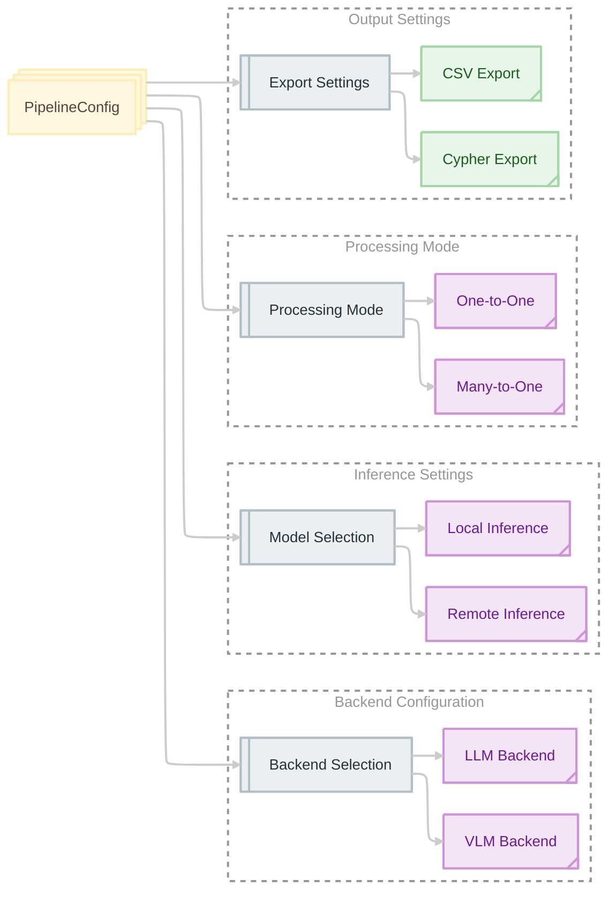

---


<!-- ===== FILE: docs/assets/flowcharts/conversion_process.md ===== -->
# `docs/assets/flowcharts/conversion_process.md`

```mermaid
%%{init: {'theme': 'redux-dark', 'look': 'default', 'layout': 'elk'}}%%
flowchart LR
    %% 1. Define Classes
    classDef input fill:#E3F2FD,stroke:#90CAF9,color:#0D47A1
    classDef config fill:#FFF8E1,stroke:#FFECB3,color:#5D4037
    classDef output fill:#E8F5E9,stroke:#A5D6A7,color:#1B5E20
    classDef decision fill:#FFE0B2,stroke:#FFB74D,color:#E65100
    classDef data fill:#EDE7F6,stroke:#B39DDB,color:#4527A0
    classDef operator fill:#F3E5F5,stroke:#CE93D8,color:#6A1B9A
    classDef process fill:#ECEFF1,stroke:#B0BEC5,color:#263238

    %% 2. Define Nodes
    A@{ shape: terminal, label: "Pydantic Models" }
    
    B@{ shape: lin-proc, label: "Pre-register Models" }
    C@{ shape: procs, label: "Create Nodes" }
    D@{ shape: procs, label: "Create Edges" }
    
    E@{ shape: tag-proc, label: "Auto Cleanup" }
    F@{ shape: tag-proc, label: "Validate Graph" }
    G@{ shape: tag-proc, label: "Calculate Stats" }
    
    H@{ shape: doc, label: "NetworkX Graph" }

    %% 3. Define Connections
    A --> B
    B --> C
    C --> D
    D --> E
    E --> F
    F --> G
    G --> H

    %% 4. Apply Classes
    class A input
    class B,C,D process
    class E,F,G operator
    class H output
```

---


<!-- ===== FILE: docs/assets/flowcharts/delta_extraction.md ===== -->
# `docs/assets/flowcharts/delta_extraction.md`

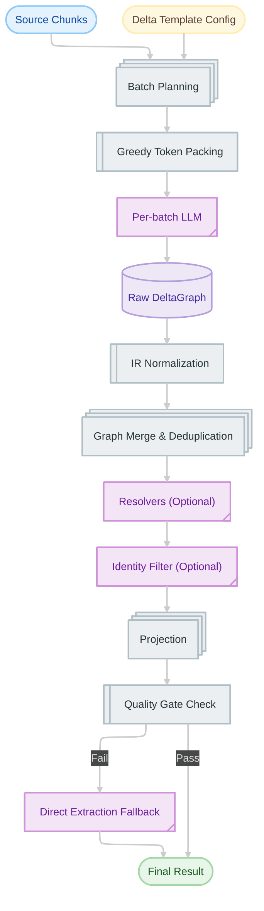

---


<!-- ===== FILE: docs/assets/flowcharts/doc_chunker.md ===== -->
# `docs/assets/flowcharts/doc_chunker.md`


---


<!-- ===== FILE: docs/assets/flowcharts/exporters.md ===== -->
# `docs/assets/flowcharts/exporters.md`

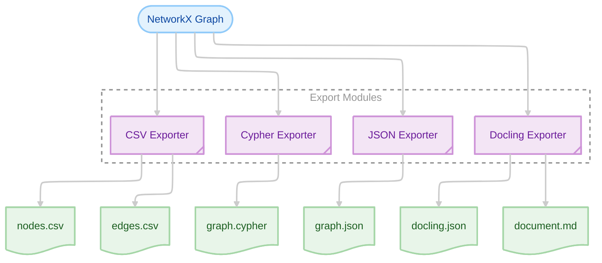

---


<!-- ===== FILE: docs/assets/flowcharts/extension_points.md ===== -->
# `docs/assets/flowcharts/extension_points.md`

%%{init: {'theme': 'redux-dark', 'look': 'default', 'layout': 'elk'}}%%
flowchart TB
    %% 1. Define Classes
    classDef input fill:#E3F2FD,stroke:#90CAF9,color:#0D47A1
    classDef config fill:#FFF8E1,stroke:#FFECB3,color:#5D4037
    classDef output fill:#E8F5E9,stroke:#A5D6A7,color:#1B5E20
    classDef decision fill:#FFE0B2,stroke:#FFB74D,color:#E65100
    classDef data fill:#EDE7F6,stroke:#B39DDB,color:#4527A0
    classDef operator fill:#F3E5F5,stroke:#CE93D8,color:#6A1B9A
    classDef process fill:#ECEFF1,stroke:#B0BEC5,color:#263238

    %% 2. Define Nodes
    A@{ shape: terminal, label: "Input Source" }
    
    B@{ shape: lin-proc, label: "Custom Stage 1" }
    C@{ shape: procs, label: "Docling Conversion" }
    D@{ shape: tag-proc, label: "Custom Backend" }
    E@{ shape: procs, label: "Extraction" }
    F@{ shape: lin-proc, label: "Custom Stage 2" }
    G@{ shape: procs, label: "Graph Conversion" }
    H@{ shape: tag-proc, label: "Custom Exporter" }
    
    I@{ shape: doc, label: "Output" }

    %% 3. Define Connections
    A --> B
    B --> C
    C --> D
    D --> E
    E --> F
    F --> G
    G --> H
    H --> I

    %% 4. Apply Classes
    class A input
    class B,F config
    class C,E,G process
    class D,H operator
    class I output
```

---


<!-- ===== FILE: docs/assets/flowcharts/extraction_flow.md ===== -->
# `docs/assets/flowcharts/extraction_flow.md`

%%{init: {'theme': 'redux-dark', 'look': 'default', 'layout': 'elk'}}%%
flowchart TD
    %% 1. Define Classes
    classDef input fill:#E3F2FD,stroke:#90CAF9,color:#0D47A1
    classDef config fill:#FFF8E1,stroke:#FFECB3,color:#5D4037
    classDef output fill:#E8F5E9,stroke:#A5D6A7,color:#1B5E20
    classDef decision fill:#FFE0B2,stroke:#FFB74D,color:#E65100
    classDef data fill:#EDE7F6,stroke:#B39DDB,color:#4527A0
    classDef operator fill:#F3E5F5,stroke:#CE93D8,color:#6A1B9A
    classDef process fill:#ECEFF1,stroke:#B0BEC5,color:#263238

    %% 2. Define Nodes
    Start@{ shape: terminal, label: "Input Source" }
    
    Normalize@{ shape: procs, label: "Input Normalization" }
    CheckInput{"Input Type"}
    
    Convert@{ shape: procs, label: "Document Conversion<br/>PDF/Image" }
    TextProc@{ shape: lin-proc, label: "Text Processing<br/>Text/Markdown" }
    LoadDoc@{ shape: lin-proc, label: "Load DoclingDocument<br/>Skip to Graph" }
    
    CheckMode{"Process. Mode"}
    CheckChunk{"Chunking?"}
    
    PageExtract@{ shape: lin-proc, label: "Page-by-Page Extraction" }
    FullDoc@{ shape: lin-proc, label: "Full Document Extraction" }
    
    Chunk@{ shape: tag-proc, label: "Structure-Aware Chunking" }
    Batch@{ shape: tag-proc, label: "Batch Chunks" }
    
    Extract@{ shape: procs, label: "Extract from Batches" }
    
    CheckMerge{"Multiple Models?"}
    
    Merge@{ shape: lin-proc, label: "Programmatic Merge" }
    Single@{ shape: doc, label: "Single Model" }
    
    CheckConsol{"Consolidation?"}
    Consol@{ shape: procs, label: "LLM Consolidation" }
    
    Final@{ shape: doc, label: "Final Model" }
    Graph@{ shape: db, label: "Knowledge Graph" }

    %% 3. Define Connections
    Start --> Normalize
    Normalize --> CheckInput
    
    CheckInput -- "PDF/Image" --> Convert
    CheckInput -- "Text/Markdown" --> TextProc
    CheckInput -- "DoclingDocument" --> LoadDoc
    
    Convert --> CheckMode
    TextProc --> CheckMode
    
    LoadDoc --> Graph
    
    CheckMode -- Many-to-One --> CheckChunk
    CheckMode -- One-to-One --> PageExtract
    
    CheckChunk -- Yes --> Chunk
    CheckChunk -- No --> FullDoc
    
    Chunk --> Batch
    Batch --> Extract
    
    FullDoc --> Extract
    PageExtract --> Extract
    
    Extract --> CheckMerge
    CheckMerge -- Yes --> Merge
    CheckMerge -- No --> Single
    
    Merge --> CheckConsol
    CheckConsol -- Yes --> Consol
    CheckConsol -- No --> Final
    
    Consol --> Final
    Single --> Final
    Final --> Graph

    %% 4. Apply Classes
    class Start input
    class Normalize,Convert,Extract,Consol process
    class TextProc,LoadDoc,PageExtract,FullDoc,Merge process
    class Chunk,Batch operator
    class CheckInput,CheckMode,CheckChunk,CheckMerge,CheckConsol decision
    class Single data
    class Final,Graph output
```

---


<!-- ===== FILE: docs/assets/flowcharts/four_stage_pipeline.md ===== -->
# `docs/assets/flowcharts/four_stage_pipeline.md`

```mermaid
%%{init: {'theme': 'redux-dark', 'look': 'default', 'layout': 'elk'}}%%
flowchart LR
    %% 1. Define Classes
    classDef input fill:#E3F2FD,stroke:#90CAF9,color:#0D47A1
    classDef config fill:#FFF8E1,stroke:#FFECB3,color:#5D4037
    classDef output fill:#E8F5E9,stroke:#A5D6A7,color:#1B5E20
    classDef decision fill:#FFE0B2,stroke:#FFB74D,color:#E65100
    classDef data fill:#EDE7F6,stroke:#B39DDB,color:#4527A0
    classDef operator fill:#F3E5F5,stroke:#CE93D8,color:#6A1B9A
    classDef process fill:#ECEFF1,stroke:#B0BEC5,color:#263238

    %% 2. Define Nodes
    A@{ shape: terminal, label: "Input Source" }
    
    A1@{ shape: tag-proc, label: "Input Normalization" }
    B@{ shape: procs, label: "Conversion" }
    C@{ shape: tag-proc, label: "Chunking" }
    D@{ shape: procs, label: "Extraction" }
    E@{ shape: lin-proc, label: "Merging" }
    
    F@{ shape: db, label: "Knowledge Graph" }

    %% 3. Define Connections
    A --> A1
    A1 --> B
    B --> C
    C --> D
    D --> E
    E --> F

    %% 4. Apply Classes
    class A input
    class A1,C operator
    class B,D,E process
    class F output
```

---


<!-- ===== FILE: docs/assets/flowcharts/graph_converter.md ===== -->
# `docs/assets/flowcharts/graph_converter.md`


---


<!-- ===== FILE: docs/assets/flowcharts/graph_pipeline.md ===== -->
# `docs/assets/flowcharts/graph_pipeline.md`

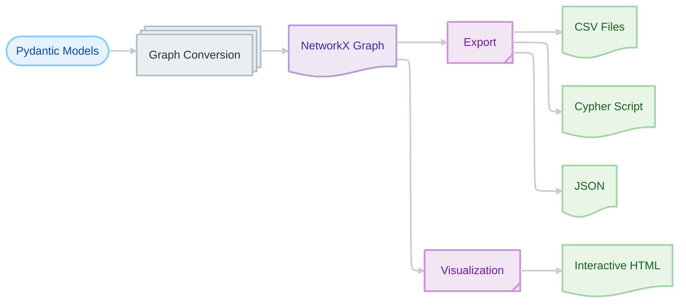

---


<!-- ===== FILE: docs/assets/flowcharts/input_normalization.md ===== -->
# `docs/assets/flowcharts/input_normalization.md`

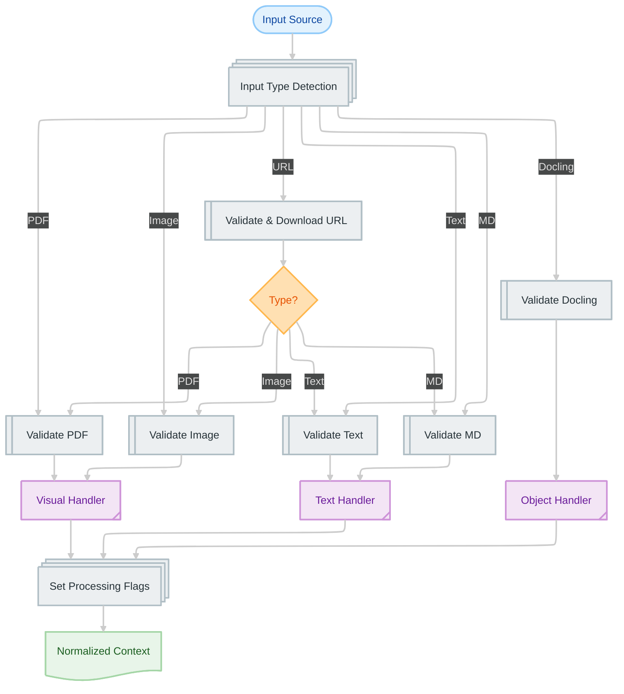

---


<!-- ===== FILE: docs/assets/flowcharts/llm_backend.md ===== -->
# `docs/assets/flowcharts/llm_backend.md`


---


<!-- ===== FILE: docs/assets/flowcharts/llm_clients.md ===== -->
# `docs/assets/flowcharts/llm_clients.md`

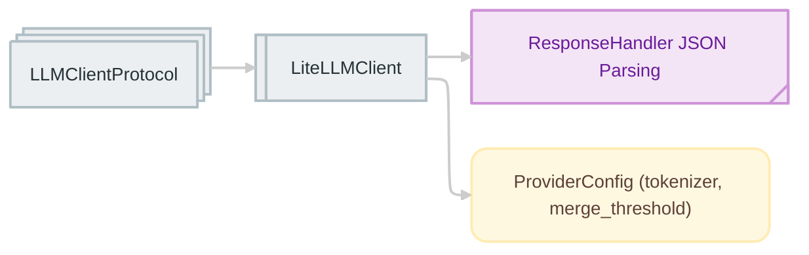

---


<!-- ===== FILE: docs/assets/flowcharts/llm_consolidation.md ===== -->
# `docs/assets/flowcharts/llm_consolidation.md`

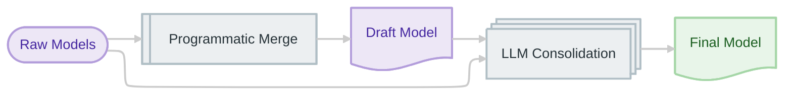

---


<!-- ===== FILE: docs/assets/flowcharts/many_to_one_mode.md ===== -->
# `docs/assets/flowcharts/many_to_one_mode.md`

```mermaid
%%{init: {'theme': 'redux-dark', 'look': 'default', 'layout': 'elk'}}%%
flowchart LR
    %% 1. Define Classes
    classDef input fill:#E3F2FD,stroke:#90CAF9,color:#0D47A1
    classDef config fill:#FFF8E1,stroke:#FFECB3,color:#5D4037
    classDef output fill:#E8F5E9,stroke:#A5D6A7,color:#1B5E20
    classDef decision fill:#FFE0B2,stroke:#FFB74D,color:#E65100
    classDef data fill:#EDE7F6,stroke:#B39DDB,color:#4527A0
    classDef operator fill:#F3E5F5,stroke:#CE93D8,color:#6A1B9A
    classDef process fill:#ECEFF1,stroke:#B0BEC5,color:#263238

    %% 2. Define Nodes
    A@{ shape: terminal, label: "PDF Document" }
    
    B@{ shape: doc, label: "All Pages" }
    C@{ shape: tag-proc, label: "Chunking" }
    D@{ shape: procs, label: "Extract Chunks" }
    E@{ shape: lin-proc, label: "Merge Results" }
    
    F@{ shape: procs, label: "Single Model" }

    %% 3. Define Connections
    A --> B
    B --> C
    C --> D
    D --> E
    E --> F

    %% 4. Apply Classes
    class A input
    class B data
    class C operator
    class D,E process
    class F output
```

---


<!-- ===== FILE: docs/assets/flowcharts/model_decision_tree.md ===== -->
# `docs/assets/flowcharts/model_decision_tree.md`

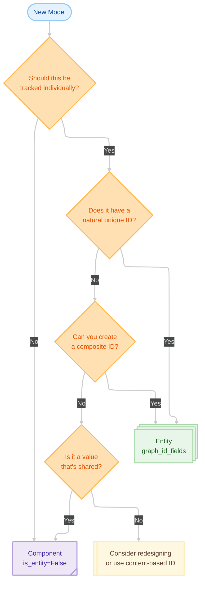

---


<!-- ===== FILE: docs/assets/flowcharts/ocr_pipeline.md ===== -->
# `docs/assets/flowcharts/ocr_pipeline.md`


---


<!-- ===== FILE: docs/assets/flowcharts/one_to_one_mode.md ===== -->
# `docs/assets/flowcharts/one_to_one_mode.md`

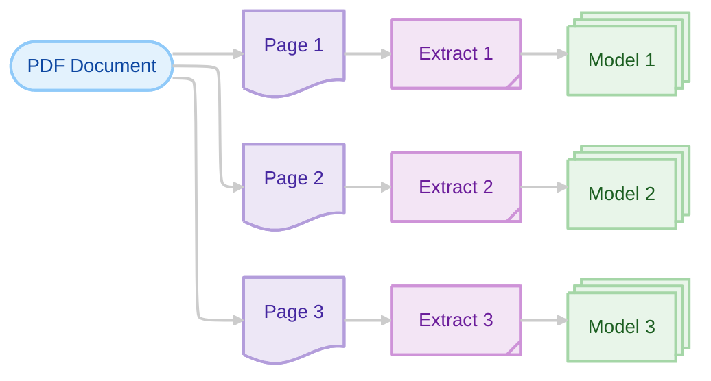

---


<!-- ===== FILE: docs/assets/flowcharts/pipeline_flow.md ===== -->
# `docs/assets/flowcharts/pipeline_flow.md`

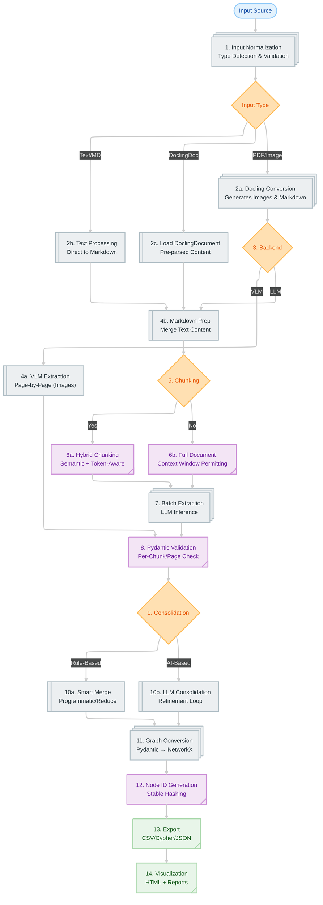

---


<!-- ===== FILE: docs/assets/flowcharts/pipeline_stages.md ===== -->
# `docs/assets/flowcharts/pipeline_stages.md`

```mermaid
%%{init: {'theme': 'redux-dark', 'look': 'default', 'layout': 'elk'}}%%
flowchart LR
    %% 1. Define Classes
    classDef input fill:#E3F2FD,stroke:#90CAF9,color:#0D47A1
    classDef config fill:#FFF8E1,stroke:#FFECB3,color:#5D4037
    classDef output fill:#E8F5E9,stroke:#A5D6A7,color:#1B5E20
    classDef decision fill:#FFE0B2,stroke:#FFB74D,color:#E65100
    classDef data fill:#EDE7F6,stroke:#B39DDB,color:#4527A0
    classDef operator fill:#F3E5F5,stroke:#CE93D8,color:#6A1B9A
    classDef process fill:#ECEFF1,stroke:#B0BEC5,color:#263238

    %% 2. Define Nodes
    A("1. Install")
    
    B@{ shape: lin-proc, label: "2. Define Schema" }
    C@{ shape: lin-proc, label: "3. Configure Pipeline" }
    
    D@{ shape: procs, label: "4. Extract Data" }
    E@{ shape: procs, label: "5. Build Graph" }
    
    F@{ shape: tag-proc, label: "6. Export & Visualize" }

    %% 3. Define Connections
    A --> B
    B --> C
    C --> D
    D --> E
    E --> F

    %% 4. Apply Classes
    class A input
    class B,C config
    class D,E process
    class F output
```

---


<!-- ===== FILE: docs/assets/flowcharts/processing_mode_tree.md ===== -->
# `docs/assets/flowcharts/processing_mode_tree.md`

```mermaid
%%{init: {'theme': 'redux-dark', 'look': 'default', 'layout': 'elk'}}%%
flowchart TD
    %% 1. Define Classes
    classDef input fill:#E3F2FD,stroke:#90CAF9,color:#0D47A1
    classDef config fill:#FFF8E1,stroke:#FFECB3,color:#5D4037
    classDef output fill:#E8F5E9,stroke:#A5D6A7,color:#1B5E20
    classDef decision fill:#FFE0B2,stroke:#FFB74D,color:#E65100
    classDef data fill:#EDE7F6,stroke:#B39DDB,color:#4527A0
    classDef operator fill:#F3E5F5,stroke:#CE93D8,color:#6A1B9A
    classDef process fill:#ECEFF1,stroke:#B0BEC5,color:#263238

    %% 2. Define Nodes
    A("Start")
    
    B{"Are pages<br/>independent?"}
    D{"Single entity<br/>across pages?"}
    F{"Need page-level<br/>tracking?"}
    
    C@{ shape: tag-proc, label: "One-to-One" }
    E@{ shape: tag-proc, label: "Many-to-One" }

    %% 3. Define Connections
    A --> B
    
    B -- Yes --> C
    B -- No --> D
    
    D -- Yes --> E
    D -- No --> F
    
    F -- Yes --> C
    F -- No --> E

    %% 4. Apply Classes
    class A input
    class B,D,F decision
    class C,E output
```

---


<!-- ===== FILE: docs/assets/flowcharts/programmatic_merge.md ===== -->
# `docs/assets/flowcharts/programmatic_merge.md`

```mermaid
%%{init: {'theme': 'redux-dark', 'look': 'default', 'layout': 'elk'}}%%
flowchart LR
    %% 1. Define Classes
    classDef input fill:#E3F2FD,stroke:#90CAF9,color:#0D47A1
    classDef config fill:#FFF8E1,stroke:#FFECB3,color:#5D4037
    classDef output fill:#E8F5E9,stroke:#A5D6A7,color:#1B5E20
    classDef decision fill:#FFE0B2,stroke:#FFB74D,color:#E65100
    classDef data fill:#EDE7F6,stroke:#B39DDB,color:#4527A0
    classDef operator fill:#F3E5F5,stroke:#CE93D8,color:#6A1B9A
    classDef process fill:#ECEFF1,stroke:#B0BEC5,color:#263238

    %% 2. Define Nodes
    A@{ shape: terminal, label: "Model 1" }
    B@{ shape: terminal, label: "Model 2" }
    C@{ shape: terminal, label: "Model 3" }
    
    D@{ shape: lin-proc, label: "Deep Merge" }
    E@{ shape: tag-proc, label: "Deduplicate" }
    F@{ shape: tag-proc, label: "Validate" }
    
    G@{ shape: doc, label: "Final Model" }

    %% 3. Define Connections
    A & B & C --> D
    
    D --> E
    E --> F
    F --> G

    %% 4. Apply Classes
    class A,B,C data
    class D process
    class E,F operator
    class G output
```

---


<!-- ===== FILE: docs/assets/flowcharts/staged_extraction.md ===== -->
# `docs/assets/flowcharts/staged_extraction.md`

```mermaid
%%{init: {'theme': 'redux-dark', 'look': 'default', 'layout': 'elk',
  'themeVariables': {'loopTextColor': '#ADADAD', 'signalColor': '#ADADAD', 'signalTextColor': '#ADADAD', 'actorBkg': '#CCCCCC', 'actorBorder': '#ADADAD'}
}}%%
sequenceDiagram
  participant Doc as Document
  participant Catalog as Catalog
  participant LLM as LLM
  participant Orch as Orchestrator
  participant Fill as Fill_Pass
  participant Merge as Merge

  Doc->>Catalog: Template
  Catalog->>Orch: Node specs (path, id_fields, parent rules)
  loop Sequential ID shards
    Orch->>LLM: ID pass shard (paths + doc)
    LLM->>Orch: nodes(path, ids, parent)
  end
  Orch->>Orch: Validate and dedupe skeleton
  Orch->>Fill: Build per-path batches (bottom-up)
  loop Fill calls (parallel with parallel_workers)
    Fill->>LLM: Fill(path, descriptors, schema, doc)
    LLM->>Fill: Filled objects
  end
  Fill->>Merge: path_filled + descriptors
  Merge->>Merge: Attach by path+ids and parent path+ids
```

---


<!-- ===== FILE: docs/assets/flowcharts/vision_pipeline.md ===== -->
# `docs/assets/flowcharts/vision_pipeline.md`

```mermaid
%%{init: {'theme': 'redux-dark', 'look': 'default', 'layout': 'elk'}}%%
flowchart LR
    %% 1. Define Classes
    classDef input fill:#E3F2FD,stroke:#90CAF9,color:#0D47A1
    classDef config fill:#FFF8E1,stroke:#FFECB3,color:#5D4037
    classDef output fill:#E8F5E9,stroke:#A5D6A7,color:#1B5E20
    classDef decision fill:#FFE0B2,stroke:#FFB74D,color:#E65100
    classDef data fill:#EDE7F6,stroke:#B39DDB,color:#4527A0
    classDef operator fill:#F3E5F5,stroke:#CE93D8,color:#6A1B9A
    classDef process fill:#ECEFF1,stroke:#B0BEC5,color:#263238

    %% 2. Define Nodes
    A@{ shape: terminal, label: "Images / PDF Document" }
    
    B@{ shape: doc, label: "Page Images" }
    C@{ shape: procs, label: "VLM Processing" }
    D@{ shape: lin-proc, label: "Visual Understanding" }
    
    E@{ shape: doc, label: "Structured Output" }

    %% 3. Define Connections
    A --> B
    B --> C
    C --> D
    D --> E

    %% 4. Apply Classes
    class A input
    class B data
    class C,D process
    class E output
```

---


<!-- ===== FILE: docs/assets/flowcharts/vlm_backend.md ===== -->
# `docs/assets/flowcharts/vlm_backend.md`

```mermaid
%%{init: {'theme': 'redux-dark', 'look': 'default', 'layout': 'elk'}}%%
flowchart LR
    %% 1. Define Classes
    classDef input fill:#E3F2FD,stroke:#90CAF9,color:#0D47A1
    classDef config fill:#FFF8E1,stroke:#FFECB3,color:#5D4037
    classDef output fill:#E8F5E9,stroke:#A5D6A7,color:#1B5E20
    classDef decision fill:#FFE0B2,stroke:#FFB74D,color:#E65100
    classDef data fill:#EDE7F6,stroke:#B39DDB,color:#4527A0
    classDef operator fill:#F3E5F5,stroke:#CE93D8,color:#6A1B9A
    classDef process fill:#ECEFF1,stroke:#B0BEC5,color:#263238

    %% 2. Define Nodes
    InputPDF@{ shape: terminal, label: "PDF Document" }
    InputImg@{ shape: terminal, label: "Images" }
    
    Convert@{ shape: procs, label: "PDF to Image<br>Conversion" }
    PageImgs@{ shape: doc, label: "Page Images" }
    
    VLM@{ shape: procs, label: "VLM Processing" }
    Understand@{ shape: lin-proc, label: "Visual Understanding" }
    Extract@{ shape: tag-proc, label: "Direct Extraction" }
    
    Output@{ shape: doc, label: "Pydantic Models" }

    %% 3. Define Connections
    %% Path A: PDF requires conversion
    InputPDF --> Convert
    Convert --> PageImgs
    PageImgs --> VLM
    
    %% Path B: Direct Image Input (Merges here)
    InputImg --> VLM
    
    %% Shared Processing Chain
    VLM --> Understand
    Understand --> Extract
    Extract --> Output

    %% 4. Apply Classes
    class InputPDF,InputImg input
    class Convert,VLM,Understand process
    class PageImgs data
    class Extract operator
    class Output output
```

---
